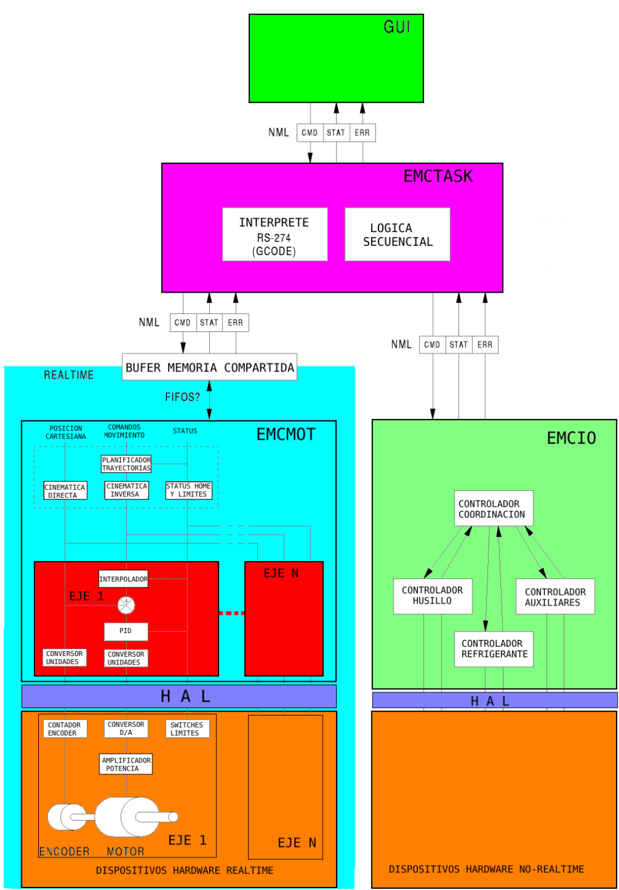
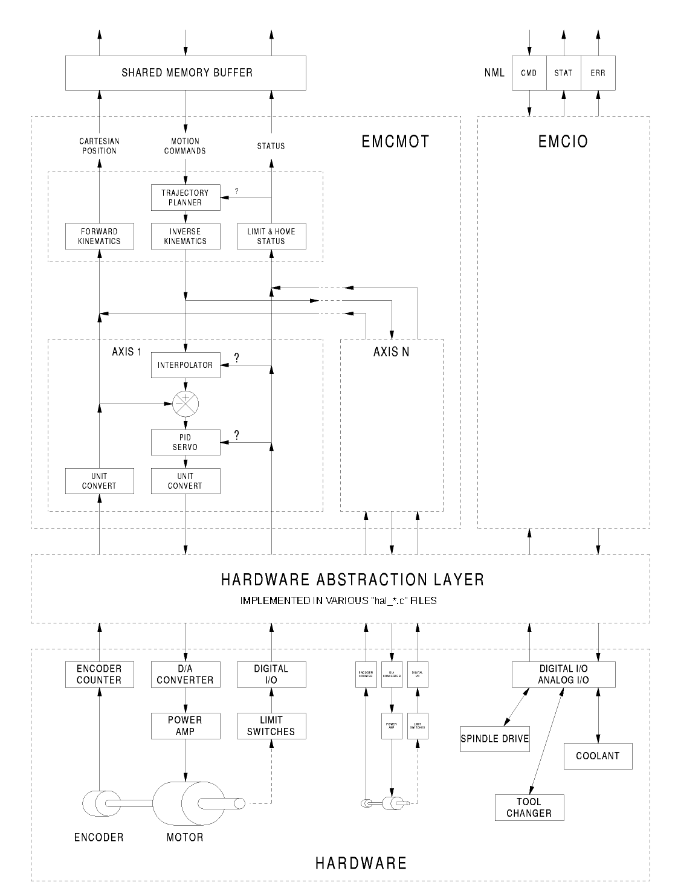
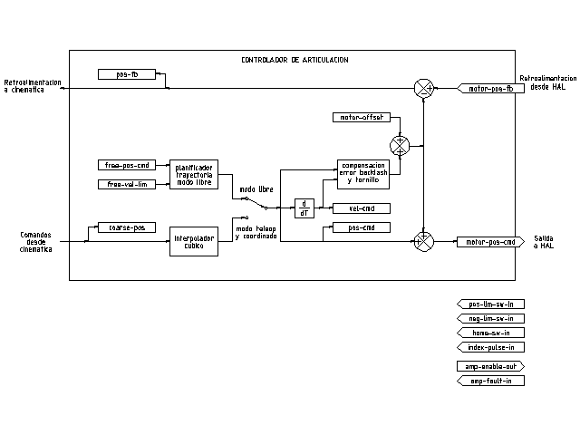
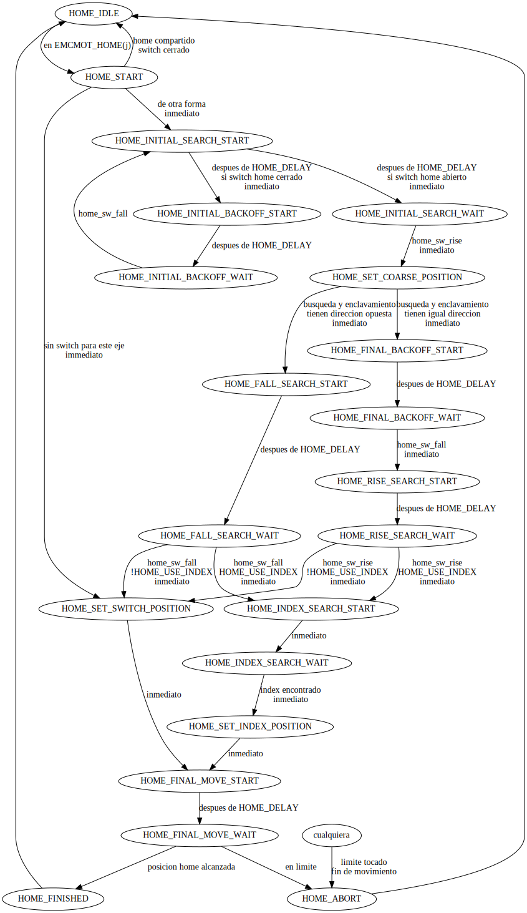
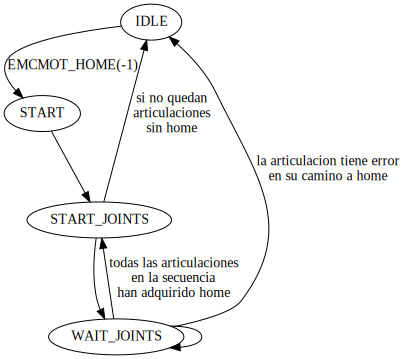
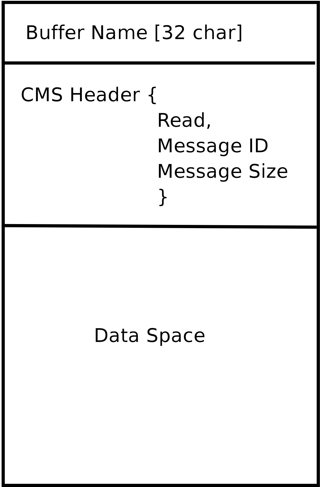

[[cha:code-notes]]
:lang: es

= Notas sobre el código

== Audiencia 

Este documento es una colección de notas sobre los aspectos internos de LinuxCNC.
Tiene principalmente interés para los desarrolladores. Sin embargo, gran parte de la información
también puede ser de interés para integradores de sistemas u otros que estén
simplemente interesados sobre cómo funciona LinuxCNC. Mucha de esta información está ahora
desactualizada y nunca ha sido revisada su precisión.

== Organización

Habrá un capítulo para cada uno de los componentes principales de LinuxCNC, así como
capítulos que cubren cómo esos componentes trabajan juntos. Este documento es
un trabajo en progreso y su diseño puede cambiar en el futuro.

== Términos y definiciones

* 'EJE': un eje es uno de los nueve grados de libertad que define la posición
    de una herramienta en el espacio cartesiano tridimensional. Los nueve ejes son
    referidos como X, Y, Z, A, B, C, U, V y W. Las coordenadas lineales ortogonales
    X, Y y Z determinan dónde está posicionada la punta de la herramienta.
    Las coordenadas angulares A, B y C determinan la orientación de la herramienta.
    Un segundo conjunto de coordenadas lineales ortogonales U, V y W
    permite el movimiento de la herramienta (generalmente para acciones de corte) en relación con los
    ejes previamente desplazados y rotados.
    Lamentablemente, "eje" se usa a veces para significar un grado de libertad de la máquina en sí,
    como los carros longitudinal y transversal o el avance fino del husillo de una fresadora vertical. 
    En estas maquinas, esto no causa confusión ya que, por ejemplo, el movimiento de la mesa
    corresponde directamente al movimiento a lo largo del eje X. Sin embargo, las
    articulaciones de hombro y codo de un brazo robótico y los actuadores lineales de un
    hexápodo no se corresponde al movimiento a lo largo de ningún eje cartesiano y en
    en general es importante hacer la distinción entre el eje cartesiano
    y grados de libertad de la máquina. En este documento, esto último
    se llamarán 'articulaciones', no ejes. (Las GUI y algunas otras partes de
    el código no siempre sigue esta distinción, pero las partes internas de
    el controlador de movimiento si lo hacen.)

* 'ARTICULACIÓN': una articulación es cada una de las partes móviles de la máquina. Las articulaciones son
    distintas de los ejes, aunque los dos términos a veces se usan (incorrectamente) para
    significa lo mismo. En LinuxCNC, una articulación es un objeto físico que puede ser
    movido, no una coordenada en el espacio. Por ejemplo, todos los carros, la palanca del husillo o un plato giratorio
    de una fresadora vertical son articulaciones. El hombro, el codo y
    la muñeca de un brazo robótico son articulaciones, al igual que los actuadores lineales de un
    hexápodo. Cada articulación tiene un motor o actuador de algún tipo asociado
    con ella. Las articulaciones no corresponden necesariamente a los ejes X, Y y Z,
    aunque para máquinas con cinemática trivial, puede ser el caso.
    Incluso en esas máquinas, la posición articular y la posición del eje son
    cosas inherentemente diferentes. En este documento, los términos 'articulación' y 'eje' 
    se utilizan con cuidado para respetar sus distintos significados.
    Desafortunadamente, eso no es necesariamente cierto en ningún otro lado. En
    en particular, las GUI para máquinas con cinemática trivial pueden pasar por alto o
    oculta completamente la distinción entre articulaciones y ejes. Adicionalmente,
    el archivo ini usa el término 'eje' para datos que serían más precisos
    describirse como datos de articulaciones, como las escalas de entrada y salida, etc.

	N.T. En la version 2.8 de Linuxcnc ya se hace esta distinción. 
    El archivo .ini cuenta con la nueva sección [JOINT_<num>]. Muchos de los parámetros que antes
	eran propios de la sección [AXIS_<letter>] están ahora en la nueva sección. Otras secciones,
    como por ejemplo [KINS], también adquieren nuevos parámetros para ajustarse a esto. 
    Se ha previsto un mecanismo para transformar archivos .ini antiguos a la nueva configuración
    ejes/articulaciones.

* 'POSE'- una pose es una posición completamente especificada en un espacio cartesiano 3-D. En
    el controlador de movimiento LinuxCNC, cuando nos referimos a una pose nos referimos a una
    estructura EmcPose, que contiene seis coordenadas lineales (X, Y, Z, U,
    V y W) y tres angulares (A, B y C).

* 'coord', o modo coordinado, significa que todas las articulaciones están sincronizadas y se
	mueven juntas según lo ordenado por el código de nivel superior. Es el modo normal al mecanizar.
	En el modo coordinado, se supone que los comandos se dan en el marco de referencia cartesiano, 
	y si la máquina no es cartesiana, los comandos son traducidos por la cinemática para impulsar 
	cada articulación en el espacio articular según sea necesario.

* 'free', o modo libre, significa que los comandos se interpretan en el espacio articular.
	Se usa para mover manualmente (jog) articulaciones individuales, aunque no impide que se muevan 
	múltiples articulaciones a la vez (creo).
	El homing también se realiza en modo libre; de hecho, las máquinas con cinemática no trivial
	deben ser homeadas antes de que puedan pasar al modo coord o teleop.

* 'teleop' es el modo que probablemente necesite si está haciendo 'jogging' con un hexápodo. 
	Los comandos de jog implementados por el controlador de movimiento son jogs articulares, que
	funcionan en modo free. Pero si desea mover un hexápodo o una máquina similar a lo largo de un 
	eje cartesiano en particular, debe operar más de una articulación. Para eso está 'teleop'.

== Descripción general de la arquitectura

Hay cuatro componentes contenidos en la Arquitectura LinuxCNC: un controlador de
movimiento (EMCMOT), un controlador de E/S discreto (EMCIO), un ejecutor de tareas
que los coordina (EMCTASK) y varios interfaces de usuario en modos texto y gráficos.
Cada uno de ellos se describirá en el presente documento, tanto desde el punto de
vista del diseño como del punto de vista de los desarrolladores
(dónde encontrar los datos necesarios, cómo ampliar/modificar cosas fácilmente, etc.).

== Arquitectura del software LinuxCNC.
 
Al nivel más general, LinuxCNC es un jerarquía de tres controladores: el manejador
de comandos a nivel de tarea y programa intérprete, el controlador de movimiento y el
controlador de E/S discretas.
El controlador de E/S discretas se implementa como una jerarquía de controladores,
en este caso para husillo, refrigerante y subsistemas auxiliares (p. ej., Estop, lubricante).
El controlador de tareas coordina las acciones del controlador de movimiento y del
controlador de E/S discretas. Sus acciones están programadas en 
programas de control numérico "código G y M" convencional, que son interpretados por
el controlador de tareas en mensajes NML y enviados al controlador de movimiento o
de E/S discretas en los momentos apropiados.

== Introducción al controlador de movimiento

El controlador de movimiento recibe comandos de los módulos de espacio de usuario a través de
memoria compartida y ejecuta esos comandos en tiempo real.
El estado del controlador está disponible para los módulos de espacio de usuario
a través de la misma área de memoria compartida. El controlador de movimiento interactúa
con los motores y otro hardware utilizando HAL (Capa de Abstracción de Hardware).
Este documento asume que el lector tiene una comprensión básica
de HAL, y comprende términos como pines HAL, señales HAL, etc., por lo que no se
explican. Para obtener más información sobre HAL, consulte el
Manual HAL. Otro capítulo de este documento entrará
eventualmente en las interioridades del propio HAL, pero en este
capítulo, solo usamos la API HAL, definida en src/hal/hal.h.

== Diagrama de bloque y flujo de datos

La siguiente figura es un diagrama de bloques
de un controlador articular. Hay un controlador por articulación.
Los controladores articulares funcionan a un nivel más bajo que la cinemática; un nivel
donde todas las articulaciones son completamente independientes. Todos los datos para una articulación
está en una sola estructura articular. Algunos miembros de esa estructura son
visible en el diagrama de bloques, como coarse_pos, pos_cmd y motor_pos_fb.

.Diagrama de bloque del controlador articular

La figura anterior muestra cinco de los
siete conjuntos de información de posición que forman el flujo principal de datos a través del
controlador de movimiento. Las siete formas de datos de posición son las siguientes:

. 'emcmotStatus\->carte_pos_cmd' - Esta es la posición deseada, en
   coordenadas cartesianas. Se actualiza a tasa traj, no a tasa servo.
   En modo coord, se determina por el planificador traj. En modo teleop, está
   determinado por el planificador traj?. En modo libre, es
   copiado de actualPos, o generado mediante la aplicación de cinemática directa a (2) o (3)
. 'emcmotStatus\->joints[n].coarse_pos' - Esta es la posición deseada, en
   coordenadas articulares, pero antes de interpolación. Se actualiza a tasa traj,
   no a tasa servo. En modo coord, se genera aplicando
   cinematica inversa a (1). En modo teleop, se genera aplicando cinemática inversa a (1).
   En modo libre, creo que se copia de (3).
. 'emcmotStatus\->joints[n].pos_cmd' - Esta es la posición deseada, en
   coordenadas articulares, después de interpolación. En cada período servo, se genera
   un nuevo conjunto de estas coordenadas. En modo coord, se genera a partir de (2)
   por el interpolador. En modo teleop, se genera a partir de (2) por el
   interpolador. En modo libre, es generado por el planificador traj de modo libre.
. 'emcmotStatus\->joints[n].motor_pos_cmd' - Esta es la posición deseada,
   en coordenadas de motor. Las coordenadas del motor se generan agregando
   compensación backlash, compensación de error del tornillo de avance y offset (para homing) a
   (3). Se genera de la misma manera independientemente del modo, y es la
   salida al lazo PID u otro bucle de posición.
. 'emcmotStatus\->joints[n].motor_pos_fb' - Esta es la posición real, en
   en coordenadas de motor. Es la entrada de codificadores u otro dispositivo de retroalimentación
   (o desde codificadores virtuales en máquinas de bucle abierto). Es "generado" por
   la lectura del dispositivo de retroalimentación.
. 'emcmotStatus\->joints[n].pos_fb': esta es la posición real, en
   coordenadas articulares. Se genera restando offsets, compensación de error del tornillo de avance
   y compensación de backlash de (5). Se genera
   del mismo modo, independientemente del modo operativo.
. 'emcmotStatus\->carte_pos_fb' - Esta es la posición real, en coordenadas cartesianas.
   Se actualiza a tasa traj, no a tasa servo.
   Idealmente, actualPos siempre se calcularía aplicando
   cinemática directa a (6). Sin embargo, la cinemática directa puede no estar disponible, o
   pueden ser inutilizable porque uno o más ejes no están homeados. En ese
   caso, las opciones son: A) fingirla, copiando (1), o B) admitir que
   realmente no se conocen las coordenadas cartesianas, y simplemente no actualizar
   actualPos. Cualquiera que sea el enfoque utilizado, no veo ninguna razón para no hacerlo
   de la misma manera, independientemente del modo de operación. Yo propondría lo
   siguiente; si hay cinemática directa, usarla, a menos que no funcionen
   debido a ejes sin home u otros problemas, en cuyo caso hacer (B). Si no hay cinemática directa,
   hacer (A), ya que de lo contrario actualPos _nunca_ obtendrá actualización.

== Homing

=== Diagrama de estado de homing

=== Otro diagrama de homing

== Comandos

Esta sección simplemente enumera todos los comandos que se pueden enviar al
módulo de movimiento, junto con explicaciones detalladas de lo que hacen. los
los nombres de los comandos se definen en cmd_code_t, que es un tipo definido por
una gran enumeración en {linuxcnc}/src/emc/motion/motion.h . (Tenga en cuenta que en el
código, cada nombre de comando comienza con 'EMCMOT_', que se omite aquí).

Los comandos se implementan mediante una gran instrucción switch en la
función emcmotCommandHandler() del archivo fuente src/emc/motion/command.c, que se llama a la tasa servo.
Más sobre esa función más adelante.
N.T. Esta ultima afirmación es erronea. No se vuelve a hablar de emcmotCommandHandler(), ni en este
texto, ni en el resto del Manual del Desarrollador. 

Hay aproximadamente 44 comandos: esta lista todavía está bajo construcción.

N.T. La enumeracion cmd_code_t, en motion.h, contiene 73 comandos (a 6-5-2020)
N.T. La instrucción switch en command.c contempla 70
N.T. Los comandos ENABLE_WATCHDOG / DISABLE_WATCHDOG están en motion-logger.c. Quizas sean obsoletos.
N.T. El comando SET_TELEOP_VECTOR solo aparece en motion-logger.c, sin mas efecto que su propio log.

=== ABORT

El comando ABORT simplemente detiene todo movimiento. Se puede emitir en cualquier
momento y siempre será aceptado. No deshabilita el controlador de movimiento
ni cambia ninguna información de estado; simplemente cancela cualquier
movimiento que esté actualmente en progreso. footnote:[Parece que el
código de nivel superior (TASK y superior) también usa ABORT para borrar fallos.
Siempre que haya un fallo persistente (como estar fuera de
interruptores hardware de límite), el código de nivel superior envía un constante
flujo de ABORT al controlador de movimiento en su intento de sobrepasar
el fallo. Miles de ellos ... Eso significa que el controlador de movimiento
debe evitar fallos persistentes. Esto necesita ser investigado.]
Actuá conforme al modo actual. En modo teleop, asigna cero a las velocidades deseadas. ???
En modo coordinado, llama a la función abort del planificador de trayectorias tpAbort()

==== Requisitos

Ninguno. El comando ABORT siempre se acepta y actúa inmediatamente.

==== Resultados

En modo libre, los planificadores de trayectoria de modo libre quedan deshabilitados. Esto
da como resultado que cada articulación se detenga tan rápido como su límite de aceleración (desaceleración)
permita. La parada no está coordinada. En modo teleop,
la velocidad cartesiana comandada se establece a cero. No sé exactamente qué tipo de
parada resulta (coordinada, descoordinada, etc.), pero lo resolveré
finalmente. En modo coord, se le dice al planificador de trayectoria del modo coord
que aborte el movimiento actual. De nuevo, no sé el resultado exacto de esto,
pero lo documentaré cuando lo resuelva.

=== FREE

El comando FREE pone el controlador de movimiento en modo libre. Modo libre
significa que cada articulación es independiente de todas las demás articulaciones. cartesiano
Las coordenadas, poses y cinemática se ignoran cuando está en modo libre. En
esencia, cada articulación tiene su propio planificador de trayectoria simple, y cada
articulación ignora por completo las otras articulaciones. Algunos comandos (como Joint
JOG y HOME) solo funcionan en modo libre. Otros comandos, incluso cualquier cosa
que trata con coordenadas cartesianas, no funciona en absoluto en modo libre.

==== Requisitos

El controlador de comandos no aplica requisitos al comando FREE,
Siempre será aceptado. Sin embargo, si alguna articulación está en movimiento
(GET_MOTION_INPOS_FLAG () == FALSE), entonces el comando será ignorado.
Este comportamiento está controlado por un código que ahora se encuentra en la función
'set_operating_mode ()' en control.c, ese código debe limpiarse.
Creo que el comando no debe ignorarse en silencio, sino que
El controlador de comandos debe determinar si se puede ejecutar y devolver
un error si no puede

==== Resultados

Si la máquina ya está en modo libre, nada. De lo contrario, el
La máquina se coloca en modo libre. La trayectoria del modo libre de cada articulación
el planificador se inicializa en la ubicación actual de la articulación, pero el
los planificadores no están habilitados y las articulaciones son estacionarias.

=== TELEOP

El comando TELEOP coloca la máquina en modo de teleoperación. En teleop
modo, el movimiento de la máquina se basa en coordenadas cartesianas utilizando
cinemática, en lugar de en articulaciones individuales como en modo libre. sin embargo
el planificador de trayectoria per se no se usa, en cambio el movimiento es
controlado por un vector de velocidad. El movimiento en modo teleop es muy parecido a
trotar, excepto que se hace en espacio cartesiano en lugar de articulación
espacio. En una máquina con cinemática trivial, hay poca diferencia
entre el modo teleop y el modo libre, y las GUI para esas máquinas podrían
Ni siquiera emita este comando. Sin embargo, para máquinas no triviales como
robots y hexápodos, el modo teleop se utiliza para la mayoría de los jog ordenados por el usuario
movimientos de tipo

==== Requisitos

El controlador de comandos rechazará el comando TELEOP con un error
mensaje si la cinemática no se puede activar porque uno o más
las articulaciones no han sido dirigidas. Además, si alguna articulación está en movimiento
(GET_MOTION_INPOS_FLAG () == FALSE), entonces el comando será ignorado
(sin mensaje de error). Este comportamiento está controlado por un código que es
ahora ubicado en la función 'set_operating_mode ()' en control.c. yo
cree que el comando no debe ser ignorado en silencio, sino el comando
El controlador debe determinar si se puede ejecutar y devolver un error
si no puede

==== Resultados

Si la máquina ya está en modo teleop, nada. De lo contrario el
la máquina se coloca en modo teleop. El código cinemático está activado,
los interpoladores son drenados y enjuagados, y la velocidad cartesiana
los comandos se ponen a cero.

=== COORD

El comando COORD coloca la máquina en modo coordinado. En coord
modo, el movimiento de la máquina se basa en coordenadas cartesianas utilizando
cinemática, en lugar de en articulaciones individuales como en modo libre. En
Además, el planificador de trayectoria principal se utiliza para generar movimiento, basado
en los comandos LINE, CIRCLE y / o PROBE en cola. El modo coord es el modo
que se usa al ejecutar un programa de código G.

==== Requisitos

El controlador de comandos rechazará el comando COORD con un error
mensaje si la cinemática no se puede activar porque uno o más
las articulaciones no han sido dirigidas. Además, si alguna articulación está en movimiento
(GET_MOTION_INPOS_FLAG () == FALSE), entonces el comando será ignorado
(sin mensaje de error). Este comportamiento está controlado por un código que es
ahora ubicado en la función 'set_operating_mode ()' en control.c. yo
cree que el comando no debe ser ignorado en silencio, sino el comando
El controlador debe determinar si se puede ejecutar y devolver un error
si no puede

==== Resultados

Si la máquina ya está en modo coord, nada. De lo contrario, el
La máquina se coloca en modo coord. El código cinemático está activado,
los interpoladores son drenados y enjuagados, y el planificador de trayectoria
las colas están vacías El planificador de trayectoria está activo y en espera de una LÍNEA,
CÍRCULO o comando SONDA.

=== ENABLE

El comando ENABLE habilita el controlador de movimiento.

==== Requisitos

Ninguna. El comando puede emitirse en cualquier momento y siempre será
aceptado.

==== Resultados

Si el controlador ya está habilitado, nada. Si no, el controlador
está habilitado. Las colas y los interpoladores se sonrojan. Cualquier movimiento o
las operaciones de referencia se terminan. Las salidas de habilitación de amplificador asociadas
con articulaciones activas se encienden. Si la cinemática hacia adelante no es
disponible, la máquina se cambia al modo libre.

=== DISABLE

El comando DISABLE deshabilita el controlador de movimiento.

==== Requisitos

Ninguna. El comando puede emitirse en cualquier momento y siempre será
aceptado.

==== Resultados

Si el controlador ya está deshabilitado, nada. Si no, el controlador
está desactivado. Las colas y los interpoladores se sonrojan. Cualquier movimiento o
las operaciones de referencia se terminan. Las salidas de habilitación de amplificador asociadas
con las articulaciones activas están apagadas. Si la cinemática hacia adelante no es
disponible, la máquina se cambia al modo libre.

=== ENABLE_AMPLIFIER (JOINT_ENABLE_AMPLIFIER)

El comando ENABLE_AMPLIFIER activa la salida de habilitación del amplificador para un
Amplificador de salida única, sin cambiar nada más. Puede ser usado para
habilitar un controlador de velocidad del husillo.

==== Requisitos

Ninguna. El comando puede emitirse en cualquier momento y siempre será
aceptado.

==== Resultados

Actualmente nada. (Una llamada a la antigua función extAmpEnable es
actualmente comentado). Eventualmente configurará el pin de habilitación del amplificador HAL
cierto.

=== DISABLE_AMPLIFIER (JOINT_DISABLE_AMPLIFIER)

El comando DISABLE_AMPLIFIER apaga la salida de habilitación del amplificador para un
Amplificador único, sin cambiar nada más. De nuevo, útil para
Controladores de velocidad del husillo.

==== Requisitos

Ninguna. El comando puede emitirse en cualquier momento y siempre será
aceptado.

==== Resultados

Actualmente nada. (Una llamada a la antigua función extAmpEnable es
actualmente comentado). Eventualmente configurará el pin de habilitación del amplificador HAL
falso.

=== ACTIVATE_JOINT (JOINT_ACTIVATE)

El comando ACTIVATE_JOINT activa todos los cálculos asociados.
con una sola articulación, pero no cambia la salida de habilitación del amplificador de la articulación
alfiler.

==== Requisitos

Ninguna. El comando puede emitirse en cualquier momento y siempre será
aceptado.

==== Resultados

Los cálculos para la articulación especificada están habilitados. El pin de habilitación del amplificador
no se cambia, sin embargo, cualquier comando ENABLE o DISABLE posterior
modificar el pin de habilitación del amplificador de la articulación.

=== DEACTIVATE_JOINT (JOINT_DEACTIVATE)

El comando DEACTIVATE_JOINT desactiva todos los cálculos asociados.
con una sola articulación, pero no cambia la salida de habilitación del amplificador de la articulación
alfiler.

==== Requisitos

Ninguna. El comando puede emitirse en cualquier momento y siempre será
aceptado.

==== Resultados

Los cálculos para la articulación especificada están habilitados. El pin de habilitación del amplificador
no se cambia, y los siguientes comandos ENABLE o DISABLE no
modifique el pin de habilitación del amplificador de la articulación.

=== ENABLE_WATCHDOG

El comando ENABLE_WATCHDOG habilita un perro guardián basado en hardware (si
presente).

==== Requisitos

Ninguna. El comando puede emitirse en cualquier momento y siempre será
aceptado.

==== Resultados

Actualmente nada. El viejo perro guardián era una cosa extraña que usaba una
tarjeta de sonido específica. Se puede diseñar una nueva interfaz de vigilancia en el
futuro.

=== DISABLE_WATCHDOG

El comando DISABLE_WATCHDOG deshabilita un perro guardián basado en hardware (si
presente).

==== Requisitos

Ninguna. El comando puede emitirse en cualquier momento y siempre será
aceptado.

==== Resultados

Actualmente nada. El viejo perro guardián era una cosa extraña que usaba un
Tarjeta de sonido específica. Se puede diseñar una nueva interfaz de vigilancia en el
futuro.

=== PAUSE

El comando PAUSE detiene el planificador de trayectoria. No tiene efecto en
modo libre o teleop. En este punto no sé si detiene todo el movimiento
inmediatamente, o si completa el movimiento actual y luego se detiene antes
tirando de otro movimiento de la cola.

==== Requisitos

Ninguna. El comando puede emitirse en cualquier momento y siempre será
aceptado.

==== Resultados

El planificador de trayectoria hace una pausa.

=== RESUME

El comando RESUME reinicia el planificador de trayectoria si está en pausa. Eso
no tiene efecto en modo libre o teleop, o si el planificador no está en pausa.

==== Requisitos

Ninguna. El comando puede emitirse en cualquier momento y siempre será
aceptado.

==== Resultados

Se reanuda el planificador de trayectoria.

=== STEP

El comando STEP reinicia el planificador de trayectoria si está en pausa, y
le dice al planificador que se detenga nuevamente cuando llegue a un punto específico. Eso
no tiene efecto en modo libre o teleop. En este punto no se
exactamente cómo funciona esto. Agregaré más documentación aquí cuando excave
más profundo en el planificador de trayectoria.

==== Requisitos

Ninguna. El comando puede emitirse en cualquier momento y siempre será
aceptado.

==== Resultados

El planificador de trayectoria se reanuda y luego se detiene cuando llega a un
punto específico.

=== SCALE (SPINDLE_SCALE para husillo, FEED_SCALE para avance, RAPID_SCALE para rapidos)

	N.T. El siguiente párrafo necesita nueva redacción

El comando SCALE escala todos los límites de velocidad y comandos por un
cantidad especificada Se utiliza para implementar la anulación de la velocidad de alimentación y otros
funciones similares El escalado funciona en modo libre, teleop y coord,
y afecta todo, incluidas las velocidades de referencia, etc. Sin embargo,
los límites individuales de velocidad conjunta no se ven afectados.

==== Requisitos

Ninguna. El comando puede emitirse en cualquier momento y siempre será
aceptado.

==== Resultados

Todos los comandos de velocidad son escalados por la constante especificada.

=== OVERRIDE_LIMITS

El comando OVERRIDE_LIMITS evita que los límites se disparen hasta que
Fin del siguiente comando JOG. Normalmente se usa para permitir que una máquina
salir de un interruptor de límite después de disparar. (El comando puede
en realidad se puede usar para anular límites o para cancelar una anulación anterior).

==== Requisitos

Ninguna. El comando puede emitirse en cualquier momento y siempre será
aceptado. (Creo que solo debería funcionar en modo libre).

==== Resultados

Los límites en todas las articulaciones se anulan hasta el final del próximo JOG
mando. (Esto está roto actualmente ... una vez que un comando OVERRIDE_LIMITS
se recibe, los límites se ignoran hasta que otro comando OVERRIDE_LIMITS
los vuelve a habilitar).

=== HOME (JOINT_HOME)

El comando HOME inicia una secuencia de referencia en una articulación especificada. los
La secuencia de referencia real está determinada por una serie de configuraciones
parámetros, y puede variar desde simplemente establecer la posición actual hasta
cero, a una búsqueda en varias etapas para un interruptor de inicio y pulso de índice,
seguido de un traslado a una ubicación de inicio arbitraria. Para más información
sobre la secuencia de referencia, consulte la sección de referencia del Manual del integrador.

==== Requisitos

El comando se ignorará en silencio a menos que la máquina esté en modo libre.

==== Resultados

Se anula cualquier movimiento u otro movimiento conjunto, y la secuencia de referencia
empieza.

=== JOG_CONT

El comando JOG_CONT inicia un avance continuo en una sola articulación. UNA
el avance continuo se genera al establecer la trayectoria del modo libre
posición objetivo del planificador hasta un punto más allá del final de la articulación
rango de viaje. Esto asegura que el planificador se moverá constantemente
hasta que sea detenido por los límites conjuntos o por un comando ABORTAR.
Normalmente, una GUI envía un comando JOG_CONT cuando el usuario presiona un jog
botón, y ABORTAR cuando se suelta el botón.

==== Requisitos

El controlador de comandos rechazará el comando JOG_CONT con un error
mensaje si la máquina no está en modo libre, o si alguna junta está en movimiento
(GET_MOTION_INPOS_FLAG () == FALSE), o si el movimiento no está habilitado. Eso
también ignorará silenciosamente el comando si la articulación ya está en o
más allá de su límite y el trote ordenado lo empeoraría.

==== Resultados

El planificador de trayectoria de modo libre para la articulación identificada por
El eje emcmotCommand \ -> está activado, con una posición de destino más allá del final
de recorrido conjunto, y un límite de velocidad de emcmotCommand \ -> vel. Esta
comienza el movimiento de la articulación, y el movimiento continuará hasta que se detenga
ABORTAR el comando o al alcanzar un límite. El planificador de modo libre acelera
en el límite de aceleración conjunta al comienzo del movimiento, y
desacelerar en el límite de aceleración conjunta cuando se detiene.

=== JOG_INCR

El comando JOG_INCR inicia un avance gradual en una sola articulación.
Los jogs incrementales son acumulativos, en otras palabras, emiten dos JOG_INCR
comandos que cada uno pide 0.100 pulgadas de movimiento resultarán en
0.200 pulgadas de recorrido, incluso si el segundo comando se emite antes del
el primero termina. Normalmente, los jogs incrementales se detienen cuando tienen
recorrieron la distancia deseada, sin embargo, también se detienen cuando golpean un
límite, o en un comando ABORTAR.

==== Requisitos

El controlador de comandos rechazará silenciosamente el comando JOG_INCR si
la máquina no está en modo libre, o si alguna junta está en movimiento
(GET_MOTION_INPOS_FLAG () == FALSE), o si el movimiento no está habilitado. Eso
también ignorará silenciosamente el comando si la articulación ya está en o
más allá de su límite y el trote ordenado lo empeoraría.

==== Resultados

El planificador de trayectoria de modo libre para la articulación identificada por
emcmotCommand \ -> el eje está activado, la posición de destino es
incrementado / decrementado por emcmotCommand \ -> offset, y la velocidad
el límite se establece en emcmotCommand \ -> vel. El planificador de trayectoria de modo libre
generará un movimiento trapezoidal suave desde la posición actual hasta
La posición de destino. El planificador puede manejar correctamente los cambios en
posición objetivo que ocurre mientras el movimiento está en progreso, por lo que múltiples
Los comandos JOG_INCR se pueden emitir en rápida sucesión. El modo libre
el planificador acelera en el límite de aceleración conjunta al comienzo del
mover, y desacelerará en el límite de aceleración conjunta para detenerse en el
posición de objetivo.

=== JOG_ABS

El comando JOG_ABS inicia un desplazamiento absoluto en una sola articulación. Un
trotar absoluto es un simple movimiento a una ubicación específica, en conjunto
coordenadas Normalmente los trotes absolutos se detienen cuando alcanzan el deseado
ubicación, sin embargo, también se detienen cuando alcanzan un límite, o en un ABORT
mando.

==== Requisitos

El controlador de comandos rechazará silenciosamente el comando JOG_ABS si
la máquina no está en modo libre, o si alguna junta está en movimiento
(GET_MOTION_INPOS_FLAG () == FALSE), o si el movimiento no está habilitado. Eso
también ignorará silenciosamente el comando si la articulación ya está en o
más allá de su límite y el trote ordenado lo empeoraría.

==== Resultados

El planificador de trayectoria de modo libre para la articulación identificada por
emcmotCommand \ -> el eje está activado, la posición de destino se establece en
emcmotCommand \ -> offset, y el límite de velocidad se establece en
emcmotCommand \ -> vel. El planificador de trayectoria de modo libre generará un
movimiento trapezoidal suave desde la posición actual hasta el objetivo
posición. El planificador puede manejar correctamente los cambios en el objetivo
posición que sucede mientras el movimiento está en progreso. Si varios JOG_ABS
los comandos se emiten en rápida sucesión, cada nuevo comando cambia el
posición de destino y la máquina pasa a la posición final ordenada.
El planificador de modo libre acelera en el límite de aceleración conjunta en el
comienzo del movimiento, y se desacelerará en el límite de aceleración conjunta para
detenerse en la posición de destino.

=== SET_LINE

El comando SET_LINE agrega una línea recta al planificador de trayectoria
cola.

(Más tarde)

=== SET_CIRCLE

El comando SET_CIRCLE agrega un movimiento circular al planificador de trayectoria
cola.

(Más tarde)

=== SET_TELEOP_VECTOR

El comando SET_TELEOP_VECTOR indica al controlador de movimiento que se mueva
a lo largo de un vector específico en el espacio cartesiano.

(Más tarde)

=== PROBE

El comando PROBE indica al controlador de movimiento que se mueva hacia un
punto específico en el espacio cartesiano, deteniendo y grabando su
posición si se activa la entrada de la sonda.

(Más tarde)

=== CLEAR_PROBE_FLAG

El comando CLEAR_PROBE_FLAG se usa para restablecer la entrada de la sonda en
preparación para un comando PROBE. (Pregunta: ¿por qué no debería la SONDA?
comando restablecer automáticamente la entrada?)

(Más tarde)

=== SET_xxx

Hay aproximadamente 15 comandos SET_xxx, donde xxx es el nombre de
algún parámetro de configuración. Se anticipa que habrá
varios comandos SET más a medida que se agregan más parámetros. me gustaría
encuentre una forma más limpia de establecer y leer los parámetros de configuración.
Los métodos existentes requieren que se agreguen muchas líneas de código a múltiples
archivos cada vez que se agrega un parámetro. Gran parte de ese código es idéntico o
casi idéntico para cada parámetro.

== Compensación de error de tornillo y backlash

 +

== Controlador de tareas (EMCTASK)

=== Estado

Task tiene tres estados internos posibles: *E-stop*, *E-stop Reset*,
y *Machine on*.

image::task-state-transitions.svg[align="center"]

== Controlador IO (EMCIO)

El controlador de E/S es un módulo separado que acepta comandos NML de TASK. +
Interactúa con E/S externas utilizando pines HAL. +
iocontrol.cc se carga a través del script linuxcnc antes de TASK. +
Actualmente hay dos versiones de iocontrol. La segunda versión maneja los errores de hardware de cambio de herramienta +
 +

Actualmente ESTOP/Enable, el refrigerante, el lubricante y el cambio de herramienta se manejan con +
iocontrol. Estos son eventos de velocidad relativamente baja; las E/S coordinadas de alta velocidad se manejan en motion. +
 +

emctaskmain.cc envía comandos de E/S a través de taskclass.cc +
Las funciones de Taskclass envían mensajes NML a iocontrol.cc +
taskclass usa los comandos definidos en c ++ en su archivo o, +
si está definido, ejecuta comandos basados ​​en python definidos en archivos proporcionados por el usuario. +
 +

Proceso del bucle principal de iocontrol:

- registros para señales SIGTERM y SIGINT del sistema operativo. +
- comprueba si las entradas HAL han cambiado +
- comprueba si read_tool_inputs() indica que el cambio de herramienta ha finalizado y establece emcioStatus.status +
- busca mensajes NML relacionados con E/S +
 +

números de mensaje nml: de emc.hh:

#define EMC_IO_INIT_TYPE                             ((NMLTYPE) 1601) +
#define EMC_TOOL_STAT_TYPE                           ((NMLTYPE) 1199) +
#define EMC_TOOL_INIT_TYPE                           ((NMLTYPE) 1101) +
#define EMC_TOOL_HALT_TYPE                           ((NMLTYPE) 1102) +
#define EMC_TOOL_ABORT_TYPE                          ((NMLTYPE) 1103) +
#define EMC_TOOL_PREPARE_TYPE                        ((NMLTYPE) 1104) +
#define EMC_TOOL_LOAD_TYPE                           ((NMLTYPE) 1105) +
#define EMC_TOOL_UNLOAD_TYPE                         ((NMLTYPE) 1106) +
#define EMC_TOOL_LOAD_TOOL_TABLE_TYPE                ((NMLTYPE) 1107) +
#define EMC_TOOL_SET_OFFSET_TYPE                     ((NMLTYPE) 1108) +
#define EMC_TOOL_SET_NUMBER_TYPE                     ((NMLTYPE) 1109) +
// el siguiente mensaje se envía a io al comienzo de un M6 +
// incluso antes de que emccanon emita el movimiento a la posición de cambio de herramienta +
#define EMC_TOOL_START_CHANGE_TYPE                   ((NMLTYPE) 1110) +

== Interfaces de usuario

 +

== Introducción a libnml 

libnml se deriva de rcslib del NIST sin todos los apoyos para otras plataformas.
Muchos de los contenedores del código específico de plataformas han sido
eliminados, junto con gran parte del código que no es requerido por LinuxCNC. Está
Se espera que quedara suficiente compatibilidad con rcslib para que
las aplicaciones puedan implementarse en plataformas que no sean Linux y aún ser
capaz de comunicarse con LinuxCNC.

Este capítulo no pretende ser una guía definitiva para usar libnml
(o rcslib); en cambio proporcionará una visión general de cada
clase C++ y sus funciones miembro. Inicialmente, la mayoría de estas notas
se agregarán como comentarios aleatorios a medida que el código se analice y modifique.

== LinkedList

Clase base para mantener una lista enlazada. Este es uno de los principales
bloques utilizados para pasar mensajes NML y estructuras de datos internas variadas.

== LinkedListNode

Clase base para producir una lista enlazada. Su propósito es mantener punteros a
los nodos anteriores y siguientes, puntero a los datos y el tamaño de los
datos.

No asigna memoria para el almacenamiento de datos.

== SharedMemory

Proporciona un bloque de memoria compartida junto con un semáforo (heredado
de la clase Semaphore). La creación y destrucción del semáforo es
manejado por el constructor y destructor SharedMemory.

== ShmBuffer

Clase para pasar mensajes NML entre procesos locales mediante memoria intermedia
de uso compartido. Gran parte del funcionamiento interno se hereda de la clase CMS.

== Timer

La clase Timer proporciona un temporizador periódico limitado solo por la
resolución del reloj del sistema. Si, por ejemplo, un proceso necesita ser
ejecutado cada 5 segundos, independientemente del tiempo que lleve ejecutar el proceso,
el siguiente fragmento de código muestra cómo hacerlo:

[source,c]
----
main()
{
    timer = new Timer(5.0);    /* Inicializa un temporizador con un ciclo de 5 segundos */
    while(0) {
        / * Hacer algún proceso * /
        timer.wait(); /* Espera hasta el siguiente intervalo de 5 segundos */
    }
    delete timer;
}
----

== Semaphore

La clase Semaphore proporciona un método de exclusiones mutuas para
acceder a un recurso compartido. La función para obtener un semáforo puede
bloquear hasta que el acceso esté disponible, regresar después de un tiempo de espera o regresar
inmediatamente con o sin obtener el semáforo. El constructor
crear un semáforo o adjuntar a uno existente si la ID ya está en uso.

Semaphore::destroy() debe ser invocado solo por el último proceso.

== CMS

En el corazón de libnml está la clase CMS. Contiene la mayor parte de
funciones utilizadas por libnml y finalmente NML. Muchos de 
las funciones internas se sobrecargan para permitir 
métodos de paso de datos dependientes de hardware específico. En definitiva, todo gira en torno a un
bloque central de memoria (denominado "búfer de mensajes" o simplemente
'buffer'). Este búfer puede existir como un bloque de memoria compartida accedida
por otros procesos CMS/NML, o un búfer local y privado para la transmisión de datos
por red o interfaces seriales.

El búfer se asigna dinamicamente en tiempo de ejecución para permitir una mayor
flexibilidad del subsistema CMS/NML. El tamaño del búfer debe ser suficientemente
grande para acomodar el mensaje más grande, una pequeña cantidad para mensajes internos
y permitir que el mensaje se codifique si se elige esta opción
(los datos codificados se cubrirán más adelante). La siguiente figura es una
vista interna del espacio del búfer.

.CMS buffer

La clase base de CMS es la principal responsable de crear las
vías de comunicación e interfaz con el S.O.

//////////////////////////////////////////////////////////////////////////////////////////////////////////// //////////////////////
== Notas NML /* FIX ME */

Una colección de notas y pensamientos al azar mientras estudias el código libnml
y rcslib.

Gran parte de esto necesita ser editado y reescrito de manera coherente
antes de su publicación
//////////////////////////////////////////////////////////////////////////////////////////////////////////// /////////////////////

== Formato del archivo de configuración

La configuración NML consta de dos tipos de formatos de línea. Uno para
Buffers, y un segundo para Procesos que se conectan a los buffers.

=== Línea de búfer

El formato NIST original de la línea de búfer es:

* 'B nombre tipo host tamaño neut RPC# buffer# max_procs key [configuraciones específicas por tipo]'

* 'B'- identifica la línea como una configuración de búfer.
* 'nombre'- es el identificador del búfer.
* 'tipo'- describe el tipo de búfer: SHMEM, LOCMEM, FILEMEM, PHANTOM o GLOBMEM.
* 'host'- es una dirección IP o un nombre de host para el servidor NML
* 'tamaño'- es el tamaño del búfer
* 'neut'- un booleano para indicar si los datos en el búfer están codificados en un formato independiente de la máquina, o sin formato.
* 'RPC#'- Obsoleto - placeholder retenido solo para compatibilidad con versiones anteriores.
* 'buffer#'- un número de ID único que se usa si un servidor controla varios buffers.
* 'max_procs'- procesos máximos permitidos para conectarse a este búfer.
* 'key' - es un identificador numérico para un búfer de memoria compartida

=== Configuraciones específicas por tipo

El tipo de búfer implica opciones de configuración adicionales mientras que el
sistema operativo host impide ciertas combinaciones. En una tentativa de
concretar la documentación publicada en un formato coherente, solo será cubierto
el tipo de buffer *SHMEM*.

* 'mutex=os_sem'- modo predeterminado para proporcionar el semáforo de bloqueo de la memoria intermedia.
* 'mutex=none'- no utilizado
* 'mutex=no_interrupts' - no aplicable en un sistema Linux
* 'mutex=no_switching' - no aplicable en un sistema Linux
* 'mutex=mao split'- divide el búfer en la mitad (o más) y permite que
     un proceso acceda a una parte del búfer mientras que un segundo proceso está
     escribiendo en la otra parte.
* 'TCP=(número de puerto)'- especifica qué puerto de red utilizar.
* 'UDP =(número de puerto)' - ídem
* 'STCP =(número de puerto)' - ídem
* 'serialPortDevName=(puerto serie)' - Sin documentar.
* 'passwd=file_name.pwd'- agrega una capa de seguridad al búfer
     requiriendo que cada proceso proporcione una contraseña.
* 'bsem'- la documentación del NIST implica una clave para un semáforo de bloqueo,
     y si bsem=-1, se evitan los bloqueos de lectura.
* 'queue'- permite pasar mensajes en cola.
* 'ascii' - Codifica mensajes en formato de texto plano
* 'disp'- codifica los mensajes en un formato adecuado para mostrarlos (???)
* 'xdr'- codifica mensajes en Representación de Datos Externos. (Ver rpc/xdr.h para más detalles).
* 'diag'- habilita almacenado de diagnósticos en el búfer (¿temporizaciones y recuentos de bytes?)

=== Línea de Proceso

El formato NIST original de la línea de proceso es:

* P nombre buffer tipo host ops server timeout master c_num [configuraciones específicas por tipo] *

* 'P'- identifica esta línea como una configuración de proceso.
* 'nombre'- es el identificador del proceso.
* 'buffer' - es uno de los buffers definidos en otra parte del archivo de configuración.
* 'tipo'- define si este proceso es local o remoto en relación con el búfer.
* 'host'- especifica en qué parte de la red se está ejecutando este proceso.
* 'ops'- proporciona al proceso acceso de solo lectura, solo escritura o de lectura/escritura al búfer.
* 'server'- especifica si este proceso ejecutará un servidor para este búfer.
* 'timeout': establece las características de tiempo de espera para los accesos al búfer.
* 'master': indica si este proceso es responsable de crear y destruir el búfer.
* 'c_num': un número entero entre cero y (max_procs -1)

=== Comentarios de configuración

Algunas de las combinaciones de configuración no son válidas, mientras que otras
implican ciertas restricciones. En un sistema Linux, GLOBMEM es obsoleto,
mientras que PHANTOM solo es realmente útil en la etapa de prueba de una
aplicación. Igualmente para FILEMEM. LOCMEM es de poca utilidad para una
aplicación multiproceso, y solo ofrece ventajas limitadas de rendimiento
sobre SHMEM. Esto deja a SHMEM como el único tipo de búfer para usar
con LinuxCNC.

La opción neut solo se usa en un sistema multiprocesador donde
arquitecturas diferentes (e incompatibles) comparten un bloque de
memoria. La probabilidad de ver un sistema de este tipo fuera de un
museo o lugar de investigación es remoto y solo es relevante para
buffers GLOBMEM.

El número RPC está documentado como obsoleto y solo se conserva
por razones de compatibilidad.

Con un nombre de búfer único, tener una identidad numérica parece ser
inútil. Es necesario revisar el código para identificar la lógica. Asimismo,
el campo key parece ser redundante, y podría derivarse
del nombre del búfer.

El propósito de limitar el número de procesos permitidos para conectarse a
cualquier búfer no está claro a partir de la documentación existente y del
código fuente original. Permitir un numero no especificado de procesos para
conectarse a un búfer no es más difícil de implementar.

Los tipos mutex se reducen a uno de estos dos; el predeterminado "os_sem" o "mao
split". La mayoría de los mensajes NML son relativamente cortos y se pueden copiar
hacia o desde el búfer con retrasos mínimos, por lo que las lecturas divididas no son
esenciales.

La codificación de datos solo es relevante cuando se transmite a un proceso remoto.
Usar TCP o UDP implica codificación XDR. La codificación ASCII puede tener
algún uso en diagnósticos o para pasar datos a un sistema integrado que
no implementa NML.

Los protocolos UDP tienen menos chequeos en los datos y permiten descartar un
porcentaje de paquetes. TCP es más confiable, pero es relativamente más lento.

Si LinuxCNC se va a conectar a una red, se esperaría que sea
local y detrás de un firewall. La única razón para permitir el acceso a
LinuxCNC a través de Internet sería para diagnósticos remotos. Esto puede ser
logrado de manera mucho más segura utilizando otros medios, tal vez por una
interfaz web.

El comportamiento exacto cuando timeout se establece en cero o un valor negativo no está
claro de los documentos del NIST. Solo son mencionados valores INF y positivos.
Sin embargo, dentro del código fuente de rcslib, es evidente
que se aplica lo siguiente:

timeout > 0 - Bloqueo de acceso hasta que se alcanza el intervalo de tiempo de espera o
el acceso al búfer esté disponible.

timeout = 0 - El acceso al búfer solo es posible si no hay otro proceso que
esté leyendo o escribiendo en ese momento.

timeout < 0 o INF - El acceso está bloqueado hasta que el búfer esté disponible.

== clase base NML
// FIX ME

Expandir las listas y la relación entre NML, NMLmsg y el
clases de cms de nivel inferior.

No debe confundirse con NMLmsg, RCS_STAT_MSG o RCS_CMD_MSG.

NML es responsable de analizar el archivo de configuración, configurar el búfer cms
y es el mecanismo para enrutar mensajes a bufer(s) correcto(s).
Para hacer esto, NML crea varias listas para:

* búferes cms creados o conectados.
* procesos y búferes a las que se conectan
* una larga lista de funciones de formato para cada tipo de mensaje

Este último elemento es probablemente el núcleo de gran parte de la desalineación de
libnml/rcslib y NML en general. Cada mensaje que se pasa a través de NML
requiere que se adjunte una cierta cantidad de información además de
los datos reales. Para hacer esto, se invocan en secuencia varias funciones de formato
para ensamblar fragmentos del mensaje general. las funciones de formato
incluirán NML_TYPE, MSG_TYPE, además de los datos
declarado en clases NMLmsg derivadas. Los cambios en el orden en que
se llaman las funciones de formato y también las variables pasadas
pueden romper la compatibilidad con rcslib si se hacen mal. Hay razones para
mantener la compatibilidad con rcslib y buenas razones para alterar el
código. La pregunta es, ¿qué conjunto de razones son primordiales?

=== Interioridades de NML

==== constructor NML

NML::NML() analiza el archivo de configuración y lo almacena en una lista enlazada para ser
pasada a constructores cms en líneas simples. Es la función
constructor NML para llamar al constructor cms relevante para cada búfer
y mantener una lista de los objetos cms y los procesos asociados
con cada búfer.

NML puede interactuar con cms desde los punteros almacenados en las listas
y el por qué de que Doxygen no muestra las relaciones reales involucradas.

[NOTE]
La configuración se almacena en la memoria antes de pasar un puntero a
una línea específica para el constructor cms. El constructor cms analiza luego
la línea nuevamente para extraer un par de variables ... Tendría más
sentido hacer TODO el análisis y guardar las variables en una estructura que sea
pasada al constructor cms. Esto eliminaría el manejo de cadenas
y reduciría el código duplicado en cms ...

==== Lectura/escritura NML

Las llamadas a NML::read y NML::write realizan tareas similares en el modo
de procesar el mensaje; la única variación real está en el
dirección del flujo de datos.

Una llamada a la función de lectura primero obtiene datos del búfer y luego
llama a format_output(), mientras que una función de escritura llamaría a
format_input() antes de pasar los datos al búfer. El trabajo de construir 
o deconstruir el mensaje está dentro de format_xxx(). Una lista de funciones
variadas se llama a su vez para colocar varias partes del encabezado NML
(que no debe confundirse con el encabezado cms) en el orden correcto.
La última función llamada es emcFormat() en emc.cc.

==== Relaciones NMLmsg y NML

NMLmsg es la clase base de la que se derivan todas las clases de mensajes.
Cada clase de mensaje debe tener un ID único definido (y pasado al
constructor) y también una función update(*cms). update() será
llamado por las funciones de lectura/escritura NML cuando se llama al formateador NML
- El puntero al formateador habrá sido declarado en el constructor NML
en algún momento. En virtud de las listas enlazadas que crea NML,
puede seleccionar el puntero cms que se pasa al formateador y, por tanto,
que búfer se utilizará.

== Agregar comandos NML personalizados

LinuxCNC es bastante impresionante, pero algunas partes necesitan algunos ajustes. Como ya sabe,
la comunicación se realiza a través de canales NML. Los datos enviados a través de tales
canales es una de las clases definidas en emc.hh (implementado en
emc.cc). Si alguien necesita un tipo de mensaje que no existe, debería
seguir estos pasos para agregar uno nuevo. (El mensaje que se agrega en el
ejemplo se llama EMC_IO_GENERIC (hereda EMC_IO_CMD_MSG (hereda
RCS_CMD_MSG)))

. agregar la definición de la clase EMC_IO_GENERIC a /src/emc/nml_intf/emc.hh
. agregar el tipo: #define EMC_IO_GENERIC_TYPE ((NMLTYPE) 1605) +
.. (Se elige 1605 porque esta disponible) en /src/emc/nml_intf/emc.hh
. agregar el caso EMC_IO_GENERIC_TYPE a emcFormat en /src/emc/nml_intf/emc.cc
. agregar el caso EMC_IO_GENERIC_TYPE a emc_symbol_lookup en /src/emc/nml_intf/emc.cc
. agregar la función EMC_IO_GENERIC::update a /src/emc/nml_intf/emc.cc

Al recompilar, el nuevo mensaje debería estar allí. La siguiente parte es
enviar tales mensajes desde algún lugar y recibirlos en otro lugar,
y hacer algunas cosas con eso.

== La tabla de herramientas y el cambiador de herramientas

LinuxCNC interactúa con el hardware del cambiador de herramientas y tiene una abstracción
interna del mismo. LinuxCNC gestiona la información de la herramienta con un
archivo de tabla de herramientas

=== Abstracción del cambiador de herramientas en LinuxCNC

LinuxCNC admite dos tipos de hardware de cambiador de herramientas,
llamados _nonrandom_ y _random_. La entrada ini
<<-section,[EMCIO]RANDOM_TOOLCHANGER controla cuál de
estos tipos de hardware es con el que LinuxCNC considera que está conectado.

==== Cambiadores de herramientas no aleatorios

El hardware de cambiador de herramientas no aleatorio vuelve a colocar cada herramienta en la ranura desde la
que fue originalmente cargada.

Ejemplos de hardware de cambiador de herramientas no aleatorio son el cambiador de herramientas "manual",
torretas de herramientas de torno y cambiadores de herramientas en rack.

Cuando se configura para un cambiador de herramientas no aleatorio, LinuxCNC no cambia el
número de ranura en el archivo de la tabla de herramientas a medida que las herramientas se cargan y descargan.
Internamente, en el cambio de herramienta la información de la herramienta se *copia*
de la ranura fuente de la tabla de herramientas a la ranura 0 (que representa el
husillo), reemplazando cualquier información de herramienta que estaba allí anteriormente.

NOTA: Con LinuxCNC configurado para cambiador de herramientas no aleatorio, la herramienta 0 (T0) tiene
significado especial: "sin herramienta". T0 puede no aparecer en el archivo de tabla de herramientas y
cambiar a T0 dará como resultado que LinuxCNC piense que tiene el husillo vacío.

==== Cambiadores de herramientas aleatorios

El hardware de cambiador de herramientas aleatorio intercambia la herramienta en el husillo (si existe) con
la herramienta solicitada a cambiar. Así, la ranura donde reside una herramienta cambia a medida que se 
intercambia dentro y fuera del husillo.

Un ejemplo de hardware de cambiador de herramientas aleatorio es un cambiador de herramientas de carrusel.

Cuando se configura para un cambiador de herramientas aleatorio, LinuxCNC intercambia el número de ranura
de la herramienta antigua y la nueva en el archivo de tabla de herramientas cuando se cargan las herramientas.
Internamente, en el cambio de herramienta la información de la herramienta se *intercambia*
entre la ranura de origen de la tabla de herramientas y la ranura 0 (que representa
el husillo). Por tanto, después de un cambio de herramienta, la ranura 0 en la tabla de herramientas tendrá
la información de la herramienta para la nueva herramienta y la ranura de la que la nueva herramienta
vino tendrá la información de la herramienta que estaba
en el husillo antes del cambio de herramienta, si la había.

NOTA: En LinuxCNC configurado para cambiador de herramientas aleatorio, la herramienta 0 (T0) *no* tiene
significado especial. Se trata exactamente como cualquier otra herramienta en la tabla de herramientas.
Es habitual utilizar T0 para representar "sin herramienta" (es decir, una herramienta con
TLO cero), de modo que el husillo se pueda vaciar convenientemente cuando sea necesario.

=== La tabla de herramientas

LinuxCNC realiza un seguimiento de las herramientas en un archivo llamado << sec:tool-table,tabla de herramientas>>.
La tabla de herramientas registra la siguiente información para cada herramienta:

número de herramienta::

Un entero que identifica de forma exclusiva esta herramienta. Los números de herramienta son
manejados de manera diferente por LinuxCNC cuando se configuran cambiadores de herramientas no aleatorios
o aleatorios:

* Cuando LinuxCNC está configurado para un cambiador de herramientas no aleatorio,
el número debe ser positivo. T0 recibe un manejo especial y no está
permitido que aparezca en la tabla de herramientas.

* Cuando LinuxCNC está configurado para un cambiador de herramientas aleatorio este número
debe ser positivo o cero. T0 está permitido en la tabla de herramientas y
generalmente se usa para representar "ninguna herramienta", es decir, ranura vacía.

número de ranura::

Un entero que identifica la ranura en el hardware del cambiador
donde reside la herramienta. Los números de ranura se manejan 
de manera diferente por LinuxCNC cuando está configurado para cambiadores de herramientas aleatorios
y no aleatorio:

* Cuando LinuxCNC está configurado para un cambiador de herramientas no aleatorio,
el número de ranura en el archivo de herramientas puede ser cualquier número entero positivo (ranura
0 no está permitida). LinuxCNC compacta en silencio
los números de ranura cuando carga el archivo de herramienta, por lo que puede haber una diferencia
entre los números en el archivo de herramientas y los números internos de ranura utilizados
por LinuxCNC.

* Cuando LinuxCNC está configurado para un cambiador de herramientas aleatorio, los números de ranura
en el archivo de herramientas deben estar entre 0 y 1000, ambos inclusive.
Las ranuras 1-1000 están en el cambiador de herramientas; la ranura 0 es el husillo.

diámetro::

Diámetro de la herramienta, en unidades de máquina.

offsets de longitud de herramienta::

Desplazamiento de longitud de herramienta (también llamado TLO), en hasta 9 ejes, en unidades máquina.
Los ejes que no tienen una TLO especificada, la rellenan con 0.

=== Códigos G que afectan a las herramientas

Los gcodes que usan o afectan la información de la herramienta son:

==== Txxx

Le dice al hardware del cambiador de herramientas que se prepare para cambiar a una determinada
herramienta +xxx+.

Manejado por +Interp::convert_tool_select()+.

. Se le pide a la máquina que se prepare para cambiar a la herramienta seleccionada
llamando a la función Canonica +SELECT_POCKET()+ con el número de ranura
de la herramienta solicitada.

.. (saicanon) No-op.

.. (emccanon) Crea un mensaje +EMC_TOOL_PREPARE+ con el número de ranura solicitada
y lo envía a Task, que lo envía a IO. IO recibe el mensaje y le pide a HAL que prepare
la ranura configurando +iocontrol.0.tool-prep-pocket+,
+iocontrol.0.tool-prep-number+, y +iocontrol.0.tool-prepare+.
IO luego llama repetidamente a +read_tool_inputs()+ para sondear el pin HAL
+iocontrol.0.tool-ready+, que informa a IO, desde el hardware del cambiador de herramientas,
a través de HAL, que la preparación de la herramienta solicitada está completa.
Cuando ese pin se vuelve true, IO establece +emcioStatus.tool.pocketPrepped+
con el número de ranura de la herramienta solicitada.

. De vuelta a Interp, se le asigna a +settings->selected_pocket+ el número de ranura
de la herramienta solicitada _xxx_.

==== M6

Le dice al cambiador de herramientas que cambie a la herramienta seleccionada actualmente (seleccionada
por el comando Txxx anterior).

Manejado por +Interp::convert_tool_change()+.

. Se le pide a la máquina que cambie a la herramienta seleccionada
llamando a la función Canónica +CHANGE_TOOL()+ con
+settings->selected_pocket+.

.. (saicanon) Establece sai +_active_slot+ en el número de ranura pasado.
La información de la herramienta se copia de la ranura seleccionada
de la tabla de herramientas (es decir, de sai's +_tools[_active_slot]+)
al husillo (a sai +_tools[0]+).

.. (emccanon) Envía un mensaje +EMC_TOOL_LOAD+ a Task, que
lo envía a IO. IO establece +emcioStatus.tool.toolInSpindle+
al número de herramienta de la herramienta en el ranura identificado
por +emcioStatus.tool.pocketPrepped+ (establecido por +Txxx+
alias +SELECT_POCKET()+). Luego solicita que el
cambiador de herramientas hardware realice un cambio de herramienta, configurando
el pin HAL +iocontrol.0.tool-change+ a True. Más tarde,
IO's +read_tool_inputs() + detectará que el pin HAL
+iocontrol.0.tool_changed+ se ha establecido en True, lo que indica que
toolchanger ha completado el cambio de herramienta. Cuando esto pasa,
llama a +load_tool()+ para actualizar el estado de la máquina.

... +load_tool()+ con un cambiador de herramientas no aleatorio,
copia la información de la herramienta de la ranura seleccionada
al husillo (ranura 0).

... +load_tool()+ con cambiador de herramientas aleatorio,
intercambia información entre el ranura 0 (el husillo) y la ranura seleccionada,
luego guarda la tabla de herramientas.

. De vuelta en interp, +settings->current_pocket+ se le asigna la nueva
herramienta desde +settings->selected_pocket+ (establecido por +Txxx+). Los parámetros numerados
relevantes (<<sub:numbered-parameters, #5400- #5413) son
actualizados con la nueva información de herramienta de la ranura 0 (husillo).

==== G43/G43.1/G49

Aplicar desplazamiento de longitud de herramienta. G43 usa el TLO de la herramienta cargada actualmente,
o de una herramienta especificada si la palabra H se da en el bloque. G43.1 consigue el
TLO de las palabras de eje en el bloque. G49 cancela el TLO (usa 0 para
el desplazamiento de todos los ejes).

Manejado por +Interp::convert_tool_length_offset()+.

. Comienza construyendo una +EmcPose+ que contiene los desplazamientos a usar de 9 ejes.
Para +G43.1+, estas compensaciones de herramientas provienen de palabras de eje en el
bloque actual. Para +G43+ estos desplazamientos provienen de la herramienta actual
(la herramienta en la ranura 0), o de la herramienta especificada por la palabra H en
el bloque. Para G49, los desplazamientos son todos 0.

. Los desplazamientos se pasan a la función +USE_TOOL_LENGTH_OFFSET()+ Canonica.

.. (saicanon) Graba el TLO en +_tool_offset+.

.. (emccanon) Crea un mensaje +EMC_TRAJ_SET_OFFSET+ que contiene los
offsets y lo envía a Task, que copia las compensaciones en
+emcStatus->task.toolOffset+ y los envía a Motion a través de
un comando +EMCMOT_SET_OFFSET+. Motion copia las compensaciones
a +emcmotStatus->tool_offset+, donde se usa para compensar
movimientos futuros

. De vuelta en interp, los desplazamientos se registran en +settings->tool_offset+.
La ranura efectiva se registra en +settings->tool_offset_index+,
aunque este valor nunca se usa.

==== G10 L1/L10/L11

Modifica la tabla de herramientas.

Manejado por +Interp::convert_setup_tool()+.

. Selecciona el número de herramienta de la palabra P en el bloque y encuentra la
ranura para esa herramienta:

.. Con una configuración de cambiador de herramientas no aleatorio, este es siempre el
número de ranura en el cambiador de herramientas (incluso cuando la herramienta está en
el husillo).

.. Con una configuración de cambiador de herramientas aleatorio, si la herramienta está actualmente
cargada utiliza la ranura 0 (ranura 0 significa "el husillo"),
y si la herramienta no está cargada, usa el número de ranura en
el cambiador de herramientas. (Esta diferencia es importante).

. Averigua cuáles deberían ser las nuevas compensaciones.

. La nueva información de la herramienta (diámetro, desplazamientos, ángulos y orientación),
junto con el número de herramienta y el número de ranura, se pasan al Canon
llame a SET_TOOL_TABLE_ENTRY ().

.. (saicanon) Copie la información de la nueva herramienta en el ranura especificado
(en la tabla de herramientas interna de sai, + _tools +).

.. (emccanon) Cree un mensaje + EMC_TOOL_SET_OFFSET + con el nuevo
información de la herramienta y enviarla a Tarea, que la pasa
a IO. IO actualiza el ranura especificado en su interno
copia de la tabla de herramientas (+ emcioStatus.tool.toolTable +), y
si la herramienta especificada está cargada actualmente (se compara con
+emcioStatus.tool.toolInSpindle+ ) luego la información de la nueva herramienta
se copia en el ranura 0 (el eje) también. (FIXME: eso es un
buglet, solo debe copiarse en máquinas no aleatorias). Finalmente IO
guarda la nueva tabla de herramientas.

. De vuelta en interp, si la herramienta modificada está cargada actualmente en el
husillo, y si la máquina es un cambiador de herramientas no aleatorio, entonces
la nueva información de la herramienta se copia del ranura de inicio de la herramienta
al ranura 0 (el huso) en la copia de interp de la tabla de herramientas,
+configuración-> tool_table+. (Esta copia no es necesaria en una herramienta aleatoria
máquinas de cambio porque allí, las herramientas no tienen un ranura en casa y
en su lugar, acabamos de actualizar la herramienta en el ranura 0 directamente).

. Los parámetros numerados relevantes
(<< sub: parámetros numerados, # 5400- # 5413 >>) se actualizan desde la herramienta
información en el huso (copiando la información de interp's
+configuración-> tool_table+ a +configuración-> parámetros+). (FIXME: esto es
un buglet, los params solo deberían actualizarse si era el actual
herramienta que fue modificada).

. Si la herramienta modificada está cargada actualmente en el
eje, y si la configuración es para un cambiador de herramientas no aleatorio, entonces el
la nueva información de herramienta también se escribe en el ranura 0 de la tabla de herramientas,
a través de una segunda llamada a SET_TOOL_TABLE_ENTRY (). (Esta segunda tabla de herramientas
la actualización no es necesaria en máquinas de cambio de herramientas aleatorias porque allí,
las herramientas no tienen un ranura de casa y en su lugar acabamos de actualizar la herramienta
en el ranura 0 directamente.)

==== M61

Establecer el número de herramienta actual. Esto cambia la representación interna de LinuxCNC
de qué herramienta está en el eje, sin mover realmente el cambiador de herramientas
o intercambiando cualquier herramienta.

Manejado por + Interp :: convert_tool_change () +.

Canon: + CHANGE_TOOL_NUMBER () +

settings-> current_pocket tiene asignado el número de ranura actualmente
sosteniendo la herramienta especificada por el argumento Q-word.

==== G41 / G41.1 / G42 / G42.1

Habilite la compensación del radio de corte (generalmente se llama _cutter comp_).

Manejado por + Interp :: convert_cutter_compensation_on () +.

No hay llamada de Canon, la composición del cortador ocurre en el intérprete. Usa la herramienta
tabla de la manera esperada: si se proporciona un número de herramienta D-word se ve
arriba el número de ranura del número de herramienta especificado en la tabla, y si
no se suministra ninguna palabra D, utiliza la cavidad 0 (el eje).

==== G40

Cancele la compensación del radio de corte.

Manejado por + Interp :: convert_cutter_compensation_off () +.

No hay llamada de Canon, la composición del cortador ocurre en el intérprete. No se usa
la mesa de herramientas.

=== Variables de estado interno

¡Esta no es una lista exhaustiva! La información de la herramienta se difunde a través de
fuera LinuxCNC.

==== IO

+emcioStatus+ es de tipo +EMC_IO_STAT+

emcioStatus.tool.pocketPrepped ::

Cuando IO recibe la señal de HAL de que la preparación del cambiador de herramientas es
completa (después de un comando + Txxx +), esta variable se establece en
ranura de la herramienta solicitada. Cuando IO recibe la señal de HAL
que el cambio de herramienta en sí está completo (después de un comando + M6 +),
esta variable se restablece a -1.

emcioStatus.tool.toolInSpindle ::

Número de herramienta de la herramienta instalada actualmente en el eje.
Exportado en el pin HAL + iocontrol.0.tool-number + (s32).

emcioStatus.tool.toolTable [] ::

Una matriz de + CANON_TOOL_TABLE + estructuras, + CANON_POCKETS_MAX + long.
Cargado desde el archivo de la tabla de herramientas al inicio y mantenido allí
después El índice 0 es el huso, los índices 1- (CANON_POCKETS_MAX-1)
son los ranuras en el cambiador de herramientas. Esta es una copia completa
de la información de la herramienta, mantenida por separado de la de Interp
+settings.tool_table+.

==== interp

+settings+ es de tipo +settings+, que es +struct setup_struct+.
Definido en +src / emc / rs274ngc / interp_internal.hh+.

settings.selected_pocket ::

ranura de la herramienta seleccionada más recientemente por + Txxx +.

settings.current_pocket ::

ranura original de la herramienta actualmente en el husillo. En otras palabras:
qué cambiador de herramientas guarda la herramienta que está actualmente en el eje
fue cargado desde.

settings.tool_table [] ::

Un conjunto de información de herramientas. El índice en la matriz es el "ranura
número "(también conocido como" número de ranura "). El ranura 0 es el eje, los ranuras 1
hasta (CANON_POCKETS_MAX-1) son los ranuras del cambiador de herramientas.

settings.tool_offset_index ::

No usado. FIXME: Probablemente debería eliminarse.

settings.toolchange_flag ::

Interp establece esto en verdadero cuando llama a Canon CHANGE_TOOL ()
función. Está marcado en + Interp :: convert_tool_length_offset () +
para decidir qué ranura usar para G43 (sin palabra H):
+configuración-> current_pocket+ si el cambio de herramienta aún está en progreso,
ranura 0 (el husillo) si se completa el cambio de herramienta.

settings.random_toolchanger ::

Establecer desde la variable ini + [EMCIO] RANDOM_TOOLCHANGER + al inicio.
Controla varias herramientas de lógica de manejo de tablas. (IO también lee esto
ini variable y cambia su comportamiento en función de ella. Por ejemplo,
al guardar la tabla de herramientas, el cambiador de herramientas aleatorio guarda la herramienta en
el husillo (ranura 0), pero el cambiador de herramientas no aleatorio guarda cada herramienta
en su "ranura de casa".)

settings.tool_offset ::

Esta es una variable + EmcPose +.

* Se utiliza para calcular la posición en varios lugares.

* Enviado a Motion a través del mensaje +EMCMOT_SET_OFFSET+.
Todo el movimiento que se hace con los desplazamientos es exportarlos a los pines HAL
+motion.0.tooloffset. [xyzabcuvw]+. FIXME: exportarlos desde
algún lugar más cercano a la mesa de herramientas (io o interp, probablemente)
y elimine el mensaje EMCMOT_SET_OFFSET.

settings.pockets_max ::

Se usa de manera intercambiable con + CANON_POCKETS_MAX + (una constante #definida,
establecido en 1000 a partir de abril de 2020). FIXME: esta variable de configuración
actualmente no es útil y probablemente debería eliminarse.

settings.tool_table ::

Esta es una matriz de +CANON_TOOL_TABLE+ estructuras (definidas en
+src / emc / nml_intf / emctool.h+), con +CANON_POCKETS_MAX+ entradas.
Indizado por "número de ranura", también conocido como "número de ranura". El índice 0 es el
husillo, los índices 1- (CANON_POCKETS_MAX-1) son los ranuras de la herramienta
cambiador En un cambiador de herramientas al azar, los números de ranura son significativos.
En un cambiador de herramientas no aleatorio, los ranuras no tienen sentido; el ranura
los números en el archivo de la tabla de herramientas se ignoran y las herramientas se asignan
para +tool_table+ ranuras secuencialmente.

settings.tool_change_at_g30 ::
settings.tool_change_quill_up ::
settings.tool_change_with_spindle_on ::

Estos se establecen a partir de variables ini en la sección +[EMCIO]+, y
controlar cómo se realizan los cambios de herramienta.

== Recuento de juntas y ejes

=== En el búfer de estado

El buffer de estado es utilizado por Task y las UI.

FIXME: `axis_mask` y` axes` especifican en exceso el número de ejes

`status.motion.traj.axis_mask` ::

Una máscara de bits con un "1" para los ejes que están presentes y un "0"
para los ejes que no están presentes. X es el bit 0, Y es el bit 1, etc.
Por ejemplo, una máquina con ejes X y Z tendría una `axis_mask`
de 0x5, una máquina XYZ tendría 0x7, y una máquina XYZB
tener un `axis_mask` de 0x17.

`status.motion.traj.axes` (en desuso) ::

El valor de esta variable es uno más que el índice de
eje con el número más alto presente en la máquina. Como en la `axis_mask`,
el índice de X en 0, Y es 1, etc. Una máquina XZ tiene un valor de 'ejes'
de 3, al igual que una máquina XYZ. Una máquina XYZW tiene un valor de 'ejes' 9.
Esta variable no es muy útil y su uso está en desuso.
Use `axis_mask` en su lugar.

`status.motion.traj.joints` ::

Un recuento del número de juntas que tiene la máquina. Un torno normal
tiene 2 articulaciones; uno manejando el eje X y otro manejando el eje Z.
Un molino de pórtico XYYZ tiene 4 articulaciones; uno manejando X, uno manejando un lado
de la Y, uno manejando el otro lado de la Y, y uno manejando Z.
Un molino XYZA también tiene 4 articulaciones.

`status.motion.axis [EMCMOT_MAX_AXIS]` ::

Una matriz de estructuras de eje `EMCMOT_MAX_AXIS`. `axis [n]` es válido
si `(axis_mask & (1 << n))` es True. Si `(axis_mask & (1 << n))`
es Falso, entonces `axis [n]` no existe en esta máquina y debe
ser ignorado.

`status.motion.joint [EMCMOT_MAX_JOINTS]` ::

Una matriz de estructuras de unión `EMCMOT_MAX_JOINTS`. `conjunta [0]` a través
`joint [joint-1]` son válidas, las otras no existen en esta máquina
y debe ser ignorado.

Las cosas no están así actualmente en la rama de ejes articulados, pero
Las desviaciones de este diseño se consideran errores. Por un ejemplo de tal
un error, vea el tratamiento de los ejes en src/emc/ini/initraj.cc: loadTraj ().
Indudablemente hay más, y necesito tu ayuda para encontrarlos y
arreglalos.

=== En motion

El componente en tiempo real del controlador de movimiento obtiene primero el número de uniones
del parámetro de tiempo de carga `num_joints`. Esto determina cuantos
Se crean juntas por valor de pines HAL al inicio.

El número de articulaciones de Motion se puede cambiar en tiempo de ejecución utilizando el
Comando `EMCMOT_SET_NUM_JOINTS` de la tarea.

El controlador de movimiento siempre funciona en los ejes `EMCMOT_MAX_AXIS`.
Siempre crea nueve conjuntos de pines `axis. *. *`.

