:lang: en
:toc:

[[cha:ini-configuration]]
= INI Configuration(((INI Configuration)))

// Custom lang highlight
// must come after the doc title, to work around a bug in asciidoc 8.6.6
:ini: {basebackend@docbook:'':ini}
:hal: {basebackend@docbook:'':hal}
:ngc: {basebackend@docbook:'':ngc}

== The INI File Components(((INI File,Components)))

A typical INI file follows a rather simple layout that includes;

* comments
* sections
* variables

Each of these elements is separated on single lines.
Each end of line or newline character creates a new element.

=== Comments(((INI File,Components,Comments)))

A comment line is started with a ; or a # mark.
When the INI reader sees either of these marks at the start a line, the rest of the line is ignored by the software.
Comments can be used to describe what an INI element will do.

[source,{ini}]
----
; This is my mill configuration file.
# I set it up on January 12, 2012
----

Comments can also be used to 'turn off' a variable.
This makes it easier to pick between different variables.

[source,{ini}]
----
DISPLAY = axis
# DISPLAY = touchy
----

In this list, the DISPLAY variable will be set to axis because the other one is commented out.
If someone carelessly edits a list like this and leaves two of the lines uncommented, the first one encountered will be used.

Note that inside a variable, the "#" and ";" characters do not denote comments:

[source,{ini}]
----
INCORRECT = value     # and a comment

# Correct Comment
CORRECT = value
----

[[sub:ini:sections]]
=== Sections(((INI File,Components,Sections)))

Related parts of an INI file are separated into sections.
A section name is enclosed in brackets like this: `[THIS_SECTION]`.
The order of sections is unimportant.
Sections begin at the section name and end at the next section name.

The following sections are used by LinuxCNC:

* <<sub:ini:sec:emc,`[EMC]`>> general information
* <<sub:ini:sec:display,`[DISPLAY]`>> settings related to the graphical user interface
* <<sub:ini:sec:filter,`[FILTER]`>> settings input filter programs
* <<sub:ini:sec:rs274ngc,`[RS274NGC]`>> settings used by the G-code interpreter
* <<sub:ini:sec:emcmot,`[EMCMOT]`>> settings used by the real time motion controller
* <<sub:ini:sec:task,`[TASK]`>> settings used by the task controller
* <<sub:ini:sec:hal,`[HAL]`>> specifies .hal files
* <<sub:ini:sec:halui,`[HALUI]`>> MDI commands used by HALUI
* <<sub:ini:sec:applications,`[APPLICATIONS]`>> Other applications to be started by LinuxCNC
* <<sub:ini:sec:traj,`[TRAJ]`>> additional settings used by the real time motion controller
* <<sub:ini:sec:joint-num,`[JOINT_n]`>> individual joint variables
* <<sub:ini:sec:axis-letter,`[AXIS_l]`>> individual axis variables
* <<sub:ini:sec:kins,`[KINS]`>> kinematics variables
* <<sub:ini:sec:emcio,`[EMCIO]`>> settings used by the I/O Controller

[[sub:ini:variables]]
=== Variables(((INI File,Components,Variables)))

A variable line is made up of a variable name, an equals sign (`=`), and a value.
Everything from the first non-white space character after the `=` up to the end of the line is passed as the value,
so you can embed spaces in string symbols if you want to or need to.
A variable name is often called a keyword.

.Variable Example
[source,{ini}]
----
MACHINE = My Machine
----

A variable line may be extended to multiple lines with a terminal backslash (\) character.
A maximum of `MAX_EXTEND_LINES` (==20) are allowed.
There must be no whitespace following the trailing backslash character.

Section identifiers may not be extended to multiple lines.

.Variable with Line extends Example
[source,{ini}]
----
APP = sim_pin \
ini.0.max_acceleration \
ini.1.max_acceleration \
ini.2.max_acceleration \
ini.0.max_velocity \
ini.1.max_velocity \
ini.2.max_velocity
----

.Boolean Variables

Boolean values can be on one of `TRUE`, `YES` or `1` for true/enabled and one of `FALSE`, `NO` or `0` for false/disabled. The case is ignored.

The following sections detail each section of the configuration file, using sample values for the configuration lines.

Variables that are used by LinuxCNC must always use the section names and variable names as shown.

[[sub:ini:custom]]
=== Custom Sections and Variables(((INI File,Components,Custom sections and variables)))

Most sample configurations use custom sections and variables to put all of the settings into one location for convenience.

To add a custom variable to an existing LinuxCNC section, simply include the variable in that section.

.Custom Variable Example, assigning the value 'LINEAR' to the variable 'TYPE', and the value '16000' to the variable 'SCALE'.
[source,{ini}]
----
[JOINT_0]
TYPE = LINEAR
...
SCALE = 16000
----

To introduce a custom section with its own variables, add the section and variables to the INI file.

.Custom Section Example
[source,{ini}]
----
[PROBE]
Z_FEEDRATE = 50
Z_OFFSET = 12
Z_SAFE_DISTANCE = -10
----

To use the custom variables in your HAL file, put the section and variable name in place of the value.

.HAL Example
[source,{hal}]
----
setp offset.1.offset [PROBE]Z_OFFSET
setp stepgen.0.position-scale [JOINT_0]SCALE
----

[NOTE]
The value stored in the variable must match the type specified by the component pin.

To use the custom variables in G-code, use the global variable syntax `#<_ini[section]variable>`.
The following example shows a simple Z-axis touch-off routine for a router or mill using a probe plate.

.G-code Example
[source,{ngc}]
----
G91
G38.2 Z#<_ini[probe]z_safe_distance> F#<_ini[probe]z_feedrate>
G90
G1 Z#5063
G10 L20 P0 Z#<_ini[probe]z_offset>
----

[[sub:ini:include]]
=== Include Files(((INI File,Components,Include)))

An INI file may include the contents of another file by using a #INCLUDE directive.

.#INCLUDE Format
[source,{ini}]
----
#INCLUDE filename
----

The filename can be specified as:

* a file in the same directory as the INI file
* a file located relative to the working directory
* an absolute file name (starts with a /)
* a user-home-relative file name (starts with a ~)

Multiple #INCLUDE directives are supported.

.#INCLUDE Examples
[source,{ini}]
----
#INCLUDE joint_0.inc
#INCLUDE ../parallel/joint_1.inc
#INCLUDE below/joint_2.inc
#INCLUDE /home/myusername/myincludes/display.inc
#INCLUDE ~/linuxcnc/myincludes/rs274ngc.inc
----

The #INCLUDE directives are supported for one level of expansion only -- an included file may not include additional files.
The recommended file extension is '.inc'.
Do _not_ use a file extension of '.ini' for included files.

[[sec:ini:sections]]
== INI File Sections(((INI File,Sections)))

[[sub:ini:sec:emc]]
=== [EMC] Section(((INI File,Sections,[EMC] Section)))

* `VERSION = 1.1` - The format version of this configuration.
  Any value other than 1.1 will cause the configuration checker to run and try to update the configuration to the new style joint axes type of configuration.
* `MACHINE = My Controller` - This is the name of the controller, which is printed out at the top of most graphical interfaces.
  You can put whatever you want here as long as you make it a single line long.
* `DEBUG = 0` - Debug level 0 means no messages will be printed when LinuxCNC is run from a <<faq:terminal,terminal>>.
  Debug flags are usually only useful to developers. See src/emc/nml_intf/debugflags.h for other settings.
* `RCS_DEBUG = 1` RCS debug messages to show. Print only errors (1) by default if EMC_DEBUG_RCS and EMC_DEBUG_RCS bits in
  `DEBUG` are unset, otherwise print all (-1). Use this to select RCS debug messages. See src/libnml/rcs/rcs_print.hh for all MODE flags.
* `RCS_DEBUG_DEST = STDOUT` - how to output RCS_DEBUG messages (NULL, STDOUT, STDERR, FILE, LOGGER, MSGBOX).
* `RCS_MAX_ERR = -1` - Number after which RCS errors are not reported anymore (-1 = infinite).
* `NML_FILE = /usr/share/linuxcnc/linuxcnc.nml` - Set this if you want to use a non-default NML configuration file.

[[sub:ini:sec:display]]
=== [DISPLAY] Section(((INI File,Sections,[DISPLAY] Section)))

Different user interface programs use different options, and not every option is supported by every user interface.
There are several interfaces, like AXIS, GMOCCAPY, Touchy, QtVCP's QtDragon and Gscreen.
AXIS is an interface for use with normal computer and monitor, Touchy is for use with touch screens.
GMOCCAPY can be used both ways and offers also many connections for hardware controls.
Descriptions of the interfaces are in the Interfaces section of the User Manual.

* `DISPLAY = axis` - The file name of the executable providing the user interface to use.
  Prominent valid options are (all in lower case): `axis`, `touchy`, `gmoccapy`, `gscreen`, `tklinuxcnc`, `qtvcp`, `qtvcp-qtdragon` or `qtvcp-qtplasmac`.
* `POSITION_OFFSET = RELATIVE` - The coordinate system (`RELATIVE` or `MACHINE`) to show on the DRO when the user interface starts.
  The RELATIVE coordinate system reflects the G92 and G5__x__ coordinate offsets currently in effect.
* `POSITION_FEEDBACK = COMMANDED` - The coordinate value (`COMMANDED` or `ACTUAL`) to show on the DRO when the user interface starts.
  In AXIS this can be changed from the View menu.
  The COMMANDED position is the position requested by LinuxCNC.
  The ACTUAL position is the feedback position of the motors if they have feedback like most servo systems.
  Typically the COMMANDED value is used.
* `DRO_FORMAT_MM = %+08.6f` - Override the default DRO formatting in metric mode (normally 3 decimal places, padded with spaces to 6 digits to the left).
  The example above will pad with zeros, display 6 decimal digits and force display of a + sign for positive numbers.
  Formatting follows Python practice: https://docs.python.org/2/library/string.html#format-specification-mini-language .
  An error will be raised if the format can not accept a floating-point value.
* `DRO_FORMAT_IN = % 4.1f` - Override the default DRO formatting in imperial mode (normally 4 decimal places, padded with spaces to 6 digits to the left).
  The example above will display only one decimal digit.
  Formatting follows Python practice: https://docs.python.org/2/library/string.html#format-specification-mini-language .
  An error will be raised if the format can not accept a floating-point value.
* `CONE_BASESIZE = .25` - Override the default cone/tool base size of .5 in the graphics display.
* `MAX_FEED_OVERRIDE = 1.2` - The maximum feed override the user may select.
  1.2 means 120% of the programmed feed rate.
* `MIN_SPINDLE_OVERRIDE = 0.5` - The minimum spindle override the user may select.
  0.5 means 50% of the programmed spindle speed. (This is used to set the minimum spindle speed.)
* `MIN_SPINDLE_0_OVERRIDE = 0.5` - The minimum spindle override the user may select.
  0.5 means 50% of the programmed spindle speed.  (This is used to set the minimum spindle speed.)
  On multi spindle machine there will be entries for each spindle number. Only used by the QtVCP based user interfaces.
* `MAX_SPINDLE_OVERRIDE = 1.0` - The maximum spindle override the user may select. 1.0 means 100% of the programmed spindle speed.
* `MAX_SPINDLE_0_OVERRIDE = 1.0` - The maximum feed override the user may select.
  1.2 means 120% of the programmed feed rate.
  On multi spindle machine there will be entries for each spindle number. Only used by the QtVCP based user interfaces.
* `DEFAULT_SPINDLE_SPEED = 100` - The default spindle RPM when the spindle is started in manual mode.
  If this setting is not present, this defaults to 1 RPM for AXIS and 300 RPM for GMOCCAPY.
  - _deprecated_ - use the [SPINDLE_n] section instead
* `DEFAULT_SPINDLE_0_SPEED = 100` - The default spindle RPM when the spindle is started in manual mode.
  On multi spindle machine there will be entries for each spindle number. Only used by the QtVCP-based user interfaces.
  - _deprecated_ - use the [SPINDLE_n] section instead.
* `SPINDLE_INCREMENT = 200` - The increment used when clicking increase/decrease buttons. Only used by the QtVCP based user interfaces.
  - _deprecated_ - use the [SPINDLE_n] section instead.
* `MIN_SPINDLE_0_SPEED = 1000` - The minimum RPM that can be manually selected.
  On multi spindle machine there will be entries for each spindle number. Only used by the QtVCP-based user interfaces.
  - _deprecated_ - use the [SPINDLE_n] section instead.
* `MAX_SPINDLE_0_SPEED = 20000` - The maximum RPM that can be manually selected.
  On multi spindle machine there will be entries for each spindle number. Only used by the QtVCP-based user interfaces.
  - _deprecated_ - use the [SPINDLE_n] section instead.
* `PROGRAM_PREFIX = ~/linuxcnc/nc_files` - The default directory for G-code files, named subroutines, and user-defined M-codes.
  The `PROGRAM_PREFIX` directory is searched before the directories listed in `[RS274]SUBROUTINE_PATH` and `[RS274]USER_M_PATH`.
* `INTRO_GRAPHIC = emc2.gif` - The image shown on the splash screen.
* `INTRO_TIME = 5` - The maximum time to show the splash screen, in seconds.
* `CYCLE_TIME = 100` - Cycle time of the display GUI.
  Depending on the screen, this can be in seconds or ms (ms preferred).
  This is often the update rate rather then sleep time between updates.
  If the update time is not set right the screen can become unresponsive or very jerky.
  A value of 100 ms (0.1 s) is a common setting though a range of 50 - 200 ms (.05 - .2 s) may be useable.
  An under powered CPU may see improvement with a longer setting.
  Usually the default is fine.
* `PREVIEW_TIMEOUT = 5` - Timeout (in seconds) for loading graphical preview of G-code. Currently AXIS only.
* `HOMING_PROMPT = TRUE` - Show prompt message with homing request, when the Power On button is pressed in AXIS GUI. Pressing the "Ok" button in prompt message is equivalent to pressing the "Home All" button(or the Ctrl-HOME key).
* `FOAM_W = 1.5` sets the foam W height.
* `FOAM_Z = 0` sets the foam Z height.
* `GRAPHICAL_MAX_FILE_SIZE = 20` largest size (in mega bytes) that will be displayed graphically. If the program is bigger then this setting, a bounding box will be displayed. By default this setting is 20 MB or 1/4 of the system memory, which ever is smaller. Setting negative will set no limit.

[NOTE]
The following [DISPLAY] items are used by GladeVCP and PyVCP,
see the <<gladevcp:embedding-tab,embedding a tab>> section of the GladeVCP Chapter or the <<cha:pyvcp,PyVCP Chapter>> for more information.

* `EMBED_TAB_NAME = GladeVCP demo`
* `EMBED_TAB_COMMAND = halcmd loadusr -Wn gladevcp gladevcp -c gladevcp -x \{XID\} -u ./gladevcp/hitcounter.py ./gladevcp/manual-example.ui`
+
[NOTE]
====
Different user interface programs use different options, and not every option is supported by every user interface.
See <<cha:axis-gui,AXIS GUI>> document for AXIS details.
See <<cha:gmoccapy,GMOCCAPY>> document for GMOCCAPY details.
====

* `DEFAULT_LINEAR_VELOCITY = .25` - The default velocity for linear jogs, in <<sub:ini:sec:traj,machine units>> per second.
* `MIN_VELOCITY = .01` - The approximate lowest value the jog slider.
* `MAX_LINEAR_VELOCITY = 1.0` - The maximum velocity for linear jogs, in machine units per second.
* `MIN_LINEAR_VELOCITY = .01` - The approximate lowest value the jog slider.
* `DEFAULT_ANGULAR_VELOCITY = .25` - The default velocity for angular jogs, in machine units per second.
* `MIN_ANGULAR_VELOCITY = .01` - The approximate lowest value the angular jog slider.
* `MAX_ANGULAR_VELOCITY = 1.0` - The maximum velocity for angular jogs, in machine units per second.
* `INCREMENTS = 1 mm, .5 in, ...` - Defines the increments available for incremental jogs.
  The INCREMENTS can be used to override the default.
  The values can be decimal numbers (e.g., 0.1000) or fractional numbers (e.g., 1/16), optionally followed by a unit (cm, mm, um, inch, in or mil).
  If a unit is not specified the machine unit is assumed.
  Metric and imperial distances may be mixed: INCREMENTS = 1 inch, 1 mil, 1 cm, 1 mm, 1 µm is a valid entry.
* `GRIDS = 10 mm, 1 in, ...` - Defines the preset values for grid lines.
  The value is interpreted the same way as `INCREMENTS`.
* `OPEN_FILE = /full/path/to/file.ngc` - The file to show in the preview plot when AXIS starts.
  Use a blank string "" and no file will be loaded at start up.
  GMOCCAPY will not use this setting, as it offers a corresponding entry on its settings page.
* `EDITOR = gedit` - The editor to use when selecting File > Edit to edit the G-code from the AXIS menu.
  This must be configured for this menu item to work.
  Another valid entry is `gnome-terminal -e vim`.
  This entry does not apply to GMOCCAPY, as GMOCCAPY has an integrated editor.
* `TOOL_EDITOR = tooledit` - The editor to use when editing the tool table
  (for example by selecting "File > Edit tool table..." in AXIS).
  Other valid entries are `gedit`, `gnome-terminal -e vim`, and `gvim`.
  This entry does not apply to GMOCCAPY, as GMOCCAPY has an integrated editor.
* `PYVCP = /filename.xml` - The PyVCP panel description file.
  See the <<cha:pyvcp,PyVCP Chapter>>for more information.
* `PYVCP_POSITION = BOTTOM` - The placement of the PyVCP panel in the AXIS user interface.
  If this variable is omitted the panel will default to the right side.
  The only valid alternative is `BOTTOM`. See the <<cha:pyvcp,PyVCP Chapter>> for more information.
* `LATHE = 1` - Any non-empty value (including "0") causes axis to use "lathe mode" with a top view and with Radius and Diameter on the DRO.
* `BACK_TOOL_LATHE = 1` - Any non-empty value (including "0") causes axis to use "back tool lathe mode" with inverted X axis.
* `FOAM = 1` - Any non-empty value (including "0") causes axis to change the display for foam-cutter mode.
* `GEOMETRY = XYZABCUVW` - Controls the *preview* and *backplot* of motion.
  This item consists of a sequence of axis letters and control characters, optionally preceded with a "-" sign:

. The letters X, Y, Z specify translation along the named coordinate.
. The letters A, B, C specify rotation about the corresponding axes X, Y, Z.
. The letters U, V, W specify translation along the related axes X, Y, Z.
. Each letter specified must occur in `[TRAJ]COORDINATES` to have an effect.
. A "*-*" character preceding any letter inverts the direction of the operation.
. The translation and rotation operations are evaluated *right-to-left*.
  So using `GEOMETRY=XYZBC` specifies a C rotation followed by a B rotation followed by Z, Y, X translations.
  The ordering of consecutive translation letters is immaterial.
. The proper GEOMETRY string depends on the machine configuration and the kinematics used to control it.
  The order of the letters is important.
  For example, rotating around C then B is different than rotating around B then C.
. Rotations are by default applied with respect to the machine origin.
  Example: `GEOMETRY=CXYZ` first translates the control point to X, Y, Z and then performs a C rotation about the Z axis centered at the machine origin.
. UVW translation example: `GEOMETRY=XYZUVW` causes UVW to move in the coordinate system of the tool and XYZ to move in the coordinate system of the material.
. Foam-cutting machines (`FOAM = 1`) should specify "XY;UV" or leave the value blank even though this value is presently ignored in foam-cutter mode.
  A future version may define what ";" means, but if it does "XY;UV" will mean the same as the current foam default.
. Experimental: If the exclamation mark (`!`) character is included in the GEOMETRY string, display points for A, B, C rotations respect the X, Y, Z offsets set by G5x, G92 codes.
  Example: Using `GEOMETRY = !CXZ` for a machine with `[TRAJ]COORDINATES=XZC`.
  This provision applies for liveplots only -- G-code previews should be done with zero G5x, G92 offsets.
  This can be facilitated by setting offsets in programs only when task is running as indicated by #<_task> == 1.
  If nonzero offsets exist at startup due to persistence, offsets should be zeroed and preview reloaded.

+
[NOTE]
If no `[DISPLAY]GEOMETRY` is included in the INI file, a default is provided by the `[DISPLAY]DISPLAY` GUI program (typically "XYZABCUVW").

* `ARCDIVISION = 64` - Set the quality of preview of arcs.
  Arcs are previewed by dividing them into a number of straight lines; a semicircle is divided into *ARCDIVISION* parts.
  Larger values give a more accurate preview, but take longer to load and result in a more sluggish display.
  Smaller values give a less accurate preview, but take less time to load and may result in a faster display.
  The default value of 64 means a circle of up to 3 inches will be displayed to within 1 mil (.03%).
* `MDI_HISTORY_FILE =` - The name of a local MDI history file.
  If this is not specified, AXIS will save the MDI history in *.axis_mdi_history* in the user`s home directory.
  This is useful if you have multiple configurations on one computer.
* `JOG_AXES =` - The order in which jog keys are assigned to axis letters.
  The left and right arrows are assigned to the first axis letter, up and down to the second, page up/page down to the third, and left and right bracket to the fourth.
  If unspecified, the default is determined from the `[TRAJ]COORDINATES`, `[DISPLAY]LATHE` and `[DISPLAY]FOAM` values.
* `JOG_INVERT =` - For each axis letter, the jog direction is inverted.
  The default is "X" for lathes and blank otherwise.
+
[NOTE]
The settings for `JOG_AXES` and `JOG_INVERT` apply to world mode jogging by axis coordinate letter and are in effect while in world mode after successful homing.
When operating in joint mode prior to homing, keyboard jog keys are assigned in a fixed sequence: left/right: joint0, up/down: joint1, page up/page down: joint2, left/right bracket: joint3

* `USER_COMMAND_FILE = mycommands.py` - The name of an optional, configuration-specific Python file sourced by the AXIS GUI instead of the user-specific file `~/.axisrc`.

[NOTE]
The following `[DISPLAY]` item is used by the TKLinuxCNC interface only.

* `HELP_FILE = tklinucnc.txt` - Path to help file.

[[sub:ini:sec:filter]]
=== [FILTER] Section(((INI File,Sections,[FILTER] Section)))

AXIS and GMOCCAPY have the ability to send loaded files through a filter program.
This filter can do any desired task: Something as simple as making sure the file ends with M2,
or something as complicated as detecting whether the input is a depth image, and generating G-code to mill the shape it defines.
The `[FILTER]` section of the INI file controls how filters work.
First, for each type of file, write a `PROGRAM_EXTENSION`-line.
Then, specify the program to execute for each type of file.
This program is given the name of the input file as its first argument, and must write RS274NGC code to standard output.
This output is what will be displayed in the text area, previewed in the display area, and executed by LinuxCNC when Run.

* `PROGRAM_EXTENSION = .extension Description`

If your post processor outputs files in all caps you might want to add the following line:

[source,{ini}]
----
PROGRAM_EXTENSION = .NGC XYZ Post Processor
----

The following lines add support for the image-to-G-code converter included with LinuxCNC.

[source,{ini}]
----
PROGRAM_EXTENSION = .png,.gif,.jpg # Greyscale Depth Image
  png = image-to-gcode
  gif = image-to-gcode
  jpg = image-to-gcode
----

An example of a custom G-code converter located in the linuxcnc directory.

[source,{ini}]
----
PROGRAM_EXTENSION = .gcode 3D Printer
  gcode = /home/mill/linuxcnc/convert.py
----

NOTE: The program file associated with an extension must have either the full path to the program or be located in a directory that is on the system path.

It is also possible to specify an interpreter:

[source,{ini}]
----
PROGRAM_EXTENSION = .py Python Script
  py = python
----

In this way, any Python script can be opened, and its output is treated as G-code.
One such example script is available at nc_files/holecircle.py.
This script creates G-code for drilling a series of holes along the circumference of a circle.
Many more G-code generators are on the LinuxCNC Wiki site https://wiki.linuxcnc.org/[https://wiki.linuxcnc.org/].

Python filters should use the print function to output the result to AXIS.

This example program filters a file and adds a W axis to match the Z axis.
It depends on there being a space between each axis word to work.

[source,python]
----
#!/usr/bin/env python3

import sys

def main(argv):

  openfile = open(argv[0], 'r')
  file_in = openfile.readlines()
  openfile.close()

  file_out = []
  for line in file_in:
    # print(line)
    if line.find('Z') != -1:
      words = line.rstrip('\n')
      words = words.split(' ')
      newword = ''
      for i in words:
        if i[0] == 'Z':
          newword = 'W'+ i[1:]
      if len(newword) > 0:
        words.append(newword)
        newline = ' '.join(words)
        file_out.append(newline)
    else:
      file_out.append(line)
  for item in file_out:
    print("%s" % item)

if __name__ == "__main__":
  main(sys.argv[1:])
----

* `FILTER_PROGRESS=%d` +
  If the environment variable AXIS_PROGRESS_BAR is set, then lines written to stderr of the form above sets the AXIS progress bar to the given percentage.
  This feature should be used by any filter that runs for a long time.

[[sub:ini:sec:rs274ngc]]
=== [RS274NGC] Section(((INI File,Sections,[RS274NGC] Section)))

* `PARAMETER_FILE = myfile.var` - (((PARAMETER FILE)))
  The file located in the same directory as the INI file which contains the parameters used by the interpreter (saved between runs).
* `ORIENT_OFFSET = 0` - (((ORIENT OFFSET)))
  A float value added to the R word parameter of an <<mcode:m19,M19 Orient Spindle>> operation.
  Used to define an arbitrary zero position regardless of encoder mount orientation.
* `RS274NGC_STARTUP_CODE = G17 G20 G40 G49 G64 P0.001 G80 G90 G92.1 G94 G97 G98` - (((RS274NGC STARTUP CODE)))
  A string of NC codes that the interpreter is initialized with.
  This is not a substitute for specifying modal G-codes at the top of each NGC file,
  because the modal codes of machines differ, and may be changed by G-code interpreted earlier in the session.
* `SUBROUTINE_PATH = ncsubroutines:/tmp/testsubs:lathesubs:millsubs` - (((SUBROUTINE PATH)))
  Specifies a colon (:) separated list of up to 10 directories to be searched when single-file subroutines are specified in G-code.
  These directories are searched after searching `[DISPLAY]PROGRAM_PREFIX` (if it is specified) and before searching `[WIZARD]WIZARD_ROOT` (if specified).
  The paths are searched in the order that they are listed.
  The first matching subroutine file found in the search is used.
  Directories are specified relative to the current directory for the INI file or as absolute paths.
  The list must contain no intervening whitespace.
* `CENTER_ARC_RADIUS_TOLERANCE_INCH =` _n_ (Default: 0.00005)
* `CENTER_ARC_RADIUS_TOLERANCE_MM =` _n_ (Default: 0.00127)
* `USER_M_PATH = myfuncs:/tmp/mcodes:experimentalmcodes` - (((USER M PATH)))
  Specifies a list of colon (:) separated directories for user defined functions.
  Directories are specified relative to the current directory for the INI file or as absolute paths.
  The list must contain no intervening whitespace.
+
A search is made for each possible user defined function, typically (M100-M199). The search order is:
+
. `[DISPLAY]PROGRAM_PREFIX` (if specified)
. If `[DISPLAY]PROGRAM_PREFIX` is not specified, search the default location: nc_files
. Then search each directory in the list `[RS274NGC]USER_M_PATH`.
+
The first executable M1__xx__ found in the search is used for each M1__xx__.

+
[NOTE]
The maximum number of `USER_M_PATH` directories is defined at compile time (typ: `USER_DEFINED_FUNCTION_MAX_DIRS == 5`).

* `INI_VARS = 1` (Default: 1) +
  Allows G-code programs to read values from the INI file using the format #<_ini[section]name>.
  See <<sec:overview-parameters,G-code Parameters>>.
* `HAL_PIN_VARS = 1` (Default: 1) +
  Allows G-code programs to read the values of HAL pins using the format #<_hal[HAL item]>.
  Variable access is read-only.
  See <<sec:overview-parameters,G-code Parameters>> for more details and an important caveat.
* `RETAIN_G43 = 0` (Default: 0) +
  When set, you can  turn on G43 after loading the first tool, and then not worry about it through the program.
  When you finally unload the last tool, G43 mode is canceled.
* `OWORD_NARGS = 0` (Default: 0) +
  If this feature is enabled then a called subroutine can determine the number of actual positional parameters passed by inspecting the +#<n_args>+ parameter.
* `NO_DOWNCASE_OWORD = 0` (Default: 0) +
  Preserve case in O-word names within comments if set, enables reading of mixed-case HAL items in structured comments like `(debug, #<_hal[MixedCaseItem])`.
* `OWORD_WARNONLY = 0` (Default: 0) +
  Warn rather than error in case of errors in O-word subroutines.
* `DISABLE_G92_PERSISTENCE = 0` (Default: 0)
  Allow to clear the G92 offset automatically when config start-up.
* `DISABLE_FANUC_STYLE_SUB = 0` (Default: 0)
  If there is reason to disable Fanuc subroutines set it to 1.
* 'PARAMETER_G73_PECK_CLEARANCE = .020' (default: Metric machine: 1mm, imperial machine: .050 inches)
  Chip breaking back-off distance in machine units
* 'PARAMETER_G83_PECK_CLEARANCE = .020' (default: Metric machine: 1mm, imperial machine: .050 inches)
  Clearance distance from last feed depth when machine rapids back to bottom of hole, in machine units.
 
[NOTE]
====
The above six options were controlled by the `FEATURES` bitmask in versions of LinuxCNC prior to 2.8.
This INI tag will no longer work. +
For reference:
----
FEATURES & 0x1  -> RETAIN_G43
FEATURES & 0x2  -> OWORD_NARGS
FEATURES & 0x4  -> INI_VARS
FEATURES & 0x8  -> HAL_PIN_VARS
FEATURES & 0x10 -> NO_DOWNCASE_OWORD
FEATURES & 0x20 -> OWORD_WARNONLY
----
====

[NOTE]
`[WIZARD]WIZARD_ROOT` is a valid search path but the Wizard has not been fully implemented and the results of using it are unpredictable.

* `LOG_LEVEL = 0` 
  Specify the log_level (default: 0)
//FIXME: Inconsistent
* `LOG_FILE = file-name.log` +
  For specify the file used for log the data.
* `REMAP=M400 modalgroup=10 argspec=Pq ngc=myprocedure`
  See <<cha:remap,Remap Extending G-code>> chapter for details.
* `ON_ABORT_COMMAND=O <on_abort> call`
  See <<cha:remap,Remap Extending G-code>> chapter for details.

[[sub:ini:sec:emcmot]]
=== [EMCMOT] Section(((INI File,Sections,[EMCMOT] Section)))

This section is a custom section and is not used by LinuxCNC directly.
Most configurations use values from this section to load the motion controller.
For more information on the motion controller see the <<sec:motion,Motion>> section.

* `EMCMOT = motmod` - the motion controller name is typically used here.
* `BASE_PERIOD = 50000` - the 'Base' task period in nanoseconds.
* `SERVO_PERIOD = 1000000` - This is the "Servo" task period in nanoseconds.
* `TRAJ_PERIOD = 100000` - This is the 'Trajectory Planner' task period in nanoseconds.
* `COMM_TIMEOUT = 1.0` - Number of seconds to wait for Motion (the realtime part of the motion controller) to acknowledge receipt of messages from Task (the non-realtime part of the motion controller).
* `HOMEMOD =` _alternate_homing_module_ [home_parms=value]
  The HOMEMOD variable is optional.  If specified, use a specified (user-built) module instead of the default (homemod).
  Module parameters (home_parms) may be included if supported by the named module.
  The setting may be overridden from the command line using the -m option ($ linuxcnc -h).

[[sub:ini:sec:task]]
=== [TASK] Section(((INI File,Sections,[TASK] Section)))

* `TASK = milltask` -
  Specifies the name of the 'task' executable.
  The 'task' executable does various things, such as
  - communicate with the UIs over NML,
  - communicate with the realtime motion planner over non-HAL shared memory, and
  - interpret G-code.
  Currently there is only one task executable that makes sense for 99.9% of users, milltask.
* `CYCLE_TIME = 0.010` -
  The period, in seconds, at which TASK will run.
  This parameter affects the polling interval when waiting for motion to complete, when executing a pause instruction, and when accepting a command from a user interface.
  There is usually no need to change this number.

[[sub:ini:sec:hal]]
=== [HAL] section(((INI File,Sections,[HAL] Section)))

* `HALFILE = example.hal` - Execute the file 'example.hal' at start up.
+
--
If `HALFILE` is specified multiple times, the files are interpreted in the order they appear in the INI file.
HAL files are descriptive, the execution of what is described in HAL files is triggered by the threads in which functions are embedded, not by the reading of the HAL file.
Almost all configurations will have at least one `HALFILE`, and stepper systems typically have two such files,
i.e., one which specifies the generic stepper configuration ('core_stepper.hal') and one which specifies the machine pin out ('xxx_pinout.hal').

HAL files specified in the `HALFILES` variable are found using a search.
If the named file is found in the directory containing the INI file, it is used.
If the named file is not found in this INI file directory, a search is made using a system library of HAL files.

If LinuxCNC is started with the `linuxcnc` script using the "`-H` _dirname_" option, the specified dirname is prepended to the search described above so that _dirname_ is searched first.
The "`-H` _dirname_" option may be specified more than once, directories are prepended in order.

A HALFILE may also be specified as an absolute path (when the name starts with a '/' character).
Absolute paths are not recommended as their use may limit relocation of configurations.
--
* `HALFILE = texample.tcl` [_arg1_ [_arg2_] ...] - Execute the tcl file 'texample.tcl' at start up with arg1, arg2, etc. as argv list.
  Files with a .tcl suffix are processed as above but use haltcl for processing.
  See the <<cha:haltcl,HALTCL Chapter>> for more information.
* `HALFILE = LIB:sys_example.hal` - Execute the system library file _sys_example.hal_ at start up.
  Explicit use of the LIB: prefix causes use of the system library HALFILE without searching the INI file directory.
* `HALFILE = LIB:sys_texample.tcl` [_arg1_ [_arg2_ ...]] - Execute the system library file _sys_texample.tcl_ at start up.
  Explicit use of the LIB: prefix causes use of the system library HALFILE without searching the INI file directory.

HALFILE items specify files that loadrt HAL components and make signal connections between component pins.
Common mistakes are 

 . omission of the addf statement needed to add a component's function(s) to a thread, 
 . incomplete signal (net) specifiers.

Omission of required addf statements is almost always an error.
Signals usually include one or more input connections and a single output (but both are not strictly required).
A system library file is provided to make checks for these conditions and report to stdout and in a pop-up GUI:

[source,{ini}]
----
HALFILE = LIB:halcheck.tcl [nopopup]
----

[NOTE]
The LIB:halcheck.tcl line should be the last [HAL]HALFILE.
Specify the 'nopopup' option to suppress the popup message and allow immediate starting.
Connections made using a POSTGUI_HALFILE are not checked.

* `TWOPASS = ON` - Use twopass processing for loading HAL components.
  With TWOPASS processing, lines of files specified in `[HAL]HALFILE` are processed in two passes.
  In the first pass (pass0), all HALFILES are read and multiple appearances of loadrt and loadusr commands are accumulated.
  These accumulated load commands are executed at the end of pass0.
  This accumulation allows load lines to be specified more than once for a given component (provided the names= names used are unique on each use).
  In the second pass (pass1), the HALFILES are reread and all commands except the previously executed load commands are executed.
* `TWOPASS = nodelete verbose` - The `TWOPASS` feature can be activated with any non-null string including the keywords verbose and nodelete.
  The verbose keyword causes printing of details to stdout.
  The nodelete keyword preserves temporary files in /tmp.

For more information see the <<cha:hal-twopass,HAL TWOPASS>> chapter.

* `HALCMD =` _command_ - Execute _command_ as a single HAL command.
  If `HALCMD` is specified multiple times, the commands are executed in the order they appear in the INI file.
  `HALCMD`-lines are executed after all `HALFILE`-lines.
* `SHUTDOWN = shutdown.hal` - Execute the file 'shutdown.hal' when LinuxCNC is exiting.
  Depending on the hardware drivers used, this may make it possible to set outputs to defined values when LinuxCNC is exited normally.
  However, because there is no guarantee this file will be executed (for instance, in the case of a computer crash),
  it is not a replacement for a proper physical e-stop chain or other protections against software failure.
* `POSTGUI_HALFILE = example2.hal` - Execute 'example2.hal' after the GUI has created its HAL pins.
  Some GUIs create HAL pins and support the use of a postgui halfile to use them.
  GUIs that support postgui HAL files include Touchy, AXIS, Gscreen, and GMOCCAPY. +
  See section <<sec:pyvcp-with-axis,PyVCP with AXIS>> for more information.
* `HALUI = halui` - adds the HAL user interface pins. +
  For more information see the <<cha:hal-user-interface,HAL User Interface>> chapter.

[[sub:ini:sec:halui]]
=== [HALUI] section(((INI File,Sections,[HALUI] Section)))

* `MDI_COMMAND = G53 G0 X0 Y0 Z0` -
  An MDI command can be executed by using `halui.mdi-command-00`. Increment the number for each command listed in the [HALUI] section.
  It is also possible to start subroutines. `MDI_COMMAND = o<yoursub> CALL [#<yourvariable>]` 

[[sub:ini:sec:applications]]
=== [APPLICATIONS] Section(((INI File,Sections,[APPLICATIONS] Section)))

LinuxCNC can start other applications before the specified GUI is started.
The applications can be started after a specified delay to allow for GUI-dependent actions (like creating GUI-specific HAL pins).

* `DELAY =` _value_ - seconds to wait before starting other applications.
  A delay may be needed if an application has dependencies on `[HAL]POSTGUI_HALFILE` actions or GUI-created HAL pins (default `DELAY=0`).
* `APP =` _appname_ [arg1 [arg2 ...]]' - Application to be started.
  This specification can be included multiple times.
  The appname can be explicitly named as an absolute or tilde specified filename (first character is / or ~),
  a relative filename (first characters of filename are ./), or as a file in the INI file directory.
  If no executable file is found using these names, then the user search PATH is used to find the application. +
  Examples:
** Simulate inputs to HAL pins for testing (using sim_pin -- a simple GUI to set inputs to parameters, unconnected pins, or signals with no writers):
+
[source,{ini}]
----
APP = sim_pin motion.probe-input halui.abort motion.analog-in-00
----
** Invoke halshow with a previuosly saved watchlist.
   Since LinuxCNC sets the working directory to the directory for the INI file, you can refer to files in that directory (example: my.halshow):
+
[source,{ini}]
----
APP = halshow my.halshow
----
** Alternatively, a watchlist file identified with a full pathname could be specified:
+
[source,{ini}]
----
APP = halshow ~/saved_shows/spindle.halshow
----
** Open halscope using a previously saved configuration:
+
[source,{ini}]
----
APP = halscope -i my.halscope
----

[[sub:ini:sec:traj]]
=== [TRAJ] Section(((INI File,Sections,[TRAJ] Section)))

[WARNING]
====
The new Trajectory Planner (TP) is on by default.
If you have no TP settings in your [TRAJ] section - LinuxCNC defaults to: +
ARC_BLEND_ENABLE = 1 +
ARC_BLEND_FALLBACK_ENABLE = 0 +
ARC_BLEND_OPTIMIZATION_DEPTH = 50 +
ARC_BLEND_GAP_CYCLES = 4 +
ARC_BLEND_RAMP_FREQ = 100
====

The [TRAJ] section contains general parameters for the trajectory planning module in 'motion'.

* `ARC_BLEND_ENABLE = 1` - Turn on new TP.
  If set to 0 TP uses parabolic blending (1 segment look ahead) (Default: 1).
* `ARC_BLEND_FALLBACK_ENABLE = 0` - Optionally fall back to parabolic blends if the estimated speed is faster.
  However, this estimate is rough, and it seems that just disabling it gives better performance (Default: 0).
* `ARC_BLEND_OPTIMIZATION_DEPTH = 50` - Look ahead depth in number of segments.
+
To expand on this a bit, you can choose this value somewhat arbitrarily.
Here's a formula to estimate how much 'depth' you need for a particular config:
+
----
# n = v_max / (2.0 * a_max * t_c)
# where:
# n = optimization depth
# v_max = max axis velocity (UU / sec)
# a_max = max axis acceleration (UU / sec)
# t_c = servo period (seconds)
----
+
So, a machine with a maximum axis velocity of 10 IPS, a max acceleration of 100 IPS^2^, and a servo period of 0.001 s would need:
+
10 / (2.0 * 100 * 0.001) = 50 segments to always reach maximum velocity along the fastest axis.
+
In practice, this number isn't that important to tune, since the look ahead rarely needs the full depth unless you have lots of very short segments.
If during testing, you notice strange slowdowns and can't figure out where they come from, first try increasing this depth using the formula above.
+
If you still see strange slowdowns, it may be because you have short segments in the program.
If this is the case, try adding a small tolerance for Naive CAM detection.
A good rule of thumb is this:
+
----
# min_length ~= v_req * t_c
# where:
# v_req = desired velocity in UU / sec
# t_c = servo period (seconds)
----
+
If you want to travel along a path at 1 IPS = 60 IPM, and your servo period is 0.001 s, then any segments shorter than min_length will slow the path down.
If you set Naive CAM tolerance to around this min length, overly short segments will be combined together to eliminate this bottleneck.
Of course, setting the tolerance too high means big path deviations, so you have to play with it a bit to find a good value.
I'd start at 1/2 of the min_length, then work up as needed.
* `ARC_BLEND_GAP_CYCLES = 4` How short the previous segment must be before the trajectory planner 'consumes' it.
+
Often, a circular arc blend will leave short line segments in between the blends.
Since the geometry has to be circular, we can't blend over all of a line if the next one is a little shorter.
Since the trajectory planner has to touch each segment at least once, it means that very tiny segments will slow things down significantly.
My fix to this way to "consume" the short segment by making it a part of the blend arc.
Since the line+blend is one segment, we don't have to slow down to hit the very short segment.
Likely, you won't need to touch this setting.
* `ARC_BLEND_RAMP_FREQ = 20` - This is a 'cutoff' frequency for using ramped velocity.
+
'Ramped velocity' in this case just means constant acceleration over the whole segment.
This is less optimal than a trapezoidal velocity profile, since the acceleration is not maximized.
However, if the segment is short enough, there isn't enough time to accelerate much before we hit the next segment.
Recall the short line segments from the previous example.
Since they're lines, there's no cornering acceleration, so we're free to accelerate up to the requested speed.
However, if this line is between two arcs, then it will have to quickly decelerate again to be within the maximum speed of the next segment.
This means that we have a spike of acceleration, then a spike of deceleration, causing a large jerk, for very little performance gain.
This setting is a way to eliminate this jerk for short segments.
+
Basically, if a segment will complete in less time than 1 / ARC_BLEND_RAMP_FREQ, we don't bother with a trapezoidal velocity profile on that segment, and use constant acceleration.
(Setting `ARC_BLEND_RAMP_FREQ = 1000` is equivalent to always using trapezoidal acceleration, if the servo loop is 1 kHz).
+
You can characterize the worst-case loss of performance by comparing the velocity that a trapezoidal profile reaches vs. the ramp:
+
----
# v_ripple = a_max / (4.0 * f)
# where:
# v_ripple = average velocity "loss" due to ramping
# a_max = max axis acceleration
# f = cutoff frequency from INI
----
+
For the aforementioned machine, the ripple for a 20 Hz cutoff frequency is 100 / (4 * 20) = 1.25 IPS.
This seems high, but keep in mind that it is only a worst-case estimate.
In reality, the trapezoidal motion profile is limited by other factors, such as normal acceleration or requested velocity, and so the actual performance loss should be much smaller.
Increasing the cutoff frequency can squeeze out more performance, but make the motion rougher due to acceleration discontinuities.
A value in the range 20 Hz to 200 Hz should be reasonable to start.

Finally, no amount of tweaking will speed up a tool path with lots of small, tight corners, since you're limited by cornering acceleration.

* `SPINDLES = 3` - The number of spindles to support. It is imperative that this number matches the "num_spindles" parameter passed to the motion module.
* `COORDINATES = X Y Z` - The names of the axes being controlled.  Only X, Y, Z, A, B, C, U, V, W are valid.
  Only axes named in `COORDINATES` are accepted in G-code.
  It is permitted to write an axis name more than once (e.g., X Y Y Z for a gantry machine).
  For the common 'trivkins kinematics', joint numbers are assigned in sequence according to the trivkins parameter 'coordinates='.
  So, for trivkins 'coordinates=xz', joint0 corresponds to X and joint1 corresponds to Z.
  See the kinematics man page ('$ man kins') for information on trivkins and other kinematics modules.
* `LINEAR_UNITS =` <units>_ - (((LINEAR UNITS))) Specifies the 'machine units' for linear axes.
  Possible choices are mm or inch.
  This does not affect the linear units in NC code (the G20 and G21 words do this).
* `ANGULAR_UNITS =` _<units>_ - (((ANGULAR UNITS))) Specifies the 'machine units' for rotational axes.
  Possible choices are 'deg', 'degree' (360 per circle), 'rad', 'radian' (2*π per circle), 'grad', or 'gon' (400 per circle).
  This does not affect the angular units of NC code. In RS274NGC, A-, B- and C- words are always expressed in degrees.
* `DEFAULT_LINEAR_VELOCITY = 0.0167` - The initial rate for jogs of linear axes, in machine units per second.
  The value shown in 'AXIS' equals machine units per minute.
* `DEFAULT_LINEAR_ACCELERATION = 2.0` - In machines with nontrivial kinematics, the acceleration used for "teleop" (Cartesian space) jogs, in 'machine units' per second per second.
* `MAX_LINEAR_VELOCITY = 5.0` - (((MAX VELOCITY))) The maximum velocity for any axis or coordinated move, in 'machine units' per second.
  The value shown equals 300 units per minute.
* `MAX_LINEAR_ACCELERATION = 20.0` - (((MAX ACCELERATION))) The maximum acceleration for any axis or coordinated axis move, in 'machine units' per second per second.
* `POSITION_FILE =` _position.txt_ - If set to a non-empty value, the joint positions are stored between runs in this file.
  This allows the machine to start with the same coordinates it had on shutdown.
  This assumes there was no movement of the machine while powered off.
  If unset, joint positions are not stored and will begin at 0 each time LinuxCNC is started.
  This can help on smaller machines without home switches.
  If using the Mesa resolver interface this file can be used to emulate absolute encoders and eliminate the need for homing (with no loss of accuracy).
  See the hostmot2 manpage for more details.
* `NO_FORCE_HOMING = 1` - The default behavior is for LinuxCNC to force the user to home the machine before any MDI command or a program is run.
  Normally, only jogging is allowed before homing.
  For configurations using identity kinematics, setting `NO_FORCE_HOMING = 1` allows the user to make MDI moves and run programs without homing the machine first.
  Interfaces using identity kinematics without homing ability will need to have this option set to 1.

[WARNING]
====
LinuxCNC will not know your joint travel limits when using `NO_FORCE_HOMING = 1`.
====

* `HOME = 0 0 0 0 0 0 0 0 0` - World home position needed for kinematics modules that compute world coordinates using kinematicsForward() when switching from joint to teleop mode.
  Up to nine coordinate values (X Y Z A B C U V W) may be specified, unused trailing items may be omitted.
  This value is only used for machines with nontrivial kinematics.
  On machines with trivial kinematics (mill, lathe, gantry types) this value is ignored.
  Note: The sim hexapod config requires a non-zero value for the Z coordinate.
* `TPMOD =` _alternate_trajectory_planning module_ [tp_parms=value] +
  The `TPMOD` variable is optional.  If specified, use a specified (user-built) module instead of the default (tpmod).
  Module parameters (tp_parms) may be included if supported by the named module.
  The setting may be overridden from the command line using the -t option ($ linuxcnc -h).
* `NO_PROBE_JOG_ERROR = 0` - Allow to bypass probe tripped check when you jog manually.
* `NO_PROBE_HOME_ERROR = 0` - Allow to bypass probe tripped check when homing is in progress.

[[sub:ini:sec:kins]]
=== [KINS] Section(((INI File,Sections,KINS Section)))

* `JOINTS = 3` - Specifies the number of joints (motors) in the system.
  For example, a trivkins XYZ machine with a single motor for each axis has 3 joints.
  A gantry machine with one motor on each of two of the axes, and two motors on the third axis, has 4 joints.
  (This config variable may be used by a GUI to set the number of joints (num_joints) specified to the motion module (motmod).)
* `KINEMATICS = trivkins` - Specify a kinematics module for the motion module.
  GUIs may use this variable to specify the `loadrt`-line in HAL files for the motmod module.
  For more information on kinematics modules see the manpage: `$ man kins`.

[[sub:ini:sec:axis-letter]]
=== [AXIS_<letter>] Section(((INI File,Sections,[AXIS_<letter>] Sections)))

The _<letter>_ specifies one of: X Y Z A B C U V W

* `TYPE = LINEAR` - The type of this axis, either `LINEAR` or `ANGULAR`.
  Required if this axis is not a default axis type.
  The default axis types are X,Y,Z,U,V,W = LINEAR and A,B,C = ANGULAR.
  This setting is effective with the AXIS GUI but note that other
  GUI's may handle things differently.
* `MAX_VELOCITY = 1.2` - Maximum velocity for this axis in <<sub:ini:sec:traj,machine units>> per second.
* `MAX_ACCELERATION = 20.0` - Maximum acceleration for this axis in machine units per second squared.
* `MIN_LIMIT = -1000` - (((MIN LIMIT))) The minimum limit (soft limit) for axis motion, in machine units.
  When this limit is exceeded, the controller aborts axis motion.
  The axis must be homed before `MIN_LIMIT` is in force.
  For a rotary axis (A,B,C typ)  with unlimited rotation having no `MIN_LIMIT` for that axis in the `[AXIS_`<letter>`]` section a value of -1e99 is used.
* `MAX_LIMIT = 1000` - (((MAX LIMIT))) The maximum limit (soft limit) for axis motion, in machine units.
  When this limit is exceeded, the controller aborts axis motion.
  The axis must be homed before MAX_LIMIT is in force.
  For a rotary axis (A,B,C typ) with unlimited rotation having no `MAX_LIMIT` for that axis in the `[AXIS_`<letter>`]` section a value of 1e99 is used.
* `WRAPPED_ROTARY = 1` - When this is set to 1 for an ANGULAR axis the axis will move 0-359.999 degrees.
  Positive Numbers will move the axis in a positive direction and negative numbers will move the axis in the negative direction.
* `LOCKING_INDEXER_JOINT = 4` - This value selects a joint to use for a locking indexer for the specified axis _<letter>_.
  In this example, the joint is 4 which would correspond to the B axis for a XYZAB system with trivkins (identity) kinematics.
  When set, a G0 move for this axis will initiate an unlock with the `joint.4.unlock pin` then wait for the `joint.4.is-unlocked` pin then move the joint at the rapid rate for that joint.
  After the move the `joint.4.unlock` will be false and motion will wait for `joint.4.is-unlocked` to go false.
  Moving with other joints is not allowed when moving a locked rotary joint.
  To create the unlock pins, use the motmod parameter:
+
[source,{ini}]
----
unlock_joints_mask=jointmask
----
+
The jointmask bits are: (LSB)0:joint0, 1:joint1, 2:joint2, ...
+
Example: `loadrt motmod ... unlock_joints_mask=0x38` creates unlock-pins for joints 3,4,5.

* `OFFSET_AV_RATIO = 0.1` - If nonzero, this item enables the use of HAL input pins for external axis offsets:
+
[source,{ini}]
----
axis.<letter>.eoffset-enable
axis.<letter>.eoffset-count
axis.<letter>.eoffset-scale
----

See the chapter: <<cha:external-offsets,'External Axis Offsets'>> for usage information.

[[sub:ini:sec:joint-num]]
=== [JOINT_<num>] Sections(((INI File,Sections,[JOINT_<num>] Sections)))

The _<num>_ specifies the joint number 0 ... (num_joints-1)
The value of 'num_joints' is set by `[KINS]JOINTS=`.

The `[JOINT_0]`, `[JOINT_1]`, etc. sections contains general parameters for the individual components in the joint control module.
The joint section names begin numbering at 0, and run through the number of joints specified in the `[KINS]JOINTS` entry minus 1.

Typically (for systems using 'trivkins kinematics', there is a 1:1 correspondence between a joint and an axis coordinate letter):

* JOINT_0 = X
* JOINT_1 = Y
* JOINT_2 = Z
* JOINT_3 = A
* JOINT_4 = B
* JOINT_5 = C
* JOINT_6 = U
* JOINT_7 = V
* JOINT_8 = W

Other kinematics modules with identity kinematics are available to support configurations with partial sets of axes.
For example, using trivkins with `coordinates=XZ`, the joint-axes relationships are:

* JOINT_0 = X
* JOINT_1 = Z

For more information on kinematics modules see the manpage 'kins' (on the UNIX terminal type `man kins`).

* `TYPE = LINEAR` - The type of joint, either `LINEAR` or `ANGULAR`.
* `UNITS = INCH` - (((UNITS)))
  If specified, this setting overrides the related `[TRAJ] UNITS` setting,
  e.g., `[TRAJ]LINEAR_UNITS` if the `TYPE` of this joint is `LINEAR`, `[TRAJ]ANGULAR_UNITS` if the `TYPE` of this joint is `ANGULAR`.
* `MAX_VELOCITY = 1.2` - Maximum velocity for this joint in <<sub:ini:sec:traj,machine units>> per second.
* `MAX_ACCELERATION = 20.0` - Maximum acceleration for this joint in machine units per second squared.
* `BACKLASH = 0.0000` - (((Backlash))) Backlash in machine units.
  Backlash compensation value can be used to make up for small deficiencies in the hardware used to drive an joint.
  If backlash is added to an joint and you are using steppers the `STEPGEN_MAXACCEL` must be increased to 1.5 to 2 times the `MAX_ACCELERATION` for the joint.
  Excessive backlash compensation can cause an joint to jerk as it changes direction.
  If a COMP_FILE is specified for a joint BACKLASH is not used.
// add a link to machine units
* `COMP_FILE =`  _file.extension_ - (((Compensation)))
  The compensation file consists of map of position information for the joint.
  Compensation file values are in machine units.
  Each set of values are are on one line separated by a space.
  The first value is the nominal value (the commanded position).
  The second and third values depend on the setting of `COMP_FILE_TYPE`.
  Points in between nominal values are interpolated between the two nominals.
  Compensation files must start with the smallest nominal and be in ascending order to the largest value of nominals.
  File names are case sensitive and can contain letters and/or numbers.
  Currently the limit inside LinuxCNC is for 256 triplets per joint.
+
If `COMP_FILE` is specified for a joint, `BACKLASH` is not used.

* `COMP_FILE_TYPE = 0` or `1` - Specifies the type of compensation file.
  The first value is the nominal (commanded) position for both types. +
  A `COMP_FILE_TYPE` must be specified for each `COMP_FILE`.
** 'Type 0:' The second value specifies the actual position as the joint is moving in the positive direction (increasing value).
   The third value specifies the actual position as the joint is moving in the negative direction (decreasing value).
+
.Type 0 Example
----
-1.000 -1.005 -0.995
0.000 0.002 -0.003
1.000 1.003 0.998
----

** 'Type 1:' The second value specifies positive offset from nominal while traveling in the positive direction.
   The third value specifies the negative offset from nominal while traveling in a negative direction.
+
.Type 1 Example
----
-1.000 0.005 -0.005
0.000 0.002 -0.003
1.000 0.003 -0.004
----

* `MIN_LIMIT = -1000` - (((MIN LIMIT)))
  The minimum limit for joint motion, in machine units.
  When this limit is reached, the controller aborts joint motion.
  For a rotary joint with unlimited rotation having no `MIN_LIMIT` for that joint in the `[JOINT_N]` section a the value -1e99 is used.
* `MAX_LIMIT = 1000` - (((MAX LIMIT)))
  The maximum limit for joint motion, in machine units.
  When this limit is reached, the controller aborts joint motion.
  For a rotary joint with unlimited rotation having no `MAX_LIMIT` for that joint in the `[JOINT_N]` section a the value 1e99 is used.

[NOTE]
====
For *identity* kinematics, the `[JOINT_N]MIN_LIMIT`/`MAX_LIMIT` settings must equal or exceed the corresponding (one-to-one identity) `[AXIS_L]` limits.
These settings are verified at startup when the trivkins kinematics modules is specified.
====

[NOTE]
====
The `[JOINT_N]MIN_LIMIT`/`MAX_LIMIT` settings are enforced while jogging in joint mode prior to homing.
After homing, `[AXIS_L]MIN_LIMIT`/`MAX_LIMIT` coordinate limits are used as constraints for axis (coordinate letter) jogging
and by the trajectory planning used for G-code moves (programs and MDI commands).
The trajectory planner works in Cartesian space (XYZABCUVW) and has no information about the motion of joints implemented by *any* kinematics module.
It is possible for joint limit violations to occur for G-code that obeys trajectory planning position limits when non identity kinematics are used.
The motion module always detects joint position limit violations and faults if they occur during the execution of G-code commands.
See also related https://github.com/LinuxCNC/linuxcnc/issues/97[GitHub issue #97].
====

* `MIN_FERROR = 0.010` - (((MIN FERROR)))
  This is the value in machine units by which the joint is permitted to deviate from commanded position at very low speeds.
  If MIN_FERROR is smaller than FERROR, the two produce a ramp of error trip points.
  You could think of this as a graph where one dimension is speed and the other is permitted following error.
  As speed increases the amount of following error also increases toward the `FERROR` value.
* `FERROR = 1.0` - (((FERROR))) `FERROR` is the maximum allowable following error, in machine units.
  If the difference between commanded and sensed position exceeds this amount, the controller disables servo calculations,
  sets all the outputs to 0.0, and disables the amplifiers. If `MIN_FERROR` is present in the INI file, velocity-proportional following errors are used.
  Here, the maximum allowable following error is proportional to the speed,
  with `FERROR` applying to the rapid rate set by `[TRAJ]MAX_VELOCITY`, and proportionally smaller following errors for slower speeds.
  The maximum allowable following error will always be greater than `MIN_FERROR`.
  This prevents small following errors for stationary axes from inadvertently aborting motion.
  Small following errors will always be present due to vibration, etc.
* `LOCKING_INDEXER = 1` - Indicates the joint is used as a locking indexer.

==== Homing

These parameters are Homing related, for a better explanation read the <<cha:homing-configuration,Homing Configuration>> Chapter.

* `HOME = 0.0` - The position that the joint will go to upon completion of the homing sequence.
* `HOME_OFFSET = 0.0` -
  The joint position of the home switch or index pulse, in <<sub:ini:sec:traj,machine units>>.
  When the home point is found during the homing process, this is the position that is assigned to that point.
  When sharing home and limit switches and using a home sequence that will leave the home/limit switch in the toggled state,
  the home offset can be used define the home switch position to be other than 0 if your HOME position is desired to be 0.
* `HOME_SEARCH_VEL = 0.0` - (((HOME SEARCH VEL))) Initial homing velocity in machine units per second.
  Sign denotes direction of travel.
  A value of zero means assume that the current location is the home position for the machine.
  If your machine has no home switches you will want to leave this value at zero.
* `HOME_LATCH_VEL = 0.0` -
  Homing velocity in machine units per second to the home switch latch position.
  Sign denotes direction of travel.
* `HOME_FINAL_VEL = 0.0` -
  Velocity in machine units per second from home latch position to home position.
  If left at 0 or not included in the joint rapid velocity is used.
  Must be a positive number.
* `HOME_USE_INDEX = NO` -
  If the encoder used for this joint has an index pulse, and the motion card has provision for this signal you may set it to yes.
  When it is yes, it will affect the kind of home pattern used.
  Currently, you can't home to index with steppers unless you're using StepGen in velocity mode and PID.
* `HOME_INDEX_NO_ENCODER_RESET = NO` -
  Use YES if the encoder used for this joint does not reset its counter when an index pulse is detected after assertion of the joint `index_enable` HAL pin.
  Applicable only for `HOME_USE_INDEX = YES`.
* `HOME_IGNORE_LIMITS = NO` -
  When you use the limit switch as a home switch and the limit switch this should be set to YES.
  When set to YES the limit switch for this joint is ignored when homing.
  You must configure your homing so that at the end of your home move the home/limit switch is not in the toggled state you will get a limit switch error after the home move.
* `HOME_IS_SHARED =` _<n>_ -
  If the home input is shared by more than one joint set _<n>_ to 1 to prevent homing from starting if the one of the shared switches is already closed.
  Set _<n>_ to 0 to permit homing if a switch is closed.
* `HOME_ABSOLUTE_ENCODER = 0` | `1` | `2` - Used to indicate the joint uses an absolute encoder.
  At a request for homing, the current joint value is set to the `HOME_OFFSET` value.
  If the `HOME_ABSOLUTE_ENCODER` setting is 1, the machine makes the usual final move to the `HOME` value.
  If the `HOME_ABSOLUTE_ENCODER` setting is 2, no final move is made.
* `HOME_SEQUENCE =` _<n>_ - Used to define the "Home All" sequence.
  _<n>_ must start at `0` or `1` or `-1`.
  Additional sequences may be specified with numbers increasing by 1 (in absolute value).
  Skipping of sequence numbers is not allowed.
  If a `HOME_SEQUENCE` is omitted, the joint will not be homed by the "Home All" function.
  More than one joint can be homed at the same time by specifying the same sequence number for more than one joint.
  A negative sequence number is used to defer the final move for all joints having that (negative or positive) sequence number.
  For additional info, see: <<sec:homing-section,HOME SEQUENCE>>.
* `VOLATILE_HOME = 0` -
  When enabled (set to `1`) this joint will be unhomed if the Machine Power is off or if E-Stop is on.
  This is useful if your machine has home switches and does not have position feedback such as a step and direction driven machine.

==== Servos

These parameters are relevant to joints controlled by servos.

[WARNING]
The following are custom INI file entries that you may find in a sample INI file or a wizard generated file.
These are not used by the LinuxCNC software.
They are only there to put all the settings in one place.
For more information on custom INI file entries see the <<sub:ini:custom,Custom Sections and Variables>> subsection.

The following items might be used by a PID component and the assumption is that the output is volts.

* `DEADBAND = 0.000015` - How close is close enough to consider the motor in position, in <<sub:ini:sec:traj,machine units>>.
+
--
This is often set to a distance equivalent to 1, 1.5, 2, or 3 encoder counts, but there are no strict rules.
Looser (larger) settings allow less servo 'hunting' at the expense of lower accuracy.
Tighter (smaller) settings attempt higher accuracy at the expense of more servo 'hunting'.
Is it really more accurate if it's also more uncertain?
As a general rule, it's good to avoid, or at least limit, servo 'hunting' if you can.

Be careful about going below 1 encoder count, since you may create a condition where there is no place that your servo is happy.
This can go beyond 'hunting' (slow) to 'nervous' (rapid), and even to 'squealing' which is easy to confuse with oscillation caused by improper tuning.
Better to be a count or two loose here at first, until you've been through 'gross tuning' at least.

Example of calculating machine units per encoder pulse to use in deciding `DEADBAND` value:

////////////////////////////////////////////////////////////////////////
latexmath:[ \frac{X\, inches}{1\, encoder\, count} =
\frac{1\, revolution}{1000\, encoder\, lines} \times
\frac{1\, encoder\, line}{4\, quadrature\, counts} \times
\frac{0.200\, inches}{1\, revolution} =
\frac{0.200\, inches}{4000\, encoder\, counts} =
\frac{0.000050\, inches}{1\, encoder\, count} ]
////////////////////////////////////////////////////////////////////////

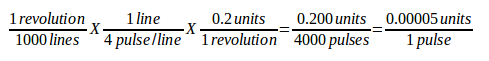
--

* `BIAS = 0.000` - This is used by hm2-servo and some others.
  Bias is a constant amount that is added to the output.
  In most cases it should be left at zero.
  However, it can sometimes be useful to compensate for offsets in servo
  amplifiers, or to balance the weight of an object that moves vertically.
  Bias is turned off when the PID loop is disabled, just like all other components of the output.
* `P = 50` - The proportional gain for the joint servo.
  This value multiplies the error between commanded and actual position in machine units, resulting in a contribution to the computed voltage for the motor amplifier.
  The units on the P gain are volts per machine unit, e.g., 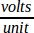
//latexmath:[$\frac{volt}{mu}$].
* `I = 0` - The integral gain for the joint servo.
  The value multiplies the cumulative error between commanded and actual position in machine units, resulting in a contribution to the computed voltage for the motor amplifier.
  The units on the I gain are volts per machine unit second, e.g., 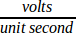
//latexmath:[$\frac{volt}{mu\, s}$].
* `D = 0` - The derivative gain for the joint servo.
  The value multiplies the difference between the current and previous errors, resulting in a contribution to the computed voltage for the motor amplifier.
  The units on the D gain are volts per machine unit per second, e.g., 
// latexmath:[$\frac{volt}{mu/s}$].
* `FF0 = 0` - The 0^th^ order feed forward gain.
  This number is multiplied by the commanded position, resulting in a contribution to the computed voltage for the motor amplifier.
  The units on the FF0 gain are volts per machine unit, e.g., 
// latexmath:[$\frac{volt}{mu}$].
* `FF1 = 0` - The 1^st^ order feed forward gain.
  This number is multiplied by the change in commanded position per second, resulting in a contribution to the computed voltage for the motor amplifier.
  The units on the FF1 gain are volts per machine unit per second, e.g., 
// latexmath:[$\frac{volt}{mu\, s}$].
* `FF2 = 0` - The 2^nd^ order feed forward gain.
  This number is multiplied by the change in commanded position per second per second, resulting in a contribution to the computed voltage for the motor amplifier.
  The units on the FF2 gain are volts per machine unit per second per second, e.g., 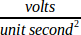
// latexmath:[$\frac{volt}{mu\, s^{2}}$].
* `OUTPUT_SCALE = 1.000`
* `OUTPUT_OFFSET = 0.000`
+
--
These two values are the scale and offset factors for the joint output to the motor amplifiers.

The second value (offset) is subtracted from the computed output (in volts), and divided by the first value (scale factor), before being written to the D/A converters.
The units on the scale value are in true volts per DAC output volts.
The units on the offset value are in volts.
These can be used to linearize a DAC.
Specifically, when writing outputs, the LinuxCNC first converts the desired output in quasi-SI units to raw actuator values, e.g., Volts for an amplifier DAC.
This scaling looks like: 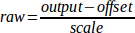

// latexmath:[raw=\frac{output-offset}{scale}]

The value for scale can be obtained analytically by doing a unit analysis, i.e., units are [output SI units]/[actuator units].
For example, on a machine with a velocity mode amplifier such that 1 V results in 250 mm/s velocity.

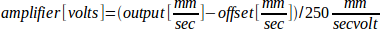

// latexmath:[$ amplifier [volts] = (output [\frac{mm}{sec}]
// - offset [\frac{mm}{sec}]) / 250 \frac{mm}{sec\, volt} ] $]

Note that the units of the offset are in machine units, e.g. mm/s, and they are pre-subtracted from the sensor readings.
The value for this offset is obtained by finding the value of your output which yields 0.0 for the actuator output.
If the DAC is linearized, this offset is normally 0.0.

The scale and offset can be used to linearize the DAC as well, resulting in values that reflect the combined effects of amplifier gain, DAC non-linearity, DAC units, etc.

To do this, follow this procedure.

. Build a calibration table for the output, driving the DAC with a desired voltage and measuring the result.
. Do a least-squares linear fit to get coefficients a, b such that 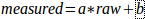
. Note that we want raw output such that our measured result is identical to the commanded output. This means
.. 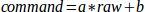
.. 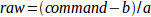
. As a result, the a and b coefficients from the linear fit can be used as the scale and offset for the controller directly.

See the following table for an example of voltage measurements.

// latexmath:[ meas=a*raw+b ]
// latexmath:[ cmd=a*raw+b ]
// latexmath:[ raw=(cmd-b)/a ]

.Output Voltage Measurements
[width="50%",cols="2*^",options="header"]
|===
|Raw | Measured
|-10 | -9.93
| -9 | -8.83
|  0 | -0.03
|  1 |  0.96
|  9 |  9.87
| 10 | 10.87
|===
--

* `MAX_OUTPUT = 10` - The maximum value for the output of the PID compensation that is written to the motor amplifier, in volts.
  The computed output value is clamped to this limit.
  The limit is applied before scaling to raw output units.
  The value is applied symmetrically to both the plus and the minus side.
* `INPUT_SCALE = 20000` - in Sample configs
* `ENCODER_SCALE = 20000` - in PnCconf built configs

Specifies the number of pulses that corresponds to a move of one machine unit as set in the `[TRAJ]` section.
For a linear joint one machine unit will be equal to the setting of `LINEAR_UNITS`.
For an angular joint one unit is equal to the setting in `ANGULAR_UNITS`.
A second number, if specified, is ignored.
For example, on a 2000 counts per rev encoder, and 10 revs/inch gearing, and desired units of inch, we have:

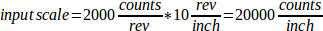

//latexmath:[ INPUT\_SCALE =
//\frac{2000\, counts}{rev} \times \frac{10\, rev}{inch} =
//\frac{20000\, counts}{inch} ]

==== Stepper

These parameters are relevant to joints controlled by steppers.

[WARNING]
The following are custom INI file entries that you may find in a sample INI file or a wizard generated file.
These are not used by the LinuxCNC software and meant only to put all the settings in one place.
For more information on custom INI file entries see the <<sub:ini:custom,Custom Sections and Variables>> subsection.

The following items might be used by a StepGen component.

* `SCALE = 4000` - in Sample configs
* `STEP_SCALE = 4000` - in PnCconf built configs

Specifies the number of pulses that corresponds to a move of one machine unit as set in the `[TRAJ]` section.
For stepper systems, this is the number of step pulses issued per machine unit.
For a linear joint one machine unit will be equal to the setting of `LINEAR_UNITS`.
For an angular joint one unit is equal to the setting in `ANGULAR_UNITS`.
For servo systems, this is the number of feedback pulses per machine unit.
A second number, if specified, is ignored.

For example, on a 1.8 degree stepper motor with half-stepping, and 10 revs/inch gearing, and desired <<sub:ini:sec:traj,machine units>> of inch, we have:

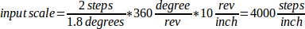

//latexmath:[ scale =
//\frac{2\, steps}{1.8\, degree} \times \frac{360\, degree}{rev} \times \frac{10\, rev}{inch} =
//\frac{4000\, steps}{inch} ]

[NOTE]
Old INI and HAL files used `INPUT_SCALE` for this value.

* `ENCODER_SCALE = 20000` (Optionally used in PnCconf built configs) -
  Specifies the number of pulses that corresponds to a move of one machine unit as set in the `[TRAJ]` section.
  For a linear joint one machine unit will be equal to the setting of `LINEAR_UNITS`.
  For an angular joint one unit is equal to the setting in `ANGULAR_UNITS`.
  A second number, if specified, is ignored.
  For example, on a 2000 counts per rev encoder, and 10 revs/inch gearing, and desired units of inch, we have:

//latexmath:[ ENCODER\_SCALE =
//\frac{2000\, counts}{rev} \times \frac{10\, rev}{inch} =
//\frac{20000\, counts}{inch} ]

* `STEPGEN_MAXACCEL = 21.0` -  Acceleration limit for the step generator.
  This should be 1% to 10% larger than the joint `MAX_ACCELERATION`.
  This value improves the tuning of StepGen's "position loop".
  If you have added backlash compensation to an joint then this should be 1.5 to 2 times greater than `MAX_ACCELERATION`.
* `STEPGEN_MAXVEL = 1.4` - Older configuration files have a velocity limit for the step generator as well.
  If specified, it should also be 1% to 10% larger than the joint `MAX_VELOCITY`.
  Subsequent testing has shown that use of `STEPGEN_MAXVEL` does not improve the tuning of StepGen's position loop.

[[sub:ini:sec:spindle-num]]
=== [SPINDLE_<num>] Section(s)(((INI File,Sections,[SPINDLE_<num>] Section(s))))

The _<num>_ specifies the spindle number 0 ... (num_spindles-1) +
The value of _num_spindles_ is set by `[TRAJ]SPINDLES=` . +
By default maximum velocity of the spindle in forward and reverse is approximately 2147483000 RPM. +
By default minimum velocity of the spindle in forward and reverse is 0 RPM. +
By default the increment is 100 RPM. +
You change these default by setting the following INI variables:

[NOTE]
These settings are for the motion controller component.
Control screens can limit these settings further. 

* `MAX_FORWARD_VELOCITY = 20000`
  The maximum spindle speed (in rpm) for the specified spindle. Optional.
  This will also set MAX_REVERSE_VELOCITY to the negative value unless overridden.
* `MIN_FORWARD_VELOCITY = 3000`
  The minimum spindle speed (in rpm) for the specified spindle. Optional.
  Many spindles have a minimum speed below which they should not be run.
  Any spindle speed command below this limit will be /increased/ to this limit.
* `MAX_REVERSE_VELOCITY = 20000`
  This setting will default to `MAX_FORWARD_VELOCITY` if omitted.
  It can be used in cases where the spindle speed is limited in reverse.
  Set to zero for spindles which must not be run in reverse.
  In this context "max" refers to the absolute magnitude of the spindle speed.
* `MIN_REVERSE_VELOCITY = 3000``
  This setting is equivalent to `MIN_FORWARD_VELOCITY` but for reverse spindle rotation.
  It will default to the MIN_FORWARD_VELOCITY if omitted.
* `INCREMENT = 200`
  Sets the step size for spindle speed increment / decrement commands.
  This can have a different value for each spindle.
  This setting is effective with AXIS and Touchy but note that some
  control screens may handle things differently.
* `HOME_SEARCH_VELOCITY = 100` - FIXME: Spindle homing not yet working.
  Sets the homing speed (rpm) for the spindle.
  The spindle will rotate at this velocity during the homing sequence until the spindle index is located, at which point the spindle position will be set to zero.
  Note that it makes no sense for the spindle home position to be any value other than zero, and so there is no provision to do so.
* `HOME_SEQUENCE = 0` - FIXME: Spindle homing not yet working
  Controls where in the general homing sequence the spindle homing rotations occur.
  Set the `HOME_SEARCH_VELOCITY` to zero to avoid spindle rotation during the homing sequence.

[[sub:ini:sec:emcio]]
=== [EMCIO] Section(((INI File,Sections,[EMCIO] Section)))

* `TOOL_TABLE = tool.tbl` - The file which contains tool information, described in the User Manual.
* `DB_PROGRAM = db_program` - Path to an executable program that manages tool data.
  When a DB_PROGRAM is specified, a TOOL_TABLE entry is ignored.
* `TOOL_CHANGE_POSITION = 0 0 2` -
  Specifies the XYZ location to move to when performing a tool change if three digits are used.
  Specifies the XYZABC location when 6 digits are used.
  Specifies the XYZABCUVW location when 9 digits are used.
  Tool Changes can be combined.
  For example if you combine the quill up with change position you can move the Z first then the X and Y.
* `TOOL_CHANGE_WITH_SPINDLE_ON = 1` -
  The spindle will be left on during the tool change when the value is 1.
  Useful for lathes or machines where the material is in the spindle, not the tool.
* `TOOL_CHANGE_QUILL_UP = 1` -
  The Z axis will be moved to machine zero prior to the tool change when the value is 1.
  This is the same as issuing a `G0 G53 Z0`.
* `TOOL_CHANGE_AT_G30 = 1` -
  The machine is moved to reference point defined by parameters 5181-5186 for G30 if the value is 1.
  For more information see <<sec:overview-parameters,G-code Parameters>> and <<gcode:g30-g30.1,G-code G30-G30.1>>.
* `RANDOM_TOOLCHANGER = 1` -
  This is for machines that cannot place the tool back into the pocket it came from.
  For example, machines that exchange the tool in the active pocket with the tool in the spindle.

// vim: set syntax=asciidoc:
