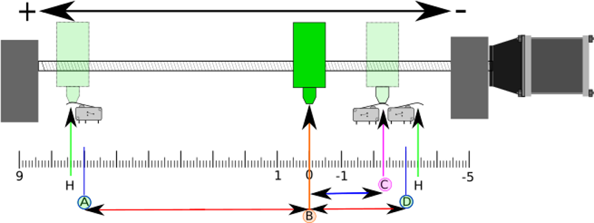
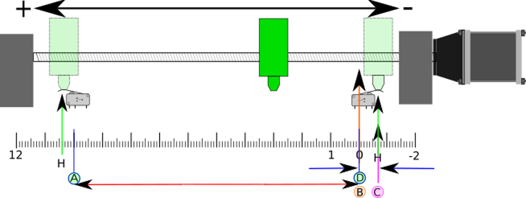
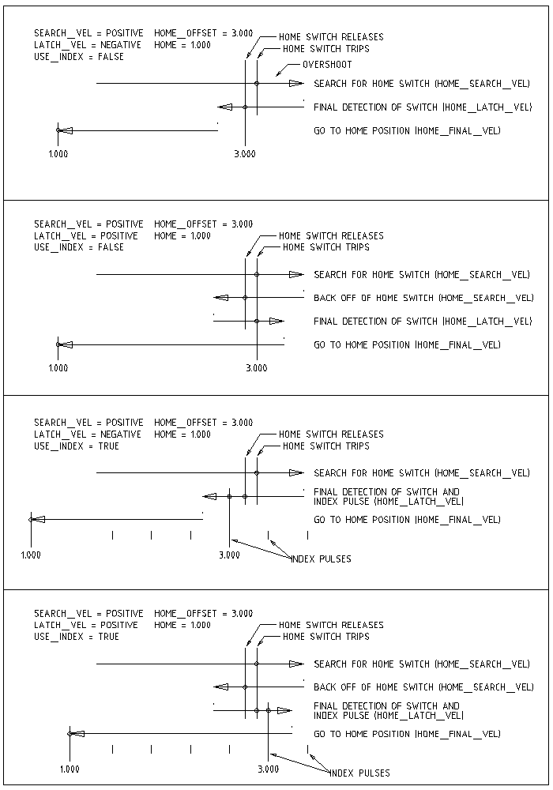

:lang: en
:toc:

[[cha:homing-configuration]]
= Homing Configuration

// Custom lang highlight
// must come after the doc title, to work around a bug in asciidoc 8.6.6
:ini: {basebackend@docbook:'':ini}
:hal: {basebackend@docbook:'':hal}
:ngc: {basebackend@docbook:'':ngc}

== Overview

Homing sets the zero origin of the G53 machine coordinates.
Soft limits are defined relative to the machine origin.
The soft limits automatically decelerate and stop the axes before they hit the limits switches
A properly configured and functioning machine will not move beyond soft(ware) limits and will have the machine origin set as repeatable as the home switch/index mechanism is.
Linuxcnc can be homed by eye (alignment marks), with switches, with switches and an encoder index, or by using absolute encoders.
Homing seems simple enough - just move each joint to a known location, and set LinuxCNC's internal variables accordingly.
However, different machines have different requirements, and homing is actually quite complicated.

[NOTE]
While it is possible to use LinuxCNC without homing switches/home procedures or limit switches,
It defeats the extra security of the soft limits.

== Prerequisite

Homing relies on some fundamental machine assumptions.

* The negative and positive directions are based on <<sec:machine-configurations,Tool Movement>> which can be different from the actual machine movement.
  I.e., on a mill typically the table moves rather then the tool.
* Everything is referenced from the G53 machine zero origin, the origin can be anywhere (even outside where you can move)
* The G53 machine zero origin is typically inside the soft limits area but not necessarily.
* The homing switch offset sets where the origin is, but even it is referenced from the origin.
* When using encoder index homing, the home switch offset is calculated from the encoder reference position, after the home switch has been tripped.
* The negative soft(ware) limits are the most you can move in the negative direction after homing.
  (but they might not be negative in the absolute sense)
* The positive soft(ware) limits are the most you can move in the positive direction after homing.
  (but they might not be positive in the absolute sense, though it is usual to set it as a positive number)
* Soft(ware) limits are inside the limit switch area.
* (Final) Homed Position is inside the soft limit area
* (If using switch based homing) the homing switch(es) either utilize the limit switches (shared home / limit switch),
  or when using a separate home switch, are inside the limit switch area.
* If using a separate homing switch, it is possible to start homing on the wrong side of the home switch,
  which combined with HOME_IGNORE_LIMITS option will lead to a hard crash.
  You can avoid this by making the home switch toggle its state when the trip dog is on a particular side until it returns passed the trip point again.
  Said another way, the home switch state must represent the position of the dog relative to the switch (i.e. _before_ or _after_ the switch),
  and must stay that way even if the dog coasts past the switch in the same direction.

[NOTE]
While it is possible to use LinuxCNC with the G53 machine origin outside the soft machine limits, if you use G28 or G30 without setting the parameters it goes to the origin by default.
This would trip the limit switches before getting to position.

== Separate Home Switch Example Layout

This example shows minimum and maximum limit switches with a separate home switch.

.Demonstrative Separate Switch Layout

* A is the negative soft limit
* B is the G53 machine coordinate Origin
* C is the home switch trip point
* D is the positive soft limit
* H is the final home position (HOME) = 0 units
* The -L and +L are the limit switches trip points
* A<->B is the negative soft limits (MIN_LIMITS) = -3 units
* B<->C is the home_offset (HOME_OFFSET) = -2.3 units
* B<->D is the positive soft limits (MAX_LIMITS) = 7 units
* A<->D is the total travel = 10 units
* The distance between the limit switches and soft limits (-L<->A and D<-+L) is magnified in this example
* Note that there is distance between the limit switches and actual physical hard contact for coasting after the amplifier is disabled.

[NOTE]
Homing sets the G53 coordinate system, while the machine origin (zero point) can be anywhere,
setting the zero point at the negative soft limit makes all G53 coordinates positive,
which is probably easiest to remember. Do this by setting MIN_LIMIT = 0 and make sure MAX_LIMIT is positive.

== Shared Limit/Home Switch Example Layout

This example shows a maximum limit switch and a combined minimum limit/home switch.

.Demonstrative Shared Switch Layout

* A is the negative soft limit.
* B is the G53 machine coordinate Origin.
* C is the home switch trip point shared with (-L) minimum limit trip.
* D is the positive soft limit.
* H is the final home position (HOME) = 3 units.
* The -L and +L are the limit switch trip points.
* A<->B is the negative soft limits (MIN_LIMITS) = 0 units.
* B<->C is the home_offset (HOME_OFFSET) = -0.7 units.
* B<->D is the positive soft limits (MAX_LIMITS) 10 units.
* A<->D is the total travel = 10 units.
* The distance between the limits switches and soft limits (-L<->A and D<->+L) is magnified in this example.
* Note that there is distance between the limit switches and actual physical hard contact for coasting after the amplifier is disabled.

== Homing Sequence

There are four possible homing sequences defined by the sign of HOME_SEARCH_VEL and HOME_LATCH_VEL, along with the associated configuration parameters as shown in the following table.
Two basic conditions exist, HOME_SEARCH_VEL and HOME_LATCH_VEL are the same sign or they are opposite signs.
For a more detailed description of what each configuration parameter does, see the following section.

.Homing Sequences

== Configuration

The following determines exactly how the home sequence behaves.
They are defined in an [JOINT_n] section of the INI file.

[width="80%",options="header",cols="4*^"]
|===
|Homing Type      |HOME_SEARCH_VEL |HOME_LATCH_VEL |HOME_USE_INDEX
|Immediate        |0               |0              |NO
|Index-only       |0               |nonzero        |YES
|Switch-only      |nonzero         |nonzero        |NO
|Switch and Index |nonzero         |nonzero        |YES
|===

[NOTE]
Any other combinations may result in an error.

=== HOME_SEARCH_VEL(((HOME SEARCH VEL)))

This variable has units of machine-units per second.

The default value is zero. A value of zero causes LinuxCNC to assume that
there is no home switch; the search stage of homing is skipped.

If HOME_SEARCH_VEL is non-zero, then LinuxCNC assumes that there is a home switch.
It begins by checking whether the home switch is already tripped.
If tripped it backs off the switch at HOME_SEARCH_VEL.
The direction of the back-off is opposite the sign of HOME_SEARCH_VEL.
Then it searches for the home switch by moving in the direction specified by the sign of HOME_SEARCH_VEL, at a speed determined by its absolute value.
When the home switch is detected, the joint will stop as fast as possible, but there will always be some overshoot.
The amount of overshoot depends on the speed.
If it is too high, the joint might overshoot enough to hit a limit switch or crash into the end of travel.
On the other hand, if HOME_SEARCH_VEL is too low, homing can take a long time.

=== HOME_LATCH_VEL(((HOME LATCH VEL)))

This variable has units of machine-units per second.

Specifies the speed and direction that LinuxCNC uses when it makes its final accurate determination of the home switch (if present) and index pulse location (if present).
It will usually be slower than the search velocity to maximize accuracy.
If HOME_SEARCH_VEL and HOME_LATCH_VEL have the same sign, then the latch phase is done while moving in the same direction as the search phase.
(In that case, LinuxCNC first backs off the switch, before moving towards it again at the latch velocity.)
If HOME_SEARCH_VEL and HOME_LATCH_VEL have opposite signs, the latch phase is done while moving in the opposite direction from the search phase.
That means LinuxCNC will latch the first pulse after it moves off the switch.
If HOME_SEARCH_VEL is zero (meaning there is no home switch), and this parameter is nonzero, LinuxCNC goes ahead to the index pulse search.
If HOME_SEARCH_VEL is non-zero and this parameter is zero, it is an error and the homing operation will fail.
The default value is zero.

=== HOME_FINAL_VEL

This variable has units of machine-units per second.

It specifies the speed that LinuxCNC uses when it makes its move from
HOME_OFFSET to the HOME position. If the HOME_FINAL_VEL is missing from
the INI file, then the maximum joint speed is used to make this move.
The value must be a positive number.

=== HOME_IGNORE_LIMITS(((HOME IGNORE LIMITS)))

Can hold the values YES / NO. The default value for this parameter is NO.
This flag determines whether LinuxCNC will ignore the limit switch input for this joint while homing.
This setting will not ignore limit inputs for other joints.
If you do not have a separate home switch set this to YES and connect the limit switch signal to the joint home switch input in HAL.
LinuxCNC will ignore the limit switch input for this joint while homing.
To use only one input for all homing and limits you will have to block the limit signals of the joints not homing in HAL and home one joint at a time.

=== HOME_USE_INDEX(((HOME USE INDEX)))

Specifies whether or not there is an index pulse.
If the flag is true (HOME_USE_INDEX = YES), LinuxCNC will latch on the rising edge of the index pulse.
If false, LinuxCNC will latch on either the rising or falling edge of the home switch (depending on the signs of HOME_SEARCH_VEL and HOME_LATCH_VEL).
The default value is NO.

[NOTE]
HOME_USE_INDEX requires connections in your HAL file to `joint.n.index-enable` from the `encoder.n.index-enable`.

=== HOME_INDEX_NO_ENCODER_RESET(((HOME INDEX NO ENCODER RESET)))

Default is NO.
Use YES if the encoder used for this joint does not reset its counter when an index pulse is detected after assertion of the joint index_enable HAL pin.
Applicable only for HOME_USE_INDEX = YES.

=== HOME_OFFSET(((HOME OFFSET)))

This defines the location of the origin zero point of the G53 machine coordinate system.
It is the distance (offset), in joint units, from the machine origin to the home switch trip point or index pulse.
After detecting the switch trip point/index pulse, LinuxCNC sets the joint coordinate position to HOME_OFFSET, thus defining the origin, which the soft limits references from.
The default value is zero.

NOTE: The home switch location, as indicated by the HOME_OFFSET variable, can be inside or outside the soft limits.
They will be shared with or inside the hard limit switches.

=== HOME(((HOME)))

The position that the joint will go to upon completion of the homing sequence.
After detecting the home switch or home switch then index pulse (depending on configuration),
and setting the coordinate of that point to HOME_OFFSET, LinuxCNC makes a move to HOME as the final step of the homing process.
The default value is zero.
Note that even if this parameter is the same as HOME_OFFSET, the joint will slightly overshoot the latched position as it stops.
Therefore there will always be a small move at this time (unless HOME_SEARCH_VEL is zero, and the entire search/latch stage was skipped).
This final move will be made at the joint's maximum velocity unless HOME_FINAL_VEL has been set.

[NOTE]
The distinction between 'HOME_OFFSET' and 'HOME' is that 'HOME_OFFSET' first establishes the origin location and scale on the machine
by applying the 'HOME_OFFSET' value to the location where home was found, and then 'HOME' says where the joint should move to on that scale.

=== HOME_IS_SHARED(((HOME IS SHARED)))

If there is not a separate home switch input for this joint, but a number of momentary switches wired to the same pin, set this value to 1 to prevent homing from starting if one of the shared switches is already closed.
Set this value to 0 to permit homing even if the switch is already closed.

=== HOME_ABSOLUTE_ENCODER(((HOME ABSOLUTE ENCODER)))

Use for absolute encoders.  When a request is made to home the joint, the current joint position is set to the '[JOINT_n]HOME_OFFSET' value.

The final move to the '[JOINT_n]HOME' position is optional according to the 'HOME_ABSOLUTE_ENCODER' setting:

----
HOME_ABSOLUTE_ENCODER = 0 (Default) joint does not use an absolute encoder
HOME_ABSOLUTE_ENCODER = 1 Absolute encoder, final move to [JOINT_n]HOME
HOME_ABSOLUTE_ENCODER = 2 Absolute encoder, NO final move to [JOINT_n]HOME
----

[NOTE]
A HOME_IS_SHARED setting is silently ignored.

[NOTE]
A request to rehome the joint is silently ignored.

[[sec:homing-section]]
=== HOME_SEQUENCE(((HOME SEQUENCE)))

Used to define a multi-joint homing sequence *HOME ALL* and enforce homing order (e.g., Z may not be homed if X is not yet homed).
A joint may be homed after all joints with a lower (absolute value) HOME_SEQUENCE have already been homed and are at the HOME_OFFSET.
If two joints have the same HOME_SEQUENCE, they may be homed at the same time.

[NOTE]
If HOME_SEQUENCE is not specified then the joint will not be homed by the *HOME ALL* sequence (but may be homed by individual joint-specific homing commands).

The initial HOME_SEQUENCE number may be 0, 1 (or -1).
The absolute value of sequence numbers must increment by one -- skipping sequence numbers is not supported.
If a sequence number is omitted, *HOME ALL* homing will stop upon completion of the last valid sequence number.

*Negative* HOME_SEQUENCE values indicate that joints in the sequence should *synchronize the final move* to [JOINT_n]HOME by waiting until all joints in the sequence are ready.
If any joint has a *negative* HOME_SEQUENCE value, then all joints with the same absolute value (positive or negative) of the HOME_SEQUENCE item value will synchronize the final move.

A *negative* HOME_SEQUENCE also applies to commands to home a single joint.
If the HOME_SEQUENCE value is *negative*, all joints having the same absolute value of that HOME_SEQUENCE will be *homed together with a synchronized final move*.
If the HOME_SEQUENCE value is zero or positive, a command to home the joint will home only the specified joint.

Joint mode jogging of joints having a negative HOME_SEQUENCE is disallowed.
In common gantry applications, such jogging can lead to misalignment (racking).
Note that conventional jogging in world coordinates is always available once a machine is homed.

Examples for a 3 joint system

Two sequences (0,1), no synchronization

[source,{ini}]
----
[JOINT_0]HOME_SEQUENCE = 0
[JOINT_1]HOME_SEQUENCE = 1
[JOINT_2]HOME_SEQUENCE = 1
----

Two sequences, joints 1 and 2 synchronized

[source,{ini}]
----
[JOINT_0]HOME_SEQUENCE =  0
[JOINT_1]HOME_SEQUENCE = -1
[JOINT_2]HOME_SEQUENCE = -1
----

With mixed positive and negative values, joints 1 and 2 synchronized

[source,{ini}]
----
[JOINT_0]HOME_SEQUENCE =  0
[JOINT_1]HOME_SEQUENCE = -1
[JOINT_2]HOME_SEQUENCE =  1
----

One sequence, no synchronization

[source,{ini}]
----
[JOINT_0]HOME_SEQUENCE =  0
[JOINT_1]HOME_SEQUENCE =  0
[JOINT_2]HOME_SEQUENCE =  0
----

One sequence, all joints synchronized

[source,{ini}]
----
[JOINT_0]HOME_SEQUENCE = -1
[JOINT_1]HOME_SEQUENCE = -1
[JOINT_2]HOME_SEQUENCE = -1
----

=== VOLATILE_HOME(((VOLATILE HOME)))

If this setting is true, this joint becomes unhomed whenever the machine transitions into the OFF state.
This is appropriate for any joint that does not maintain position when the joint drive is off.
Some stepper drives, especially microstep drives, may need this.

=== LOCKING_INDEXER(((LOCKING INDEXER)))

If this joint is a locking rotary indexer, it will unlock before homing, and lock afterward.

=== Immediate Homing(((Immediate Homing)))

If a joint does not have home switches or does not have a logical home position like a rotary joint and you want that joint to home at the current position when the "Home All" button is pressed in the AXIS GUI,
then the following INI entries for that joint are needed.

----
HOME_SEARCH_VEL = 0
HOME_LATCH_VEL = 0
HOME_USE_INDEX = NO
HOME_OFFSET = 0 (Or the home position offset (HOME))
HOME_SEQUENCE = 0 (or other valid sequence number)
----

[NOTE]
The default values for unspecified HOME_SEARCH_VEL, HOME_LATCH_VEL, HOME_USE_INDEX, HOME, and HOME_OFFSET are *zero*, so they may be omitted when requesting immediate homing.
A valid HOME_SEQUENCE number should usually be included since omitting a HOME_SEQUENCE eliminates the joint from *HOME ALL* behavior as noted above.

=== Inhibiting Homing(((Inhibiting Homing)))

A HAL pin (motion.homing-inhibit) is provided to disallow homing initiation for both "Home All" and individual joint homing.

Some systems take advantage of the provisions for synchronizing final joint homing moves as controlled by negative [JOINT_N]HOME_SEQUENCE= INI file items.
By default, the synchronization provisions disallow *joint* jogging prior to homing in order to prevent *joint* jogs that could misalign the machine (gantry racking for example).

System integrator can allow *joint* jogging prior to homing with HAL logic that switches the [JOINT_N]HOME_SEQUENCE items.
This logic should also assert the *motion.homing-inhibit* pin to ensure that homing is not inadvertently initiated when *joint* jogging is enabled.

Example: Synced joints 0,1 using negative sequence (-1) for synchronized homing with a switch (allow_jjog) that selects a positive sequence (1) for individual *joint* jogging prior to homing (partial HAL code):

[source,{hal}]
----
loadrt mux2           names=home_sequence_mux
loadrt conv_float_s32 names=home_sequence_s32
setp home_sequence_mux.in0 -1
setp home_sequence_mux.in1  1
addf home_sequence_mux servo-thread
addf home_sequence_s32 servo-thread
...
net home_seq_float <= home_sequence_mux.out
net home_seq_float => home_sequence_s32.in
net home_seq_s32   <= home_sequence_s32.out
net home_seq_s32   => ini.0.home_sequence
net home_seq_s32   => ini.1.home_sequence
...
# allow_jjog: pin created by a virtual panel or hardware switch
net hsequence_select <= allow_jjog
net hsequence_select => home_sequence_mux.sel
net hsequence_select => motion.homing-inhibit
----

[NOTE]
INI HAL pins (like ini.N.home_sequence) are not available until milltask starts so execution of the above HAL commands should be deferred using a postgui HAL file or a delayed [APPLICATION]APP= script.

[NOTE]
Realtime synchronization of joint jogging for multiple joints requires additional HAL connections for the Manual-Pulse-Generator (MPG) type jog pins (`joint.N.enable`, `joint.N.scale`, `joint.N.counts`).

An example simulation config (gantry_jjog.ini) that demonstrates joint jogging when using negative home sequences is located in the: configs/sim/axis/gantry/ directory.

// vim: set syntax=asciidoc:
