:lang: es

= Asistente de configuracion Stepconf 

[[cha:stepconf-wizard]]

== Introduccion

LinuxCNC es capaz de controlar una amplia variedad de tipos diferentes de maquinaria, 
utilizando diferentes interfaces de hardware.

Stepconf es un programa que genera archivos de configuracion para LinuxCNC
para un tipo especifico de maquina CNC:
aquellas que son controladas a traves de un 'puerto paralelo estandar', y 
utilizan las señales 'Paso y Direccion'

Stepconf se instala automaticamente cuando se instala LinuxCNC; se encuentra en el menu CNC. El
asistente genera un archivo en el directorio ~/linuxcnc/config
en el cual guarda las opciones de cada configuracion que usted genere.
Cuando se desea cambia algo, se necesita seleccionar el archivo
cuyo nombre coincida con la configuracion que desea modificar.
La extension del archivo es *.stepconf*.

El asistente Stepconf necesita una resolucion de pantalla de al menos 800 x 600
para que los botones de la parte baja de la pantalla sean visibles.

== Pagina de entrada[[sec:Entry-Page]]

.Pagina inicial[[cap:init-Page]]

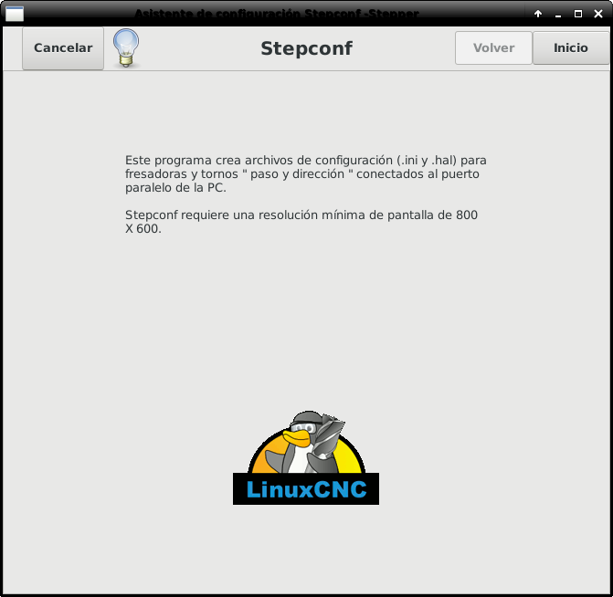

.Pimera Pagina[[cap:Entry-Page]]

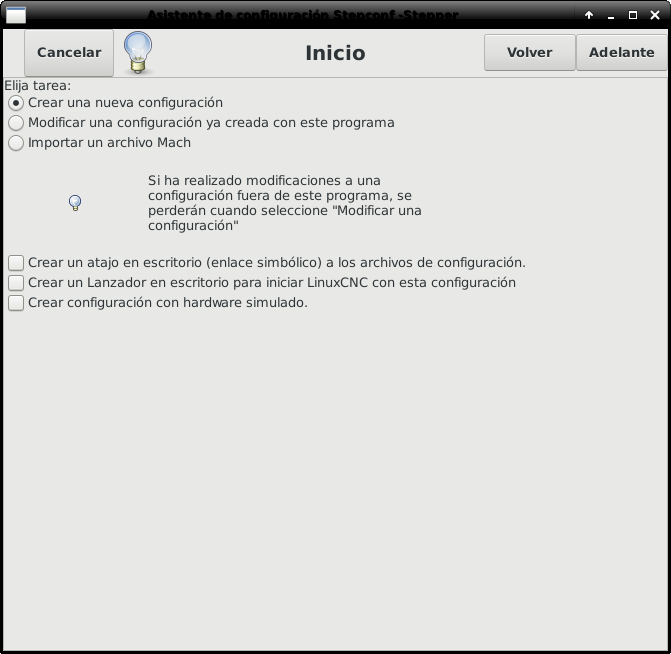

Los tres primeros botones radio son autoexplicativos:

* 'Crear una nueva configuración' - 
    Crea una configuracion nueva.

* 'Modificar una configuracion ya creada...' - 
    Modifica una configuracion existente.
    Despues de seleccionar esta opcion, aparecera una pantalla de seleccion de archivo
    y usted debera seleccionar el archivo con extension .stepconf que desea modificar.
    Si usted relizo alguna modificacion previa a los archivos principales .hal o .ini, estas modificaciones se perderan.
    Las modificaciones en los archivos custom.hal y custom_postgui.hal no seran canbiadas por el
    asistente Stepconf. Stepconf resaltara la ultima configuracion que se construyo.

* 'Importar un archivo Mach' - 
    Despues de seleccionar esta opcion, aparecera una pantalla de seleccion de archivo.
    Seleccione un archivo de configuración de Mach; LinuxCNC intentará convertirlo en un archivo de configuración
    apropiado para si mismo.
    Después de la importación, pase por las páginas de stepconf para confirmar/modificar las entradas.
    El archivo mach xml original no se cambiará.

Las siguientes opciones se registrarán en un archivo de preferencias para la próxima ejecución de Stepconf.

* 'Crear Atajo en Escritorio' - 
    Se generara en su escritorio un enlace a los archivos. 

* 'Crear un Lanzador en Escritorio' - 
    Se generara un lanzador en su escritorio para iniciar la aplicacion.

* 'Crear Hardware Simulado' - 
    Permite crear configuraciones para pruebas,
    incluso sin tener el hardware apropiado.

== Informacion Basica[[sec:Basic-Information]]

.Informacion Basica[[cap:Basic-Information-Page]]

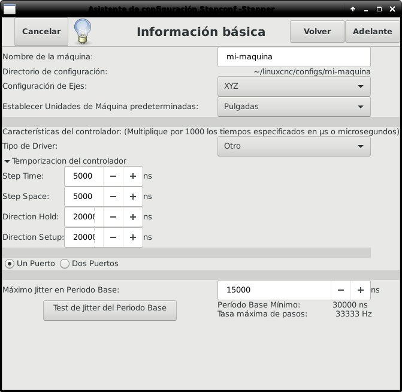

* 'Nombre de la maquina' - 
    (((Nombre de la Maquina)))
    Seleccione un nombre para su maquina.
    Utilice solo letras mayusculas, minusculas, digitos, '-' y '_'.

* 'Configuracion de Ejes' - 
    (((Configuracion de Ejes)))
    Seleccione XYZ (Fresadora), XYZA (Fresadora de 4 ejes) o XZ (Torno).

* 'Unidades Maquina' - 
    (((Unidades Maquina)))
    Seleccione pulgadas o milimetros. Todas las preguntas posteriores
    (tales como el largo de los ejes, el paso de los tornillos, etc)
    deberan ser contestadas utilizando las unidades seleccionadas.

* 'Tipo de Driver' - 
    (((Tipo de Driver)))
    Si usted tiene uno de los controladores de motor a pasos listados en el menu desplegable, seleccionelo directamente.
    En cualquier otro caso, busque los 4 valores de tiempo necesarios.
    Utilize los manuales de su controlador y rellene los campos.
    Si sus manuales le dan los datos en microsegundos multipliquelos por 1000 para nanosegundos.
    Por ejemplo, si el manual marca 4.5 us, escriba 4500 ns.

En la pagina wiki de LinuxCNC.org puede ser consultada una lista de controladores populares, asi como sus tiempos, en  http://wiki.linuxcnc.org/cgi-bin/emcinfo.pl?Stepper_Drive_Timing[Temporizado de Drivers Stepper]. 

El acondicionamiento extra de señal o el aislamiento electrico, como cuando se usan optoacopladores y 
filtros RC en tarjetas breakboards,
pueden requerir diferentes valores de tiempo a los indicados para su controlador.
Puede ser el caso que se requiera agregar tiempo extra a los valores de temporizacion para compensar los filtros o aislamientos.
La seccion de seleccion de configuracion tiene maquinas de la marca Sherline ya configuradas para su uso en caso de que posea una de estas.

* 'Step Time' - 
    Tiempo del pulso de paso "Encendido" en nanosegundos.

* 'Step Space' - 
    Tiempo minimo entre dos pulsos de paso en nanosegundos.

* 'Direction Hold' - 
    Tiempo que debe ser mantenido activo el pin de direccion despues de ordenar cambio de direccion, en nanosegundos.

* 'Direction Setup' - 
    Tiempo debe preceder a un cambio de direccion despues del ultimo pulso de paso en la direccion anterior.

* 'Primer Parport' - 
    Usualmente la direcion en hexadecimal del primer puerto paralelo es 0x378 (puerto no PCI). 

* 'Segundo Parport' - 
    En caso de ser necesario especificar un puerto paralelo extra, introduca la direccion
    y el tipo. Para informacion de como encontrar la direccion de puertos paralelos PCI
    vea la seccion Port Address en el manual de integrador (trate con 0x278 o 0x3BC para puertos no PCI)

* 'Maximo Jitter en Periodo Base' - 
    (((Jitter Maximo del Periodo Base)))
    Introduzca el resultado de la prueba de latencia.
    Para correr la prueba de latencia presione el boton "Test Jitter Periodo Base".
    Vea la seccion de la prueba de latencia para mas detalles.

* 'Tasa Max de Pasos' - 
    (((Max Step Rate)))
    Stepconf calculara automaticamente la tasa maxima de pulsos de pasos
    basandose en las caracteristicas del controlador del motor y en el resultado de la prueba de latencia.

* 'Periodo Base Mínimo' - 
    (((Min Base Period)))
    Stepconf calculara automaticamente el periodo base minimo
    basandose en las caracteristicas del controlador del motor y el resultado de la prueba de latencia.    

== Prueba de latencia[[sub:latency-test]](((Latency Test)))

Mientras se ejecute la prueba, usted debera 'abusar' de la computadora. Mueva
ventanas alrededor de la pantalla. Navegue en internet. Copie algunos archivos de gran tamano
en diferentes partes del disco duro. Reproduzca musica. Corra algun programa OpenGl como glxgears.
La idea es poner a la computadora en apuros mientras se ejecuta la prueba para poder tener una idea de 
cuales seran los peores casos de demanda a la computadora y sus tiempo de respuesta. 
Ejecute la prueba al menos unos cuantos minutos. Contra mas tiempo la ejecute, mas probable es que detecte
casos especiales que solo suceden en intervalos poco frecuentes. Esta prueba es solo para 
la computadora; no se requiere que conecte los controladores de motores.

[WARNING]
No ejecute LinuxCNC mientras realiza la prueba de latencia.

.Prueba de Latencia

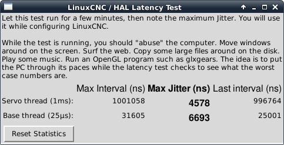

La latencia es el tiempo que le tomara a una PC concreta detener lo que esta haciendo
y responder a una solicitud externa. En este caso, la solicitud es
el 'latido periodico' que sirve como referencia de tiempo 
para la genracion de los pulsos de paso.
Cuanto menor sea la latencia, mas rapido se generaran los latidos,
y mas rapidos y suaves seran los pulsos de paso.

La latencia es mucho mas importante que la velocidad de la CPU. La velocidad
de la CPU no es el unico factor determinate en la latencia. La placa madre, tarjetas de video, puertos
USB, problemas con SMI, y otras cosas pueden afectar la latencia.

.Troubleshooting SMI Issues (LinuxCNC.org Wiki)
************************************************************

Encuentre aqui soluciones a algunos problemas de SMI y tiempo real comunes en Ubuntu

http://wiki.linuxcnc.org/cgi-bin/emcinfo.pl?FixingSMIIssues
************************************************************

El numero importante es el "Jitter Maximo". En el ejemplo, 9075
nanosegundos, o 9.075 microsegundos, es el maximo retraso.
Guarde este numero, y escribalo en el recuadro Jitter Maximo del Periodo Base.

Si el maximo retraso  se encuentra entre 15-20 microsegundos o menor
(15000-20000 nanosegundos), la computadora deberia dar muy buenos resultados
con la generacion de pulsos de pasos. Si la latencia maxima esta entre 30-50
microsegundos, se pueden seguir obteniendo buenos resultados, pero la tasa
maxima de generacion de pulsos puede ser un poco decepcionante, especialmente si se usan
micropasos o un tornillo con un paso muy fino. Si los numeros son
100us o mas (100 000 nanosegundos), la PC no es una buena candidata para la generacion 
de pulsos de paso por software. Numeros superiores a 1 milisegundo (1 000 000 nanosegundos)
significan que la PC no es una buena candidata para ejecutar LinuxCNC, sin importar si se
usa generacion de pulsos de paso por software o no.

== Ajustes del puerto Paralelo[[sec:Parallel-Port-Setup]](((Parallel Port Setup)))

.Pagina de ajuste del Puerto Paralelo[[cap:Parallel-Port-Setup]]

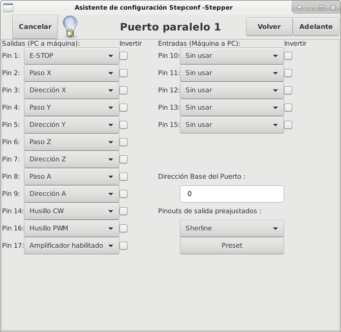

Para cada pin se debera seleccionar la señal de control
que concuerde con la configuracion del puerto.

Active la casilla "invert" si la señal de control requiere
ser invertida (0V para activo/Verdadero, 5v para inactivo/Falso)

* 'Esquemas de pines predefinidos' - 
   Se configuraran automaticamente los pines del 2 al 9 de acuerdo al estandar
   de las maquinas Sherline (Direccion en los pines 2, 4, 6, 8) o Xylotex (Direccion en los
   pines 3, 5, 7, 9).

* 'Entradas y Salidas' - 
    Si el pin no sera utilizado como entrada o salida, seleccionarlo como "Sin uso".

* 'Señal de Paro Externo (E stop)' - 
    Esta señal pude ser seleccionada en la casilla desplegable.
    Una cadena de señal de paro tipica utiliza solo contactos en serie normalmente cerrados.

* 'Posicion home y limites de seguridad (Homing & Limit Switches) - 
    Estos pines pueden ser seleccionados para la mayoria de las configuraciones
    utilizando la casilla desplegable.

* 'Bomba de Carga (Charge Pump)' - 
    Si su controlador de motor requiere de una señal de bomba de carga,
    simplemente seleccione esta opcion de la lista desplegable y conecte la señal
    al pin seleccionado.
    La salida de la bomba de carga sera conectada a la tarea base por el programa Stepconf.
    La salida de bomba de carga sera aproximadamente 1/2 de la maxima tasa de generacion
    de pulsos de paso mostrados en la pagina de configuracion basica.

== Configuracion del puerto paralelo 2

.Página de configuración del puerto paralelo 2

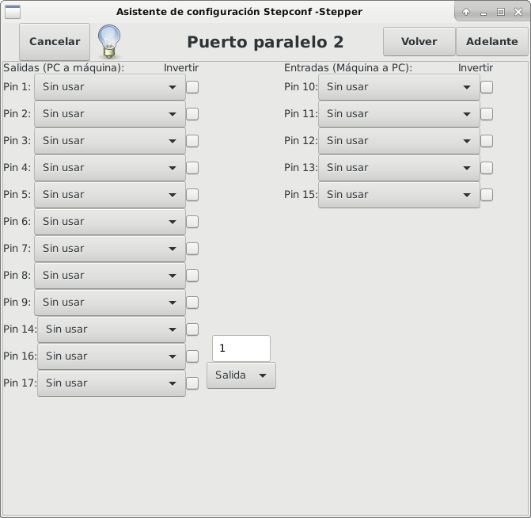

El segundo puerto paralelo (si está seleccionado) puede configurarse y asignar sus pines en esta página. +
No se pueden seleccionar señales de paso y dirección. +
Puede seleccionarlo de entrada o de salida para maximizar el número de pines de entrada/salida que están disponibles. +
Puede especificar la dirección como hexadecimal (a menudo 0x378) o como el número de puerto predeterminado de Linux (probablemente 1).

== Opciones

.Configuracion avanzada

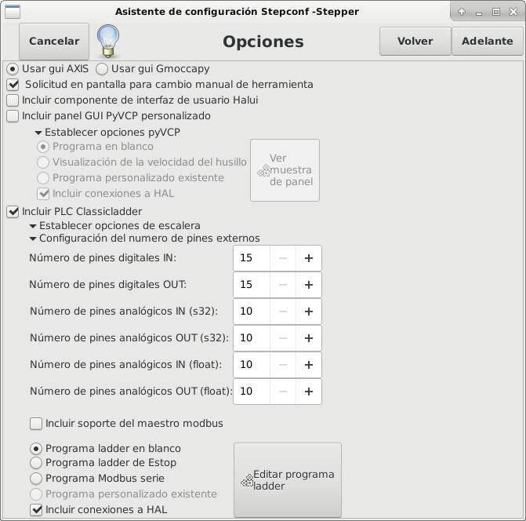

* 'Incluir Halui': esto agregará el componente de interfaz de usuario Halui. Ver el
<<cha:hal-user-interface,Capitulo HALUI>> para más información.

* 'Incluir pyVCP': esta opción agrega el archivo base del panel pyVCP o un archivo ejemplo
para trabajar en el. Ver el <<cha:pyvcp,Capítulo PyVCP>> para más información.

* 'Incluir ClassicLadder PLC' - Esta opción agregará el PLC ClassicLadder
(Controlador lógico programable). Ver el
<<cha:classicladder,Capitulo Classicladder>> para más información.

* 'Indicador en pantalla para cambio de herramienta' - Si esta casilla está marcada, LinuxCNC
para y le pide que cambie la herramienta cuando se encuentre 'M6'. Esta característica
generalmente solo es útil si tiene herramientas predimensionadas.

== Configuracion de los Ejes[[sec:Axis-Configuration]](((Axis Configuration)))

.Pagina de configuracion de ejes[[cap:Axis-Configuration-Page]]

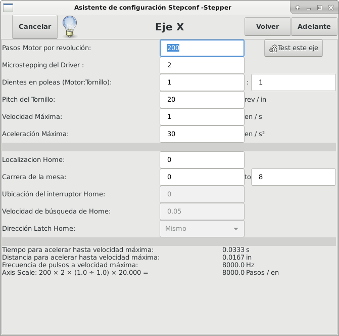

* 'Pasos del motor por revolucion' (Motor Steps Per Revolution) - 
    (((Motor Steps Per Revolution)))
    El numero de pasos completos por revolucion del motor.
    Si solo se tiene el dato de los grados por paso del motor (ejemplo 1.8 grados),
    se debe dividir 360 por el numero de grados por paso
    para encontrar el numero de pasos por revolucion.

* 'Micro pasos' (Driver Microstepping) - 
    (((Driver Microstepping)))
    El numero de micropasos producidos por el controlador por cada paso fisico completo del motor.
    Entre "2" para semipasos.
    Por ejemplo, si el controlador produce 1/10 de giro de un paso completo
    del motor por cada pulso de paso que recibe, escriba 10 en la casilla.

* 'Relacion de Poleas' (Pulley Ratio) - 
    (((Pulley Ratio)))
    Si su maquina tiene poleas o engranes entre el motor y el tornillo,
    escriba su relacion mecanica aqui. Si no tiene, escriba "1:1".

* 'Paso del tornillo' (Leadscrew Pitch) - 
    (((Leadscrew Pitch)))
    Entre aqui el paso del tornillo.
    Si se selecciono unidades "Inch", entre el numero de 
    hilos por pulgada (por ejemplo, 8 para un tornillo de 8 TPI).
    Si se tiene un tornillo con varias entradas, se necesita saber
    cuantas vueltas se requieren para mover la tuerca una pulgada.
    Si se selecciono 'mm' como unidades, entre el numero de milimetros que la tuerca
    se movera por revolucion (ejemplo, 2 para 2 mm/rev).
    Si la maquina se mueve en la direccion opuesta a la esperada,
    entre un valor negativo, o invierta el pin de direccion del eje.

* 'Velocidad Maxima' (Maximum Velocity) - 
    (((Maximum Velocity)))
    Entre la velocidad maxima del eje, en unidades por segundo.

* 'Aceleracion Maxima (Maximum Acceleration) - 
    (((Maximum Acceleration)))
    El valor correcto de esta casilla solo puede ser determinado
    por experimentacion. Vea 
    <<sub:finding-maximum-velocity,Encontrar Velocidad Maxima para ajustar la velocidad, y
    <<sub:finding-maximum-acceleration,Encontrar Velocidad Maxima para ajustar la aceleracion.

* 'Posicion Home' (Home Location) - 
    (((Home Location)))
    Home es la posicion a la que la maquina se movera despues de completar
    el procedimiento de inicio del eje.
    Para maquinas sin interruptores de posicion home,
    esta es la posicion a la cual el operador debera mover la maquina
    antes de presionar el boton de inicializacion del eje (Home).
    Si se combinan interruptores home y de limite,
    se debera mover la maquina fuera del interruptor para inicializar el eje
    o se recibira un error de limite en el eje.

* 'Carrera de la mesa' (Table Travel) - 
    (((Table Travel)))
    El rango de carrera que el codigo g no podra sobrepasar.
    La posicion de inicializacion del eje debe estar dentro del area de carrera.
    En particular, tener la posicion de inicializacion (Home) de un eje exactamente
    en un limite del area de carrera, producira una configuracion invalida.    

* 'Localizacion de los interruptores home' (Home Switch Location) - 
    (((Home Switch Location)))
    La posicion en la cual el interruptor home se activa o desactiva,
    relativa al origen maquina. Este apartado y los dos siguientes
    solo apareceran cuando se selecciona la existencia de interruptores home
    en la configuracion de los pines del puerto paralelo. Si se combinan los 
    interruptores de limite y de home, la posicion del interruptor home
    no puede ser la misma que la posicion home o se producira un error de limite de articulacion.
    
* 'Velocidad de busqueda de home' (Home Search Velocity) - 
    (((Home Search Velocity)))
    Velocidad usada en la busqueda de los interruptores home.
    Si el interruptor se encuentra cercano al limite de carrera del eje,
    esta velocidad debe ser seleccionada de tal forma que el eje tenga
    suficiente tiempo para desacelerar hasta detenerse antes de llegar al
    limite fisico de la carrera.
    Si el interruptor se encuentra cerrado en un rango corto de carrera,
    (en lugar de estar cerrado desde el punto de disparo hasta un final de carrera),
    la velocidad debera ser seleccionada de tal forma que el eje pueda desacelerar
    hasta detenerse antes de que el interruptor se habra otra vez, y el procedimiento
    de homing debera comenzarse siempre desde el mismo lado del interruptor.
    Si la maquina se mueve en la direccion contraria al inicio del homing,
    cambie el signo del parametro *Home Search Velocity*.

* 'Direccion de enclavamiento' (Home Latch Direction) - 
    (((Home Latch Direction)))
    Seleccione "Igual" para que el interruptor sea liberado
    y posteriormente la maquina se acerque a el a muy baja velocidad.
    La segunda vez que el interruptor se cierre, definira la posicion home.
    Seleccione "Opuesto" para realizar la inializacion liberando lentamente el interruptor;
    cuando el interruptor se abra, se marcara la posiocion home.

* 'Tiempo para acelerar hasta maxima velocidad' (Time to accelerate to max speed) - 
    (((Time to accelerate to max speed)))
    Tiempo calculado a partir de 'Max Acceleration' y 'Max Velocity'. 

* 'Distancia para acelerar hasta maxima velocidad' (Distance to accelerate to max speed) - 
    (((Distance to accelerate to max speed)))
    Distancia para alcanzar maxima velocidad desde posicion de parado.

* 'Tasa de pulsos a maxima velocidad' (Pulse rate at max speed) - 
    (((Pulse rate at max speed)))
    Este dato se calcula en base a los valores anteriores.
    El valor maximo de la *Tasa* determina el 'BASE_PERIOD'.
    Valores por encima de 20000Hz pueden producir tiempos de respuesta muy bajos o incluso bloqueos
    (La tasa maxima varia entre computadoras)

* 'Escala del Eje' (Axis SCALE) - 
    El numero que sera usado en el archivo ini en la seccion [SCALE].
    Representa cuantos pasos se deben dar por unidad de usuario.

* 'Probar este Eje' (Test this axis) - 
    (((Test this axis)))
    Esta opcion abre una ventana para permitir probar cada eje 
    y puede ser utilizada despues de llenar toda la informacion referente a cada eje.

=== Probar este eje

.Probar este eje

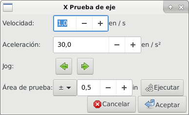

Es un comprobador básico que solo emite señales de paso y dirección
para probar diferentes valores de aceleración y velocidad.

[IMPORTANT]
Para utilizar la prueba de este eje, debe habilitar manualmente el eje si se requiere.
Si su controlador tiene una bomba de carga, tendrá que derivarla.
Probar el eje no reacciona a las entradas del interruptor de límite. Usar con precaución.

[[sub:finding-maximum-velocity]]

.Encontrar la velocidad máxima

Comience con una baja aceleración
// comenta el latexmath hasta que se encuentre una solución para los documentos html
// (por ejemplo, latexmath: [2 in / s ^ 2] o latexmath: [50 mm / s ^ 2])
(por ejemplo, *+2 pulgadas/s^2^+* o *+50 mm/s^2^+*)
y la velocidad que espera alcanzar.
Usando los botones provistos, mueva el eje hasta cerca del centro de su carrera.
Tenga cuidado, porque con un bajo valor de aceleración puede recorrerse una distancia 
sorprendentemente larga hasta que el eje desacelere completamente y pare.

Después de calcular la cantidad de carrera disponible,
ingrese una distancia segura en el Área de prueba, teniendo en cuenta que
después de un bloqueo, el motor puede comenzar a moverse en una dirección inesperada.
Luego haga clic en Ejecutar.
La máquina comenzará a avanzar y retroceder a lo largo de este eje.
En esta prueba, es importante que la combinación de aceleración y
área de prueba permita que la máquina alcance la velocidad seleccionada y la mantenga 
al menos una corta distancia: cuanto mayor sea la distancia, mejor será esta prueba.
La fórmula *+d=0.5 * v * v/a+*
// latexmath: [d = 0.5 * v * v / a]
da la distancia mínima requerida para alcanzar la
velocidad especificada con la aceleración dada.
Si es conveniente y seguro hacerlo,
empuje la mesa contra la dirección del movimiento para simular las fuerzas de corte.
Si la máquina se para, reduzca la velocidad y comience nuevamente la prueba.

Si la máquina no se paró, haga clic en el botón 'Run' para parar. El eje
vuelve ahora a la posición donde comenzó. Si la posición es incorrecta,
el eje se estancó o perdió pasos durante la prueba. Reduzca la velocidad y comiencela
otra vez.

Si la máquina no se mueve, se detiene o pierde pasos, incluso a baja
velocidad, verifique lo siguiente:

- Corregir los tiempos de onda de paso
- Pinout correcto, incluyendo 'Invert' en los pines de paso
- Cableado correcto y bien protegido
- Problemas físicos con el motor, acoplamiento del motor, husillo, etc.

Una vez que haya encontrado una velocidad a la que el eje no se detiene o pierde pasos
durante este procedimiento de prueba, reducirlo en un 10% y usarlo como 
'Velocidad máxima' del eje.

[[sub:finding-maximum-acceleration]](((Encontrar la máxima aceleración)))

.Encontrar la máxima aceleración

Con la velocidad máxima que encontro en el paso anterior,
ingrese el valor de aceleración a probar.
Usando el mismo procedimiento anterior,
ajuste el valor de Aceleración hacia arriba o hacia abajo según sea necesario.
En esta prueba, es importante que la combinación de
aceleración y área de prueba permitan que la máquina alcance la velocidad seleccionada.
Una vez que haya encontrado un valor en el que el eje
no se detiene ni pierde pasos durante este procedimiento de prueba,
reducirlo en un 10% y usarlo como  Aceleración máxima del eje.

== Configuracion del husillo

.Página de configuración del husillo

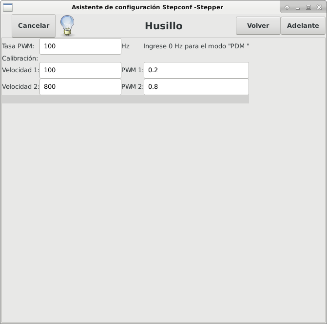

Esta página solo aparece cuando se selecciona 'Spindle PWM' en
la página 'Pin Portout Parallel' para una de las salidas.

=== Control de velocidad del eje

Si 'Spindle PWM' aparece en el pinout,
debe aportarse la siguiente información:

* 'PWM Rate' - La 'frecuencia portadora' de la señal PWM al husillo. Entrar
'0' para el modo PDM, que es útil para generar un voltaje de control analógico.
Consulte la documentación de su controlador de husillo para conocer el valor apropiado.

* 'Speed 1 y 2, PWM 1 y 2': el archivo de configuración generado utiliza una
relación lineal simple para determinar el valor PWM para un valor RPM dado. Si los
valores no se conocen, se pueden determinar. Para más información, ver
<<sub:determining-spindle-calibration,determinación de la calibración del husillo>>.

=== Movimiento sincronizado con el husillo

Cuando las señales apropiadas de un encoder de husillo están conectadas a
LinuxCNC a través de HAL, LinuxCNC admite el roscado en torno.
Estas señales son:

* 'Índice del husillo' - Es un pulso que ocurre 'una vez por revolución' del husillo.

* 'Fase A del husillo' - Este es un pulso que ocurre en múltiples ubicaciones,
igualmente espaciadas, a medida que gira el husillo.

* 'Fase B del husillo (opcional)' - Este es un segundo pulso, pero con
un desplazamiento de la fase A del husillo. Las ventajas de usar tanto A como B son
detección de dirección, mayor inmunidad al ruido y mayor resolución.

Si aparecen 'Fase A de husillo' e 'Índice de husillo'
en el pinout, se debe ingresar la siguiente información:

* 'Usar Spindle-At-Speed' - Con la retroalimentación del encoder se puede hacer que linuxcnc
espere a que el husillo alcance la velocidad ordenada antes de que se mueva la alimentación. Seleccione esta
opción y establezca la escala 'close enough'.

* 'Ganancia del filtro de pantalla de velocidad' - Configuración para ajustar la estabilidad de la
visualización de la velocidad del husillo.
 
* 'Ciclos por revolución' - El número de ciclos de la señal A del husillo
durante una revolución. Esta opción solo está habilitada cuando
una entrada se ha configurado como 'Fase A del husillo'

* 'Velocidad máxima en roscado' - La velocidad máxima del husillo utilizada en el roscado.
Para un husillo de altas RPM o un encóder de husillo con alta resolución, es obligatorio un valor bajo
de 'BASE_PERIOD' .

[[sub:determining-spindle-calibration]](((Determinación de la calibración del husillo)))

=== Determinacion de la calibracion del husillo

Ingrese los siguientes valores en la página Configuración del husillo:

[width="80%"]
|=========================
|Velocidad 1: | 0 | PWM 1: | 0
|Velocidad 2: | 1000 | PWM 2: | 1
|=========================

Termine los pasos restantes del proceso de configuración,
luego, inicie LinuxCNC con su configuración.
Encienda la máquina y seleccione la pestaña MDI.
Inicie el giro del husillo ingresando: 'M3 S100'.
Cambie la velocidad del husillo ingresando un número S diferente: 'S800'.
Los números válidos (en este momento) van de 1 a 1000.

Para dos números S diferentes, mida la velocidad real del eje en RPM.
Registre los números S y las velocidades reales del eje. Ejecute Stepconf nuevamente.
Para 'Velocidad', ingrese la velocidad medida, y
para 'PWM' ingrese el número S dividido entre 1000.

Ya que la mayoría de los controladores de husillo son ligeramente no lineales en sus
curvas de respuesta, lo mejor es:

- Asegúrese de que las dos velocidades de calibración no estén demasiado juntas en RPM
- Asegúrese de que las dos velocidades de calibración estén en el rango de velocidades que
típicamente usará durante el fresado

Por ejemplo, si su husillo va de 0 RPM a 8000 RPM,
pero generalmente usa velocidades de 400 RPM (10%) a 4000 RPM (100%),
encuentre los valores de PWM que dan 1600 RPM (40%) y 2800 RPM (70%).

== Configuracion de la maquina completa

Haga clic en 'Aplicar' para escribir los archivos de configuración.
Más tarde, puede volver a ejecutar este programa y ajustar la configuración que ingresó antes.

== Recorrido de eje y home

Para cada eje, hay un rango limitado de recorrido.
El final físico del recorrido se llama 'parada dura o hard'.

Antes de la "parada dura" hay un "interruptor de límite".
Si se encuentra el interruptor de límite durante la operación normal,
LinuxCNC apaga el amplificador de motor.
La distancia entre la "parada dura" y el "interruptor de límite"
debe ser lo suficientemente larga como para permitir que un motor sin alimentacion se detenga.

Antes del 'interruptor de límite' hay un 'límite suave o soft'.
Este es un límite impuesto en el software después de home.
Si un comando MDI o un programa de código g superara el límite soft, no se ejecutará.
Si un desplazamiento pasa el límite suave, se detiene en el límite suave.

El 'interruptor home' se puede colocar en cualquier lugar dentro del recorrido (entre paradas duras).
Siempre que el hardware externo no desactive los amplificadores de motor
cuando se alcanza el interruptor de límite, uno de los interruptores de límite
puede ser utilizado como un interruptor home.

La 'posición cero' es la ubicación en el eje que es 0 en
el sistema de coordenadas de la máquina.
Por lo general, la "posición cero" estará dentro de los "límites suaves".
En los tornos, el modo de velocidad de superficie constante requiere que 'X = 0' en la máquina 
corresponda al centro de rotación del husillo cuando no está activo el offset de la herramienta.

La 'posición home' es la ubicación dentro del recorrido a la que el eje
sera movido al final de la secuencia de home.
Este valor debe estar dentro de los "límites suaves".
En particular, la 'posición home'
nunca debe ser exactamente igual a un 'límite suave'.

=== Operando sin interruptores de limite

Una máquina puede ser operada sin interruptores de límite. En este caso, solo
los límites suaves impiden que la máquina alcance la parada dura.
Los límites suaves solo funcionan después de que la máquina ha sido puesta a home.

=== Operando sin Switches Home[[sub:Operating-without-Home]]
(((Operando sin Switches Home)))

Una máquina puede operarse sin interruptores home.
Si la máquina tiene interruptores de límite, pero no hay interruptores home,
lo mejor es utilizar un interruptor de límite como el interruptor home
(Por ejemplo, elija 'Límite mínimo + Home X' en el pinout).
Si la máquina no tiene interruptores, o los
interruptores de límite no pueden ser utilizados como interruptores de inicio por otra razón, entonces
la máquina debe ponerse 'a ojo' en home o usando marcas de coincidencia. Homing a ojo
no es tan repetible como el home por interruptores, pero aún permite que los
límites suaves sean de utilidad.

=== Opciones de cableado del interruptor de home y de limite

El cableado ideal para interruptores externos sería de una entrada por interruptor.
Sin embargo, el puerto paralelo de PC solo ofrece un total de 5 entradas,
mientras que hay hasta 9 interruptores en una máquina de 3 ejes.
En cambio, múltiples interruptores pueden conectarse entre sí en varias
formas para que se requiera un menor número de entradas.

Las siguientes figuras muestran la idea general de cablear múltiples interruptores
a un solo pin de entrada.
En cada caso, cuando se activa un interruptor,
el valor visto en ENTRADA va de lógica ALTA a BAJA.
Sin embargo, LinuxCNC espera un valor VERDADERO cuando se cierra un interruptor,
por lo que el correspondiente cuadro 'Invert'
debe verificarse en la página de configuración del pinout.
El resistor pull-up que se muestra en los diagramas mantiene la entrada alta
hasta que se realice la conexión a tierra y la entrada pasa a baja.
Sin resistencia, la entrada puede flotar entre encendido y apagado cuando el circuito está abierto.
Normalmente, para un puerto paralelo, puede usar resistencias de 47k.

. Interruptores normalmente cerrados

Cableado de interruptores N/C en serie (diagrama simplificado)

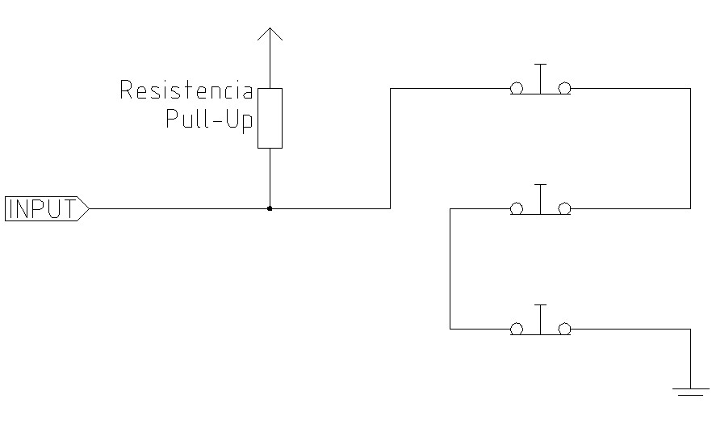

. Interruptores normalmente abiertos

Cableado de interruptores de N/O en paralelo (diagrama simplificado)

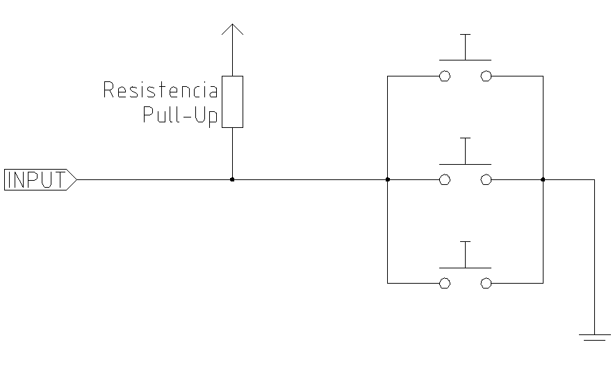

Las siguientes combinaciones de interruptores están permitidas en Stepconf:

* Combinar los interruptores de home para todos los ejes
* Combinar los interruptores de límite para todos los ejes
* Combinar ambos interruptores de límite para un eje
* Combinar ambos interruptores de límite y el interruptor de home para un eje
* Combinar un interruptor de límite y el interruptor de home para un eje

// vim: set syntax = asciidoc:

