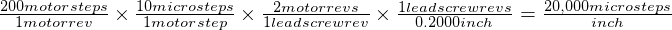
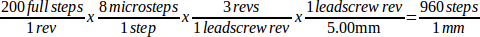

:lang: en

[[cha:stepper-quickstart]]
= Configuration rapide pour moteurs pas à pas

Cette section suppose qu'une installation du logiciel à partir du CD Live a été
faite. Après cette installation et avant de continuer, il est
recommandé de connecter le PC sur Internet pour y faire les dernières
mises à jour. Pour les installations plus complexes se référer au Manuel de l'intégrateur.

== Test de latence (Latency Test)

Le test de latence détermine la capacité du processeur à répondre aux
requêtes qui lui sont faites. Certains matériels peuvent interrompre ce
processus, causant des pertes de pas lorsque le PC pilote une machine
CNC. Ce test est la toute première chose à faire pour valider un PC.
Pour le lancer, suivre les instructions de la section <<cha:test-de-latence, sur le test de latence>>.

[[sec:Sherline]]
== Sherline(((Sherline)))

Si vous avez une machine Sherline plusieurs configurations prédéfinies sont fournies.
Au premier démarrage de LinuxCNC, le sélecteur de configuration s'ouvre, sélectionnez 
alors le modèle correspondant à votre machine _Sherline_, puis acceptez d'enregistrer une copie. 

[[sec:Xylotex]]
== Xylotex(((Xylotex)))

Si vous avez une machine _Xylotex_ vous pouvez utiliser l'assistant graphique de 
configuration fourni avec LinuxCNC et créer rapidement votre configuration 
personnalisée <<cha:Assistant-graphique-StepConf, avec l'assistant Stepconf>>.

== Informations relatives à la machine

But, regrouper les informations à propos des axes de la machine.

Les timings des pilotes sont exprimés en nanosecondes. Si vous n'êtes pas sûr de vous à propos des timings de votre interface, les
caractéristiques les plus populaires sont incluses dans l'assistant
graphique de configuration. Notez que les pilotes Gecko ont des timings
différents les uns des autres. Une liste des caractéristiques courantes
est également maintenue sur le Wiki http://wiki.linuxcnc.org/cgi-bin/wiki.pl?Stepper_Drive_Timing[de linuxcnc.org].

[width="90%", options="header"]
|==============================================================================
|Axes | Type de pilote | Step Time ns | Step Space ns | Direction Hold ns | Direction Setup ns
|X    |                |              |               |                   | 
|Y    |                |              |               |                   | 
|Z    |                |              |               |                   | 
|     |                |              |               |                   | 
|==============================================================================

== Informations relatives au brochage

But, regrouper les informations à propos des différentes broches du port
parallèle utilisées.

[width="90%", options="header"]
|========================================================================================
|Pin de sortie | Fonction            | Si différent | Pin d'entrée | Fonction       | Si différent
|1             | Sortie A/U          |              | 10           | Limite et OM X | 
|2             | X Step              |              | 11           | Limite et OM Y | 
|3             | X Direction         |              | 12           | Limite et OM Z | 
|4             | Y Step              |              | 13           | Limite et OM A | 
|5             | Y Direction         |              | 15           | Entrée palpeur | 
|6             | Z Step              |              |              |                | 
|7             | Z Direction         |              |              |                | 
|8             | A Step              |              |              |                | 
|9             | A Direction         |              |              |                | 
|14            | Broche sens horaire |              |              |                | 
|16            | PWM broche          |              |              |                | 
|17            | Valide puissance    |              |              |                | 
|========================================================================================

Noter que toutes les broches inutilisées doivent être explicitement indiquées _Inutilisé_ dans le choix déroulant de l'assistant. Elles
pourront être modifiées par la suite en relançant Stepconf.

== Informations relatives à la mécanique

But, regrouper les informations à propos des réducteurs. Utilisées pour définir la taille d'un pas dans l'unité utilisateur. La
taille du pas est utilisée par SCALE dans le fichier .ini.

[width="90%", options="header"]
|====================================================================
|Axes | Pas par tour | Micropas | Dents moteur | Dents vis | Pas de la vis
|X    |              |          |              |           | 
|Y    |              |          |              |           | 
|Z    |              |          |              |           | 
|     |              |          |              |           | 
|====================================================================

* _Pas par tour_ indique combien de pas moteur sont nécessaires pour que celui-ci 
  fasse un tour.
  Valeur typique: 200.

* _Micropas_ indique combien d'impulsions le pilote doit recevoir pour que le 
  moteur tourne d'un angle équivalent à un pas.
  Si les micropas ne sont pas utilisés, cette valeur devra être mise à 1. 
  Si les micropas sont utilisés, les valeurs les plus courantes sont, 2 pour le
  demi-pas, 4 pour le quart de pas, 8 ou 10. 

* _Dents moteur_ et _Dents vis_ à indiquer si vous avez une réduction poulies/courroie 
  entre le moteur et la vis.
  Sinon mettez 1 pour les deux.

* _Pas de la vis_ indique la longueur de déplacement du mobile pour un tour de la
  vis d'entrainement de l'axe.
  If you're setting up in inches then it is inches per turn.
  If you're setting up in millimeters then it is millimeters per turn.

The net result you're looking for is how many CNC-output-steps it takes
to move one user unit (inches or mm).

.Unités Pouces
============================================
............................................
Moteur            = 200 pas par tour
Pilote            = 10 micropas par pas
Dents côté moteur = 20
Dents côté vis    = 40
Pas de vis        = 0.2000 pouces par tour
............................................
============================================

D'après les informations ci-dessus:
- Le moteur fera 2000 micropas par tour de vis. 
- Le pilote demandera 10 micropas pour faire un pas. 
- Le pilote recevra 2000 impulsions de pas pour faire tourner le moteur d'un tour. 

So the scale needed is:

////////////////////////////////////////////
latexmath:[
\frac{200 motor steps}{1 motor rev} \times
\frac{10 microsteps}{1 motor step} \times
\frac{2 motor revs}{1 leadscrew rev} \times
\frac{1 leadscrew revs}{0.2000 inch}
= \frac{20,000 microsteps}{inch} ]
////////////////////////////////////////////

.Unités mm
============================================
............................................
    Stepper         = 200 steps per revolution
    Drive           =   8 micro steps per step
    Motor Teeth     =  30
    Leadscrew Teeth =  90
    Leadscrew Pitch =   5.00 mm per turn
............................................
============================================

From the above information:
- The leadscrew moves 5.00 mm per turn.
- The motor turns 3.000 times per 1 leadscrew turn.
- The drive takes 8 microstep inputs to make the stepper step once.
- The drive needs 1600 steps to turn the stepper one revolution.

So the scale needed is:

//////////////////////////////////////////////
latexmath:[
\frac{200 motor steps}{1 motor rev} \times
\frac{8 microsteps}{1 motor step} \times
\frac{3 motor revs}{1 leadscrew rev} \times
\frac{1 leadscrew revs}{5.000 mm}
= \frac{960 microsteps}{mm} ]
//////////////////////////////////////////////

// vim: set syntax=asciidoc:
