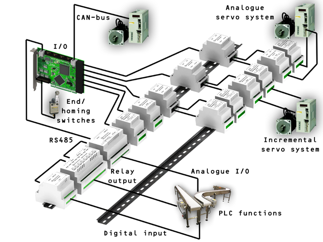
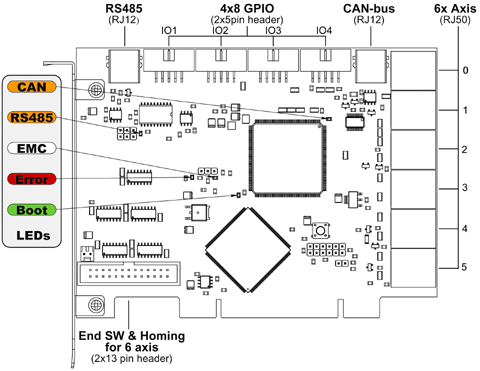
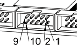
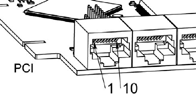
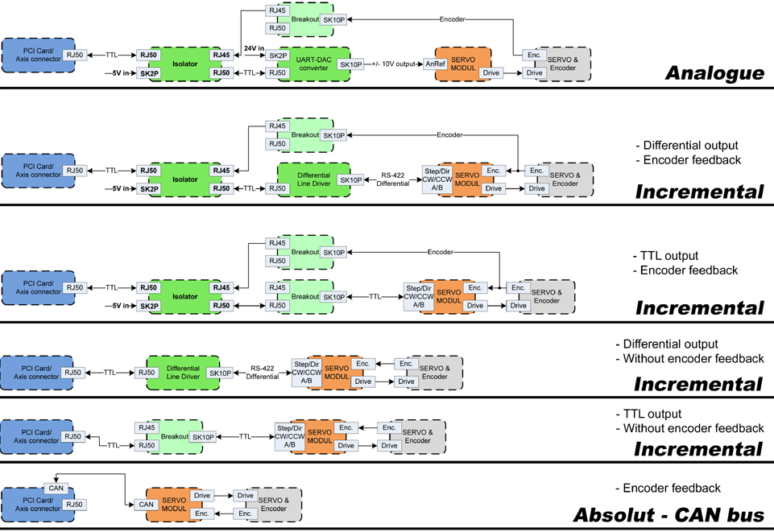
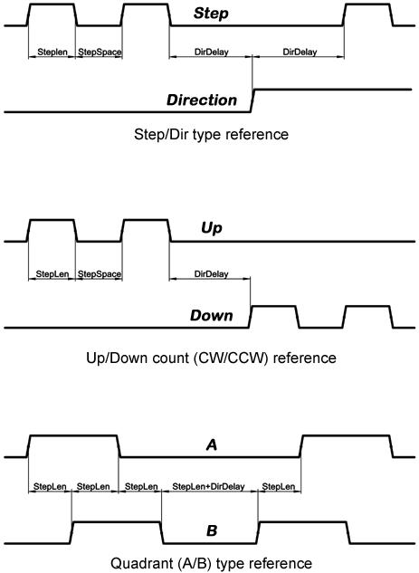
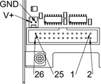
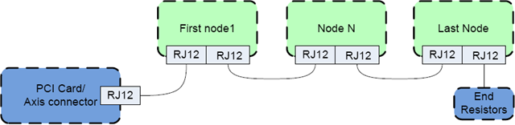

:lang: en
:toc:

[[cha:gm-driver]]
= General Mechatronics Driver

// Custom lang highlight
// must come after the doc title, to work around a bug in asciidoc 8.6.6
:ini: {basebackend@docbook:'':ini}
:hal: {basebackend@docbook:'':hal}
:ngc: {basebackend@docbook:'':ngc}

General Mechatronics GM6-PCI card based motion control system

For detailed description, please refer to the https://www.generalmechatronics.com/data/products/robot_controller/PCI_UserManual_eng.pdf[System integration manual].

The GM6-PCI motion control card is based on an FPGA and a PCI bridge
interface ASIC. A small automated manufacturing cell can be controlled,
with a short time system integration procedure. The following figure
demonstrating the typical connection of devices related to the control
system:

* It can control up to six axis, each can be stepper or CAN bus
  interface or analogue servo.
* GPIO: Four time eight I/O pins are placed on standard flat cable headers.
* RS485 I/O expander modules: RS485 bus was designed for interfacing
  with compact DIN-rail mounted expander modules.
  An 8-channel digital input, an 8-channel relay output and an
  analogue I/O (4x +/-10 Volts output and 8x +/-5 Volts input) modules are available now.
  Up to 16 modules can be connected to the bus altogether.
* 20 optically isolated input pins: Six times three for the direct
  connection of two end switch and one homing sensor for each joint.
  And additionally, two optically isolated E-stop inputs.

Installing:

[source,{hal}]
----
loadrt hal_gm
----

During loading (or attempted loading) the driver prints some useful
debugging messages to the kernel log, which can be viewed with dmesg.

Up to 3 boards may be used in one system.

The following connectors can be found on the GM6-PCI card:

.GM6-PCI card connectors and LEDs(((pci-card connectors)))

== I/O connectors

.Pin numbering of GPIO connectors(((pin-numbering-gpio)))

.Pinout of GPIO connectors
[width="40%",options="header",cols="5*^"]
|===
| 9     | 7     | 5     | 3     | 1
| IOx/7 | IOx/5 | IOx/3 | IOx/1 | VCC
|===

[width="40%",options="header",cols="5*^"]
|===
| 10  | 8     | 6     | 4     | 2
| GND | IOx/6 | IOx/4 | IOx/2 | IOx/0
|===

Each pin can be configured as digital input or output.
GM6-PCI motion control card has 4 general purpose I/O
(GPIO) connectors, with eight configurable I/O on each.
Every GPIO pin and parameter name begins as follows:

----
gm.<card_no>.gpio.<gpio_con_no>
----

where _<gpio_con_no>_ is from 0 to 3.

.State of the first pin of the first GPIO connector on the GM6-PCI card.

----
gm.0.gpio.0.in-0
----

HAL pins are updated by function

----
gm.<card_no>.read
----

=== Pins

.GPIO pins
[width="80%",options="header",cols="<3,^2,<6"]
|===
| Pins     | Type and direction | Pin description
m| .in-_<0-7>_     | (bit, Out) | Input pin
m| .in-not-_<0-7>_ | (bit, Out) | Negated input pin
m| .out-_<0-7>_    | (bit, In)  | Output pin. Used only when GPIO is set to output.
|===

=== Parameters

.GPIO parameters
[width="80%",options="header",cols="<3,^2,<6"]
|===
| Pins                 | Type and direction | Parameter description
m| .is-out-_<0-7>_     | (bit, R/W)         | When True, the corresponding GPIO is set to totem-pole output, other wise set to high impedance input.
m| .invert-out-_<0-7>_ | (bit, R/W)         | When True, pin value will be inverted. Used when pin is configured as output.
|===

== Axis connectors

.Pin numbering of axis connectors(((pin-numbering-axis)))

.Pinout of axis connectors
[width="40%",cols="^1,<4"]
|===
|  1 | Encoder A
|  2 | +5 Volt (PC)
|  3 | Encoder B
|  4 | Encoder Index
|  5 | Fault
|  6 | Power Enabled
|  7 | Step/CCW/B
|  8 | Direction/CW/A
|  9 | Ground (PC)
| 10 | DAC serial line
|===
=== Axis interface modules

Small sized DIN rail mounted interface modules gives easy way of connecting
different types of servo modules to the axis connectors.
Seven different system configurations are presented in the
https://www.generalmechatronics.com/data/products/robot_controller/PCI_UserManual_eng.pdf[System integration manual]
for evaluating typical applications. Also the detailed description of the
Axis modules can be found in the System integration manual.

For evaluating the appropriate servo-drive structure the modules
have to be connected as the following block diagram shows:

.Servo axis interfaces(((axis-interface)))

=== Encoder

The GM6-PCI motion control card has six encoder modules.
Each encoder module has three channels:

 * Channel-A
 * Channel-B
 * Channel-I (index)

It is able to count quadrature encoder signals or step/dir signals.
Each encoder module is connected to the inputs of the corresponding
RJ50 axis connector.

Every encoder pin and parameter name begins as follows:

----
gm.<card_no>.encoder.<axis_no>
----

where _<axis_no>_ is from 0 to 5.
For example, `gm.0.encoder.0.position` refers to the position of encoder module of axis 0.

The GM6-PCI card counts the encoder signal independently from LinuxCNC.
HAL pins are updated by function:

----
gm.<card_no>.read
----

.Encoder pins
[width="80%",options="header",cols="<3,^2,<6"]
|===
| Pins               | Type and direction | Pin description
m| .reset             | (bit, In)          | When True, resets counts and position to zero.
m| .rawcounts         | (s32, Out)         | The raw count is the counts, but unaffected by reset or the index pulse.
m| .counts            | (s32, Out)         | Position in encoder counts.
m| .position          | (float, Out)       | Position in scaled units (=.counts/.position-scale).
m| .index-enabled     | (bit, IO)          |
When True, counts and position are rounded or reset (depends on index-mode) on next rising edge of channel-I.
Every time position is reset because of Index, the `index-enabled` pin is set to 0 and remains 0 until connected HAL pin does not set it.
m| .velocity          | (float, Out)       |
Velocity in scaled units per second.
GM encoder uses high frequency hardware timer to measure time between encoder pulses in order to calculate velocity.
It greatly reduces quantization noise as compared to simply differentiating the position output.
When the measured velocity is below min-speed-estimate, the velocity output is 0.
|===

.Encoder parameters
[width="80%",options="header",cols="<3,^2,<6"]
|===
| Parameters           | Type and Read/Write | Parameter description
m| .counter-mode       | (bit, R/W)          |
When True, the counter counts each rising edge of the channel-A input to the direction determined by channel-B.
This is useful for counting the output of a single channel (non-quadrature) or step/dir signal sensor.
When false, it counts in quadrature mode.
m| .index-mode         | (bit, R/W)          |
When True and .index-enabled is also true, .counts and .position
are rounded (based on .counts-per-rev) at rising edge of channel-I.
This is useful to correct few pulses error caused by noise.
In round mode, it is essential to set .counts-per-rev parameter correctly.
When .index-mode is False and .index-enabled is true, .counts and .position are reset at channel-I pulse.
m| .counts-per-rev     | (s32, R/V)          |
Determine how many counts are between two index pulses.
It is used only in round mode, so when both .index-enabled and .index-mode parameters are True.
GM encoder process encoder signal in 4x mode, so for example in case of a 500 CPR encoder it should be set to 2000.
This parameter can be easily measured by setting .index-enabled True and .index-mode False (so that .counts resets
at channel-I pulse), than move axis by hand and see the maximum magnitude of .counts pin in halmeter.
m| .index-invert       | (bit, R/W)          |
When True, channel-I event (reset or round) occur on falling edge of channel-I signal, otherwise on rising edge.
m| .min-speed-estimate | (float, R/W)        |
Determine the minimum measured velocity magnitude at which .velocity will be set as nonzero.
Setting this parameter too low will cause it to take a long time for velocity to go to zero after encoder pulses have stopped arriving.
m| .position-scale     | (float, R/W)        |
Scale in counts per length unit. .position=.counts/.position-scale.
For example, if position-scale is 2000, then 1000 counts of the encoder will produce a position of 0.5 units.
|===

.HAL example

.Setting encoder module of axis 0 to receive 500 CPR quadrature encoder signal and use reset to round position.
[source,{hal}]
----
setp gm.0.encoder.0.counter-mode 0         # 0: quad, 1: stepDir
setp gm.0.encoder.0.index-mode 1           # 0: reset pos at index, 1:round pos at index
setp gm.0.encoder.0.counts-per-rev 2000    # GM process encoder in 4x mode, 4x500=2000
setp gm.0.encoder.0.index-invert 0         #
setp gm.0.encoder.0.min-speed-estimate 0.1 # in position unit/s
setp gm.0.encoder.0.position-scale 20000   # 10 encoder rev cause the machine to move one position unit (10x2000)
----

.Connect encoder position to LinuxCNC joint position feedback
[source,{hal}]
----
net Xpos-fb gm.0.encoder.0.position => joint.0.motor-pos-fb
----

=== StepGen module

The GM6-PCI motion control card has six StepGen modules, one for each joint.
Each module has two output signals. It can produce Step/Direction,
Up/Down or Quadrature (A/B) pulses. Each StepGen module is connected
to the pins of the corresponding RJ50 axis connector.

Every StepGen pin and parameter name begins as follows:

----
gm.<card_no>.stepgen.<axis_no>
----

where _<axis_no>_ is from 0 to 5.
For example, `gm.0.stepgen.0.position-cmd` refers to the position command of StepGen module of axis 0 on card 0.

The GM6-PCI card generates step pulses independently from LinuxCNC.
HAL pins are updated by function

----
gm.<card_no>.write
----

.StepGen module pins
[width="90%",options="header",cols="<3,^2,<6"]
|===
| Pins           | Type and direction | Pin description
m| .enable       | (bit, In)          | StepGen produces pulses only when this pin is true.
m| .count-fb     | (s32, Out)         | Position feedback in counts unit.
m| .position-fb  | (float, Out)       | Position feedback in position unit.
m| .position-cmd | (float, In)        | Commanded position in position units. Used in position mode only.
m| .velocity-cmd | (float, In)        | Commanded velocity in position units per second. Used in velocity mode only.
|===

.StepGen module parameters
[width="90%",options="header",cols="<3,^2,<6"]
|===
| Parameters         | Type and Read/Write | Parameter description
m| .step-type         | (u32, R/W)          | When 0, module produces Step/Dir signal. When 1, it
  produces Up/Down step signals. And when it is 2, it
  produces quadrature output signals.
m| .control-type      | (bit, R/W)          |
When True, .velocity-cmd is used as reference and velocityvcontrol calculate pulse rate output.
When False, .position-cmd is used as reference and position control calculate pulse rate output.
m| .invert-step1      | (bit, R/W)          | Invert the output of channel 1 (Step signal in StepDir mode)
m| .invert-step2      | (bit, R/W)          | Invert the output of channel 2 (Dir signal in StepDir mode)
m| .maxvel            | (float, R/W)        |
Maximum velocity in position units per second. If it is set to 0.0, .maxvel parameter is ignored.
m| .maxaccel          | (float, R/W)        |
Maximum acceleration in position units per second squared.
mf it is set to 0.0, .maxaccel parameter is ignored.
m| .position-scale    | (float, R/W)        | Scale in steps per length unit.
m| .steplen           | (u32, R/W)          | Length of step pulse in nano-seconds.
m| .stepspace         | (u32, R/W)          | Minimum time between two step pulses in nano-seconds.
m| .dirdelay          | (u32, R/W)          | Minimum time between step pulse and direction change in nanoseconds.
|===

For evaluating the appropriate values see the timing diagrams below:

.Reference signal timing diagrams(((refsig-timing-diagram)))

.HAL example

.Setting StepGen module of axis 0 to generate 1000 step pulse per position unit
[source,{hal}]
----
setp gm.0.stepgen.0.step-type 0         # 0:stepDir, 1:UpDown, 2:Quad
setp gm.0.stepgen.0.control-type 0      # 0:Pos. control, 1:Vel. Control
setp gm.0.stepgen.0.invert-step1 0
setp gm.0.stepgen.0.invert-step2 0
setp gm.0.stepgen.0.maxvel 0            # do not set maxvel for step
                                        # generator, let interpolator control it.
setp gm.0.stepgen.0.maxaccel 0          # do not set max acceleration for
                                        # step generator, let interpolator control it.
setp gm.0.stepgen.0.position-scale 1000 # 1000 step/position unit
setp gm.0.stepgen.0.steplen 1000        # 1000 ns = 1 µs
setp gm.0.stepgen.0.stepspace1000       # 1000 ns = 1 µs
setp gm.0.stepgen.0.dirdelay 2000       # 2000 ns = 2 µs
----

.Connect StepGen to axis 0 position reference and enable pins
[source,{hal}]
----
net Xpos-cmd joint.0.motor-pos-cmd => gm.0.stepgen.0.position-cmd
net Xen joint.0.amp-enable-out => gm.0.stepgen.0.enable
----

=== Enable and Fault signals

The GM6-PCI motion control card has one enable output and one fault
input HAL pins, both are connected to each RJ50 axis connector
and to the CAN connector.

HAL pins are updated by function:

----
gm.<card_no>.read
----

.Enable and Fault signal pins

[width="80%",options="header",cols="<3,^2,<6"]
|===
| Pins                         | Type and direction | Pin description
| gm.<card_no>.power-enable | (bit, In)          |
If this pin is True, +
* and Watch Dog Timer is not expired +
* and there is no power fault +
then power enable pins of axis- and CAN connectors are set to high, otherwise set to low.
| gm.<card_no>.power-fault  | (bit, Out)         | Power fault input.
|===

=== Axis DAC

The GM6-PCI motion control card has six serial axis DAC driver modules,
one for each joint. Each module is connected to the pin of the corresponding RJ50 axis connector.
Every axis DAC pin and parameter name begins as follows:

----
gm.<card_no>.dac.<axis_no>
----

where _<axis_no>_ is from 0 to 5.
For example, `gm.0.dac.0.value` refers to the output voltage of DAC module of axis 0.

HAL pins are updated by function:

----
gm.<card_no>.write
----

.Axis DAC pins
[width="80%",options="header",cols="<3,^2,<6"]
|===
| Pins     | Type and direction | Pin description
m| .enable | (bit, In)          | Enable DAC output. When enable is false, DAC output is 0.0 V.
m| .value  | (float, In)        | Value of DAC output in Volts.
|===

.Axis DAC parameters
[width="80%",options="header",cols="<3,^2,<6"]
|===
| Parameters      | Type and direction | Parameter description
m| .offset        | (float, R/W)       | Offset is added to the value before the hardware is updated.
m| .high-limit    | (float, R/W)       | Maximum output voltage of the hardware in Volts.
m| .low-limit     | (float, R/W)       | Minimum output voltage of the hardware in Volts.
m| .invert-serial | (float, R/W)       |
GM6-PCI card is communicating with DAC hardware via fast serial communication to highly reduce time delay compared to PWM.
DAC module is recommended to be isolated which is negating serial communication line.
In case of isolation, leave this parameter to default (0), while in case of none-isolation, set this parameter to 1.
|===

== CAN-bus servo amplifiers

The GM6-PCI motion control card has CAN module to drive CAN servo amplifiers.
Implementation of higher level protocols like CANopen is further development.
Currently GM produced power amplifiers has upper level driver which export pins and parameters to HAL.
They receive position reference and provide encoder feedback via CAN bus.

The frames are standard (11 bit) ID frames, with 4 byte data length.
The baud rate is 1 Mbit/s.
The position command IDs for axis 0..5 are 0x10..0x15.
The position feedback IDs for axis 0..5 are 0x20..0x25.

These configuration can be changed with the modification
of hal_gm.c and recompiling LinuxCNC.

Every CAN pin and parameter name begins as follows:

----
gm.<card_no>.can-gm.<axis_no>
----

where _<axis_no>_ is from 0 to 5.
For example, `gm.0.can-gm.0.position` refers to the output position of axis 0 in position units.

HAL pins are updated by function:

----
gm.<card_no>.write
----

=== Pins

.CAN module pins
[width="80%",options="header",cols="<3,^2,<6"]
|===
| Pins           | Type and direction | Pin description
m| .enable       | (bit, In)          | Enable sending position references.
m| .position-cmd | (float, In)        | Commanded position in position units.
m| .position-fb  | (float, In)        | Feed back position in position units.
|===

=== Parameters

.CAN module parameters
[width="80%",options="header",cols="<3,^2,<6"]
|===
| Parameters       | Type and direction | Parameter description
m| .position-scale | (float, R/W)       | Scale in per length unit.
|===

== Watchdog timer

Watchdog timer resets at function:

----
gm.<card_no>.read
----

=== Pins

.Watchdog pins
[width="90%",options="header",cols="<3,^2,<6"]
|===
| Pins                             | Type and direction | Pin description
m| gm._<card_no>_.watchdog-expired | (bit, Out)         | Indicates that watchdog timer is expired.
|===

Watchdog timer overrun causes the set of power-enable to low in hardware.

=== Parameters

.Watchdog parameters
[width="90%",options="header",cols="<3,^2,<6"]
|===
| Parameters                          | Type and direction | Parameter description
m| gm._<card_no>_.watchdog-enable     | (bit, R/W)         |
Enables watchdog timer. +
It is strongly recommended to enable the watchdog timer,
because it can disable all the servo amplifiers by pulling down all enable signals in case of a PC error.
m| gm._<card_no>_.watchdog-timeout-ns | (float, R/W)       |
Time interval in within the gm._<card_no>_.read function must be executed.
The gm._<card_no>_.read is typically added to servo-thread,
so watch timeout is typically set to 3 times of the servo period.
|===

== End-, homing- and E-stop switches

.Pin numbering of homing & end switch connector(((pin-numbering-endsw)))

.End- and homing switch connector pinout
[width="100%",options="header",cols="2*^.^1,11*^.^2"]
|===
| 25 | 23 | 21     | 19     | 17        | 15     | 13     | 11        | 9      | 7      | 5         | 3        | 1
2+| GND   | 1/End- | 2/End+ | 2/Hom-ing | 3/End- | 4/End+ | 4/Hom-ing | 5/End- | 6/End+ | 6/Hom-ing | E-Stop 2 | V+ (Ext.)
|===

[width="100%",options="header",cols="2*^.^1,11*^.^2"]
|===
| 26 | 24 | 22     |  20       |  18    |  16    |  14       |  12    |  10    |  8        |  6     |  4       |  2
2+| GND   | 1/End+ | 1/Hom-ing | 2/End- | 3/End+ | 3/Hom-ing | 4/End- | 5/End+ | 5/Hom-ing | 6/End- | E-Stop 1 | V+ (Ext.)
|===

The GM6-PCI motion control card has two limit- and one homing switch input for each joint. All the names of these pins begin as follows:

----
gm.<card_no>.joint.<axis_no>
----

where _<axis_no>_ is from 0 to 5.
For example, `gm.0.joint.0.home-sw-in` indicates the state of the axis 0 home switch.

HAL pins are updated by function:

----
gm.<card_no>.read
----

=== Pins

.End- and homing switch pins
[width="80%",options="header",cols="<3,^2,<6"]
|===
| Pins                | Type and direction | Pin description
m| .home-sw-in        | (bit, Out)         | Home switch input
m| .home-sw-in-not    | (bit, Out)         | Negated home switch input
m| .neg-lim-sw-in     | (bit, Out)         | Negative limit switch input
m| .neg-lim-sw-in-not | (bit, Out)         | Negated negative limit switch input
m| .pos-lim-sw-in     | (bit, Out)         | Positive limit switch input
m| .pos-lim-sw-in-not | (bit, Out)         | Negated positive limit switch input
|===

=== Parameters

.E-stop switch parameters
[width="80%",options="header",cols="<3,^2,<6"]
|===
| Parameters             | Type and direction | Parameter description
m| gm.0.estop.0.in       | (bit, Out)         | Estop 0 input
m| gm.0.estop.0.in-not   | (bit, Out)         | Negated Estop 0 input
m| gm.0.estop.1.in       | (bit, Out)         | Estop 1 input
m| gm.0.estop.1.in-not   | (bit, Out)         | Negated Estop 1 input
|===

== Status LEDs

=== CAN

Color: Orange

* Blink, during data communication.
* On, when any of the buffers are full - communication error.
* Off, when no data communication.

=== RS485

Color: Orange

* Blink, during initialization of modules on the bus
* On, when the data communication is up between all initialized modules.
* Off, when any of the initialized modules dropped off because of an error.

=== EMC

Color: White

* Blink, when LinuxCNC is running.
* Otherwise off.

=== Boot

Color: Green

* On, when system booted successfully.
* Otherwise off.

=== Error

Color: Red

* Off, when there is no fault in the system.
* Blink, when PCI communication error.
* On, when watchdog timer overflowed.

== RS485 I/O expander modules

These modules were developed for expanding the I/O and function
capability along an RS485 line of the GM6-PCI motion control card.

Available module types:

* 8-channel relay output module - gives eight NO-NC relay output on a three pole terminal connector for each channel.
* 8-channel digital input module - gives eight optical isolated digital input pins.
* 8 channel ADC and 4-channel DAC module - gives four digital-to-analogue
  converter outputs and eight analogue-to-digital inputs.
  This module is also optically isolated from the GM6-PCI card.

.Automatic node recognizing

Each node connected to the bus was recognized by the GM6-PCI card automatically.
During starting LinuxCNC, the driver export pins and parameters of all available modules automatically.

.Fault handling

If a module does not answer regularly the GM6-PCI card drops down the module.
If a module with output do not gets data with correct CRC regularly,
the module switch to error state (green LED blinking), and turns all outputs to error state.

.Connecting the nodes

The modules on the bus have to be connected in serial topology, with termination resistors on the end.
The start of the topology is the PCI card, and the end is the last module.

.Connecting the RS485 nodes to the GM6-PCI card(((connecting-rs485)))

.Addressing

Each node on the bus has a 4 bit unique address that can be set with a red DIP switch.

.Status LED

A green LED indicates the status of the module:

* Blink, when the module is only powered, but not jet identified, or when module is dropped down.
* Off, during identification (computer is on, but LinuxCNC not started)
* On, when it communicates continuously.

=== Relay output module

For pinout, connection and electrical charasteristics of the module, please refer to the
https://www.generalmechatronics.com/data/products/robot_controller/PCI_UserManual_eng.pdf[System integration manual].

All the pins and parameters are updated by the following function:

----
gm.<card_no>.rs485
----

It should be added to servo thread or other thread with larger period to avoid CPU overload.
Every RS485 module pin and parameter name begins as follows:

----
gm.<card_no>.rs485.<module ID>
----

where _<module ID>_ is from 00 to 15.

.Relay output module pins
[width="80%",options="header",cols="<3,^2,<6"]
|===
| Pins                 | Type and direction | Pin description
m| .relay-<0-7>        | (bit, Out)         | Output pin for relay
|===

.Relay output module parameters
[width="80%",options="header",cols="<3,^2,<6"]
|===
| Parameters           | Type and direction | Parameter description
m| .invert-relay-<0-7> | (bit, R/W)         | Negate relay output pin
|===

.HAL example
----
  gm.0.rs485.0.relay-0   # First relay of the node.
# gm.0                   # Identifies the first GM6-PCI motion control card (PCI card address = 0)
#     .rs485.0           # Selects node with address 0 on the RS485 bus
#             .relay-0   # Selects the first relay
----

=== Digital input module

For pinout, connection and electrical charasteristics of the module, please refer to the
https://www.generalmechatronics.com/data/products/robot_controller/PCI_UserManual_eng.pdf[System integration manual].

All the pins and parameters are updated by the following function:

----
gm.<card_no>.rs485
----

It should be added to servo thread or other thread with larger period to avoid CPU overload.
Every RS485 module pin and parameter name begins as follows:

----
gm.<card_no>.rs485.<module ID>
----

where _<module ID>_ is from 00 to 15.

.Digital input output module pins
[width="100%",options="header",cols="<3,^2,<6"]
|===
| Pins             | Type and direction | Pin description
m| .in-_<0-7>_     | (bit, Out)         | Input pin
m| .in-not-_<0-7>_ | (bit, Out)         | Negated input pin
|===

.HAL example
----
  gm.0.rs485.0.in-0   # First input of the node.
# gm.0                # Identifies the first GM6-PCI motion control card (PCI card address = 0)
#     .rs485.0        # Selects node with address 0 on the RS485 bus
#             .in-0   # Selects the first digital input module
----

=== DAC & ADC module

For pinout, connection and electrical charasteristics of the module, please refer to the
https://www.generalmechatronics.com/data/products/robot_controller/PCI_UserManual_eng.pdf[System integration manual].

All the pins and parameters are updated by the following function:

----
gm.<card_no>.rs485
----

It should be added to servo thread or other thread with larger period to avoid CPU overload.
Every RS485 module pin and parameter name begins as follows:

----
gm.<card_no>.rs485.<module ID>
----

where _<module ID>_ is from 00 to 15.

.DAC & ADC module pins
[width="100%",options="header",cols="<3,^2,<6"]
|===
| Pins                 | Type and direction | Pin description
m| .adc-_<0-7>_        | (float, Out)       | Value of ADC input in Volts.
m| .dac-enable-_<0-3>_ | (bit, In)          |
Enable DAC output. When enable is false then DAC output is set to 0.0 V.
m| .dac-_<0-3>_        | (float, In)        | Value of DAC output in Volts.
|===

.DAC & ADC module parameters
[width="100%",options="header",cols="<3,^2,<6"]
|===
| Parameters               | Type and direction | Parameter description
m| .adc-scale-_<0-7>_      | (float, R/W)       |
The input voltage will be multiplied by scale before being output to .adc- pin.
m| .adc-offset-_<0-7>_     | (float, R/W)       |
Offset is subtracted from the hardware input voltage after the scale multiplier has been applied.
m| .dac-offset-_<0-3>_     | (float, R/W)       | Offset is added to the value before the hardware is updated.
m| .dac-high-limit-_<0-3>_ | (float, R/W)       | Maximum output voltage of the hardware in Volts.
m| .dac-low-limit-_<0-3>_  | (float, R/W)       | Minimum output voltage of the hardware in Volts.
|===

.HAL example
----
  gm.0.rs485.0.adc-0   # First analogue channel of the node.
# gm.0                 # Identifies the first GM6-PCI motion control card (PCI card address = 0)
#     .rs485.0         # Selects node with address 0 on the RS485 bus
#             .adc-0   # Selects the first analogue input of the module
----

=== Teach Pendant module

For pinout, connection and electrical charasteristics of the module, please refer to the
https://www.generalmechatronics.com/data/products/robot_controller/PCI_UserManual_eng.pdf[System integration manual].

All the pins and parameters are updated by the following function:

----
gm.<card_no>.rs485
----

It should be added to servo thread or other thread with larger period to avoid CPU overload.
Every RS485 module pin and parameter name begins as follows:

----
gm.<card_no>.rs485.<module ID>
----

where _<module ID>_ is from 00 to 15.
Note that on the Teach Pendant module it cannot be changed, and pre-programmed as zero.
Upon request it can be delivered with firmware pre-programmed different ID.

.Teach Pendant module pins
[width="100%",options="header",cols="<3,^2,<6"]
|===
| Pins             | Type and direction | Pin description
m| .adc-_<0-5>_    | (float, Out)       | Value of ADC input in Volts.
m| .enc-reset      | (bit, In)          | When True, resets counts and position to zero.
m| .enc-counts     | (s32, Out)         | Position in encoder counts.
m| .enc-rawcounts  | (s32, Out)         | The raw count is the counts, but unaffected by reset.
m| .enc-position   | (float, Out)       | Position in scaled units (=.enc-counts/.enc-position-scale).
m| .in-_<0-7>_     | (bit, Out)         | Input pin
m| .in-not-_<0-7>_ | (bit, Out)         | Negated input pin
|===

.Teach Pendant module parameters
[options="header",cols="<3,^2,<6"]
|===
| Parameters            | Type and direction | Parameter description
m| .adc-scale-_<0-5>_   | (float, R/W)       |
The input voltage will be multiplied by scale before being output to .adc- pin.
m| .adc-offset-_<0-5>_  | (float, R/W)       |
Offset is subtracted from the hardware input voltage after the scale multiplier has been applied.
m| .enc-position-scale  | (float, R/W)       | Scale in per length unit.
|===

.HAL example
----
  gm.0.rs485.0.adc-0  # First analogue channel of the node.
# gm.0                # Identifies the first GM6-PCI motion control card (PCI card address = 0)
#     .rs485.0        # Selects node with address 0 on the RS485 bus
#             .adc-0  # Selects the first analogue input of the module
----

== Errata

=== GM6-PCI card Errata

The revision number in this section refers to the revision of the GM6-PCI card device.

.Rev. 1.2
* Error:
  The PCI card do not boot, when Axis 1. END B switch is active (low).
  Found on November 16, 2013.
* Reason:
  This switch is connected to a boot setting pin of FPGA
* Problem fix/workaround:
  Use other switch pin, or connect only normally open switch to this switch input pin.

// vim: set syntax=asciidoc:
