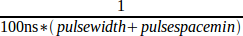

:lang: fr
:toc:

[[cha:pico-drivers]]
= Pico PPMC

Le _Pico Systems_ est une famille de cartes pour contrôler les servos analogiques,
les moteurs pas à pas et les servos numériques pilotés en PWM. Les cartes
se connectent sur le PC par le port parallèle configuré en mode EPP. Bien que
la plupart des utilisateurs ne connectent qu'une seule carte par port
parallèle, en théorie toutes les combinaisons de cartes entre 8 et 16 peuvent
être utilisées sur un seul port parallèle. Un pilote servant pour tous les
types de cartes. La combinaison finale d'entrées/sorties dépends du nombre de
cartes installées. Le pilote ne distingue pas entre les cartes, il s'agit
simplement d'un numéro de canal d'entrées/sorties (codeur, etc) commençant à 0
sur la première carte.
And the Universal PWM Controller, or UPC.

Installation:

----
loadrt hal_ppmc port_addr=<addr1>[,<addr2>[,<addr3>...]]
----

Le paramètres _port_addr_ indique au pilote quel port parallèle utiliser.
Par défaut, _<addr1>_ est en 0x0378, _<addr2>_ et les suivantes ne sont pas
utilisées. Le pilote cherche sur l'espace entier de l'adresse du port
parallèle étendu (EPP) indiquée par _port_addr_, scrutant pour toute carte(s)
de la famille PPMC. Il exporte ensuite les pins de HAL de tout ce qu'il a trouvé.
Durant le chargement, ou la tentative de chargement, le pilote affiche tous
les messages de débogage utiles dans le log du noyau, qui pourra être visualisé
avec _dmesg_.

Un maximum de 3 bus parport peuvent êtres utilisés, et chaque bus peut recevoir
un maximum de 8 périphériques.

== Option de ligne de commande

There are several options that can be specified on the loadrt command line.
First, the USC and UPC can have an 8-bit DAC added for spindle speed
control and similar functions.  This can be specified with the
extradac='0xnn[,0xmm]' parameter.  The part enclosed in [ ] allows you
to specify this option on more than one board of the system.  The first
hex digit tells which EPP bus is being referred to, it corresponds to
the order of the port addresses in the port_addr parameter, where
<addr1> would be zero here.  So, for the first EPP bus, the first
USC or UPC board would be described as '0x00', the second USC or UPC
on the same bus would be '0x02'.  (Note that each USC or UPC takes up
two addresses, so if one is at 00, the next would have to be 02.)

Alternatively, the 8 digital output pins can be used as additional
digital outputs, it works the same way as above with the syntax :
extradout=0xnn'.  The extradac and extradout options are mutually
exclusive on each board, you can only specify one.

The UPC and PPMC encoder boards can timestamp the arrival of encoder
counts to refine the derivation of axis velocity.  This derived velocity
can be fed to the PID hal component to produce smoother D term
response.  The syntax is : timestamp='0xnn[,0xmm]', this works the
same way as above to select which board is being configured.
Default is to not enable the timestamp option.  If you put
this option on the command line, it enables the option.  The
first 'n' selects the EPP bus, the second one matches the
address of the board having the option enabled.  The driver checks the
revision level of the board to make sure it has firmware supporting
the feature, and produces an error message if the board does not
support it.

The PPMC encoder board has an option to select the encoder digital
filter frequeency.  (The UPC has the same ability via DIP switches
on the board.)  Since the PPMC encoder board doesn't have these
extra DIP switches, it needs to be selected via a command-line
option.  By default, the filter runs at 1 MHz, allowing encoders
to be counted up to about 900 KHz (depending on noise and quadrature
accuracy of the encoder.)  The options are 1, 2.5, 5 and 10 MHz.
These are set with a parameter of 1,2,5 and 10 (decimal) which
is specified as the hex digit "A".  These are specified in a manner
similar to the above options, but with the frequency setting to
the left of the bus/address digits.  So, to set 5 MHz on the
encoder board at address 3 on the first EPP bus, you would write :
enc_clock='0x503'

It was recently discovered that some parallel port chips would not work with the ppmc driver.
Especially, the Oxford OXPCIe952 chip on the SIIG PCIe parallel port cards had this trouble.
The ppmc driver in all LinuxCNC versions starting from 2.7.8 have been corrected for this problem by default.  However, this possibly could cause problems with really old EPP parallel port hardware, so there is a command line option to go back to the previous behavior.  The new behavior is set by default, or by adding the parameter epp_dir=0 on the command line.  To get the old behavior, add epp_dir=1 to the command line.
All parallel ports I have here work with the new default behavior.  As on the other parameters, it is possible to give a list, like epp_dir=1,0,1 to set different settings for each of up to 3 parallel ports.

== Broches

Dans ce qui suit, pour les pins, les paramètres et les fonctions, <board> représente l'ID de la carte. Selon nos conventions de nommage, la première carte
devrait toujours avoir l'ID zéro. Toutefois, le driver fixera l'ID en se basant
sur les switches de la carte, de sorte qu'il peut être différent de zéro même si
il n'y a qu'une seule carte.USC and UPC have simple provisions for only
two addresses, but jumper foil cuts allow up to 4 boards to be addressed.
The PPMC boards have 16 possible addresses. In all cases, the driver
enumerates the boards by type and exports the appropriate HAL pins.
For instance, the encoders will be enumerated from zero up, in the
same order as the address switches on the board specify.  So, the first
board will have encoders 0 -- 3, the second board would have encoders
4 -- 7.
The first column after the bullet tells which boards will have this
HAL pin or parameter associated with it. All means that this pin is
available on all three board types.  Option means that this pin
will only be exported when that option is enabled by an optional
parameter in the loadrt HAL command. These options require the
board to have a sufficient revision level to support the feature.

* '(All s32 output) ppmc.<port>.encoder.<channel>.count' - Position codeur, en nombre de top comptés.
* '(All s32 output) ppmc.<port>.encoder.<channel>.delta' - Différence de top comptés depuis la dernière lecture, en unités brutes de comptage codeur.
* '(All float output) ppmc.<port>.encoder.<channel>.velocity' -
  Vitesse mise à l'échelle en unités utilisateur par seconde. Sur PPMC et USC
  ces valeurs sont dérivées du nombre de top codeur par période servo, elle est
  donc affectée par la granularité du codeur. Sur les cartes UPC avec les
  micro-logiciels du 21/08/09 et suivants, la vitesse est estimée par
  timestamping sur le comptage du codeur, ce qui peut être utilisé pour
  accroitre la finesse de cette sortie vitesse. Cela peut être régulé par
  un composant PID de HAL pour produire une réponse servo plus stable. Cette
  fonction doit être validée dans la ligne de commande HAL qui démarre le pilote PPMC, avec une option _timestamp=0x00_.
* '(All float output) ppmc.<port>.encoder.<channel>.position' - Position codeur, en unités utilisateur.
* '(All bit bidir) ppmc.<port>.encoder.<channel>.index-enable' -
  Connecte l'index _axis.#.index-enable_ pour _home-to-index_. C'et un signal
  de HAL bi-directionnel. Le fixer à TRUE, causera une remise à zéro hardware
  du codeur sur la prochaine impulsion d'index du codeur.
  Le pilote détectera cela et remettra le signal sur FALSE.
* '(PPMC float output) ppmc.<port>.DAC.<channel>.value' - sends a
  signed value to the 16-bit Digital to Analog Converter on the PPMC DAC16
  board commanding the analog output voltage of that DAC channel.
* '(UPC bit input) ppmc.<port>.pwm.<channel>.enable' - Active un générateur de PWM.
* '(UPC float input) ppmc.<port>.pwm.<channel>.value' -
  Valeur qui détermine le rapport cyclique de l'onde PWM. La valeur est
  divisée par _pwm.<channel>.scale_, par exemple, si le résultat est
  0.6, le rapport cyclique sera de 60%, et ainsi de suite.
  Les valeurs de rapport cyclique négatives finiront en valeurs absolues, la
  pin de direction sera positionnée pour indiquer ce négatif.
* '(USC bit input) ppmc.<port>.stepgen.<channel>.enable' -
  Active un générateur d'impulsions de pas.
* '(USC float input) ppmc.<port>.stepgen.<channel>.velocity' -
  Valeur qui détermine la fréquence des pas. La valeur est multipliée
  par _stepgen.<channel>.scale_ et le résultat est la fréquence, en pas par
  seconde. Des valeurs négatives résultera une fréquence basée sur une valeur
  absolue, la pin de direction sera positionnée
  pour indiquer ce négatif.
* '(All bit output) ppmc.<port>.in-<channel>.in' -
  État d'une pin d'entrée numérique, voir l'entrée numérique canonique.
* '(All bit output) ppmc.<port>.din.<channel>.in-not' -
  État inversé d'une pin d'entrée numérique, voir l'entrée numérique canonique.
* '(All bit input) ppmc.<port>.dout.<channel>.out' -
  Valeur  à écrire sur une sortie numérique, voir la sortie numérique canonique.
* '(Option float output) ppmc.<port>.DAC8-<channel>.value' -
  Valeur à écrire sur une sortie analogique, étendue entre 0 et 255.
  Ce qui envoie 8 bits de sortie sur J8, sur lequel doit être connectée une
  carte DAC de broche. 0 corresponds à zéro Volts, 255 corresponds à 10 Volts.
  La polarité de la sortie peut être fixée toujours négative, toujours
  positive, ou elle peut être contrôlée par l'état de SSR1 (positive quand
  _on_) et SSR2 (négative quand _on_). Vous devez spécifier
  _extradac = 0x00_ sur la ligne de commande HAL qui charge le pilote
  PPMC pour valider cette fonction sur la première carte USC ou UPC.
* '(Option bit input) ppmc.<port>.dout-<channel>.out' -
  Valeur à écrire sur une des 8 pins de sorties extra numériques de J8.
  Vous devez spécifier _extradout = 0x00_ sur la ligne de commande HAL qui
  charge le pilote PPMC pour valider cette fonction sur la première carte
  USC ou UPC. _extradac_ et _extradout_ sont des caractéristiques
  mutuellement exclusives comme elles utilisent les mêmes lignes de signal à
  des fins différentes.Ces pins de sortie seront énumérées après les sorties numériques standards de la carte.

== Paramètres

* '(All float) ppmc.<port>.enc.<channel>.scale' -
  Nombre de tops codeur par unité utilisateur (pour les conversions depuis le nombre d'unités).
* '(UPC float) ppmc.<port>.pwm.<channel-range>.freq' -
  Fréquence porteuse de la PWM, en Hz. S'applique à un groupe de quatre
  générateurs de PWM consécutifs, indiqués par _<channel-range>_.
  Le minimum est de 610Hz, le maximum est de 500KHz.
* '(PPMC float) ppmc.<port>.DAC.<channel>.scale'  - Sets scale
  of DAC16 output channel such that an output value equal to the 1/scale
  value will produce an output of + or - value Volts.  So, if the scale
  parameter is 0.1 and you send a value of 0.5, the output will be 5.0 Volts.
* '(UPC float) ppmc.<port>.pwm.<channel>.scale' -
  Échelle pour générateur de PWM.
  Si _scale_ vaut X, alors le rapport cyclique sera de 100% quand _value_ de la pin vaudra X (ou -X).
* '(UPC float) ppmc.<port>.pwm.<channel>.max-dc' -
  Rapport cyclique maximum, compris entre 0.0 et 1.0.
* '(UPC float) ppmc.<port>.pwm.<channel>.min-dc' -
  Rapport cyclique minimum, compris entre 0.0 et 1.0.
* '(UPC float) ppmc.<port>.pwm.<channel>.duty-cycle' -
  Rapport cyclique actuel (utilisé surtout pour la maintenance)
* '(UPC bit) ppmc.<port>.pwm.<channel>.bootstrap' - Si true,
  le générateur de PWM générera une courte séquence d'impulsions
  dans les deux polarités quand l'Arrêt d'Urgence sera activé,
  pour charger les capacités de bootstrap utilisées par certains pilotes à portes MOSFET.
* '(USC u32) ppmc.<port>.stepgen.<channel-range>.setup-time' -
  Fixe le temps minimum, entre l'impulsion de changement de direction et
  l'impulsion de pas, en unités de 100ns. S'applique à un groupe de quatre
  générateurs de PWM consécutifs, comme indiqué par _<channel-range>_.
* '(USC u32) ppmc.<port>.stepgen.<channel-range>.pulse-width' -
  Fixe la largeur des impulsions de pas, en unité de 100ns. S'applique à un
  groupe de quatre générateurs de PWM consécutifs, comme indiqué par
  _<channel-range>_.
* '(USC u32) ppmc.<port>.stepgen.<channel-range>.pulse-space-min' -
  Fixe le temps minimum entre les impulsions, en unité de 100ns. S'applique
  à un groupe de quatre générateurs de PWM consécutifs, comme indiqué
  par _<channel-range>_.
  Le ratio maximum est:
  
* '(USC float) ppmc.<port>.stepgen.<channel>.scale' -
  Échelle pour générateur d'impulsions de pas. La fréquence des pas est
  en Hz, c'est la valeur absolue de _vitesse_ * _échelle_.
* '(USC float) ppmc.<port>.stepgen.<channel>.max-vel' -
  La valeur maximum de _velocity_. Les consignes supérieures à _max-vel_,
  lui seront clampées. S'applique également aux valeurs négatives. (La valeur absolue est clampée.)
* '(USC float) ppmc.<port>.stepgen.<channel>.frequency' -
  Fréquence de pas actuelle en Hz (utilisé principalement pour la maintenance)
* '(Option float) ppmc.<port>.DAC8.<channel>.scale' -
  Fixe l'échelle d'une sortie extra DAC, de sorte qu'une valeur de sortie
  égale à l'échelle fournisse une amplitude de sortie de 10.0 V.
  (Le signe de la sortie est fixé par cavaliers et/ou une autre sortie numérique)
* '(Option bit) ppmc.<port>.out.<channel>-invert' -
  Inverse une sortie numérique, voir la sortie numérique canonique.
* '(Option bit) ppmc.<port>.dout.<channel>-invert' -
  Inverse une sortie numérique de J8, voir la sortie numérique canonique.

== Fonctions

* '(All funct) ppmc.<port>.read' -
  Lit toutes les entrées (entrées numériques et top de codeurs) sur un port.
  Ces lectures sont organisées par blocs de registres contigus, pour éviter
  au maximum de charger le CPU.
* '(All funct) ppmc.<port>.write' -
  Écrit toutes les sorties (sorties numériques, générateurs de pas et
  de PWM) sur un port. Ces lectures sont organisées par blocs de registres
  contigus, pour éviter au maximum de charger le CPU.
