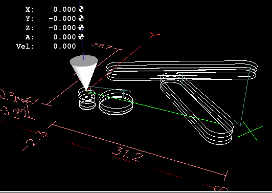
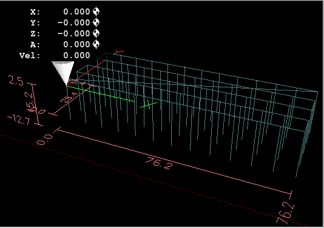
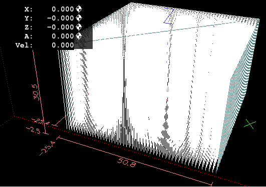

:lang: en
:toc:

[[cha:gcode-examples]]
= G-Code Examples

After you install LinuxCNC several sample files are placed in the
/nc_files folder. Make sure the sample file is appropriate for your
machine before running.

== Mill Examples

=== Helical Hole Milling

- File Name: useful-subroutines.ngc
- Description: Subroutine for milling a hole using parameters.

=== Slotting

- File Name: useful-subroutines.ngc
- Description: Subroutine for milling a slot using parameters.

=== Grid Probe

- File Name: gridprobe.ngc
- Description: Rectangular Probing

This program repeatedly probes in a regular XY grid and writes the
probed location to the file 'probe-results.txt' in the same directory
as the .ini file.

=== Smart Probe

- File Name: smartprobe.ngc
- Description: Rectangular Probing

This program repeatedly probes in a regular XY grid and writes the
probed location to the file 'probe-results.txt' in the same directory
as the .ini file. This is improved from the grid probe file.

=== Tool Length Probe

- File Name: tool-length-probe.ngc
- Description: Tool Length Probing

This program shows an example of how to measure tool lengths
automatically using a switch hooked to the probe input. This is useful
for machines without tool holders, where the length of a tool is
different every time it is inserted.

=== Hole Probe

- File Name: probe-hole.ngc
- Description: Finding the Center and Diameter of a hole.

The program demonstrates how to find the center of a hole, measure the
hole diameter and record the results.

=== Cutter Compensation

- File Name: comp-g1.ngc
- Description: Entry and exit movements with compensation of tool radius.

This program demonstrates the peculiarity of the toolpath without and with
tool radius compensation. The tool radius is taken from the
tool table.

== Lathe Examples

=== Threading

- File Name lathe-g76.ngc
- Description: Facing, threading and parting off.

This file shows an example of threading on a lathe using parameters.

// vim: set syntax=asciidoc:
