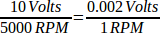

:lang: es

[[cha:spindle-control]]

LinuxCNC puede controlar hasta 8 husillos. El número se establece en el archivo INI.
Todos los ejemplos a continuación se refieren a una configuración de husillo único con
pines de control del husillo con nombres como spindle.0...
En el caso de una máquina de husillos múltiples, todo lo que cambia es que
existen pines adicionales con nombres como spindle.6...

= Control de husillo

(((0-10v Spindle Speed Example)))

== Velocidad del husillo 0-10v

Si la velocidad de su husillo está controlada por una señal analógica,
(por ejemplo, por un VFD con una señal de 0 a 10 voltios) y
estás usando una tarjeta DAC como la m5i20 para emitir la señal de control:

Primero debe calcular la escala de la velocidad del husillo para controlar la señal.
Para este ejemplo, la velocidad máxima del eje de 5000 RPM es igual a 10
voltios

Tenemos que agregar un componente de escala al archivo HAL para escalar
spindle.N.speed-out de 0 a 10 que necesita el VFD si su DAC de la
la tarjeta no hace escalado.

----
loadrt scale count=1
addf scale.0 servo-thread
setp scale.0.gain 0.002    
net spindle-speed-scale spindle.0.speed-out => scale.0.in
net spindle-speed-DAC scale.0.out => <su nombre pin DAC>    
----

(((PWM Spindle Speed Example)))

== Velocidad del husillo PWM

Si su husillo puede ser controlado por una señal PWM,
use el componente pwmgen para crear la señal:

----
loadrt pwmgen output_type=0 
addf pwmgen.update servo-thread
addf pwmgen.make-pulses base-thread    
net spindle-speed-cmd spindle.0.speed-out => pwmgen.0.value
net spindle-on spindle.0.on => pwmgen.0.enable
net spindle-pwm pwmgen.0.pwm => parport.0.pin-09-out
# Establecer la velocidad máxima del husillo en RPM
setp pwmgen.0.scale 1800
----

Esto supone que la respuesta del controlador de husillo a PWM es simple:
0% PWM da 0 RPM, 10% PWM da 180 RPM, etc. Si hay un PWM mínimo
requerido para hacer girar el husillo, siga el ejemplo en la
configuración de muestra de torno nist para usar un componente de escala.

(((Spindle Enable Example)))

== Habilitación del husillo

Si necesita una señal de habilitación de husillo,
enlace su pin de salida a spindle.0.on.
Para vincular estos pines a un pin de puerto paralelo, coloque algo como
lo siguiente en su archivo .hal, asegurándose de elegir el
pin que está conectado a su dispositivo de control.

----
net spindle-enable spindle.N.on => parport.0.pin-14-out
----

(((Spindle Direction Example)))

== Dirección del husillo

Si tiene control de dirección de su husillo, los pines HAL
spindle.N.forward y spindle.N.reverse están controlados por M3
y M4. La velocidad del husillo 'Sn' debe establecerse en un valor positivo distinto de cero para
que M3/M4 activen el movimiento del husillo.

Para vincular estos pines a un pin de puerto paralelo, coloque algo como lo
siguiendo en su archivo .hal asegurándose de elegir el pin que está
conectado a su dispositivo de control.

----
net spindle-fwd spindle.0.forward => parport.0.pin-16-out
net spindle-rev spindle.0.reverse => parport.0.pin-17-out
----

(((Spindle Soft Start Example)))

== Arranque suave del husillo

Si necesita rampa en el comando de velocidad del eje y su control
no tiene esa característica, se puede hacer en HAL. Básicamente necesita
secuestrar la salida de spindle.N.speed-out y llevarla a través de un
componente limit2 con la escala establecida, por lo que las rpm subiran en rampa desde
spindle.N.speed-out al dispositivo que recibe las rpm.
La segunda parte es informar a LinuxCNC cuando el husillo está a velocidad para que el movimiento
pueda empezar.

En el ejemplo de 0-10 voltios, la línea
    'net spindle-speed-scale spindle.0.speed-out => scale.0.in'
se cambia como se muestra en el siguiente ejemplo:

.Introducción a los componentes HAL2 limit2 y near:
*********************************************************************
En caso de que no los haya visto antes, aquí damos una introducción rápida
a los dos componentes HAL utilizados en el siguiente ejemplo. 

* "limit2" es un componente HAL (coma flotante) que acepta un
   valor de entrada y proporciona una salida que se ha limitado a un
   rango máximo/mínimo, y también limitado a no exceder una
   tasa de cambio especificada. 

* "near" es un componente HAL (coma flotante) con una salida binaria
   que dice si dos entradas son aproximadamente iguales.

Más información está disponible en la documentación de los componentes HAL,
o desde las páginas del manual, simplemente escriba 'man limit2' o 'man near' en una terminal.
*********************************************************************

----
# carga en tiempo real un limit2 y un near con nombres para que sean más fáciles de seguir
loadrt limit2 names=spindle-ramp
loadrt near names=spindle-at-speed

# agregar las funciones a un hilo
addf spindle-ramp servo-thread
addf spindle-at-speed servo-thread

# establece el parámetro para la tasa máxima de cambio
# (aceleración / desaceleración máxima del husillo en unidades por segundo)
setp spindle-ramp.maxv 60

# secuestrar la velocidad del husillo y enviarla a spindle-ramp
net spindle-cmd <= spindle.0.speed-out => spindle-ramp.in

# la salida de spindle-ramp se envía a la escala
net spindle-ramped <= spindle-ramp.out => scale.0.in

# para saber cuándo comenzar el movimiento enviamos al componente near
# (denominado spindle-at-speed) la velocidad ordenada del husillo desde
# la señal spindle-cmd y la velocidad real del mismo
# siempre que su husillo pueda acelerar a la configuración maxv.
net spindle-cmd => spindle-at-speed.in1
net spindle-ramped => spindle-at-speed.in2

# la salida de spindle-at-speed se envía a spindle.0.at-speed
# y cuando esto sea cierto, comenzará el movimiento
net spindle-ready <= spindle-at-speed.out => spindle.0.at-speed
----

== Feedback del husillo

(((Spindle Synchronized Motion Example)))

=== Movimiento sincronizado del husillo

Spindle feedback is needed by LinuxCNC to perform any spindle coordinated
motions like threading and constant surface speed. 
LinuxCNC can perform synchronised motion and CSS with any of up to 8
spindles. Which spindles are used is controlled from G-code. CSS is
possible with several spindles simultaneously. 

The StepConf Wizard can perform the connections for a single-spindle
configuration for you if you select Encoder Phase A and Encoder Index as
inputs.
LinuxCNC necesita retroalimentación del husillo para realizar cualquier
movimiento coordinado con el husillo como roscado o velocidad de superficie constante (CSS).
LinuxCNC puede realizar movimientos sincronizados y CSS con cualquiera de hasta 8
husillos. Los husillos que se utilizan se controlan desde el código G. CSS es
posible con varios husillos simultáneamente.

El asistente StepConf puede realizar las conexiones para configurar un solo husillo
si selecciona Encoder Fase A e Encoder Indice como entradas.

Suposiciones de hardware:

* Un codificador está conectado al husillo y emite 100 pulsos por
   revolución en la fase A
* La fase A del codificador está conectada al pin 10 del puerto paralelo
* El pulso de índice del codificador está conectado al pin 11 del puerto paralelo

Pasos básicos para agregar los componentes y configurarlos:
footnote:[En este ejemplo, asumiremos que algunos codificadores ya tienen
asignaciones a ejes/articulaciones 0, 1 y 2. Por tanto, el próximo codificador disponible para nosotros
sería el número 3. Su situación puede ser diferente.]
footnote:[La habilitación del índice del codificador HAL es una excepción a la regla ya que
se comporta como una entrada y una salida, vea la
<<sec:encoder, sección del codificador>> para más detalles]
footnote:[Ya que seleccionamos 'conteo simple no en cuadratura ...',
podemos salir con el conteo de 'cuadratura' sin tener ninguna
entrada B de cuadratura.]

----
# agregar el codificador a HAL y conéctarlo a los hilos.
loadrt encoder num_chan=1
addf encoder.update-counters base-thread
addf encoder.capture-position servo-thread

# establecer el codificador HAL en 100 pulsos por revolución.
setp encoder.3.position-scale 100

# establecer el codificador HAL en un recuento simple no en cuadratura usando solo A.
setp encoder.3.counter-mode true

# conectar las salidas del codificador HAL a LinuxCNC.
net spindle-position encoder.3.position => spindle.0.revs
net spindle-velocity encoder.3.velocity => spindle.0.speed-in
net spindle-index-enable encoder.3.index-enable <=> spindle.N.index-enable

# conectar las entradas del codificador HAL al codificador real.
net spindle-phase-a encoder.3.phase-A <= parport.0.pin-10-in
net spindle-phase-b encoder.3.phase-B 
net spindle-index encoder.3.phase-Z <= parport.0.pin-11-in
----

(((Spindle At Speed Example)))

=== Husillo a velocidad

Para permitir que LinuxCNC espere a que el eje esté a velocidad antes de ejecutar
una serie de movimientos, debe establecer spindle.N.at-speed en true cuando
el husillo está a la velocidad ordenada. Para hacer esto necesita
retroalimentación de un codificador en el husillo. Puesto que la retroalimentación y la velocidad ordenada
por lo general, no son "exactamente" iguales, debería usar un componente "near"
para determinar que los dos números están lo suficientemente proximos.

Las conexiones necesarias son desde la
señal de comando de velocidad del husillo a near.n.in1 y
desde el codificador hasta near.n.in2. near.n.out está conectado a
spindle.N.at-speed. near.n.scale debe establecerse para decir cuanto de
cerca deben estar los dos números antes de activar la salida. Dependiendo
de su configuración, es posible que deba ajustar la escala para que funcione con su
hardware.

Lo siguiente son las adiciones típicas necesarias para su
archivo HAL para habilitar Spindle At Speed. Si ya tiene near en su HAL,
aumente count y ajuste el código para adaptarlo.
Asegúrese de que los nombres de las señales sean los mismos en su archivo HAL.

----
# cargar un componente near y adjuntarlo a un hilo
loadrt near
addf near.0 servo-thread

# conectar una entrada a la velocidad de husillo ordenada
net spindle-cmd => near.0.in1

# conectar una entrada a la velocidad del husillo medida por el codificador
net spindle-velocity => near.0.in2

# conectar la salida a la entrada de spindle-at-speed
net spindle-at-speed spindle.0.at-speed <= near.0.out

# configurar las entradas de velocidad del husillo para que estén de acuerdo si están dentro del 1%
setp near.0.scale 1.01
----

