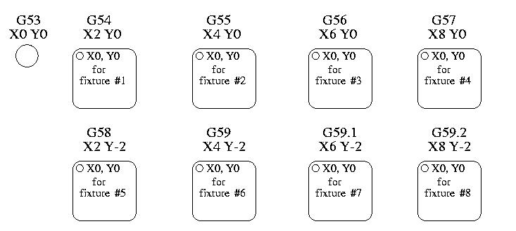

:lang: fr
:toc:

[[cha:systemes-de-coordonnees]]
= Systèmes de coordonnées et décalages(((Systemes-de-coordonnees)))

== Introduction

Dans ce chapitre, nous allons tenter de démystifier les systèmes de coordonnées.
C'est une notion capitale pour maitriser le fonctionnement d'une machine CNC, sa
configuration et son utilisation.

Nous montrerons également, qu'il est très intéressant d'utiliser un point de
référence sur le brut ou la pièce et de faire travailler le programme à partir
de ce point, sans avoir à tenir compte d'où est placée la pièce sur la machine pendant l'usinage.

Ce chapitre va donc introduire les décalages et comment ils sont utilisés
par LinuxCNC:

* Les coordonnées machine.(G53)
* Les neuf décalages d'origine pièce.(G54 à G59.3)
* Un jeu de décalages globaux.(G92)

[[sec:systeme-coordonnees-machines]]
== Système de coordonnées machine

When LinuxCNC is started the positions of each axis is the machine origin. Once
an axis is homed, the machine origin for that axis is set to the homed position.
The machine origin is the machine coordinate system on which all other coordinate
systems are based. The <<gcode:g53,G53>> G code can be used to move in the
machine coordinate system.

=== Mouvements en coordonnées machine: G53

Indépendamment de tout décalage pouvant être actif, un G53 dans une ligne de
code indique à l'interpréteur de se déplacer aux positions réelles des axes
(positions absolues), commandées dans la ligne. Par exemple:

----
G53 G0 X0 Y0 Z0
----

déplacera le mobile depuis la position actuelle vers la position où
les coordonnées machine des trois axes seront à zéro. Vous pouvez
utiliser cette commande si vous avez une position fixe pour le
changement d'outil ou si votre machine dispose d'un changeur
automatique. Vous pouvez aussi utiliser cette commande pour dégager la zone de travail et accéder à la pièce dans l'étau.

G53 est une commande non modale. Elle doit être utilisée sur chaque
ligne où un mouvement basé sur les coordonnées machine est souhaité.

== Systèmes de coordonnées de travail (G54 à G59.3)

[[fig:systemes-coordonnees-exemple]]
.Exemple des systèmes de coordonnées

.Décalages d'Origine
* G54 - use coordinate system 1
* G55 - use coordinate system 2
* G56 - use coordinate system 3
* G57 - use coordinate system 4
* G58 - use coordinate system 5
* G59 - use coordinate system 6
* G59.1 - use coordinate system 7
* G59.2 - use coordinate system 8
* G59.3 - use coordinate system 9

Le décalage d'origine est utilisé pour séparer le point de référence de la pièce, de l'origine machine, créant ainsi un système de
coordonnées (relatif), propre à chaque pièce et décalé du système de coordonnées machine (absolu). Il permet, entre autre, dans le cas de
pièces multiples mais semblables, de créer en décalant ses origines, le
système de coordonnées de chaque pièce, le programme restant le même.
Un cas typique d'utilisation de cette fonctionnalité, pour usiner huit ilots identiques sur la même pièce, est illustré sur la figure ci-dessus.

Les valeurs des décalages sont enregistrées dans le fichier VAR qui
est requis par le fichier INI durant le démarrage de LinuxCNC. Dans l'exemple
ci-dessous, qui utilise G55, la valeur de chacun des axes de G55
est enregistrée dans une variable numérotée.

Dans le schéma d'un fichier VAR, la première variable contient la
valeur du décalage de l'axe X, la seconde variable le décalage de l'axe
Y et ainsi de suite pour les six axes. Il y a une série de variables de ce genre pour chacun des décalages pièce.

Chacune des interfaces graphiques offre un moyen de fixer les valeurs
de ces décalages. Vous pouvez également définir ces valeurs en
modifiant le fichier VAR lui-même, puis faire un [reset], pour que LinuxCNC
lise les nouvelles valeurs, FIXME however this is not the recommended way. Using G10, G52, G92, G28.1,
etc are better ways to set the variables. Pour notre exemple, nous allons éditer
directement le fichier pour que G55 prenne les valeurs suivantes:

.Example of G55 parameters
[width="40%",cols="^,^,^",options="header"]
|==========================
|Axis | Variable |    Value
| X   | 5241     |  2.000000
| Y   | 5242     |  1.000000
| Z   | 5243     | -2.000000
| A   | 5244     |  0.000000
| B   | 5245     |  0.000000
| C   | 5246     |  0.000000
| U   | 5247     |  0.000000
| V   | 5248     |  0.000000
| W   | 5249     |  0.000000
|==========================

Vous pouvez voir que les positions zéro de G55 sont passées en X = 2, 
Y = 1, et Z = -2 éloignées donc de l'origine absolue (machine).

Une fois que les valeurs sont assignées, un appel de G55 dans une ligne de programme décalera le point de référence zéro, l'origine, vers
les valeurs enregistrées. La ligne suivante décalera chacun des axes
vers sa nouvelle position d'origine. Contrairement à G53, les commandes
G54 à G59.3 sont modales. Elles agissent sur toutes les lignes de
G-code du programme après qu'une ait été rencontrée. Voyons le
programme qui pourrait être écrit à l'aide de la figure
<<fig:systemes-coordonnees-exemples, d'exemple de systèmes de coordonnées>>, il suffira d'un seul point de
référence pour chacune des pièces pour faire tout le travail. Le code suivant
est proposé comme exemple pour faire un rectangle, il utilisera les décalages G55 que nous avons expliqué précédemment.

----
G55 ; Utiliser le deuxieme decalage d'origine
G0 X0 Y0 Z0
G1 F2 Z-0.2000
X1
Y1
X0
Y0
G0 Z0
G54 ; Utiliser le premier decalage d'origine
G0 X0 Y0 Z0
M2
----

'Mais,' dites vous, 'pourquoi y a-t-il un G54 vers la fin ?' C'est une
pratique courante de quitter le système de coordonnées G54 avec
l'ensemble des valeurs d'axes à zéro afin de laisser un code modal basé
sur les positions machine absolues. Nous le faisons avec cette commande
qui met la machine à zéro. Il aurait été possible d'utiliser G53 et
d'arriver au même endroit, mais la commande n'aurait pas été modale,
les commandes suivantes auraient voulu retourner dans le système de coordonnées du G55 toujours actif.

----
G54	utilise les réglages du système de coordonnées 1(((G54)))
G55	utilise les réglages du système de coordonnées 2(((G55)))
G56	utilise les réglages du système de coordonnées 3(((G56)))
G57	utilise les réglages du système de coordonnées 4(((G57)))
G58	utilise les réglages du système de coordonnées 5(((G58)))
G59	utilise les réglages du système de coordonnées 6(((G59)))
G59.1	utilise les réglages du système de coordonnées 7(((G59.1)))
G59.2	utilise les réglages du système de coordonnées 8(((G59.2)))
G59.3	utilise les réglages du système de coordonnées 9(((G59.3)))
----

=== Système de coordonnées par défaut

Une autre variable dans le fichier VAR joue un rôle important dans les
décalages, c'est la variable 5220. Dans les fichiers par défaut, sa
valeur est fixée à 1,00000. Ce qui signifie que lorsque LinuxCNC démarre, il
doit utiliser le premier système de coordonnées comme système par
défaut. Si vous définissez celui-ci à 9,00000 le neuvième système
décalé sera utilisé par défaut au démarrage du système et aux
réinitialisations. Toute valeur autre qu'un entier compris entre 1 et
9, ou l'absence de la variable 5220, provoquera au démarrage le retour de LinuxCNC à la valeur par défaut de 1.00000.

=== Réglage des décalages d'Origine

La commande G10 L2x peut être utilisée pour modifier les valeurs des décalages d'un système de coordonnées pièce:

* 'G10 L2  P(pièce 1-9)' - Ajuste les valeurs d'offset. La position courante reste inchangée. (voir la section<<sec:G10-L2, G10 L2>> pour les détails)
* 'G10 L20 P(pièce 1-9)' - Ajuste les valeurs d'offset de sorte que la position courante devienne la position donnée en paramètre. (Voir la section <<sec:G10-L20,G10 L20>> pour les détails)

[NOTE]
Nous donnons seulement ici un bref aperçu, se reporter aux sections du G-code
pour une description complète.

[[sec:decalages-g52-et-g92]]
== Décalages Locaux et Globaux

[[sec:g52]]
=== The G52 command

'G52' is used in a part program as a temporary "local coordinate
system offset" within the workpiece coordinate system.  An example use
case is when machining several identical features at different
locations on a part.  For each feature, 'G52' programs a local
reference point within workpiece coordinates, and a subprogram is
called to machine the feature relative to that point.

'G52' axis offsets are programmed relative to workpiece coordinate
offsets 'G54' through 'G59.3'.  As a local offset, 'G52' is applied
after the workpiece offset, including rotation.  Thus, a part feature
will be machined identically on each part regardless of the part's
orientation on the pallet.

[CAUTION]
As a temporary offset, set and unset within the localized scope of a
part program, in other G-code interpreters 'G52' does not persist
after machine reset, 'M02' or 'M30'.  In LinuxCNC, 'G52' shares
parameters with 'G92', which, for historical reasons, *does* persist
these parameters.
See <<sec:g92-persistence-cautions,G92 Persistence Cautions>> below.

[CAUTION]
'G52' and 'G92' share the same offset registers.  Therefore, setting
'G52' will override any earlier 'G92' setting, and 'G52' will persist
across machine reset when 'G92' persistence is enabled.  These
interactions may result in unexpected offsets.
See <<sec:g92-g52-interaction-cautions,G92 and G52 Interaction Cautions>> below.

Programming 'G52 X1 Y2' offsets the current workpiece coordinate
system X axis by 1 and Y axis by 2.  Accordingly, on the DRO, the
current tool position's X and Y coordinates will be reduced by 1 and
2, respectively.  Axes unset in the command, such as Z in the previous
example, will be unaffected: any previous 'G52' Z offset will remain
in effect, and otherwise the Z offset will be zero.

The temporary local offset may be canceled with 'G52 X0 Y0'.  Any axes
not explicitly zeroed will retain the previous offset.

'G52' shares the same offset registers as 'G92', and thus
'G52' is visible on the DRO and preview labeled with 'G92'.

[[sec:g92-decalages-axes]]
== Décalages d'axes G92

G92 est la plus incomprise et la plus maligne des commandes
programmables avec LinuxCNC. La façon dont elle fonctionne a un peu changé
entre les premières versions et l'actuelle. Ces changements ont sans
doute déconcerté de nombreux utilisateurs. Elle devrait être vue comme
une commande produisant un décalage temporaire, qui s'applique à tous
les autres décalages.

[[sec:g92-commandes]]
=== Les commandes G92

'G92' is typically used in two conceptually different ways: as a
"global coordinate system offset" or as a "local coordinate system
offset".

Ce jeu de commandes inclus:

* G92 - Cette commande, utilisée avec des mots d'axes, fixe les valeurs des variables de décalage.
* G92.1 - Cette commande met à zéro les valeurs des variables de G92.
* G92.2 - Cette commande suspend, sans les mettre à zéro, les variables de G92.
* G92.3 - Cette commande applique les valeurs de décalage qui ont été suspendues.

As a global offset, 'G92' is used to shift all workpiece coordinate
systems 'G54' through 'G59.3'.  An example use case is when machining
several identical parts in fixtures with known locations on a pallet,
but the pallet location may change between runs or between machines.
Each fixture location offset, relative to a reference point on the
pallet, is preset in one of the workpiece coordinate systems, 'G54'
through 'G59.3', and 'G92' is used to "touch off" on the pallet
reference point.  Then, for each part, the corresponding workpiece
coordinate system is selected and the part program is executed.

[NOTE]
'G10 R-' workpiece coordinate system rotation is specific to the
'rs274ngc' interpreter, and the 'G92' offset is applied 'after'
rotation.  When using 'G92' as a global offset, workpiece coordinate
system rotations may have unexpected results.

As a local coordinate system, 'G92' is used as a temporary offset
within the workpiece coordinate system.  An example use case is when
machining a part with several identical features at different
locations.  For each feature, 'G92' is used to set a local reference
point, and a subprogram is called to machine the feature starting at
that point.

[NOTE]
The use of 'G92' is discouraged for programming with local coordinate
systems in a part program.  Instead, see <<sec:g52,'G52'>>, a local
coordinate system offset more intuitive when desired offset relative
to the workpiece is known but current tool location may not be known.

Programming 'G92 X0 Y0 Z0' sets the current tool location to the
coordinates X0, Y0, and Z0, without motion.  G92 *does not* work from
absolute machine coordinates.  It works from *current location*.

G92 travaille également à partir d'un emplacement actuel déjà modifié
par tout autre décalage actif au moment où la commande G92 est
invoquée. Lors de tests des différences entre les décalages de travail
et les décalages réels, il a été constaté qu'un décalage G54 pouvait
annuler un G92 et ainsi, donner l'apparence qu'aucun décalage n'était
actif. Toutefois, le G92 était toujours actif, pour toutes les
coordonnées et il a produit les décalages attendus pour tous les autres systèmes de coordonnées.

Lors du démarrage de LinuxCNC, si des offsets existent dans les variables de G92, ils seront appliqués lors de la prise d'origine des axes concernés.
Programmers that wish for Fanuc behavior, where 'G92' offsets are
cleared at machine start and after a reset or program end, may disable
'G92' persistence by setting 'DISABLE_G92_PERSISTENCE = 1' in the
'[RS274NGC]' section of the '.ini' file.

[NOTE]
Il est donc de bonne pratique de mettre les offsets de G92 à zéro par G92.1 ou
un G92.2 à la fin de leur utilisation. When starting up LinuxCNC with 'G92'
persistence enabled (the default), any offsets in the 'G92' variables
will be applied when an axis is homed.  See
<<sec:g92-persistence-cautions,G92 Persistence Cautions>> below.

=== Réglage des valeurs de G92

Il y a au moins deux façons d'établir les valeurs de G92.

* Par un clic droit de la souris sur les afficheurs de position de
  tklinuxcnc, une fenêtre s'ouvre dans laquelle il est possible de saisir une valeur.
* Par la commande G92.

Toutes les deux, fonctionnent depuis l'emplacement courant de l'axe auquel le déplacement doit être appliqué.

Programmer 'G92 X Y Z A B C U V W' fixe les valeurs des variables de G92
de sorte que chaque axe prenne la valeur associée à son nom. Ces
valeurs sont assignées à la position courante des axes. Ces résultats
satisfont les paragraphes un et deux du document du NIST.

Les commandes G92 fonctionnent à partir de la position courante de
l'axe, à laquelle elles ajoutent ou soustraient des valeurs pour donner
à la position courante la valeur assignée par la commande G92. Elles prennent effet même si d'autres décalages sont déjà actifs.

Ainsi, si l'axe X est actuellement en position X=2.000, un 'G92 X0'
fixera un décalage de -2.0000, de sorte que l'emplacement actuel de X
devienne X=0.000. Un nouveau 'G92 X5.000' fixera un décalage de 3.000
et l'affichage indiquera une
position courante X=5.000.

[[sec:precautions-de-persistance-avec-g92]]
=== Précautions de persistance avec G92

Parfois, les valeurs de décalage d'un G92 restent bloquées dans le
fichier VAR. Quand ça arrive, une ré-initialisation ou un redémarrage peut les rendre de nouveau actives.

Les variables sont numérotées:

* 5210 - Enable/disable flag (1.0/0.0)
* 5211 - X Axis Offset
* 5212 - Y Axis Offset
* 5213 - Z Axis Offset
* 5214 - A Axis Offset
* 5215 - B Axis Offset
* 5216 - C Axis Offset
* 5217 - U Axis Offset
* 5218 - V Axis Offset
* 5219 - W Axis Offset

where 5210 is the 'G92' enable flag (1 for enabled, 0 for disabled)
and 5211 to 5219 are the axis offsets. Si vous voyez des positions inattendues à la suite d'une commande de
déplacement, ou même des chiffres inattendus dans l'affichage de la
position lorsque vous démarrez, regardez ces variables dans le fichier
VAR pour vérifier si elles contiennent des valeurs. Si c'est le cas, les mettre à zéro devrait solutionner le problème.

Si des valeurs G92 existent dans le fichier VAR quand LinuxCNC démarre, ces 
valeurs seront appliquées aux valeurs courantes des emplacements d'axe. 
Si c'est sa position d'origine et que l'origine est définie au zéro machine, tout
sera correct. Une fois que l'origine machine a été établie en utilisant les 
contacts d'origine machine, ou en déplaçant chaque axe à une position connue, puis
en envoyant la commande de prise d'origine de l'axe, tous les décalages G92 seront
appliqués. Si un X1 G92 est actif lors de la prise d'origine machine de l'axe X,
la visu affichera 'X: 1.000' au lieu du 'X: 0.000' attendu, c'est parce-que le 
G92 a été appliqué à l'origine machine. Si vous passez un G92.1 et que la visu
affiche tous à zéro, alors c'est que vous avez encore l'effet de l'offset G92 
de la dernière session de LinuxCNC.

Sauf si votre intention est d'utiliser les mêmes décalages G92 dans le prochain
programme, la meilleure pratique consiste à envoyer un G92.1 à la fin de tout 
fichier de G-code dans lequel vous utilisez les compensations G92.

When a program is aborted during processing that has 'G92' offsets in
effect a startup will cause them to become active again.  As a
safeguard, always have your preamble to set the environment as you
expect it.  Additionally, 'G92' persistence may be disabled by setting
'DISABLE_G92_PERSISTENCE = 1' in the '[RS274NGC]' section of the
'.ini' file.

[[sec:g92-g52-interaction-cautions]]
=== G92 and G52 Interaction Cautions

'G52' and 'G92' share the same offset registers.  Unless 'G92'
persistence is disabled in the '.ini' file (see <<sec:g92-commands,G92 Commands>>),
'G52' offsets will also persist after machine reset,
'M02' or 'M30'.  Beware that a 'G52' offset in effect during a program
abort may result in unintended offsets when the next program is run.
See <<sec:g92-persistence-cautions,G92 Persistence Cautions>> above.

== Exemple de programme utilisant les décalages d'axes

=== Exemple de programme utilisant les Décalage d'Origines Pièces

Cet exemple de projet de gravure, usine un jeu de quatre cercles de
rayon .1 pouce dans une forme grossière d'étoile au centre du cercle.
Nous pouvons configurer individuellement les formes de la façon suivante:

----
G10 L2 P1 X0 Y0 Z0 (assure que G54 a mis la machine à zéro)
G0 X-0.1 Y0 Z0
G1 F1 Z-0.25
G3 X-0.1 Y0 I0.1 J0
G0 Z0
M2
----

Nous pouvons émettre une série de commandes pour créer des décalages
pour les quatre autres cercles comme cela.

----
G10 L2 P2 X0.5 (decalages G55 X la valeur de 0.5 pouces)
G10 L2 P3 X-0.5 (decalages G56 X valeur de -0.5 pouces)
G10 L2 P4 Y0.5 (decalages G57 valeur Y de 0.5 pouces)
G10 L2 P5 Y-0.5 (decalages G58 valeur Y de -0.5 pouces)
----

Nous mettons ces ensembles dans le programme suivant:

----
(Un programme de fraisage de cinq petits cercles dans un losange)

G10 L2 P1 X0 Y0 Z0 (assure que G54 a mis la machine à zero)
G10 L2 P2 X0.5 (decalages G55 X la valeur de 0.5 pouces)
G10 L2 P3 X-0.5 (decalages G56 X la valeur de -0.5 pouces)
G10 L2 P4 Y0.5 (decalages G57 X la valeur de 0.5 pouces)
G10 L2 P5 Y-0.5 (decalages G58 X la valeur de -0.5 pouces)

G54 G0 X-0.1 Y0 Z0 (cercle du centre)
G1 F1 Z-0.25
G3 X-0.1 Y0 I0.1 J0
G0 Z0

G55 G0 X-0.1 Y0 Z0 (premier cercle compensé)
G1 F1 Z-0.25
G3 X-0.1 Y0 I0.1 J0
G0 Z0

G56 G0 X-0.1 Y0 Z0 (deuxième cercle compensé)
G1 F1 Z-0.25
G3 X-0.1 Y0 I0.1 J0
G0 Z0

G57 G0 X-0.1 Y0 Z0 (troisième cercle compensé)
G1 F1 Z-0.25
G3 X-0.1 Y0 I0.1 J0
G0 Z0

G58 G0 X-0.1 Y0 Z0 (quatrième cercle compensé)
G1 F1 Z-0.25
G3 X-0.1 Y0 I0.1 J0
G54 G0 X0 Y0 Z0

M2
----

Maintenant c'est le moment d'appliquer une série de décalages G92
à ce programme. Vous verrez que c'est fait dans chaque cas de Z0. Si
la machine était à la position zéro, un G92 Z1.0000 placé en tête
de programme le décalerait d'un pouce. Vous pouvez également modifier
l'ensemble du dessin dans le plan XY en ajoutant quelques décalages x
et y avec G92. Si vous faites cela, vous devez ajouter une commande
G92.1 juste avant le M2 qui termine le programme. Si vous ne le faites
pas, les programmes que vous pourriez lancer après celui-ci,
utiliseront également les décalages G92. En outre, cela permettrait
d'éviter d'écrire les valeurs de G92 lorsque vous arrêtez LinuxCNC et donc, d'éviter de les recharger quand vous démarrez à nouveau le programme.

=== Sample Program Using G52 Offsets

(To be written)
