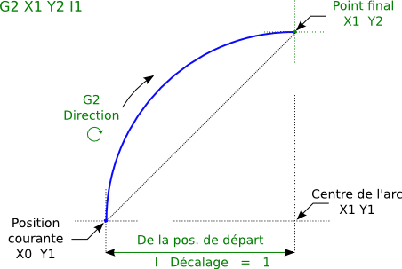
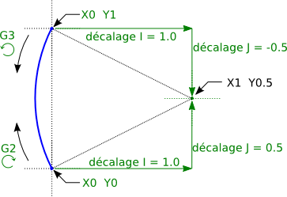
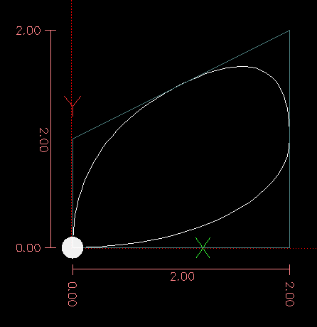
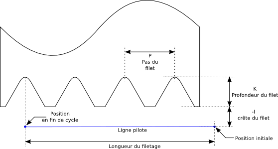
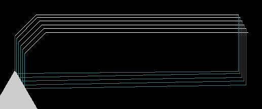
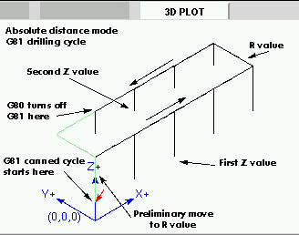
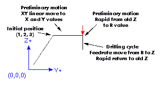
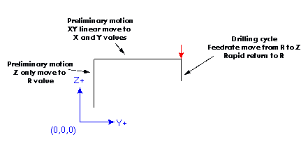

:lang: fr
:toc:

[[cha:g-codes]]
= Le G-Code de LinuxCNC

:ini: {basebackend@docbook:'':ini}
:hal: {basebackend@docbook:'':hal}
:ngc: {basebackend@docbook:'':ngc}

== Conventions d'écriture du G-code

Conventions utilisées dans cette section

Dans une commande type, le tiret ('-') signifie une valeur réelle et les signes
('<>') indiquent un item facultatif.

Si 'L-' est écrit dans une commande, le signe '-' fera référence à 'Lnombre'. De la même manière, le signe '-' dans 'H-' peut être appelé le 'Hnombre' et
ainsi de suite pour les autres lettres. Une valeur facultative sera écrite '<L->'.

Dans les blocs de G-code, le mot 'axes' signifie n'importe quel axe
défini dans la configuration.

Une valeur optionnelle sera écrite '<L- >'.

Une valeur réelle peut être:

* - un nombre explicite, '4' par exemple.
* - une expression, '[2+2]' par exemple.
* - une valeur de paramètre, '#88' par exemple.
* - une fonction unaire de la valeur, 'acos[0]' par exemple.

Dans la plupart des cas, si des mots d'axes sont donnés
parmi 'XYZABCUVW', ils spécifient
le point de destination.

Les axes sont donnés dans le système de coordonnées courant,
à moins qu'explicitement décrit comme étant dans le système de coordonnées
absolues (machine).

Les axes sont facultatifs, tout axe omis gardera sa valeur courante.

Tout item dans un bloc de G-code, non explicitement décrit comme facultatif,
sera requis. Une erreur sera signalée si un item requis est omis.

Dans les commandes, les valeurs suivant les lettres sont souvent données comme des nombres explicites. Sauf indication contraire, les
nombres explicites peuvent être des valeurs réelles. Par exemple, 'G10 
L2' pourrait aussi bien être écrite 'G[2*5] L[1+1]'. Si la valeur du
paramètre '100' étaient '2', 'G10 L#100' signifierait également la même chose.

If 'L-' is written in a prototype the '-' will often be referred to
as the 'L number', and so on for any other letter.

[[gcode:table-de-reference]]
== Table de référence du G-code(((Table de Référence du G-Code)))

[width="75%", options="header", cols="2^,5<"]
|==============================================================================
|Sections                        | Descriptions
|<<sec:G0,G0>>  | Interpolation linéaire en vitesse rapide
|<<sec:G1,G1>> | Interpolation linéaire en vitesse travail
|<<sec:G2-G3,G2/G3>>  | Interpolation circulaire sens horaire/anti-horaire
|<<sec:G4-Tempo,G4>>           | Temporisation
|<<sec:G5-Cubic-Spline,G5>>         |Spline cubique
|<<sec:G5_1-Quadratic-Spline,G5.1>> |B-Spline quadratique
|<<sec:G5_2-G5_3-NURBS,G5.2,G5.3>>       |NURBS, ajout point de contrôle
|<<sec:G7-Mode-diametre,G7>>   | Mode diamètre (sur les tours)
|<<sec:G8-Mode-rayon,G8>>| Mode rayon (sur les tours)
|<<sec:G10-L1,G10 L1>>   | Ajuste les valeurs de l'outil en table d'outils
|<<sec:G10-L10,G10 L10>> | Modifie les valeurs de l'outil dans la table d'outils
|<<sec:G10-L11,G10 L11>> | Fixe les valeurs de l'outil dans la table d'outils
|<<sec:G10-L2,G10 L2>>   | Fixe l'origine d'un système de coordonnées
|<<sec:G10-L20,G10 L20>> | Fixe l'origine du système de coord. aux valeurs calculées
|<<sec:G17-G18-G19,G18 G19>>  | Choix du plan de travail
|<<sec:G20-G21-Unites-Machine,G20 G21>>         | Unités machine
|<<sec:G28-G28_1-Aller-a-une-position,G28 G28.1>> | Aller à une position prédéfinie
|<<sec:G30-G30_1-Aller-a-une-position-predefinie,G30 G30.1>> | Aller à une positionprédéfinie
|<<sec:G33-Broche-synchronisee,G33>>   | Mouvement avec broche synchronisée
|<<sec:G33_1-Taraudage-rigide,G33.1>>    | Taraudage rigide
|<<sec:G38-x-Palpeur,G38>> | Mesures au palpeur
|<<sec:G40,G40>>           | Révocation de la compensation de rayon d'outil
|<<sec:G41-G42,G41 G42>>       | Compensation de rayon d'outil
|<<sec:G41_1-G42_1,G41.1 G42.1>> | Comp. dynamique de rayon d'outil à gauche/à droite
|<<sec:G43,G43>> | Compensation de longueur d'outil d'après une table d'outils
|<<sec:G43_1,G43.1>> | Compensation dynamique de longueur d'outil
|<<sec:g43_2,G43.2>>              | Appliquer une compensation de longueur d'outil additionnelle
|<<sec:G49-Revocation-Longueur-Outil,G49>>  | Révocation de la compensation de longueur d'outil
|<<sec:g52,G52>>                  |Décalage du système de coordonnées local
|<<sec:G53-Mouvement-Coordonnees-Absolues,G53>> | Déplacements en coordonnées machine (Absolues)
|<<sec:G54-a-G59_3,G54 à G59.3>>     | Choix du système de coordonnées (1 à 9)
|<<sec:g61,G61>>   | Mode trajectoire exacte
|<<sec:g61_1,g61.1>>   | Mode arrêts exacts
|<<sec:G64,G64>>| Mode trajectoire continue avec tolérance
|<<sec:g70,G70>>                  |Cycle de finition tournage
|<<gcode:g71-g72,G71-G72>>          |Cycle d'ébauche tournage
|<<sec:G73-Percage-avec-brise-copeaux,G73>> | Cycle de perçage avec brise copeau
|<<gcode:g74,G74>>                  |Cycle de taraudage à gauche avec temporisation
|<<sec:G76-Filetage,G76>>      | Cycle de filetage multi-passes (tour)
|<<sec:G80-Revocation-modaux,G80>>       | Révocation des codes modaux
|<<sec:G81-Cycle-de-percage,G81>>        | Cycle de perçage
|<<sec:G82-Cycle-de-percage,G82>>        | Autres cycles de perçage
|<<sec:G83-Percage-avec-debourrage,G83>> | Perçage avec débourrage
|<<sec:G84-Taraudage-a-droite,G84>>      | Taraudage à droite '(pas encore implémenté)'
|<<sec:G85-Alesage-retrait-travail,G85>> | Alésage, retrait en vitesse travail
|<<sec:G86-Alesage-retrait-rapide,G86>>  | Alésage, retrait en vitesse rapide
|<<sec:G87-Back-Boring,G87>>        | Cycle d'alésage arrière '(pas encore implémenté)'
|<<sec:G88-Alesage-Retrait-Manuel-Out,G88>> | Cycle alésage, Stop, Retrait manuel '(pas encore implémenté)'
|<<sec:G89-Alesage-Tempo,G89>> | Cycle d'alésage avec tempo, recul vitesse travail
|<<sec:G90-G91,G90>>       | Types de déplacement
|<<sec:G90_1-G91_1,G90.1 G91.1>>     | Arc I,J,K, centre absolu ou relatif
|<<sec:G92,G92>> | Décalages d'origines avec mise à jour des paramètres
|<<sec:G92_1-G92_2,G92.1 G92.2>> | Révocation des décalages d'origine
|<<sec:G92_3,G92.3>> | Applique contenu des paramètres aux déc. d'origine
|<<sec:G93-G94-G95-Modes,G93>>   | Modes de vitesse
|<<sec:G96-G97-Broche,G96>>    | Vitesse de coupe constante (IPM ou m/mn)
|<<sec:G96-G97-Broche,G97>>    | Vitesse en tours par minute
|<<sec:G98-G99-Set,G98>>       | Options de retrait des cycles de perçage
|==============================================================================

[[sec:G0]]
== G0 Interpolation linéaire en vitesse rapide(((G0 Interpolation linéaire en vitesse rapide)))(((rapide)))

----
G0 axes
----

Pour un mouvement linéaire en vitesse rapide, programmer 'G0 axes', tous les mots d'axe sont facultatifs. Le 'G0' est facultatif si le mode mouvement
courant est déjà 'G0'. Cela produit un mouvement linéaire vers le point de destination à la vitesse rapide courante (ou moins vite si la machine n'atteint
pas cette vitesse). Il n'est pas prévu d'usiner la matière quand une
commande G0 est exécutée. Un G0 seul peut être utilisé pour passer le mode de mouvement courant en G0.

=== Rapid Velocity Rate

The MAX_VELOCITY setting in the ini file [TRAJ] section defines the maximum
rapid traverse rate. The maximum rapid traverse rate can be higher than the
individual axes MAX_VELOCITY setting during a coordinated move. The maximum
rapid traverse rate can be slower than the MAX_VELOCITY setting in the [TRAJ]
section if an axis MAX_VELOCITY or trajectory constraints limit it.

.Exemple avec G0
----
G90 (Fixe les déplacements en mode absolu)
G0 X1 Y-2.3 (mouvement linéaire en vitesse rapide du point courant à X1 Y-2.3)
M2 (fin de programme)
----

* Voir les sections <<sec:G90-G91,G90>> et <<sec:M2-M30,M2>> pour plus d'informations.

Si la compensation d'outil est active, le mouvement sera
différent de celui décrit ci-dessus, voir la section <<sec:Compensation-rayon-d-outil, sur la compensation de d'outil>>.

Si 'G53' est programmé sur la même ligne, le mouvement sera également
différent, voir la section <<sec:G53-Mouvement-Coordonnees-Absolues, sur les mouvements en coordonnées absolues>>.

The path of a G0 rapid motion can be rounded at direction changes and depends
on the <<sec:trajectory-control,trajectory control>> settings and maximum
acceleration of the axes.

////
Si un mouvement 'G0' déplace seulement des axes rotatifs et que la
position de la cible pour ces axes est dans une échelle de -360 à 360 degrés,
le mouvement sera organisé pour que chaque axe rotatif fasse moins d'un tour
complet.
////

C'est une erreur si:

* Un mot d'axe est indiqué sans valeur réelle.
* Un mot d'axe est indiqué qui n'est pas configuré.

[[sec:G1]]
== G1 Interpolation linéaire en vitesse travail(((G1 Interpolation linéaire en vitesse travail)))

----
G1 axes
----

Pour un mouvement linéaire en vitesse travail, (pour usiner ou non) programmer 'G1 axes', tous les mots d'axe sont facultatifs. Le 'G1' est
facultatif si le mode de mouvement courant est déjà 'G1'.
Cela produira un mouvement linéaire vers le point de destination à
la vitesse de travail courante (ou moins vite si la machine n'atteint
pas cette vitesse). Un G1 seul peut être utilisé pour passer le mode de mouvement courant en G1.

.Exemple avec G1:
----
G90 (Fixe les déplacements en mode absolu)
G1 X1.2 Y-3 F10 (mouvement linéaire à 10 unités/mn du point courant à X1.2 Y-3)
Z-2.3 (mouvement linéaire à 10 unités/mn du point courant à Z-2.3)
Z1 F25 (mouvement linéaire de l'axe Z à 25 unités/mn vers Z1)
M2 (Fin de programme)
----

* Voir les sections <<sec:G90-G91,G90>> et <<sec:M2-M30,M2>> pour plus
  d'informations.

Si la compensation d'outil est active, le mouvement sera
différent de celui décrit ci-dessus, voir la section <<sec:Compensation-rayon-d-outil, sur la compensation d'outil>>.

Si 'G53' est programmé sur la même ligne, le mouvement sera également
différent, voir la section <<sec:G53-Mouvement-Coordonnees-Absolues, sur les mouvements en coordonnées absolues>>.

C'est une erreur si:

* - Aucune vitesse d'avance travail n'est fixée.
* - un mot d'axe est indiqué sans valeur réelle.
* - un mot d'axe est indiqué qui n'est pas configuré.

[[sec:G2-G3]]
== G2, G3 Interpolation circulaire en vitesse travail(((G2 Interpolation circulaire sens horaire)))(((G3 Interpolation circulaire anti-horaire)))

----
G2 ou G3 axes décalages (format centre)
G2 ou G3 axes R- (format rayon)
G2 ou G3 décalages <P-> (cercles complet)
----

Un mouvement circulaire ou hélicoïdal est spécifié en sens horaire
avec 'G2' ou en sens anti-horaire avec 'G3' at the current 
<<sec:set-feed-rate,feed rate>>. La direction (CW, CCW) est vue depuis
le côté positif de l'axe autour duquel le mouvement se produit.

Les axes de cercle ou les hélicoïdes, doivent être parallèles aux
axes X, Y ou Z du système de coordonnées machine.
Les axes (ou, leurs équivalents, les plans perpendiculaires aux axes)
sont sélectionnés avec 'G17' (axe Z, plan XY),
'G18' (axe Y, plan XZ), ou 'G19' (axe X, plan YZ).
Les plans '17,1', '18,1' et '19,1' ne sont pas actuellement pris en charge.
Si l'arc est circulaire,
il se trouve dans un plan parallèle au plan sélectionné.

Pour programmer un hélicoïde, inclure le mot d'axe perpendiculaire au
plan de l'arc. Par exemple, si nous sommes dans le plan 'G17', inclure
un mot 'Z', ceci provoquera un mouvement de l'axe 'Z' vers valeur programmée
durant tout le mouvement circulaire 'XY'. 

Pour programmer un arc supérieur à un tour complet, utiliser un mot 'P' spécifiant alors le nombre de tours complets en plus de l'arc.
Si 'P' n'est pas spécifié, le comportement sera comme si 'P1' avait été
donné: ceci étant, un seul tour complet ou partiel sera effectué,
donnant un arc plus petit ou égal à un tour complet.
Par exemple, si un arc de 180° est programmé avec P2, le mouvement résultant
sera d'un tour et demi. Pour chaque incrément de P au delà de 1, un tour complet
sera ajouté à l'arc programmé. Les arcs hélicoïdaux multitours sont
supportés ce qui donne des mouvements très intéressants pour usiner des alésages ou des filetages.

WARNING: If the pitch of the helix is very small (less than the
<<programming-the-planner,naive CAM tolerance>> then
the helix might be converted into a straight line.
https://github.com/LinuxCNC/linuxcnc/issues/222[Bug #222]

Si une ligne de G-code crée un arc et inclus le mouvement d'un
axe rotatif, l'axe rotatif tournera à vitesse constante de sorte que
le mouvement de l'axe rotatif commence et se termine en même temps que
les autres axes XYZ. De telles lignes sont rarement programmées.

Si la compensation d'outil est active, le mouvement sera
différent de celui décrit ci-dessus, voir les sections <<sec:G40, sur G40>> et <<sec:G41-G42, sur G41-G42>>.

Le centre de l'arc est absolu ou relatif, tel que fixé par
 <<sec:G90_1-G91_1,G90.1 ou G91.1>>, respectivement.

Two formats are allowed for specifying an arc:
Center Format and Radius Format.

C'est une erreur si:

* Aucune vitesse d'avance travail n'est spécifiée.
* Le mot P n'est pas un entier

=== Arc au format centre (format recommandé)

Les arcs au format centre sont plus précis que les arcs au format rayon, c'est
le format à privilégier.

La distance entre la position courante et le centre de l'arc et,
facultativement, le nombre de tours, sont utilisés pour programmer des arcs
inférieurs au cercle complet. Il est permis d'avoir le point final de l'arc
égal à la position courante.

Le décalage entre le centre de l'arc et la position courante ainsi
que facultativement, le nombre de tours, sont utilisés pour programmer des cercles complets.

Une erreur d'arrondi peut se produire quand un arc est programmé avec une
précision inférieure à 4 décimales (0.0000) pour les pouces et à moins de
3 décimales (0.000) pour les millimètres.

.Arc en mode distance relative
Les décalages par rapport au centre de l'arc sont des distances relatives au
point de départ de l'arc. Le mode distance relative de l'arc est le mode par défaut.

Un ou plusieurs mots d'axe et un ou plusieurs décalages doivent être programmés
pour un arc qui fait moins de 360 degrés.

Aucun mot d'axe mais un ou plusieurs décalages doivent être programmés pour un
cercle complet. Le mot 'P', par défaut à 1, est facultatif.

Pour d'avantage d'information sur les arcs en mode relatif, voir la
 <<sec:G90_1-G91_1,section G91.1>>.

.Arc en mode distance absolue
Les décalages par rapport au centre de l'arc sont des distances absolues depuis la position 0 courante des axes (origine machine).

Un ou plusieurs mots d'axe et 'tous' les décalages doivent être programmés pour
les arcs de moins de 360 degrés.

Aucun mots d'axe mais tous les décalages doivent être programmés pour un
cercle complet. Le mot 'P', par défaut à 1, est facultatif.

Pour d'avantage d'information sur les arcs en mode absolu, voir la
<<sec:G90_1-G91_1,section G90.1>>.

.Plan XY (G17)
----
G2 ou G3 <X- Y- Z- I- J- P->
----

* 'Z' - hélicoïde
* 'I' - décalage en X
* 'J' - décalage en Y
* 'P' - nombre de tours

.Plan XZ (G18)
----
G2 ou G3 <X- Z- Y- I- K- P->
----

* 'Y' - hélicoïde
* 'I' - décalage en X
* 'K' - décalage en Z
* 'P' - nombre de tours

.YZ-plane (G19)
----
G2 ou G3 <Y- Z- X- J- K- P->
----

* 'X' - hélicoïde
* 'J' - décalage en Y
* 'K' - décalage en Z
* 'P' - nombre de tours

C'est une erreur si:

* Aucune vitesse d'avance travail n'est fixée avec <<sec:F-Vitesse,le mot F>>.
* Aucun décalage n'est programmé.
* Quand l'arc est projeté dans le plan courant, la distance depuis le point
  courant et le centre diffère de la distance entre le point final et le centre,
  de plus de (.05 pouce/.5 mm)
  OU ((.0005 pouce/.005mm) ET .1% du rayon).

Déchiffrer le message d'erreur 'Le rayon à la fin de l'arc diffère de celui du début:'

* 'début' - position courante
* 'centre' - la position du centre telle que calculée avec les paramètres I,J ou  K
* 'fin' - le point final programmé
* 'r1' - le rayon entre le point de départ et le centre
* 'r2' - le rayon entre le point final et le centre

=== Exemples d'arcs au format centre

Calculer des arcs à la main peut être difficile. Il est possible de dessiner l'arc à l'aide d'un programme de DAO
pour obtenir les coordonnées et les décalages.
Garder à l'esprit les tolérances, il pourrait être nécessaire de modifier
la précision de la DAO pour obtenir les résultats souhaités.
Une autre option consiste à calculer les coordonnées et les décalages
en utilisant des formules. Comme vous pouvez le voir sur la figure suivante
un triangle peut être formé à partir de la position courante, de la position de fin et du centre de l'arc.

Sur la figure suivante, vous voyez que la position de départ est X0 Y0, la
position finale est X1 Y1. La position du centre de l'arc est X1 Y0.
Ceci donne un décalage de 1 depuis la position de départ sur l'axe X et
0 sur l'axe Y. Dans ce cas seul le décalage I est nécessaire.

.Exemple de code G2
[source,{ngc}]
----
G0 X0 Y0
G2 X1 Y1 I1 F10 (arc en sens horaire dans le plan XY)
----

.Exemple avec G2

Dans cet autre exemple, nous pouvons voir les différences de décalages
pour Y selon que nous faisons un mouvement G2 ou un mouvement G3.
Pour le mouvement G2 la position de départ est en X0 Y0, alors que
pour le mouvement G3 elle est en X0 Y1. Le centre de l'arc est en
X1 Y0.5 pour les deux. Le décalage J du mouvement G2 est 0.5 alors que celui du mouvement G3 est -0.5.

.Exemple de code G2/G3
[source,{ngc}]
----
G0 X0 Y0
G2 X0 Y1 I1 J0.5 F25 (arc en sens horaire dans le plan XY)
G3 X0 Y0 I1 J-0.5 F25 (arc en sens anti-horaire dans le plan XY)
----

.Exemple avec G2-G3

Voici un exemple au format centre pour usiner
une hélice:

.Exemple d'hélice G2
[source,{ngc}]
----
G0 X0 Y0 Z0
G17 G2 X10 Y16 I3 J4 Z-1 (Arc hélicoïdal avec ajout de Z)
----

In the next example we show how to make more than one turn using the P word.

.Exemple avec P
----
G0 X0 Y0 Z0
G2 X0 Y1 Z-1 I1 J0.5 P2 F25
----

Dans le format centre, le rayon de l'arc n'est pas spécifié, mais il
peut facilement être trouvé puisque c'est la distance entre le
point courant et le centre du cercle, ou le point final de l'arc et le centre.

////
FIXME Complete circles and helicoids doc
=== Cercles complets

----
G2 ou G3 I- J- K-
----

Pour faire un cercle complet de 360 degrés depuis la position courante, programmer un seul décalage I, J ou K depuis la position
courante pour G2/G3.

FIXME Better explain I, J, K offsets for full circles

Pour programmer une hélicoïde sur 360 degrés dans le plan XY spécifier seulement le mot Z.

C'est une erreur si:

* Le décalage K est utilisé dans le plan XY
* Le décalage J est utilisé dans le plan XZ
* Le décalage I est utilisé dans le plan YZ
////

=== Arcs au format rayon (format non recommandé)

----
G2 ou G3 axes R- <P->
----

* R - rayon depuis la position courante

Ce n'est pas une bonne pratique de programmer au format rayon des
arcs qui sont presque des cercles entiers ou des demi-cercles, car un
changement minime dans l'emplacement du point d'arrivée va produire un
changement beaucoup plus grand dans l'emplacement du centre du cercle
(et donc, du milieu de l'arc). L'effet de grossissement est tellement
important, qu'une erreur d'arrondi peut facilement produire un usinage
hors tolérance. Par exemple, 1% de déplacement de l'extrémité d'un arc
de 180 degrés produit 7% de déplacement du point situé à 90 degrés le
long de l'arc. Les cercles presque complets sont encore pires.
Autrement, l'usinage d'arcs, inférieurs à 165 degrés ou compris entre 195 et 345 degrés sera possible.

Dans le format rayon, les coordonnées du point final de l'arc, dans le
plan choisi, sont spécifiées en même temps que le rayon de l'arc.
Programmer 'G2 axes R-' (ou utiliser 'G3' au lieu de 'G2' ). R est le
rayon. Les mots d'axes sont facultatifs sauf au moins un
des deux du plan choisi, qui doit être utilisé. Un rayon positif
indique que l'arc fait moins de 180 degrés, alors qu'un rayon négatif
indique un arc supérieur à 180 degrés. Si l'arc est hélicoïdal, la
valeur du point d'arrivée de l'arc dans les coordonnées de l'axe
perpendiculaire au plan choisi
sera également spécifiée.

C'est une erreur si:

* Les deux mots d'axes pour le plan choisi sont omis.
* Le point d'arrivée de l'arc est identique au point courant.

.Exemple de code G2
[source,{ngc}]
----
G17 G2 X10 Y15 R20 Z5 (arc au format rayon)
----

Cet exemple signifie, faire un mouvement en arc ou hélicoïdal en sens horaire
(vu du côté positif de l'axe Z), se terminant en X=10, Y=15 et Z=5,
avec un rayon de 20. Si la valeur de départ de Z est 5, ce sera un arc
de cercle parallèle au plan XY sinon,
ce sera un arc hélicoïdal.

[[sec:G4-Tempo]]
== G4 Tempo(((G4 Temporisation)))

----
G4 P-
----

* 'P' - durée de la temporisation en secondes (un flottant)

Les axes s'immobiliseront pour une durée de P secondes. Cette commande n'affecte
pas la broche, les arrosages ni les entrées/sorties.
G4 does not affect spindle, coolant and any I/O.

.Exemple de code G4
----
G4 P0.5 (wait for 0.5 seconds before proceeding)
----

C'est une erreur si:

* Le nombre P est négatif ou n'est pas spécifié.

[[sec:G5-Cubic-Spline]]
== G5 Spline cubique(((G5 Cubic spline)))

----
G5 X- Y- <I- J-> P- Q-
----

* 'I' - offset incrémental en X, du point de départ au premier point de contrôle
* 'J' - offset incrémental en Y, du point de départ au premier point de contrôle
* 'P' - offset incrémental en X, du point de départ au second point de contrôle
* 'Q' - offset incrémental en Y, du point de départ au second point de contrôle

G5 crée une B-spline cubique dans le plan XY avec les axes X et Y seuls.
P et Q doivent être tous les deux spécifiés pour chaque commande G5.

Pour la première d'une série de commandes G5, I et J doivent être tous les deux
spécifiés. Pour les commandes G5 suivantes de la série, soit I et J sont
spécifiés tous les deux, soit aucun ne l'est. Si aucun n'est spécifié, la
direction de départ de ce cube rejoindra automatiquement la direction de fin du
cube précédent (comme si I et J étaient les négatifs des P et
Q précédents).

Par exemple, pour programmer une courbe en forme de N:

.G5 Simple spline cubique initiale
----
G90 G17
G0 X0 Y0
G5 I0 J3 P0 Q-3 X1 Y1
----

Une seconde courbe en N qui s'attache doucement à celle-ci peux maintenant être
faite sans spécifier I et J:

.G5 Simple spline cubique subséquente
----
G5 P0 Q-3 X2 Y2
----

C'est une erreur si:

* P et Q ne sont pas spécifiés tous les deux
* Un seul, de I ou J est spécifié
* Aucun de I ou J n'est spécifié à la première série de commandes G5
* Un axe autre que X ou Y est spécifié
* Le plan courant n'est pas G17

[[sec:G5_1-Quadratic-Spline]]
== G5.1 Spline quadratique(((G5.1 Quadratic spline)))

----
G5.1 X- Y- I- J-
----

* 'I' - Offset incrémental en X, du point de départ au point de contrôle
* 'J' - Offset incrémental en Y, du point de départ au point de contrôle

G5.1 crée une B-spline quadratique dans le plan XY avec les seuls axes X et Y.
Ne pas spécifier I ou J donne un offset nul pour l'axe non spécifié,
un ou les deux doivent donc être donnés.

Par exemple, pour programmer une parabole, entre l'origine X-2 Y4 et X2 Y4:

.G5.1 Simple spline quadratique
----
G90 G17
G0 X-2 Y4
G5.1 X2 I2 J-8
----

C'est une erreur si:

* Les offsets I et J ne sont pas spécifiés ou sont à zéro
* Un autre axe que X ou Y est spécifié
* Le plan actif n'est pas G17

[[sec:G5_2-G5_3-NURBS]]
== G5.2 G5.3 Block NURBS(((G5.2 G5.3 NURBS Block)))

----
G5.2 <P-> <X- Y-> <L->
X- Y- <P->
...
G5.3
----

WARNING: G5.2, G5.3 sont expérimentaux, il n'ont pas encore été testés totalement.

G5.2 est pour ouvrir un bloc de données définissant un NURBS et G5.3 pour
fermer le bloc de données. Dans les lignes entre ces deux codes, les points de
contrôle de la courbe sont définis avec deux éléments, leur 'poids' relatif (P)
et le paramètre (L) qui détermine l'ordre de la courbe.

Les coordonnées courantes, avant la premiére commande G5.2, est toujours prise
comme premier point de contrôle du NURBS. Pour définir le poids pour le
premier point de contrôle, premièrement programmer G5.2 P- sans donner X ni Y.

Le poids par défaut si P n'est pas spécifié est 1. L'ordre par défaut si L n'est
pas spécifié est 3.

.Exemple G5.2
[source,{ngc}]
----
G0 X0 Y0 (mouvement en vitesse rapide)
F10 (set feed rate)
G5.2 P1 L3
     X0 Y1 P1
     X2 Y2 P1
     X2 Y0 P1
     X0 Y0 P2
G5.3
; Les mouvements en vitesse rapide montrent le même parcours sans le bloc NURBS
G0 X0 Y1
   X2 Y2
   X2 Y0
   X0 Y0
M2
----

.Exemple de sortie NURBS

D'autres informations sur NURBS sont disponibles ici:

http://wiki.linuxcnc.org/cgi-bin/wiki.pl?NURBS[http://wiki.linuxcnc.org/cgi-bin/wiki.pl?NURBS]

[[sec:G7-Mode-diametre]]
== G7 Mode diamètre sur les tours(((G7 Mode diamètre sur les tours)))

----
G7
----

Sur un tour, programmer 'G7' pour passer l'axe X en mode diamètre. En
mode diamètre, les mouvements de l'axe X font la moitié de la cote
programmée. Par exemple, X10 placera l'outil à 5 unités du centre, ce
qui produira bien une pièce d'un diamètre de 10 unités.

[[sec:G8-Mode-rayon]]
== G8 Mode rayon sur les tours(((G8 Mode rayon sur les tours)))

----
G8
----

Sur un tour, programmer 'G8' pour passer l'axe X en mode rayon. En mode
rayon, les mouvements de l'axe X sont égaux à la cote programmée. Ce
qui signifie que X10 placera l'outil à 10 unités du centre et aura pour
résultat une pièce d'un diamètre de 20 unités. G8 est le mode par défaut à la mise sous tension.

[[gcode:g10-l0]]
== G10 L0 Reload Tool Table Data(((G10 L0 Reload Tool Table Data)))

----
G10 L0
----

G10 L0 reload all tool table data.  Requires that there is no
current tool loaded in spindle.

[NOTE]

When using G10 L0, tool parameters (#5401-#5413) will be
updated immediately and any altered tool diameters will be
used for subsequent G41,42 cutter radius compensation
commands. Existing G43 tool length compensation values will
remain in effect until updated by new G43 commands.

[[sec:G10-L1]]
== G10 L1 Ajustements dans la table d'outils(((G10 L1 Ajustements dans la table d'outils)))

----
G10 L1 P- axes <R- I- J- Q->
----

* 'P' - numéro d'outil
* 'R' - rayon de bec
* 'I' - angle frontal (tour)
* 'J' - angle arrière (tour)
* 'Q' - orientation (tour)

'G10 L1' ajuste les valeurs de la table d'outils pour l'outil N°'P' aux valeurs passées dans les paramètres. Les nouvelles valeurs peuvent être passées depuis un programme ou depuis la fenêtre d'entrées manuelles (MDI). Un G10 L1 valide, réécrit et recharge la table d'outils. 

A valid G10 L1 rewrites and reloads the tool table.

.Exemples avec G10 L1:
----
G10 L1 P1 Z1.5 (fixe le décalage en Z de l'outil 1 à 1.5 de l'origine machine)
G10 L1 P2 R0.15 Q3 (fixe le rayon de bec de l'outil 2 à 0.15 avec une orientation 3)
----

C'est une erreur si:

* La compensation d'outil est active
* Le mot P n'est pas spécifié
* Le mot P ne correspond pas à un numéro d'outil valide de la table d'outils.
* The P number is 0

D'autres informations sur l'orientation <<sec:Orientations-des-outils-de-tour,
des outils de tour sont disponibles ici>>.

[[sec:G10-L2]]
== G10 L2 Établissement de l'origine d'un système de coordonnées(((G10 L2 Établissement de l'origine d'un système de coordonnées)))

----
G10 L2 P- <axes R->
----

* 'P' - système de coordonnées (0 à 9)
* 'R' - rotation autour de l'axe Z

G10 L2 décale l'origine des axes dans le système de coordonnées spécifié par
la valeur du mot d'axe. Le décalage s'effectue à partir de l'origine machine
établie par la prise d'origine machine (homing). Les valeurs de ce décalage vont
remplacer toutes celles en effet sur le système de coordonnées spécifié. Les mots d'axe inutilisés resteront inchangés.

Programmer P0 à P9 pour spécifier le système de coordonnées à décaler.

.Systèmes de coordonnées
[width="50%", options="header", cols="^,^,^"]
|=========================================
|Valeur P| Système de coordonnées | G-code
|       0|          Actif courant | n/a
|       1|                      1 | G54
|       2|                      2 | G55
|       3|                      3 | G56
|       4|                      4 | G57
|       5|                      5 | G58
|       6|                      6 | G59
|       7|                      7 | G59.1
|       8|                      8 | G59.2
|       9|                      9 | G59.3
|==========================================

Facultativement, programmer 'R' pour indiquer la rotation des axes 'XY' autour de l'axe 'Z'.
La direction de rotation est anti-horaire comme vue depuis le côté positif de l'axe Z.
 
Tous les mots d'axe sont facultatifs.

Être en mode relatif ('G91') est sans effet sur 'G10 L2'.

Concepts importants:

* G10 L2 Pn ne change pas l'actuel système de coordonnées par celui spécifié
  par P, il est nécessaire d'utiliser G54 à 59.3 pour sélectionner le système de coordonnées.
* Quand un mouvement de rotation est en cours, jogger un axe, déplacera celui-ci
  seulement dans le sens négatif ou positif et non pas le long de l'axe de rotation.
* Si un décalage d'origine créé avec 'G92' ou 'G92' est actif avant la
  commande 'G10 L2', il reste actif après.
* When programming a coordinate system with R, any 'G52' or 'G92' will
  be applied *after* the rotation.
* Le système de coordonnées dont l'origine est définie par la commande 'G10'
  peut être actif ou non au moment de l'exécution de 'G10'. Si il est actif à
  ce moment là, les nouvelles coordonnées prennent effet immédiatement.

C'est une erreur si:

* Le nombre P n'est pas évalué comme étant un nombre entier compris entre 0 et 9.
* Un axe est programmé mais n'est pas défini dans la configuration.

.Premier exemple avec G10 L2:
[source,{ngc}]
----
G10 L2 P1 X3.5 Y17.2
----

Place l'origine du premier système de coordonnées (celui sélectionné par G54)
au points X3.5 et Y17.2 (en coordonnées absolues).
La coordonnée Z de l'origine, ainsi que les coordonnées de tous les autres axes,
restent inchangées puisque seuls X et Y étaient spécifiés.

.Deuxième exemple avec G10 L2:
[source,{ngc}]
----
G10 L2 P1 X0 Y0 Z0 (révoque les décalages en X, Y et Z du système N°1)
----

L'exemple précédent fixe les origines XYZ du système de coordonnées G54, à l'origine machine.

Les systèmes de coordonnées <<cha:systemes-de-coordonnees, sont décrits en détail ici>>.

[[sec:G10-L10]]
== G10 L10 modifie les offsets d'outil dans la table d'outils(((G10 L10 modifie les offsets d'outil dans la table d'outils)))

----
G10 L10 P- axes <R- I- J- Q->
----

* 'P' - numéro d'outil
* 'R' - rotation autour de l'axe Z
* 'I' - angle frontal (tour)
* 'J' - angle arrière (tour)
* 'Q' - orientation (tour)

G10 L10 modifie les valeurs de l'outil 'P' dans la table d'outils, de sorte
que si la compensation d'outil est rechargée, avec la machine à la position
courante et avec les G5x et G52/G92 actifs, les coordonnées courantes pour
l'axe spécifié deviendront les coordonnées spécifiées. Les axes non spécifiés
dans la commande G10 L10
ne seront pas modifiés.

.Exemple avec G10 L10:
----
M6 T1 G43 (appel l'outil 1 et active la correction de longueur d'outil)
G10 L10 P1 Z1.5 (fixe la position courante en Z à 1.5 dans la table d'outils)
G43 (recharge l'offset de longueur d'outil depuis la table d'outils modifiée)
M2 (fin de programme)
----

Pour d'autres détals voir les commandes <<sec:M6-Appel-Outil, M6>>,
<<sec:T-Choix-Outil, Tn>> et <<sec:G43, G43>>/<<sec:G43_1,G43.1>>.

C'est une erreur si:

* La compensation d'outil est activée.
* Le mot P n'est pas spécifié.
* Le mot P ne correspond pas à un numéro d'outil valide de la table d'outils.
* The P number is 0

[[sec:G10-L11]]
== G10 L11 modifie les offsets d'outil dans la table d'outils(((G10 L11 modifie les offsets d'outil dans la table d'outils)))

----
G10 L11 P- axes <R- I- J- Q->
----

* 'P' - numéro d'outil
* 'R' - rotation autour de l'axe Z
* 'I' - angle frontal (tour)
* 'J' - angle arrière (tour)
* 'Q' - orientation (tour)

G10 L11 est identique à G10 L10 excepté qu'au lieux de fixer les valeurs
par rapport aux décalages de coordonnées courants, il les fixe de sorte que les
coordonnées courantes deviennent celles spécifiées par les paramètres si la
nouvelle compensation d'outil est rechargée et que la machine est placée dans
le système de coordonnées G59.3, système sans aucun décalage G52/G92 actif.

Ceci permet à l'utilisateur de fixer le système de coordonnées G59.3 à
un point fixe de la machine et d'utiliser cet emplacement pour mesurer
l'outil sans s'occuper des autres décalages courants actifs.

// .G10 L11 Example FIX ME!
// ----
// G10 L11 P1
// ----

C'est une erreur si:

* La compensation d'outil est activée
* Le mot P n'est pas spécifié.
* Le mot P ne correspond pas à un numéro d'outil valide de la table d'outils.
* The P number is 0

[[sec:G10-L20]]
== G10 L20 Établissement de l'origine d'un système de coordonnées(((G10 L20 Établissement de l'origine d'un système de coordonnées)))

----
G10 L20 P- axes
----

* 'P' - système de coordonnées (0-9)

G10 L20 est similaire à G10 L2 excepté qu'au lieu d'ajuster les offsets à des
valeurs données, il les place à des valeurs calculées de sorte que les
coordonnées courantes deviennent les valeurs données en paramètres.

.Exemple avec G10 L20:
----
G10 L20 P1 X1.5 (fixe la position courante en X du système de coordonnées G54 à 1.5)
----

C'est une erreur si:

* Le nombre P n'est pas évalué comme une entier compris entre 0 et 9.
* Un axe non défini dans la configuration est programmé.

[[sec:G17-G18-G19]]
== G17 à G19.1 Choix du plan de travail(((G17 Plan XY)))(((G18 Plan XZ)))(((G19 Plan YZ)))

Ces codes sélectionnent le plan de travail courant comme décrit ci-dessous:

* G17 - XY (par défaut)
* G18 - ZX
* G19 - YZ
* G17.1 - UV
* G18.1 - WU
* G19.1 - VW

Les plans UV, WU et VW ne supportent pas les arcs.

Il est de bonne pratique d'inclure la sélection du plan de travail dans le préambule
du programme G-code.

Les effets de la sélection d'un plan de travail sont discutés dans la section
<<sec:G2-G3, sur les arcs>>.

[[sec:G20-G21-Unites-Machine]]
== G20, G21 Choix des unités machine(((G20 Pouce)))(((G21 Millimètre)))

* 'G20' - pour utiliser le pouce comme unité de longueur.
* 'G21' - pour utiliser le millimètre comme unité de longueur.

C'est toujours une bonne pratique de programmer soit 'G20', soit 'G21', dans
le préambule du programme, avant tout mouvement et de ne plus en changer ailleurs dans le programme.

[[sec:G28-G28_1-Aller-a-une-position]]
== G28, G28.1 Aller à une position prédéfinie(((G28)))(((G28.1)))

[WARNING]
Pour une bonne répétabilité de la position et que la position soit correctement
enregistrée avec G28.1, faire la prise d'origine générale avant d'utiliser G28.

G28 utilise les valeurs enregistrées dans les paramètres 5161 à 5166 comme
points finaux des mouvements des axes X Y Z A B C U V W.
Les valeurs des paramètres sont des coordonnées machine 'absolues', en unités
machine natives, telles que fixées dans le fichier ini. Tous les axes définis
dans le fichier ini seront déplacés
lors d'un G28.

* G28 - effectue un mouvement en vitesse rapide de la position courante à la
  position 'absolue' enregistrée dans les paramètres 5161 à 5166.
* 'G28 axes' - effectue un déplacement en vitesse rapide à la position
  spécifiée par 'axes' y compris les décalages, puis effectuera un mouvement en
  vitesse rapide aux coordonnées 'absolues' stockées dans les paramètres 5161
  à 5166 pour les axes spécifiés.
* G28.1 - enregistre la position 'absolue' courante dans les paramètres 5161 à 5166.

.Exemple avec G28
----
G28 Z2.5 (vitesse rapide vers Z2.5 puis emplacement spécifié dans les paramètres enregistrés de G28)
----

C'est une erreur si:

* La compensation d'outil est active.

[[sec:G30-G30_1-Aller-a-une-position-predefinie]]
== G30, G30.1 Aller à une position prédéfinie(((G30)))(((G30.1)))

[WARNING]
Pour une bonne répétabilité de la position et que la position soit correctement
enregistrée avec G30.1, faire la prise d'origine générale avant d'utiliser G30.

G30 functions the same as G28 but uses the values stored in
<<sub:numbered-parameters,parameters>> 5181-5189 as the X Y Z A B C U V W
final point to move to. The parameter values are 'absolute' machine
coordinates in the native machine 'units' as specified in the ini file.
All axes defined in the ini file will be moved when a G30 is issued.  If no
positions are stored with G30.1 then all axes will go to the
<<sec.machine-coordinate-system,machine origin>>.

[NOTE]
Les paramètres de 'G30' peuvent être utilisés pour déplacer l'outil quand un M6
est programmé avec la variable '[TOOL_CHANGE_AT_G30]=1' dans la section '[EMCIO]' du fichier ini.

* 'G30' - effectue un mouvement en vitesse rapide de la position courante à la position 'absolue' stockée dans les paramètres 5181 à 5186.
  Les valeurs stockées dans les paramètres font référence au système de coordonnées absolues qui est le système de coordonnées machine.
* 'G30 axes' - effectue un déplacement en vitesse rapide depuis la position
  courante jusqu'à la position spécifiée par 'axes', y compris les décalages,
  suivi d'un mouvement rapide à la position 'absolue' stockée dans les paramètres
  5181 à 5186 pour les axes spécifiés. Les axes non spécifiés ne bougeront pas.
* 'G30.1' - enregistre la position absolue courante dans les paramètres 5181 à 5186.

.Exemple avec G30
----
G30 Z2.5 (mvt rapide à Z2.5 puis déplacement selon les paramètres de G30 stockés)
----

C'est une erreur si:

* La compensation de d'outil est active.

[[sec:G33-Broche-synchronisee]]
== G33 Mouvement avec broche synchronisée(((G33 Mouvement avec broche synchronisée)))

----
G33 X- Y- Z- K-
----

* 'K' - distance par tour

Pour un mouvement avec broche synchronisée dans une direction, programmer
'G33 X- Y- Z- K-' où K donne la longueur du mouvement en XYZ pour chaque tour
de broche. Par exemple, si il commence à 'Z=0', 'G33 Z-1 K.0625' produira
un mouvement d'un pouce de long en Z en même temps que 16 tours de broche.
Cette commande peut être la base d'un programme pour faire un filetage de
16 filets par pouce. Un autre exemple en métrique, 'G33 Z-15 K1.5' produira
un mouvement de 15mm de long pendant que la broche fera 10 tours soit un pas de 1.5mm.

Les mouvements avec broche synchronisée utilisent l'index de broche et les pins
'spindle at speed' pour le filetage multi-passes. Un mouvement avec 'G33' se
termine au point final programmé.

Spindle-synchronized motion waits for the spindle index and spindle at speed
pins, so multiple passes line up. 'G33' moves end at the programmed endpoint.
G33 could be used to cut tapered threads or a fusee.

All the axis words are optional, except that at least one must be used.

[NOTE]
K suit la ligne d'avance décrite par 'X- Y- Z-'. K n'est pas parallèle à
l'axe Z si les points d'arrivée des axes X et Y sont utilisés, par exemple pour
réaliser un filetage conique.

[[g33-tech-info]]
.Informations techniques
Au début de chaque passe G33, LinuxCNC utilise la vitesse de broche et les
limites d'accélération de la machine pour calculer combien de temps prendra Z
pour accélérer après chaque impulsion d'index et détermine de combien de degrés
la broche tournera pendant ce temps là. Il ajoute alors cet angle à la position
de l'index puis calcule la position de Z utilisant l'angle de broche correct.
Cela signifie que Z aura atteints la position correcte juste en fin
d'accélération à la bonne vitesse,
il peux immédiatement usiner le bon filetage.

.Connections de hAL
Les pins 'spindle.N.at-speed' et l'index 'encoder.n.phase-Z' pour la broche
doivent être connectés dans le fichier HAL pour que G33 soit opérationnel.
Voir le Manuel de l'intégrateur pour plus d'informations sur les mouvements 
synchronisés avec la broche.

See the Integrators Manual for more information on spindle synchronized motion.

.Exemple avec G33:

----
G90 (mode distance absolue)
G0 X1 Z0.1 (positionnement en vitesse rapide)
S100 M3 (broche en rotation à 100tr/mn)
G33 Z-2 K0.125 (mouvement vers Z -2 avec une avance de 0.125 par tour)
G0 X1.25 (mouvement de dégagement en vitesse rapide)
Z0.1 (mouvement en vitesse rapide à Z0.1)
M2 (fin de programme)
----

* Voir les sections <<sec:G90-G91,G90>>, <<sec:G0,G0>> et <<sec:M2-M30,M2>> pour plus d'informations.

C'est une erreur si:

* Tous les axes sont omis.
* La broche ne tourne pas quand cette commande est exécutée.
* Le mouvement linéaire requis excède les limites de vitesse machine
  en raison de la vitesse de broche.

[[sec:G33_1-Taraudage-rigide]]
== G33.1 Taraudage Rigide(((G33.1 Taraudage rigide)))

----
G33.1 X- Y- Z- K- I- $-
----

* 'K' - distance par tour
* 'I' - optional spindle speed multiplier for faster return move
* '$' - optional spindle selector

[WARNING]
Si pour un taraudage rigide, les coordonnées X et Y spécifiées ne sont pas
les coordonnées courantes lors de l'appel de G33.1, le mouvement ne
s'effectuera pas le long de l'axe Z
mais de la position courante jusqu'aux
coordonnées X et Y spécifiées.

Pour un taraudage rigide avec broche synchronisée et mouvement de retour,
programmer 'G33.1 X- Y- Z- K-' où 'K-' donne la longueur du mouvement
pour chaque tour de broche.

Un mouvement de taraudage rigide suit cette séquence:

* Un mouvement aux coordonnées spécifiées, synchronisé avec la rotation de
  la broche, avec le ratio donné et débutant à l'impulsion d'index du codeur
  de broche.
* Quand le point final est atteint, la commande inverse le sens de rotation
  de la broche (ex: de 300 tours/mn en sens horaire à 300 tours/mn en sens anti-horaire)
* Le mouvement reste synchronisé en continu avec la broche, même 'au delà'
  de la coordonnée du point final spécifié pendant l'arrêt de la broche et son inversion.
* Le mouvement synchronisé se poursuit pour revenir aux coordonnées initiales.
* Quand les coordonnées initiale sont atteintes, la commande inverse la
  broche une seconde fois (ex: de 300tr/mn sens anti-horaire à 300tr/mn en
  sens horaire)
* Le mouvement reste synchronisé même 'au delà' des coordonnées initiales
  pendant que la broche s'arrête, puis s'inverse.
* Un mouvement *non synchronisé* ramène le mobile en arrière, aux coordonnées initiales.

Tous les mouvements avec broche synchronisée ont besoin d'un index de broche, pour conserver la trajectoire prévue et que les passes se chevauchent
exactement. Un mouvement avec 'G33.1' se termine aux coordonnées initiales.

Les mots d'axes sont facultatifs, sauf au moins un qui doit être utilisé.

.Exemple avec G33.1:
[source,{ngc}]
----
G90 (mode distance absolue)
G0 X1.000 Y1.000 Z0.100 (mouvement rapide au point de départ taraudage rigide
en 20 filets par pouce)
G33.1 Z-0.750 K0.05 (et une profondeur de filet de 0.750)
M2 (fin de programme)
----

* Voir les sections <<sec:G90-G91,G90>>, <<sec:G0,G0>> et <<sec:M2-M30,M2>> pour plus d'informations.

C'est une erreur si:

* Tous les axes sont omis.
* La broche ne tourne pas quand cette commande est exécutée.
* Le mouvement linéaire requis excède les limites de vitesse machine
  en raison d'une vitesse de broche trop élevée.

[[sec:G38-x-Palpeur]]
== G38.x Mesure au palpeur(((G38.2 Palpeur)))(((G38.3 Palpeur)))(((G38.4 Palpeur)))(((G38.5 Palpeur)))

----
G38.x axes
----

* 'G38.2' - palpe vers la pièce, stoppe au toucher, signale une erreur en cas de défaut.
* 'G38.3' - palpe vers la pièce, stoppe au toucher.
* 'G38.4' - palpe en quittant la pièce, stoppe en perdant le contact, signal une erreur en cas de défaut.
* 'G38.5' - palpe en quittant la pièce, stoppe en perdant le contact.

[IMPORTANT]
Cette commande n'est pas utilisable si la machine n'a pas été configurée pour exploiter un signal de sonde entre HAL et LinuxCNC.
Le signal de la sonde doit être envoyé sur une broche d'entrée puis transmis à
'motion.probe-entrée (bit, In)'. G38.x utilise la valeur de cette broche pour
déterminer quand la sonde a touché ou perdu le contact.
TRUE si le contact de la sonde est fermé (Touché), FALSE si il est ouvert.

Programmer 'G38.x axes', pour effectuer une mesure au palpeur.
Les mots d'axe sont facultatifs excepté au moins un. Les mots d'axe définissent ensemble,
le point de destination, à partir de l'emplacement actuel, vers lequel la
sonde se déplace. Si le palpeur n'a pas déclenché avant que la destination soit
atteinte, G38.2 et G38.4 signaleront une erreur.

L'outil dans la broche doit être un palpeur ou un actionneur de contact.

En réponse à cette commande, la machine déplace le point contrôlé
(qui est le centre de la boule du stylet du palpeur) en ligne droite,
à la vitesse travail courante, vers le point programmé.
En mode vitesse inverse du temps, la vitesse est telle que le mouvement
depuis le point courant jusqu'au point programmé, prendra le temps spécifié.
Le mouvement s'arrête (dans les limites d'accélération de la machine)
lorsque le point programmé est atteint ou quand l'entrée du palpeur
bascule dans l'état attendu
selon la première éventualité.

[[sec:codes-de-mesure]]
.G-Codes de mesure
[width="90%", options="header"]
|==========================================================
|Code  | État ciblé    | Sens de destination | Signal d'erreur
|G38.2 | Touché        | Vers la pièce       | Oui
|G38.3 | Touché        | Vers la pièce       | Non
|G38.4 | Quitté        | Depuis la pièce     | Oui
|G38.5 | Quitté        | Depuis la pièce     | Non
|==========================================================

Après une mesure réussie, <<sec:Log-des-mesures,les paramètres 5061 à 5069>>
contiendront les coordonnées des axes XYZABCUVW, pour l'emplacement du
point contrôlé à l'instant du changement d'état du palpeur.
Après une mesure manquée, ils contiendront les coordonnées du point programmé.
Le paramètre 5070 est mis à 1 si la mesure est réussie et à 0 si elle est
manquée. Si la mesure n'a pas réussi, G38.2 et G38.4 signaleront une erreur
en affichant un message à l'écran si l'interface
graphique choisie le permet.

Un commentaire de la forme '(PROBEOPEN filename.txt)' ouvrira le
fichier 'filename.txt' et y enregistrera les 9 coordonnées de
XYZABCUVW pour chaque mesure réussie.
Le fichier doit être fermé avec <<sec:Log-des-mesures,le commentaire>>
'(PROBECLOSE)'.

Dans le répertoire des exemples, le fichier 'smartprobe.ngc' montre
l'utilisation d'un palpeur et l'enregistrement des coordonnées de la pièce
dans un fichier. Le fichier 'smartprobe.ngc' peut être utilisé par 'ngcgui' avec un minimum de modifications.

C'est une erreur si:

* Le point programmé est le même que le point courant.
* Aucun mot d'axe n'est utilisé.
* La compensation de d'outil est activée.
* La vitesse travail est à zéro.
* Le palpeur est déjà au contact de la cible.

[[sec:G40]]
== G40 Révocation de la compensation de rayon d'outil(((G40 Révocation de la compensation de rayon)))

* 'G40' - révoque la compensation de rayon d'outil. Le mouvement suivant, de
  sortie de compensation, doit être une droite au moins aussi longue que le
  diamètre de l'outil. Ce n'est pas une erreur de désactiver la compensation quand elle est déjà inactive.

.Exemple avec G40
----
; la position courante est X1 après la fin du mvt avec compensation
G40 (révoque la compensation)
G0 X1.6 (mouvement linéaire aussi long que le diamètre d'outil)
M2 (fin de programme)
----

* Voir les sections <<sec:G0,G0>> et <<sec:M2-M30,M2>> pour plus d'informations.

C'est une erreur si:

* Un mouvement en arc avec G2 ou G3 suit un G40.
* Le mouvement suivant la révocation de compensation est inférieur au diamètre de l'outil.

[[sec:G41-G42]]
== G41, G42 Compensation de rayon d'outil(((G41 Compensation d'outil)))(((G42 Compensation d'outil)))

----
G41 <D-> (compensation à gauche du profil)
G42 <D-> (compensation à droite du profil)
----

* 'D' - Numéro d'outil

Le mot D est facultatif. En son absence si un outil est chargé en broche le rayon de
celui-ci sera utilisé. Si aucun outil n'est chargé et que le mot D est absent
un rayon de 0 sera utilisé

Si le mot D est présent, il devrait normalement correspondre
au numéro de l'outil monté dans la broche, bien que cela ne soit pas
indispensable, il doit par contre correspondre à un numéro d'outil valide.

[NOTE]
'G41/G42 D0' is a little special.  Its behavior is different on
random tool changer machines and nonrandom tool changer machines
(see the <<mcode:m6,Tool Change>> section).  On nonrandom
tool changer machines, 'G41/G42 D0' applies the TLO of the tool currently
in the spindle, or a TLO of 0 if no tool is in the spindle.  On random
tool changer machines, 'G41/G42 D0' applies the TLO of the tool T0 defined
in the tool table file (or causes an error if T0 is not defined in the
tool table).

Pour activer la compensation d'outil à gauche du profil,
programmer 'G41'. G41 applique la compensation d'outil à gauche de la
ligne programmée vu de l'extrémité positive de l'axe perpendiculaire au plan.

Pour activer la compensation d'outil à droite du profil,
programmer 'G42'. G42 applique la correction d'outil à droite de la
ligne programmée vu de l'extrémité positive de l'axe perpendiculaire au plan.

Le mouvement d'entrée doit être au moins aussi long que le rayon de l'outil.
Le mouvement d'entrée peut être effectué en vitesse rapide.

La compensation d'outil ne peut être effectuée que si le plan XY ou le plan XZ est actif.

Les commandes définies par l'utilisateur, M100 à M199, sont autorisées lorsque la compensation d'outil est activée.

Le comportement de la machine, quand la compensation d'outil est activée,
est décrit dans la section <<sec:Compensation-rayon-d-outil,
sur la compensation d'outil>>.

C'est une erreur si:

* Le nombre D ne correspond, ni à zéro, ni à un numéro d'outil valide.
* Le plan YZ est le plan de travail actif.
* La compensation d'outil est activée alors qu'elle est déjà active.

[[sec:G41_1-G42_1]]
== G41.1, G42.1 Compensation dynamique d'outil(((G41.1 Compensation dynamique)))(((G42.1 Compensation dynamique)))

----
G41.1 D- <L-> (à gauche du profil)
G42.1 D- <L-> (à droite du profil)
----

* Le mot D spécifie le diamètre de l'outil.
* Le mot L spécifie l'orientation de l'outil, est à 0 par défaut si non spécifié.

G41.1 & G42.1 function the same as G41 & G42 with the added scope of being able
to program the tool diameter. The L word defaults to 0 if unspecified. 

C'est une erreur si:

* Le plan YZ est le plan de travail actif.
* La valeur de L n'est pas comprise entre 0 et 9 inclus.
* Le nombre L est utilisée alors que le plan XZ n'est pas le plan actif.
* La compensation d'outil est activée alors qu'elle est déjà active.

[[sec:G43]]
== G43 Activation de la compensation de longueur d'outil(((G43 Activation de la compensation de longueur d'outil)))

----
G43 <H->
----

* 'H' - Numéro d'outil

* 'G43' - Utilise l'outil courant chargé par le dernier Tn M6. G43 modifie les mouvements ultérieurs en décalant les coordonnées de Z et/ou de X, de la
  longueur de l'outil. G43 ne provoque aucun mouvement. L'effet de la
  compensation ne se produira qu'au cours du prochain mouvement des axes compensés,
  de sorte que le point final de ce mouvement sera la position compensée.

'G43' without an H word uses the currently loaded tool from the last
'Tn M6'.

'G43 H-' - Utilise l'offset de l'outil correspondant fourni par la table d'outils. Ce n'est pas une erreur d'avoir la valeur de H à zéro, le numéro de l'outil courant sera utilisé.

[NOTE]
'G43 H0' is a little special.  Its behavior is different on random
tool changer machines and nonrandom tool changer machines (see the
<<sec:tool-changers,Tool Changers>> section).  On nonrandom tool changer
machines, 'G43 H0' applies the TLO of the tool currently in the spindle,
or a TLO of 0 if no tool is in the spindle.  On random tool changer
machines, 'G43 H0' applies the TLO of the tool T0 defined in the tool
table file (or causes an error if T0 is not defined in the tool table).

.Exemple de ligne avec G43 H-
----
G43 H1 (ajuste les offsets d'outil avec les valeurs de l'outil 1 fournies par la table d'outils)
----

C'est une erreur si:

* La valeur de H n'est pas un entier, ou
* s'il est négatif, ou
* the H number is not a valid tool number (though note that 0 is a valid
  tool number on nonrandom tool changer machines, it means "the tool
  currently in the spindle")

[[sec:G43_1]]
== G43.1 Compensation dynamique de longueur d'outil(((G43.1 Compensation dynamique de longueur d'outil)))

----
G43.1 axes
----

* 'G43.1 axes' - Modifie les mouvements ultérieurs en décalant les coordonnées de Z et/ou de X, selon les offsets stockés dans la table d'outils. G43.1 ne
  provoque aucun mouvement. L'effet de la compensation ne se produira qu'au cours
  du prochain mouvement des axes compensés de sorte que le point final de ce mouvement sera la position compensée.

.Exemple avec G43.1

////
Pour utiliser la compensation dynamique de longueur d'outil depuis un
programme, utiliser 'G43.1 I- K-', où 'I-' donne la compensation de
longueur d'outil en X (pour les tours) et 'K-' donne la compensation
de longueur en Z (pour les tours et les fraiseuses).
////

----
G90 (passe en mode absolu)
T1 M6 G43 (charge l'outil N°1 et son offset de longueur, Z est à la position machine 0 et la visu affiche Z1.500)
G43.1 Z0.250 (décale l'outil courant de 0.250, la visu affiche maintenant Z1.250)
M2 (fin de programme)
----

* Voir les sections <<sec:G90-G91,G90>> & <<sec:T-Choix-Outil,T>> et <<sec:M2-M30,M2>>
  pour plus d'informations.

C'est une erreur si:

* Une commande de mouvement est sur la même ligne que 'G43.1'

[NOTE]
G43.1 does not write to the tool table.

[[gcode:g43.2]]
== G43.2 Apply additional Tool Length Offset(((G43.2 Apply additional Tool Length Offset)))

----
G43.2 H- axes-
----

* 'H' - tool number

* 'G43.2' - applies an additional simultaneous tool offset.

.G43.2 Example
----
G90 (set absolute mode)
T1 M6 (load tool 1)
G43 (or G43 H1 - replace all tool offsets with T1's offset)
G43.2 H10 (also add in T10's tool offset)
M2 (end program)
----

You can sum together an arbitrary number of offsets by calling G43.2
more times.  There are no built-in assumptions about which numbers are geometry
offsets and which are wear offsets, or that you should have only one of each.

Like the other G43 commands, G43.2 does not cause any motion.  The next time a
compensated axis is moved, that axis's endpoint is the compensated location.

It is an error if:

* 'H' is unspecified and no axis offsets are specified
* 'H is specified and the given tool number does not exist in the tool table
* 'H' is specified and axes are also specified

NOTE: G43.2 does not write to the tool table.

[[sec:G49-Revocation-Longueur-Outil]]
== G49 Révocation de la compensation de longueur d'outil(((G49 Révocation de compensation de longueur d'outil)))

* 'G49' - révoque la compensation de longueur d'outil

Ce n'est pas une erreur de programmer une compensation qui est déjà
utilisée. Ce n'est pas non plus une erreur de révoquer une compensation de
longueur d'outil alors qu'aucune n'est couramment utilisée.

[[gcode:g52]]
== G52 Local Coordinate System Offset(((Local Offsets)))

----
G52 axes
----

G52 is used in a part program as a temporary "local coordinate system offset"
within the workpiece coordinate system. More information on G52 is in the
<<sec:g52, Local and Global Offsets>> section.

[[sec:G53-Mouvement-Coordonnees-Absolues]]
== G53 Mouvement en coordonnées absolues(((G53 Mouvement en coordonnées absolues)))

----
G53 axes
----

Pour un déplacement exprimé en coordonnées système, programmer 
'G53' sur la même ligne qu'un mouvement linéaire. 'G53' n'est pas modal, il doit
donc être programmé sur chaque ligne où il doit être actif. 'G0' ou 'G1' ne
doivent pas se trouver sur la même ligne si un d'eux est déjà actif.

Par exemple'G53 G0 X0 Y0 Z0' déplacera les axes à la position d'origine même si
le système de coordonnées sélectionné possède des décalages actifs.

.Exemple avec G53
----
G53 G0 X0 Y0 Z0 (mouvement linéaire rapide des axes à leur positions d'origine)
G53 X2 (mouvement linéaire rapide à la coordonnée absolue X=2)
----

See <<gcode:g0,G0>> section for more information.

C'est une erreur si:

* 'G53' est utilisé sans que G0 ou G1 ne soit actif.
* 'G53' est utilisé alors que la compensation d'outil est active.

[[sec:G54-a-G59_3]]
== G54 à G59.3 Choix du système de coordonnées(((G54-G59.3 Choix du système de coordonnées)))

* 'G54' - Système de coordonnées pièce 1
* 'G55' - Système de coordonnées pièce 2
* 'G56' - Système de coordonnées pièce 3
* 'G57' - Système de coordonnées pièce 4
* 'G58' - Système de coordonnées pièce 5
* 'G59' - Système de coordonnées pièce 6
* 'G59.1' - Système de coordonnées pièce 7
* 'G59.2' - Système de coordonnées pièce 8
* 'G59.3' - Système de coordonnées pièce 9

Les systèmes de coordonnées stockent les valeurs de chacun des axes dans les
variables indiquées dans le
tableau ci-dessous.

.Paramètres des systèmes de coordonnées pièce[[sec:Coordonnees-Piece]]
[width="80%", options="header", cols="<,11*^"]
|============================================================
|Choix |CS|X   |Y   |Z   |A   |B   |C   |U   |V   |W   |R
|G54   |1 |5221|5222|5223|5224|5225|5226|5227|5228|5229|5230
|G55   |2 |5241|5242|5243|5244|5245|5246|5247|5248|5249|5250
|G56   |3 |5261|5262|5263|5264|5265|5266|5267|5268|5269|5270
|G57   |4 |5281|5282|5283|5284|5285|5286|5287|5288|5289|5290
|G58   |5 |5301|5302|5303|5304|5305|5306|5307|5308|5309|5310
|G59   |6 |5321|5322|5323|5324|5325|5326|5327|5328|5329|5330
|G59.1 |7 |5341|5342|5343|5344|5345|5346|5347|5348|5349|5350
|G59.2 |8 |5361|5362|5363|5364|5365|5366|5367|5368|5369|5370
|G59.3 |9 |5381|5382|5383|5384|5385|5386|5387|5388|5389|5390
|============================================================

C'est une erreur si:

* Un de ces G-codes est utilisé alors que la compensation d'outil est active.

Voir la section <<cha:systemes-de-coordonnees, sur les systèmes de coordonnée>>
pour une vue complète.

[[sec:G61-G61_1]]
== G61, G61.1 Contrôle de trajectoire exacte(((G61 Trajectoire exacte)))(((Trajectoire contrôlée)))

* 'G61' - Met la machine en mode de trajectoire exacte. G61 suivra exactement
  la trajectoire programmée même si cela doit aboutir à un arrêt complet
  momentané du mobile.

[[gcode:g61.1]]
==  G61.1 Exact Stop Mode(((G61.1 Arrêt exact)))(((Trajectoire contrôlée)))

* 'G61.1' - Met la machine en mode arrêts exacts. Le mouvement sera stopé à la
  fin de chaque segment programmé.

[[sec:G64]]
== G64 Contrôle de trajectoire continue avec tolérance(((G64 Contrôle de trajectoire continue avec tolérance)))(((Trajectoire contrôlée)))

----
G64 <P- <Q->>
----

* 'P-' - Déviation maximale tolérée par rapport à la trajectoire programmée.
* 'Q-' - Tolérance <<cha:Concepts-pour-utilisateur,naïve cam>>.

* 'G64' - Recherche de la meilleure vitesse possible. Without P means to keep the best speed possible, no matter how
  far away from the programmed point you end up.
* 'G64 P-' - Mélange entre meilleure vitesse et tolérance de déviation.
* 'G64 P- Q-' - Est le moyen d'affiner encore pour obtenir le meilleur compromis entre vitesse et précision de la trajectoire. La vitesse sera
  réduite si nécessaire pour maintenir la trajectoire, même si ça doit aboutir
  à un arrêt complet momentané. Le 'détecteur naïve cam' est activé. Quand il
  y a une série de mouvements linéaires XYZ en vitesse travail, avec une
  même vitesse de déplacement, inférieure à 'Q-', ils sont regroupés en
  un seul segment linéaire, ainsi la vitesse s'en trouve améliorée puisqu'il
  n'y a plus de décélération/arrêt/accélération aux points de jonction des
  segments. Sur les mouvements G2/G3 dans le plan 'G17' (XY) lorsque le
  maximum d'écart entre un arc et une ligne droite est inférieur à
  la déviation maximale 'P-', la tolérance de l'arc est divisée en deux lignes
  (depuis le début de l'arc jusqu'au milieu et du milieu jusqu'à la fin). Ces
  deux lignes sont ensuite soumises à l'algorithme 'naïve cam'. Ainsi, les cas
  ligne-arc, arc-arc et arc-ligne et le cas ligne-ligne, bénéficient de
  l'algorithme 'naïve cam', ce qui améliore les performances en simplifiant
  les trajectoires. Il est permis de programmer ce mode même si il est déjà actif.
  See also the <<sec:trajectory-control,Trajectory Control>> Section for more
  information on these modes.
  If Q is not specified then it will have the same behavior as before and
  use the value of P-.

.Exemple de ligne de programme avec G64
----
G64 P0.015 (fixe la déviation d'usinage à 0.015 maximum de la trajectoire programmée)
----

Il est de bonne pratique de spécifier un type de contrôle de trajectoire
dans le préambule de chaque programme G-code.

[[gcode:g70]]
== G70 Lathe finishing cycle(((G70 Lathe finishing cycle)))

----
G70 Q- <X-> <Z-> <D-> <E-> <P->
----

* 'Q' - The subroutine number.
* 'X' - The starting X position, defaults to the initial position.
* 'Z' - The starting Z position, defaults to the initial position.
* 'D' - The starting distance of the profile, defaults to 0.
* 'E' - The ending distance of the profile, defaults to 0.
* 'P' - The number of passes to use, defaults to 1.

The 'G70' cycle is intended to be used after the shape of the profile given
in the subroutine with number Q has been cut with G71 or G72.

* Preliminary motion.
  ** If Z or X are used a <<gcode:g0,rapid move>> to that position
     is done. This position is also used between each finishing pass.
  ** Then a <<gcode:g0,rapid move>> to the start of the profile is
     executed.
  ** The path given in Q- is followed using the <<gcode:g1,G1>> and
     <<gcode:g2-g3>> commands.
  ** If a next pass is required there is another rapid to the intermediate
     location, before a rapid is done to the start of the profile.
  ** After the final pass, the tool is left at the end of the profile
     including E-.
* Multiple passes.
  The distance between the pass and the final profile is (pass-1)*(D-E)/P+E.
  Where pass the pass number and D,E and P are the D/E/P numbers.
* The distance is computed using the starting position of the cycle, with
  a positive distance towards this point.
* Fillet and chamfers in the profile.
  It is possible to add fillets or chamfers in the profile, see
  <<gcode:g71-g72>> for more details.

It is an error if:

* There is no subroutine defined with the number given in Q.
* The path given in the profile is not monotonic in Z or X.
* <<gcode:g17-g19.1>> has not been used to select the ZX plane.

[[gcode:g71-g72]]
== G71 G72 Lathe roughing cycle(((G71 G72 Lathe roughing cycle)))

----
G71   Q- <X-> <Z-> <D-> <I-> <R->
G71.1 Q- <X-> <Z-> <D-> <I-> <R->
G71.2 Q- <X-> <Z-> <D-> <I-> <R->
G72   Q- <X-> <Z-> <D-> <I-> <R->
G72.1 Q- <X-> <Z-> <D-> <I-> <R->
G72.2 Q- <X-> <Z-> <D-> <I-> <R->
----

* 'Q' - The subroutine number.
* 'X' - The starting X position, defaults to the initial position.
* 'Z' - The starting Z position, defaults to the initial position.
* 'D' - The remaining distance to the profile, defaults to 0.
* 'I' - The cutting increment, defaults to 1.
* 'R' - The retracting distance, defaults to 0.5.

The G71/G72 cycle is intended to rough cut a profile on a lathe. The G71
cycles remove layers of the material while traversing in the Z direction.
The G72 cycles remove material while traversing the X axis, the so called
facing cycle. The direction of travel is the same as in the path given in
the subroutine. For the G71 cycle the Z coordinate must be monotonically
changing, for the G72 this is required for the X axis.

The profile is given in a subroutine with number Q-. This subroutine
may contain G0, G1, G2 and G3 motion commands. All other commands are
ignored, including feed and speed settings. The <<gcode:g0>> commands are
interpreted as <<gcode:g1,G1>> commands. Each motion command may also include
an optional A- or C- number.  If the number A- is added a fillet with
the radius given by A will be inserted at the endpoint of that motion, if
this radius is too large the algorithm will fail with a non-monotonic path
error. It is also possible to use the C- number, which allows a chamfer to
be inserted. This chamfer has the same endpoints as a fillet of the same
dimension would have but a straight line is inserted instead of an arc.

When in absolute mode the U (for X) and W (for Z) can be used as
incremental displacements.

The G7x.1 cycles do not cut pockets. The G7x.2 cycles only cut after the
first pocket and continue where G7x.1 stopped. It is advisible to leave
some additional material to cut before the G7x.2 cycle, so if G7x.1 used
a D1.0 the G7x.2 can use D0.5 and 0.5mm will be removed while moving
from one pocket to the next.

The normal G7x cycles cut the entire profile in one cycle.

. Preliminary motion.
  ** If Z or X are used a <<gcode:g0,rapid move>> to that position
     is done.
  ** After the profile has been cut, the tool stops at the end of the
     profile, including the distance specified in D.
. The D number is used to  keep a distance from the final profile,
  to allow material to remain for finishing.

It is an error if:

* There is no subroutine defined with the number given in Q.
* The path given in the profile is not monotonic in Z or X.
* <<gcode:g17-g19.1>> has not been used to select the ZX plane.
* <<gcode:g41-g42>> is active.

[[sec:G73-Percage-avec-brise-copeaux]]
== G73 Cycle de perçage avec brise copeaux(((G73 Cycle de perçage avec brise copeaux)))

----
G73 axes R- Q- <L->
----

* 'R-' - Position du plan de retrait en Z
* 'Q-' - Incrément 'delta' parallèle à l'axe Z
* 'L-' - Répétition

Le cycle 'G73' est destiné au perçage profond ou au fraisage avec brise-copeaux. Les retraits, au cours de ce cycle, fragmentent les copeaux longs (fréquentslors de l'usinage de l'aluminium). 
Ce cycle utilise la valeur 'Q-' qui représente un incrément 'delta' parallèle à l'axe Z. Le cycle se décompose de la manière suivante:

* Un mouvement préliminaire.
  ** If the current Z position is below the R position, The Z axis does a
     <<gcode:g0,rapid move>> to the R position.
  ** Move to the X Y coordinates
* Un mouvement de l'axe Z seul, en vitesse travail, sur la position la moins
  profonde entre, l'incrément 'delta' ou la position de Z programmée.
* Une petite remontée en vitesse rapide.
* Répétition des étapes 2 et 3 jusqu'à ce que la position programmée de Z soit atteinte à l'étape 2.
* Un mouvement de l'axe Z en vitesse rapide jusqu'au plan de retrait.

C'est une erreur si:

* La valeur de Q est négative ou égale à zéro.
* Le nombre R n'est pas spécifié.

[[gcode:g74]]
== G74 Left-hand Tapping Cycle, Dwell(((G74 Left-hand Tapping Cycle Dwell)))

----
G74 (X- Y- Z-) or (U- V- W-) R- L- P- $- F-
----

* 'R-' - Retract position along the Z axis.
* 'L-' - Used in incremental mode; number of times to repeat the cycle. See <<gcode:g81,G81>> for examples.
* 'P-' - Dwell time (seconds).
* '$-' - Selected spindle.
* 'F-' - Feed rate (spindle speed multiplied by distance traveled per revolution (thread pitch)).

WARNING: G74 does not use synchronized motion.

The 'G74' cycle is intended for tapping with floating chuck and dwell at the bottom of the hole.

  1. Preliminary motion, as described in the
     <<gcode:preliminary-motion,Preliminary and In-Between Motion>> section.
  2. Disable Feed and Speed Overrides.
  3. Move the Z-axis at the current feed rate to the Z position.
  4. Stop the selected spindle (chosen by the $ parameter)
  5. Start spindle rotation clockwise.
  6. Dwell for the P number of seconds.
  7. Move the Z-axis at the current feed rate to clear Z
  8. Restore Feed and Speed override enables to previous state

The length of the dwell is specified by a 'P-' word in the G74 block. The feed rate 'F-' is spindle speed multiplied by distance per revolution (thread pitch).
In example S100 with 1.25MM per revolution thread pitch gives a feed of F125.

[[sec:G76-Filetage]]
== G76 Cycle de filetage préprogrammé(((G76 Cycle de filetage multi-passe)))

----
G76 P- Z- I- J- R- K- Q- H- E- L-
----

.Filetage G76

* 'Ligne pilote' - La ligne pilote est une ligne imaginaire, parallèle à l'axe de la broche (Z), située en sécurité à l'extérieur du matériau à fileter. La ligne pilote va du point initial en Z jusqu'à la fin du filetage donnée par la valeur de 'Z' dans la commande.
* 'P-' - Le pas du filet en distance de déplacement par tour.
* 'Z-' - La position finale du filetage. A la fin du cycle, l'outil sera
  à cette position 'Z'.

[NOTE]
En mode diamètre G7, les valeurs 'I', 'J' et 'K' sont des mesures de diamètre.
En mode rayon G8, les valeurs 'I', 'J' et 'K' sont des mesures
de rayon.

* 'I-' - La crête du filet est une distance entre la ligne pilote et la surface de la pièce. Une valeur négative de 'I',
  indique un filetage externe et une valeur positive, indique un filetage interne. C'est généralement à ce diamètre nominal que le
  matériau est cylindré avant de commencer le cycle 'G76'.
* 'J-' - Une valeur positive, spécifie la profondeur de la passe initiale.
  La première passe sera à 'J' au delà de la crête du filet 'I'.
* 'K-' - Une valeur positive, spécifie la profondeur finale du filet.
  La dernière passe du filetage sera à 'K' au delà de la crête du filet 'I'.

Paramètres facultatifs:

* '$-' - The spindle number to which the motion will be synchronised
  (default 0). For example is $1 is programmed then the motion will begin
  on the reset od spindle.1.index-enable and proceed in synchrony with the
  value of spindle.1.revs
* 'R-' - La profondeur de dégressivité. 'R1.0' spécifie une profondeur
  de passe constante pour les passes successives du filetage.
  'R2.0' spécifie une surface constante.
  Les valeurs comprises entre 1.0 et 2.0 spécifient
  une profondeur décroissante mais une surface croissante.
  Enfin, les valeurs supérieures à 2.0 sélectionnent une surface 
  décroissante.

[WARNING]
Les valeurs inutilement hautes de dégressivité, produiront un nombre inutilement
important de passes. (dégressivité = plongée par paliers)

* 'Q-' - L'angle de pénétration oblique. C'est l'angle (en degrés)
  décrivant de combien, les passes successives doivent être décalées
  le long de l'axe Z. C'est utilisé pour faire enlever plus de matériau
  d'un côté de l'outil que de l'autre.
  Une valeur positive de 'Q' fait couper d'avantage le bord de l'outil.
  Typiquement, les valeurs sont 29, 29.5 ou 30 degrés.
* 'H-' - Le nombre de passes de finition. Les passes de finition sont
  des passes additionnelles en fond de filet. Pour ne pas faire de passe de finition, programmer 'H0'.

Les entrées et sorties de filetage peuvent être programmées coniques
avec les valeurs de 'E' et 'L'.

* 'E-' - Spécifie la longueur des parties coniques le long de l'axe Z.
  L'angle du cône ira de la profondeur de la dernière passe à la
  crête du filet 'I'. 'E2.0' donnera un cône d'entrée et de sortie
  d'une longueur de 2.0 unités dans le sens du filetage. Pour
  un cône à 45 degrés, programmer 'E' identique à 'K'.
* 'L-' - Spécifie quelles extrémités du filetage doivent être coniques.
  Programmer 'L0' pour aucune (par défaut), 'L1' pour une
  entrée conique, 'L2' pour une sortie conique, ou 'L3' pour l'entrée et
  la sortie coniques. Entry tapers will pause at the drive line to synchronize
  with the index pulse then move at the <<sec:set-feed-rate,feed rate>>
  in to the beginning of the taper. No entry taper and the tool will rapid to thecut depth then synchronize and begin the cut.

The tool is moved to the initial X and Z positions prior to issuing
the G76. The X position is the 'drive line' and the Z position is the
start of the threads.

L'outil fera une brève pause pour la synchronisation
avec l'impulsion d'index avant chaque passe de filetage. Une gorge de
dégagement sera requise à l'entrée, à moins que le début du filetage
ne soit après l'extrémité de la pièce ou qu'un cône d'entrée soit utilisé.

À moins d'utiliser un cône de sortie, le mouvement de sortie (retour
rapide sur X initial) n'est pas synchronisé sur la vitesse de broche.
Avec une broche lente, la sortie pourrait se faire sur une petite
fraction de tour. Si la vitesse de broche est augmentée après qu'un
certain nombre de passes soient déjà faites, la sortie va prendre
une plus grande fraction de tour, il en résultera un usinage 'très
brutal' pendant ce nouveau mouvement de sortie. Ceci peut être évité en
prévoyant une gorge de sortie, ou en ne changeant pas la vitesse de broche pendant le filetage.

La position finale de l'outil sera à la fin de la 'ligne pilote'.
Un mouvement de sécurité peut être nécessaire avec un filetage interne,
pour sortir l'outil de la pièce.

C'est une erreur si:

* Le plan de travail actif n'est pas ZX.
* D'autres mots d'axes que X ou Y, sont spécifiés.
* La dégressivité 'R' est inférieure à 1.0.
* Tous les mots requis ne sont pas spécifiés.
* 'P', 'J', 'K' ou 'H' est négatif.
* 'E-' est supérieur à la moitié de la longueur de la ligne pilote.

.Connections de HAL
Les pins 'spindle.N.at-speed' et l'index 'encoder.n.phase-Z' doivent être
connectées dans le fichier HAL pour que G76 soit opérationnel.
Voir le Manuel de l'intégrateur pour plus d'informations sur les mouvements
synchronisés avec la broche.

.Informations techniques
Le cycle préprogrammé G76 est basé sur le mouvement avec broche synchronisée G33,
voir les <<g33-tech-info, informations technique relatives à G33>>.

Un programme de filetage, 'g76.ngc' montre l'utilisation d'un cycle de
filetage G76, il peut être visualisé et exécuté sur n'importe quelle machine
utilisant la configuration 'sim/lathe.ini'.

.Exemple de G-Code avec G76
[source,{ngc}]
----
G0 Z-0.5 X0.2
G76 P0.05 Z-1 I-0.075 J0.008 K0.045 Q29.5 L2 E0.045
----

Sur l'image ci-dessous, l'outil est à la position finale après que le cycle
G76 soit terminé. On voit que le parcours d'entrée de l'outil sur la droite,
spécifié par Q29.5 et le parcours de sortie conique à gauche comme
spécifié par L2 E0.045. Les lignes blanches sont les mouvements de coupe.

.Exemple de parcours d'outil avec G76

[[sec:G81-a-G89]]
== Les cycles de perçage G81 à G89(((Cycles de perçage G81-G89)))(((G81-G89, Cycles de perçage)))

Les cycles de perçage de 'G81' à 'G89' et la révocation de ces cycle 'G80',
sont décrits dans cette section. Des exemples sont donnés plus bas avecles descriptions.

Tous les cycles de perçage sont effectués dans le respect du plan
de travail courant. N'importe lequel des six plans de travail peut être
choisi. Dans cette section, la plupart des descriptions supposeront que
le plan de travail XY est le plan courant. Le comportement reste
analogue pour les autres plans de travail et les mots corrects doivent
être utilisés. Par exemple, dans le plan G17.1, l'action de retrait
s'effectue parallèlement à l'axe W et les positions ou incréments sont
donnés avec U et W. Dans ce cas, substituer U, V, W avec X, Y, Z dans les instructions suivantes.

Les mots d'axes rotatifs ne sont pas autorisés dans les cycles de perçage.
Quand le plan actif est X, Y, Z, les mots d'axes U, V, W ne sont pas autorisés.
De même, si le plan actif est U, V, W, les mots d'axes X, Y, Z ne sont
pas autorisés.

=== Mots communs

Tous les cycles de perçage utilisent les groupes X, Y, Z ou U, V, W selon
le plan sélectionné, ainsi que le mot 'R'. La position de R- (signifiant
retrait) est perpendiculaire au plan de travail courant (axe Z pour le plan XY,
axe X pour le plan YZ, axe Y pour le plan XZ, etc.). Quelques cycles de perçage utilisent des arguments supplémentaires.

=== Mots 'sticky'

Dans les cycles de perçage, un nombre est qualifié de 'sticky' (persistante,
collant) si, quand le même cycle est répété sur plusieurs lignes de code en
colonne, le nombre doit être indiqué la première fois, mais il
devient facultatif pour le reste des lignes suivantes. Les nombres
'sticky' conservent leur valeur tant qu'ils ne sont pas explicitement programmés avec une nouvelle valeur. La valeur de R est toujours 'sticky'.

En mode de déplacements incrémentaux (G91), les valeurs X, Y, est R
sont traitées comme des incréments depuis la position courante, Z est
un incrément depuis la position de l'axe Z avant le mouvement
impliquant l'axe Z. En mode de déplacements absolus, les valeurs de X,
Y, R, et Z sont des positions absolues dans le système de coordonnées courant.

=== Répétition de cycle

Le mot L est facultatif et représente le nombre de répétitions.
L=0 n'est pas permis. Si les fonctionnalités de répétition sont utilisées,
elles le sont normalement en mode relatif, de sorte que la même séquence de
mouvements se répète à plusieurs emplacements régulièrement espacés le long
d'une ligne droite. Quand L>1 en mode relatif et XY comme plan courant,
les positions X et Y sont déterminées en ajoutant les valeurs X et Y de
la commande à celles de la position courante, pour le premier trajet ou
ensuite, à celles de la position finale du précédent trajet, pour les
répétitions. Ainsi, si vous programmez `L10`, vous obtiendrez 10 cycles.
Le premier cycle sera la distance X, Y depuis la position d'origine.
Les positions de R- et Z- ne changent pas durant toutes les
répétitions. En mode absolu, L>1 signifie `faire le même cycle à la même
place plusieurs fois`, omis, le mot L est équivalent à L=1. La valeur de L
n'est pas 'sticky'.

=== Mode de retrait

La hauteur du mouvement de retrait à la fin de chaque répétition
(appelée 'plan de retrait' dans les descriptions suivantes) est
déterminée par le mode de retrait: retrait sur la position initiale de
Z, si elle est au dessus de la valeur de R et que le mode de retrait
est 'G98', OLD_Z, sinon, à la position de R. Voir la section <<sec:G98-G99-Set, sur les options du plan de retrait>>.

[[sec:erreurs-cycles-preprogrammes]]
=== Erreurs des cycles de perçage(((Canned Cycle Errors)))

Il y a une erreur si:

* Tous les mots X, Y et Z sont manquants durant un cycle de perçage.
* Des mots d'axes de différents groupes (XYZ) (UVW) sont utilisés.
* Un nombre P est requis mais un nombre P négatif est utilisé.
* Un nombre L est utilisé mais n'est pas un entier positif.
* Un mouvement d'axe rotatif est utilisé durant un cycle de perçage.
* Une vitesse inverse du temps est activée durant un cycle de perçage.
* La compensation d'outil est activée durant un cycle de perçage.

Quand le plan XY est actif, la valeur de Z est 'sticky', et c'est une
erreur si:

* La valeur de Z est manquante alors qu'un même cycle de perçage n'a
  pas encore été activé.
* La valeur de R est inférieure à celle de Z.

Si un autre plan est actif, les conditions d'erreur sont analogues à
celles du plan XY décrites ci-dessus.

[[sec:mouvement-preliminaire]]
=== Mouvement préliminaire et Intermédiaire

Le mouvement préliminaire est un ensemble de mouvements commun à tous les
cycles de perçage. Tout au début de l'exécution d'un cycle de perçage, si la position
actuelle de Z est en dessous de la position de retrait R, l'axe Z va
à la position R. Ceci n'arrive qu'une fois, sans tenir compte de la valeur de L.

En plus, au début du premier cycle et à chaque répétition, un ou deux
des mouvements suivants sont faits:

* Un déplacement en ligne droite, parallèle au plan XY, vers le position
  programmée.
* Un déplacement en ligne droite, de l'axe Z seul vers la position de
  retrait R, si il n'est pas déjà à cette position R.

Si un autre plan est actif, le mouvement préliminaire et intermédiaire
est analogue.

=== Pourquoi utiliser les cycles de perçage ?

Il y a au moins deux raisons d'utiliser les cycles pré-programmés la première est
l'économie de code. Un simple trou demanderait plusieurs lignes de code pour être
exécuté.

L'exemple avec G81 démontre comment les cycles de perçage peuvent être
utilisés pour produire 8 trous avec dix lignes de code.
Le programme ci-dessous permet de produire le même jeu de 8 trous en utilisant cinq lignes pour le cycle de perçage. Il ne
suit pas exactement le même parcours et ne perce pas dans le même ordre
que l'exemple précédent, mais le programme a été écrit de manière
économique, une bonne pratique qui devrait être courante avec les cycles de perçage.

[NOTE]
Les numéros de lignes ne sont pas nécessaires mais aident à clarifier les exemples

.Exemple de perçage de huit trous

----
N100 G90 G0 X0 Y0 Z0 (coordonnées d'origine)
N110 G1 F10 X0 G4 P0.1
N120 G91 G81 X1 Y0 Z-1 R1 L4 (cycle de perçage)
N130 G90 G0 X0 Y1
N140 Z0
N150 G91 G81 X1 Y0 Z-.5 R1 L4 (cycle de perçage)
N160 G80 (révocation du cycle G81)
N170 M2 (fin de programme)
----

image::images/eight.png[align="center"]

.Exemple de douze trous en carré

Cet exemple montre l'utilisation du mot L pour répéter une série
incrémentale de cycles de perçage pour des blocs de code successifs
dans le même mode mouvements G81. Ici, nous produisons 12 trous au
moyen de cinq lignes de code dans le mouvement modal.

----
N1000 G90 G0 X0 Y0 Z0 (coordonnées d'origine)
N1010 G1 F50 X0 G4 P0.1
N1020 G91 G81 X1 Y0 Z-0.5 R1 L4 (cycle de perçage)
N1030 X0 Y1 R0 L3 (répétition)
N1040 X-1 Y0 L3 (répétition)
N1050 X0 Y-1 L2 (répétition)
N1060 G80 (révocation du cycle G81)
N1070 G90 G0 X0 (retour vers l'origine en vitesse rapide)
N1080 Y0
N1090 Z0
N1100 M2 (fin de programme)
----

image::images/twelve.png[align="center"]

La deuxième raison d'utiliser les cycles de perçages, c'est qu'il
produisent un mouvement préliminaire et retournent à une position
prévisible et contrôlable, quel que soit le point de départ du cycle.

[[sec:G80-Revocation-modaux]]
== G80 Révocation des codes modaux(((G80 Révocation des codes modaux)))

* 'G80' - Révoque, tant qu'il est actif, tous les codes de mouvements modaux du
  groupe 1 auquel il appartient. Il est révoqué lui même par tout g-code du même
  groupe.

C'est une erreur si:

* Des mots d'axes sont programmés quand G80 est actif.

.Exemple avec G80:
----
G90 G81 X1 Y1 Z1.5 R2.8 (cycle de perçage en mode de déplacement absolu)
G80 (révoque G81)
G0 X0 Y0 Z0 (active les mouvements en vitesse rapide et déplace le mobile en X0, Y0 et Z0)
----

L'exemple 1 produit les mêmes déplacements et le même état final de la machine
que l'exemple suivant:

.Exemple avec G0:
----
G90 G81 X1 Y1 Z1.5 R2.8 (cycle de perçage en mode de déplacement absolu)
G0 X0 Y0 Z0 (active les mouvements en vitesse rapide et déplace le mobile en X0, Y0 et Z0)
----

L'avantage du premier exemple est que la ligne du G80 révoque clairement le cycle
G81. Avec ce premier programme, le programmeur doit revenir en mode
mouvement avec G0, comme c'est fait sur la ligne suivante, ou tout autre
mot G de mouvement.

Si un cycle de perçage n'est pas révoqué avec G80 ou un autre mot G
de mouvement, le cycle de perçage attend de se répéter en utilisant
la prochaine ligne de code contenant un ou plusieurs mots d'axe. Le fichier
suivant perce (G81) un ensemble de huit trous, tel que montré sur l'image qui suit.

.Exemple 2 avec G80:
----
N100 G90 G0 X0 Y0 Z0 (coordonnées d'origine)
N110 G1 X0 G4 P0.1
N120 G81 X1 Y0 Z0 R1 (cycle de perçage)
N130 X2
N140 X3
N150 X4
N160 Y1 Z0.5
N170 X3
N180 X2
N190 X1
N200 G80 (révocation du cycle G81)
N210 G0 X0 (mouvement en vitesse rapide)
N220 Y0
N230 Z0
N240 M2 (fin du programme)
----

[NOTE]
Noter que la position de Z change après les quatre premiers trous.
C'est également un des rares cas dans lesquels les numéros de lignes sont
présents, permettant d'envoyer le lecteur sur une ligne de code spécifique.

L'utilisation du G80 de la ligne N200 est facultative puisqu'il y a un G0
sur la ligne suivante qui révoque le cycle G81. Mais utiliser G80,
comme l'exemple 2 le montre, donne une meilleure lisibilité au programme. Sans
ce G80, il ne serait pas aussi évident que tous les blocs compris entre N120 et
N200 appartiennent au cycle de perçage.

[[sec:G81-Cycle-de-percage]]
== G81 Cycle de perçage(((G81 Cycle de perçage)))

----
G81 (X- Y- Z- ) ou (U- V- W- ) R- L-
----

Le cycle 'G81' est destiné au perçage.

Le cycle fonctionne de la manière suivante:

* Un mouvement préliminaire, comme décrit dans la section
  <<sec:Mouvement-Preliminaire,Mouvements préliminaire et intermédiaires>>.
* Un déplacement de l'axe Z seul à la vitesse programmée, vers la
  position Z programmée.
* Retrait de l'axe Z en vitesse rapide jusqu'au plan de retrait R.

.Cycle G81

[[gcode:g81-example]]
.Exemple 1: G81 en position absolue

Supposons que la position courante soit, X1, Y2, Z3 dans
le plan XY, la ligne de code suivante est interprétée:

[source,{ngc}]
----
G90 G81 G98 X4 Y5 Z1.5 R2.8
----

Le mode de déplacements absolus est appelé '(G90)', le plan de retrait
est positionné sur OLD_Z '(G98)', l'appel du cycle de perçage 'G81' va lancer ce cycle une fois.

* La position X deviendra celle demandée, X4.
* La position de Y deviendra celle demandée, Y5.
* La position de Z deviendra celle demandée, Z1.5.
* La valeur de R fixe le plan de retrait de Z à 2.8. La valeur de OLD_Z est 3.

Les mouvements suivants vont se produire.

* Un mouvement en vitesse rapide, parallèle au plan XY vers X4, Y5, Z3
* Un mouvement en vitesse rapide, parallèle à l'axe Z vers X4, Y5, Z2.8
* Un mouvement en vitesse travail, parallèle à l'axe Z vers X4, Y5, Z1.5
* Un mouvement en vitesse rapide, parallèle à l'axe Z vers X4, Y5, Z3

.Exemple 2: G81 en position absrelativeolue

Supposons que la position courante soit, X1, Y2, Z3 dans
le plan XY, la ligne de codes suivante est interprétée:

[source,{ngc}]
----
G91 G81 G98 X4 Y5 Z-0.6 R1.8 L3
----

Le mode de déplacements incrémentaux est appelé '(G91)', le plan de
retrait est positionné sur OLD_Z '(G98)', l'appel du cycle de perçage
'G81' demande 3 répétitions du cycle. La valeur demandée de X est 4,
la valeur demandée de Y est 5, la valeur demandée de Z est -0.6 et le
retrait R est à 1.8. La position initiale de X sera 5 (1+4), la
position initiale de Y sera 7 (2+5), le plan de retrait sera positionné sur 4.8 (1.8+3) et Z positionné sur 4.2 (4.8-0.6). OLD_Z est à 3.

Le premier mouvement en vitesse rapide le long de l'axe Z vers X1, Y2,
Z4.8), puisque OLD_Z est inférieur au plan de retrait.

La première répétition produira 3 mouvements.

* Un déplacement en vitesse rapide, parallèle au plan XY vers X5, Y7, Z4.8
* Un déplacement en vitesse travail, parallèle à l'axe Z vers X5, Y7, Z4.2
* Un déplacement en vitesse rapide, parallèle à l'axe Z vers X5, Y7, Z4.8

La deuxième répétition produira 3 mouvements. La position de X est
augmentée de 4 et passe à 9, la position de Y est augmentée de 5 et passe à 12.

* Un déplacement en vitesse rapide, parallèle au plan XY vers X9, Y12, Z4.8
* Un déplacement en vitesse travail, parallèle à l'axe Z vers X9, Y12, Z4.2
* Un déplacement en vitesse rapide, parallèle à l'axe Z vers X9, Y12, Z4.8

La troisième répétition produira 3 mouvements. La position de X est
augmentée de 4 et passe à 13, la position de Y est augmentée de 5 et passe à 17.

* Un déplacement en vitesse rapide, parallèle au plan XY vers X13, Y17, Z4.8
* Un déplacement en vitesse travail, parallèle à l'axe Z vers X13, Y17, Z4.2
* Un déplacement en vitesse rapide, parallèle à l'axe Z vers X13, Y17, Z4.8

image::images/G81ex2.png[align="center"]

.Exemple 3: G81 en position relative

Supposons maintenant que le premier g81 de la ligne de
code soit exécuté, mais de (0, 0, 0) plutôt que de (1, 2, 3).

----
G90 G81 G98 X4 Y5 Z1.5 R2.8
----

OLD_Z étant inférieur à la valeur de R,
il n'ajoute rien au mouvement, mais puisque la valeur initiale de Z est
inférieure à la valeur spécifiée dans R, un premier mouvement de Z sera
effectué durant le mouvement préliminaire.

.Exemple 4: G81 en absolu avec R > Z

Il s'agit de la trajectoire pour le second bloc de code de G81.

----
G91 G81 G98 X4 Y5 Z-0.6 R1.8 L3
----

Cette trajectoire commence en (0, 0, 0), l'interpréteur ajoute les
valeurs initiales Z0 et R 1.8 et déplace le mobile en vitesse rapide
vers cet emplacement. Après ce premier déplacement initial de Z, la
répétition fonctionne de manière identique à celle de l'exemple 3 avec le mouvement final de Z à 0.6 en dessous de la valeur de R.

image::images/G81a.png[align="center"]

.Exemple 5: G81 en relatif avec R > Z

----
G90 G98 G81 X4 Y5 Z-0.6 R1.8
----

Puisque ce tracé commence en (X0, Y0, Z0), l'interpréteur ajoute R1.8 au Z0
initial et déplace le mobile en vitesse rapide à cet emplacement, comme dans
'l'exemple 4'. Après ce mouvement initial à une hauteur Z0.6, le
mouvement en vitesse rapide se terminera en X4 Y5.
Alors la hauteur Z sera à 0.6 en dessous de la valeur de R. La fonction de répétition fera encore déplacer Z au même emplacement.

[[sec:G82-Cycle-de-percage]]
== G82 Cycle de perçage avec temporisation(((G82 Cycle de perçage avec tempo)))

----
G82 (X- Y- Z- ) ou (U- V- W- ) R- L- P-
----

Le cycle 'G82' est destiné au perçage avec une temporisation au fond
du trou.

* Un mouvement préliminaire. Comme décrit dans la section
  <<sec:Mouvement-Preliminaire,Mouvement préliminaire>>.
* Un déplacement de l'axe Z seul en vitesse programmée, vers la position Z programmée.
* Une temporisation de 'P' secondes.
* Retrait de l'axe Z en vitesse rapide jusqu'au plan de retrait 'R'.

Les mouvements du cycle G82 ressemblent à ceux de G81 avec une
temporisation supplémentaire en fin de mouvement Z. La longueur de
cette temporisation, exprimée en secondes, est spécifiée par un mot P# sur la ligne du G82.

----
G90 G82 G98 X4 Y5 Z1.5 R2.8 P2
----

Sera équivalent à l'exemple 3 ci-dessus mais avec une temporisation de
2 secondes en fond de trou.

[[sec:G83-Percage-avec-debourrage]]
== G83 Cycle de perçage avec débourrage(((G83 Cycle de perçage avec débourrage)))

----
G83 (X- Y- Z-) or (U- V- W-) R- L- Q-
----

Le cycle 'G83' est destiné au perçage profond ou au fraisage avec
brise-copeaux. Les retraits, au cours de ce cycle, dégagent les copeaux du
trou et fragmentent les copeaux longs (qui sont fréquents lors du perçage dans
l'aluminium). Ce cycle utilise la valeur 'Q' qui représente un incrément
'delta' le long de l'axe Z. The retract before final depth will always
be to the 'retract' plane even if G98 is in effect. The final retract will
honor the G98/99 in effect. G83 functions the same as G81 with the addition
of retracts during the drilling operation.

* Un mouvement préliminaire, comme décrit <<sec:Mouvement-Preliminaire, sur
  cette page>>.
* Un mouvement de l'axe Z seul, en vitesse travail, sur la position la
  moins profonde entre, un incrément delta, ou la position de Z programmée.
* Un mouvement en vitesse rapide au plan de retrait.
* Une plongée en vitesse rapide dans le même trou, presque jusqu'au fond.
* Répétition des étapes 2, 3 et 4 jusqu'à ce que la position programmée de Z soit atteinte à l'étape 2.
* Un mouvement de l'axe Z en vitesse rapide vers le plan de retrait.

C'est une erreur si:

* La valeur de Q est négative ou égale à zéro.

[[sec:G84-Taraudage-a-droite]]
== G84 Cycle de taraudage à droite(((G84 Cycle de taraudage à droite)))

----
G84 (X- Y- Z-) or (U- V- W-) R- L- P- $- F-
----

* 'R-' - Retract position along the Z axis.
* 'L-' - Used in incremental mode; number of times to repeat the cycle. See <<gcode:g81,G81>> for examples.
* 'P-' - Dwell time (seconds).
* '$-' - Selected spindle.
* 'F-' - Feed rate (spindle speed multiplied by distance traveled per revolution (thread pitch)).

[WARNING]
G84 does not use synchronized motion.

The 'G84' cycle is intended for tapping with floating chuck and dwell at the bottom of the hole.

* Preliminary motion, as described in the <<gcode:preliminary-motion,Preliminary and In-Between Motion>> section.
* Disable Feed and Speed Overrides.
* Move the Z-axis at the current feed rate to the Z position.
* Stop the selected spindle (chosen by the $ parameter)
* Start spindle rotation counterclockwise.
* Dwell for the P number of seconds.
* Move the Z-axis at the current feed rate to clear Z
* Restore Feed and Speed override enables to previous state

The length of the dwell is specified by a 'P-' word in the G84 block. The feed rate 'F-' is spindle speed multiplied by distance per revolution (thread pitch).
In example S100 with 1.25MM per revolution thread pitch gives a feed of F125.

[[sec:G85-Alesage-retrait-travail]]
== G85 Cycle d'alésage, sans temporisation, retrait en vitesse travail(((G85 Cycle d'alésage)))

----
G85 (X- Y- Z-) or (U- V- W-) R- L-
----

Le cycle 'G85' est destiné à l'alésage, mais peut être utilisé pour
le perçage ou le fraisage.

* Un mouvement préliminaire, comme décrit dans la section
  <<sec:Mouvement-Preliminaire,Mouvement préliminaire>>.
* Un déplacement de l'axe Z seul en vitesse travail, vers la position Z
  programmée.
* Retrait de l'axe Z en vitesse travail vers le plan de retrait s'il est plus
  bas que le Z initial
* Retrait en vitesse rapide pour dégagement en Z

[[sec:G86-Alesage-retrait-rapide]]
== G86 Cycle d'alésage, arrêt de broche, retrait en vitesse rapide(((G86 Cycle d'alésage, arrêt de broche, retrait en vitesse rapide)))

----
G86 (X- Y- Z-) or (U- V- W-) R- L- P-
----

Le cycle 'G86' est destiné à l'alésage. Ce cycle utilise la valeur P pour
une temporisation en secondes.

* Un mouvement préliminaire, comme décrit dans la section
  <<sec:Mouvement-Preliminaire,Mouvement préliminaire>>.
* Un déplacement de l'axe Z seul en vitesse travail, vers la position Z
  programmée.
* Une temporisation de P secondes.
* L'arrêt de rotation de la broche.
* Retrait de l'axe Z en vitesse rapide vers le plan de retrait.
* Reprise de la rotation de la broche dans la même direction que précédemment.

C'est une erreur si:

* La broche ne tourne pas avant que ce cycle ne soit exécuté.

[[sec:G87-Back-Boring]]
== G87 Alésage inverse(((G87 Alésage inverse)))

Ce code n'est pas encore implémenté dans LinuxCNC. Il est accepté mais son
comportement n'est pas défini.

[[sec:G88-Alesage-Retrait-Manuel-Out]]
== G88 Alésage, arrêt de broche, retrait en manuel(((G88 Cycle d'alésage, arrêt de broche, retrait en manuel)))

Ce code n'est pas encore implémenté dans LinuxCNC. Il est accepté mais son
comportement n'est pas défini.

[[sec:G89-Alesage-Tempo]]
== G89 Cycle d'alésage, temporisation, retrait en vitesse travail(((G89 Cycle d'alésage, temporisation, retrait en travail)))

----
G89 (X- Y- Z-) or (U- V- W-) R- L- P-
----

Le cycle 'G89' est destiné à l'alésage. Il utilise la valeur de P
pour une temporisation en secondes.

* Un mouvement préliminaire, comme décrit dans la section
  <<sec:Mouvement-Preliminaire,Mouvement préliminaire>>.
* Un déplacement de l'axe Z seul en vitesse travail, vers la position Z
  programmée.
* Temporisation de P secondes.
* Retrait de l'axe Z en vitesse travail vers le plan de retrait.

[[sec:G90-G91]]
== G90, G91: Modes de déplacement(((G90 Mode de déplacement absolu)))(((G91 Mode de déplacement relatif)))

* 'G90' est le mode de déplacement absolu. En mode de déplacement absolu les valeurs d'axes
  'X, Y, Z, A, B, C, U, V, W' représentent les positions dans
  le système de coordonnées courant. Les exceptions à cette
  règle sont décrites dans la section
  <<sec:G81-a-G89, sur les cycles de perçage>>.
* 'G91' est le mode de déplacement relatif. En mode de déplacement  relatif, les
  valeurs d'axes représentent des incréments
  depuis la position courante.

.Exemple avec G90

----
G90 (passe en mode de déplacement absolu)
G0 X2.5 (déplacement linéaire en vitesse rapide à la coordonnée X=2.5 en incluant tous les offsets en cours)
----

.Exemple avec G91

----
G91 (passe en mode de déplacement relatif)
G0 X2.5 (déplacement linéaire en vitesse rapide, à +2.5 en X de la position courante)
----

* Voir <<sec:G0,G0>> pour plus d'information.

[[sec:G90_1-G91_1]]
== G90.1, G91.1: Mode de déplacement en arc (I, J et K)(((G90.1, G91.1 Mode de déplacement en arc (I, J et K))))

* 'G90.1' - Mode de déplacement absolu pour les offsets I, J et K. Quand
  G90.1 est actif, I et J doivent être tous les deux spécifiés avec G2/G3 pour
  le plan XY ou J et K pour le plan XZ, sinon c'est une erreur.
* 'G91.1' - Mode de déplacement relatif pour les offsets I, J et K. G91.1
  replace I, J et K à leur fonctionnement normal.

[[sec:G92]]
== G92 Décalage d'origine des systèmes de coordonnées(((G92 Décalages d'origine des systèmes de coordonnées)))

----
G92 axes
----

[WARNING]
N'utiliser 'G92' qu'près avoir positioné votre machine au point désiré.

G92 fixera de nouvelles valeurs de coordonnées au point actuel (sans
faire de mouvement). Les mots d'axes contiennent les valeurs souhaitées. Au
moins un mot d'axe est obligatoire, les autres sont facultatifs. Si il
n'y a pas de mot d'axe pour un axe donné, les coordonnées de cet axe
resteront inchangées.

Quand 'G92' est exécuté, les origines de tous les systèmes de
coordonnées sont déplacées. Elles seront déplacées de sorte que les valeurs du
point contrôlé courant, dans le système de coordonnées courant, deviendront
celles spécifiées dans la ligne du G92. Les origines de tous les systèmes de
coordonnées sont décalées de la même distance.

'G92' uses the values stored in <<sub:numbered-parameters,parameters>>
5211-5219 as the X Y Z A B C U V W offset values for each axis.
The parameter values are 'absolute' machine coordinates
in the native machine 'units' as specified in the ini file.
All axes defined in the ini file will be offset when G92 is active.
If an axis was not entered following the G92, that axis' offset
will be zero.

Par exemple, supposons que le point courant soit à X=4 et qu'aucun
décalage G92 ne soit actif. La ligne 'G92 X7' est programmée, toutes les
origines seront décalées de -3 en X, ce qui fera que le point courant
deviendra X=7. Ce -3 est enregistré dans le paramètre 5211.

Être en mode de déplacement relatif (G91 au lieu de G90) est sans effet
sur l'action de 'G92'.

Des décalages G92 peuvent déjà être actifs quand 'G92' est appelé. Si
c'est le cas, ils seront remplacés par le nouveau décalage, de sorte que le
point courant devienne la valeur spécifiée.

C'est une erreur si tous les mots d'axes sont omis.

LinuxCNC conserve les décalages G92 et les réutilise au prochain démarrage
du logiciel. Pour éviter cela, programmer un 'G92.1' qui les effacera, ou
un G92.2 qui supprimera les valeurs enregistrées.

[NOTE]
The 'G52' command can also be used to change this offset; see the
<<sec:g52-and-g92-offsets,Offsets>> Section for more details about
'G92' and 'G52' and how they interact.

Voir le chapitre sur les <<cha:systemes-de-coordonnees,systèmes de coordonnées>>
pour une vue d'ensemble.

Voir la section sur les <<sec:parametres,paramètres>>.

[[sec:G92_1-G92_2]]
== G92.1, G92.2 Remise à zéro des décalages d'origine G92(((G92.1, G92.2 Remise à zéro des décalages d'origine G92)))

* 'G92.1' - Positionne les décalages d'axes à 0 et passe les paramètres 5211 à 5219 à zéro.
* 'G92.2' - Positionne les décalages d'axes à 0, laisse les valeurs des paramètres inchangées, elles ne seront pas utilisées.

[NOTE]
G92.1 only clears G92 offsets, to change G53-G59.3 coordinate system offsets
in G code use either <<gcode:g10-l2,G10 L2>> or <<gcode:g10-l20,G10 L20>>.

[[sec:G92_3]]
== G92.3: Restauration des décalages d'origine G92(((G92.3 Restauration des décalages d'origine G92)))

* 'G92.3' - Positionne les décalages d'axes aux valeurs enregistrées dans les paramètres 5211 à 5219.

Il est possible de positionner les décalages d'axes dans un programme puis de
ré-utiliser les mêmes dans un autre programme. Pour cela, programmer 'G92' dans
le premier programme, ce qui positionnera les paramètres 5211 à5219.
Ne pas utiliser G92.1 dans la suite du premier programme. Les
valeurs des paramètres seront enregistrées lors de la sortie du premier
programme et rétablies au chargement du second programme. Utiliser
'G92.3' vers le début du deuxième programme, ce qui restaurera les décalages d'axes enregistrés par le premier.

[[sec:G93-G94-G95-modes]]
== G93, G94, G95: Modes de vitesse(((G93, G94, G95 Modes de vitesse)))

* 'G93' - Passe en mode inverse du temps. Dans le mode vitesse inverse du
  temps, le mot 'F' signifie que le mouvement doit être terminé en '[1/F]'
  minutes. Par exemple, si la valeur de 'F' est '2.0', les mouvements
  doivent être terminés en '1/2' minute.
  +
  Quand le mode vitesse inverse du temps est actif, le mot 'F' doit
  apparaître sur chaque ligne contenant un mouvement 'G1', 'G2', ou 'G3'. Les
  mots F qui sont sur des lignes sans G1, G2, ou G3 sont ignorés. Être en
  mode vitesse inverse du temps est sans effet sur les mouvements G0 (vitesse rapide).
* 'G94' - Passe en mode unités par minute.
  Dans le mode vitesse en unités
  par minute, le mot 'F' indique le déplacement du point contrôlé en millimètres
  par minute, en pouces par minute, ou en degrés par minute, selon l'unité
  utilisée.
* 'G95' - Passe en mode unités par tour.
  Dans le mode vitesse en unités
  par tour, le mot 'F' donne le déplacement du point contrôlé à effectuer sur
  l'axe Z, en millimètres par tour de broche ou en pouces, selon l'unité utilisée et quel(s)
  axe(s) sont en mouvement. G95 is not suitable for threading, for
  threading use G33 or G76.
  G95 requires that spindle.N.speed-in to be connected. The actual spindle
  to which the feed is synchronised is chosen by the $ parameter

C'est une erreur si:

* Le mode vitesse inverse du temps est actif et qu'une ligne avec G1,
  G2, ou G3 (explicitement ou implicitement) n'a pas de mot F.
* Une nouvelle vitesse n'a pas été spécifiée après un passage en G94 ou G95.

[[sec:G96-G97-Broche]]
== G96, G97: Modes de contrôle de la broche(((G96, G97 Modes de contrôle de la broche)))(((G96 Vitesse de coupe constante)))(((G97 Vitesse de rotation constante)))

----
G96 <D-> S- <$-> (vitesse de coupe constante m/min)
G97 S- <$->      (mode trs/min)
----

* 'D-' - Vitesse de broche maximale en tours par minute.
* 'S-' - Vitesse de coupe constante.
* '$' - La broche dont la vitesse sera contrôlée

* 'G96 D- S-' - Passe à une vitesse de coupe constante de 'S' pieds par minute,
** si G20 est actif, ou 'S' mètres par minute,
** si G21 est actif. D- est facultatif.

Lorsque 'G96' est utilisé, s'assurer que 'X0' dans le système de coordonnées
en cours (y compris les compensations d'outils) est bien le centre de
rotation, sinon LinuxCNC ne donnera pas la vitesse de broche désirée.
'G96' n'est pas affecté par les mode rayon ou diamètre.

To achieve CSS mode on selected spindles programme successive G96 commands
for each spindle prior to issuing M3.

* 'G97' - Vitesse de coupe en tr/mn.

.Exemple avec G96
----
G96 D2500 S250 (passe à une vitesse de coupe constante de 250 m/mn maximum pour une vitesse de broche maximale de 2500tr/mn).
----

C'est une erreur si:

* S n'est pas spécifié avec G96.
* Une vitesse est spécifiée en mode G96 et la broche ne tourne pas.

[[sec:G98-G99-Set]]
== G98, G99: Options du plan de retrait(((G98, G99 Retrait à la position initiale, Retrait sur R)))

Quand la broche se rétracte pendant les cycles de perçage, il
existe deux options pour indiquer comment elle doit se rétracter:

* 'G98' Retrait perpendiculaire au plan de travail courant jusqu'à
  la position qui était celle de cet axe juste avant le début d'un ou plusieurs cycle(s) pré-programmés.
* 'G99' Retrait perpendiculaire au plan de travail courant jusqu'à la position indiquée par le mot 'R'.

Programmez un 'G98' et le cycle pré-programmé utilisera la dernière position en Z préalable
comme position de retour si elle est supérieure à la valeur R spécifiée dans le cycle.
Si elle est inférieure, c'est cette dernière qui serait utilisée. Ne pas oublier que la
signification du mot R change selon que le mode de
déplacement est absolu ou relatif.

.G98 Retract to Origin
----
G0 X1 Y2 Z3
G90 G98 G81 X4 Y5 Z-0.6 R1.8 F10
----

The G98 to the second line above means that the return move will be to
the value of Z in the first line since it is higher that the R value
specified.

Le plan de retrait initial (G98) est annulé chaque fois que le mode de
mouvement est abandonné, que ce soit explicitement avec G80 ou implicitement
(tout code de mouvement qui n'est pas un cycle).
Basculer d'un mode de cycle à un autre, par exemple entre G81 et G83
n'annule pas le plan de retrait initial. Il est permis de basculer entre G98 et G99 durant une série de cycles de perçage.

// vim: set syntax=asciidoc:
