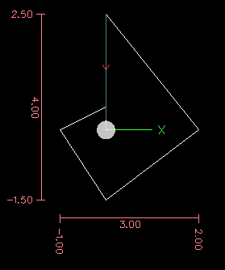
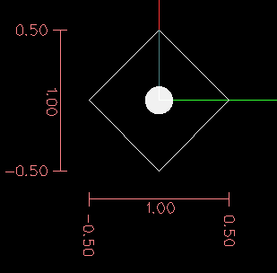

:lang: es

[[cha:g-code-overview]]

= Descripcion general del codigo G

:ini: {basebackend@docbook:'':ini}
:hal: {basebackend@docbook:'':hal}
:ngc: {basebackend@docbook:'':ngc}
// comienze un listado de archivos ini/hal/ngc así:
// [source,{ini}]
// [source,{hal}]
// [source,{ngc}]

== Descripcion general

El lenguaje LinuxCNC G Code se basa en el lenguaje RS274/NGC.
El lenguaje de código G se basa en líneas de código. Cada línea (también llamada
'bloque') puede incluir comandos para hacer varias cosas diferentes. Las líneas de
código se puede recopilar en un archivo para crear un programa.

Una línea de código típica consiste en un número de línea opcional al
comienzo seguido de una o más 'palabras'. Una palabra consiste en una letra
seguida de un número (o algo que se evalúe como un número, como una formula). Una palabra
puede dar un comando o proporcionar un argumento a un comando. Por
ejemplo, 'G1 X3' es una línea de código válida con dos palabras. 'G1' es un
comando que significa 'moverse en línea recta a velocidad de avance programada
hasta el punto final programado', y 'X3' proporciona un argumento de
valor (el valor de X debe ser 3 al final del movimiento).
La mayoría de los comandos de LinuxCNC G Code comienzan con G o M (de
General y Misceláneo). Las palabras para estos comandos se llaman 'códigos G' y 'códigos M'.

El lenguaje LinuxCNC no tiene indicador para el inicio de un programa.
El intérprete, sin embargo, se ocupa de los archivos. Un solo programa puede estar en un
archivo único, o un programa puede extenderse a través de varios archivos. Un archivo
se puede demarcar con porcentajes de la siguiente manera. La primera linea no en blanco
de un archivo puede contener solo un signo de porcentaje, '%', posiblemente
rodeado de espacios en blanco y luego (normalmente al final
del archivo) puede haber una línea similar. Demarcar un archivo con
porcentajes es opcional si el archivo tiene un 'M2' o 'M30', pero es
requerido si no los tiene. Se notificará un error si un archivo
tiene una línea de porcentaje al principio pero no al final.
El contenido util de un archivo delimitado por porcentajes termina después del segundo porcentaje.
Cualquier cosa después de ese signo, se ignora.

El lenguaje LinuxCNC G Code tiene dos comandos ('M2' o 'M30'), y cualquiera de los dos
termina un programa. Un programa puede finalizar antes del final de
un archivo. Las líneas de un archivo que ocurren después del final de un programa no son
ejecutadas. El intérprete ni siquiera las lee.

== Formato de una linea

Una línea permitida de código de entrada consiste en lo siguiente, en orden,
con la restricción de que hay un máximo (actualmente 256)
número de caracteres permitidos en una línea.

. un carácter de eliminación de bloque, opcional, que es una barra inclinada '/'.
. Un número de línea opcional.
. cualquier cantidad de palabras, configuraciones de parámetros y comentarios.
. un marcador de fin de línea (retorno de carro o avance de línea o ambos).

Cualquier entrada no permitida explícitamente es ilegal y causará que el
intérprete señale un error.

Se permiten espacios y tabulaciones en cualquier lugar de una línea de código sin
cambiar el significado de la línea, excepto los comentarios internos. Esto hace que algunos
entradas de aspecto extraño sean legales. La línea 'G0X +0. 12 34Y 7' es legal y
equivalente a 'G0 x + 0.1234 Y7', por ejemplo.

Se permiten líneas en blanco en la entrada. Seran ignoradas.

La entrada no distingue entre mayúsculas y minúsculas, excepto en los comentarios, es decir, cualquier letra
fuera de un comentario puede estar en mayúsculas o minúsculas sin cambiar el
significado de una línea

[[sub:block-delete]] (((Block Delete)))

=== Eliminar Bloque

El carácter opcional de eliminación de bloque es la barra '/' cuando se coloca el primero en una línea.
Algunas interfaces de usuario pueden utilizarlo para omitir líneas de código cuando sea necesario. En Axis,
la combinación de teclas Alt-m-/ activa o desactiva la eliminación de bloque. Cuando eliminar bloque
está activado, cualquier línea que comience con la barra '/' se omite.

=== Numero de línea
(((Line Number)))

Un número de línea es la letra N seguida de un entero sin signo,
seguida opcionalmente por un punto y otro entero sin signo. Por
ejemplo, 'N1234' y 'N56.78' son números de línea válidos. Pueden ser
repetidos o usados fuera de orden, aunque la práctica normal es evitar
tal uso. Los números de línea también se pueden omitir, y eso es la práctica normal.
No es necesario utilizar un número de línea, pero debe estar en el
lugar apropiado si se usa.

=== Palabra

Una palabra es una letra distinta de N seguida de un valor real.

Las palabras pueden comenzar con cualquiera de las letras que se muestran en la siguiente tabla.
La tabla incluye N para que sea completa,
aunque, como se definió anteriormente, los números de línea no son palabras. Varias letras
(I, J, K, L, P, R) pueden tener diferentes significados en diferentes contextos.
Las letras que hacen referencia a los nombres de los ejes no son válidas en una máquina que
no tiene el eje correspondiente.

.Palabras y sus significados.

[width="75%", options="header", cols="^1,<5"]
|====
| Letra | Significado
|A | Eje A de la máquina
|B | Eje B de la máquina
|C | Eje C de la máquina
|D | Número de compensación de radio de herramienta
|F | Velocidad de alimentación o avance
|G | Función general (Ver tabla <<cap:modal-groups,Grupos modales>>)
|H | Índice de offset de longitud de herramienta
|I | Offset X para arcos y ciclos fijos G87
|J | Offset Y para arcos y ciclos fijos G87
.2+|K | Offset Z para arcos y ciclos fijos G87.
<| Relacion Husillo-Movimiento para movimientos sincronizados G33.
|L | palabra de parámetro genérico para G10, M66 y otros
|M | Función miscelánea (Ver tabla <<cap:modal-groups,Grupos modales>>)
|N | Número de línea
.2+|P | Tiempo de parada en ciclos fijos y con G4.
<| Clave utilizada con G10.
|Q | Incremento de alimentación en ciclos fijos G73, G83
|R | Radio de arco o plano de ciclo fijo
|S | Velocidad del husillo
|T | Selección de herramienta
|U | Eje U de la máquina
|V | Eje V de la máquina
|W | Eje W de la máquina
|X | Eje X de la máquina
|Y | Eje Y de la máquina
|Z | Eje Z de la máquina
|====

=== Numeros

Las siguientes reglas se utilizan para números (explícitos). En estas reglas, un
dígito es un solo carácter entre 0 y 9.

* Un número consta de (1) un signo, más o menos, opcional, seguido de
(2) de cero a muchos dígitos, seguido, posiblemente, por (3) un punto decimal,
seguido de (4) cero a muchos dígitos, siempre que haya al menos
un dígito en algún lugar del número.
* Hay dos tipos de números: enteros y decimales. Un entero
no tiene un punto decimal en él; un decimal si lo tiene.
* Los números pueden tener cualquier número de dígitos, sujeto a la limitación de
longitud de la línea. Solo se retendrán unas diecisiete cifras significativas,
suficiente para todas las aplicaciones conocidas.
* Un número distinto de cero sin signo en su primer carácter, se supone que es positivo.

Observe que los ceros inicial (antes del punto decimal y el primer dígito distinto de cero)
y final (después del punto decimal y el último dígito distinto de cero) están permitidos pero
no son obligatorios. Un número escrito con los ceros iniciales o finales tendrán el mismo valor
cuando se lea como si los ceros adicionales no estuvieran allí.

Los números utilizados para fines específicos en RS274/NGC a menudo están restringidos
a algún conjunto finito de valores o a algún rango de valores. En muchos
usos, los números decimales deben ser cercanos a enteros; esto incluye el
valores de índices (para parámetros y números de ranura de carrusel, por
ejemplo), códigos M y códigos G multiplicados por diez. Un número decimal
que está destinado a representar un número entero se considera lo suficientemente cerca si
está dentro de 0.0001 de un valor entero.

[[gcode:parameters]](((Parameters)))

== Parametros

El lenguaje RS274/NGC admite 'parámetros', lo qué en otros
los lenguajes de programación se llamarían 'variables'. Hay varios
tipos de parámetros de diferente propósito y apariencia, cada uno descrito
en las siguientes secciones. El único tipo de valor soportado por los parámetros
es el punto flotante; no hay tipos de cadena, booleanos o enteros en
Código G, a diferencia de otros lenguajes de programación. Sin embargo, las expresiones lógicas
se puede formular con <<gcode:binary-operators,operadores booleanos>>
('AND', 'OR', 'XOR' y los operadores de comparación
'EQ', 'NE', 'GT', 'GE', 'LT', 'LE'), y los <<gcode:functions,operadores>> 'MOD', 'ROUND', 'FUP' y
'FIX' admiten aritmética de enteros.

Los parámetros difieren en sintaxis, alcance, comportamiento cuando aún no se han
inicializado, modo, persistencia y uso previsto.

Sintaxis:: Hay tres tipos de apariencia sintáctica:
* 'numerado' - #4711
* 'nombre local' - #<valorlocal>
* 'nombre global' - #<_valorglobal>

Alcance:: El alcance de un parámetro es global o local dentro de una
subrutina. Los parámetros de subrutina y las variables nombradas locales tienen
alcance local. Los parámetros nombrados globales y los parámetros numerados a partir del
número 31 tiene alcance global. RS274/NGC utiliza 'alcance léxico' -
en una subrutina solo las variables locales definidas allí, y cualquier
variable global, son visibles. Las variables locales de un
procedimiento de llamada no son visibles por el procedimiento llamado.

Comportamiento de parámetros no inicializados::
* Los parámetros globales no inicializados y los parámetros de subrutina no utilizados
   devuelve valor cero cuando se usan en una expresión.
* Los parámetros con nombre no inicializados indican un error cuando se usan en una expresión.

Modo:: La mayoría de los parámetros son de lectura/escritura y pueden asignarse
dentro de una declaración de asignación. Sin embargo, para muchos parámetros predefinidos
esto no tiene sentido, por lo que son de solo lectura;
puede aparecer en expresiones, pero no en el lado izquierdo de un
sentencia de asignación.

Persistencia:: Cuando LinuxCNC se cierra, los parámetros volátiles pierden su
valores. Todos los parámetros excepto los parámetros numerados en el actual
rango persistente footnoteref:[persistent_range, El rango de parámetros persistentes
puede cambiar a medida que avanza el desarrollo. Este rango es
actualmente 5161-5390. Se define en la matriz '_required_parameters'
en el archivo src/emc/rs274ngc/interp_array.cc.] son ​​volátiles.
Los parámetros persistentes se guardan en el archivo .var y son
restaurados a sus valores anteriores cuando LinuxCNC se inicia de nuevo.
los parámetros numerados volatiles se restablecen a cero.

Uso previsto::
* parámetros de usuario:: parámetros numerados en el rango 31..5000, y
parámetros nombrados globales y locales, excepto parámetros predefinidos. Estan
disponible para almacenamiento de uso general de valores de punto flotante, como
resultados intermedios, banderas, etc., a lo largo de la ejecución del programa.
Son de lectura/escritura (se le puede asignar un valor).

* <<sub:subroutine-parameters,parámetros de subrutina >> - se utilizan para
  mantener los parámetros reales pasados ​​a una subrutina.

* <<sub:numbered-parameters,parámetros numerados>> - La mayoría de estos se utilizan 
  para acceder a offsets de sistemas de coordenadas.

* <<sub:system-parameters,parámetros del sistema>> - utilizado para determinar la
   versión en ejecución. Son de solo lectura.

[[sub:numbered-parameters]]

=== Parametros numerados

Un parámetro numerado es el carácter de numeral '#' seguido de un
entero entre 1 y 5602 (actualmente) footnote:[El intérprete RS274/NGC
mantiene una matriz de parámetros numerados. Su tamaño está definido por el
símbolo 'RS274NGC_MAX_PARAMETERS' en el archivo
src/emc/rs274ngc/interp_internal.hh). Este número de
parámetros numéricos también pueden aumentar a medida que el desarrollo agrege soporte para nuevos
parámetros]. El parámetro es referido
por este entero, y su valor es cualquier número almacenado en el parámetro.

Un valor se almacena en un parámetro con el operador '=' , por ejemplo:
----
#3 = 15 (configura el parámetro 3 a 15)
----

Una configuración de parámetros no toma efecto hasta después de que todos los valores de los 
parámetros en la misma línea hayan sido encontrados. Por ejemplo, si el parámetro 3 tiene 
previamente el valor 15 y se interpreta la línea '#3=6 G1 X#3', ocurrirá un movimiento directo 
a un punto donde X es igual a 15 y el valor del parámetro #3 pasara a 6.

El carácter '\#' tiene prioridad sobre otras operaciones, de modo que, por
ejemplo, '\#1+2' significa el número resultante de sumar 2 al valor de
parámetro 1, no el valor encontrado en el parámetro 3. Por supuesto, '\#[1+2]' significa el
valor encontrado en el parámetro 3. El carácter '\#' puede repetirse; por
ejemplo '##2' significa el valor del parámetro cuyo índice es el valor (entero) del parámetro 2.

* '31 -5000 ' - parámetros de usuario del código G. Estos parámetros son globales en
  archivos de código G, y disponibles para uso general. Volátiles.

* '5061-5069' - Coordenadas de un resultado de la sonda <<gcode:g38,G38>> (X, Y,
  Z, A, B, C, U, V y W). Las coordenadas están en el sistema de coordenadas en
  que tuvo lugar el G38. Volátil.

* '5070' - Resultado de la sonda <<gcode:g38,G38 >> ; 1 si es exitoso, 0 si la sonda
  no se pudo cerrar. Utilizado con G38.3 y G38.5. Volátil.

* '5161-5169' - Home "G28" para X, Y, Z, A, B, C, U, V y W. Persistente.

* '5181-5189' - Home "G30" para X, Y, Z, A, B, C, U, V y W. Persistente.

* '5210' - 1 si actualmente se aplica el desplazamiento "G52" o "G92", 0
   en caso contrario. Volátil por defecto; persistente si
   'DISABLE_G92_PERSISTENCE = 1' en la sección '[RS274NGC]' del
   archivo '.ini'.

* '5211-5219' - offsets compartidos "G52" y "G92" para X, Y, Z, A, B, C, U,
  V y W. Volátil por defecto; persistente si
  'DISABLE_G92_PERSISTENCE = 1' en la sección '[RS274NGC]' del
  archivo '.ini'.

* '5220' - Sistema de coordenadas número 1-9 para G54 - G59.3. Persistente.

* '5221-5230' - Sistema de coordenadas 1, G54 para X, Y, Z, A, B, C, U, V, W y R.
  R denota el ángulo de rotación XY alrededor del eje Z. Persistente.

* '5241-5250' - Sistema de coordenadas 2, G55 para X, Y, Z, A, B, C, U, V, W y R.
  Persistente.

* '5261-5270' - Sistema de coordenadas 3, G56 para X, Y, Z, A, B, C, U, V, W y R.
  Persistente.

* '5281-5290' - Sistema de coordenadas 4, G57 para X, Y, Z, A, B, C, U, V, W y R.
  Persistente.

* '5301-5310' - Sistema de coordenadas 5, G58 para X, Y, Z, A, B, C, U, V, W y R.
  Persistente.

* '5321-5330' - Sistema de coordenadas 6, G59 para X, Y, Z, A, B, C, U, V, W y R.
  Persistente.

* '5341-5350' - Sistema de coordenadas 7, G59.1 para X, Y, Z, A, B, C, U, V, W y R.
  Persistente.

* '5361-5370' - Sistema de coordenadas 8, G59.2 para X, Y, Z, A, B, C, U, V, W y R.
  Persistente.

* '5381-5390' - Sistema de coordenadas 9, G59.3 para X, Y, Z, A, B, C, U, V, W y R.
  Persistente.

* '5399' - Resultado de M66 - Verifica o espera la entrada. Volátil.

* '5400' - Número de herramienta. Volátil.

* '5401-5409' - Offsets de herramientas para X, Y, Z, A, B, C, U, V y W. Volátil.

* '5410' - Diámetro de herramienta. Volátil.

* '5411' - Ángulo frontal de herramienta. Volátil.

* '5412' - Ángulo posterior de la herramienta. Volátil.

* '5413' - Orientación de herramienta. Volátil.

* '5420-5428' - Posición relativa actual en el sistema de coordenadas activo
  incluyendo todas los offsets y en las unidades de programa actuales para
  X, Y, Z, A, B, C, U, V y W, volátiles.

* '5599' - Indicador para controlar la salida de las declaraciones (DEBUG,).
   1 = salida, 0 = sin salida; predeterminado = 1. Volátil.

* '5600' - Indicador de fallo del cambiador de herramientas. Utilizado con el componente iocontrol-v2.
   1: cambiador de herramientas con fallos, 0: normal. Volátil.

* '5601' - Código de fallo del cambiador de herramientas. Utilizado con el componente iocontrol-v2.
   Refleja el valor del pin HAL 'toolchanger-reason' si ocurrió un fallo.
   Volátil.

.Persistencia de Parámetros Numerados

Los valores de los parámetros en el rango persistente se conservan en el
tiempo, incluso si el centro de mecanizado está apagado. LinuxCNC usa un
archivo de parámetros para garantizar la persistencia. Es administrado por el
interprete. El intérprete lee el archivo cuando se inicia y
escribe el archivo cuando sale.

El formato de un archivo de parámetros se muestra en la Tabla
<<gcode:format-parameter-file,formato de archivo de parámetros>>.

El intérprete espera que el archivo tenga dos columnas. Se salta cualquier
líneas que no contienen exactamente dos valores numéricos.
Se espera que la primera columna contenga un valor entero (el número de parámetro). 
La segunda columna contiene un número de coma flotante (último valor del parámetro). 
El valor se representa como un número de coma flotante de doble precisión dentro del intérprete, pero
el punto decimal no se requiere en el archivo.

Pueden agregarse al archivo parámetros definidos por el usuario en el rango (31-5000).
Dichos parámetros serán leídos por el intérprete y escritos en el archivo al salir.

Los parámetros faltantes en el rango persistente se inicializarán a cero
y se escribiran con sus valores actuales en la próxima operación de guardar.

Los números de los parámetros deben organizarse en orden ascendente.
Se señalará el error 'Archivo de parámetros fuera de servicio' si no están en
orden ascendente

El archivo original se guarda como un archivo de respaldo cuando se escribe el nuevo archivo.

[[gcode:format-parameter-file]]

.Formato de archivo de parámetros

[width="90%", options="header"]
|====
|Número de parámetro | Valor del parámetro
|5161 | 0.0
|5162 | 0.0
|====

[[sub:subroutine-parameters]]

=== Parametros de subrutina

* '1-30' Parámetros locales de argumentos  de llamada de subrutina. Estos parámetros son
  locales a la subrutina. Volátil. Ver también el capítulo sobre
  <<cha:o-codes,códigos O>>.

=== Parametros con nombre

Los parámetros con nombre funcionan como parámetros numerados pero son más fáciles de leer.
Todos los nombres de parámetros se convierten a minúsculas y tienen eliminados espacios y
tabulaciones, por lo que '#<param>' y '#
' se refieren al mismo
parámetro. Los parámetros con nombre deben estar encerrados con las marcas '< >'.

'#<parámetro con nombre>' es un parámetro con nombre local. Por defecto, un
parámetro con nombre es local en el ámbito en el que está asignado. No puede
acceder a un parámetro local fuera de su subrutina. Esto significa que dos
subrutinas pueden usar los mismos nombres de parámetros sin temor a una subrutina
sobreescriba los valores de la otra.

'#<_parámetro con nombre global>' es un parámetro con nombre global.
Son accesibles desde las subrutinas llamadas y pueden establecer valores dentro de
subrutinas, accesibles para el llamante. En lo que respecta al alcance,
actúan como parámetros numéricos regulares. No se almacenan en archivos.

Ejemplos:

.Declaración de la variable global nombrada.
----
#<_endmill_dia> = 0.049
----

.Referencia a la variable global previamente declarada
----
#<_endmill_rad> = [#<_endmill_dia>/2.0]
----

.Mezcla de Parámetros literales y con nombre.
----
o100 call [0.0] [0.0] [#<_inside_cutout>-#<_endmill_dia>] [#<_Zcut>] [#<_feedrate>]
----

Los parámetros con nombre aparecen cuando se les asigna un valor por primera vez. 
Los parámetros locales nombrados desaparecen cuando se abandona su alcance, esto es,
cuando se vuelve de una subrutina se eliminan todos sus parámetros locales
y ya no se puede hacer referencia a ellos.

Es un error utilizar un parámetro con nombre inexistente dentro de una
expresión, o en el lado derecho de una asignacion. Imprimir el
valor de un parámetro con nombre inexistente con una instrucción DEBUG, como
'(DEBUG, #<no_exito_parameter>)' mostrará la cadena '######'.

Los parámetros globales, así como parámetros locales asignados a
nivel global, conservan su valor una vez asignados incluso cuando el programa
finaliza y tendrán esos valores cuando el programa se ejecute nuevamente.

La <<gcode:functions,función 'EXISTS'>> prueba si existe un parámetro con nombre dado.

[[gcode:predefined-named-parameters]]

=== Parametros con nombre predefinidos

Los siguientes parámetros globales con nombre, de solo lectura, están disponibles para
acceder al estado interno del intérprete y al estado de la máquina. Pueden
ser usados en expresiones arbitrarias, por ejemplo para controlar el flujo de
programa con sentencias if-then-else. Tenga en cuenta que un nuevo
<<remap:adding-predefined-named-parameters,parámetro con nombre predefinido>>
se puede agregar fácilmente, sin cambios en el código .ngc.

* '#<_vmajor>' - Versión principal del paquete. Si la versión actual fuera 2.5.2, devolvería 2.5.

* '#<_vminor>' - Versión menor del paquete. Si la versión actual fuera 2.6.2, devolvería 0.2.

* '#<_line>' - Número de secuencia. Si ejecuta un archivo de código G, esto devuelve el número de línea actual.

* '#<_motion_mode>' - Devuelve el modo de movimiento actual del intérprete:

[width="20%",options="header"]
|====
|Modo de movimiento | valor de retorno
|G1| 10
|G2| 20
|G3| 30
|G33| 330
|G38.2| 382
|G38.3| 383
|G38.4| 384
|G38.5| 385
|G5.2| 52
|G73| 730
|G76| 760
|G80| 800
|G81| 810
|G82| 820
|G83| 830
|G84| 840
|G85| 850
|G86| 860
|G87| 870
|G88| 880
|G89| 890
|====

* '#<_plane>' - devuelve el valor que designa el plano actual:
[width="20%",options="header"]
|====
|Plano | valor de retorno
|G17| 170
|G18| 180
|G19| 190
|G17.1| 171
|G18.1| 181
|G19.1| 191
|====

* '#<_ccomp>' - Estado de la compensación del cortador. Valores de retorno:
[width="20%",options="header"]
|====
|Modo | valor de retorno
|G40 | 400
|G41 | 410
|G41.1| 411
|G41 | 410
|G42 | 420
|G42.1 | 421
|====

* '#<_metric>' - Devuelve 1 si G21 está activado, de lo contrario 0.

* '#<_imperial>' - Devuelve 1 si G20 está activado, de lo contrario 0.

* '#<_absolute>' - Devuelve 1 si G90 está activado, de lo contrario 0.

* '#<_incremental>' - Devuelve 1 si G91 está activado, de lo contrario 0.

* '#<_inverse_time>' - Devuelve 1 si el modo de alimentación inversa (G93) está activado, de lo contrario 0.

* '#<_units_per_minute>' - Devuelve 1 si el modo de alimentación udes/minuto (G94) está activado, de lo contrario 0.

* '#<_units_per_rev>' - Devuelve 1 si el modo udes/revolución (G95) está activado, de lo contrario 0.

* '#<_coord_system>' - Devuelve un flotante del nombre del sistema de coordenadas actual (G54..G59.3).
Por ejemplo, si está en el sistema de coordenadas G55, el valor de retorno es
550.000000 y si está en G59.1 el valor de retorno es 591.000000.

[width="20%",options="header"]
|====
|Modo | valor de retorno
|G54| 540
|G55| 550
|G56| 560
|G57| 570
|G58| 580
|G59| 590
|G59.1|591
|G59.2|592
|G59.3|593
|====

* '#<_tool_offset>' - Devuelve 1 si el offset de herramienta (G43) está activado, de lo contrario 0.

* '#<_retract_r_plane>' - Devuelve 1 si G98 está configurado, de lo contrario 0.

* '#<_retract_old_z>' - Devuelve 1 si G99 está activado, de lo contrario 0.

[[sub:system-parameters]]

=== Parametros del sistema

* '#<_spindle_rpm_mode>' -
    Devuelva 1 si el modo rpm del cabezal (G97) está activado, de lo contrario 0.

* '#<_spindle_css_mode>' -
    Devuelve 1 si el modo de velocidad de superficie constante (G96) está activado, de lo contrario 0.

* '#<_ijk_absolute_mode>' -
    Devuelve 1 si el modo de distancia de Arco absoluto (G90.1) está activado, de lo contrario 0.

* '#<_lathe_diameter_mode>' -
    Devuelve 1 si el modo de diámetro en torno (G7) está activado, de lo contrario 0.

* '#<_lathe_radius_mode>' -
    Devuelve 1 si el modo de radio en torno (G8) está activado, de lo contrario 0.

* '#<_spindle_on>' -
    Devuelve 1 si el husillo está girando actualmente (M3 o M4), de lo contrario 0.

* '#<_spindle_cw>' -
    Devuelve 1 si la dirección del husillo es en sentido horario (M3), de lo contrario 0.

* '#<_mist>' -
    Devuelve 1 si la niebla (M7) está activada.

* '#<_flood>' -
    Devuelve 1 si la inundación (M8) está activada.

* '#<_speed_override>' -
    Devuelva 1 si la anulación de alimentación (M48 o M50 P1) está activada, de lo contrario 0.

* '#<_feed_override>' -
    Devuelve 1 si el ajuste de alimentación (M48 o M51 P1) está activado, de lo contrario 0.

* '#<_adaptive_feed>' -
    Devuelve 1 si la alimentación adaptativa (M52 o M52 P1) está activada, de lo contrario 0.

* '#<_feed_hold>' -
    Devuelve 1 si el interruptor de retención de alimentación está habilitado (M53 P1), de lo contrario 0.

* '#<_feed>' -
    Devuelve el valor actual de F, no la velocidad de alimentación real.

* '#<_rpm>' -
    Devuelve el valor actual de S, no la velocidad real del husillo.

* '#<_x>' -
    Devuelve la coordenada X relativa actual, incluidos todos los offsets. Igual que #5420.

* '#<_y>' -
    Devuelve la coordenada Y relativa actual, incluidos todos los offsets. Igual que #5421.

* '#<_z>' -
    Devuelve la coordenada Z relativa actual, incluidos todos los offsets. Igual que #5422.

* '#<_a>' -
    Devuelve la coordenada relativa actual A, incluidos todos los offsets. Igual que #5423.

* '#<_b>' -
    Devuelve la coordenada B relativa actual, incluidos todos los offsets. Igual que #5424.

* '#<_c>' -
    Devuelve la coordenada C relativa actual, incluidos todos los offsets. Igual que #5425.

* '#<_u>' -
    Devuelve la coordenada U relativa actual, incluidos todos los offsets. Igual que #5426.

* '#<_v>' -
    Devuelve la coordenada V relativa actual, incluidos todos los offsets. Igual que #5427.

* '#<_w>' -
    Devuelve la coordenada W relativa actual, incluidos todos los offsets. Igual que #5428.

* '#<_current_tool>' -
    Número de la herramienta actual en el husillo. Igual que # 5400.

* '#<_current_pocket>' -
    Devuelve el número de ranura de la herramienta actual.

* '#<_selected_tool>' -
    El número de la herramienta seleccionada por un código T. Por defecto -1.

* '#<_selected_pocket>' -
    El número de ranura seleccionado por un código T. Predeterminado -1
    (sin ranura seleccionada).

* '#<_value>' - 
Valor de retorno de la última palabra O 'return' o 'endsub'. Por defecto
    valor 0 si no hay expresión después de 'return' o 'endsub'. Inicializado
    a 0 al inicio del programa.

* '#<_value_returned>' -
    1.0 si la última palabra O 'return' o 'endsub' devolvió un valor, 0
    de otra manera. Limpiado por la siguiente llamada O-word.

* '#<_task>' -
    1.0 si la instancia del intérprete en ejecución es parte de milltask, 0.0
    de otra manera. A veces es necesario tratar este caso especialmente
    para mantener una vista previa adecuada, por ejemplo, cuando se prueba el éxito de
    una sonda (G38.n) inspeccionando #5070, que siempre fallará en el
    intérprete de vista previa (por ejemplo, Axis).

* '#<_call_level>' -
    nivel actual de anidamiento de los procedimientos O-word. Para depuracion.

* '#<_remap_level>' -
    nivel actual de la pila de reasignación. Cada reasignación en un bloque agrega uno
    al nivel de reasignación. Para depuracion.

[[gcode:ini-hal-params]]

== Pines HAL y valores INI
Si está habilitado en el <<gcode:ini-features,archivo INI>> G-code tiene acceso
a los valores de las entradas del archivo INI y a los pines HAL.

* '#<_ini[section]name>' Devuelve el valor del elemento correspondiente en el archivo INI.
Por ejemplo, si el archivo ini se ve así:

[source,{ini}]
---------------------------------------------------------------------
[SETUP]
XPOS = 3.145
YPOS = 2.718
---------------------------------------------------------------------

puede referirse a los parámetros nombrados `#<_ini[setup]xpos>` y
`#<_ini[setup]ypos>` dentro del código G.

`EXISTS` puede usarse para probar la presencia de una variable en el archivo ini dado:

[source,{ngc}]
---------------------------------------------------------------------
o100 if [EXISTS[#<_ini[setup]xpos>]]
  (debug, [setup]xpos existe: #<_ini[setup]xpos>)
o100 else
  (debug, [setup]xpos no existe)
o100 endif
---------------------------------------------------------------------

El valor se lee desde el archivo ini una vez y se almacena en caché del interprete. 
Estos parámetros son de solo lectura: asignar un valor
causa un error de tiempo de ejecución. Los nombres no distinguen entre mayúsculas y minúsculas, son
convertido a mayúsculas antes de consultar el archivo ini.

* '#<_hal[elemento Hal]>'
Permite que los programas de código G lean los valores de los pines HAL. El acceso a las variables es
de solo lectura; la única forma de _dar valores_ a pines HAL desde código G sigue siendo M62-M65,
M67, M68 y los códigos personalizados M100-M199.
Tenga en cuenta que el valor leído no se actualizará en tiempo real; normalmente será devuelto
el valor que estaba en el pin cuando se inició el programa de código G.
Es posible solucionar esto forzando una sincronización de estado.
Una forma de hacerlo es con un comando M66 ficticio: M66E0L0

Ejemplo:

[source,{ngc}]
---------------------------------------------------------------------
(debug, #<_hal[motion-controller.time]>)
---------------------------------------------------------------------

El acceso a los items HAL es de solo lectura. Actualmente, solo se puede acceder de esta manera 
a los nombres HAL en minúsculas.

`EXISTS` se puede usar para probar la presencia de un elemento HAL dado:

[source,{ngc}]
---------------------------------------------------------------------
o100 if [EXISTS[#<_hal[motion-controller.time]>]]
  (debug, [motion-controller.time] existe: #<_hal[motion-controller.time]>)
o100 else
  (debug, [motion-controller.time] no existe)
o100 endif
---------------------------------------------------------------------

Esta característica fue motivada por el deseo de una conexion más fuerte entre
componentes de la interfaz de usuario como `GladeVCP` y` PyVCP` para actuar como
fuente de parámetros para manejar el comportamiento del archivo NGC. La alternativa -
pasar por los pines M6x y ​​conectarlos - tiene un
espacio de nombres límitado y no mnemotécnico y es innecesariamente engorroso como
mecanismo de comunicación UI/Intérprete.

[[gcode:expressions]]

== Expresiones

Una expresión es un conjunto de caracteres que comienzan con un corchete izquierdo '['
y terminan con un corchete derecho de equilibrio ']'. Entre los corchetes
hay números, valores de parámetros, operaciones matemáticas
y otras expresiones. Una expresión se evalúa para
producir un número. Las expresiones en una línea se evalúan cuando la línea
se lee, antes de que se ejecute nada en la línea. Un ejemplo de una
expresión es '[1 + acos[0] - [#3 ** [4.0/2]]]'.

[[gcode:binary-operators]]

== Operadores binarios

Los operadores binarios solo aparecen dentro de las expresiones. Hay cuatro operaciones 
matemáticas básicas: suma ('+'), resta ('-'), multiplicación ('\*') y división ('/'). Hay tres
operaciones lógicas: o no exclusivo ('OR'), o exclusivo ('XOR'), y lógico 'AND'). 
La octava operación es la operación de módulo ('MOD').
La novena operación es la operación 'potencia' ('**'); elevar el número
a la izquierda de la operación al exponente de la derecha. 
Los operadores relacionales son igualdad ('EQ'), desigualdad
('NE'), estrictamente mayor que ('GT'), mayor o igual que ('GE'),
estrictamente menor que ('LT'), y menor o igual que ('LE').

Las operaciones binarias se dividen en varios grupos según su
precedencia. Si las operaciones en diferentes grupos de precedencia se unen
(por ejemplo, en la expresión '[2.0 / 3 * 1.5 - 5.5 / 11.0]'), las operaciones
en un grupo superior deben realizarse antes de las operaciones
en un grupo inferior. Si una expresión contiene más de una operación
del mismo grupo (como el primer '/' y '*' en el ejemplo),
la operación mas a la izquierda se realiza primero. Así,
el ejemplo es equivalente a: '[ [ [2.0 / 3] * 1.5] - [5.5 / 11.0] ]',
que es equivalente a '[1.0 - 0.5]', que es '0.5'.

Las operaciones lógicas y el módulo pueden realizarse en cualquier
número, no solo en enteros. El número cero es equivalente a falso lógico,
y cualquier número distinto de cero es equivalente a verdadero lógico.

.Precedencia de operadores

[width="60%", options="header", cols="2*^"]
|====
|Operador | Precedencia
|** | 'más alto'
|* / MOD |
|+ - |
|EQ NE GT GE LT LE |
|AND OR XOR | 'más bajo'
|====

== Igualdad y valores de coma flotante

El lenguaje RS274/NGC solo admite valores de punto flotante de
precisión finita. Por lo tanto, probar la igualdad o desigualdad de dos
valores de punto flotante es inherentemente problemático. El interprete
resuelve este problema considerando valores iguales si su
diferencia absoluta es menor que 0.0001 (este valor se define como
'TOLERANCE_EQUAL' en src/emc/rs274ngc/interp_internal.hh).

[[gcode:functions]]

== Funciones

Las funciones disponibles se muestran en la siguiente tabla. Los argumentos unarios
de las operaciones que toman medidas de ángulo ('COS', 'SIN' y 'TAN') están en
grados. Los valores devueltos por operaciones unarias que devuelven medidas de ángulo
('ACOS', 'ASIN' y 'ATAN') también están en grados.

.Funciones

[width="75%", options="header", cols="^,<"]
|====
|Nombre de la función | Resultado de la función
|ATAN[arg]/[arg] | Tangente inversa de cuatro cuadrantes
|ABS[arg] | Valor absoluto
|ACOS[arg] | Coseno inverso
|ASIN[arg] | Seno inverso
|COS[arg] | Coseno
|EXP[arg] | e elevado al exponente dado
|FIX[arg] | Redondear hacia abajo a entero
|FUP[arg] | Redondear a entero hacia arriba
|ROUND[arg] | Redondear al entero más cercano
|LN[arg] | Logaritmo Base-e
|SIN[arg] | Seno
|SQRT[arg] | Raíz cuadrada
|TAN[arg] | Tangente
|EXISTS[arg] | Comprueba el parámetro con nombre
|====

La función 'FIX' se redondea hacia la izquierda (menos positiva o más negativa)
en una recta numérica, de modo que 'FIX[2.8] = 2' y 'FIX[-2.8] = -3'.

La operación 'FUP' se redondea hacia la derecha (más positiva o menos
negativa) en una recta numérica; 'FUP[2.8] = 3' y 'FUP[-2.8] = -2'.

La función 'EXISTS' verifica la existencia de un solo parámetro con nombre.
Solo toma un parámetro con nombre y devuelve 1 si existe y 0 si
no existe. Es un error si usa un parámetro numerado o una expresión.
Aquí hay un ejemplo para el uso de la función EXISTS:

----
o<test> sub
o10 if [EXISTS[#<_global>]]
    (debug, _global existe y tiene el valor #<_global>)
o10 else
    (debug, _global does no existe)
o10 endif
o<test> endsub

o<test> call
#<_global> = 4711
o<test> call
m2
----

== Items repetidos

Una línea puede tener cualquier número de palabras G, pero dos palabras G del mismo
grupo modal no pueden aparecer en la
misma línea. Consulte la sección <<gcode:modal-groups,Grupos Modales>> para obtener más información.

Una línea puede tener de cero a cuatro palabras M. Dos palabras M del mismo grupo modal
no deben aparecer en la misma línea.

Para todas las demás letras legales, una línea puede tener solo una palabra que comienza
con esa letra.

Si una configuración del mismo parámetro se repite en una línea,
'#3 = 15 #3 = 6', por ejemplo, solo la última configuración tendrá efecto.
Es absurdo, pero no ilegal, establecer el mismo parámetro dos veces en la misma línea.

Si aparece más de un comentario en una línea, solo el último será
usado; cada uno de los otros comentarios será leído y su formato será
marcado, pero se ignorará a partir de entonces.
Poner más de un comentario en una línea es muy raro.

== Orden de items

Los tres tipos de items cuyo orden puede variar en una línea (como se indica en
el comienzo de esta sección) son palabras, configuración de parámetros y
comentarios. Imagine que estos tres tipos de elementos se dividen en tres
grupos por tipo.

El primer grupo (las palabras) puede reordenarse de cualquier manera sin
cambiar el significado de la línea.

Si se reordena el segundo grupo (la configuración de parámetros),
no habrá cambio en el significado de la línea a menos que el mismo parámetro sea
establecido más de una vez. En este caso, solo la última configuración del
parámetro tendrá efecto. Por ejemplo, después de que la línea '#3 = 15 #3 = 6'
ha sido interpretada, el valor del parámetro 3 será 6. Si el
orden se invierte a '#3 = 6 #3 = 15' y se interpreta la línea,
el valor del parámetro 3 será 15.

Si el tercer grupo (los comentarios) contiene más de un comentario y
se reordena, solo se utilizará el último comentario.

Si cada grupo se mantiene en orden o se reordena sin cambiar el
significado de la línea, entonces los tres grupos pueden estar intercalados en cualquier
forma sin cambiar el significado de la línea. Por ejemplo, la linea
'g40 g1 #3 = 15 (foo) #4=-7.0' tiene cinco elementos y significa exactamente
lo mismo en cualquiera de los 120 posibles ordenes (por ejemplo '#4=-7.0 g1 #3=15 g40 (foo)') de los cinco
items.

== Comandos y Modos de Maquina

Muchos comandos hacen que el controlador cambia de un modo a otro,
y el modo permanece activo hasta que algún otro comando lo cambie
implícita o explícitamente. Tales comandos se denominan 'modales'.
Por ejemplo, si el refrigerante está encendido, permanece encendido hasta que sea explícitamente
apagado. Los códigos G para movimiento también son modales. Si un G1 (movimiento recto)
se da en una línea, se ejecutará nuevamente en la línea siguiente si hay una o más palabras de eje disponibles en
esa línea, a menos que en ella se dé un comando explícito usando las palabras de eje o cancelando el movimiento.

Los códigos 'no modales' solo tienen efecto en las líneas en las que se encuentran.
Por ejemplo, G4 (Dwell) no es modal.

(((Polar Coordinates)))

== Coordenadas Polares

Las coordenadas polares se pueden usar para especificar la coordenada XY de un movimiento.
El @n es la distancia y ^n es el ángulo. La ventaja de esto está
en cosas como círculos de agujeros de pernos que se pueden hacer de manera muy simple
moviéndose a un punto en el centro del círculo, estableciendo el desplazamiento y
luego moviendose hacia el primer agujero para luego ejecutar el ciclo de perforación.
Las coordenadas polares siempre son desde la posición cero XY actual.
Para cambiar las coordenadas polares del cero máquina, use un desplazamiento
o seleccione un sistema de coordenadas.

En modo absoluto, la distancia y el ángulo son desde la posición cero XY
y el ángulo comienza con 0 en el eje X positivo y aumenta en dirección CCW
sobre el eje Z. El código G1 @1 ^90 es el mismo que G1 Y1.

En modo relativo, la distancia y el ángulo también son desde el cero XY
pero son acumulativos.
Puede ser confuso al principio cómo funciona esto en modo incremental.

Por ejemplo, si tiene el siguiente programa, puede esperar que
sea un patrón cuadrado

----
F100 G1 @.5 ^90
G91 @.5 ^90
@.5 ^90
@.5 ^90
@.5 ^90
G90 G0 X0 Y0 M2
----

Puede ver en la siguiente figura que la salida no es lo que usted
podría esperar. Ya que agregamos 0.5 a la distancia cada vez,
la distancia desde la posición XY cero aumentó con cada línea.

Espiral polar

El siguiente código producirá nuestro patrón cuadrado.

----
F100 G1 @.5 ^90
G91 ^90
^90
^90
^90
G90 G0 X0 Y0 M2
----

Como puede ver solo agregando al ángulo 90 grados cada vez,
la distancia del punto final es la misma para cada línea.

Cuadrado polar

Es un error si:

* Se inicia un movimiento incremental en el origen
* Se usa una mezcla de palabras Polar y X o Y

[[gcode:modal-groups]](((Modal Groups)))

== Grupos modales

Los comandos modales se organizan en conjuntos llamados 'grupos modales', y solo
un miembro de un grupo modal puede estar en vigor en cualquier momento. En
general, un grupo modal contiene comandos para los cuales es lógicamente
imposible que dos miembros entren en vigencia al mismo tiempo, como
medida en pulgadas y medida en milímetros. Un centro de mecanizado puede estar
en muchos modos al mismo tiempo, con un modo de cada grupo modal
en vigor. Los grupos modales se muestran en la siguiente tabla.

.Grupos modales de código G.[[cap:modal-groups]]

[width="80%", cols="4,6", options="header"]
|====
|Significado del grupo modal                         | Miembros
|Códigos no modales (Grupo 0)                        | G4, G10 G28, G30, G52, G53, G92, G92.1, G92.2, G92.3,
.2+|Movimiento (Grupo 1)                             | G0, G1, G2, G3, G33, G38.n, G73, G76, G80, G81
                                                     | G82, G83, G84, G85, G86, G87, G88, G89
|Selección de plano (Grupo 2)                        | G17, G18, G19, G17.1, G18.1, G19.1
|Modo distancia (Grupo 3)                            | G90, G91
|Modo de distancia Arc IJK (Grupo 4)                 | G90.1, G91.1
|Modo de velocidad de alimentación (Grupo 5)         | G93, G94, G95
|Unidades (Grupo 6)                                  | G20, G21
|Compensación del diámetro del cortador (Grupo 7)    | G40, G41, G42, G41.1, G42.1
|Desplazamiento de longitud de herramienta (Grupo 8) | G43, G43.1, G49
|Modo de retorno de ciclos fijos (Grupo 10)          | G98, G99
|Sistema de coordenadas (Grupo 12)                   | G54, G55, G56, G57, G58, G59, G59.1, G59.2, G59.3
|Modo de control (Grupo 13)                          | G61, G61.1, G64
|Modo de velocidad del husillo (Grupo 14)            | G96, G97
|Modo de diámetro de torno (Grupo 15)                | G7, G8
|====

.Grupos modales de código M.

[width="80%", cols="4,6", options="header"]
|====
|Significado del grupo modal          | Miembros
|Detención (Grupo 4)                  | M0, M1, M2, M30, M60
|Husillo (Grupo 7)                    | M3, M4, M5
|Refrigerante (Grupo 8)               | (M7 M8 puede estar ambos ON), M9
|Interruptores de ajuste (Grupo 9)    | M48, M49
|Definido por el usuario (Grupo 10)   | M100-M199
|====

Para varios grupos modales, cuando un centro de mecanizado está listo para aceptar
comandos, un miembro del grupo debe estar en vigor. Hay por defecto
ajustes para estos grupos modales. Cuando el centro de mecanizado está encendido
o reinicializado, los valores predeterminados entran automáticamente en efecto.

El grupo 1 es un grupo de códigos G para movimiento. Uno de ellos siempre está vigente. 
A ese se le llama modo de movimiento actual.

Es un error colocar un código G del grupo 1 y un código G del grupo 0
en la misma línea si ambos usan palabras de eje. Si un código G del grupo 1 que usa palabras de eje 
estaba implícitamente vigente en una línea (por haber sido activado en una línea anterior) 
y un código G del grupo 0 que usa las palabras de eje aparece en la línea, la actividad del código G del grupo 1 es
suspendida para esa línea. Los códigos G del grupo 0 que usan palabras de eje son
G10, G28, G30, G52 y G92.

Es un error incluir palabras no relacionadas en una línea con control de flujo 'O-'.

[[gcode:comments]]
== Comentarios

Se pueden agregar comentarios a las líneas de código G para ayudar a aclarar la
intención del programador. Los comentarios se pueden incrustar en una línea usando
paréntesis () o al final de una línea usando un punto y coma.
El punto y coma no se trata como el comienzo de un comentario cuando está encerrado entre
paréntesis

Los comentarios pueden aparecer entre palabras, pero no entre palabras y sus
parámetros correspondientes. Por tanto, 'S100 (velocidad establecida) F200 (alimentación)' está bien mientras que
'S (velocidad) 100F (alimentación)' no lo está.

----
G0 (Rápido para comenzar) X1 Y1
G0 X1 Y1 (Rápido para comenzar; pero no olvide el refrigerante)
M2 ; Fin del programa.
----

Hay varios comentarios 'activos' que parecen comentarios pero causan
alguna acción, como '(debug, ..)' o '(print, ...)'. Si hay
varios comentarios en una línea, solo se interpretará el último comentario
de acuerdo con estas reglas. Por lo tanto, un comentario normal después de un comentario activo
deshabilitará el comentario activo. Por ejemplo, '(foo)
(debug, # 1)' imprimirá el valor del parámetro '#1'; sin embargo
'(debug, #1) (foo)' no lo hará.

Un comentario introducido por un punto y coma es, por definición, el último comentario
en esa línea, y siempre se interpretará para la sintaxis activa de comentarios.

NOTA: Los comentarios en línea en palabras O no deben usarse. Vea la sección del Código O
<<ocode:comments,comentarios>>  para más información.

[[gcode:messages]]
== Mensajes

* '(MSG,)' - muestra el mensaje si aparece 'MSG' después del paréntesis izquierdo
y antes de cualquier otro caracter imprimible. Se permiten variantes de 'MSG' que incluyen
espacios en blanco y minúsculas. El resto de
los caracteres antes del paréntesis derecho se consideran un mensaje.
Los mensajes deben mostrarse en el dispositivo de visualización de mensajes del interfaz de usuario,
si se proporciona.

.Ejemplo de mensaje
----
(MSG, esto es un mensaje)
----

(((Probe Logging)))

== Registro de sonda

* '(PROBEOPEN filename.txt)' - abrirá filename.txt y almacenará 9 números de 
coordenadas, XYZABCUVW, de cada sondeo recto exitoso en el.

* '(PROBECLOSE)' - cerrará el archivo abierto. Para más información sobre
sondeo ver la sección <<gcode:g38,G38>>.

(((Logging)))

== Registro

* '(LOGOPEN, filename.txt)' - abre el archivo de registro nombrado. Si el archivo ya
existe, se trunca.

* '(LOGAPPEND, filename)' - abre el archivo de registro nombrado. Si el archivo ya
existe, los datos se adjuntan.

* '(LOGCLOSE)' - cierra un archivo de registro abierto.

* '(LOG,)' - todo lo sigue a la ',' se escribe en el archivo de registro si está abierto.
Admite la expansión de parámetros como se describe a continuación.

Ejemplos de registro están en 'nc_files/examples/smartprobe.ngc' y en
'nc_files/ngcgui_lib/rectange_probe.ngc' archivos de código G de muestra.

[[gcode:debug]]
== Mensajes de depuracion
(((Debug Messages)))

* '(DEBUG,)' - muestra un mensaje como '(MSG,)' con la adición de manejo especial
de parámetros de comentarios como se describe a continuación.

[[gcode:print]]
== Imprimir mensajes
(((Print Messages)))

* '(PRINT,)' - los mensajes se envían a 'stderr' con un manejo especial para
parámetros como se describe a continuación.

[[gcode:comment-parameters]]
== Parametros de comentario
(((Comment Parameters)))

En los comentarios DEBUG, PRINT y LOG, los valores de los parámetros en
el mensaje se expanden.

Por ejemplo: para imprimir una variable global con nombre en stderr (el valor predeterminado
ventana de consola).

.Ejemplo de parámetros
----
(print,endmill dia = #<_endmill_dia>)
(print,el valor de la variable 123 es: #123)
----

Dentro de los tipos de comentarios anteriores, se reemplazan secuencias como '\#123'
por el valor del parámetro 123. Secuencias como '\#<nombre de parámetro>'
son reemplazadas por el valor del parámetro nombrado. Los parámetros nombrados
tendrán los espacio en blanco eliminados. Por tanto, '\#<parámetro con nombre>'
se convertirá en '# <parametroconnombre>'.

[[gcode:file-requirements]]

== Requisitos de archivos

Un archivo de código G debe contener una o más líneas de código G y debe terminarse
con un <<mcode:m2-m30,Final de Programa>>. Cualquier código G pasado el final del programa
no se evalúa.

Si no se usa un código de finalización de programa, se utilizarán un par de signos de porcentaje '%' con el primer
signo de porcentaje en la primera línea del archivo seguido de una o más líneas de
código G y un segundo signo de porcentaje. Cualquier código pasado el segundo signo de porcentaje no es
evaluado.

[WARNING]
Usar % al principio y final de un archivo de código G no hará lo mismo que usar un Final de Programa.
Usando %, la máquina estará en cualquier estado en que el programa la dejó,
el husillo y el refrigerante aún pueden estar encendidos y cosas como G90/91 se dejan como el
último programa las configuró. Si no usa un preámbulo apropiado, el próximo programa
podría comenzar en una condición peligrosa.

[NOTE]
El archivo debe crearse con un editor de texto como Gedit y no con un
procesador como Open Office Word Processor.

== Tamaño de archivo

El intérprete y el planificador de tareas están cuidadosamente escritos para que el único límite
en el tamaño del programa sea la capacidad del disco. La interfaz TkLinuxCNC y Axis
cargan el texto del programa para mostrarlo al usuario, y entonces la RAM
se convierte en un factor limitante. En Axis, donde se dibuja la gráfica de vista previa
por defecto, el tiempo de redibujo también se convierte en un límite práctico en el tamaño del programa.
La vista previa se puede desactivar en Axis para acelerar la carga de grandes
programas. En Axis, las secciones de la vista previa se pueden desactivar usando comentarios de
<<axis:preview-control,control de vista previa>>.

[[gcode:order-of-execution]](((G Code Order of Execution)))

== Orden de ejecución del Codigo G

El orden de ejecución de los elementos en una línea no se define por la
posición de cada elemento en la línea, sino según la siguiente lista:

* Comandos O-word (opcionalmente seguidos de un comentario, pero no se permiten otras palabras
en la misma línea)
* Comentario (incluido mensajes)
* Establecer el modo de velocidad de alimentación (G93, G94).
* Establecer la velocidad de alimentación (F).
* Establecer la velocidad del husillo (S).
* Seleccionar herramienta (T).
* I/O en pines HAL (M62-M68).
* Cambiar herramienta (M6) y Establecer número de herramienta (M61).
* Husillo encendido o apagado (M3, M4, M5).
* Guardar estado (M70, M73), Restaurar estado (M72), Invalidar estado (M71).
* Refrigerante activado o desactivado (M7, M8, M9).
* Activar o desactivar los ajustes (M48, M49, M50, M51, M52, M53).
* Comandos definidos por el usuario (M100-M199).
* Dwell (G4).
* Establecer plano activo (G17, G18, G19).
* Establecer unidades de longitud (G20, G21).
* Compensación de radio de corte activada o desactivada (G40, G41, G42)
* Offset de longitud del cortador activada o desactivada (G43, G49)
* Selección del sistema de coordenadas (G54, G55, G56, G57, G58, G59, G59.1, G59.2, G59.3).
* Establecer el modo de control de ruta (G61, G61.1, G64)
* Establecer el modo de distancia (G90, G91).
* Establecer el modo de retracción (G98, G99).
* Ir a la ubicación de referencia (G28, G30) o cambiar datos del sistema de coordenadas
  (G10) o establecer offsets de eje (G52, G92, G92.1, G92.2, G94).
* Realizar movimiento (G0 a G3, G33, G38.n, G73, G76, G80 a G89), como se modificó
  (posiblemente) por G53.
* Detener (M0, M1, M2, M30, M60).

(((G Code Best Practices)))

== Buenas practicas de código G

.Utilice una precisión decimal adecuada.

Use al menos 3 dígitos después del decimal al fresar en milímetros,
y al menos 4 dígitos después del decimal al fresar en pulgadas.

.Use espacios en blanco consistentes.

El código G es más legible cuando aparece al menos un espacio antes de las palabras.
Si bien está permitido insertar espacios en blanco en medio de los números, no hay razón para hacerlo.

.Utilice arcos de formato central.

Los arcos de formato central (que usan 'I- J- K-' en lugar de 'R-') se comportan más
consistentemente que los arcos de formato R, particularmente para
ángulos incluidos cerca de 180 o 360 grados.

.Utilice un conjunto de grupos modales en el preámbulo

Cuando la ejecución correcta de su programa depende de la configuración modal,
asegúrese de configurarlos al comienzo del programa de pieza. Los modos pueden llegar
desde programas anteriores y desde los comandos MDI.

Preámbulo de ejemplo para una fresadora.
[source,{ngc}]
---------------------------------------------------------------------
G17 G20 G40 G49 G54 G80 G90 G94
---------------------------------------------------------------------

G17 usar plano XY, G20 modo pulgadas, G40 cancelar compensación de diámetro,
G49 cancelar offset de longitud, G54 usar sistema de coordenadas 1, G80 cancelar
ciclos fijos, G90 modo de distancia absoluta, G94 modo de avance/minuto.

Quizás la configuración modal más crítica es la unidad de distancia; si usted
no incluyen G20 o G21, entonces diferentes máquinas fresarán el
programa a diferentes escalas. Otras configuraciones, como el modo de retorno en
los ciclos fijos también pueden ser importantes.

.No ponga demasiadas cosas en una línea.

Ignore todo en la Sección <<gcode:order-of-execution,Orden de ejecución>>, y en su lugar
no escriba ninguna línea de código que sea ambigua.

.No establezca y use un parámetro en la misma línea.

No use y establezca un parámetro en la misma línea, aunque
la semántica está bien definida. Actualizar una variable a un nuevo valor, como
'#1=[#1+#2]' está bien.

.No use números de línea.

Los números de línea no ofrecen beneficios. Cuando se informan números de línea en
mensajes de error, los números se refieren al número de línea en el archivo, no
al valor de palabras N.

== Ejes lineales y rotativos

Puesto que el significado de una palabra F en el modo de alimentación por minuto varía
dependiendo de qué ejes se ordena mover, y ya que la cantidad
del material eliminado no depende solo de la velocidad de alimentación, puede ser
más fácil usar el modo de alimentación de tiempo inverso G93  para lograr la
tasa de eliminación de material deseada.

== Mensajes de error comunes

* 'Código G fuera de rango' - se utilizó un código G mayor que G99; el alcance de
los códigos G en LinuxCNC son 0 - 99. No todos los números entre 0 y 99 son
código G válidos.
* 'Código g desconocido utilizado' - se utilizó un código G que no forma parte de LinuxCNC.
* 'palabra i, j, k sin Gx para usarla' - las palabras i, j y k deben usarse en la misma
línea del código G.
* 'No se pueden usar valores de eje sin un código g que los use' - Los valores de eje
no debe usarse en una línea sin un código G modal vigente o un código G
en la misma linea.
* 'Archivo finalizado sin signo de porcentaje o fin de programa' - Cada archivo de código G debe
termina en un M2 o M30 o estar envuelto con signos de porcentaje %.

