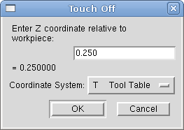
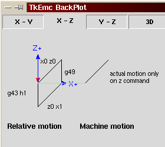
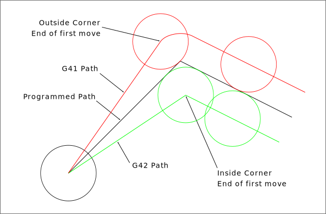
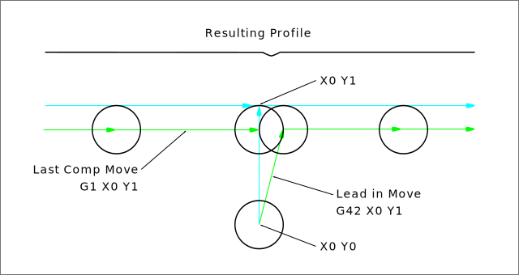
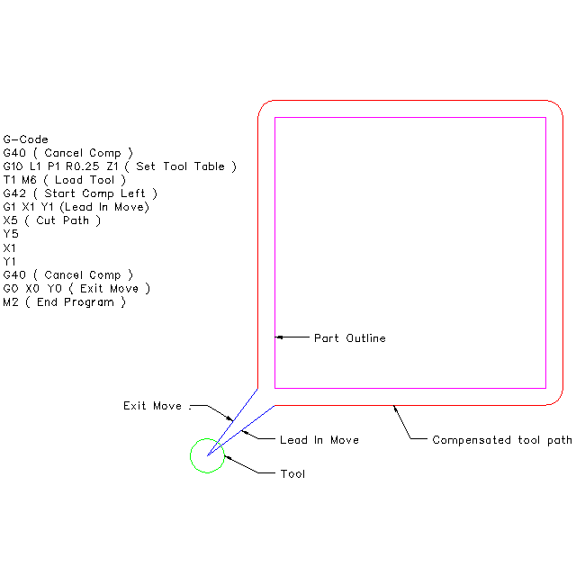
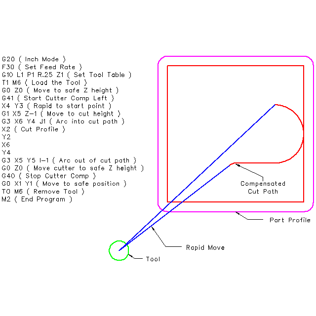

:lang: en
:toc:

[[cha:tool-compensation]]
= Tool Compensation(((Tool Compensation)))

// Custom lang highlight
// must come after the doc title, to work around a bug in asciidoc 8.6.6
:ini: {basebackend@docbook:'':ini}
:hal: {basebackend@docbook:'':hal}
:ngc: {basebackend@docbook:'':ngc}

[[sec:touch-off]]
== Touch Off(((Touch Off)))

Using the Touch Off Screen in the AXIS interface you can update the tool table automatically.

Typical steps for updating the tool table:

* After homing load a tool with 'T__n__ M6' where _n_ is the tool number.
* Move tool to an established point using a gauge or take a test cut and measure.
* Click the 'Touch Off' button in the Manual Control tab (or hit the 'End' button on your keyboard).
* Select 'Tool Table' in the Coordinate System drop down box.
* Enter the gauge or measured dimension and select OK.

The Tool Table will be changed with the correct Z length to make the DRO display the correct Z position and a G43 command will be issued so the new tool Z length will be in effect.
Tool table touch off is only available when a tool is loaded with 'T__n__ M6'.

[[cap:touch-off-tool]]
.Touch Off Tool Table

=== Using G10 L1/L10/L11

The G10 L1/L10/L11 commands can be used to set tool table offsets:

* `G10 L1  P__n__` - Set offset(s) to a value. Current position irrelevant (see <<gcode:g10-l1,G10 L1>> for details).
* `G10 L10 P__n__` - Set offset(s) so current position w/ fixture 1-8 becomes a value (see <<gcode:g10-l10,G10 L10>> for details).
* `G10 L11 P__n__` - Set offset(s) so current position w/ fixture 9 becomes a value (see <<gcode:g10-l11,G10 L11>> for details).

[NOTE]
This is only a brief presentation, refer to the reference guide of the G-code for more detailed explanations.

[[sec:tool-table]]
== Tool Table(((Tool Table)))

The 'Tool Table' is a text file that contains information about each tool.
The file is located in the same directory as your configuration and is called 'tool.tbl' by default.
A file name may be specified with the INI file [EMCIO]TOOL_TABLE setting.
The tools might be in a tool changer or just changed manually.
The file can be edited with a text editor or be updated using G10 L1.
See the <<sec:lathe-tool-table,Lathe Tool Table>> section for an example of the lathe tool table format.
The maximum pocket number is 1000.

The <<cha:tooledit-gui,Tool Editor>> or a text editor can be used to edit the tool table.
If you use a text editor make sure you reload the tool table in the GUI.

[[sub:tool-table-format]]
=== Tool Table Format(((Tool Table Format)))

.Tool Table Format
[width="100%",options="header"]
|===
|T#   |P#  |X  |Y  |Z  |A  |B  |C  |U  |V  |W  |Dia |FA |BA |Ori |Rem
|; 15+^|(no data after opening semicolon)
|T1    |P17 |X0 |Y0 |Z0 |A0 |B0 |C0 |U0 |V0 |W0 |D0  |I0 |J0 |Q0  |;rem
|T2    |P5  |X0 |Y0 |Z0 |A0 |B0 |C0 |U0 |V0 |W0 |D0  |I0 |J0 |Q0  |;rem
|T3    |P12 |X0 |Y0 |Z0 |A0 |B0 |C0 |U0 |V0 |W0 |D0  |I0 |J0 |Q0  |;rem
|===

In general, the tool table line format is:

- T - tool number (tool numbers must be unique)
- P - pocket number, 1-1000 (pocket numbers must be unique, Pocket 0 represents the spindle)
- X..W - tool offset on specified axis - floating-point
- D - tool diameter - floating-point, absolute value
- I - front angle (lathe only) - floating-point
- J - back angle (lathe only) - floating-point
- Q - tool orientation (lathe only) - integer, 0-9
- ; - beginning of comment or remark - text

Tool numbers should be unique.
Lines beginning with a semicolon are ignored.

The units used for the length, diameter, etc., are in machine units.

You will probably want to keep the tool entries in ascending order, especially if you are going to be using a randomizing tool changer.
Although the tool table does allow for tool numbers in any order.

One line may contain as many as 16 entries, but will likely contain much fewer.
The entries for T (tool number) and P (pocket number) are required.
The last entry (a remark or comment, preceded by a semicolon) is optional.
It makes reading easier if the entries are arranged in columns, as shown in the table,
but the only format requirement is that there be at least one space or tab after each of the entries on a line and a newline character at the end of each entry.

The meanings of the entries and the type of data to be put in each are as follows.

Tool Number (required)::
The 'T' column contains the number (unsigned integer) which represents a code number for the tool.
The user may use any code for any tool, as long as the codes are unsigned integers.

Pocket Number (required)::
The 'P' column contains the number (unsigned integer) which represents the pocket number (slot number) of the tool changer slot where the tool can be found.
The entries in this column must all be different.

The pocket numbers will typically start at 1 and go up to the highest available pocket on your tool changer.
But not all tool changers follow this pattern.
Your pocket numbers will be determined by the numbers that your tool changer uses to refer to the pockets.
So all this is to say that the pocket numbers you use will be determined by the numbering scheme used in your tool changer,
and the pocket numbers you use must make sense on your machine.

Data Offset Numbers (optional)::
The 'Data Offset' columns (XYZABCUVW) contain real numbers which represent tool offsets in each axis.
This number will be used if tool length offsets are being used and this tool is selected.
These numbers can be positive, zero, or negative, and are in fact completely optional.
Although you will probably want to make at least one entry here, otherwise there would be little point in making an entry in the tool table to begin with.

In a typical mill, you probably want an entry for Z (tool length offset).
In a typical lathe, you probably want an entry for X (X tool offset) and Z (Z tool offset).
In a typical mill using cutter diameter compensation (cutter comp), you probably also want to add an entry for D (cutter diameter).
In a typical lathe using tool nose diameter compensation (tool comp), you probably also want to add an entry for D (tool nose diameter).

A lathe also requires some additional information to describe the shape and orientation of the tool.
So you probably want to have entries for I (tool front angle) and J (tool back angle).
You probably also want an entry for Q (tool orientation).

See the <<cha:lathe-user-information,Lathe User Information>> chapter for more detail.

The 'Diameter' column contains a real number. This number is used only if cutter compensation is turned on using this tool.
If the programmed path during compensation is the edge of the material being cut, this should be a positive real number representing the measured diameter of the tool.
If the programmed path during compensation is the path of a tool whose diameter is nominal,
this should be a small number (positive or negative, but near zero) representing only the difference between the measured diameter of the tool and the nominal diameter.
If cutter compensation is not used with a tool, it does not matter what number is in this column.

The 'Comment' column may optionally be used to describe the tool. Any type of description is OK.
This column is for the benefit of human readers only. The comment must be preceded by a semicolon.

[NOTE]
Earlier versions of LinuxCNC had two different tool table formats for mills and lathes, but since the 2.4.x release, one tool table format is used for all machines.

[[sub:tool-io]]
=== Tool IO(((Tool IO)))

The non-realtime program specified by *[EMCIO]EMCIO = io* is conventionally
used for tool changer management (and other io functions for enabling
LinuxCNC and the control of coolant hardware).  The HAL pins used for
tool management are prefixed with *iocontrol.0.*.

A G-code *T* command asserts the HAL output pin `iocontrol.0.tool-prepare`.
The HAL input pin, `iocontrol.0.tool-prepared`, must be set by external HAL logic to complete tool preparation leading to a subsequent reset of the tool-prepare pin.

A G-code *M6* command asserts the HAL output pin `iocontrol.0.tool-change`.
The related HAL input pin, `iocontrol.0.tool-prepared`, must be set by external HAL logic to indicate completion of the tool change leading to a subsequent reset of the tool-change pin.

Tooldata is accessed by an ordered index (idx) that depends on the type of toolchanger specified by `[EMCIO]RANDOM_TOOLCHANGER=`__type__.

. For `RANDOM_TOOLCHANGER = 0`, (0 is default and specifies a non-random toolchanger) idx is a number indicating the sequence in which tooldata was loaded.
. For `RANDOM_TOOLCHANGER = 1`, idx is the *current* pocket number for the tool number specified by the G-code select tool command *T__n__*.

The io program provides HAL output pins to facilitate toolchanger management:

. *iocontrol.0.tool-prep-number*
. *iocontrol.0.tool-prep-index*
. *iocontrol.0.tool-prep-pocket*
. *iocontrol.0.tool-from-pocket*

==== IO for non-random toolchanger

. Tool number _n_==0 indicates no tool.
. The pocket number for a tool is set when tooldata is loaded/reloaded from its data source ([EMCIO]TOOL_TABLE or [EMCIO]DB_PROGRAM).
. At G-code *T__n__* (_n_ != 0) command:
.. *iocontrol.0.tool-prep-index*  = _idx_ (index based on tooldata load sequence)
.. *iocontrol.0.tool-prep-number* = _n_
.. *iocontrol.0.tool-prep-pocket* = the pocket number for _n_
. At G-code *T0* (_n_ == 0 remove) command:
.. *iocontrol.0.tool-prep-index*  = 0
.. *iocontrol.0.tool-prep-number* = 0
.. *iocontrol.0.tool-prep-pocket* = 0
. At M-code *M6* (following iocontrol.0.tool-changed pin 0-->1):
.. *iocontrol.0.tool-from-pocket* = pocket number used to retrieve tool

==== IO for random toolchanger

. Tool number _n_==0 is *not special*.
. Pocket number 0 is *special* as it indicates the *spindle*.
. The *current* pocket number for tool _n_ is the tooldata index (_idx_) for tool _n_.
. At G-code command *T__n__*:
.. *iocontrol.0.tool-prep-index*  = tooldata index (idx) for tool _n_
.. *iocontrol.0.tool-prep-number* = _n_
.. *iocontrol.0.tool-prep-pocket* = pocket number for tool _n_
. At M-code *M6* (following iocontrol.0.tool-changed pin 0-->1):
.. *iocontrol.0.tool-from-pocket* = pocket number used to retrieve tool

[NOTE]
At startup, *iocontrol.0.tool-from-pocket* = 0.
An M61Q__n__ (_n_!=0) command does not change the *iocontrol.0.tool-from-pocket*.
An M61Q0 (_n_==0) command sets *iocontrol.0.tool-from-pocket* to 0.

[[sub:tool-changers]]
=== Tool Changers(((Tool Changers)))

LinuxCNC supports three types of tool changers: 'manual', 'random location' and 'non-random or fixed location'.
Information about configuring a LinuxCNC tool changer is in the <<sub:ini:sec:emcio,EMCIO Section>> of the INI chapter.

.Manual Tool Changer
Manual tool changer (you change the tool by hand) is treated like a fixed location tool changer.
Manual toolchanges can be aided by a HAL configuration that employs the non-realtime program *hal_manualtoolchange* and is typically specified in an INI file with INI statements:

[source,{ini}]
----
[HAL]
HALFILE = axis_manualtoolchange.hal
----

.Fixed Location Tool Changers
Fixed location tool changers always return the tools to a fixed position in the tool changer.
This would also include designs like lathe turrets.
When LinuxCNC is configured for a fixed location tool changer the 'P' number is not used internally (but read, preserved and rewritten) by LinuxCNC,
so you can use P for any bookkeeping number you want.

[NOTE]
When using `[EMCIO]RANDOM_TOOLCHANGER = 0` (the default),
the 'P' pocket number is a parameter of the tooldata that is retrieved from the tooldata source (`[EMCIO]TOOL_TABLE` or `[EMCIO]DB_PROGRAM`).
In many applications it is fixed but it may be changed by edits to the `[EMCIO]TOOL_TABLE` or programmatically when the `[EMCIO]DB_PROGRAM` is used.
LinuxCNC pushes updates to the data source (`[EMCIO]TOOL_TABLE` or `[EMCIO]DB_PROGRAM`) for G-codes G10L1, G10L10, G10L11, M61.
LinuxCNC can pull tooldata updates from the data source by UI (user-interface) commands (Python example: `linuxcnc.command().load_tool_table()`) or by the G-code: `G10L0`.

.Random Location Tool Changers
Random location tool changers (`[EMCIO]RANDOM_TOOLCHANGER = 1`) swap the tool in the spindle with the one in the changer.
With this type of tool changer the tool will always be in a different pocket after a tool change.
When a tool is changed LinuxCNC rewrites the pocket number to keep track of where the tools are.
T can be any number but P must be a number that makes sense for the machine.

== Tool Length Compensation(((Tool Length Compensation)))
The tool length compensations are given as positive numbers in the tool table.
A tool compensation is programmed using G43 H_n_, where _n_ is the index number of the desired tool in the tool table.
It is intended that all entries in the tool table are positive.
The value of H is checked, it must be a non-negative integer when read. The interpreter behaves as follows:

1. If G43 H_n_ is programmed, a call to the function `USE_TOOL_LENGTH_OFFSET(`__length__`)` is made (where _length_ is the length difference, read from the tool table, of the indexed tool _n_),
   tool_length_offset is repositioned in the machine settings model and the value of current_z in the model is adjusted.
   Note that _n_ does not have to be the same as the slot number of the tool currently in the spindle.

2. If G49 is programmed, `USE_TOOL_LENGTH_OFFSET(0.0)` is called, tool_length_offset is reset to 0.0 in the machine settings template
   and the current value of current_z in the model is adjusted.
   The effect of the tool length compensation is illustrated in the capture below.
   Note that the tool length is subtracted from Z so that the programmed control point corresponds to the tip of the tool.
   Note also that the effect of the length compensation is immediate when you see the compensation is immediate when the position of Z is seen as a relative coordinate,
   but it has no effect on the actual machine position until a Z movement is programmed.

.Tool length test program. Tool #1 is one inch long.
----
N01 G1 F15 X0 Y0 Z0
N02 G43 H1 Z0 X1
N03 G49 X0 Z0
N04 G0 X2
N05 G1 G43 H1 G4 P10 Z0 X3
N06 G49 X2 Z0
N07 G0 X0
----

With this program, in most cases, the machine will apply the offset in the form of a ramp during the movement in xyz following the word G43.

[[sec:cutter-radius-compensation]]
== Cutter Radius Compensation(((Cutter Radius Compensation)))

Cutter Compensation allows the programmer to program the tool path without knowing the exact tool diameter.
The only caveat is the programmer must program the lead in move to be at least as long as the largest tool radius that might be used.

There are two possible paths the cutter can take since the cutter compensation can be on to the left or right side of a line
when facing the direction of cutter motion from behind the cutter.
To visualize this imagine you were standing on the part walking behind the tool as it progresses across the part.
G41 is your left side of the line and G42 is the right side of the line.

The end point of each move depends on the next move.
If the next move creates an outside corner the move will be to the end point of the compensated cut line.
If the next move creates in an inside corner the move will stop short so to not gouge the part.
The following figure shows how the compensated move will stop at different points depending on the next move.

[[cap:compensation-end-point]]
.Compensation End Point(((Compensation End Point)))

=== Overview

==== Tool Table

Cutter compensation uses the data from the tool table to determine the offset needed.
The data can be set at run time with G10 L1.

==== Programming Entry Moves

Any move that is long enough to perform the compensation will work as the entry move.
The minimum length is the cutter radius. This can be a rapid move above the work piece.
If several rapid moves are issued after a G41/42 only the last one will move the tool to the compensated position.

In the following figure you can see that the entry move is compensated to the right of the line.
This puts the center of the tool to the right of X0 in this case.
If you were to program a profile and the end is at X0 the resulting profile would leave a bump due to the offset of the entry move.

[[cap:entry-move]]
.Entry Move

==== Z Motion

Z axis motion may take place while the contour is being followed in the XY plane.
Portions of the contour may be skipped by retracting the Z axis above the part and by extending the Z-axis at the next start point.

==== Rapid Moves

Rapid moves may be programmed while compensation is turned on.

==== Good Practices

Start a program with G40 to make sure compensation is off.

=== Examples

==== Outside Profile Example

[[cap:outside-profile]]
.Outside Profile

==== Inside Profile Example

[[cap:inside-profile]]
.Inside Profile

// vim: set syntax=asciidoc:
