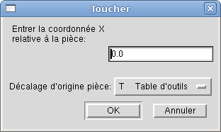
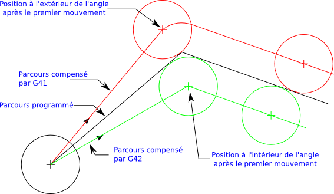
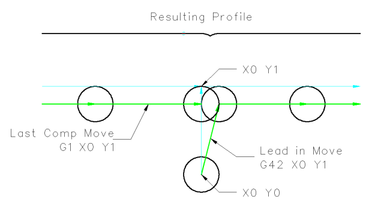
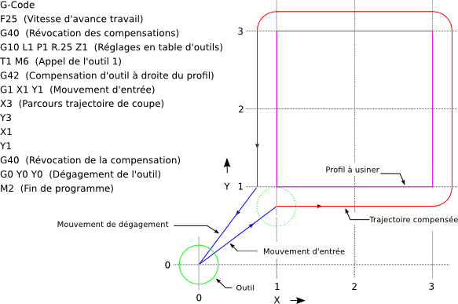
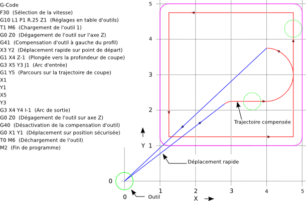

:lang: fr
:toc:

[[cha:compensation-outil]]
= Compensations d'outil(((Compensations d'outil)))

----
N01 G1 F15 X0 Y0 Z0
N02 G43 H1 Z0 X1
N03 G49 X0 Z0
N04 G0 X2
N05 G1 G43 H1 G4 P10 Z0 X3
N06 G49 X2 Z0
N07 G0 X0
----

image:images/length1.png[]

Avec ce programme, dans la plupart des cas, la machine va appliquer le
décalage sous forme d'une rampe pendant le mouvement en xyz suivant le mot G43.

[[sub:palpage]]
== Palpage(((Palpage)))

Dans la boîte de dialogue du bouton 'Toucher' de l'interface AXIS, il
est possible de mettre à jour automatiquement la table d'outils.

Séquence typique pour mise à jour de la table d'outils:

* Après la prise d'origine, charger un outil 'Tn M6' dans lequel 'n' est le numéro de l'outil.
* Déplacer l'outil pour établir le zéro pièce, en utilisant une cale d'épaisseur ou en faisant une petite passe puis une mesure.
* Cliquer sur le bouton 'Toucher' de l'onglet 'Controle manuel' (ou presser la touche 'Fin' du clavier).
* Sélectionner 'Table d'outils' dans la liste déroulante des systèmes de coordonnées.
* Entrer l'épaisseur de la cale ou la cote mesurée è Presser OK.

La table d'outil sera alors modifiée avec la longueur correcte en Z de l'outil.
La visu affichera la position en Z correcte et une commande G43 sera passée pour
que la nouvelle longueur Z de l'outil soit effective. Le choix 'Table d'outils'
n'apparaitra dans la liste déroulante du 'Toucher', que si l'outil à été chargé avec 'Tn M6'.

[[cap:touch-off-tool]]
.Toucher et table d'outils

== Utilisation de G10 L1/L10/L11

Les commandes G10 L1/L10/L11 peuvent être utilisées pour ajuster les compensations dans la table d'outils:

* G10 L1  Pn - (n est le N° d'outil) Fixe les offsets de l'outil. La position courante n'est pas significative. <<sec:G10-L1, Tous les détails ici>>. (((G10 L1)))
* G10 L10 Pn - (n est le N° d'outil) Fixe l'offset à la position courante, met les valeurs dans un système de 1 à 8. <<sec:G10-L10, Tous les détails ici>>.(((G10 L10)))
* G10 L11 Pn - (n est le N° d'outil) Fixe l'offset à la position courante, met les valeurs dans le système 9. <<sec:G10-L11, Tous les détails ici>>. (((G10 L11)))

[NOTE]
Ceci n'est qu'une brève présentation, se reporter au guide de références du
G-code pour des explications plus détaillées

[[sec:table-outils]]
== Table d'outils(((Table d'outils)))

La 'table d'outils' est un fichier texte qui contient les informations de chaque
outil. Ce fichier est placé dans le même répertoire que le fichier de configuration.
Il est nommé 'tool.tbl'. Les outils peuvent être dans un changeur d'outils ou
changés manuellement. Le fichier peut être édité avec un éditeur de texte ou
être mis à jour avec la commande G10 L1. Voir la section spécifique au tour
pour ce qui concerne les outils de tour, avec un exemple de table. Le nombre
d'outils est limité à 1000 dans une table d'outils même si la numérotation des
outils et des poches peut aller jusqu'à 99999.

FIXME The <<cha:tooledit-gui,Tool Editor>> or a text editor can be used to edit the
tool table.  If you use a text editor make sure you reload the tool table in
the GUI.

[[sub:format-table-outils]]
=== Format de la table d'outils(((Format de la table d'outils)))

.Format de la table d'outils
[width="100%",options="header"]
|========================================
|T#    |P#  |X  |Y  |Z  |A  |B  |C  |U  |V  |W  |Dia |FA |BA |Ori |Rem
|; 15+^|(aucune donnée après le point-virgule)
|T1    |P17 |X0 |Y0 |Z0 |A0 |B0 |C0 |U0 |V0 |W0 |D0  |I0 |J0 |Q0  |;rem
|T2    |P5  |X0 |Y0 |Z0 |A0 |B0 |C0 |U0 |V0 |W0 |D0  |I0 |J0 |Q0  |;rem
|T3    |P12 |X0 |Y0 |Z0 |A0 |B0 |C0 |U0 |V0 |W0 |D0  |I0 |J0 |Q0  |;rem
|========================================

En général, le format d'une ligne de table d'outils est le suivant:

 - ;  Un point-virgule comme premier caractère, aucune donnée
 - T  Numéro d'outil, 0-99999 (chaque numéro d'outil doit être unique)
 - P  Numéro de poche, 1-99999 (chaque numéro de poche doit être unique)
 - X..W  Offset d'outil sur les axes spécifiés - nombre à virgule flottante
 - D  diamètre d'outil - nombre à virgule flottante, valeur absolue
 - I  angle frontal (tour seulement) - nombre à virgule flottante
 - J  angle de dos (tour seulement) - nombre à virgule flottante
 - Q  orientation de l'outil (tour seulement) - entier de 0 à 9
 - ;  début de commentaire ou remarque - texte

Le fichier commence par un point-virgule en première ligne,
suivi par les caractéristiques de 1000 outils au maximum.

[NOTE]
Bien que les numéros d'outils puissent aller jusqu'à 99999, le nombre
d'outils dans la table, en ce moment, est limité à un maximum de 1000 outils pour
des raisons techniques. Les développeurs de LinuxCNC envisagent la possibilité de
faire sauter cette limitation. Si vous avez un très gros changeur d'outils, merci d'être patient.

Les versions antérieures de LinuxCNC avaient deux différents formats de table
d'outils un pour les fraiseuses et un pour les tours, mais depuis la
version 2.4.x, un format unique est utilisé pour toutes les machines. Il suffi
d'ignorer les parties de la table d'outils qui ne se rapportent pas la machine actuelle, ou que vous n'avez pas besoin d'utiliser.

Chaque ligne du fichier de la table d'outils après le point-virgule ouvrant,
contient les données pour un seul outil. Une ligne peut contenir jusqu'à
16 entrées, mais peut aussi en contenir beaucoup moins.

Les unités utilisées pour les longueurs, diamètres, etc. sont en unités machine.

Vous voudrez probablement maintenir les entrées d'outils dans l'ordre croissant,
surtout si vous utilisez un changeur d'outils aléatoire. Bien que la table
d'outils permettent des numéros d'outils dans n'importe quel ordre.

Chaque ligne peut avoir jusqu'à 16 valeurs. Les deux premières valeurs sont requises.
La dernière valeur (un point-virgule suivi d'un commentaire) est optionnelle.
La lecture sera rendue plus facile si les valeurs sont disposées en colonnes,
comme indiqué dans le tableau, mais la seule exigence sur le format est qu'il y
ait au moins un espace ou une tabulation après chacune des valeurs sur une
ligne et un saut de ligne à la fin de chaque ligne.

La signification des valeurs et le type de données qu'elles contiennent sont les
suivantes:

Numéro d'outil (requis)::
La colonne 'T' contient un nombre entier non signé, qui représente
le code de l'outil. L'opérateur peut utiliser n'importe quel code pour
n'importe quel outil, tant que les codes sont des entiers non signés.

Numéro de poche (requis)::
La colonne 'P' contient un nombre entier non signé, qui représente
le numéro de poche (numéro de slot) du changeur d'outils, poche dans laquelle
l'outil se trouve. Les entrées de cette colonne doivent être toutes
différentes.

Le numéro de poche commence typiquement à 1 et va au maximum de poches
disponibles sur le changeur d'outils. Mais tous les changeurs d'outils ne
suivent pas ce modèle. Votre numéro de poche sera déterminé, par le numéro
que votre changeur d'outils utilisera pour se référer à ses poches. Tout cela
pour dire que les numéros de poche que vous utiliserez seront déterminés par
le schéma de numérotation de votre changeur d'outils. Les numéros de poche
doivent suivre la même logique que la machine.

Données d'offset des outils (optionnelles)::
Les colonnes de données d'offset (XYZABCUVW) contiennent des nombres réels qui
représentent les offsets d'outil pour chacun des axes. Ce nombre sera utilisé
si, en usinage, les offsets de longueur d'outil sont utilisés et que l'outil
concerné est sélectionné. Ces nombres peuvent être positif, égaux à zéro ou
négatif, ils sont en fait, complètement optionnels. Bien qu'il vaudrait mieux
qu'il y ait au moins une valeur ici, sinon il n'y aurait aucun intérêt à se
servir d'une entrée complétement vide dans la table d'outils.

Sur une fraiseuse classique, on trouvera probablement une entrée en Z
(offset de longueur d'outil). Sur un tour classique, on trouvera certainement
un entrée en X (offset d'outil en X) et une en Z (offset d'outil en Z). Sur 
une fraiseuse classique utilisant la compensation de rayon d'outil, on
trouvera une valeur en D pour l'offset de diamètre. Sur un tour classique
utilisant la compensation de diamètre de bec d'outil, une valeur sera entrée
en D (diamètre de bec).

Un tour demande encore d'autres information additionnelles pour décrire la forme
et l'orientation de l'outil. Ainsi, sans tenir compte des angles ni des faces de
l'outil, qui sont de la compétence du tourneur, on trouvera une valeur en I
(angle avant) et en J (angle de dos) ainsi qu'une valeur en Q (orientation).

Une description complète des outils de tour
<<cha:Tour-Specifiques, ce trouve ici>>.

La colonne 'Diamètre' contient un nombre réel. Ce nombre est utilisé seulement
si la compensation est activée lors de l'usage de cet outil. Si la trajectoire
programmée avec la compensation active, est un des bords de la matière à usiner,
cette valeur doit être un nombre réel positif, représentant le diamètre mesuré
de l'outil. Si la trajectoire programmée, toujours avec la compensation active,
est prévue pour un diamètre nominal d'outil, ce nombre doit être très petit
(négatif ou positif, mais proche de zéro), il représente seulement la différence
entre le diamètre nominal et le diamètre mesuré de l'outil. Si la compensation
n'est pas utilisée avec un outil,
cette valeur est sans importance.

La colonne des commentaires peut optionnellement être utilisée pour décrire
l'outil. Elle commence par un point-virgule, elle peut contenir n'importe quel
texte pour le seul bénéfice de l'opérateur.

[[sub:tool-io]]
=== Tool IO(((Tool IO)))

The userspace program specified by *[EMCIO]EMCIO = io* is conventionally
used for tool changer management (and other io functions for enabling
LinuxCNC and the control of coolant/lube hardware).  The hal pins used for
tool management are prefixed with *iocontrol.0.*

A gcode *TN* command asserts the hal output pin *iocontrol.0.tool-prepare*.
The hal input pin, *iocontrol.0.tool-prepared*, must be set by external
hal logic to complete tool preparation leading to a subsequent reset of
the tool-prepare pin.

A gcode *M6* command asserts the hal output pin *iocontrol.0.tool-change*.
The related hal input pin, *iocontrol.0.tool-prepared*, must be set by
external hal logic to indicate completion of the tool change leading
to a subsequent reset of the tool-change pin.

Tooldata is accessed by an ordered index (idx) that depends on the
type of toolchanger specified by *[EMCIO]RANDOM_TOOLCHANGER=type*.

. For *RANDOM_TOOLCHANGER = 0*, (0 is default and specifies a non-random
  toolchanger) idx is a number indicating the sequence in which tooldata was loaded.
. For *RANDOM_TOOLCHANGER = 1*, idx is the *current* pocket number
  for the toolnumber specified by the gcode select tool command *Tn*.

The io program provides hal output pins to facilitate toolchanger management:

. *iocontrol.0.tool-prep-number*
. *iocontrol.0.tool-prep-index*
. *iocontrol.0.tool-prep-pocket*

==== IO for non-random toolchanger

. Tool number N==0 indicates no tool
. The pocket number for a tool is fixed when tooldata is loaded
. At gcode *TN* (N != 0) command:
.. *iocontrol.0.tool-prep-index*  = idx (index based on tooldata load sequence)
.. *iocontrol.0.tool-prep-number* = N
.. *iocontrol.0.tool-prep-pocket* = the fixed pocketno for N
. At gcode *T0* (N == 0 remove) command:
.. *iocontrol.0.tool-prep-index*  = 0
.. *iocontrol.0.tool-prep-number* = 0
.. *iocontrol.0.tool-prep-pocket* = 0

==== IO for random toolchanger

. Tool number N==0 is *not special*
. Pocket number 0 is *special* as it indicates the *spindle*
. The *current* pocket number for tool N is the tooldata index (idx) for tool N
. At gcode command *TN*:
.. *iocontrol.0.tool-prep-index*  = pocket number for tool N
.. *iocontrol.0.tool-prep-number* = N
.. *iocontrol.0.tool-prep-pocket* = pocket number for tool N

[[sub:tool-changers]]
=== Tool Changers(((Tool Changers)))

LinuxCNC supports three types of tool changers: 'manual', 'random location'
and 'non-random or fixed location'. Information about configuring a LinuxCNC tool changer
is in the <<sub:ini:sec:emcio,EMCIO Section>> of the INI chapter.

.Manual Tool Changer
Manual tool changer (you change the tool by hand) is treated like a
fixed location tool changer.  Manual toolchanges can be aided by
a hal configuration that employs the userspace program
*hal_manualtoolchange* and is typically specified in an ini file
with ini statements:

----
[HAL]
HALFILE = axis_manualtoolchange.hal
----

.Fixed Location Tool Changers
Fixed location tool changers always return the tools to a
fixed position in the tool changer. This would also include
designs like lathe turrets. When LinuxCNC is configured for a fixed
location tool changer the 'P' number is not used internally (but read, preserved
and rewritten) by LinuxCNC, so you can use P for any bookkeeping number you want.

.Random Location Tool Changers
Random location tool changers swap the tool in the spindle with the
one in the changer. With this type of tool changer the tool will
always be in a different pocket after a tool change. When a tool is
changed LinuxCNC rewrites the pocket number to keep track of where the tools
are. T can be any number but P must be a number that makes sense for
the machine.

[[sec:compensation-rayon-outil]]
== Compensation de rayon d'outil(((Compensation de rayon d'outil)))

La compensation de rayon d'outil permet de suivre un parcours sans se
préoccuper du diamètre de l'outil. La seule restriction, c'est que les
'mouvements d'entrée' doivent être au moins aussi long que le rayon de
l'outil utilisé.

Il y a deux parcours que l'outil peut prendre pour usiner un profil
quand la compensation de rayon est activée, un parcours à gauche du profil
et un à droite du profil. Pour les visualiser, il faut s'imaginer être
debout sur la pièce, marchant en suivant l'outil pendant que celui-ci
progresse dans la matière. G41 fait passer l'outil à gauche du profil et
G42 le fait passer à droite du profil.

Le point final de chaque mouvement, dépends du mouvement suivant.
Si le mouvement suivant crée un angle extérieur, le mouvement se terminera
à l'extrémité de la ligne de coupe compensée. Si le mouvement suivant crée
un angle intérieur, l'outil s'arrêtera avant d'interférer avec la matière de
la pièce. La figure suivante montre comment le mouvement se termine à
différents endroits, dépendants du mouvement suivant.

[[cap:point-final-compensation]]
.Point final de la compensation(((Point final de la compensation)))

=== Vue générale

==== Table d'outils

La compensation de rayon d'outil utilise les données de la table d'outils
pour déterminer le décalage nécessaire. Les données peuvent être introduites
à la volée, avec G10 L1.

==== Programmation des mouvements d'entrée

Tout mouvement suffisamment long pour arriver en position compensée, sera un
mouvement d'entrée valide. La longueur minimale équivaut au rayon de l'outil.
Ça peut être un mouvement en vitesse rapide au dessus de la pièce. Si
plusieurs mouvements en vitesse rapide sont prévus après un G41/G42, seul le
dernier placera l'outil en position compensée.

Dans la figure suivante, on voit que le mouvement d'entrée est compensé
à droite du profil. Ce qui aura pour effet, lors du mouvement d'entrée, de
déplacer le centre de l'outil, d'un rayon d'outil à droite de X0. Dans ce cas,
le mouvement d'entrée laissera un petit plot de matière en raison du décalage
de compensation et de l'arrondi de l'outil.

[[cap:mouvement-entree]]
.Mouvement d'entrée

==== Mouvement en Z

Un mouvement en Z est possible pendant que le contour est suivi dans le plan
XY. Des portions du contour peuvent être sautées en rétractant l'axe Z au
dessus du bloc et en amenant Z au dessus du prochain point de départ.

==== Mouvement en vitesse rapide

Des mouvements en vitesse rapide peuvent être programmé avec les compensations d'outil actives.

==== Bonne pratique

Débuter tout programme avec un G40 pour être sûr que la compensation est désactivée.

=== Exemples de profils

==== Exemple de profil extérieur

[[cap:profil-exterieur]]
.Profil extérieur

==== Exemple de profil intérieur

[[cap:profil-interieur]]
.Profil intérieur

// vim: set syntax=asciidoc:
