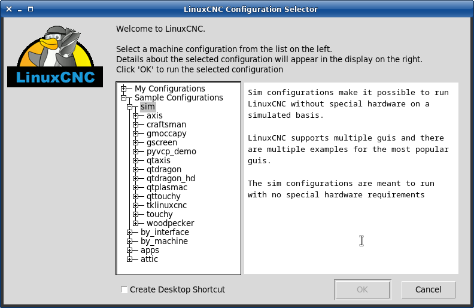

:lang: en
:toc:

[[cha:running-emc]]
= Running LinuxCNC(((Running LinuxCNC)))

== Invoking LinuxCNC

After installation, LinuxCNC starts just like any other Linux program:
run it from the <<faq:terminal,terminal>> by issuing the command 'linuxcnc',
or select it in the 'Applications -> CNC' menu.

[[sec:config-launcher]]
== Configuration Launcher(((Configuration Launcher)))

When starting LinuxCNC (from the CNC menu or from the command line without
specifying an INI file) the Configuration Selector dialog starts.

The Configuration Selector dialog allows the user to pick one of their
existing configurations (My Configurations) or select a new one (from the Sample
Configurations) to be copied to their home directory. Copied configurations
will appear under My Configurations on the next invocation of the Configuration
Selector.

The Configuration Selector offers a selection of configurations organized:

* 'My Configurations' - User configurations located in linuxcnc/configs in your home directory.
* 'Sample Configurations' - Sample configurations, when selected, are copied to linuxcnc/configs.
  Once a sample configuration was copied to your local directory, the launcher will offer it as 'My Configurations'.
  The names under which these local configurations are presented correspond to the names of the directories within the configs/ directory:
** 'sim' - Configurations that include simulated hardware.
   These can be used for testing or learning how LinuxCNC works.
** 'by_interface' - Configurations organized by GUI.
** 'by_machine' - Configurations organized by machine.
** 'apps' - Applications that do not require starting linuxcnc but may be useful for testing or
   trying applications like <<cha:pyvcp,PyVCP>> or <<cha:glade-vcp,GladeVCP>>.
** 'attic' - Obsolete or historical configurations.

The sim configurations are often the most useful starting point for
new users and are organized around supported GUIs:

* 'axis' - Keyboard and Mouse GUI
* 'craftsman' - Touch Screen GUI (no longer maintained ???)
* 'gmoccapy' - Touch Screen GUI
* 'gscreen' - Touch Screen GUI
* 'pyvcp_demo' - Python Virtual Control Panel
* 'qtaxis' - Touch Screen GUI, axis lookalike
* 'qtdragon' - Touch Screen GUI
* 'qtdragon_hd' - Touch Screen GUI, high definition
* 'qtplasmac' - Touch Screen GUI, for plasma tables
* 'qttouchy' - Touch Screen GUI
* 'tklinuxcnc' - Keyboard and Mouse GUI (no longer maintained)
* 'touchy' - Touch Screen GUI
* 'woodpecker' - Touch Screen GUI
A GUI configuration directory may contain subdirectories with
configurations that illustrate special situations or the embedding
of other applications.

The 'by_interface' configurations are organized around common, supported
interfaces like:

* general mechatronics
* mesa
* parport
* pico
* pluto
* servotogo
* vigilant
* vitalsystems

Related hardware may be required to use these configurations as
starting points for a system.

The 'by_machine' configurations are organized around complete, known
systems like:

* boss
* cooltool
* scortbot erIII
* sherline
* smithy
* tormach

A complete system may be required to use these configurations.

The 'apps items' are typically either:

. utilities that don't require starting linuxcnc
. demonstrations of applications that can be used with linuxcnc

* info - creates a file with system information that may be useful for problem diagnosis.
* gladevcp - Example GladeVCP applications.
* halrun  - Starts halrun in an <<faq:terminal,terminal>>.
* latency - Applications to investigate latency
** latency-histogram-1 - histogram for single servo thread
** latency-histogram - histogram
** latency-test - standard test
** latency-plot - stripchart
* parport - Applications to test parport.
* pyvcp - Example pyvcp applications.
* xhc-hb04 - Applications to test an xhc-hb04 USB wireless MPG

[NOTE]
Under the Apps directory, only applications that are usefully modified
by the user are offered for copying to the user's directory.

[[cap:LinuxCNC-Configuration-Selector]]
.LinuxCNC Configuration Selector

Click any of the listed configurations to display specific information about it.
Double-click a configuration or click OK to start the configuration.

Select 'Create Desktop Shortcut' and then click 'OK' to add an icon on the Ubuntu desktop
to directly launch this configuration without showing the Configuration Selector screen.

When you select a configuration from the Sample Configurations section,
it will automatically place a copy of that config in the
~/linuxcnc/configs directory.

== Next steps in configuration

After finding the sample configuration that uses
the same interface hardware as your machine (or a simulator
configuration), and saving a copy to your home directory,
you can customize it according to the details of your machine.
Refer to the Integrator Manual for topics on configuration.

== Simulator Configurations

All configurations listed under Sample Configurations/sim
are intended to run on any computer.  No specific hardware is
required and real-time support is not needed.

These configurations are useful for studying individual
capabilities or options.  The sim configurations are organized
according to the graphical user interface used in the
demonstration.  The directory for axis contains the most
choices and subdirectories because it is the most tested GUI.
The capabilities demonstrated with any specific GUI may be
available in other GUIs as well.

== Configuration Resources

The Configuration Selector copies all files needed
for a configuration to a new subdirectory of ~/linuxcnc/configs
(equivalently: /home/username/linuxcnc/configs).  Each
created directory will include at least one INI file (iniflename.ini)
that is used to describe a specific configuration.

File resources within the copied directory will typically
include one or more INI file (filename.ini) for related
configurations and a tool table file (toolfilename.tbl).
Additionally, resources may include HAL files (filename.hal,
filename.tcl), a README file for describing the directory, and
configuration specific information in a text file named after
a specific configuration (inifilename.txt).  That latter two
files are displayed when using the Configuration Selector.

The supplied sample configurations may specify the parameter HALFILE
(filename.hal) in the configuration INI file that are not present in the
copied directory because they are found in the system
HAL file library.  These files can be copied to the user
configuration directory and altered as required by the
user for modification or test.  Since the user configuration
directory is searched first when finding HAL files, local
modifications will then prevail.

The Configuration selector makes a symbolic link in the
user configuration directory (named hallib) that points to
the system HAL file library.  This link simplifies copying
a library file.  For example, to copy the library core_sim.hal
file in order to make local modifications:

----
cd ~/linuxcnc/configs/name_of_configuration
cp hallib/core_sim.hal core_sim.hal
----

// vim: set syntax=asciidoc:
