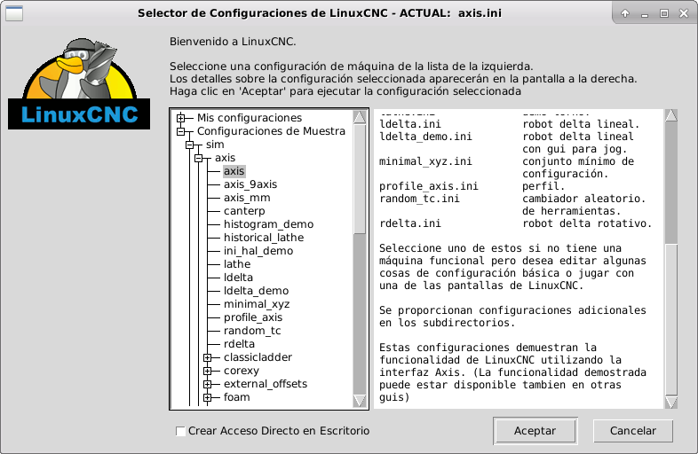

:lang: es
:toc:

[[cha:running-emc]]

= Ejecutando LinuxCNC

== Invocando LinuxCNC

Después de la instalación, LinuxCNC comienza como cualquier otro programa de Linux:
ejecutelo desde una <<faq:terminal,terminal>> mediante el comando 'linuxcnc',
o selecciónelo en el menú Aplicaciones > CNC.

[[sec:config-launcher]](((Selector de configuración)))

== Selector de Configuración

Al iniciar LinuxCNC desde el menú CNC o desde la línea de comandos, sin
especificar un archivo ini, se inicia el cuadro de diálogo Selector de Configuración.

El diálogo selector de configuración permite al usuario elegir una de las
configuraciones existentes (Mis Configuraciones) o seleccionar una nueva (Configuraciones
de ejemplo) para copiarla a su directorio de inicio. Las configuraciones copiadas
aparecerá en Mis configuraciones en la próxima invocación del Selector de Configuración.

El selector de configuración ofrece una selección de configuraciones organizada asi:

* 'Mis configuraciones' - Configuraciones de usuario ubicadas en ~/linuxcnc/configs

* 'Configuraciones de ejemplo' - Estas configuraciones, cuando se seleccionan, se copian en
    ~/linuxcnc/configs. Una vez que copie una configuración, si usa el
    selector, selecciónela desde 'Mis configuraciones'. 
    Los nombres corresponden a los directorios bajo ../configs/

** 'sim' - Configuraciones que incluyen hardware simulado. Pueden ser usadas
   para probar o aprender cómo funciona LinuxCNC.

** 'by_interface' - Configuraciones organizadas por tipo de GUI.

** 'by_machine' - Configuraciones organizadas por tipo de máquina.

** 'apps' - aplicaciones que no requieren iniciar linuxcnc pero pueden ser
   útiles para pruebas o aplicaciones como <<cha:pyvcp,PyVCP o
   <<cha:glade-vcp,GladeVCP.>>

** 'attic' - Configuraciones obsoletas o históricas.

Las configuraciones en sim suelen ser el punto de partida más útil para
usuarios nuevos y están organizadas en torno a las siguientes guis soportadas:

* 'axis' - Gui de teclado y mouse
* 'gmoccapy' - Gui de Pantalla táctil
* 'gscreen' - Gui de Pantalla táctil
* 'pyvcp_demo' - Paneles de Control Virtuales Python
* 'qtvcp_screens' - Guis diseñadas con Qt5 y Python 
* 'tklinuxcnc' - Gui de teclado y mouse (ya no se mantiene)
* 'touchy' - Gui de Pantalla táctil

Un directorio de configuración de GUI puede contener subdirectorios con
configuraciones que ilustran situaciones especiales o incrustación
de otras aplicaciones.

Las configuraciones 'by_interface' están organizadas en torno a interfaces hardware comunes
compatibles como:

* general mechatronics
* mesa
* parport
* pico
* pluto
* servotogo
* vigilant
* vitalsystems

Estas configuraciones pueden requerir el uso de hardware relacionado como
puntos de partida para un sistema.

Las configuraciones 'by_machine' están organizadas alrededor de sistemas completos
conocidos como:

* boss
* cooltool
* plasmac
* scortbot erIII
* sherline
* smithy
* tormach

Es posible que se requiera un sistema completo para usar estas configuraciones.

Los elementos de 'aplicaciones' son típicamente utilidades que no requieren iniciar linuxcnc o demostraciones
de aplicaciones que pueden usarse con linuxcnc:

* info: crea un archivo con información del sistema que puede ser útil para
  diagnóstico de problemas
* gladevcp - Ejemplo de aplicaciones de gladevcp.
* halrun - Inicia halrun en un <<faq:terminal,terminal>>.
* latency: aplicaciones para investigar la latencia
** latency-test: prueba estándar
** latency-plot - grafico de barras
** latency-histogram - histograma
* parport - Aplicaciones para probar el puerto paralelo.
* pyvcp - Ejemplo de aplicaciones pyvcp.
* xhc-hb04 - Aplicaciones para probar un MPG inalámbrico USB xhc-hb04

[NOTE]
En el directorio de aplicaciones, solo se ofrecen para copiar en el directorio de usuario
las aplicaciones que se pueden modificar de forma útil por el usuario.

.Selector de Configuración de LinuxCNC[[cap:LinuxCNC-Configuration-Selector]]

Haga clic en cualquiera de las configuraciones enumeradas
para mostrar información específica al respecto.
Haga doble clic en una configuración o haga clic en Aceptar
para comenzar la configuración.

Para agregar un icono en el escritorio que iniciara directamente una configuración
sin mostrar la pantalla del Selector, seleccione 'Crear Acceso Directo en Escritorio' 
y luego haga clic en 'Aceptar'.

Cuando seleccione una configuración de la sección Configuraciones de Muestra,
automáticamente se colocará una copia de esa configuración en el
directorio ~/linuxcnc/configs.

== Próximos pasos en la configuración

Después de encontrar la configuración de muestra que use
el mismo interfaz de hardware que su máquina (o un simulador)
y guardar una copia en su directorio de inicio,
puede personalizarlo según los detalles de su máquina.
Consulte el Manual del integrador para temas sobre la configuración.

== Configuraciones del simulador

Todas las configuraciones enumeradas en Configuraciones de Muestra/sim
están destinadas a ejecutarse en cualquier ordenador. No se requiere
soporte de hardware específico y no es necesario tiempo real.

Estas configuraciones son útiles para estudiar
capacidades u opciones individuales. Las configuraciones en sim están organizadas
de acuerdo con la interfaz gráfica de usuario utilizada en la
demostración. El directorio para Axis contiene la mayor cantidad
de opciones y subdirectorios porque es la GUI más probada.
Las capacidades demostradas con cualquier GUI específica pueden estar
disponibles en otras GUIs también.

== Recursos de configuración

El selector de configuración copia todos los archivos necesarios para
una configuración a un nuevo subdirectorio de ~/linuxcnc/configs.
Cada directorio creado incluirá al menos un archivo ini (nombre_fichero.ini)
que se usa para describir una configuración específica.

Los archivos de recursos dentro del directorio copiado
incluyen típicamente uno o más archivos ini (nombre_fichero.ini) para
configuraciones relacionadas y un archivo de tabla de herramientas (nombre_archivo_herramientas.tbl).
Además, los recursos pueden incluir archivos hal (nombre_fichero.hal,
nombre_fichero.tcl), un archivo README para describir el directorio, e
información específica de configuración en un archivo de texto con nombre de
una configuración específica (inifilename.txt). Estos dos últimos
archivos se muestran cuando se utiliza el selector de configuración.

Las configuraciones de ejemplo suministradas pueden especificar archivos HAL
en el archivo de configuración ini que no están presentes en el
directorio copiado porque se encuentran en la 
biblioteca de sistema Hallib. Estos archivos se pueden copiar al
directorio de configuración de usuario y ser alterados, según se requiera, por el
usuario para modificaciones o pruebas. Puesto que el directorio de configuración
del usuario es el primero donde se buscan archivos HAL, las modificaciones locales
serán prevalentes.

El selector de configuración crea un enlace simbólico en el
directorio de configuración de usuario (llamado hallib) que apunta a
la biblioteca de sistema Halfile. Este enlace simplifica el copiado de
un archivo de biblioteca. Por ejemplo, para copiar el archivo de biblioteca
core_sim.hal para hacer modificaciones locales:

====
  cd ~/linuxcnc/configs/nombre_de_configuracion
  cp hallib/core_sim.hal core_sim.hal
====

// vim: set syntax = asciidoc:
