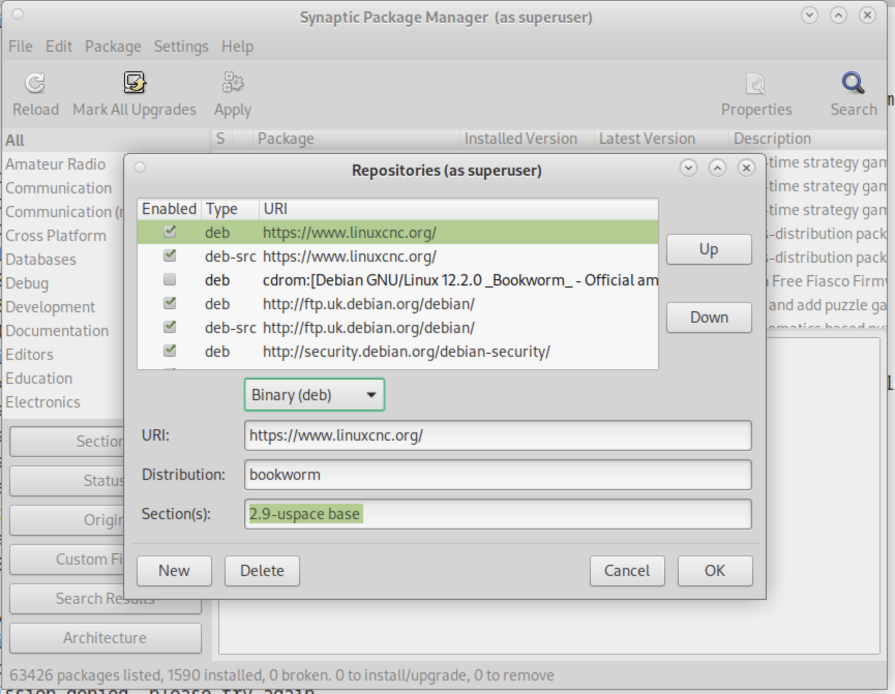

:lang: en
:toc:

[[cha:updating-linuxcnc]]
= Updating LinuxCNC(((Updating LinuxCNC)))

// Custom lang highlight
// must come after the doc title, to work around a bug in asciidoc 8.6.6
:ini: {basebackend@docbook:'':ini}
:hal: {basebackend@docbook:'':hal}
:ngc: {basebackend@docbook:'':ngc}

Updating LinuxCNC to a new minor release (i.e. to a new version in
the same stable series, for example from 2.9.1 to 2.9.2) is an
automatic process if your PC is connected to the internet. You will
see an update prompt after a minor release along with other software
updates. If you don't have an internet connection to your PC see
<<getting-started:update-no-network,Updating without Network>>.

== Upgrade to the new version

This section describes how to upgrade LinuxCNC from version 2.8.x to a 2.9.y version.
It assumes that you have an existing 2.8 install that you want to update.

To upgrade LinuxCNC from a version older than 2.8, you have to first
https://linuxcnc.org/docs/2.8/html/getting-started/updating-linuxcnc.html[upgrade your old install to 2.8],
then follow these instructions to upgrade to the new version.

If you do not have an old version of LinuxCNC to upgrade, then you're
best off making a fresh install of the new version as described in the
section <<cha:getting-linuxcnc,Getting LinuxCNC>>.

Furthermore, if you are running Ubuntu Precise or Debian Wheezy it is
well worth considering making a backup of the "linuxcnc" directory on
removable media and performing a
<<cha:getting-linuxcnc,clean install of a newer OS and LinuxCNC version>>
as these releases were EOL in 2017 and 2018 respectively.
If you are running on Ubuntu Lucid then you will have to do this, as
Lucid is no longer supported by LinuxCNC (it was EOL in 2013).

To upgrade major versions like 2.8 to 2.9 when you have a network connection at
the machine you need to disable the old linuxcnc.org apt sources in the file /etc/apt/sources.list
and add a new linuxcnc.org apt source for 2.9, then upgrade LinuxCNC.

The details will depend on which platform you're running on.
Open a <<faq:terminal,terminal>> then type `lsb_release -ic` to find this information out:

----
lsb_release -ic
Distributor ID: Debian
Codename:       Buster
----

You should be running on Debian Buster, Bullseye or Bookworm or Ubuntu 20.04 "Focal Fossa" or newer.
LinuxCNC 2.9.y will not run on older distributions than these. 

You will also need to check which realtime kernel is being used:

----
uname -r
6.1.0-10-rt-amd64
----

If you see (as above) `-rt-` in the kernel name then you are running the
preempt-rt kernel and should install the "uspace" version of LinuxCNC.
You should also install uspace for "sim" configs on non-realtime kernels

If you see `-rtai-` in the kernel name then you are running RTAI
realtime. See below for the LinuxCNC version to install. RTAI packages
are available for Bookworm and Buster but not currently for Bullseye.

[[_setting_apt_sources]]
=== Apt Sources Configuration

* Open the `Software Sources` window.
  The process for doing this differs slightly on the three supported platforms:
** Debian:
*** Click on `Applications Menu`, then `System`, then `Synaptic Package Manager`.
*** In Synaptic, click on the `Settings` menu, then click `Repositories` to open the `Software Sources` window.
** Ubuntu Precise:
*** Click on the `Dash Home` icon in the top left.
*** In the `Search` field, type "software", then click on the `Ubuntu Software Center` icon.
*** In the Ubuntu Software Center window, click on the `Edit` menu,
    then click on `Software Sources...` to open the `Software Sources` window.
** Ubuntu Lucid:
*** Click the `System` menu, then `Administration`, then `Synaptic Package Manager`.
*** In Synaptic, click on the `Settings` menu, then click on `Repositories` to open the `Software Sources` window.
* In the `Software Sources` window, select the `Other Software` tab.
* Delete or un-check all the old linuxcnc.org entries (leave all non-linuxcnc.org lines as they are).
* Click the `Add` button and add a new apt line. The line will be slightly different on the different platforms:

.Tabular overview on variants of the Operating System and the corresponding configuration of the repository. The configuration can be performed in the GUI of the package manager or in the file /etc/apt/sources.list.
[cols="3,5",options="header"]
|===
| OS / Realtime Version      | Repository
| Debian Buster - preempt   m| deb https://linuxcnc.org buster base 2.9-uspace
| Debian Buster - RTAI      m| deb https://linuxcnc.org buster base 2.9-rt
| Debian Bullseye - preempt m| deb https://linuxcnc.org bullseye base 2.9-uspace
| Debian Bookworm - preempt m| deb https://linuxcnc.org bookworm base 2.9-uspace
| Debian Bookworm - RTAI    m| deb https://linuxcnc.org bookworm base 2.9-rt
|===

.Figure with a screenshot of the repository configuration of the synaptic package manager.

* Click `Add Source`, then `Close` in the Software Sources window.
  If it pops up a window informing you that the information about
  available software is out-of-date, click the `Reload` button.

=== Upgrading to the new version

Now your computer knows where to get the new version of the software,
next we need to install it.

The process again differs depending on your platform.

==== Debian Buster, Bullseye and Bookworm

Debian uses the Synaptic Package Manager.

* Open Synaptic using the instructions in <<_setting_apt_sources,Setting apt sources>> above.
* Click the `Reload` button.
* Use the Search function to search for `linuxcnc`.
* The package is called "linuxcnc" for RTAI kernels and "linuxcnc-uspace" for preempt-rt.
* Click the check box to mark the new linuxcnc and linuxcnc-doc-* packages for upgrade.
  The package manager may select a number of additional packages to be installed,
  to satisfy dependencies that the new linuxcnc package has.
* Click the `Apply` button, and let your computer install the new package.
  The old linuxcnc package will be automatically upgraded to the new one.

=== Ubuntu

* Click on the `Dash Home` icon in the top left.
* In the `Search` field, type "update", then click on the `Update Manager` icon.
* Click the `Check` button to fetch the list of packages available.
* Click the `Install Updates` button to install the new versions of all packages.

[[getting-started:update-no-network]]
== Updating without Network

To update without a network connection you need to download the .deb then install
it with dpkg. The .debs can be found in https://linuxcnc.org/dists/ .

You have to drill down from the above link to find the correct deb for your
installation. Open a <<faq:terminal,terminal>> and type in 'lsb_release -ic'
to find the release name of your OS.

----
> lsb_release -ic
Distributor ID: Debian
Codename:       bullseye
----

Pick the OS from the list then pick the major version you want like
2.9-rt for RTAI or 2.9-rtpreempt or 2.9-uspace for preempt-rt.

Next pick the type of computer you have: binary-amd64 for any 64-bit x86,
binary-i386 for 32 bit, binary-armhf (32bit) or binary-arm64 (64bit) for Raspberry Pi.

Next pick the version you want from the bottom of the list like
'linuxcnc-uspace_2.9.2_amd64.deb' (choose the latest by date).
Download the deb and copy it to your home directory. You can rename the
file to something a bit shorter with the file manager like
'linuxcnc_2.9.2.deb' then open a terminal and install it with the
package manager with this command:

----
sudo dpkg -i linuxcnc_2.9.2.deb
----

== Updating Configuration Files for 2.9

=== Stricter handling of pluggable interpreters

If you just run regular G-code and you don't know what a pluggable
interpreter is, then this section does not affect you.

A seldom-used feature of LinuxCNC is support for pluggable interpreters,
controlled by the undocumented `[TASK]INTERPRETER` INI setting.

Versions of LinuxCNC before 2.9.0 used to handle an incorrect
`[TASK]INTERPRETER` setting by automatically falling back to using the
default G-code interpreter.

Since 2.9.0, an incorrect `[TASK]INTERPRETER` value will cause
LinuxCNC to refuse to start up.  Fix this condition by deleting the
`[TASK]INTERPRETER` setting from your INI file, so that LinuxCNC will
use the default G-code interpreter.

=== Canterp

If you just run regular G-code and you don't use the `canterp` pluggable
interpreter, then this section does not affect you.

In the extremely unlikely event that you are using `canterp`,
know that the module has moved from `/usr/lib/libcanterp.so` to
`/usr/lib/linuxcnc/canterp.so`, and the `[TASK]INTERPRETER` setting
correspondingly needs to change from `libcanterp.so` to `canterp.so`.

== Updating Configuration Files (for 2.9.y)

No changes should be necessary to configuration files when moving from 2.8.x to 2.9.y.

=== Spindle limits in the INI

It is now possible to add settings to the [SPINDLE] section of the INI file

MAX_FORWARD_VELOCITY = 20000 The maximum spindle speed (in rpm)

MIN_FORWARD_VELOCITY = 3000 The minimum spindle speed (in rpm)

MAX_REVERSE_VELOCITY = 20000 This setting will default to
MAX_FORWARD_VELOCITY if omitted.

MIN_REVERSE_VELOCITY = 3000` This setting is equivalent to
MIN_FORWARD_VELOCITY but for reverse spindle rotation. It will default
to the MIN_FORWARD_VELOCITY if omitted.

INCREMENT = 200 Sets the step size for spindle speed increment /
decrement commands. This can have a different value for each spindle.
This setting is effective with AXIS and Touchy but note that some
control screens may handle things differently.

HOME_SEARCH_VELOCITY = 100 - Accepted but currently does nothing

HOME_SEQUENCE = 0 - Accepted but currently does nothing

== New HAL components

=== Non-Realtime
mdro
mqtt-publisher
pi500_vfd
pmx485-test
qtplasmac-cfg2prefs
qtplasmac-materials
qtplasmac-plasmac2qt
qtplasmac-setup
sim-torch
svd-ps_vfd

=== Realtime
anglejog
div2
enum
filter_kalman
flipflop
hal_parport
homecomp
limit_axis
mesa_uart
millturn
scaled_s32_sums
tof
ton

== New Drivers

A framework for controlling ModBus devices using the serial ports on
many Mesa cards has been introduced.
http://linuxcnc.org/docs/2.9/html/drivers/mesa_modbus.html

A new GPIO driver for any GPIO which is supported by the gpiod library
is now included:
http://linuxcnc.org/docs/2.9/html/drivers/hal_gpio.html

