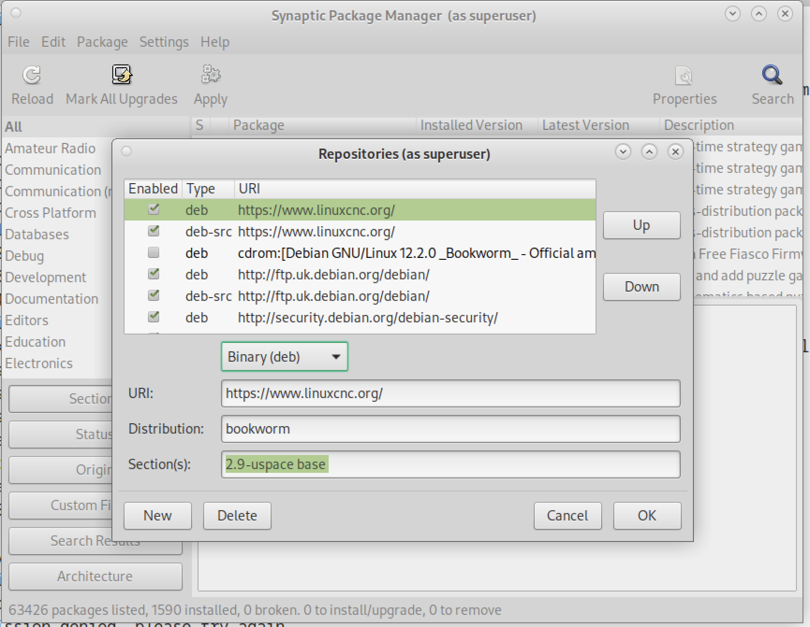

:lang: en
:toc:

[[cha:updating-linuxcnc]]
= Updating LinuxCNC

Updating LinuxCNC to a new minor release (ie to a new version in
the same stable series, for example from 2.9.7 to 2.9.8) is an
automatic process if your PC is connected to the internet. You will
see an update prompt after a minor release along with other software
updates. If you don't have an internet connection to your PC see
<<getting-started:update-no-network,Updating without Network>>.

== Upgrade to the new version

This section describes how to upgrade LinuxCNC from version 2.8.x to a 2.9.y version.
It assumes that you have an existing 2.8 install that you want to update.

To upgrade LinuxCNC from a version older than 2.8, you have to first
https://linuxcnc.org/docs/2.8/html/getting-started/updating-linuxcnc.html[upgrade your old install to 2.8],
then follow these instructions to upgrade to the new version.

If you do not have an old version of LinuxCNC to upgrade, then you're
best off making a fresh install of the new version as described in the
section <<cha:getting-linuxcnc,Getting LinuxCNC>>.

Furthermore, if you are running Ubuntu Precise, Debian Wheezy or Debian Buster it is
well worth considering making a backup of the "linuxcnc" directory on
removable media and performing a
<<cha:getting-linuxcnc,clean install of a newer OS and LinuxCNC version>>
as these releases were EOL in 2017, 2018 and 2022 respectively.
If you are running on Ubuntu Lucid then you will have to do this, as
Lucid is no longer supported by LinuxCNC (it was EOL in 2013).

To upgrade major versions like 2.8 to 2.9 when you have a network connection at
the machine you need to disable the old linuxcnc.org apt sources in the file /etc/apt/sources.list
and add a new linuxcnc.org apt source for 2.9, then upgrade LinuxCNC.

The details will depend on which platform you're running on.
Open a <<faq:terminal,terminal>> then type `lsb_release -ic` to find this information out:

----
lsb_release -ic
Distributor ID: Debian
Codename:       Trixie
----

You should be running on Debian Bullseye, Bookworm or Trixie or Ubuntu 20.04 "Focal Fossa" or newer.
LinuxCNC 2.9.y will not run on older distributions than these. 

You will also need to check which realtime kernel is being used:

----
uname -r
6.1.0-10-rt-amd64
----

If you see (as above) `-rt-` in the kernel name then you are running the
preempt-rt kernel and should install the "uspace" version of LinuxCNC.
You should also install uspace for "sim" configs on non-realtime kernels.

If you see `-rtai-` in the kernel name then you are running RTAI realtime.
See below for the LinuxCNC version to install.
RTAI packages are available for Bookworm and Buster but not currently for Bullseye.

[[_setting_apt_sources]]
=== Apt Sources Configuration

* Open the `Software Sources` window.
  The process for doing this differs slightly on the three supported platforms:
** Debian:
*** Click on `Applications Menu`, then `System`, then `Synaptic Package Manager`.
*** In Synaptic, click on the `Settings` menu, then click `Repositories` to open the `Software Sources` window.
** Ubuntu Precise:
*** Click on the `Dash Home` icon in the top left.
*** In the `Search` field, type "software", then click on the `Ubuntu Software Center` icon.
*** In the Ubuntu Software Center window, click on the `Edit` menu,
    then click on `Software Sources...` to open the `Software Sources` window.
** Ubuntu Lucid:
*** Click the `System` menu, then `Administration`, then `Synaptic Package Manager`.
*** In Synaptic, click on the `Settings` menu, then click on `Repositories` to open the `Software Sources` window.
* In the `Software Sources` window, select the `Other Software` tab.
* Delete or un-check all the old linuxcnc.org entries (leave all non-linuxcnc.org lines as they are).
* Click the `Add` button and add a new apt line. The line will be slightly different on the different platforms:

.Tabular overview on variants of the Operating System and the corresponding configuration of the repository. The configuration can be performed in the GUI of the package manager or in the file /etc/apt/sources.list.
[cols="3,5",options="header"]
|===
| OS / Realtime Version      | Repository
| Debian Bullseye - preempt m| deb https://linuxcnc.org bullseye base 2.9-uspace
| Debian Bookworm - preempt m| deb https://linuxcnc.org bookworm base 2.9-uspace
| Debian Bookworm - RTAI    m| deb https://linuxcnc.org bookworm base 2.9-rt
| Debian Trixie - preempt   m| deb https://linuxcnc.org trixie base 2.9-uspace
| Debian Trixie - RTAI      m| deb https://linuxcnc.org trixie base 2.9-rt
|===

.Figure with a screenshot of the repository configuration of the synaptic package manager.

* Click `Add Source`, then `Close` in the Software Sources window.
  If it pops up a window informing you that the information about
  available software is out-of-date, click the `Reload` button.

=== Upgrading to the new version

Now your computer knows where to get the new version of the software,
next we need to install it.

The process again differs depending on your platform.

==== Debian Bullseye, Bookworm and Trixie

Debian uses the Synaptic Package Manager.

* Open Synaptic using the instructions in <<_setting_apt_sources,Setting apt sources>> above.
* Click the `Reload` button.
* Use the Search function to search for `linuxcnc`.
* The package is called "linuxcnc" for RTAI kernels and "linuxcnc-uspace" for preempt-rt.
* Click the check box to mark the new linuxcnc and linuxcnc-doc-* packages for upgrade.
  The package manager may select a number of additional packages to be installed,
  to satisfy dependencies that the new linuxcnc package has.
* Click the `Apply` button, and let your computer install the new package.
  The old linuxcnc package will be automatically upgraded to the new one.

=== Ubuntu

* Click on the `Dash Home` icon in the top left.
* In the `Search` field, type "update", then click on the `Update Manager` icon.
* Click the `Check` button to fetch the list of packages available.
* Click the `Install Updates` button to install the new versions of all packages.

[[getting-started:update-no-network]]
== Updating without Network

To update without a network connection you need to download the .deb then install it with dpkg.
The .debs can be found in https://linuxcnc.org/dists/ .

You have to drill down from the above link to find the correct deb for your installation.
Open a <<faq:terminal,terminal>> and type in 'lsb_release -ic' to find the release name of your OS.

----
> lsb_release -ic
Distributor ID: Debian
Codename:       trixie
----

Pick the OS from the list then pick the major version you want like
2.9-rt for RTAI or 2.9-uspace for preempt-rt.

Next pick the type of computer you have: binary-amd64 for 64-bit PC or
binary-arm64 (64bit) for Raspberry Pi.

Next pick the version you want from the bottom of the list like
'linuxcnc-uspace_2.9.8_amd64.deb' (choose the latest by date).
Download the deb and copy it to your home directory. You can rename the
file to something a bit shorter with the file manager like
'linuxcnc_2.9.8.deb' then open a terminal and install it with the
package manager with this command:

----
sudo dpkg -i linuxcnc_2.9.8.deb
----

== Updating Configuration Files for 2.9

=== Stricter handling of pluggable interpreters

If you just run regular G-code and you don't know what a pluggable
interpreter is, then this section does not affect you.

A seldom-used feature of LinuxCNC is support for pluggable interpreters,
controlled by the undocumented `[TASK]INTERPRETER` INI setting.

Versions of LinuxCNC before 2.9.0 used to handle an incorrect
`[TASK]INTERPRETER` setting by automatically falling back to using the
default G-code interpreter.

Since 2.9.0, an incorrect `[TASK]INTERPRETER` value will cause
LinuxCNC to refuse to start up.  Fix this condition by deleting the
`[TASK]INTERPRETER` setting from your INI file, so that LinuxCNC will
use the default G-code interpreter.

=== Canterp

If you just run regular G-code and you don't use the `canterp` pluggable
interpreter, then this section does not affect you.

In the extremely unlikely event that you are using `canterp`,
know that the module has moved from `/usr/lib/libcanterp.so` to
`/usr/lib/linuxcnc/canterp.so`, and the `[TASK]INTERPRETER` setting
correspondingly needs to change from `libcanterp.so` to `canterp.so`.

=== Spindle limits in the INI

It is now possible to add settings to the [SPINDLE] section of the INI file

MAX_FORWARD_VELOCITY = 20000 The maximum spindle speed (in rpm)

MIN_FORWARD_VELOCITY = 3000 The minimum spindle speed (in rpm)

MAX_REVERSE_VELOCITY = 20000 This setting will default to
MAX_FORWARD_VELOCITY if omitted.

MIN_REVERSE_VELOCITY = 3000` This setting is equivalent to
MIN_FORWARD_VELOCITY but for reverse spindle rotation. It will default
to the MIN_FORWARD_VELOCITY if omitted.

INCREMENT = 200 Sets the step size for spindle speed increment /
decrement commands. This can have a different value for each spindle.
This setting is effective with AXIS and Touchy but note that some
control screens may handle things differently.

HOME_SEARCH_VELOCITY = 100 - Accepted but currently does nothing

HOME_SEQUENCE = 0 - Accepted but currently does nothing

== Updating Configuration Files for 2.10.y

Touchy: the Touchy MACRO entries should now be placed in a [MACROS]
section of the INI rather than in the [TOUCHY] section. This is part of
a process of commonising the INI setting between GUIs.

== Preview renderer now requires OpenGL 3.3 core

The G-code preview shared by AXIS, the GTK screens (Gremlin / gmoccapy /
gscreen / GladeVCP `hal_gremlin` / QtPlasmaC), and QtVCP was rewritten to use
a single modern OpenGL 3.3 *core-profile* renderer (shaders, VBOs, an offscreen
framebuffer for click selection, a glyph-atlas for overlay text). The legacy
fixed-function path (display lists, immediate mode, `GL_SELECT` picking,
`glBitmap` text, line stipple, `GL_LIGHTING`) has been removed. There is no
runtime switch and no in-process fallback.

*Hardware requirement.* OpenGL 3.3 core is needed. On the supported platform
(Linux with Mesa) this is available on Intel Sandy Bridge (2011) and newer, AMD
r600 and newer, and nouveau. Machines without a capable GPU can use Mesa's
software renderer (llvmpipe), which handles the line-dominated preview
acceptably:

----
LIBGL_ALWAYS_SOFTWARE=1 linuxcnc myconfig.ini
----

If a core context cannot be created the GUI exits at start-up with a diagnostic
naming the OpenGL 3.3 requirement and suggesting `LIBGL_ALWAYS_SOFTWARE=1`,
rather than starting with a blank or corrupt preview.

[WARNING]
.BREAKING: out-of-tree screens that inject raw legacy OpenGL
====
Custom screens that subclass the in-tree preview classes and *override a
drawing internal to emit raw fixed-function OpenGL* (immediate mode, display
lists, `glBitmap`, etc.) will fail against a core context. Compatibility is
preserved only at the *calling surface*: the public methods and attributes of
`rs274.glcanon.GlCanonDraw` / `glnav.GlNavBase` used by the in-tree GUIs keep
their names, signatures, and behaviour (`realize`, `redraw`,
`redraw_perspective`, `redraw_ortho`, `select`, `set_highlight_line`,
`set_canon`, `posstrs`, the `stale_dlist(...)` cache-invalidation entry points,
and the `get_*`/`is_*` callback contract). Move any custom drawing onto those
supported entry points, or draw with your own modern-OpenGL code.
====

The immediate-mode drawing helpers used by the old renderer remain available for
compatibility (`linuxcnc.draw_lines`, `linuxcnc.line9`, `linuxcnc.draw_dwells`,
`linuxcnc.positionlogger.call()`); they are unused by the in-tree GUIs, which
bake geometry to VBOs and upload the backplot from `positionlogger.points()`,
but still work for out-of-tree tools under a legacy/compatibility context.

=== Notes for integrators and driver authors

* *AXIS / Togl.* The vendored Togl widget (`src/emc/usr_intf/axis/extensions/togl.c`)
  gained a boolean `-coreprofile` option (default *false*). When true it creates
  the context with `glXChooseFBConfig` + `glXGetVisualFromFBConfig` +
  `glXCreateContextAttribsARB` (OpenGL 3.3 core), raising a descriptive Tcl error
  on failure. AXIS always enables it. The default (false) path is unchanged, so
  `vismach` and any out-of-tree Togl users keep their legacy contexts.

* *Gremlin (GTK).* GTK3 only hands out core contexts through `GtkGLArea`, so the
  gremlin widget still builds its context by hand via GLX, now requesting 3.3
  core with `glXCreateContextAttribsARB`. PyOpenGL cannot resolve that extension
  entry point (it comes back as a null function), so gremlin loads `libGL`
  directly with `ctypes` and creates *and binds* the context (choose-fbconfig /
  make-current / swap) through that one handle to avoid mixing context pointers.

* *Line width in core profiles.* A forward-compatible core context (Qt requests
  one) rejects `glLineWidth(> 1)` with `GL_INVALID_VALUE` even though
  `GL_ALIASED_LINE_WIDTH_RANGE` reports a larger maximum. The renderer probes
  the accepted width once and caches it, so thick lines (the selection
  highlight, dwell markers) degrade to 1 px on such drivers instead of raising;
  a non-forward-compatible core context (AXIS's Togl, Gremlin's GLX) keeps the
  wider lines. Thick lines via quad expansion are a possible future improvement.

* *vismach* is unaffected: it keeps its legacy Togl context and immediate-mode
  drawing; only its camera consumes the (now GL-free) explicit matrices from
  `glnav`.

=== How the preview is put together

The drawing itself lives in `lib/python/rs274/glcanon_scene.py`, in four tiers.
Nothing here changes what the preview looks like; it is where to start reading
if you need to fix or extend one part of it.

* *Parts.* One class per drawing concern - grid, program geometry, extents,
  bounding box, offsets, small origin, axes, machine-limits box, tool, live
  backplot, DRO overlay, the `user_plot()` hook. A part draws that one thing
  and nothing else. Adding a preview element means adding a part and placing it
  in the scene's order, not editing an existing part.

* *The scene.* `PreviewScene` holds the parts in draw order and runs them.
  *Visibility is decided by the scene, not the part*: it evaluates each part's
  `visible(ctx)` and simply does not call a part whose gate is false, so
  `draw()` may assume it is visible and must not open with an
  `if not shown: return`. Gates that couple parts belong to the scene too - the
  extents-versus-bounding-box either/or, and the translucent compositing
  `program_alpha` wraps the program in.

* *Primitives.* Services several parts share - a line array, a wireframe box,
  Hershey vector text, the tool-cone mesh - reached as `ctx.prim`. Letters are a
  primitive that axes, extents and offsets all use, not a sibling of "axes".

* *Passes.* The preview is three sets of depth/blend state, not an arbitrary
  order: world geometry, translucent geometry drawn over it at equal depth, and
  the screen-space overlay. Each part declares its `pass_`; the scene sets the
  state when the pass changes. A part that needs something else for its own
  drawing (the tool's constant-alpha blend) restores it afterwards.

Transforms go through a scoped model-view stack: `with ctx.mv.push():` restores
the previous transform on exit, including when an exception unwinds through it,
so a part cannot leak a transform onto a later one. Offsets, small origin and
axes share one such scope (`RelativeCoordGroup`), because the axes are drawn in
the offset frame the offsets progressively build.

Parts read a `FrameContext` - an explicit, enumerated list of machine, view and
renderer state, built once per frame by `GlCanonDraw` - rather than the widget
itself. That is what lets them be tested without a window: build a context by
hand, call `part.draw(ctx)`, and assert on the vertices it emitted. See
`tests/glcanon-scene/`.

Click-to-select is not a part - it draws nothing to the screen. `Picker` renders
the *same* program geometry into an offscreen framebuffer with line numbers
encoded as colour and resolves the nearest hit; `GlCanonDraw.select(x, y)`
delegates to it. It shares one `ProgramGeometry` with the drawing part, so the
pickable geometry and the drawn geometry cannot drift apart.

Setting `GLCANON_SCENE_DEBUG=1` logs which parts the scene drew and which it
skipped whenever that split changes, and reports depth/blend state a part left
behind.

== New HAL components

=== Non-Realtime
mdro
mqtt-publisher
pi500_vfd
pmx485-test
qtplasmac-cfg2prefs
qtplasmac-materials
qtplasmac-plasmac2qt
qtplasmac-setup
sim-torch
svd-ps_vfd

=== Realtime
anglejog
div2
enum
filter_kalman
flipflop
homecomp
limit_axis
mesa_uart
millturn
scaled_s32_sums
tof
ton

== New Drivers

A framework for controlling ModBus devices using the serial ports on
many Mesa cards has been introduced.
http://linuxcnc.org/docs/2.9/html/drivers/mesa_modbus.html

A new GPIO driver for any GPIO which is supported by the gpiod library
is now included:
http://linuxcnc.org/docs/2.9/html/drivers/hal_gpio.html

