:lang: es

[[cha:axis-gui]]

= GUI AXIS

== Introducción

AXIS es una interfaz gráfica para LinuxCNC que cuenta con vista previa y backplot. Está escrito en Python y utiliza
Tk y OpenGL para mostrar la interfaz de usuario.

.Ventana de AXIS

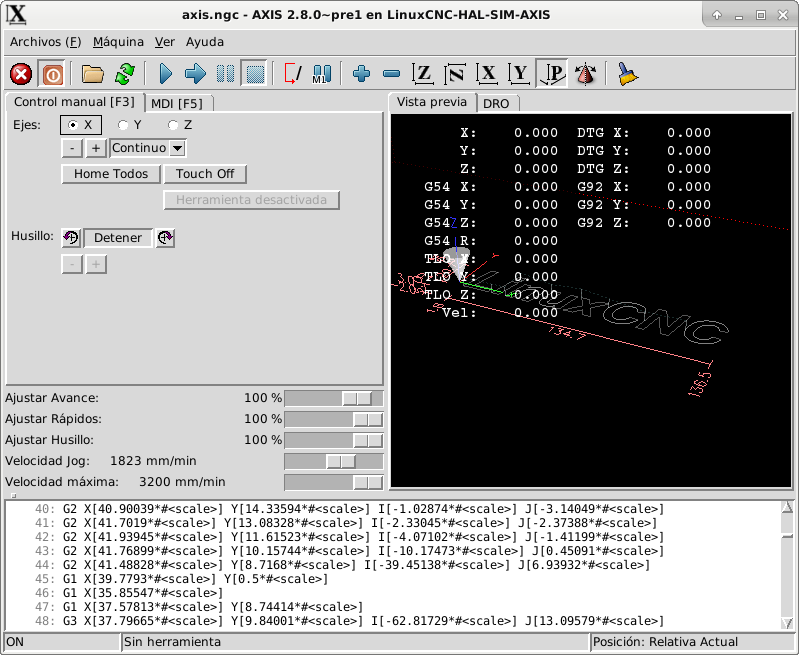

== Primeros pasos

Si su configuración no está configurada actualmente para usar AXIS,
puede cambiarlo editando el archivo .ini. En la
sección '[DISPLAY]' indiquelo con la linea 'DISPLAY = axis'.

La configuracion de ejemplo 'sim/axis.ini' ya está configurada para usar AXIS como su interfaz de usuario.

=== Una sesión típica

 . Inicie LinuxCNC.
 . Reinicie E-STOP (F1) y encienda la alimentación de la máquina (F2).
 . Haga Homing de todos los ejes.
 . Cargue el archivo g-code.
 . Utilice el gráfico de vista previa para verificar que el programa es correcto.
 . Cargue el material.
 . Establezca el offset adecuado para cada eje haciendo jogging y usando la tecla Touch Off según sea necesario.
 . Ejecute el programa.

[NOTE]
Ejecutar el mismo programa de nuevo dependera de su configuración y requisitos.
Es posible que deba cargar más material y establecer offsets o desplazarse y
establecer un nuevo offset y luego ejecutar el programa de nuevo. Si la ubicacion del material es
siempre la misma, entonces es posible que solo tenga que volver a ejecutar el programa. Ver la seccion 
<<sub:axis-machine-menu,Menu Maquina>> para obtener más información sobre el comando de ejecución.

== Pantalla AXIS

La ventana de AXIS contiene los siguientes elementos:

* Un área de visualización que muestra uno de los siguientes elementos:
 ** una vista previa del archivo cargado (en este caso,
   'axis.ngc'), así como la ubicación actual del
   'punto controlado' de la máquina. Más adelante, esta área mostrará el camino
   por el que la máquina se ha movido, llamado 'backplot'
 ** una lector grande que muestra la posición actual y todos los offsets.
* Una barra de menús y una barra de herramientas que le permiten realizar varias acciones
* Una pestaña de 'control manual (F3)' - que te permite
 mover la máquina, encender o apagar el husillo y el refrigerante,
 si se incluye en el archivo ini.
* Una pestaña 'MDI' - donde los programas con código G se pueden ingresar manualmente,
 una línea a la vez. También muestra los 'Códigos G activos' que son
 los códigos G modales en vigor.
* 'Feed Override' - que le permite escalar la velocidad de los movimientos programados.
 El máximo predeterminado es 120% y se puede configurar a un valor diferente
 en el archivo ini. Consulte la <<sec:display-section, Sección de visualización>> del
 archivo INI para más información.
* 'Spindle Override' - que le permite
 escalar la velocidad del husillo hacia arriba o hacia abajo.
* 'Jog Speed' - que te permite configurar la velocidad de jog
 dentro de los límites establecidos en el archivo ini. Ver la
 <<sec:display-section,Sección de visualización>> del archivo INI para obtener más información.
* 'Velocidad máxima' - que le permite restringir la velocidad máxima de todos
 los movimientos programados (excepto movimiento sincronizados del husillo).
* Una zona de visualización de texto que muestra el G-Code cargado.
* Una barra de estado que muestra el estado de la máquina. En la pantalla
 mostrada, la máquina está encendida, no tiene una herramienta insertada y la
 la posición mostrada es 'Relativa' (mostrando todos los offsets) y 'Actual'
 (mostrando la posición retroalimentada).

=== Elementos del menú

Algunos elementos del menú pueden estar en gris dependiendo de cómo tenga su
archivo .ini configurado. Para más información sobre configuración vea el
<<cha:ini-configuration,Capítulo INI.

.Menú Archivo

* 'Abrir ...'- abre un cuadro de diálogo estándar para abrir un archivo de código g para cargar en AXIS. Si
    ha configurado LinuxCNC para usar un programa de filtro, también puede abrirlo.
    Consulte la <<sec:filter-section,sección FILTRO>> de la configuración INI
    para más información.

* 'Archivos recientes'- muestra una lista de los archivos abiertos recientemente.

* 'Editar ...'- abre el archivo de código G actual para editarlo si tienes un editor
    configurado en su archivo ini. Consulte la sección <<sec:display-section,sección DISPLAY>>
    para obtener más información sobre la especificación del editor a usar.

* 'Recargar'- vuelve a cargar el archivo de código g actual. Si lo edita, debe recargarlo
    para que los cambios se actualizen. Si detiene un archivo y quiere empezar
    desde el principio, vuelva a cargar el archivo. La recarga de la barra de herramientas es la misma
    qu la del menu.

* 'Guardar gcode como ...' - Guarda el archivo actual con un nuevo nombre.

* 'Propiedades'- la suma de los movimientos rápidos y de avance. No tiene en cuenta
    modos de aceleración, fusion o ruta para que el tiempo reportado nunca
    sea menor que el tiempo de ejecución real.

* 'Editar tabla de herramientas ...' - Igual que Editar si ha definido un editor.
   Puede abrir la tabla de herramientas y editarla.

* 'Recargar tabla de herramientas': después de editar la tabla de herramientas, debe volve a cargarla.

* 'Editor Ladder' - Si has cargado Classic Ladder puedes editarlo desde
   aquí. Vea el capítulo <<cha:classicladder,Classicladder
   para más información.

* 'Salir' - Termina la sesión actual de LinuxCNC.

[[sub:axis-machine-menu]]

.Menú de Máquina

* 'Toggle Emergency Stop F1'- cambia el estado de la parada de emergencia.

* 'Toggle Machine Power F2' - Cambiar el estado de encendido de la máquina si
   la parada de emergencia no está encendida.

* 'Ejecutar programa'- Ejecuta el programa actualmente cargado desde el principio.

* 'Ejecutar desde la línea seleccionada' - seleccione la línea desde la que desea comenzar.
   Use con precaución ya que esto moverá la herramienta a la posición esperada en
   la línea y luego se ejecutará el resto del código.

[WARNING]
No use 'Ejecutar desde la línea seleccionada' si su programa de código g contiene subrutinas.

* 'Step' - Un solo paso a través de un programa.

* 'Pausa' - Pausa un programa.

* 'Resume' - reanudar la ejecución de una pausa.

* 'Stop' - Detiene un programa en ejecución. Cuando se selecciona ejecutar después de una parada, el programa
           comenzará desde el principio.

* 'Stop en M1' - Si se alcanza un M1, y esto esta activo, la ejecución del programa
    parará en la línea M1. Presione Resume para continuar.

* 'Saltar líneas con "/"' - Si una línea comienza con '/' y esto está activo,
   la línea se saltará.

* 'Borrar historial de MDI': borra la ventana del historial de MDI.

* 'Copiar desde el historial de MDI': copia el historial MDI al portapapeles

* 'Pegar al historial de MDI' - Pegar desde el portapapeles a la ventana del historial MDI

* 'Calibración': inicia el asistente de calibración (emccalib.tcl).
   La calibración lee el archivo HAL y para cada 'setp' que usa una variable
   del archivo ini que se encuentra en las secciones [AXIS_L], [JOINT_N] o [TUNE],
   crea una entrada que puede ser editada y probada.

* 'Mostrar configuración HAL'- abre la ventana de configuración HAL donde puede
   monitorear componentes HAL, pines, parámetros, señales, funciones y subprocesos.

* 'HAL Meter'- abre una ventana donde puede monitorear un solo Pin HAL, señal o
    Parámetro.

* 'HAL Scope'- abre un osciloscopio virtual que permite seguir valores HAL en función del tiempo.

* 'Mostrar estado de LinuxCNC'- abre una ventana que muestra el estado de LinuxCNC.

* 'Establecer nivel de depuración'- abre una ventana donde se pueden ver los niveles de depuración y se pueden configurar algunos.

* 'Homing' - home uno o todos los ejes.

* 'Unhoming' - Deshacer home de uno o todos los ejes.

* 'Sistema de coordenadas cero'- establece todos los offsets a cero en el sistema de coordenadas elegido.

[[axis:tool-touch-off]] (((Axis, Tool Touch Off)))

* 'Tool touch off to workpiece' - Al realizar Touch Off, el valor
ingresado es relativo al sistema de coordenadas de la pieza actual ('G5x'),
modificado por el offset del eje ('G92'). Cuando se completa el Touch Off,
la coordenada relativa para el eje elegido se convertirá en el valor ingresado.
Consulte <<gcode:g10-l10,G10 L10 en el capítulo de código G.

* 'Tool touch off to fixture' - Al realizar Touch Off, el valor ingresado
es relativo al noveno ('G59.3') sistema de coordenadas, con el offset del eje
('G92') ignorado. Esto es útil cuando hay un accesorio para Tool touch off en una
ubicación fija en la máquina, con el noveno ('G59.3') sistema de coordenadas establecido
de tal manera que la punta de una herramienta de longitud cero esté en el origen del montaje cuando
las coordenadas relativas son 0. Consulte <<gcode:g10-l11,G10 L11 en el capítulo de códigos G.

.Menú Ver 

* 'Vista superior' - la vista superior (o vista Z) muestra la previsualizacion del código G mirando en direccion
  del eje Z de positivo a negativo. Esta vista es la mejor para mirar el plano XY.

* 'Vista superior girada' - la vista superior girada (o vista Z girada) también se muestra
  el código G mirando a lo largo del eje Z de positivo a negativo. Pero a veces
  es conveniente mostrar los ejes X e Y girados 90 grados para ajustarse al
  mostrar mejor Este punto de vista es también mejor para mirar X y Y.

* 'Vista lateral' - la vista lateral (o vista X) muestra el código G mirando hacia adelante
  El eje X de positivo a negativo. Esta vista es mejor para mirar a Y & Z.

* 'Vista frontal' - la vista frontal (o vista en Y) muestra el código G mirando hacia adelante
  El eje Y de negativo a positivo. Esta vista es mejor para mirar X y Z.

* 'Vista en perspectiva' - la vista en perspectiva (o vista P) muestra el código G
  mirando la pieza desde un punto de vista ajustable, por defecto a X+, Y-,
  Z+. La posición es ajustable usando el mouse y el selector de arrastrar/rotar.
  Esta vista es una vista de compromiso, y si bien hace un buen trabajo al tratar de
  mostrar tres (¡hasta nueve!) ejes en una pantalla bidimensional, a menudo habrá
  alguna característica que es difícil de ver o que requiere un cambio en el punto de vista. Esta vista
  es la mejor cuando le gustaría ver los tres (a nueve) ejes a la vez.

.Punto de vista
****
El menú de selección de pantalla AXIS 'Ver' se refiere a las vistas 'Superior', 'Delantera' y 'Lateral'.
Estos términos son correctos si la máquina CNC tiene su eje Z vertical, con
Z positivo hacia arriba. Esto es cierto para las fresadoras verticales, que es probablemente la
aplicación más popular, y también es cierto para casi todas las máquinas EDM, e incluso
tornos verticales de torreta, donde la pieza gira debajo de la herramienta.

Los términos 'Superior', 'Delantera' y 'Lateral' pueden ser confusos, sin embargo, en otras
máquinas CNC, como un torno estándar, donde el eje Z es horizontal, o
una fresa horizontal (de nuevo donde el eje Z es horizontal) o incluso un
torno vertical de torreta invertido, donde la pieza gira sobre la herramienta y la 
dirección positiva del eje Z es hacia abajo!

Solo recuerde que el eje Z positivo está (casi) siempre 'alejandose' de la pieza.
Familiarícese con el diseño de su máquina e interprete la pantalla según sea necesario.
****

* 'Mostrar pulgadas' - establece la escala de la pantalla AXIS en pulgadas.

* 'Mostrar MM': establece la escala de la pantalla AXIS en milímetros.

* 'Mostrar programa' - la vista previa del programa de código G cargado puede ser completamente
    desactivada si lo desea.

* 'Mostrar Rapidos' - la vista previa del programa de código G cargado siempre mostrará el
    avance (G1, G2, G3) en color blanco. Pero la vision de movimientos rápidos (G0)
    ,en cian, se puede desactivar si se desea.

* 'Fusion alfa' - esta opción hace que la vista previa de programas complejos sea más fácil de ver, pero
    puede hacer que la vista previa se muestre más lentamente.

* 'Mostrar Plot en vivo' - El resaltado de las rutas de avance (G1, G2, G3) a medida que la herramienta se mueve
    se puede desactivar si se desea.

* 'Mostrar herramienta' - la visualización del cono/cilindro de la herramienta se puede desactivar si se desea.

* 'Mostrar extensiones' - la visualización de las extensiones (recorrido máximo en cada dirección del eje)
    del programa de código G cargado se puede desactivar si se desea.

* 'Mostrar Offsets' - Se puede mostrar la ubicación de origen del offset del montaje seleccionado (G54-G59.3)
    como un conjunto de tres líneas ortogonales, roja, azul y verde.
    Esta visualización de origen de offset (o punto cero) se puede desactivar si se desea.

* 'Mostrar límites de máquina' - los límites máximos de desplazamiento de la máquina para cada eje, según lo establecido en
    el archivo ini, se muestran como una caja rectangular dibujada en líneas discontinuas rojas. Esto
    es útil cuando se carga un nuevo programa de código G, o cuando se comprueba si
    se necesitaría mucho offset del montaje para llevar el programa de código G dentro de
    los límites de recorrido de su máquina. Puede apagarse si no es necesario.

* 'Mostrar Velocidad' - Una visualización de la velocidad a veces es útil para ver qué tan cerca está funcionando
    su máquina de la velocidad de diseño. Puede ser desactivado si se desea.

* 'Mostrar distancia a recorrer' - Distancia a recorrer es un elemento muy útil que conocer cuando se ejecuta un
    programa de código G desconocido por primera vez. En combinación con los 
    controles de anulación de velocidad rápida y  de avance, se puede evitar el daño a herramientas
    y/o a la máquina. Una vez que el programa de código G
    se ha depurado y se está ejecutando sin problemas, la pantalla Distancia a ir
    se puede desactivar si se desea.

* 'Limpiar Plot en vivo' - a medida que la herramienta se desplaza en la pantalla Axis, se resalta la ruta del código G.
    Para repetir el programa, o para ver mejor un área de interés,
    las rutas previamente resaltadas se pueden borrar.

* 'Mostrar posición ordenada': esta es la posición a la que intentará ir LinuxCNC. Una vez que el movimiento
    se ha detenido, esta es la posición que intentará mantener LinuxCNC.

* 'Mostrar posición actual': la posición real es la posición medida, leída desde los
    codificadores o desde el sistema simulado por los generadores de pasos. Esto puede diferir
    ligeramente de la posición ordenada por muchas razones, incluyendo afinacion del PID,
    restricciones físicas, o cuantización de la posición.

* 'Mostrar posición de la máquina': esta es la posición en coordenadas sin compensación, según lo establecido por Homing.
    
* 'Mostrar posición relativa': esta es la posición de la máquina modificada por las compensaciones 'G5x', 'G92' y 'G43'.
.Menú de ayuda

* 'Acerca de Axis' - Todos sabemos lo que es esto.
    
* 'Referencia rápida': muestra las teclas de método abreviado del teclado.

=== Botones de la barra de herramientas

De izquierda a derecha en la pantalla de Axis, los botones de la barra de herramientas (atajos de teclado mostrados [entre corchetes]) son:

*  Stop de Emergencia [F1] (también llamado E-Stop)

*  Encendido de Maquina [F2]

*  Abrir archivo de código G [O]

*  Recargar archivo actual [Ctrl-R]

*  Comenzar a ejecutar el archivo actual [R]

*  Ejecutar línea siguiente [T]

*  Pausar ejecución [P] Reanudar ejecución [S]

*  Detener la ejecución del programa [ESC]

* 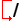 Saltar lineas con "/" [Alt-M- /]

*  Pausa Opcional [Alt-M-1]

* image:images/tool_zoomin.png[alt="Zoom +"] Zoom (mas)

*  Zoom (menos)

* 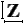 Vista superior

* 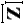 Vista superior girada

* 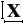 Vista lateral

* 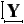 Vista frontal

*  Vista en perspectiva

* 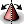 Alternar entre los modos de arrastrar/rotar [D]

*  Limpiar backplot en vivo [Ctrl-K]

=== Área de visualización gráfica

.Visualizacion de coordenadas

En la esquina superior izquierda de la pantalla del programa está la visualizacion de las coordenadas
de posicion para cada eje. A la derecha del número, un símbolo de origen
image:images/axis-homed.png[alt="el símbolo de origen se muestra si el eje ha sido localizado"] que se muestra si el eje ha sido dotado de home.

Una símbolo de límite  se muestra en el lado derecho del
número de coordenada de posición, si el eje está en uno de sus interruptores de límite.

Para interpretar correctamente los números de coordenadas de posición, consulte el indicador 'Posición:'
en la barra de estado. Si la posición es 'Máquina actual', entonces
el número mostrado está en el sistema de coordenadas de la máquina. Si se muestra
'Relative Actual', entonces el número mostrado está en la coordenada del sistema con desplazamiento.
Cuando las coordenadas mostradas son relativas y se ha establecido un desplazamiento,
la pantalla incluirá un marcador <<sec.machine-coordinate-system,'origen de máquina'>> 
image:images/axis-machineorigin.png[alt="Origen maquina cian"] cian.

Si la posición es 'Comandada', entonces la coordenada exacta dada en un comando de código G
es la mostrada. Si es 'Actual', entonces es la posición real a la que la máquina
se ha movido. Estos valores pueden ser diferentes de la posición ordenada
debido al error de seguimiento, banda muerta, resolución del codificador o tamaño de paso.
Por ejemplo, si ordena un movimiento a X 0.0033 en su fresadora, pero el paso de
su motor paso a paso o su resolucion de encoder es 0.00125, 
la posición 'Comandada' podría ser 0.0033, pero la posición 'Actual' será 0.0025 (2 pasos)
o 0.00375 (3 pasos).

.Plot de Vista Previa

Cuando se carga un archivo,se muestra una vista previa en el área de visualización.
Los movimientos rápidos (como los producidos por el comando 'G0') se muestran como
lineas cian. Los movimientos a velocidad de avance (como los producidos por el comando 'G1')
se muestran como líneas blancas sólidas. Dwells (como los producidos por el comando 'G4')
se muestran como pequeñas marcas 'X' rosadas.

Movimientos G0 (rápido), antes de un movimiento de alimentación
no se mostrará en el plot de vista previa.
Los movimientos rápidos después de una T<n> (Cambio de herramienta) no se mostrarán en la
vista previa hasta después del primer movimiento de alimentación.
Para desactivar cualquiera de estas funciones, programe un G1 sin ningún movimiento antes de los movimientos G0.

.Dimensiones (fisicas necesarias) del programa

Se muestran las 'dimensiones' resultantes del programa en cada eje.
En los extremos, se indican los valores de coordenadas mínimo y máximo.
En el medio, se muestra la diferencia entre las coordenadas, o dimension.

Cuando algunas coordenadas exceden los 'límites soft' del archivo .ini,
la dimensión 'culpable' se muestra en un color diferente y está encerrada en un cuadro.
En la figura de abajo se sobrepasa el límite soft máximo en
el eje X, que se indica en el cuadro que rodea el valor de la coordenada.
El mínimo recorrido X del programa es -1.95, el recorrido máximo de X es 1.88,
y el programa requiere 3,83 pulgadas de recorrido X.
Para que el movimiento programado esté dentro del recorrido de la máquina en este caso,
haga jog a la izquierda y vuelva a hacer Touch Off X.

image::images/axis-outofrange.png[align="center",alt="Se muestran las extensiones del programa en el eje x"]

.Herramienta Cono

Cuando no se ha cargado ninguna herramienta, la ubicación de la punta de la herramienta esta
indicada por un 'cono de herramienta'.
La 'herramienta cono' no proporciona orientación sobre la forma, longitud, o radio de una herramienta real.

Cuando se carga una herramienta (por ejemplo, con el comando MDI 'T1 M6'),
el cono cambia a un cilindro que muestra el diámetro de la herramienta, dado en el archivo de tabla de herramientas.

.Backplot

Cuando la máquina se mueve, deja un rastro en pantalla llamado backplot.
El color de la línea indica el tipo de movimiento:
Amarillo para jogs, verde claro para movimientos rápidos,
rojo para movimientos rectos a velocidad de avance
y magenta para movimientos circulares a velocidad de avance.

.Cuadrícula

Axis puede, opcionalmente, mostrar una cuadrícula en las vistas ortogonales. Habilite
o deshabilite la cuadrícula usando 'Cuadrícula' en el menu 'Ver'. Cuando esta
habilitada, la cuadrícula se muestra en las vistas superior y superior girada. Cuando
el sistema de coordenadas no esta girado, la cuadrícula se muestra también en las vistas frontal y
lateral. Los preajustes en el menú 'Grid' están controlados
por el elemento  del archivo ini `[DISPLAY]GRIDS`. Si no se especifica, el valor predeterminado es
`10mm 20mm 50mm 100mm 1in 2in 5in 10in`.

Especificar una cuadrícula muy pequeña puede disminuir el rendimiento.

.Interaccion

Al hacer clic izquierdo en una parte del plot de vista previa,la línea será resaltada
tanto en las pantallas gráficas como en las de texto.
Al hacer clic izquierdo en un área vacía, se eliminará el resaltado.

Al arrastrar con el botón izquierdo del ratón presionado,
la trama de vista previa se desplazará (panorámico).

Al arrastrar con Mayús y el botón izquierdo del ratón presionado,
o arrastrando con la rueda del ratón presionada,
La trama de vista previa se rotará.
Cuando una línea está resaltada,
el centro de rotación es el centro de la línea.
De lo contrario, el centro de rotación es
el centro de todo el plot.

Al girar la rueda del ratón,
o arrastrando con el botón derecho del ratón presionado,
o arrastrando con Control y presionando el botón izquierdo del ratón,
el plot de vista previa se acercará o alejará.

Al hacer clic en uno de los iconos de 'Vista predefinida',
o presionando 'V', se pueden seleccionar varias vistas preestablecidas.

=== Área de visualización de texto

Al hacer clic izquierdo en una línea del programa, la línea se resaltará,
tanto en las pantallas gráficas como en las de texto.

Cuando el programa se está ejecutando, la línea que se está ejecutando actualmente es
resaltada en rojo. Si el usuario no ha seleccionado ninguna línea,
la pantalla de texto se desplazará automáticamente para mostrar la línea actual.

Líneas actuales y seleccionadas

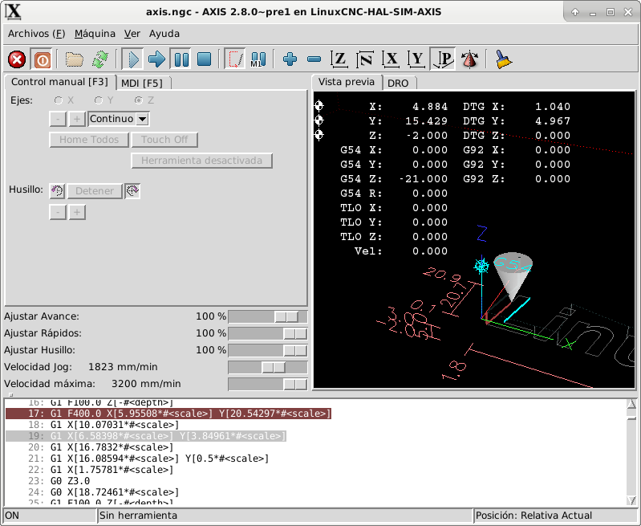

=== Control manual

Mientras la máquina está encendida pero no ejecuta un programa,
los elementos de la pestaña 'Control Manual' se pueden utilizar para
mover la máquina o controlar su husillo y el refrigerante.

Cuando la máquina no está encendida, o cuando se está ejecutando un programa,
los controles manuales no están disponibles.

Muchos de los elementos descritos a continuación no son útiles en todas las máquinas.
Cuando AXIS detecta que un pin en particular no está conectado en HAL,
se elimina el elemento correspondiente en la pestaña Control manual.
Por ejemplo, si el pin HAL 'motion.spindle-brake' no está conectado,
entonces el botón 'Freno' no aparecerá en la pantalla.
Si la variable de entorno 'AXIS_NO_AUTOCONFIGURE' está establecida,
este comportamiento está deshabilitado y todos los elementos aparecerán.

.El grupo Axis

'Axis' le permite mover manualmente la máquina.
Esta acción se conoce como 'jogging'.
Primero, seleccione el eje a mover haciendo clic en él.
Luego, haga clic y manténga presionado el botón '+' o '-'
dependiendo de la dirección de movimiento deseada.
Los primeros cuatro ejes también pueden ser movidos por
las teclas de flecha (X e Y),
Teclas PAGE UP y PAGE DOWN (Z),
y las teclas [and] (A).

Si se selecciona 'Continuo', el movimiento continuará
mientras se presiona el botón o la tecla.
Si se selecciona otro valor,
la máquina se moverá exactamente la distancia mostrada
cada vez que se hace clic en el botón o se presiona la tecla.
Por defecto, los valores disponibles son '0.1000, 0.0100, 0.0010, 0.0001'

Consulte la <<sec:display-section, sección DISPLAY para obtener más información sobre la configuración
los incrementos.

.Homing

Si la máquina dispone de micros de home y una secuencia definida para homing
de todos los ejes, en el botón mostrara 'Home All'. El botón 'Home All' o
las teclas Ctrl-HOME llevará a home todos los ejes utilizando la secuencia.
La tecla HOME llevará a home el eje actual, incluso si esta definida una secuencia de inicio.

Si su máquina tiene interruptores home y no se define una secuencia de inicio o
no todos los ejes tienen una secuencia home, el botón mostrara 'Home' y
solo llevara a home el eje seleccionado. Cada eje debe ser seleccionado y llevado a home por separado.

Si su máquina no tiene interruptores home definidos en la
configuración, el botón 'Home' establecerá la posición actual del eje seleccionado
como la posición absoluta 0 para ese eje y
activara el bit 'is-homed' para ese eje.

Consulte el <<cha:homing-configuration,Capítulo de configuración de Homing para obtener más información.

.Touch Off

Al presionar 'Touch Off' o la tecla END, el 'offset G5x' para el
el eje actual se cambia para que el valor del eje actual sea el
valor específicado. Las expresiones se pueden ingresar usando las reglas para los
programas rs274ngc, excepto que las variables no pueden ser referidas.
El valor resultante se muestra como un número.

.Touch Off

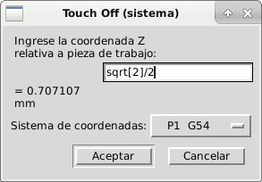

Consulte también las opciones 'Tool touch off to workpiece' y 'Tool touch off to fixture'
en el menú Machine.

.Anulacion de Límites

Pulsando Anulacion de Límites, se permitirá jog temporalmente en la máquina
mas alla de un final de carrera físico. Esta casilla solo está disponible
cuando se dispara un interruptor de límite. La anulación desaparece después de un jog. Si
El eje está configurado con interruptores de límite positivo y negativo separados,
LinuxCNC permitirá el jog solo en la dirección correcta. _La anulación de límites
no permite un jog más allá de un límite soft. La única manera de deshabilitar un límite soft
en un eje es con unhome._

.El grupo del husillo.

Los botones de la primera fila seleccionan la dirección de giro del husillo;
en sentido contrario a las agujas del reloj, detenido y en el sentido de las agujas del reloj.
El sentido antihorario solo aparece si el pin 'motion.spindle-reverse' está en el archivo HAL (
por ejemlo, 'net trick-axis motion.spindle-reverse'). Los botones en la
siguiente fila aumentan o disminuyen la velocidad de rotación.
La casilla de verificación en la tercera fila permite que el freno del husillo sea
accionado o liberado. Dependiendo de la configuración de su máquina,pueden no aparecer todos
los elementos en este grupo. Presionando el botón de arranque del husillo
se establece la velocidad 'S' en 1.

.El grupo de refrigerante

Dos botones permiten encender los refrigerantes 'Mist' y 'Flood'
y apagarlos. Dependiendo de la configuración de su máquina, puede no aparecer todos los elementos en
este grupo.

=== MDI

MDI permite que los comandos de código G se ingresen manualmente.
Cuando la máquina no está encendida, o cuando un programa está
en ejecución, los controles MDI no están disponibles.

La pestaña MDI

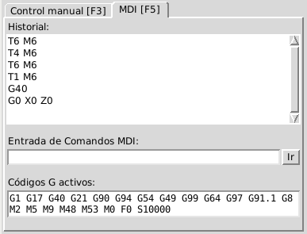

* 'Historial' - Muestra los comandos MDI que se han escrito anteriormente en esta sesión.

* 'Comando MDI' - Esto le permite ingresar un comando de código g para ser ejecutado. Ejecute el
    comando pulsando Intro o haciendo clic en 'Go'.

* 'Códigos G activos' - Se muestran los 'códigos modales' que están activos en el intérprete.
    Por ejemplo, 'G54' indica que el 'offset G54' se aplica a todas
    las coordenadas que se introduzcan. En modo Auto los G-Códigos Activos representan
    los códigos después la lectura por el intérprete.

=== Porcentaje de alimentacion

Al mover este control deslizante (feed override), se puede modificar la velocidad de alimentación programada.
Por ejemplo, si un programa solicita 'F60' y el control deslizante se establece en 120%,
entonces la velocidad de alimentación resultante será 72.

=== Porcentaje de velocidad del husillo

Al mover este control deslizante (Spindle Speed Override), la velocidad del husillo programada puede ser
modificada. Por ejemplo, si un programa solicita S8000 y el control deslizante es
establecido en 80%, entonces la velocidad del husillo resultante será 6400. Este elemento
solo aparece cuando el pin HAL 'motion.spindle-speed-out' está conectado.

=== Velocidad de Jog 

Al mover este control deslizante, se puede modificar la velocidad de joging.
Por ejemplo, si el control deslizante se establece en 1 pulgada/min, entonces un avance de .01 pulgadas
tardara aproximadamente .6 segundos, o 1/100 de minuto. Cerca del lado izquierdo
(jog lento) los valores están espaciados muy cerca, mientras que cerca del
lado derecho (jogs rápidos) están espaciados mucho más separados, permitiendo una
amplia gama de velocidades de jog con control fino cuando sea importante.

En las máquinas con un eje giratorio, se muestra un segundo control deslizante de velocidad de desplazamiento.
Este control deslizante establece la velocidad de desplazamiento de los ejes giratorios (A, B y C).

=== Velocidad máxima

Al mover este control deslizante, se puede establecer la velocidad máxima. Esto limita la
velocidad máxima para todos los movimientos programados, excepto en movimientos sincronizados con el husillo.

== Controles del teclado

Casi todas las acciones en AXIS se pueden realizar con el teclado.
La lista completa de atajos de teclado se puede encontrar en AXIS Quick
Reference, que se puede mostrar seleccionando Ayuda> Quick Reference.
Muchos de los accesos directos no están disponibles cuando se está en modo MDI.

Teclas de porcentaje de alimentación

Las teclas de anulación de la alimentación se comportan de manera diferente cuando están en modo manual.

[NOTE]
En el teclado 'Español de España', el simbolo " ' " se refiere al signo de acentuacion junto a la tecla
"P". Este signo precisa doble pulsacion de dicha tecla.
  
Las teclas ',1,2,3,4,5,6,7 y 8 seleccionarán un eje si está programado. Si tiene 3
eje ' seleccionará el eje 0, 1 seleccionará el eje 1, y 2 seleccionará
eje 2. El resto de las teclas numéricas establecerán el porcentaje de alimentación.
Al ejecutar un programa, ',1,2,3,4,5,6,7,8,9,0 establecerán el porcentaje de alimentación
a 0% - 100%.

Los métodos abreviados de teclado más utilizados se muestran en la siguiente tabla

.Atajos de teclado más comunes

[width="80%", options="header", cols="^,<,^"]
|====================================================================
| Pulsar tecla       | Acción tomada                                   | Modo
| F1                 | Stop de emergencia                              | Todos
| F2                 | Encender/apagar la máquina                      | Todos
| `, 1 .. 9, 0       | Establecer porcentaje alimentación de 0% a 100% | Varía
| X, `               | Activar primer eje                              | Manual
| Y, 1               | Activar segundo eje                             | Manual
| Z, 2               | Activar tercer eje                              | Manual
| A, 3               | Activar cuarto eje                              | Manual
| I                  | Seleccion incremento jog                        | Manual
| C                  | Jog continuo                                    | Manual
| Control-Inicio     | Realizar secuencia homing                       | Manual
| Fin                | Touch off: offset G5x para el eje activo        | Manual
| Izquierda, Derecha | Jog primer eje                                  | Manual
| Arriba, Abajo      | Jog segundo eje                                 | Manual
| Pg Arriba, Pg Dn   | Jog tercer eje                                  | Manual
| [,]                | Jog cuarto eje                                  | Manual
| O                  | Abrir archivo                                   | Manual
| Control-R          | Recargar archivo                                | Manual
| R                  | Ejecutar archivo                                | Manual
| P                  | Pausar ejecución                                | Auto
| S                  | Reanudar ejecución                              | Auto
| ESC                | Detener ejecucion                               | Auto
| Control-K          | Borrar backplot                                 | Manual/auto
| V                  | Ciclo entre vistas preestablecidas              | Manual/auto
| Shift-izda, dcha   | Eje X, rapido                                   | Manual
| Shift-Up, Abajo    | Eje Y, rapido                                   | Manual
| Shift-PgUp, PgDn   | Eje Z, rápido                                   | Manual
| @                  | conmutar actual/comandado                       | Todos
| #                  | conmutar relativo/máquina                       | Todos
|====================================================================

== Mostrar estado de LinuxCNC (linuxcnctop)

AXIS incluye un programa llamado 'linuxcnctop' que muestra algunos de los
detalles del estado de LinuxCNC. Puedes ejecutar este programa mediante Maquina >
Mostrar estado de LinuxCNC

.Ventana de estado de LinuxCNC

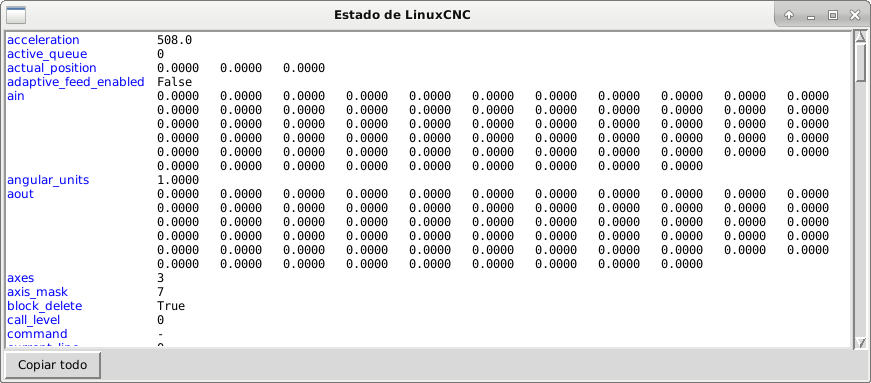

El nombre de cada elemento se muestra en la columna izquierda. El valor actual
se muestra en la columna derecha. Si el valor ha cambiado recientemente,
se muestra sobre un fondo rojo.

== Interfaz MDI

AXIS incluye un programa llamado `mdi` que permite la entrada en modo texto de
comandos MDI a una sesión de LinuxCNC en ejecución. Puede ejecutar este programa
abriendo un terminal y escribiendo

    mdi

Una vez que se está ejecutando, muestra el mensaje 'MDI>'. Cuando se ingresa una linea en blanco,
se muestra la posición actual de la máquina.
Cuando se ingresa un comando, se envía a LinuxCNC para ser ejecutado.
Para salir de mdi, pulse Ctrl-c en el terminal.

Esta es una sesión de muestra de mdi.

----
$ mdi
MDI>
(0.0, 0.0, 0.0, 0.0, 0.0, 0.0)
MDI> G1 F5 X1
MDI>
(0.5928500000000374, 0.0, 0.0, 0.0, 0.0, 0.0)
MDI>
(1.0000000000000639, 0.0, 0.0, 0.0, 0.0, 0.0)
----

== axis-remote

AXIS incluye un programa llamado 'axis-remote' que puede enviar ciertos
comandos a un AXIS en ejecución. Los comandos disponibles se muestran ejecutando
'help-axis' y ayuda a verificar si AXIS se está ejecutando
('--ping'), cargando un archivo por nombre, recargando el archivo cargado actualmente
archivo ('--reload'), y hacer que AXIS salga ('--quit').

[[sec:manual-tool-change]] (((Axis, Cambio de herramienta manual)))

== Cambio de herramienta manual

LinuxCNC incluye un componente HAL de espacio de usuario llamado 'hal_manualtoolchange',
que muestra una ventana que le indica qué herramienta se espera cuando
se emite el comando 'M6'. Después de presionar el botón OK, la ejecución
del programa continuará.

El componente hal_manualtoolchange incluye un pin hal para un botón que
se puede conectar a un botón físico para completar el cambio de herramienta y
eliminar el indicador de ventana (hal_manualtoolchange.change_button).

El archivo de configuración de HAL 'configs /sim/axis_manualtoolchange.hal'
muestra los comandos HAL necesarios para usar este componente.

hal_manualtoolchange se puede usar incluso cuando AXIS no se usa como GUI.
Este componente es más útil si tiene herramientas predefinidas y
usa la tabla de herramientas

[NOTE]
Nota importante: los rápidos no se mostrarán en la vista previa después de
emitir un T<n> hasta el siguiente movimiento de alimentación después de M6.
Esto puede ser muy confuso para la mayoría de los usuarios.
Para desactivar esta función para el cambio de herramienta actual,
programe un G1 sin movimiento después de T<n>.

.Ventana de cambio de herramientas manual

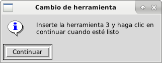

== Módulos de Python

AXIS incluye varios módulos Python que pueden ser útiles para otros. Para más
información sobre uno de estos módulos, use 'pydoc <nombre del módulo>' o lea el
código fuente. Estos módulos incluyen:

 - 'emc' proporciona acceso a los canales de comando, estado y error de LinuxCNC
 - 'gcode' proporciona acceso al intérprete rs274ngc
 - 'rs274' proporciona herramientas adicionales para trabajar con archivos rs274ngc
 - 'hal' permite la creación de componentes HAL de espacio de usuario escritos en Python
 - '_togl' proporciona un widget OpenGL que puede usarse en aplicaciones Tkinter
 - 'minigl' proporciona acceso al subconjunto de OpenGL utilizado por AXIS

Para utilizar estos módulos en sus propios scripts, debe asegurarse de que
el directorio donde residen está en la ruta de módulos de Python. Cuando se ejecuta una
versión instalada de LinuxCNC, esto debería suceder automáticamente. Cuando
ejecutando una RIP, esto se puede hacer mediante el guion 'scripts/rip-environment'.

== Usando AXIS en el modo Torno

Incluyendo la línea 'LATHE = 1'
en la sección [DISPLAY] del archivo ini, AXIS selecciona el modo de torno.
El eje 'Y' no se muestra en las lecturas de coordenadas, la vista se cambia
mostrando el eje Z extendido hacia la derecha y el eje X que se extiende hacia
en la parte inferior de la pantalla. Varios controles (como los de
vistas preestablecidas) se eliminan. Se reemplazan las lecturas de coordenadas para X
con diámetro y radio.

Al presionar 'V' se hace zoom para mostrar el archivo completo, si hay uno cargado.

En el modo de torno, se muestra la forma de la herramienta cargada (si existe).

.La forma de la herramienta del torno

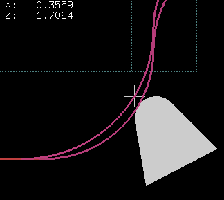

== Usando AXIS en el modo de corte de espuma

Incluyendo la línea 'FOAM = 1'
En la sección [DISPLAY] del archivo ini, AXIS selecciona el modo de corte de espuma.
En la vista previa del programa, los movimientos XY se muestran en un plano, y los movimientos UV
en otro. En el plot en vivo, se dibujan líneas entre los puntos correspondientes en
el plano XY y el plano UV. Los comentarios especiales (XY_Z_POS) y (UV_Z_POS)
establecen las coordenadas Z de estos planos, que por defecto son 0 y 1,5 unidades de máquina.

.Modo de corte de espuma.

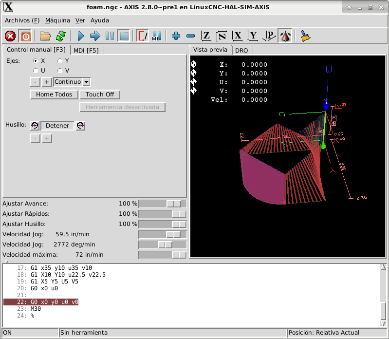

== Configuración avanzada

Cuando se inicia AXIS, se crean los pines HAL para la GUI y se ejecuta
el archivo HAL nombrado en '[HAL]POSTGUI_HALFILE' en el archivo ini. Solo
se puede utilizar un archivo POSTGUI. Coloque todos los comandos HAL que se conecten a los pines HAL GUI
en el archivo de postgui HAL.

Para obtener más información sobre la configuración del archivo ini que puede cambiar la forma en que AXIS
trabaja, consulte la sección << sec:display-section,Seccion Display>> del capitulo de configuración INI.

=== Filtros de programa

AXIS tiene la capacidad de enviar archivos cargados a través de un 'programa de filtro'.
Este filtro puede realizar cualquier tarea deseada: algo tan simple como asegurarse
el archivo termina con 'M2', o algo tan complicado como generar
Código G de una imagen.

La sección '[FILTER]' del archivo ini controla cómo funcionan los filtros.
Primero, para cada tipo de archivo, escriba una línea 'PROGRAM_EXTENSION'.
Luego, especifique el programa a ejecutar para cada tipo de archivo.
Este programa recibe el nombre del archivo de entrada como su primer argumento,
y debe escribir el código rs274ngc en la salida estándar. Esta salida es lo que
se mostrará en el área de texto, se previsualizará en el área de visualización y
sera ejecutado por LinuxCNC con 'Run'. Las siguientes líneas agregan soporte para el
convertidor de 'imagen a gcode' incluido con LinuxCNC:

----
[FILTER]
PROGRAM_EXTENSION = .png,.gif Imagen de profundidad en escala de grises
png = image-to-gcode
gif = image-to-gcode
----

También es posible especificar un intérprete:

----
PROGRAM_EXTENSION = .py Script Python 
py = python
----

De esta manera, cualquier script de Python se puede abrir, y su salida es
tratada como g-code. Un ejemplo de este script está disponible en
'nc_files/holecircle.py'. Este script crea g-code para perforar una
serie de agujeros a lo largo de la circunferencia de un círculo.

.Agujeros circulares

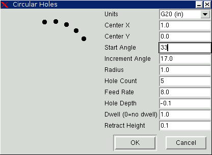

Si la variable de entorno AXIS_PROGRESS_BAR está establecida, entonces las líneas
escriben al stderr del formulario

----
FILTER_PROGRESS=%d
----

establecerá la barra de progreso de AXIS en el porcentaje dado. Esta característica
debe ser utilizada por cualquier filtro que se ejecute durante mucho tiempo.

=== La base de datos de recursos X

Los colores de la mayoría de los elementos de la interfaz de usuario AXIS pueden ser
personalizado a través de la base de datos de recursos X. El archivo de ejemplo
'axis_light_background' cambia los colores de la ventana de backplot a 
'líneas oscuras en fondo blanco', y también sirve como una referencia para elementos configurables
en el área de visualización. El archivo de ejemplo 'axis_big_dro' cambia la
posición de lectura a una fuente de tamaño más grande. Para utilizar estos archivos:

----
xrdb -merge /usr/share/doc/emc2/axis_light_background

xrdb -merge /usr/share/doc/emc2/axis_big_dro
----
Para obtener información sobre los otros elementos que se pueden configurar en Tk
aplicaciones Tk, ver las páginas del manual de Tk.

Dado que los entornos de escritorio modernos hacen algunas configuraciones automáticamente
en la base de datos de recursos X que afectan adversamente a AXIS, estos ajustes son ignorados por defecto.
Para hacer que los elementos de la base de datos de recursos X se anulen,
los valores predeterminados de AXIS incluyen la siguiente línea en sus Recursos X:

// Estos asteriscos no son para negrita,
----
    *Axis*optionLevel: widgetDefault
----
// en este caso, queremos que aparezcan los asteriscos.

esto hace que las opciones integradas se creen en el nivel de opción
'widgetDefault', de modo que X Resources (que son nivel 'userDefault')
puededan anularlas

=== ~/.axisrc

Si existe, el contenido de `~/.axisrc` se ejecuta como 
código fuente Python justo antes de la interfaz gráfica de usuario de AXIS.
Los detalles de lo que se puede escribir en `~/.axisrc` están sujetos
a cambios durante el ciclo de desarrollo.

Lo siguiente agrega Control-Q como método abreviado de teclado para Salir.

----
root_window.bind("<Control-q>", "destroy .")
help2.append(("Control-Q", "Quit"))
----

Lo siguiente detiene el cuadro de diálogo "¿Realmente desea salir?".

----
root_window.tk.call("wm","protocol",".","WM_DELETE_WINDOW","destroy .") 
----

=== USER_COMMAND_FILE

Puede especificarse un archivo python específico de configuración con un archivo ini
configurando '[DISLAY]USER_COMMAND_FILE=filename.py'. Al igual que un archivo `~/.axisrc`,
este archivo corre justo antes de que se muestre la GUI de AXIS. Este archivo
es específico de una configuración de archivo ini, no del directorio de inicio del usuario.
Cuando se especifica este archivo, se ignora un archivo `~/.axisrc` existente.

=== user_live_update()

La gui Axis incluye una función no-op (marcador de posición) llamada
'user_live_update()' que se ejecuta al final de la funcion update()
de su clase LivePlotter. Esta función puede ser implementada
dentro de los script python `~/.axisrc` o '[DISPLAY]USER_COMMAND_FILE'
para realizar acciones personalizadas periódicas. Los detalles de lo que puede
lograrse cos esta función dependerán de la implementacion de la gui Axis
y sujeto a cambios durante el ciclo de desarrollo.

=== Editor externo

Las opciones de menú Archivo > Editar ... y Archivo > Editar tabla de herramientas ... estaran
disponible después de definir el editor en la sección ini [DISPLAY].
Los valores útiles incluyen EDITOR=gedit y EDITOR=gnome-terminal -e vim.
Para obtener más información, consulte la sección <<sec:display-section,Sección display>>
del capítulo de Configuración INI.

=== Panel de control virtual

AXIS puede mostrar un panel de control virtual personalizado en la zona derecha.
Puede programar botones, indicadores, pantallas de datos y más cosas.
Para más información, consulte los capitulos <<cha:pyvcp,PyVCP y
<<cha:glade-vcp,GladeVCP.

[[axis:preview-control]]

=== Control de vista previa

Se pueden insertar comentarios especiales en el archivo de Código G para controlar cómo
se comporta la vista previa de AXIS. En el caso de que quiera limitar el
dibujo de la vista previa utiliza estos comentarios especiales, cualquier cosa entre
(AXIS,hide) y (AXIS,show) no se dibujará durante la vista previa.
(AXIS,hide) y (AXIS,show) deben usarse en pares con, (AXIS,hide)
primero. Cualquier cosa después de (AXIS,stop) no se dibujará durante la
vista previa.

Estos comentarios son útiles para limpiar la visualización de vista previa (por
ejeplo, mientras se depura un archivo g-code más grande, se puede deshabilitar la
vista previa de ciertas partes que ya están trabajando bien).

 - (AXIS,hide) Detiene la vista previa (debe ser la primera)
 - (AXIS,show) Reanuda la vista previa (debe seguir un hide)
 - (AXIS,stop) Detiene la vista previa desde aquí hasta el final del archivo.
 - (AXIS,notify, el_texto) Muestra el_texto como una pantalla de información.
Esta pantalla puede ser útil en la vista previa de Axis cuando
los comentarios (debug,message) no se muestran.

=== Pines Axisui

Para mejorar la interacción de AXIS con jogwheels físicos, el eje
actualmente seleccionado en la GUI también se reporta en un pin con un nombre
como 'axisui.jog.x'. Uno de estos pines es 'VERDADERO' y el resto son
'FALSO'. Están diseñados para controlar los pines de habilitacion de movimiento jog.

.Axisui Pins

El eje tiene pines Hal para indicar qué botón de selección de jog está seleccionado en el
Pestaña 'Control manual'.

----
Tipo Dir Nombre
bit  OUT axisui.jog.x
bit  OUT axisui.jog.y
bit  OUT axisui.jog.z
bit  OUT axisui.jog.a
bit  OUT axisui.jog.b
bit  OUT axisui.jog.c
bit  OUT axisui.jog.u
bit  OUT axisui.jog.v
bit  OUT axisui.jog.w
----

Axis tiene un pin Hal para indicar el incremento de jog seleccionado en 'Control Manual'.
----
Tipo  Dir Nombre
float OUT axisui.jog.increment
----

Axis tiene pines de entrada Hal para borrar las notificaciones emergentes de errores e
información.

----
Tipo  Dir Nombre
bit   IN  axisui.notifications-clear
bit   IN  axisui.notifications-clear-error
bit   IN  axisui.notifications-clear-info
----

Axis tiene un pin de entrada Hal que deshabilita/habilita la función 'Pausa/Reanudar'.
----
Tipo  Dir Nombre
bit   IN  axisui.resume-inhibit
----

== Sugerencias de personalización de Axis

Axis es un código bastante grande y difícil de penetrar. Esto es útil
para mantener el código estable pero dificulta la personalización. +
Aquí mostraremos fragmentos de código para modificar comportamientos o imágenes de la pantalla.
Tenga en cuenta que el código interno de AXIS puede cambiar de vez en cuando. +
No se garantiza que estos fragmentos continúen funcionando; pueden necesitar ajustes.

=== La función de actualización

Hay una función en Axis llamada user_live_update que se llama
cada vez que Axis se actualiza solo. Puede usar esto para actualizar sus propias funciones.
[source,python]
----

# función de actualización continua
def user_live_update():
    print 'i am printed every update...' 
----

=== Deshabilitar el cuadro de diálogo Cerrar

[source,python]
----
# disable the do you want to close dialog
root_window.tk.call("wm","protocol",".","WM_DELETE_WINDOW","destroy .")
----
=== Cambiar la fuente del texto

[source,python]
----
# cambiar la fuente

font = 'sans 11'
fname,fsize = font.split()
root_window.tk.call('font','configure','TkDefaultFont','-family',fname,'-size',fsize)

# rehace el texto en pestañas para que cambien el tamaño de la nueva fuente predeterminada

root_window.tk.call('.pane.top.tabs','itemconfigure','manual','-text',' Manual - F3 ')
root_window.tk.call('.pane.top.tabs','itemconfigure','mdi','-text',' MDI - F5 ')
root_window.tk.call('.pane.top.right','itemconfigure','preview','-text',' Preview ')
root_window.tk.call('.pane.top.right','itemconfigure','numbers','-text',' DRO ')

# la fuente gcode es independiente

root_window.tk.call('.pane.bottom.t.text','configure','-foreground','blue')
#root_window.tk.call('.pane.bottom.t.text','configure','-foreground','blue','-font',font)
#root_window.tk.call('.pane.bottom.t.text','configure','-foreground','blue','-font',font,'-height','12')
----

=== Modificar velocidad rápida con atajos de teclado

[source,python]
----
# use control + ` o 1-0 como atajos de teclado para acelerar y mantener ` o 1-0 para avance
# también agrega texto a la referencia rápida en la ayuda

help1.insert(10,("Control+ `,1..9,0", _("Establecer ajuste de rápidos de 0% a 100%")),)

root_window.bind('<Control-Key-quoteleft>',lambda event: set_rapidrate(0))
root_window.bind('<Control-Key-1>',lambda event: set_rapidrate(10))
root_window.bind('<Control-Key-2>',lambda event: set_rapidrate(20))
root_window.bind('<Control-Key-3>',lambda event: set_rapidrate(30))
root_window.bind('<Control-Key-4>',lambda event: set_rapidrate(40))
root_window.bind('<Control-Key-5>',lambda event: set_rapidrate(50))
root_window.bind('<Control-Key-6>',lambda event: set_rapidrate(60))
root_window.bind('<Control-Key-7>',lambda event: set_rapidrate(70))
root_window.bind('<Control-Key-8>',lambda event: set_rapidrate(80))
root_window.bind('<Control-Key-9>',lambda event: set_rapidrate(90))
root_window.bind('<Control-Key-0>',lambda event: set_rapidrate(100))
root_window.bind('<Key-quoteleft>',lambda event: set_feedrate(0))
root_window.bind('<Key-1>',lambda event: set_feedrate(10))
root_window.bind('<Key-2>',lambda event: set_feedrate(20))
root_window.bind('<Key-3>',lambda event: set_feedrate(30))
root_window.bind('<Key-4>',lambda event: set_feedrate(40))
root_window.bind('<Key-5>',lambda event: set_feedrate(50))
root_window.bind('<Key-6>',lambda event: set_feedrate(60))
root_window.bind('<Key-7>',lambda event: set_feedrate(70)
root_window.bind('<Key-8>',lambda event: set_feedrate(80))
root_window.bind('<Key-9>',lambda event: set_feedrate(90))
root_window.bind('<Key-0>',lambda event: set_feedrate(100))
----

=== Leer el archivo INI

[source,python]
----
# leer un elemento del archivo ini

machine = inifile.find('EMC','MACHINE')
print 'machine name =',machine
----

=== Leer el estado de linuxcnc

[source,python]
----
# El estado de linuxcnc se puede leer desde s.

print s.actual_position 
print s.paused 
----
=== Cambiar la vista actual

[source,python]
----
# establecer la vista de la vista previa
# las vistas válidas son view_x view_y view_y2 view_z view_z2 view_p

command.set_view_z()
----

=== Crear nuevos pines AXISUI HAL

[source,python]
----
def user_hal_pins():
    comp.newpin('my-new-in-pin', hal.HAL_BIT, hal.HAL_IN)
    comp.ready()
----

=== Crear nuevos componentes y pines HAL

[source,python]
----
# crear un componente

mycomp = hal.component('my_component')
mycomp.newpin('idle-led',hal.HAL_BIT,hal.HAL_IN)
mycomp.newpin('pause-led',hal.HAL_BIT,hal.HAL_IN)
mycomp.ready()

# pines de conexión

hal.new_sig('idle-led',hal.HAL_BIT)
hal.connect('halui.program.is-idle','idle-led')
hal.connect('my_component.idle-led','idle-led')

# establecer un pin

hal.set_p('my_component.pause-led','1')

# obtener un pin de rama 2,8+

value = hal.get_value('halui.program.is-idle')
print 'value is a',type(value),'value of',value
----

=== Cambiar pestañas con pines HAL

[source, python]
----
# los pines hal de un panel GladeVCP no estarán listos cuando se ejecute user_live_update
# para leerlos necesita ponerlos en un bloque try/except

# el siguiente ejemplo supone 5 botones HAL en un panel GladeVCP utilizado para cambiar
# las pestañas en la pantalla Axis.
# los nombres de los botones son 'manual-tab', 'mdi-tab', 'preview-tab', 'dro-tab', 'user0-tab'
# la pestaña user_0, si existe, sería la primera pestaña incrustada GladeVCP

# para la rama linuxCNC 2.8+

def user_live_update():
    try:
        if hal.get_value('gladevcp.manual-tab'):
            root_window.tk.call('.pane.top.tabs','raise','manual')
        elif hal.get_value('gladevcp.mdi-tab'):
            root_window.tk.call('.pane.top.tabs','raise','mdi')
        elif hal.get_value('gladevcp.preview-tab'):
            root_window.tk.call('.pane.top.right','raise','preview')
        elif hal.get_value('gladevcp.numbers-tab'):
            root_window.tk.call('.pane.top.right','raise','numbers')
        elif hal.get_value('gladevcp.user0-tab'):
            root_window.tk.call('.pane.top.right','raise','user_0')
    except:
        pass
----

=== Agregar un botón de inicio GOTO

[source,python]
----
def goto_home(axis):
    if s.interp_state == linuxcnc.INTERP_IDLE:
        home = inifile.find('JOINT_' + str(inifile.find('TRAJ', 'COORDINATES').upper().index(axis)), 'HOME')
        mode = s.task_mode
        if s.task_mode != linuxcnc.MODE_MDI:
            c.mode(linuxcnc.MODE_MDI)
        c.mdi('G53 G0 ' + axis + home)

# hacer un botón para home del eje Y
root_window.tk.call('button','.pane.top.tabs.fmanual.homey','-text','Home Y','-command','goto_home Y','-height','2')

# colocar el botón
root_window.tk.call('grid','.pane.top.tabs.fmanual.homey','-column','1','-row','7','-columnspan','2','-padx','4','-sticky','w')

# cualquier función llamada desde tcl debe agregarse a TclCommands
TclCommands.goto_home = goto_home
commands = TclCommands(root_window)
----

=== Agregar botón al marco manual

[source,python]
----
# crea un nuevo botón y ponerlo en el marco manual

root_window.tk.call('button','.pane.top.tabs.fmanual.mybutton','-text','My Button','-command','mybutton_clicked','-height','2')
root_window.tk.call('grid','.pane.top.tabs.fmanual.mybutton','-column','1','-row','6','-columnspan','2','-padx','4','-sticky','w')

# lo anterior envía el comando "mybutton_clicked" cuando se hace clic
# otras opciones son vincular un comando de pulsar o soltar (o ambos) al botón
# estos pueden ser adicionales o en lugar del comando seleccionado
# si en lugar de eliminar '-command', 'mybutton_clicked', de la primera línea

# Botón-1 = botón izquierdo del mouse, 2 = derecho o 3 = medio

root_window.tk.call('bind','.pane.top.tabs.fmanual.mybutton','<Button-1>','mybutton_pressed')
root_window.tk.call('bind','.pane.top.tabs.fmanual.mybutton','<ButtonRelease-1>','mybutton_released')

# funciones llamadas desde los botones

def mybutton_clicked():
    print 'mybutton was clicked'
def mybutton_pressed():
    print 'mybutton was pressed'
def mybutton_released():
    print 'mybutton was released'

# cualquier función llamada desde tcl debe agregarse a TclCommands

TclCommands.mybutton_clicked = mybutton_clicked
TclCommands.mybutton_pressed = mybutton_pressed
TclCommands.mybutton_released = mybutton_released
commands = TclCommands(root_window)
----

=== Lectura de variables internas

[source,python]
----
# las siguientes variables pueden leerse desde la instancia de vars

print vars.machine.get()
print vars.emcini.get()

----

    active_codes            = StringVar
    block_delete            = BooleanVar
    brake                   = BooleanVar
    coord_type              = IntVar
    display_type            = IntVar
    dro_large_font          = IntVar
    emcini                  = StringVar
    exec_state              = IntVar
    feedrate                = IntVar
    flood                   = BooleanVar
    grid_size               = DoubleVar
    has_editor              = IntVar
    has_ladder              = IntVar
    highlight_line          = IntVar
    interp_pause            = IntVar
    interp_state            = IntVar
    ja_rbutton              = StringVar
    jog_aspeed              = DoubleVar
    jog_speed               = DoubleVar
    kinematics_type         = IntVar
    linuxcnctop_command     = StringVar
    machine                 = StringVar
    max_aspeed              = DoubleVar
    max_maxvel              = DoubleVar
    max_queued_mdi_commands = IntVar
    max_speed               = DoubleVar
    maxvel_speed            = DoubleVar
    mdi_command             = StringVar
    metric                  = IntVar
    mist                    = BooleanVar
    motion_mode             = IntVar
    on_any_limit            = BooleanVar
    optional_stop           = BooleanVar
    override_limits         = BooleanVar
    program_alpha           = IntVar
    queued_mdi_commands     = IntVar
    rapidrate               = IntVar
    rotate_mode             = BooleanVar
    running_line            = IntVar
    show_distance_to_go     = IntVar
    show_extents            = IntVar
    show_live_plot          = IntVar
    show_machine_limits     = IntVar
    show_machine_speed      = IntVar
    show_program            = IntVar
    show_pyvcppanel         = IntVar
    show_rapids             = IntVar
    show_tool               = IntVar
    show_offsets            = IntVar
    spindledir              = IntVar
    spindlerate             = IntVar
    task_mode               = IntVar
    task_paused             = IntVar
    task_state              = IntVar
    taskfile                = StringVar
    teleop_mode             = IntVar
    tool                    = StringVar
    touch_off_system        = StringVar
    trajcoordinates         = StringVar
    tto_g11                 = BooleanVar
    view_type               = IntVar

=== Ocultar widgets

[source,python]
----
# ocultar un widget
# use 'grid' o 'pack' dependiendo de cómo se colocó originalmente

root_window.tk.call('grid','forget','.pane.top.tabs.fmanual.jogf.zerohome.tooltouch')
----

=== Cambiar una etiqueta

[source,python]
----
# cambiar la etiqueta de un widget
root_window.tk.call('setup_widget_accel','.pane.top.tabs.fmanual.mist','Downdraft')

# asegúrese de que aparezca (solo es necesario en este caso si el botón de niebla estaba oculto)
root_window.tk.call('grid','.pane.top.tabs.fmanual.mist','-column','1','-row','5','-columnspan','2','-padx','4','-sticky','w')
----

=== Redirigir un comando existente

[source,python]
----
# secuestrar un comando existente
# originalmente el botón de niebla llama a la función de niebla

root_window.tk.call('.pane.top.tabs.fmanual.mist','configure','-command','hijacked_command')

# La nueva función

def hijacked_command():
    print 'hijacked mist command'

# agrega la función a TclCommands

TclCommands.hijacked_command = hijacked_command
commands = TclCommands(root_window)
----

=== Cambiar el color DRO

[source,python]
----
# cambiar la pantalla dro

root_window.tk.call('.pane.top.right.fnumbers.text','configure','-foreground','green','-background','black')
----

=== Cambiar los botones de la barra de herramientas

[source,python]
----
# cambiar los botones de la barra de herramientas

buW = '3'
buH = '2'
boW = '3'

root_window.tk.call('.toolbar.machine_estop','configure','-image','','-text','ESTOP','-width',buW,'-height',buH,'-borderwidth',boW)
root_window.tk.call('.toolbar.machine_power','configure','-image','','-text','POWER','-width',buW,'-height',buH,'-borderwidth',boW)
root_window.tk.call('.toolbar.file_open','configure','-image','','-text','OPEN','-width',buW,'-height',buH,'-borderwidth',boW)
root_window.tk.call('.toolbar.reload','configure','-image','','-text','RELOAD','-width',buW,'-height',buH,'-borderwidth',boW)
root_window.tk.call('.toolbar.program_run','configure','-image','','-text','RUN','-width',buW,'-height',buH,'-borderwidth',boW)
root_window.tk.call('.toolbar.program_step','configure','-image','','-text','STEP','-width',buW,'-height',buH,'-borderwidth',boW)
root_window.tk.call('.toolbar.program_pause','configure','-image','','-text','PAUSE','-width',buW,'-height',buH,'-borderwidth',boW)
root_window.tk.call('.toolbar.program_stop','configure','-image','','-text','STOP','-width',buW,'-height',buH,'-borderwidth',boW)
root_window.tk.call('.toolbar.program_blockdelete','configure','-image','','-text','Skip /','-width',buW,'-height',buH,'-borderwidth',boW)
root_window.tk.call('.toolbar.program_optpause','configure','-image','','-text','M1','-width',buW,'-height',buH,'-borderwidth',boW)
root_window.tk.call('.toolbar.view_zoomin','configure','-image','','-text','Zoom+','-width',buW,'-height',buH,'-borderwidth',boW)
root_window.tk.call('.toolbar.view_zoomout','configure','-image','','-text','Zoom-','-width',buW,'-height',buH,'-borderwidth',boW)
root_window.tk.call('.toolbar.view_z','configure','-image','','-text','Top X','-width',buW,'-height',buH,'-borderwidth',boW)
root_window.tk.call('.toolbar.view_z2','configure','-image','','-text','Top Y','-width',buW,'-height',buH,'-borderwidth',boW)
root_window.tk.call('.toolbar.view_x','configure','-image','','-text','Right','-width',buW,'-height',buH,'-borderwidth',boW)
root_window.tk.call('.toolbar.view_y','configure','-image','','-text','Front','-width',buW,'-height',buH,'-borderwidth',boW)
root_window.tk.call('.toolbar.view_p','configure','-image','','-text','3D','-width',buW,'-height',buH,'-borderwidth',boW)
root_window.tk.call('.toolbar.rotate','configure','-image','','-text','Rotate','-width',buW,'-height',buH,'-borderwidth',boW)
root_window.tk.call('.toolbar.clear_plot','configure','-image','','-text','Clear','-width',buW,'-height',buH,'-borderwidth',boW)
----

