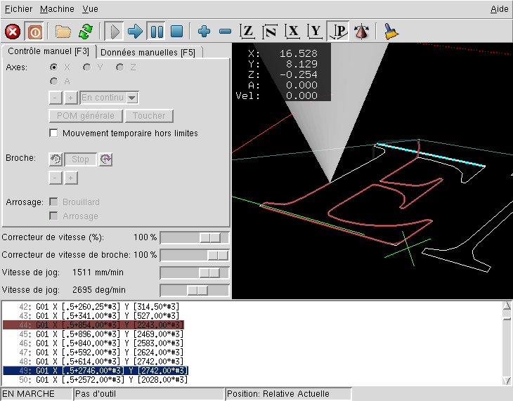
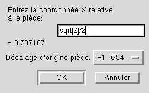
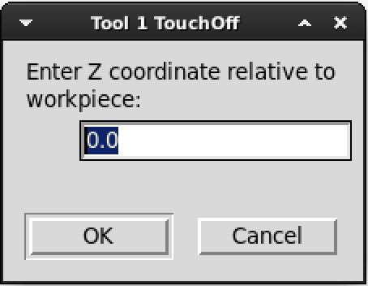
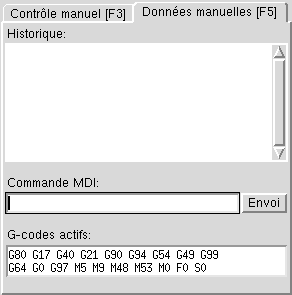
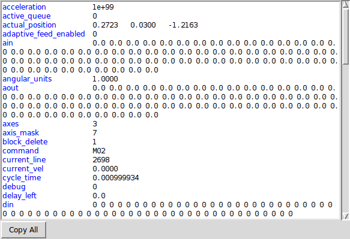
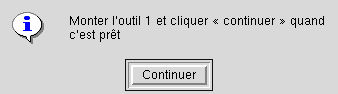
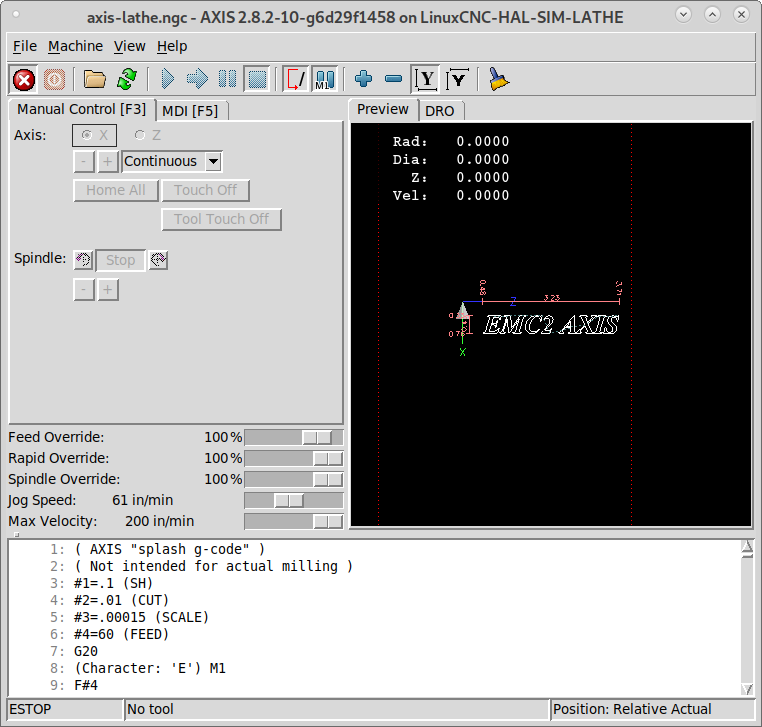
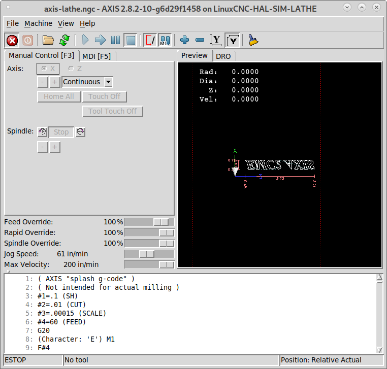
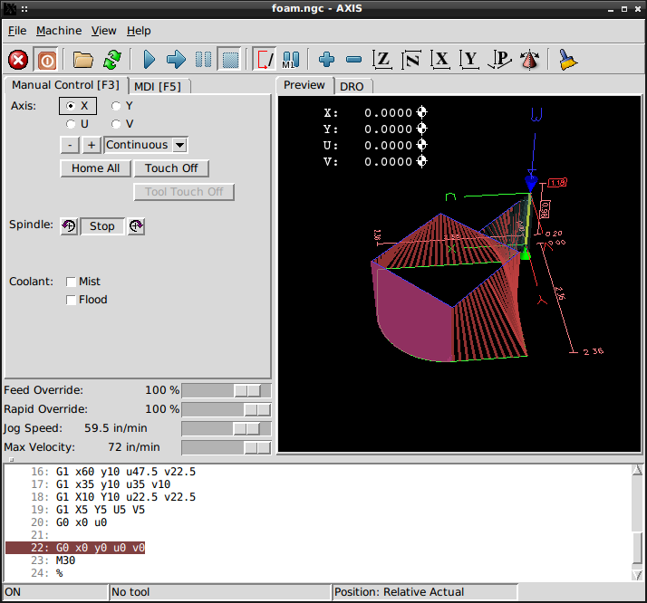

:lang: fr
:toc:

[[cha:axis-gui]]
= L'interface graphique AXIS(((Interface graphique AXIS)))

// Custom lang highlight
// must come after the doc title, to work around a bug in asciidoc 8.6.6
:ini: {basebackend@docbook:'':ini}
:hal: {basebackend@docbook:'':hal}
:ngc: {basebackend@docbook:'':ngc}

== Introduction

AXIS(((AXIS))) est une interface utilisateur graphique pour LinuxCNC, il
offre un aperçu permanent du parcours de l'outil. Il est écrit en
Python(((Python))), utilise Tk(((Tk))) et OpenGL(((OpenGL))) pour afficher son interface graphique.

[[fig:axis-fenetre]]
.La Fenêtre AXIS
image::../user/images/axis_25_fr.png["Fenêtre principale d'AXIS",align="center"]

== Commencer avec AXIS

Si votre configuration actuelle n'est pas paramétrée pour utiliser AXIS comme interface graphique de LinuxCNC,
vous pouvez changer cela en éditant le fichier .ini. Dans la
section [DISPLAY] changez la ligne DISPLAY comme ceci:
'DISPLAY = axis'. Puis, lancez LinuxCNC et choisissez le fichier ini.

La configuration simplifiée 'sim/axis.ini' est déjà configurée pour utiliser AXIS comme
interface graphique.

Quand AXIS démarre, une fenêtre telle que celle de la figure
<<cap:Fenetre-AXIS,ci-dessus>> s'ouvre.

=== INI settings

For more information on ini file settings that can change how AXIS
works see the <<sec:display-section,Display Section>> of the INI
Configuration Chapter.

Adjust the response rate of the GUI in milli seconds. Typical 100, useable range 50 - 200 +
(will accept time in seconds (.05 -.2) for legacy reasons - milli seconds preferred to match other screens)

[source,{ini}]
----
[DISPLAY]
CYCLE_TIME = 100
----

=== Une session typique avec AXIS

. Lancer LinuxCNC et sélectionner un fichier de configuration.
. Relâcher le bouton d'arrêt d'urgence 'A/U'(F1)(((A/U))) et mettre la machine en 'Marche' (F2).
. Faire les prises d'origine machine 'POM' pour chacun des axes.
. Charger un fichier G-code d'usinage.
. Utiliser l'affichage du parcours d'outil pour vérifier que le programme est correct.
. Brider le brut à usiner.
. Faire les prises d'origine pièce 'POP' de chacun des axes avec le jog
  et en utilisant le bouton 'Toucher'.(((Toucher)))
. Exécuter le programme.
. Pour usiner le même fichier une nouvelle fois, retourner à l'étape 6.
  Pour usiner un fichier différent, retourner à l'étape 4.
. Quand le travail est terminé, quitter AXIS.

[NOTE]
To run the same program again depends on your setup and requirements.
You might need to load more material and set offsets or move over and
set an offset then run the program again. If your material is fixtured
then you might need to only run the program again. See the
<<sub:axis-machine-menu,Machine Menu>> for more information on the run
command.

== Éléments de la fenêtre d'AXIS

La fenêtre d'AXIS contient les éléments suivants:

* Un espace d'affichage qui montre
** une pré-visualisation du fichier chargé (dans ce cas, 'axis.ngc'),
   ainsi que la position courante du point programmé par la machine.
   Plus tard, cette zone affichera le parcours de l'outil déplacé par la machine,
   cette zone est appelée le parcours d'outil (backplot)
** FIXME a large readout showing the current position and all offsets.
* Une barre de menus, une barre d'outils, des curseurs et des onglets permettant d'effectuer différentes actions.
* L'onglet 'Contrôle manuel'(((Contrôle manuel))) - qui permet de faire
  des mouvements d'axe, de mettre la broche en rotation ou de l'arrêter,
  de mettre l'arrosage en marche ou de l'arrêter.
* L'onglet 'Données manuelles' (appelé aussi MDI) - (((Données manuelles)))
  où les blocs de programme G-code peuvent être entrés et exécutés à
  la main, une ligne à la fois.
* Les curseurs 'Correcteurs de vitesse'(((Correcteurs de vitesse))) - qui permettent d'augmenter ou de diminuer la vitesse de la fonction concernée.
  The default maximum is 120% and can be set to a different
  value in the ini file. See the <<sec:display-section,Display Section>> of the
  INI file for more information.
* FIXME 'Spindle Override' - which allows you to scale the spindle speed up or down.
* FIXME 'Jog Speed' - which allows you to set the jog speed within the limits set in the ini file.
  See the <<sec:display-section,Display Section>> of the INI file for more information.
* FIXME 'Max Velocity' - which allows you to restrict the maximum velocity of all
  programmed motions (except spindle synchronized motion).
* Une zone de textes qui affiche le G-code du fichier chargé.
* Une barre d'état qui affiche l'état de la machine. Dans cette capture
  d'écran, la machine est en marche, aucun outil n'est monté, la position
  affichée est 'relative'(((Position: Relative))) à l'origine machine (par opposition à une position 'absolue')(((Position: Absolue))) et
  'actuelle'(((Position: Actuelle))) (par opposition à une position 'commandée')(((Position: Commandée)))

=== Options des menus

Certaines options de menu peuvent s'afficher en grisé, c'est dépendant des
options du fichier de configuration ini.
<<cha:ini-configuration,INI Chapter>>.

==== Menu Fichier

* 'Ouvrir...' - C'est une boîte de dialogue standard pour ouvrir un fichier G-code
  à charger dans AXIS. Si un filtre de programme a été configuré, il
  peut aussi être ouvert ici. FIXME See the <<sec:filter-section,FILTER Section>> of the INI configuration
  for more information.
* 'Fichiers récents...' - Affiche la liste des fichiers ouverts récemment.
* 'Éditer...' - Ouvre le fichier G-code courant pour édition si un éditeur a été
  déclaré dans le fichier ini. FIXME See the <<sec:display-section,DISPLAY Section>>
  for more information on specifying an editor to use.
* 'Recharger...' - Recharge le fichier G-code courant. Si le fichier a été
  édité, il doit être rechargé pour que les modifications prennent effet. Si un
  programme a été stoppé, pour le reprendre depuis le début, le recharger.
  Le bouton 'Recharger' a le même effet que l'option de menu.
* 'Enregistrer le G-code sous...' - Enregistre le fichier courant sous un nouveau nom.
* 'Propriétés...' - Donne la somme des mouvements en vitesse rapide et celle en vitesse travail.
  Ne tient pas compte des accélérations, ni des décélérations, ni des modes de trajectoire, de sorte qu'il ne donne jamais de temps inférieur au temps réel
  d'exécution.
* 'Éditer la table d'outils...' - Ouvre un dialogue permettant d'éditer les
  valeurs de la table d'outils.
* 'Recharger la table d'outils...' - Après avoir édité la table d'outil, il convient de la recharger pour que les nouvelles valeurs soient prisent en compte.
* 'Éditeur de Ladder...' - Si Classic Ladder a été chargé, il est possible de l'éditer
  ici. FIXME See the <<cha:classicladder,Classicladder Chapter>>
  for more information.
* 'Quitter...' - Termine la session courante de LinuxCNC.

[[sub:axis-machine-menu]]
==== Menu Machine

* 'Arrêt d'Urgence F1...' - (bascule) Active/désactive l'arrêt d'urgence.
* 'Marche/Arrêt F2...' - (bascule) Active/désactive la puissance machine.
* 'Démarrer le programme...' - Lance l'exécution du programme G-code.
* 'Démarrer à la ligne sélectionnée...' - Prudence avec cette commande,   respecter la démarche suivante:
  Premièrement, sélectionner à la souris, la ligne à laquelle démarrer.
  Déplacer ensuite manuellement, l'outil à la position de la ligne   précédente puis, cette commande exécutera le reste du code.

[WARNING]
Ne pas utiliser la commande 'Démarrer à la ligne sélectionnée...' si le programme G-code contient des sous-programmes.

* 'Pas à pas' - Avance d'un seul pas de programme.
* 'Pause' - Effectue une pause dans le programme.
* 'Reprise' - Reprends la marche après une pause.
* 'Stopper' - Stoppe le programme en marche.
* 'Arrêt sur M1' - Si M1 est rencontré et que cette option est cochée,   l'exécution du programme s'interrompra à la ligne où il a été rencontr é.   Presser 'Reprise' pour continuer.
* 'Sauter les lignes avec "/"' - Si une ligne commençant par '/' est rencontrée   et que cette option est cochée, cette ligne sera sautée.
* 'Vider l'historique du MDI' - Efface l'historique des données manuelles.
* 'Copier depuis l'historique du MDI' - Copier l'historique des données manuelles dans le presse-papier.
* 'Coller dans l'historique du MDI' - Coller le contenu du presse-papier dans la fenêtre d'historique des données manuelles.
* 'Calibration' - Lance l'assistant de réglage de PID Servo. La calibration lit
  le fichier HAL et pour chaque 'pas' il utilise une variable de la section
  [AXIS_n] du fichier ini et crée une entrée pouvant
  être éditée et testée.
* 'Afficher configuration de HAL' - Ouvre une fenêtre sur la configuration de
  HAL depuis laquelle il est possible de visualiser tous les 'Components', 'Pins', 'Parameters', 'Signals', 'Functions' et 'Threads' de HAL.
* 'HAL Mètre' - Ouvre une fenêtre dans laquelle il est possible de visualiser un seul 'Signal, HAL Pin', ou 'Parameter' de HAL.
* 'HAL Scope' - Ouvre un oscilloscope virtuel qui permet de tracer dans le temps, les valeurs de HAL.
* 'Afficher l'état de LinuxCNC' - Ouvre une fenêtre montrant l'état de LinuxCNC.
* 'Choisir le niveau de Debug' - Ouvre une fenêtre dans laquelle les niveaux de débogage sont visibles et certains réglables.
* 'Prise d'origine' - Effectue la prise d'origine machine d'un ou de tous les axes.
* 'Annulation OM' - Annule les origines d'un ou de tous les axes.
* 'Annulation décalages d'origine' - Annule les décalages d'origine du système de coordonnées choisi.
//[[sub:axis:tool-touch-off]]
* Tool Touch Off(((Axis, Tool Touch Off)))
** 'L'outil touchera la pièce' - Lorsqu'un 'Toucher' est effectué, la valeur
   entrée est relative au système de coordonnées pièce actuel (G5x), tel que
   modifié par le décalage d'axe (G92). Quand la séquence de 'Toucher' est
   complète, la coordonnée relative pour l'axe choisi prendra la valeur
   entrée. Voir aussi <<sec:G10-L10,G10 L10>> dans le chapitre du G-code.
** 'L'outil touchera le porte-pièce' - Lorsqu'un 'Toucher' est effectué, la valeur entrée est relative au 9ème
   système de coordonnées (G59.3), le décalage d'axe (G92) est ignoré.
   Mode destiné aux machines possédant un porte-pièce référencé à un endroit,
   sur lequel s'effectue le 'Toucher'. Le 9ème système de coordonnées doit
   être ajusté pour que la pointe d'un outil de longueur nulle   (le nez de broche), soit à l'origine du porte-pièce quand les coordonnées
   relatives sont à 0. Voir aussi <<sec:G10-L11,G10 L11>> dans le chapitre du G-code.

==== Menu Vues

* 'Vue de dessus...' - La vue de dessus (ou vue de Z) affiche l'aspect du G-code
  vu depuis le côté positif de l'axe Z et en regardant vers son côté négatif. Cette vue convient bien pour visualiser les axes X et Y.
* 'Vue de dessus basculée...' - La vue de dessus basculée (ou vue de Z basculé)
  affiche également l'aspect du G-code vu depuis le côté positif de l'axe Z et
  en regardant vers son côté négatif. Mais cette fois, les axes X et Y sont
  représentés pivotés de 90 degrés pour mieux occuper l'espace d'affichage. Cette vue convient bien également, pour visualiser les axes X et Y.
* 'Vue de côté...' - La vue de côté (ou vue de X) affiche l'aspect du G-code vu
  depuis le côté positif de l'axe X et en regardant vers son côté négatif. Cette vue convient pour visualiser les axes Y et Z.
* 'Vue de face...' - La vue de face (ou vue de Y) affiche l'aspect du G-code vu
  depuis le côté positif de l'axe Y et en regardant vers son côté négatif. Cette vue convient bien pour visualiser les axes X et Z.
* 'Vue en perspective...' - La vue en perspective (ou vue P) affiche l'aspect du
  G-code en regardant vers la pièce depuis un point de vue orientable, par
  défaut vers X+, Y-, Z+. Cette position est orientable en la sélectionnant à
  la souris. L'affichage est un compromis, il tente d'afficher en 3D, entre
  trois et  neuf axes, sur un écran en deux dimensions. Il y aura donc souvent
  certaines caractéristiques difficiles à voir, ce qui requerra un
  changement de point de vue. Cette vue convient bien pour voir les trois axes à la fois.

.Point de vue
****
Les icônes de choix du type d'affichage et du menu 'Vues' d'AXIS se référent à des 'Vue de dessus', 'Vue de face' et 'Vue de côté'.
Ces termes sont corrects si la machine CNC a un axe Z vertical, avec une valeur
de Z positive en haut. C'est vrai pour les fraiseuses verticales, qui sont
probablement les plus populaires, c'est également vrai pour toutes les machines
d'électro-érosion et aussi les tours verticaux, sur lesquels la pièce tourne sous l'outil.

Les termes 'Vue de dessus', 'Vue de face' et 'Vue de côté' sont cependant
source de confusion sur d'autres machines CNC, comme un tour standard, sur
lequel l'axe Z est horizontal, ou sur une fraiseuse horizontale, qui a également
l'axe Z horizontal, ou même un tour vertical inversé, sur lequel la pièce tourne
au dessus de l'outil et qui a son axe Z positif vers le bas!

Il faut juste se rappeler que l'axe Z est toujours parallèle a la broche et plus positif en s'éloignant de celle-ci.
Être familiarisé avec la cinématique de ses machines, permet d'interpréterez l'affichage comme il se doit.
****

* 'Affichage en pouces...' - Ajuste l'échelle d'affichage d'AXIS pour les pouces.
* 'Affichage en mm...' - Ajuste l'échelle d'affichage d'AXIS pour les   millimètres.
* 'Afficher le programme...' - L'affichage à l'écran de l'aspect du G-code peut
  être entièrement désactivé si l'opérateur le souhaite.
* 'Parcours d'outil en vitesse rapide...' - L'affichage du parcours d'outil du programme G-code courant représente toujours les mouvements en vitesse
  travail (G1,G2,G3) en blanc. Mais l'affichage des mouvements en vitesse
  rapide (G0) en cyan peut être désactivé si si l'opérateur le souhaite.
* 'Simulation de transparence...' - Cette option rends plus lisible le tracé des
  parcours affichés par les programmes complexes, mais il peut rendre l'affichage plus lent.
* 'Parcours d'outil en temps réel...' - La surbrillance des chemins d'outils en
  vitesse travail (G1,G2,G3) quand l'outil se déplace peut être désactivée si l'opérateur le souhaite.
* 'Afficher l'outil...' - Le symbole d'un outil, représenté par un cône ou un cylindre peut être désactivé si l'opérateur le souhaite.
* 'Afficher les étendues...' - L'affichage des étendues du programme G-code
  chargé (déplacements maximum de chacun des axes), peut être désactivé si l'opérateur le souhaite.
* 'Afficher les offsets...' - L'emplacement de l'origine du système de coordonnées pièce (G54 à G59.3) peut être représenté par un jeu de trois
  lignes orthogonales, une rouge, une bleue et une verte.
  L'affichage de cette origine pièce (ou zéro pièce), peut être désactivé si l'opérateur le souhaite.
* 'Afficher les limites machine...' - Les limites maximales de déplacement machine pour chacun des axes, qui sont fixées dans le fichier ini,
  s'affichent comme une boîte rectangulaire en lignes pointillées rouges. Il est facile, au chargement d'un nouveau programme G-code, de voir si la pièce
  est contenue dans le volume représenté. Ou de vérifier de combien l'étau doit
  être décalé, pour que le G-code puisse être usiné sans dépasser les limites
  de déplacements de la machine. Cette option peut être désactivée si l'opérateur le souhaite.
* 'Afficher la vitesse d'avance...' - L'affichage de la vitesse peut être utile
  pour voir la précision avec laquelle la machine suit la vitesse commandée.
  Cette option peut être désactivée si l'opérateur le souhaite.
* 'Afficher la distance restante...' - La distance restante est une valeur très
  utile à suivre, au lancement d'un programme de G-code inconnu pour la
  première fois. En combinaison avec les curseurs des correcteurs de vitesse,
  des dégâts sur l'outil ou la machine peuvent être évités. Quand le programme
  G-code sera débogué et qu'il fonctionnera en douceur, l'affichage de la
  distance restante pourra être désactivée si l'opérateur le souhaite.
* 'Coordonnées en police large...' - Les coordonnées des axes et la vitesse
  d'avance, s'afficheront en police large dans la vue du parcours d'outil.
* 'Rafraîchir le parcours d'outil...' - Au fur et à mesure des déplacements de
  l'outil, les parcours s'affichent sur l'écran d'Axis en surbrillance. Avant
  de répéter le programme, ou pour avoir un affichage clair sur une zone intéressante, la surbrillance des parcours précédents peut être rafraîchie.
* 'Afficher la position commandée...' - C'est la position que LinuxCNC cherche
  à atteindre. Quand le mouvement est stoppé, c'est la position que LinuxCNC cherchera à maintenir.
* 'Afficher la position actuelle...' - La position actuelle est la position
  mesurée grâce aux informations issues des codeurs ou simulées par le
  générateur de pas. Elle peut différer légèrement de la position commandée
  pour diverses raisons, comme les réglages des boucles PID, les contraintes physiques ou les efforts de coupe.
* 'Afficher la position machine...' - C'est la position par rapport à l'origine machine, telle qu'établie par la prise d'origine machine '(POM)'.
* 'Afficher la position relative...' - C'est la position par rapport à l'origine pièce, telle qu'établie par la prise d'origine pièce '(POP)'. On peut aussi représenter cette position comme étant l'origine machine à laquelle on a appliqué les codes de décalages des systèmes de coordonnées G5x, G92 et G43.

==== Menu Aide

* 'A propos d'Axis...' - Donne la version et quelques informations relatives au copyright.
* 'Aide rapide...' - Affiche la liste des raccourcis clavier.

=== Boutons de la barre d'outils

Signification des boutons de la fenêtre d'AXIS, de gauche à droite:

* image:images/tool_estop.png["Arrêt d'urgence (A/U)"] 'Arrêt d'urgence' (A/U)(en Anglais, E-Stop)(((Arrêt d'urgence)))
* image:images/tool_power.png["Marche/Arrêt puissance machine"] Marche/Arrêt puissance machine(((Marche/Arret)))
* image:images/tool_open.png["Ouvrir un fichier"] Ouvrir un fichier
* image:images/tool_reload.png["Recharger le fichier courant"] Recharger le fichier courant
* image:images/tool_run.png["Départ cycle"] Départ cycle
* image:images/tool_step.png["Cycle en pas à pas"] Cycle en pas à pas
* image:images/tool_pause.png["Pause/Reprise"] Pause/Reprise
* image:images/tool_stop.png["Stopper l'exécution du programme"] Stopper l'exécution du programme
* image:images/tool_blockdelete.png["Sauter ou non les lignes commençant par /"] Sauter ou non les lignes commençant par */*
* image:images/tool_optpause.png["Avec ou sans pause optionnelle"] Avec ou sans pause optionnelle
* image:images/tool_zoomin.png["Zoom plus"] Zoom plus
* image:images/tool_zoomout.png["Zoom moins"] Zoom moins
* image:images/tool_axis_z.png["Vue prédéfinie Z (vue de dessus)"] Vue prédéfinie *Z* (vue de dessus)
* image:images/tool_axis_z2.png["Vue prédéfinie Z basculée"] Vue prédéfinie *Z basculée*
* image:images/tool_axis_x.png["Vue prédéfinie X (vue de côté)"] Vue prédéfinie *X* (vue de côté)
* image:images/tool_axis_y.png["Vue prédéfinie Y (vue de face)"] Vue prédéfinie *Y* (vue de face)
* image:images/tool_axis_p.png["Vue prédéfinie P (vue en perspective)"] Vue prédéfinie *P* (vue en perspective)
* image:images/tool_rotate.png["Orienter la vue avec le bouton"] Orienter la vue avec le bouton gauche de la souris
* image:images/tool_clear.png["Rafraîchir le parcours d'outil"] Rafraîchir le parcours d'outil

=== Zones d'affichage graphique du programme

.Affichage des coordonnées
L'affichage des coordonnées est situé en haut à gauche de l'écran graphique.
Il montre les positions de la machine.
A gauche du nom de l'axe, un symbole d'origine image:images/axis-homed.png["Symbole de prise d'origine faite"] est visible si la prise d'origine de l'axe a été faite.

A droite du nom de l'axe, un symbole de limite image:images/axis-limit.png["Symbole de limite d'axe"] est visible si l'axe est sur
un de ses capteurs de limite.

Pour interpréter correctement ces valeurs, référez vous à l'indicateur
'Position' de la barre d'état. Si la position est 'Absolue', alors les
valeurs affichées sont exprimées en coordonnées machine. Si la position
est 'Relative', alors les valeurs affichées sont exprimées en
coordonnées relatives à la pièce. Quand les coordonnées affichées sont
relatives, une marque d'origine de couleur cyan est visible pour
représenter l'origine machine image:images/axis-machineorigin.png[Symbole d'origine machine].

Si la position est 'Commandée', alors il s'agit de la position à atteindre.
Par exemple, les coordonnées passées dans une commande *G0*.
Si la position est 'Actuelle', alors il s'agit de la position à
laquelle la machine vient de se déplacer.
Ces valeurs peuvent varier pour certaines raisons: erreur de suivi, bande morte, résolution d'encodeur, ou taille de pas.
Par exemple, si vous demandez un mouvement à X 0.08 à votre fraiseuse, mais un pas du moteur fait 0.03,
alors la position 'Commandée' sera de 0.08, mais la position 'Actuelle' sera de 0.06 (2 pas) ou 0.09 (3 pas).

.Vue du parcours d'outil
Quand un fichier est chargé,
une vue du parcours d'outil qu'il produira est visible dans la zone graphique.
Les mouvements en vitesse rapide (tels ceux produits par une commande *G0*)
sont affichés en lignes pointillées vertes.
Les déplacements en vitesse travail (tels ceux produits par une commande *G1*)
sont affichés en lignes continues blanches.
Les arrêts temporisés (tels ceux produits par la commande *G4*)
sont représentés par une petite marque *X*.

Un mouvement G0 (Vitesse rapide) avant un déplacement en vitesse travail
ne sera pas affiché sur l'écran des parcours d'outil.
Un mouvement en vitesse rapide, après un appel d'outil T<n>,
n'apparaîtra sur l'écran des parcours d'outil qu'après le mouvement en vitesse
travail suivant. Pour contourner une de ces caractéristiques,
programmer un G1 sans déplacement, juste avant le G0.

.Étendues du programme
Les 'étendues' du programme sont affichées pour chacun des axes.
Aux extrémités, les coordonnées minimales et maximales sont indiquées.
Au centres, la différence, entre ces deux coordonnées, est indiquée.

Quand une coordonnée dépasse la limite logicielle fixée dans le fichier .ini,
la coordonnée correspondante s'affiche en rouge, entourée d'un rectangle.
Dans la figure ci-dessous, la limite maximale est dépassée
sur l'axe X, comme l'indique le rectangle entourant la valeur de la coordonnée.
Le déplacement X minimal du programme est de -1.95, la course maximale est
de 1.88 en X et le programme nécessite un déplacement en X de 3.83 pouces.
Le déplacement total demandé par le programme est donc possible. Pour cela,
se déplacer en jog vers la gauche puis 'Toucher' à nouveau pour corriger
l'origine pièce.

[[fig:limites-logicielles]]
.Les Limites logicielles
image::images/axis-outofrange.png["Limites logicielles", align="center"]

.Le cône d'outil
Si aucun outil n'est chargé, l'emplacement de la pointe de l'outil est
indiqué par le 'cône d'outil'.
Le cône d'outil ne donne aucune indication sur la forme,
la longueur, ou le rayon de l'outil.

Quand un outil est chargé, par exemple dans le MDI, avec la commande *T1 M6*,
le cône d'outil passe de conique à cylindrique, il indique alors la proportion
du diamètre de l'outil lu dans le fichier de la table d'outils.

.Parcours d'outil
Quand la machine se déplace, elle laisse une trace appelée le parcours d'outil.
La couleur des lignes indique le type de mouvement:
jaune pour les mouvementq jog, vert clair pour les mouvements en vitesse rapide,
rouge pour les mouvements en vitesse d'avance programmée et magenta pour les
mouvements circulaires en vitesse d'avance programmée.

.Grille
FIXME Axis can optionally display a grid when in orthogonal views.  Enable
or disable the grid using the 'Grid' menu under 'View'.  When
enabled, the grid is shown in the top and rotated top views; when
coordinate system is not rotated, the grid is shown in the front and
side views as well.  The presets in the 'Grid' menu are controlled
by the inifile item `[DISPLAY]GRIDS`; if unspecified, the default is
`10mm 20mm 50mm 100mm 1in 2in 5in 10in`.

FIXME Specifying a very small grid may decrease performance.

.Interaction avec l'affichage
Par un clic gauche sur une portion du parcours d'outil,
la ligne sous la souris passe en surbrillance
à la fois dans le parcours d'outil et dans le texte.
Un clic droit dans une zone vide enlève la surbrillance

En déplaçant la souris avec son bouton gauche appuyé,
la vue est glissée sur l'écran.

En déplaçant la souris avec le bouton 'Maj' enfoncé,
ou en glissant avec la molette de la souris appuyée, la vue est tournée.
Si une ligne du tracé est en surbrillance,
elle devient le centre de rotation
de la vue. Autrement, le centre de rotation
est le milieu du fichier dans son
ensemble.

En tournant la molette de la souris, ou en glissant la souris avec son
bouton droit enfoncé, ou encore en glissant la souris avec son bouton
gauche enfoncé et la touche 'Ctrl' appuyée, le tracé sera zoomé en plus ou en moins.

En cliquant sur une des icônes de vue pré-définie de la barre d'outils,
ou en pressant la touche *V*, cette vue est sélectionnée.

=== Zone texte d'affichage du programme

Un clic gauche sur une ligne du programme passe la ligne en
surbrillance à la fois dans la zone texte et dans le parcours d'outil.

Quand le programme est lancé, la ligne en cours d'exécution est en
surbrillance rouge. Si aucune ligne n'est sélectionnée par l'utilisateur,
le texte défile automatiquement pour toujours laisser la ligne courante visible.

.Ligne courante et ligne en surbrillance

=== Contrôle manuel

Quand la machine est en marche mais qu'aucun programme n'est exécuté,
les éléments graphiques de l'onglet 'Contrôle manuel' peuvent être utilisés pour
actionner la machine ou mettre en marche et arrêter ses différents organes.

Quand la machine n'est pas en marche, ou quand un programme est en cours
d'exécution, le contrôle manuel n'est pas disponible.

Certains des éléments décrits plus bas ne sont pas disponibles sur toutes
les machines. Quand AXIS détecte qu'une pin particulière n'est pas connectée
dans le fichier HAL, l'élément correspondant de l'onglet 'Contrôle manuel' est
supprimé. Par exemple, si la pin HAL 'spindle.0.brake' n'est pas connectée,
alors le bouton 'Frein de broche' n'apparaîtra pas sur l'écran.
Si la variable d'environnement AXIS_NO_AUTOCONFIGURE est mise à 1,
ce comportement est désactivé et tous les boutons sont visibles.

.Le groupe de cases et boutons 'Axes'
Les cases à cocher du groupe 'Axes' permettent de choisir l'axe de la machine
à actionner manuellement. Cette action s'appelle le 'jog'.
Premièrement sélectionner l'axe à actionner en cochant sa case.
Puis cliquer sur le bouton *+* ou *-* selon le sens de déplacement souhaité.
Les quatre premiers axes peuvent aussi être
déplacés avec les touches fléchées
pour X et Y, avec les touches Page précédente et
Page suivante pour (Z) et les
touches [ et ] pour A.

Si 'En continu' est sélectionné, le mouvement
continuera tant que la touche ou
le bouton resteront appuyés. Si une autre
valeur est sélectionnée, la machine
se déplacera juste de la distance affichée à chaque fois que la touche ou le
bouton seront appuyés. Par défaut, les valeurs disponibles sont: 0.1000 0.0100 0.0010 0.0001

Voir le Manuel de l'intégrateur pour plus d'informations sur la configuration
des incréments de jog.

.Prise d'origine machine
FIXME The inifile setting [KINS]JOINTS defines the total number of
joints for the system.  A joint may be configured with
a home switch or for 'immediate' homing.  Joints may specify
a home sequence that organizes the order for homing groups
of joints.

Si votre machine dispose de contacts d'origine machine et a une séquence de
prise d'origine définie dans le fichier ini, le bouton 'POM générale' lancera
cette séquence pour tous les axes, les touches 'Ctrl-HOME' auront le même effet.
FIXME Pressing the
HOME key will home the joint corresponding to the currently
selected axis even if no homing sequence is defined.

Si votre machine dispose de contacts d'origine mais n'a pas de séquence de
prise d'origine définie dans le fichier ini, le bouton 'POM générale' effectuera
uniquement la prise d'origine de l'axe sélectionné.
Cette procédure doit alors être réalisée, séparément pour chacun des axes.

FIXME The dropdown menu Machine/Homing provides an alternate method to
home axes. The dropdown menu Machine/Unhoming provides means to
unhome axes.

Si votre machine ne dispose d'aucun contact d'origine défini dans
la configuration, le bouton 'POM générale' définira la position actuelle de
l'axe comme étant la position d'origine machine et l'axe sera marqué comme ayant sa prise d'origine machine faite.

See the <<cha:homing-configuration,Homing Configuration Chapter>> for more information.

.Homing (Non-Identity Kinematics)
Operation is similar to that for Identity Kinematics but, prior to
homing, the selection radio buttons select joints by number. The
homing button will show 'Home All' if all joints are configured
for homing and have valid home sequences.  Otherwise, the homing
button will show 'Home Joint'.

See the <<cha:homing-configuration,Homing Configuration Chapter>> for more information.

[[sec:toucher]]
.Toucher
Si le bouton 'Toucher' ou la touche 'FIN' sont appuyés, le décalage d'origine pièce de l'axe Z, sur la figure ci-dessous: P1 G54,
prendra la valeur spécifiée dans le champ de la boite de dialogue. Les expressions peuvent être entrées en suivant les règles de programmation
rs274ngc, sauf les variables qui ne peuvent pas être utilisées. La valeur résultante sera affichée sous le champ. Exemple, pour faire la prise
d'origine pièce, on affleure l'outil sur une cale de 5mm d'épaisseur posée sur le bloc, on presse le bouton 'Toucher' et on saisi 5 dans le champ de la
boîte de dialogue. La pointe de l'outil sera alors référencée à 0 sur la surface du bloc.

.Fenêtre du Toucher

Voir aussi les options du menu Machine: 'Toucher la pièce' et 'Toucher le porte-pièce'.

.FIXME Tool Touch Off
FIXME By pressing the 'Tool Touch Off' button the tool length and offsets of
the currently loaded tool will be changed so that the current tool tip
position matches the entered coordinate.

.FIXME Tool Touch Off Window

FIXME See also the 'Tool touch off to workpiece' and 'Tool touch off to fixture'
options in the Machine menu.

.Dépassement de limite
En appuyant sur 'Dépassement de limite', la machine sera temporairement autorisée à se déplacer au delà d'un contact de limite physique.
Cette case à cocher n'est disponible que lorsque un fin de course est pressé.
Elle est désactivée après chaque mouvement de jogging.
Si l'axe est configuré avec des contacts positifs et négatifs séparés,
LinuxCNC permettra le jogging uniquement dans le sens du dégagement.
'Dépassement de limite' ne permettra pas un jogging au delà d'une limite
logicielle. La seule façon de désactiver une limite logicielle sur un axe est d'annuler sa prise d'origine.

.Le groupe 'Broche'
Les boutons de la première rangée
permettent de sélectionner la
direction de rotation de la broche:
Sens anti-horaire, Arrêt, Sens
horaire. Les boutons de la rangée
suivante augmentent ou diminuent la
fréquence de rotation. La case à cocher de la troisième rangée permet
d'engager ou de relâcher le frein de broche. Selon la configuration de
votre machine, ces éléments n'apparaîtront peut être pas tous.

.Le groupe 'Arrosage'
Ces deux boutons permettent d'activer les 'gouttelettes' et l''Arrosage fluide'
ou de les désactiver. Selon la configuration de votre machine, ces boutons n'apparaîtront peut être pas tous.

=== Données manuelles (MDI)

L'onglet d'entrée de données manuelles (encore appelé MDI), (((MDI)))
permet d'entrer et d'exécuter manuellement et une par une, des lignes de
programme en G-code. Quand la machine n'est pas en marche, ou quand un programme est en cours d'exécution, cet onglet n'est pas opérationnel.

.L'onglet 'Données manuelles'

* 'Historique' - Affiche les commandes précédemment tapées et au cours des session précédentes.
* 'Commande MDI' - Ce champ permet la saisie d'une ligne de commande à exécuter.
  La commande sera exécutée par l'appui de la touche <Entrée> ou un appui sur le bouton 'Envoi'.
* 'G-Codes actifs' - Cette fenêtre affiche les 'codes modaux' actuellement
  actifs dans l'interpréteur. Par exemple, *G54* indique que le système de
  décalage d'origine actuel est *G54* qui s'appliquera à toutes les coordonnées
  qui seront entrées.

=== Correcteurs de vitesse

En déplaçant le curseur, la vitesse de déplacement programmée peut
être modifiée. Par exemple, si un programme requiert une vitesse à
*F600* et que le curseur est placé sur 120%, alors la vitesse résultante sera de *F720*.

=== Correcteur de vitesse de broche

En déplaçant ce curseur, la vitesse programmée de la broche peut être
modifiée. Par exemple, si un programme requiert une vitesse à F8000 et
que le curseur est placé sur 80%, alors la fréquence de rotation
résultante sera de *F6400*. Cet élément n'apparaît que si la 'HAL pin' 'spindle.0.speed-out' est connectée dans le fichier .hal.

=== Vitesse de Jog

En déplaçant ce curseur, la vitesse de jog peut être modifiée. Par
exemple, si ce curseur est placé sur 100 mm/mn, alors un jog de 1 mm
durera .6 secondes, ou 1/100 de minute. Du côté gauche du curseur (jog
lent) l'espacement des valeurs est petit alors que du côté droit (jog
rapide) l'espacement des valeurs est plus grand, cela permet une large
étendue de vitesses de jog avec un contrôle plus fin du curseur dans les zones les plus importantes.

Sur les machines avec axes rotatifs, un second curseur de vitesse est
présent. Il permet d'ajuster la vitesse de rotation des axes rotatifs (A, B et C).

=== Vitesse Maxi

En déplaçant ce curseur, la vitesse maximale peut être réglée.
Ceci couvre la vitesse maximale de tous les mouvements programmés,
sauf les mouvements avec broche synchronisée. 

== Raccourcis clavier

La plupart des actions d'AXIS sont accessibles depuis le clavier. La
liste complète des raccourcis clavier est disponible dans l'aide rapide
d'AXIS qui s'affiche en cliquant sur Aide > Aide rapide . Beaucoup de
ces raccourcis sont inaccessible en mode Entrées manuelles.

.Touches des correcteurs de vitesse

[NOTE]
For details on the Spanish keyboard layout please inspect the translated documentation.

Les touches des correcteurs de vitesse se comportent différemment en mode manuel.
Les touches '12345678' sélectionneront l'axe correspondant, si il est programmé.
Si vous avez 3 axes, alors *** sélectionnera l'axe 0, 1 sélectionnera l'axe 1,
et 2 sélectionnera l'axe 2.
Pendant l'exécution d'un programme, les touches '1234567890' fixeront la
correction de vitesse travail entre 10% et 100%.

Les raccourcis clavier les plus fréquents sont visibles dans la table ci-dessous:

[[cap:raccourcis-clavier-usuels]]
.Raccourcis clavier usuels(((AXIS,Raccourcis clavier usuels)))
[width="80%",options="header",cols="^,<,^"]
|====================================================================
|Touches          | Actions produites                           | Mode
|F1               | Bascule l'arrêt d'urgence                   | Tous
|F2               | Bascule le marche/arrêt machine             | Tous
|`, 1 .. 9, 0     | Correcteurs de vitesse de 10% à 100%        | Varie
|X, *             | Active le premier axe                       | Manuel
|Y, 1             | Active le deuxième axe                      | Manuel
|Z, 2             | Active le troisième axe                     | Manuel
|A, 3             | Active le quatrième axe                     | Manuel
|I                | Sélection d'incrément du jog                | Manuel
|C                | jog en mode continu                         | Manuel
|Ctrl+origine     | Lance une séquence de POM                   | Manuel
|Fin              | Toucher: valide l'offset G54 de l'axe actif | Manuel
|Gauche, Droite   | Jog du premier axe                          | Manuel
|Haut, Bas        | Jog du deuxième axe                         | Manuel
|Pg Up, Pg Dn     | Jog du troisième axe                        | Manuel
|[, ]             | Jog du quatrième axe                        | Manuel
|O                | Ouvrir un fichier                           | Manuel
|Ctrl+R           | Recharger le fichier courant                | Manuel
|R                | Exécuter le programme                       | Manuel
|P                | Pause dans l'exécution du programme         | Auto
|S                | Reprise de l'exécution du programme         | Auto
|ESC              | Stopper l'exécution                         | Auto
|Ctrl+K           | Rafraichi le tracé d'outil                  | Auto/Manuel
|V                | Défilement cyclique des vues prédéfinies    | Auto/Manuel
|Maj-gauche,droite| Axe X vitesse rapide                        | Manuel
|Maj-haut, bas    | Axe Y vitesse rapide                        | Manuel
|Maj-PgUp, PgDn   | Axe Z vitesse rapide                        | Manuel
|@                | toggle Actual/Commanded                     | Any
|#                | toggle Relative/Machine                     | Any
|====================================================================

== Affichage de l'état de LinuxCNC (Linuxcnctop)

AXIS inclut un programme appelé 'linuxcnctop' qui affiche en détail l'état
de LinuxCNC. Ce programme est accessible dans le menu Machine > Fenêtre
d'état de LinuxCNC.

.Fenêtre d'état de LinuxCNC

Le nom de chaque entrée est affiché dans la colonne de gauche. La
valeur courante de chaque entrée s'affiche dans la colonne de droite.
Si la valeur a changé récemment, elle s'affiche en surbrillance rouge.

== Entrée manuelle de données (MDI)

AXIS inclut un programme appelé 'mdi', il permet d'envoyer des
commandes à la session de LinuxCNC en cours, sous forme de lignes de texte.
Vous pouvez lancer ce programme en ouvrant une console et en tapant:

----
mdi /chemin/vers/linuxcnc.nml
----

En cours d'exécution il affiche le prompt: 'MDI>'. Quand une ligne
vide est entrée, la position courante de la machine est affichée.
Quand une commande est entrée, elle est passée à LinuxCNC qui l'exécute.

Voici un exemple de session MDI.

----
$ MDI ~/linuxcnc/configs/sim/emc.nml
MDI>
(0.0, 0.0, 0.0, 0.0, 0.0, 0.0)
MDI> G1 F5 X1
MDI>
(0.5928500000000374, 0.0, 0.0, 0.0, 0.0, 0.0)
MDI>
(1.0000000000000639, 0.0, 0.0, 0.0, 0.0, 0.0)
----

== axis-remote: Commande à distance de l'interface graphique d'AXIS

AXIS inclut un programme appelé 'axis-remote' qui permet d'envoyer
certaines commandes vers l'application AXIS fonctionnant à distance.
Les commandes disponibles sont visibles en faisant: 'axis-remote
--help' pour vérifier qu'AXIS est en marche, inclure: ('--ping'),
charger un fichier, recharger le fichier courant avec: ('--reload') et quitter le programme AXIS avec: ('--quit').

[[sec:changement-outil-manuel]]
== hal_manualtoolchange: Dialogue de changement d'outil manuel(((Changement d'Outil Manuel)))

LinuxCNC inclut un composant userspace HAL de appelé 'hal_manualtoolchange',
il ouvre une fenêtre d'appel d'outil visible ci-dessous,
quand la commande *M6* est invoquée. Dés que le bouton 'Continuer' est
pressé, l'exécution du programme reprend.

The hal_manualtoolchange component includes a hal pin for a button that
can be connected to a physical button to complete the tool change and
remove the window prompt (hal_manualtoolchange.change_button).

Le fichier de configuration HAL 'configs/sim/axis_manualtoolchange.hal'
montre les commandes HAL nécessaires pour l'utilisation de ce composant.

hal_manualtoolchange peut être utilisé même si l'interface graphique
AXIS n'est pas en service. Cette composante est particulièrement
utile si vous avez des outils de pré-réglage et que vous utilisez la table d'outils.

[NOTE]
IMPORTANT: Le parcours d'outil d'un mouvement en vitesse rapide ne sera pas
visible s'il suit un changement d'outil T<n> et ce jusqu'au prochain mouvement
en vitesse travail. Ceci peut être source de confusion pour l'opérateur.
Pour contourner cette particularité, ajoutez toujours un G1 sans mouvement
après un M6 T<n>.

[[fig:fenetre-changement-outil-manuel]]
.Fenêtre de changement d'outil manuel(((AXIS:Fenêtre de changement d'outil manuel)))

[[sec:axis-python-modules]]
== Modules en Python(((Axis:Python Modules)))

AXIS(((AXIS))) inclut plusieurs modules en Python(((Python))) qui
peuvent être très utiles. Pour des informations complètes sur ces
modules, faites: 'pydoc <nom du module' ou lisez son code source. Modules inclus:

- 'LinuxCNC' fournit l'accès aux commandes de LinuxCNC, à son état et aux chaînes d'erreur
- 'gcode' fournit l'accès à l'interpréteur RS274NGC
- 'rs274' fournit des outils supplémentaires pour travailler sur les fichiers RS274NGC
- 'hal' permet la création par l'utilisateur de composants de HAL écrits en Python
- '_togl' fournit des éléments OpenGL utilisables dans les applications Tkinter
- 'minigl' fournit l'accès aux sous-ensembles d'OpenGL utilisés par AXIS

Pour utiliser ces modules dans vos propres scripts, assurez-vous que
le répertoire où ils se trouvent est dans le chemin d'accès des modules
Python. Avec une version installée de LinuxCNC, ça se fera automatiquement.
Avec une version installée en 'in-place', ça peut être fait avec l'aide de: '/scripts/rip-environment'.

[[sec:axis-mode-tour]]
== Utiliser AXIS en mode tour(((AXIS: mode tour)))

En incluant la ligne 'LATHE = 1' dans la section [DISPLAY] du fichier ini,
AXIS sélectionnera le mode tour.
L'axe Y ne s'affiche pas parmi les coordonnées, la vue est modifiée pour
placer la broche à gauche, l'axe Z horizontalement avec son côté positif vers
la droite *(Z+)* et l'axe X s'étendant vers le bas de l'écran *(X+)*.
Plusieurs contrôles (tels que ceux des vues prédéfinies) sont supprimés.
Les lectures de coordonnées pour X sont désormais en diamètre et en rayon.

.AXIS en mode Tours

La touche *V* agit alors sur le zoom pour afficher le tracé complet du fichier chargé.

En mode tour (lathe), la forme et l'orientation de l'outil chargé sont représentés.

.Représentation de l'outil en mode tour
image::images/axis-lathe-tool.png["Représentation de l'outil en mode tour"]

To change the display to a back tool lathe you need to have both 'LATHE = 1'
and 'BACK_TOOL_LATHE = 1' in the [DISPLAY] section. This will invert the view
and put the tool on the back side of the Z axis.

.Lathe Back Tool Shape

== Using AXIS in Foam Cutting mode

By including the line 'FOAM = 1'
in the [DISPLAY] section of the ini file, AXIS selects foam-cutting mode.
In the program preview, XY motions are displayed in one plane, and UV motions
in another.  In the live plot, lines are drawn between corresponding points on
the XY plane and the UV plane.  The special comments (XY_Z_POS) and (UV_Z_POS)
set the Z coordinates of these planes, which default to 0 and 1.5 machine units.

.Foam cutting mode

== Configuration avancée d'AXIS

When AXIS is started it creates the HAL pins for the GUI then it executes
the HAL file named in the INI file: '[HAL]POSTGUI_HALFILE=<filename>'.
Typically '<filename>' would be the configs base name + '_postgui' + '.hal'
eg. 'lathe_postgui.hal', but can be any legal filename.
These commands are executed after the screen is built,
guaranteeing the widget's HAL pins are available.
You can have multiple line of 'POSTGUI_HALFILE=<filename>' in the INI.
Each will be run one after the other in the order they appear.

Pour plus d'informations sur les paramètres du fichier ini pouvant modifier le
fonctionnement d'AXIS, voir le fichier ini, sections [DISPLAY] et le chapitre sur la configuration dans le manuel de l'intégrateur.

=== Filtres de programme

AXIS a la capacité d'envoyer des fichiers chargés à travers un
'filtre de programme'. Ce filtre peut faire diverses tâches:
Simple, comme s'assurer que le programme se termine bien par un '*M2*' ou
complexe, comme détecter que l'entrée est une image et générer le g-code qui permettra d'usiner sa forme.

La section [FILTER] du fichier ini défini comment les filtres doivent agir. Premièrement, pour chaque type de fichier, écrire une ligne
 PROGRAM_EXTENSION puis, spécifier le programme à exécuter pour chaque
type de fichier. Ce programme reçoit comme argument le nom du fichier d'entrée,
il doit produire le G-code selon le standard rs274ngc, en sortie. Les lignes de
cette sortie s'affichent alors dans la zone de texte, le parcours d'outil
résultant est visible dans la zone graphique, enfin il sera exécuté quand LinuxCNC
recevra la commande 'Exécuter le programme'. Les lignes suivantes fournissent
la possibilité d'utiliser 'image-to-gcode', le convertisseur d'images fourni avec LinuxCNC:

----
[FILTER]
PROGRAM_EXTENSION = .png,.gif Greyscale Depth Image
png = image-to-gcode
gif = image-to-gcode
----

Il est également possible de spécifier un interpréteur:

----
PROGRAM_EXTENSION = .py Python Script
py = python
----

De cette manière, n'importe quel script Python pourra être ouvert et
sa sortie traitée comme du G-code. Un autre exemple est disponible
dans: '/nc_files/holecircle.py' . Ce script crée le G-code pour percer
une série de trous suivant un arc de cercle.

.Perçages circulaires
image::images/holes.png["Perçages circulaires",align="center"]

Si la variable d'environnement: AXIS_PROGRESS_BAR est active, alors
les lignes seront écrites sur stderr de la forme:

----
FILTER_PROGRESS=%d
----

AXIS fixera la barre de progression selon le pourcentage donné. Cette
fonction devrait être utilisée pour un filtre qui fonctionne suffisamment longtemps.

=== La base de données des ressources X

Les couleurs de la plupart des éléments de l'interface utilisateur
d'AXIS peuvent être personnalisées grâce à la base de données X. Le
fichier 'axis_light_background' modifie les couleurs de la fenêtre du
parcours d'outil sur le modèle 'lignes noires et fond blanc',
il sert aussi de référence des éléments configurables dans l'écran graphique.
L'exemple de fichier 'axis_big_dro' évolution de la position de lecture
à une police plus grande taille. Pour utiliser ces fichiers:

----
xrdb -merge /usr/share/doc/linuxcnc/axis_light_background

xrdb -merge /usr/share/doc/linuxcnc/axis_big_dro
----

Pour plus d'informations au sujet des éléments configurables dans les
applications Tk, référez vous aux manuels de Tk.

Les bureaux graphiques modernes effectuent certains réglages dans la
base de données des ressources X ces réglages peuvent affecter ceux
d'AXIS, par défaut ces réglages sont ignorés. Pour que les éléments des
ressources X écrasent ceux par défaut dans AXIS, il faut inclure cette ligne dans vos ressources X:

// These asterisks are not for bold,
----
    *Axis*optionLevel: widgetDefault
----
// in this case, we want the asterisks to actually appear.

ce qui entraînera la construction des options au niveau
'widgetDefault', de sorte que les ressources X (qui sont elles, au
niveau 'userDefault') puissent l'emporter.

[[sub:axis-manivelle-de-jog]]
=== Manivelle de jog(((Axis:Manivelle)))

Pour accroître l'interaction d'AXIS avec une manivelle de jog
physique, l'axe actif courant sélectionné dans l'interface graphique
est aussi reporté sur une 'pin HAL' avec un nom comme 'axisui.jog.x'.
Excepté pendant un court instant après que l'axe courant ait changé,
une seule de ces pins à la fois est 'TRUE', les autres restent 'FALSE'.

Après qu'AXIS ait créé ces 'HAL pins', il exécute le fichier hal 
déclaré avec: [HAL]POSTGUI_HALFILE. Ce qui diffère de [HAL]HALFILE,
qui lui ne s'utilise qu'une seule fois.

[[sub:axis-axisrc]]
=== ~/.axisrc(((.axisrc)))

Si il existe, le contenu de: '~/.axisrc' est exécuté comme un code
source Python juste avant l'ouverture de
l'interface graphique d'AXIS. Les détails de ce qui peut être écrit
dans .axisrc sont sujets à changement durant le cycle de développement.

Les lignes visibles ci-dessous ajoutent un Ctrl+Q comme raccourci clavierpour Quitter et activer l'option 'Distance restante' par défaut.

[[cap:exemple-de-fichier-axisrc]]
.Exemple de fichier .axisrc
----
root_window.bind("<Control-q>", "destroy .")
help2.append(("Control-Q", "Quit"))
----

The following stops the "Do you really want to quit" dialog.

----
root_window.tk.call("wm","protocol",".","WM_DELETE_WINDOW","destroy .")
----

=== USER_COMMAND_FILE

FIXME A configuration-specific python file may be specified with an ini file
setting '[DISPLAY]USER_COMMAND_FILE=filename.py'.  Like a `~/.axisrc` file,
this file is sourced just before the AXIS GUI is displayed.  This file
is specific to an ini file configuration not the user's home directory.

=== user_live_update()

FIXME The axis gui includes a no-op (placeholder) function named
'user_live_update()' that is executed at the conclusion of the update()
function of its LivePlotter class.  This function may be implemented
within a `~/.axisrc` python script or a '[DISPLAY]USER_COMMAND_FILE'
python script to make custom, periodic actions.  The details of what may
be accomplished in this function are dependent on the axis gui
implementation and subject to change during the development cycle.

=== user_hal_pins()

FIXME The axis gui includes a no-op (placeholder) function named
'user_hal_pins()'. +
It is executed just after the .axisrc file is called and
just before any gladevcp panels / embedded tabs are initialized. +
This function may be implemented
within a `~/.axisrc` python script or a '[DISPLAY]USER_COMMAND_FILE'
python script to make custom HAL pins that use the 'axisui.' prefix. +
Use 'comp' as the HAL component instance reference. +
HAL comp.ready() is called just after this function returns.

=== Éditeur externe

En définissant: [DISPLAY]EDITOR , les options de menu: 'Fichier' →
'Éditer' ainsi que 'Fichier' → 'Éditer la table d'outils', deviennent accessibles.
Deux valeurs qui fonctionnent bien: EDITOR=gedit et 'EDITOR=gnome-terminal -e nano'.
FIXME For more information, see the <<sec:display-section,Display Section>>
of the INI Configuration Chapter.

=== Panneau de contrôle virtuel(((AXIS: Panneau de contrôle virtuel)))

AXIS peut afficher un panneau de commande virtuel personnalisé dans le
volet de droite. Il est possible d'y placer des boutons, des indicateurs qui
afficheront des données et plus encore. Voir le manuel de l'intégrateur.

[[sub:Commentaires-speciaux]]
=== Commentaires spéciaux(((Axis: Preview Control)))

Les commentaires spéciaux peuvent être insérés dans le fichier de G-code pour
contrôler le comportement de l'affichage d'AXIS. Pour limiter l'aperçu au seul
affichage du parcours d'outil, utiliser ces commentaires spéciaux. Rien ne 
s'affichera entre le commentaire (AXIS,hide) et le commentaire (AXIS,show) sauf
le parcours d'outil. Les (AXIS,hide) et (AXIS,show) doivent être utilisés par
paires avec le (AXIS, hide) en premier. Tout ce qui est après un (AXIS,stop)
ne sera pas visible.

Ces commentaires sont utiles pour désencombrer l'affichage d'aperçu (Par exemple
pendant le débogage d'un grand fichier G-code, on peut désactiver l'
aperçu sur certaines parties qui sont déjà fonctionnelles).

 - (AXIS,hide) Arrête le parcours d'outil (à placer en premier)
 - (AXIS,show) Reprend le parcours d'outil (il faut suivre un cache)
 - (AXIS,stop) Arrête le parcours d'outil d'ici à la fin du fichier.
 - (AXIS,notify,le_texte) Affiche 'le_texte' à l'écran, comme une info.

Cet affichage peut être très utile lors du pré-affichage du parcours d'outil, quand les commentaires (debug,message) ne sont pas affichés.

[[sec:axis-axisui-pins]]
== Axisui(((Axis: `axisui` pins)))

To improve the interaction of AXIS with physical jog wheels, the axis
currently selected in the GUI is also reported on a pin with a name
like 'axisui.jog.x'. One of these pins is 'TRUE' at one time, and the rest are
'FALSE'. These are meant to control motion's jog-enable pins.

.Axisui Pins

Axis has Hal pins to indicate which jog radio button is selected in the
'Manual Control' tab.

----
Type Dir  Name
bit  OUT  axisui.jog.x
bit  OUT  axisui.jog.y
bit  OUT  axisui.jog.z
bit  OUT  axisui.jog.a
bit  OUT  axisui.jog.b
bit  OUT  axisui.jog.c
bit  OUT  axisui.jog.u
bit  OUT  axisui.jog.v
bit  OUT  axisui.jog.w
----

Axis has a Hal pin to indicate the jog increment selected on the 'Manual Tab'.

----
Type  Dir Name
float OUT axisui.jog.increment
----

Axis has a Hal output pin that indicates when an abort has occurred. The
'axisui.abort' pin will be 'TRUE' and come back to 'FALSE' after 0.3ms.

----
Type  Dir    Name
bit   OUT    axisui.abort
----

Axis has a Hal output pin that indicates when an error has occurred. The
'axisui.error' pin will remain 'TRUE' until all error notifications have
been dismissed.

----
Type  Dir    Name
bit   OUT    axisui.error
----

Axis has Hal input pins to clear the pop up notifications for errors and
information.

----
Type  Dir    Name
bit   IN     axisui.notifications-clear
bit   IN     axisui.notifications-clear-error
bit   IN     axisui.notifications-clear-info
----

Axis has a Hal input pin that disables/enables the 'Pause/Resume' function.

----
Type  Dir    Name
bit   IN     axisui.resume-inhibit
----

== Axis Customization Hints

Axis is a fairly large and difficult-to-penetrate code base, this is helpful
To keep the code stable but makes it difficult to customize. +
Here we will show code snippets to modify behaviours or visuals of the screen.
Keep in mind the internal code of AXIS can change from time to time. +
these snippets are not guaranteed to continue to work - they may need adjustment.

=== The update function

There is a function in Axis named user_live_update that is called
every time Axis updates itself. You can use this to update your own functions.

[source,python]
----
# continuous update function
def user_live_update():
    print('i am printed every update...')
----

=== Disable the Close Dialog

[source,python]
----
# disable the do you want to close dialog
root_window.tk.call("wm","protocol",".","WM_DELETE_WINDOW","destroy .")
----

=== Change the Text Font

[source,python]
----
# change the font

font = 'sans 11'
fname,fsize = font.split()
root_window.tk.call('font','configure','TkDefaultFont','-family',fname,'-size',fsize)

# redo the text in tabs so they resize for the new default font

root_window.tk.call('.pane.top.tabs','itemconfigure','manual','-text',' Manual - F3 ')
root_window.tk.call('.pane.top.tabs','itemconfigure','mdi','-text',' MDI - F5 ')
root_window.tk.call('.pane.top.right','itemconfigure','preview','-text',' Preview ')
root_window.tk.call('.pane.top.right','itemconfigure','numbers','-text',' DRO ')

# G-code font is independent

root_window.tk.call('.pane.bottom.t.text','configure','-foreground','blue')
#root_window.tk.call('.pane.bottom.t.text','configure','-foreground','blue','-font',font)
#root_window.tk.call('.pane.bottom.t.text','configure','-foreground','blue','-font',font,'-height','12')
----

=== Modify Rapid Rate with Keyboard Shortcuts

[source,python]
----
# use control + ` or 1-0 as keyboard shortcuts for rapidrate and keep ` or 1-0 for feedrate
# also adds text to quick reference in help

help1.insert(10,("Control+ `,1..9,0", _("Set Rapid Override from 0% to 100%")),)

root_window.bind('<Control-Key-quoteleft>',lambda event: set_rapidrate(0))
root_window.bind('<Control-Key-1>',lambda event: set_rapidrate(10))
root_window.bind('<Control-Key-2>',lambda event: set_rapidrate(20))
root_window.bind('<Control-Key-3>',lambda event: set_rapidrate(30))
root_window.bind('<Control-Key-4>',lambda event: set_rapidrate(40))
root_window.bind('<Control-Key-5>',lambda event: set_rapidrate(50))
root_window.bind('<Control-Key-6>',lambda event: set_rapidrate(60))
root_window.bind('<Control-Key-7>',lambda event: set_rapidrate(70))
root_window.bind('<Control-Key-8>',lambda event: set_rapidrate(80))
root_window.bind('<Control-Key-9>',lambda event: set_rapidrate(90))
root_window.bind('<Control-Key-0>',lambda event: set_rapidrate(100))
root_window.bind('<Key-quoteleft>',lambda event: set_feedrate(0))
root_window.bind('<Key-1>',lambda event: set_feedrate(10))
root_window.bind('<Key-2>',lambda event: set_feedrate(20))
root_window.bind('<Key-3>',lambda event: set_feedrate(30))
root_window.bind('<Key-4>',lambda event: set_feedrate(40))
root_window.bind('<Key-5>',lambda event: set_feedrate(50))
root_window.bind('<Key-6>',lambda event: set_feedrate(60))
root_window.bind('<Key-7>',lambda event: set_feedrate(70))
root_window.bind('<Key-8>',lambda event: set_feedrate(80))
root_window.bind('<Key-9>',lambda event: set_feedrate(90))
root_window.bind('<Key-0>',lambda event: set_feedrate(100))
----

=== Read the INI file

[source,python]
----
# read an ini file item
machine = inifile.find('EMC','MACHINE')
print('machine name =',machine)
----

=== Read linuxcnc Status

[source,python]
----
# linuxcnc status can be read from s.
print(s.actual_position)
print(s.paused)
----

=== Change the current view

[source,python]
----
# set the view of the preview
# valid views are view_x view_y view_y2 view_z view_z2 view_p
commands.set_view_z()
----

=== Creating new AXISUI HAL Pins

[source,python]
----
def user_hal_pins():
    comp.newpin('my-new-in-pin', hal.HAL_BIT, hal.HAL_IN)
    comp.ready()
----

=== Creating new HAL Component and Pins

[source,python]
----
# create a component

mycomp = hal.component('my_component')
mycomp.newpin('idle-led',hal.HAL_BIT,hal.HAL_IN)
mycomp.newpin('pause-led',hal.HAL_BIT,hal.HAL_IN)
mycomp.ready()

# connect pins

hal.new_sig('idle-led',hal.HAL_BIT)
hal.connect('halui.program.is-idle','idle-led')
hal.connect('my_component.idle-led','idle-led')

# set a pin

hal.set_p('my_component.pause-led','1')

# get a pin 2,8+ branch

value = hal.get_value('halui.program.is-idle')
print('value is a',type(value),'value of',value)
----

=== Switch Tabs with HAL Pins

[source,python]
----
# hal pins from a GladeVCP panel will not be ready when user_live_update is run
# to read them you need to put them in a try/except block

# the following example assumes 5 HAL buttons in a GladeVCP panel used to switch
# the tabs in the Axis screen.
# button names are 'manual-tab', 'mdi-tab', 'preview-tab', 'dro-tab', 'user0-tab'
# the user_0 tab if it exists would be the first GladeVCP embedded tab

# for LinuxCNC 2.8+ branch

def user_live_update():
    try:
        if hal.get_value('gladevcp.manual-tab'):
            root_window.tk.call('.pane.top.tabs','raise','manual')
        elif hal.get_value('gladevcp.mdi-tab'):
            root_window.tk.call('.pane.top.tabs','raise','mdi')
        elif hal.get_value('gladevcp.preview-tab'):
            root_window.tk.call('.pane.top.right','raise','preview')
        elif hal.get_value('gladevcp.numbers-tab'):
            root_window.tk.call('.pane.top.right','raise','numbers')
        elif hal.get_value('gladevcp.user0-tab'):
            root_window.tk.call('.pane.top.right','raise','user_0')
    except:
        pass
----

=== Add a GOTO Home button

[source,python]
----
def goto_home(axis):
    if s.interp_state == linuxcnc.INTERP_IDLE:
        home = inifile.find('JOINT_' + str(inifile.find('TRAJ', 'COORDINATES').upper().index(axis)), 'HOME')
        mode = s.task_mode
        if s.task_mode != linuxcnc.MODE_MDI:
            c.mode(linuxcnc.MODE_MDI)
        c.mdi('G53 G0 ' + axis + home)

# make a button to home y axis
root_window.tk.call('button','.pane.top.tabs.fmanual.homey','-text','Home Y','-command','goto_home Y','-height','2')

# place the button
root_window.tk.call('grid','.pane.top.tabs.fmanual.homey','-column','1','-row','7','-columnspan','2','-padx','4','-sticky','w')

# any function called from tcl needs to be added to TclCommands
TclCommands.goto_home = goto_home
commands = TclCommands(root_window)
----

=== Add Button to manual frame

[source,python]
----
# make a new button and put it in the manual frame

root_window.tk.call('button','.pane.top.tabs.fmanual.mybutton','-text','My Button','-command','mybutton_clicked','-height','2')
root_window.tk.call('grid','.pane.top.tabs.fmanual.mybutton','-column','1','-row','6','-columnspan','2','-padx','4','-sticky','w')

# the above send the "mybutton_clicked" command when clicked
# other options are to bind a press or release (or both) commands to the button
# these can be in addition to or instead of the clicked command
# if instead of then delete '-command','mybutton_clicked', from the first line

# Button-1 = left mouse button, 2 = right or 3 = middle

root_window.tk.call('bind','.pane.top.tabs.fmanual.mybutton','<Button-1>','mybutton_pressed')
root_window.tk.call('bind','.pane.top.tabs.fmanual.mybutton','<ButtonRelease-1>','mybutton_released')

# functions called from the buttons

def mybutton_clicked():
    print('mybutton was clicked')
def mybutton_pressed():
    print('mybutton was pressed')
def mybutton_released():
    print('mybutton was released')

# any function called from tcl needs to be added to TclCommands

TclCommands.mybutton_clicked = mybutton_clicked
TclCommands.mybutton_pressed = mybutton_pressed
TclCommands.mybutton_released = mybutton_released
commands = TclCommands(root_window)
----

=== Reading Internal Variables

[source,python]
----
# the following variables may be read from the vars instance

print(vars.machine.get())
print(vars.emcini.get())

    active_codes            = StringVar
    block_delete            = BooleanVar
    brake                   = BooleanVar
    coord_type              = IntVar
    display_type            = IntVar
    dro_large_font          = IntVar
    emcini                  = StringVar
    exec_state              = IntVar
    feedrate                = IntVar
    flood                   = BooleanVar
    grid_size               = DoubleVar
    has_editor              = IntVar
    has_ladder              = IntVar
    highlight_line          = IntVar
    interp_pause            = IntVar
    interp_state            = IntVar
    ja_rbutton              = StringVar
    jog_aspeed              = DoubleVar
    jog_speed               = DoubleVar
    kinematics_type         = IntVar
    linuxcnctop_command     = StringVar
    machine                 = StringVar
    max_aspeed              = DoubleVar
    max_maxvel              = DoubleVar
    max_queued_mdi_commands = IntVar
    max_speed               = DoubleVar
    maxvel_speed            = DoubleVar
    mdi_command             = StringVar
    metric                  = IntVar
    mist                    = BooleanVar
    motion_mode             = IntVar
    on_any_limit            = BooleanVar
    optional_stop           = BooleanVar
    override_limits         = BooleanVar
    program_alpha           = IntVar
    queued_mdi_commands     = IntVar
    rapidrate               = IntVar
    rotate_mode             = BooleanVar
    running_line            = IntVar
    show_distance_to_go     = IntVar
    show_extents            = IntVar
    show_live_plot          = IntVar
    show_machine_limits     = IntVar
    show_machine_speed      = IntVar
    show_program            = IntVar
    show_pyvcppanel         = IntVar
    show_rapids             = IntVar
    show_tool               = IntVar
    show_offsets            = IntVar
    spindledir              = IntVar
    spindlerate             = IntVar
    task_mode               = IntVar
    task_paused             = IntVar
    task_state              = IntVar
    taskfile                = StringVar
    teleop_mode             = IntVar
    tool                    = StringVar
    touch_off_system        = StringVar
    trajcoordinates         = StringVar
    tto_g11                 = BooleanVar
    view_type               = IntVar
----

=== Hide Widgets

[source,python]
----
# hide a widget
# use 'grid' or 'pack' depending on how it was originally placed

root_window.tk.call('grid','forget','.pane.top.tabs.fmanual.jogf.zerohome.tooltouch')
----

=== Change a label

[source,python]
----
# change label of a widget
root_window.tk.call('setup_widget_accel','.pane.top.tabs.fmanual.mist','Downdraft')

# make sure it appears (only needed in this case if the mist button was hidden)
root_window.tk.call('grid','.pane.top.tabs.fmanual.mist','-column','1','-row','5','-columnspan','2','-padx','4','-sticky','w')
----

=== Redirect an existing command

[source,python]
----
# hijack an existing command
# originally the mist button calls the mist function

root_window.tk.call('.pane.top.tabs.fmanual.mist','configure','-command','hijacked_command')

# The new function

def hijacked_command():
    print('hijacked mist command')

# add the function to TclCommands

TclCommands.hijacked_command = hijacked_command
commands = TclCommands(root_window)
----

=== Change the DRO color

[source,python]
----
# change dro screen

root_window.tk.call('.pane.top.right.fnumbers.text','configure','-foreground','green','-background','black')
----

=== Change the Toolbar Buttons

[source,python]
----
# change the toolbar buttons

buW = '3'
buH = '2'
boW = '3'

root_window.tk.call('.toolbar.machine_estop','configure','-image','','-text','ESTOP','-width',buW,'-height',buH,'-borderwidth',boW)
root_window.tk.call('.toolbar.machine_power','configure','-image','','-text','POWER','-width',buW,'-height',buH,'-borderwidth',boW)
root_window.tk.call('.toolbar.file_open','configure','-image','','-text','OPEN','-width',buW,'-height',buH,'-borderwidth',boW)
root_window.tk.call('.toolbar.reload','configure','-image','','-text','RELOAD','-width',buW,'-height',buH,'-borderwidth',boW)
root_window.tk.call('.toolbar.program_run','configure','-image','','-text','RUN','-width',buW,'-height',buH,'-borderwidth',boW)
root_window.tk.call('.toolbar.program_step','configure','-image','','-text','STEP','-width',buW,'-height',buH,'-borderwidth',boW)
root_window.tk.call('.toolbar.program_pause','configure','-image','','-text','PAUSE','-width',buW,'-height',buH,'-borderwidth',boW)
root_window.tk.call('.toolbar.program_stop','configure','-image','','-text','STOP','-width',buW,'-height',buH,'-borderwidth',boW)
root_window.tk.call('.toolbar.program_blockdelete','configure','-image','','-text','Skip /','-width',buW,'-height',buH,'-borderwidth',boW)
root_window.tk.call('.toolbar.program_optpause','configure','-image','','-text','M1','-width',buW,'-height',buH,'-borderwidth',boW)
root_window.tk.call('.toolbar.view_zoomin','configure','-image','','-text','Zoom+','-width',buW,'-height',buH,'-borderwidth',boW)
root_window.tk.call('.toolbar.view_zoomout','configure','-image','','-text','Zoom-','-width',buW,'-height',buH,'-borderwidth',boW)
root_window.tk.call('.toolbar.view_z','configure','-image','','-text','Top X','-width',buW,'-height',buH,'-borderwidth',boW)
root_window.tk.call('.toolbar.view_z2','configure','-image','','-text','Top Y','-width',buW,'-height',buH,'-borderwidth',boW)
root_window.tk.call('.toolbar.view_x','configure','-image','','-text','Right','-width',buW,'-height',buH,'-borderwidth',boW)
root_window.tk.call('.toolbar.view_y','configure','-image','','-text','Front','-width',buW,'-height',buH,'-borderwidth',boW)
root_window.tk.call('.toolbar.view_p','configure','-image','','-text','3D','-width',buW,'-height',buH,'-borderwidth',boW)
root_window.tk.call('.toolbar.rotate','configure','-image','','-text','Rotate','-width',buW,'-height',buH,'-borderwidth',boW)
root_window.tk.call('.toolbar.clear_plot','configure','-image','','-text','Clear','-width',buW,'-height',buH,'-borderwidth',boW)
----

=== Change Plotter Colors

In RGBA format, in this order:
jog, rapid, feed, arc, toolchange, probe

[source,python]
----
# change plotter colors
try:
    live_plotter.logger.set_colors((255,0,0,255),
                                    (0,255,0,255),
                                    (0,0,255,255),
                                    (255,255,0,255),
                                    (255,255,255,255),
                                    (0,255,255,255))
except Exception as e:
    print(e)
----

// vim: set syntax=asciidoc:
