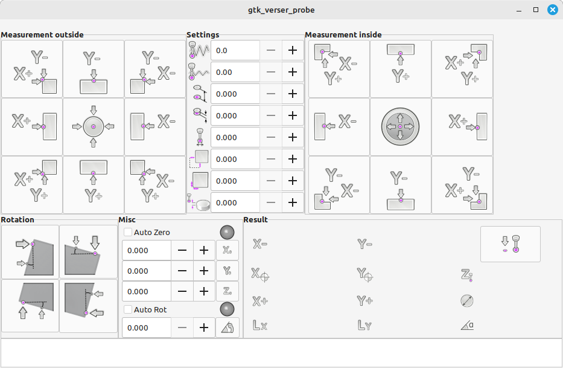
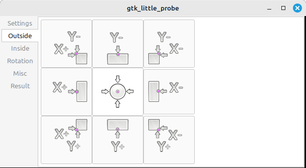

:lang: en
:toc:

[[cha:gladevcp:panels]]
= GladeVCP Builtin Panels

// Custom lang highlight
// must come after the doc title, to work around a bug in asciidoc 8.6.6
:ini: {basebackend@docbook:'':ini}
:hal: {basebackend@docbook:'':hal}
:ngc: {basebackend@docbook:'':ngc}

GladeVCP can be used to *create control panels* that interface with _HAL_ and/or the motion controller.

[[sec:gladevcp:panels:builtin]]
== Builtin Virtual Control Panels

There are several *builtin panels* available.

In a terminal type `gladevcp` to see a list.

=== gtk_verser_probe
A GTK based version of the third party Verser probe.

=== gtk_little_probe
A GTK based version of the third party Verser probe in a tabbed layout for smaller displays.

