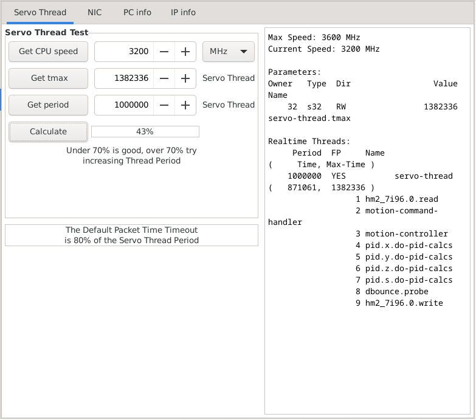
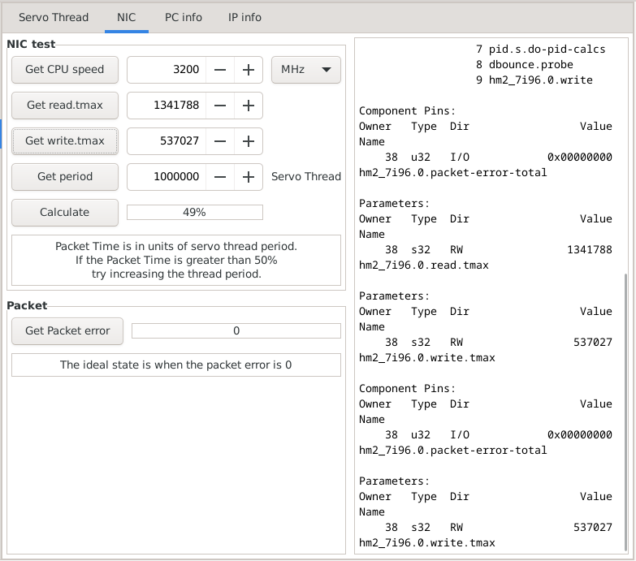

:lang: en
:toc:

[[cha:gladevcp:panels]]
= GladeVCP Builtin Panels

// Custom lang highlight
// must come after the doc title, to work around a bug in asciidoc 8.6.6
:ini: {basebackend@docbook:'':ini}
:hal: {basebackend@docbook:'':hal}
:ngc: {basebackend@docbook:'':ngc}

GladeVCP can be used to *create control panels* that interface with _HAL_ and/or the motion controller.

[[sec:gladevcp:panels:builtin]]
== Builtin Virtual Control Panels

There are several *builtin panels* available.

In a terminal type `gladevcp` to see a list.

---

=== GTK Verser Probe
A GTK based version of the third party Verser probe.


image::images/gtk_verser_probe.png["GTK Verser Probe",align="center"]

This is a version from 2015 by Serguei Glavatski which has **less functionality** than the current, but it **takes up less space on the screen** (no DRO e.g.). 
This can be useful on smaller displays.

**For Reference - The Current Version**

The documentation and source code of the current version can be found here:

 *  https://vers.ge/en/blog/useful-articles/probe-screen-v28
 *  https://github.com/verser-git/probe_screen_v2.9


**Modification of the INI file to use as embedded panel in Gmoccapy**
```ini
[DISPLAY]
DISPLAY = gmoccapy
EMBED_TAB_NAME = Probe
EMBED_TAB_LOCATION = ntb_user_tabs
EMBED_TAB_COMMAND = gladevcp -x {XID} gtk_verser_probe

[TOOLSENSOR]
RAPID_SPEED = 600

[RS274NGC]
# for package install:
SUBROUTINE_PATH = ./macros:/usr/share/linuxcnc/nc_files/gtk_probe/

# For RIP installation, use the path according to your directory:
# SUBROUTINE_PATH = ./macros:~/linuxcnc/nc_files/probe/gtk_probe/
```

**Example using dbounce with a Mesa card (HAL file)**
```hal
# ---probe signal---
loadrt dbounce names=dbounce.probe
addf dbounce.probe   servo-thread

setp dbounce.probe.delay 5
net probe-db  dbounce.probe.in    <=  hm2_7i96.0.gpio.000.in
net probe-in  motion.probe-input  <=  dbounce.probe.out
```

---
=== GTK Little Probe
A GTK based version of the third party Verser probe, modified for a tabbed layout for smaller displays.

image::images/gtk_little_probe.png["GTK little Probe",align="center"]

This is a modification of the 2015 version of GTK Verser Probe. It moves the elements from one window to containers with switchable vertical tabs. The goal was to reduce the window size.


**Modification of the INI file to use as embedded panel in Gmoccapy**
```ini
[DISPLAY]
DISPLAY = gmoccapy
EMBED_TAB_NAME = Probe
EMBED_TAB_LOCATION = ntb_preview
EMBED_TAB_COMMAND = gladevcp -x {XID} gtk_little_probe

[TOOLSENSOR]
RAPID_SPEED = 600

[RS274NGC]
# for package install:
SUBROUTINE_PATH = ./macros:/usr/share/linuxcnc/nc_files/probe/gtk_probe/

# For RIP installation, use the path according to your directory:
# SUBROUTINE_PATH = ./macros:~/linuxcnc/nc_files/probe/gtk_probe/
```
Use only one Probe Screen by Serguei Glavatski in one LCNC configuration.


**Example using dbounce with Mesa card (HAL file)**
```hal
# ---probe signal---
loadrt dbounce names=dbounce.probe
addf dbounce.probe   servo-thread

setp dbounce.probe.delay 5
net probe-db  dbounce.probe.in    <=  hm2_7i96.0.gpio.000.in
net probe-in  motion.probe-input  <=  dbounce.probe.out
```
---

=== GTK Mesa Tests
This screen allows the user to verify whether they have a suitable and well-tuned PC for their Mesa card.

Based on the design of Mesa Configuration Tool II https://github.com/jethornton/mesact Copyright (c) 2022 jethornton

Although this screen was originally part of the configurator, it is not the configurator. It is a control system. Mesa tests uses data from a running LinuxCNC, but does not send any data to LinuxCNC, nor does it set anything. Parameter adjustment is only allowed to simulate the desired state.



Servo Thread test:

 * press the "Get CPU speed" button
 * press the "Get tmax" button
 * press the "Get period" button
 * press the "Calculate" button
 * check the result [%]



NIC test:

 * press the "Get CPU speed" button
 * press the "Get read.tmax" button
 * press the "Get write.tmax" button
 * press the "Get period" button
 * press the "Calculate" button
 * check the result [%]


Mesa Tests is a tool designed for beginners to sleep better or to know if they need to buy better hardware or tune their hardware better. It is better to use tools like Halshow or Halscope to monitor the parameters (pins,thread, ...) used. The list of parameters is displayed on the right side of the screen.
