:lang: en
:toc:

[[cha:glade-vcp]]
= GladeVCP: Glade Virtual Control Panel(((GladeVCP: Glade Virtual Control Panel)))

// TODO:
// - manual-example.ui layout - really bad
// - restructure faq/troubleshooting/notes section
// - check wiki vs docs
// - check other GladeVCP docs branch against this

:ini: {basebackend@docbook:'':ini}
:hal: {basebackend@docbook:'':hal}
:ngc: {basebackend@docbook:'':ngc}
// begin a listing of INI/HAL/NGC files like so:
//[source,{ini}]
//[source,{hal}]
//[source,{ngc}]

== What is GladeVCP?

GladeVCP is a LinuxCNC component which adds the ability to add a new user interface panel to LinuxCNC user interfaces like:

* AXIS
* Touchy
* Gscreen
* GMOCCAPY

Unlike PyVCP, GladeVCP is not limited to displaying and setting HAL pins, as arbitrary actions can be executed in Python code - in fact,
a complete LinuxCNC user interface could be built with GladeVCP and Python.

GladeVCP uses the https://glade.gnome.org/[Glade] WYSIWYG user interface editor, which makes it easy to create visually pleasing panels.
It relies on the https://pygobject.readthedocs.io/en/latest/[PyGObject] bindings to the rich https://docs.gtk.org/gtk3/[GTK3] widget set,
and in fact all of these widgets may be used in a GladeVCP application - not just the specialized widgets for interacting with HAL and LinuxCNC, which are documented here.

=== PyVCP versus GladeVCP at a glance

Both support the creation of panels with 'HAL widgets' - user interface elements like LED's, buttons, sliders etc whose values are linked to a HAL pin, which in turn interfaces to the rest of LinuxCNC.

*PyVCP:*

- Widget set: uses TkInter widgets.
- User interface creation: "edit XML file / run result / evaluate looks" cycle.
- No support for embedding user-defined event handling.
- No LinuxCNC interaction beyond HAL pin I/O supported.

*GladeVCP:*

- Widget set: relies on the https://docs.gtk.org/gtk3/[GTK3] widget set.
- User interface creation: uses the  https://glade.gnome.org/[Glade] WYSIWYG user interface editor.
- Any HAL pin change may be directed to call back into a user-defined Python event handler.
- Any GTK signal (key/button press, window, I/O, timer, network events) may be associated with user-defined handlers in Python.
- Direct LinuxCNC interaction: arbitrary command execution, like initiating MDI commands to call a G-code subroutine, plus support for status change operations through Action Widgets.
- Several independent GladeVCP panels may be run in different tabs.
- Separation of user interface appearance and functionality: change appearance without touching any code.

== A Quick Tour with the Example Panel

GladeVCP panel windows may be run in three different setups:

- always visible integrated into AXIS at the right side, exactly like PyVCP panels,
- as a tab in AXIS,Touchy, Gscreen, or GMOCCAPY; in AXIS this would create a third tab besides the Preview and DRO tabs which must be raised explicitly,
- as a standalone toplevel window, which can be iconifyed/deiconified independent of the main window.

.Installed LinuxCNC
If you're using an installed version of LinuxCNC the examples shown below are in the <<cha:starting-linuxcnc,configuration picker>> in the 'Sample Configurations > apps > GladeVCP' branch.

.Git Checkout
The following instructions only apply if you're using a git checkout.
Open a terminal and change to the directory created by git then issue the commands as shown.

[NOTE]
For the following commands to work on your git checkout you must first run 'make' then run 'sudo make setuid' then run '. ./scripts/rip-environment'.
More information about a git checkout is on the LinuxCNC wiki page.

Run the sample GladeVCP panel integrated into AXIS like PyVCP as follows:

----
$ cd configs/sim/axis/gladevcp
$ linuxcnc gladevcp_panel.ini
----

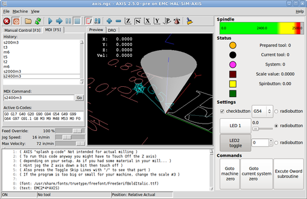

Run the same panel, but as a tab inside AXIS:

----
$ cd configs/sim/axis/gladevcp
$ linuxcnc gladevcp_tab.ini
----

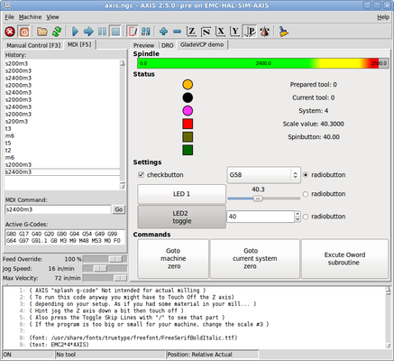

////
To run this panel as a standalone toplevel window besides AXIS, just start AXIS in the background and start GladeVCP as follows:

FIXME: I'm not sure how this is supposed to work with axis in one directory and GladeVCP in a different directory.

FIXME: there is a conflict for motion.N.spindle-speed-out since it is used by both
   axis.ini: sim_spindle_encoder.hal
   and
   manual-example.ui: manual-example.hal

commit cd36e2 Jan 5 2012 added sim_spindle_encoder.hal to axis.ini
probably after creation of manual-example.ui

----
$ cd configs/sim/axis
$ linuxcnc axis.ini &
$ cd gladevcp
$ gladevcp -c gladevcp -u ./hitcounter.py -H ./manual-example.hal ./manual-example.ui
----

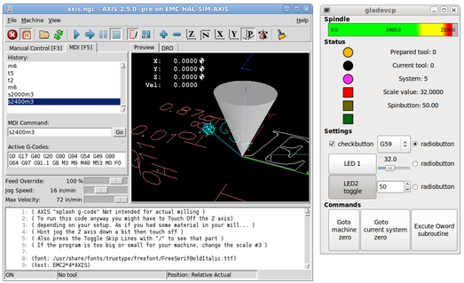
////

To run this panel inside 'Touchy':

----
$ cd configs/sim/touchy/gladevcp
$ linuxcnc gladevcp_touchy.ini
----

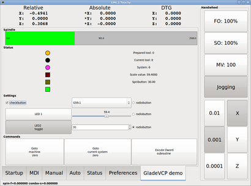

Functionally these setups are identical - they only differ in screen real estate requirements and visibility.
Since it is possible to run several GladeVCP components in parallel (with different HAL component names),
mixed setups are possible as well - for instance a panel on the right hand side, and one or more tabs for less-frequently used parts of the interface.

=== Exploring the example panel

While running configs/sim/axis/gladevcp_panel.ini or configs/sim/axis/gladevcp_tab.ini,
explore 'Show HAL Configuration' - you will find the `gladevcp` HAL component and may observe their pin values while interacting with the widgets in the panel.
The HAL setup can be found in 'configs/axis/gladevcp/manual-example.hal'.

The example panel has two frames at the bottom.
The panel is configured so that resetting ESTOP activates the Settings frame and turning the machine on  enables the Commands frame at the bottom.
The HAL widgets in the Settings frame are linked to LEDs and labels in the 'Status' frame, and to the current and prepared tool number - play with them to see the effect.
Executing the 'T<toolnumber>' and 'M6' commands in the MDI window will change the current and prepared tool number fields.

The buttons in the 'Commands' frame are 'MDI Action widgets' - pressing them will execute an MDI command in the interpreter.
The third button 'Execute Oword subroutine' is an advanced example - it takes several HAL pin values from the 'Settings' frame, and passes them as parameters to the Oword subroutine.
The actual parameters received by the routine are displayed by '(DEBUG, )' commands - see '../../nc_files/oword.ngc' for the subroutine body.

To see how the panel is integrated into AXIS, see the '[DISPLAY]GLADEVCP' statement in configs/sim/axis/gladevcp/gladevcp_panel.ini,
the '[DISPLAY]EMBED*' statement in configs/sim/axis/gladevcp/gladevcp_tab.ini and '[HAL]POSTGUI_HALFILE' statements in both configs/sim/axis/gladevcp/gladevcp_tab.ini
and configs/sim/axis/gladevcp/gladevcp_panel.ini.

=== Exploring the User Interface description

The user interface is created with the Glade UI editor - to explore it, you need to have <<gladevcp:prerequisites,Glade installed>>.
To edit the user interface, run the command

----
$ glade configs/axis/gladevcp/manual-example.ui
----

The required glade program may be named glade-gtk2 on more recent systems.

The center window shows the appearance of the UI.
All user interface objects and support objects are found in the right top window, where you can select a specific widget (or by clicking on it in the center window).
The properties of the selected widget are displayed, and can be changed, in the right bottom window.

To see how MDI commands are passed from the MDI Action widgets, explore the widgets listed under 'Actions' in the top right window,
and in the right bottom window, under the 'General' tab, the 'MDI command' property.

=== Exploring the Python callback

See how a Python callback is integrated into the example:

- In Glade, see the +hits+ label widget (a plain GTK+ widget).
- In the +button1+ widget, look at the 'Signals' tab, and find the signal 'pressed' associated with the handler 'on_button_press'.
- In hitcounter.py, see the method 'on_button_press' and see how it sets the label property in the 'hits' object.

The is just touching upon the concept - the callback mechanism will be handled in more detail in the <<gladevcp:programming,GladeVCP Programming>> section.

== Creating and Integrating a Glade user interface

[[gladevcp:prerequisites]]
=== Prerequisite: Glade installation

To view or modify Glade UI files, you need Glade 3.38.2 or later installed - it is not needed just to run a GladeVCP panel.
If the 'glade' command is missing, install it with the command:

----
$ sudo apt install glade
----

Then verify installed version, which must be equal or superior to 3.6.7:

----
$ glade --version
----

Glade contains an internal Python interpreter, and only Python 3 is supported.
This is true for Debian Bullseye, Ubuntu 21 and Mint 21 or later.
Older versions will not work, you will get a Python error.

=== Running Glade to create a new user interface

This section just outlines the initial LinuxCNC-specific steps.
For more information and a tutorial on Glade, see http://glade.gnome.org.
Some Glade tips & tricks may also be found on https://www.youtube.com[youtube].

Either modify an existing UI component by running +glade <file>.ui+ or start a new one by just running the +glade+ command from the shell.

- If LinuxCNC was not installed from a package, the LinuxCNC shell environment needs to be set up with
  `source <linuxcncdir>/scripts/rip-environment`, otherwise Glade won't find the LinuxCNC-specific widgets.
- When asked for unsaved preferences, just accept the defaults and hit 'Close'.
- From 'Toplevels' (toolbar), pick 'GtkWindow' (first entry) as top level window.
  Set 'window1' as ID in the right pane under the tab 'General'. This naming is important because GladeVCP relies on it.
- From the button with the three dots you can find the LinuxCNC specific widgets.
- Add a container like a HAL_Box or a HAL_Table from 'HAL Python' to the frame.
- Pick and place some elements like LED, button, etc. within a container.

This will look like this:

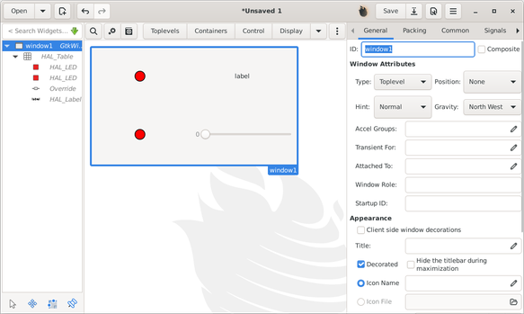

Glade tends to write a lot of messages to the shell window, which mostly can be ignored.
Select 'File'→'Save as', give it a name like 'myui.ui' and make sure it is saved as 'GtkBuilder' file (radio button left bottom corner in Save dialog).
GladeVCP will also process the older 'libglade' format correctly but there is no point in using it.
The convention for GtkBuilder file extension is '.ui'.

=== Testing a panel

You're now ready to give it a try (while LinuxCNC, e.g. AXIS is running) it with:

----
gladevcp myui.ui
----

GladeVCP creates a HAL component named like the basename of the UI file - 'myui' in this case - unless overridden by the `-c <component name>` option.
If running AXIS, just try 'Show HAL configuration' and inspect its pins.

You might wonder why widgets contained a 'HAL_Hbox' or 'HAL_Table' appear greyed out (inactive).
HAL containers have an associated HAL pin which is off by default, which causes all contained widgets to render inactive.
A common use case would be to associate these container HAL pins with `halui.machine.is-on` or one of the `halui.mode` signals, to assure some widgets appear active only in a certain state.

To just activate a container, execute the HAL command `setp gladevcp.<container-name> 1`.

=== Preparing the HAL command file

The suggested way of linking HAL pins in a GladeVCP panel is to collect them in a separate file with extension '.hal'.
This file is passed via the +POSTGUI_HALFILE=+ option in the +HAL+ section of your INI file.

CAUTION: Do not add the GladeVCP HAL command file to the AXIS +[HAL]HALFILE=+ ini section, this will not have the desired effect - see the following sections.

=== Integrating into AXIS, like PyVCP

Place the GladeVCP panel in the righthand side panel by specifying the following in the INI file:

[source,{ini}]
----
[DISPLAY]
# add GladeVCP panel where PyVCP used to live:
GLADEVCP= -u ./hitcounter.py ./manual-example.ui

[HAL]
# HAL commands for GladeVCP components in a tab must be executed via POSTGUI_HALFILE
POSTGUI_HALFILE =  ./manual-example.hal

[RS274NGC]
# gladevcp Demo specific Oword subs live here
SUBROUTINE_PATH = ../../nc_files/gladevcp_lib
----

The default HAL component name of a GladeVCP application started with the GLADEVCP option is:  `gladevcp`.

The command line actually run by AXIS in the above configuration is as follows:

----
halcmd loadusr -Wn gladevcp gladevcp -c gladevcp -x {XID} -u ./hitcounter.py ./manual-example.ui
----

You may add arbitrary `gladevcp` options here, as long as they dont collide with the above command line options.

It is possible to create a custom HAL component name by adding the +-c+ option:

[source,{ini}]
----
[DISPLAY]
# add GladeVCP panel where PyVCP used to live:
GLADEVCP= -c example -u ./hitcounter.py ./manual-example.ui
----

The command line actually run by AXIS for the above is:

----
halcmd loadusr -Wn example gladevcp -c example -x {XID} -u ./hitcounter.py ./manual-example.ui
----

[NOTE]
The file specifiers like ./hitcounter.py, ./manual-example.ui, etc. indicate that the files are located in the same directory as the INI file.
You might have to copy them to you directory (alternatively, specify a correct absolute or relative path to the file(s)).

[NOTE]
The +[RS274NGC]SUBROUTINE_PATH=+ option is only set so the example panel will find the Oword subroutine (oword.ngc) for the MDI Command widget.
It might not be needed in your setup. The relative path specifier ../../nc_files/gladevcp_lib is constructed to work with directories copied by the configuration picker and when using a run-in-place setup.

[[gladevcp:embedding-tab]]
=== Embedding as a Tab

To do so, edit your INI file and add to the DISPLAY and HAL sections of INI file as follows:

[source,{ini}]
----
[DISPLAY]
# add GladeVCP panel as a tab next to Preview/DRO:
EMBED_TAB_NAME=GladeVCP demo
EMBED_TAB_COMMAND=halcmd loadusr -Wn gladevcp gladevcp -c gladevcp -x {XID} -u ./gladevcp/hitcounter.py ./gladevcp/manual-example.ui

[HAL]
# HAL commands for GladeVCP components in a tab must be executed via POSTGUI_HALFILE
POSTGUI_HALFILE =  ./gladevcp/manual-example.hal

[RS274NGC]
# gladevcp Demo specific Oword subs live here
SUBROUTINE_PATH = ../../nc_files/gladevcp_lib
----

Note the `halcmd loadusr` way of starting the tab command - this assures that 'POSTGUI_HALFILE' will only be run after the HAL component is ready.
In rare cases you might run a command here which uses a tab but does not have an associated HAL component.
Such a command can be started without 'halcmd loadusr', and this signifies to AXIS that it does not have to wait for a HAL component since there is none.

When changing the component name in the above example, note that the names used in `-Wn <component>` and `-c <component>` must be identical.

Try it out by running AXIS - there should be a new tab called 'GladeVCP demo' near the DRO tab.
Select that tab, you should see the example panel nicely fit within AXIS.

[NOTE]
Make sure the UI file is the last option passed to GladeVCP in both the `GLADEVCP=` and `EMBED_TAB_COMMAND=` statements.

=== Integrating into Touchy

To do add a GladeVCP tab to 'Touchy', edit your INI file as follows:

[source,{ini}]
----
[DISPLAY]
# add GladeVCP panel as a tab
EMBED_TAB_NAME=GladeVCP demo
EMBED_TAB_COMMAND=gladevcp -c gladevcp -x {XID} -u ./hitcounter.py -H ./gladevcp-touchy.hal  ./manual-example.ui

[RS274NGC]
# gladevcp Demo specific Oword subs live here
SUBROUTINE_PATH = ../../nc_files/gladevcp_lib
----

[NOTE]
The file specifiers like ./hitcounter.py, ./manual-example.ui, etc. indicate that the files are located in the same directory as the INI file.
You might have to copy them to you directory (alternatively, specify a correct absolute or relative path to the file(s)).

Note the following differences to the AXIS tab setup:

- The HAL command file is slightly modified since 'Touchy' does not use the 'halui' components so its signals are not available and some shortcuts have been taken.
- There is no 'POSTGUI_HALFILE=' INI option, but passing the HAL command file on the 'EMBED_TAB_COMMAND=' line is ok.
- The 'halcmd loaduser -Wn ...' incantation is not needed.

== GladeVCP command line options

See also `man gladevcp`. These are the GladeVCP command line options:

----
Usage: gladevcp [options] myfile.ui

Options:

-h, --help::
    Show this help message and exit.

-c NAME::
    Set component name to NAME. Default is base name of UI file.

-d::
    Enable debug output

-g GEOMETRY::
    Set geometry WIDTHxHEIGHT+XOFFSET+YOFFSET. Values are in pixel units, XOFFSET/YOFFSET is referenced from top left of screen.
    Use -g WIDTHxHEIGHT for just setting size or -g +XOFFSET+YOFFSET for just position

-H FILE::
    Execute HAL statements from FILE with halcmd after the component is set up and ready

-m MAXIMUM::
    Force panel window to maximize.
    Together with the -g geometry option one can move the panel to a second monitor and force it to use all of the screen

-t THEME::
    Set gtk theme. Default is system theme. Different panels can have different themes.

-x XID::
    Re-parent GladeVCP into an existing window XID instead of creating a new top level window

-u FILE::
    Use File's as additional user defined modules with handlers

-U USEROPT::
    pass USEROPTs to Python modules
----

== Understanding the GladeVCP startup process

The integration steps outlined above look a bit tricky, and they are.
It does therefore help to understand the startup process of LinuxCNC and how this relates to GladeVCP.

The normal LinuxCNC startup process does the following:

- The realtime environment is started.
- All HAL components are loaded.
- The HAL components are linked together through the .hal cmd scripts.
- `task`, `iocontrol` and eventually the user interface is started.
- Pre-GladeVCP the assumption was: by the time the UI starts, all of HAL is loaded, plumbed and ready to go.

The introduction of GladeVCP brought the following issue:

- GladeVCP panels need to be embedded in a master GUI window setup.
- GladeVCP panels need to be embedded in a master GUI window setup, e.g., AXIS, or Touchy, Gscreen, or GMOCCAPY (embedded window or as an embedded tab).
- This requires the master GUI to run before the GladeVCP window can be hooked into the master GUI.
- However, GladeVCP is also a HAL component, and creates HAL pins of its own.
- As a consequence, all HAL plumbing involving GladeVCP HAL pins as source or destination must be run *after* the GUI has been set up.

This is the purpose of the `POSTGUI_HALFILE`. This INI option is inspected by the GUIs.
If a GUI detects this option, it runs the corresponding HAL file after any embedded GladeVCP panel is set up.
However, it does not check whether a GladeVCP panel is actually used, in which case the HAL cmd file is just run normally.
So if you do NOT start GladeVCP through `GLADEVCP` or `EMBED_TAB` etc, but later in a separate shell window or some other mechanism, a HAL command file in `POSTGUI_HALFILE` will be executed too early.
Assuming GladeVCP pins are referenced herein, this will fail with an error message indicating that the GladeVCP HAL component is not available.

So, in case you run GladeVCP from a separate shell window (i.e., not started by the GUI in an embedded fashion):

- You cannot rely on the `POSTGUI_HALFILE` INI option causing the HAL commands being run 'at the right point in time', so comment that out in the INI file.
- Explicitly pass the HAL command file which refers to GladeVCP pins to GladeVCP with the `-H <halcmd file>` option (see previous section).

== HAL Widget reference

GladeVCP includes a collection of Gtk widgets with attached HAL pins called HAL Widgets, intended to control, display or otherwise interact with the LinuxCNC HAL layer.
They are intended to be used with the Glade user interface editor.
With proper installation, the HAL Widgets should show up in Glade's 'HAL Python' widget group.
Many HAL specific fields in the Glade 'General' section have an associated mouse-over tool tip.

HAL signals come in two variants, bits and numbers.
Bits are off/on signals. Numbers can be "float", "s32" or "u32".
For more information on HAL data types see the <<sec:hal-data,HAL manual>>.
The GladeVCP widgets can either display the value of the signal with an indicator widget, or modify the signal value with a control widget.
Thus there are four classes of GladeVCP widgets that you can connect to a HAL signal.
Another class of helper widgets allow you to organize and label your panel.

- Widgets for indicating "bit" signals: <<gladevcp:hal-led,HAL_LED>>
- Widgets for controlling "bit" signals: <<gladevcp:hal-buttons,HAL_Button HAL_RadioButton HAL_CheckButton>>
- Widgets for indicating "number" signals: <<gladevcp:hal-label,HAL_Label>>,
  <<gladevcp:hal-progressbar,HAL_ProgressBar>>,
  <<gladevcp:hal-bars,HAL_HBar and HAL_VBar>>, <<gladevcp:hal-meter,HAL_Meter>>
- Widgets for controlling "number" signals: <<gladevcp:hal-spinbutton,HAL_SpinButton>>,
  <<gladevcp:hal-scales,HAL_HScale and HAL_VScale>>, <<gladevcp:jogwheel,Jog Wheel>>, <<gladevcp:speedcontrol,Speed Control>>
- Sensitive control widgets: <<gladevcp:hal-table,State_Sensitive_Table HAL_Table and HAL_HBox>>
- Tool Path preview: <<gladevcp:hal-gremlin,HAL_Gremlin>>
- Widgets to show axis positions: <<gladevcp:dro_widget,DRO Widget>>,
  <<gladevcp:combi_dro,Combi DRO Widget>>
- Widgets for file handling: <<gladevcp:iconview,IconView File Selection>>
- Widgets for display/edit of all axes offsets: <<gladevcp:offsetpage,OffsetPage>>
- Widgets for display/edit of all tool offsets: <<gladevcp:tooledit,Tooloffset editor>>
- Widget for G-code display and edit: <<gladevcp:hal-sourceview,HAL_Sourceview>>
- Widget for MDI input and history display: <<gladevcp:mdi-history,MDI History>>

=== Widget and HAL pin naming

Most HAL widgets have a single associated HAL pin with the same HAL name as the widget (glade: General→Name).

Exceptions to this rule currently are:

- 'HAL_Spinbutton' and 'HAL_ComboBox', which have two pins: a +<widgetname>-f+ (float) and a +<widgetname>-s+ (s32) pin
- 'HAL_ProgressBar', which has a +<widgetname>-value+ input pin, and a +<widgetname>-scale+ input pin.

=== Python attributes and methods of HAL Widgets

HAL widgets are instances of GtKWidgets and hence inherit the methods, properties and signals of the applicable GtkWidget class.
For instance, to figure out which GtkWidget-related methods, properties and signals a 'HAL_Button' has,
lookup the description of https://lazka.github.io/pgi-docs/#Gtk-3.0/classes/Button.html#Gtk.Button[GtkButton] in the https://lazka.github.io/pgi-docs/[PyGObject API Reference].

An easy way to find out the inheritance relationship of a given HAL widget is as follows:
Run glade, place the widget in a window, and select it; then choose the 'Signals' tab in the 'Properties' window.
For example, selecting a 'HAL_LED' widget, this will show that a 'HAL_LED' is derived from a  'GtkWidget', which in turn is derived from a 'GtkObject', and eventually a 'GObject'.

Full class hierarchy can be seen by invoking the GtkInspector while in the Glade GUI by selecting a widget then pressing Control-Shift-I.
If the Inspector doesn't open then it can be enabled from a terminal by entering:
----
gsettings set org.gtk.Settings.Debug enable-inspector-keybinding true
----
The Inspector is also handy for testing css style changes "on the fly" as well as determining all the properties and signals available for a widget.

HAL Widgets also have a few HAL-specific Python attributes:

hal_pin::
  The underlying HAL pin Python object in case the widget has a single pin type
hal_pin_s, hal_pin_f::
  The s32 and float pins of the 'HAL_Spinbutton' and 'HAL_ComboBox' widgets - note these widgets do not have a 'hal_pin' attribute!
hal_pin_scale::
  The float input pin of 'HAL_ProgressBar' widget representing the maximum absolute value of input.

The are several HAL-specific methods of HAL Widgets, but the only relevant method is:

<halpin>.get()::
  Retrieve the value of the current HAL pin, where '<halpin>' is the applicable HAL pin name listed above.

=== Setting pin and widget values

As a general rule, if you need to set a HAL output widget's value from Python code,
do so by calling the underlying Gtk 'setter' (e.g.,  +set_active()+, +set_value()+).
Do not try to set the associated pin's value by +halcomp[pinname] = value+ directly because the widget will not take notice of the change!

It might be tempting to 'set HAL widget input pins' programmatically.
Note this defeats the purpose of an input pin in the first place - it should be linked to, and react to signals generated by other HAL components.
While there is currently no write protection on writing to input pins in HAL Python, this doesn't make sense.
You might use `setp _pinname_ _value_` in the associated HAL file for testing though.

It is perfectly OK to set an output HAL pin's value with +halcomp[pinname] = value+ provided this HAL pin is not associated with a widget,
that is, has been created by the +hal_glib.GPin(halcomp.newpin(<name>,<type>,<direction>))+ method (see <<gladevcp:programming,GladeVCP Programming>> for an example).

[[gladevcp:hal-pin-changed-signal]]
=== The hal-pin-changed signal

Event-driven programming means that the UI tells your code when "something happens" - through a callback, like when a button was pressed.
The output HAL widgets (those which display a HAL pin's value) like LED, Bar, VBar, Meter, etc.,
support the `hal-pin-changed` signal, which may cause a callback into your Python code when - well, a HAL pin changes its value.
This means there's no more need for permanent polling of HAL pin changes in your code, the widgets do that in the background and let you know.

Here is an example how to set a `hal-pin-changed` signal for a HAL_LED in the Glade UI editor:

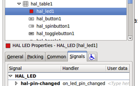

The example in +configs/apps/gladevcp/complex+ shows how this is handled in Python.

[[gladevcp:hal-buttons]]
=== Buttons

This group of widgets are derived from various Gtk buttons and consists of HAL_Button, HAL_ToggleButton, HAL_RadioButton and CheckButton widgets.
All of them have a single output BIT pin named identical to the widget.
Buttons have no additional properties compared to their base Gtk classes.

- HAL_Button: instantaneous action, does not retain state. Important signal: `pressed`
- HAL_ToggleButton, HAL_CheckButton: retains on/off state. Important signal: `toggled`
- HAL_RadioButton: a one-of-many group. Important signal: `toggled` (per button).
- Important common methods: `set_active()`, `get_active()`
- Important properties: `label`, `image`

//.Buttons
.Check button
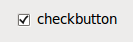

.Radio buttons
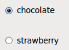

.Toggle button
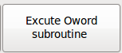

[TIP]
====
Defining radio button groups in Glade:

- Decide on default active button.
- In the other button's 'General→Group' select the default active button's name in the 'Choose a Radio Button in this project' dialog.
====

See +configs/apps/gladevcp/by-widget/+ for a GladeVCP applications and UI file for working with radio buttons.

[[gladevcp:hal-scales]]
=== Scales

HAL_HScale and HAL_VScale are derived from the GtkHScale and GtkVScale respectively.

<widgetname>::
  out FLOAT pin
<widgetname>-s::
  out s32 pin

To make a scale useful in Glade, add an 'Adjustment' (General → Adjustment → New or existing adjustment) and edit the adjustment object.
It defines the default/min/max/increment values. Also, set adjustment 'Page size' and 'Page increment' to zero to avoid warnings.

.Example HAL_HScale
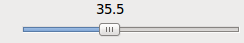

[[gladevcp:hal-spinbutton]]
=== SpinButton

HAL SpinButton is derived from GtkSpinButton and holds two pins:

<widgetname>-f::
  out FLOAT pin
<widgetname>-s::
  out s32 pin

To be useful, Spinbuttons need an adjustment value like scales, see above.

.Example SpinButton
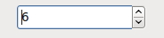

[[gladevcp:hal-dial]]
=== Hal_Dial

The hal_dial widget simulates a jogwheel or adjustment dial. +
It can be operated with the mouse. You can just use the mouse wheel, while the mouse cursor is over the Hal_Dial widget,
or you hold the left mouse button and move the cursor in circular direction to increase or degrease the counts. +
By double clicking the left or right button the scale factor can be increased or decreased.

* Counterclockwise   = reduce counts
* Clockwise          = increase counts
* Wheel up           = increase counts
* Wheel down         = reduce counts
* left Double Click  = x10 scale
* Right Double Click = /10 scale

==== Pins

`hal_dial` exports its count value as HAL pins:

<widgetname>::
  out s32 pin
<widgetname>-scaled::
  out FLOAT pin
<widgetname>-delta-scaled::
  out FLOAT pin

==== Properties

`hal_dial` has the following properties:

cpr::
  Sets the Counts per Revolution, allowed values are in the range from 25 to 360 +
  default = 100
show_counts::
  Set this to False, if you want to hide the counts display in the middle of the widget. +
  default = True
label::
  Set the content of the label which may be shown over the counts value. +
  If the label given is longer than 15 Characters, it will be cut to 15 Characters. +
  default = blank
center_color::
  This allows one to change the color of the wheel. It uses a GDK color string. +
  default = #bdefbdefbdef (gray)
count_type_shown::
  There are three counts available 0) Raw CPR counts 1) Scaled counts 2) Delta scaled counts. +
  default = 1
  * count is based on the CPR selected - it will count positive and negative. It is available as a s32 pin.
  * Scaled-count is CPR count times the scale - it can be positive and negative. +
    If you change the scale the output will immediately reflect the change. It is available as a FLOAT pin.
  * Delta-scaled-count is cpr count CHANGE, times scale. +
    If you change the scale, only the counts after that change will be scaled and then added to the current value. +
    It is available as a FLOAT pin.
scale_adjustable::
  Set this to False if you want to disallow scale changes by double clicking the widget. +
  If this is false the scale factor will not show on the widget. +
  default = True
scale::
  Set this to scale the counts. +
  default = 1.0

==== Direct program control

There are ways to directly control the widget using Python.

Using goobject to set the above listed properties:

----
[widget name].set_property("cpr",int(value))
[widget name].set_property("show_counts, True)
[widget name].set_property("center_color",gtk.gdk.Color('#bdefbdefbdef'))
[widget name].set_property('label', 'Test Dial 12345')
[widget name].set_property('scale_adjustable', True)
[widget name].set_property('scale', 10.5)
[widget name].set_property('count_type_shown', 0)
----

There are Python methods:

* `[widget name].get_value()` +
  Will return the counts value as a s32 integer
* `[widget name].get_scaled_value()` +
  Will return the counts value as a float
* `[widget name].get_delta_scaled_value()` +
  Will return the counts value as a float
* `[widget name].set_label("string")` +
  Sets the label content with "string"

There are two GObject signals emitted:

* `count_changed` +
  Emitted when the widget's count changes eg. from being wheel scrolled.
* `scale_changed` +
  Emitted when the widget's scale changes eg. from double clicking.

Connect to these like so:

----
[widget name].connect('count_changed', [count function name])
[widget name].connect('scale_changed', [scale function name])
----

The callback functions would use this pattern:

----
def [count function name](widget, count,scale,delta_scale):
----

This will return: the widget, the current count, scale and delta scale of that widget.

.Example Hal_Dial
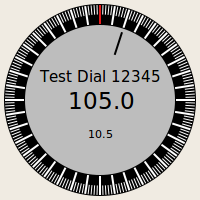

[[gladevcp:jogwheel]]
=== Jog Wheel

The `jogwheel` widget simulates a real jogwheel. It can be operated with the mouse.
You can just use the mouse wheel, while the mouse cursor is over the JogWheel widget,
or you push the left mouse button and move the cursor in circular direction to increase or degrease the counts.

* Counterclockwise = reduce counts
* Clockwise        = increase counts
* Wheel up         = increase counts
* Wheel down       = reduce counts

As moving the mouse the drag and drop way may be faster than the widget can update itself, you may loose counts turning to fast.
It is recommended to use the mouse wheel, and only for very rough movements the drag and drop way.

==== Pins

`jogwheel` exports its count value as HAL pin:

<widgetname>-s::
   out s32 pin

==== Properties

`jogwheel` has the following properties:

size::
  Sets the size in pixel of the widget, allowed values are in the range of 100 to 500
  default = 200
cpr::
  Sets the Counts per Revolution, allowed values are in the range from 25 to 100
  default = 40
show_counts::
  Set this to False, if you want to hide the counts display in the middle of the widget.
label::
  Set the content of the label which may be shown over the counts value.
  The purpose is to give the user an idea about the usage of that jogwheel.
  If the label given is longer than 12 Characters, it will be cut to 12 Characters.

==== Direct program control

There a couple ways to directly control the widget using Python.

Using GObject to set the above listed properties:

----
[widget name].set_property("size",int(value))
[widget name].set_property("cpr",int(value))
[widget name].set_property("show_counts, True)
----

There are two Python methods:

* `[widget name].get_value()` +
  Will return the counts value as integer
* `[widget name].set_label("string")` +
  Sets the label content with "string"

.Example JogWheel
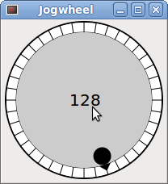

[[gladevcp:speedcontrol]]
=== Speed Control

`speedcontrol` is a widget specially made to control an adjustment with a touch screen.
It is a replacement to the normal scale widget which is difficult to slide on a touch screen.

The value is controlled with two button to increase or decrease the value.
The increment will change as long a button is pressed.
The value of each increment as well as the time between two changes can be set using the widget properties.

==== Pins

`speedcontrol` offers some HAL pin:

<widgetname>-value::
  out float pin +
  The shown value of the widget.
<widgetname>-scaled-value::
  out float pin +
  The shown value divided by the scale value, this is very useful, if the velocity is shown in units / min, but LinuxCNC expects it to be in units / second.
<widgetname>-scale::
  in float pin +
  The scale to apply. +
  Default is 60.
<widgetname>-increase::
  in bit pin +
  As long as the pin is true, the value will increase. +
  Very handy with connected momentary switch.
<widgetname>-decrease::
  in bit pin +
  As long as the pin is true, the value will decrease. +
  Very handy with connected momentary switch.

==== Properties

`speedcontrol` has the following properties:

height::
  Integer +
  The height of the widget in pixel. +
  Allowed values are 24 to 96. +
  Default is 36.
value::
  Float +
  The start value to set. +
  Allowed values are in the range from 0.001 to 99999.0. +
  Default is 10.0.
min::
  Float +
  The min allowed value. +
  Allowed values are 0.0 to 99999.0. +
  Default is 0.0. +
  If you change this value, the increment will be reset to default, so it might be necessary to set afterwards a new increment.
max::
  Float +
  The max allowed value. +
  Allowed values are 0.001 to 99999.0. +
  Default is 100.0. +
  If you change this value, the increment will be reset to default, so it might be necessary to set afterwards a new increment.
increment::
  Float +
  Sets the applied increment per mouse click. +
  Allowed values are 0.001 to 99999.0 and -1. +
  Default is -1, resulting in 100 increments from min to max.
inc_speed::
  Integer +
  Sets the timer delay for the increment speed holding pressed the buttons. +
  Allowed values are 20 to 300. +
  Default is 100.
unit::
  String +
  Sets the unit to be shown in the bar after the value. +
  Any string is allowed. +
  Default is "".
color::
  Color +
  Sets the color of the bar. +
  Any hex color is allowed. +
  Default is "#FF8116".
template::
  String +
  Text template to display the value. Python formatting is used. +
  Any allowed format. +
  Default is "%.1f".
do_hide_button::
  Boolean +
  Whether to show or hide the increment an decrement button. +
  True or False. +
  Default = False.

==== Direct program control

There a couple ways to directly control the widget using Python.

Using GObject to set the above listed properties:

----
[widget name].set_property("do_hide_button",bool(value))
[widget name].set_property("color","#FF00FF")
[widget name].set_property("unit", "mm/min")
etc.
----

There are also Python methods to modify the widget:

----
[widget name].set_adjustment(gtk-adjustment)
----

You can assign a existing adjustment to the control, that way it is easy to replace existing sliders without many code changes.
Be aware, that after changing the adjustment you may need to set a new increment, as it will be reset to its default (100 steps from MIN to MAX):

* `[widget name].get_value()` +
  Will return the counts value as float
* `[widget name].set_value(float(value))` +
  Sets the widget to the commanded value
* `[widget name].set_digits(int(value))` +
  Sets the digits of the value to be used
* `[widget name].hide_button(bool(value))` +
  Hide or show the button

.Example Speedcontrol
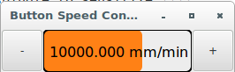

[[gladevcp:hal-label]]
=== Label

`hal_label` is a simple widget based on GtkLabel which represents a HAL pin value in a user-defined format.

label_pin_type::
  The pin's HAL type  (0:s32, 1:float, 2:u32), see also the tooltip on 'General→HAL pin type' (note this is different from PyVCP which has three label widgets, one for each type).
text_template::
  Determines the text displayed - a Python format string to convert the pin value to text.
  Defaults to +%s+ (values are converted by the str() function) but may contain any legit as an argument to Pythons format() method. +
  Example: +Distance: %.03f+ will display the text and the pin value with 3 fractional digits padded with zeros for a FLOAT pin.

[[gladevcp:hal-table]]
=== Containers

* HAL_HideTable
* HAL_Table
* State_Sensitive_Table
* HAL_HBox (deprecated)

These containers are meant to be used to insensitize (grey out) or hide their children. +
Insensitized children will not respond to input.

*HAL_HideTable*:: Has one HAL BIT input pin which controls if its child widgets are hidden or not.
+
--
*Pin:*::
`<Panel_basename>.<widgetname>`:: in bit pin +
If the pin is low then child widgets are visible which is the default state.
--
*HAL_Table* and *HAL_Hbox*::
Have one HAL BIT input pin which controls if their child widgets are sensitive or not.
+
--
*Pin:*::
`<Panel_basename>.<widgetname>`:: in bit pin +
If the pin is low then child widgets are inactive which is the default state.
--
*State_Sensitive_Table*::
Responds to the state to LinuxCNC's interpreter. +
Optionally selectable to respond to 'must-be-all-homed', 'must-be-on' and 'must-be-idle'. +
You can combine them. It will always be insensitive at Estop. +
(Has no pin).
 +
[WARNING]
**HAL_Hbox is deprecated - use HAL_Table.** +
If current panels use it, it won't fail. You just won't find it in the GLADE editor anymore. +
Future versions of GladeVCP may remove this widget completely and then you will need to update the panel.

[TIP]
====
If you find some part of your GladeVCP application is 'grayed out' (insensitive), see whether a HAL_Table pin is unset or unconnected.
====

[[gladevcp:hal-led]]
=== LED

The `hal_led` simulates a real indicator LED. +
It has a single input BIT pin which controls its state: ON or OFF.

==== Properties

LEDs have several properties which control their look and feel:

on_color::
  String defining ON color of LED. +
  May be any valid gdk.Color name. +
  Not working on Ubuntu 8.04.
off_color::
  String defining OFF color of LED. +
  May be any valid gdk.Color name or special value `dark`. `dark` means that OFF color will be set to 0.4 value of ON color. +
  Not working on Ubuntu 8.04.
pick_color_on, pick_color_off::
  Colors for ON and OFF states. +
  These may be represented as `#RRRRGGGGBBBB` strings and are optional properties which have precedence over `on_color` and `off_color`.
led_size::
  LED radius (for square - half of LED's side)
led_shape::
  LED Shape. +
  Valid values are 0 for round, 1 for oval and 2 for square shapes.
led_blink_rate::
  If set and LED is ON then it is blinking. +
  Blink period is equal to "led_blink_rate" specified in milliseconds.
create_hal_pin::
  Select/deselect creation of a HAL pin to control the LED. +
  With no HAL pin created LED can be controlled with a Python function.

==== Signals

As an input widget, LED also supports the +hal-pin-changed+ signal.
If you want to get a notification in your code when the LED's HAL pin was changed, then connect this signal to a handler, for example +on_led_pin_changed+ and provide the handler as follows:

[source,python]
----
def on_led_pin_changed(self,hal_led,data=None):
    print("on_led_pin_changed() - HAL pin value:",hal_led.hal_pin.get())
----

This will be called at any edge of the signal and also during program
start up to report the current value.

.Example LEDs
image::images/leds.png[]

[[gladevcp:hal-progressbar]]
=== ProgressBar

[NOTE]
====
This widget might go away. +
Use the HAL_HBar and HAL_VBar widgets instead.
====

==== Pins

The `HAL_ProgressBar` is derived from gtk.ProgressBar and has two float
HAL input pins:

<widgetname>::
  the current value to be displayed
<widgetname>-scale::
  the maximum absolute value of input

==== Properties

`HAL_ProgressBar` has the following properties:

scale::
  Value scale. +
  Sets the maximum absolute value of input. Same as setting the <widgetname>.scale pin. +
  A float, range from -2^24 to +2^24.
green_limit::
  Green zone lower limit
yellow_limit::
  Yellow zone lower limit
red_limit::
  Red zone lower limit
text_template::
  Text template to display the current value of the +<widgetname>+ pin. +
  Python formatting may be used for dict +{"value":value}+.

.Example HAL_ProgressBar
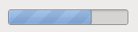

[[gladevcp:hal_combobox]]
=== ComboBox

`HAL_ComboBox` is derived from gtk.ComboBox. It enables choice of a value from a dropdown list.

==== Pins

`HAL_ComboBox` exports two HAL pins:

<widgetname>-f::
  Current value, type FLOAT
<widgetname>-s::
  Current value, type s32

==== Properties

`HAL_ComboBox` has the following property which can be set in Glade:

column::
  The column index. +
  Type s32. +
  Valid range from -1..100. +
  Defaults value -1.

In default mode this widgets sets the pins to the index of the chosen list entry.
So if your widget has three labels, it may only assume values 0,1 and 2.

In column mode (column > -1), the value reported is chosen from the ListStore array as defined in Glade.
So typically your widget definition would have two columns in the ListStore, one with text displayed in the dropdown, and an int or float value to use for that choice.

There's an example in +configs/apps/by-widget/combobox.{py,ui}+ which uses column mode to pick a float value from the ListStore.

If you're confused like me about how to edit ComboBox ListStores and CellRenderer, see https://youtu.be/Z5_F-rW2cL8.

[[gladevcp:hal-bars]]
=== Bars

`HAL_Bar` and `HAL_VBar` widgets for horizontal and vertical bars representing float values.

==== Pins

`HAL_Bar` and `HAL_VBar` each have one input FLOAT HAL pin.

==== Properties

`HAL_Bar` and `HAL_VBar` both bars have the following properties:

invert::
  Swap min and max direction. +
  An inverted HBar grows from right to left, an inverted VBar from top to bottom.
min, max::
  Minimum and maximum value of desired range.
  It is not an error condition if the current value is outside this range.
show limits::
  Used to select/deselect the limits text on bar.
zero::
  Zero point of range. +
  If it is inside of min/max range then the bar will grow from that value and not from the left (or right) side of the widget. +
  Useful to represent values that may be both positive or negative.
force_width, force_height::
  Forced width or height of widget. +
  If not set then size will be deduced from packing or from fixed widget size and bar will fill whole area.
text_template::
  Like in Label, sets text format for min/max/current values. +
  Can be used to turn off value display.
value::
  Sets the bar display to the value entered. +
  Used only for testing in GLADE editor. +
  The value will be set from a HAL pin.
target value::
  Sets the target line to the value entered. +
  Used only for testing in GLADE editor. +
  The value will can be set in a Python function.
target_width::
  Width of the line that marks the target value.
bg_color::
  Background (inactive) color of bar.
target_color::
  Color of the the target line.
z0_color, z1_color, z2_color::
  Colors of different value zones. +
  Defaults are `green`, `yellow` and `red`. +
  For description of zones see `z*_border` properties.
z0_border, z1_border::
  Define up bounds of color zones. +
  By default only one zone is enabled.
  If you want more then one zone set `z0_border` and `z1_border` to desired values so zone 0 will fill from 0 to first border,
  zone 1 will fill from first to second border and zone 2 from last border to 1. +
  Borders are set as fractions. +
  Valid values range from 0 to 1.

.Horizontal bar
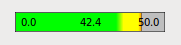

.Vertical bar
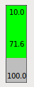

[[gladevcp:hal-meter]]
=== Meter

`HAL_Meter` is a widget similar to PyVCP meter - it represents a float value.

==== Pins

`HAL_Meter` has one input FLOAT HAL pin.

==== Properties

HAL Meter has the following properties:

min, max::
  Minimum and maximum value of desired range. +
  It is not an error condition if the current value is outside this range.
force_size::
  Forced diameter of widget. +
  If not set then size will be deduced from packing or from fixed widget size, and meter will fill all available space with respect to aspect ratio.
text_template::
  Like in Label, sets text format for current value. +
  Can be used to turn off value display.
label::
  Large label above center of meter.
sublabel::
  Small label below center of meter.
bg_color::
  Background color of meter.
z0_color, z1_color, z2_color::
  Colors of different value zones. +
  Defaults are `green`, `yellow` and `red`. +
  For description of zones see `z*_border` properties.
z0_border, z1_border::
  Define up bounds of color zones. +
  By default only one zone is enabled.
  If you want more then one zone set `z0_border` and `z1_border` to desired values so zone 0 will fill from min to first border,
  zone 1 will fill from first to second border and zone 2 from last border to max. +
  Borders are set as values in range min-max.

.Example HAL Meters
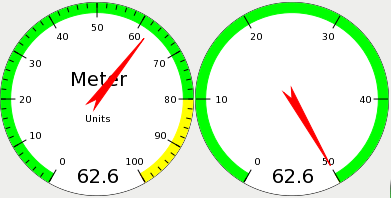

[[gladevcp:hal-graph]]
=== HAL_Graph

This widget is for plotting values over time.

[[gladevcp:hal-gremlin]]
=== Gremlin tool path preview for NGC files

Gremlin is a plot preview widget similar to the AXIS preview window.
It assumes a running LinuxCNC environment like AXIS or Touchy.
To connect to it, inspects the INI_FILE_NAME environment variable.
Gremlin displays the current NGC file - it does monitor for changes and reloads the ngc file if the file name in AXIS/Touchy changes.
If you run it in a GladeVCP application when LinuxCNC is not running, you might get a traceback because the Gremlin widget can't find LinuxCNC status, like the current file name.

==== Pins

Gremlin does not export any HAL pins.

==== Properties

Gremlin has the following properties:

enable_dro::
  This displays the dro on the graphics. +
  Default = true.
show_velocity::
  This displays the tool speed. +
  Default = true.
use_commanded::
  This selects the DRO to use: commanded or actual values. +
  Default = true.
metric_units::
  This selects the DRO to use: metric or imperial units. +
  Default = true.
show_rapids::
  This tells the plotter to show the rapid moves. +
  Default = true.
show_dtg_::
  This selects the DRO to display the distance-to-go value. +
  Default = true.
use_relative::
  This selects the DRO to show values relative to user system or machine coordinates. +
  Default = true.
show_live_plot::
  This tells the plotter to draw or not. +
  Default = true.
show_limits::
  This tells the plotter to show the machine's limits. +
  Default = true.
show_lathe_radius::
  This selects the DRO to display the X axis in radius or diameter, if in lathe
  mode (selectable in the INI file with LATHE = 1). +
  Default = true.
show_extents_option::
  This tells the plotter to show the machine's extents. +
  Default = true.
show_tool::
  This tells the plotter to draw the tool. +
  Default = true.
show_program::
  Shows the G-code program. +
  Default = True
use_joints_mode::
  Used in non trivialkins machines (e.g., robots). +
  Default = false.
grid_size::
  Sets the size of the grid (only visible in the X, Y and Z views). +
  Defaults to 0
use_default_controls::
  This disables the default mouse controls. +
  This is most useful when using a touchscreen as the default controls do not work well. You can programmatically
  add controls using Python and the handler file technique. +
  Default = true.
view::
  May be any of `x`, `y`, `y2` , `z`, `z2` , `p` (perspective). +
  Defaults to `z` view.
enable_dro::
  Type = boolean. +
  Whether to draw a DRO on the plot or not. +
  Default = true.
mouse_btn_mode::
  Type = integer. +
  Mouse button handling: leads to different functions of the button:
  * 0 = default: left rotate, middle move,   right zoom
  * 1 =          left zoom,   middle move,   right rotate
  * 2 =          left move,   middle rotate, right zoom
  * 3 =          left zoom,   middle rotate, right move
  * 4 =          left move,   middle zoom,   right rotate
  * 5 =          left rotate, middle zoom,   right move
  * 6 =          left move,   middle zoom,   right zoom

Mode 6 is recommended for plasmas and lathes, as rotation is not needed for such machines.

==== Direct program control

There a couple ways to directly control the widget using Python.

Using GObject to set the above listed properties:

----
[widget name].set_property('view','P')
[widget name].set_property('metric_units',False)
[widget name].set_property('use_default_controls',False)
[widget name].set_property('enable_dro' False)
[widget name].set_property('show_program', False)
[widget name].set_property('show_limits', False)
[widget name].set_property('show_extents_option', False)
[widget name].set_property('show_live_plot', False)
[widget name].set_property('show_tool', False)
[widget name].set_property('show_lathe_radius',True)
[widget name].set_property('show_dtg',True)
[widget name].set_property('show_velocity',False)
[widget name].set_property('mouse_btn_mode', 4)
----

There are Python methods:

----
[widget name].show_offsets = True
[widget name].grid_size = .75
[widget name].select_fire(event.x,event.y)
[widget name].select_prime(event.x,event.y)
[widget name].start_continuous_zoom(event.y)
[widget name].set_mouse_start(0,0)
[widget name].gremlin.zoom_in()
[widget name].gremlin.zoom_out()
[widget name].get_zoom_distance()
[widget name].set_zoom_distance(dist)
[widget name].clear_live_plotter()
[widget name].rotate_view(x,y)
[widget name].pan(x,y)
----

Hints::
  - If you set all the plotting options false but show_offsets true you get an offsets page instead of a graphics plot.
  - If you get the zoom distance before changing the view then reset the zoom distance, it is much more user friendly.
  - if you select an element in the preview, the selected element will be used as rotation center point

.Gremlin Example
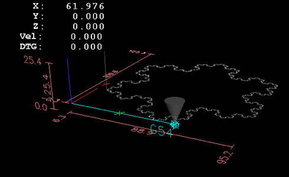

[[gladevcp:hal-offset]]
=== HAL_Offset

The `HAL_Offset` widget is used to display the offset of a single axis.

==== Properties

`HAL_Offset` has the following properties:

display_units_mm::
  Display in metric units.
joint_number::
  Used to select which axis (technically which joint) is displayed. +
  On a trivialkins machine (mill, lathe, router) axis vs. joint number are:
+
  0:X  1:Y  2:Z  3:A  4:B  5:C  6:U  7:V  8:W
+
mm_text_template::
  You can use Python formatting to display the position with different precision.
imperial_text_template::
  You can use Python formatting to display the position with different precision.
reference_type::
+
  0:G5x 1:tool 2:G92 3:Rotation around Z

[[gladevcp:dro_widget]]
=== DRO widget

The DRO widget is used to display the current axis position.

==== Properties

It has the following properties:

display_units_mm::
  Used to toggle the display units between metric and imperial.
  Default is False.
actual::
  Select actual (feedback) position or commanded position.
  Default is True.
diameter::
  Display diameter for a lathe.
  Default is False.
mm_text_template::
  You can use Python formatting to display the position with different precision.
  Default is "%10.3f".
imperial_text_template::
  You can use Python formatting to display the position with different precision.
  Default is "%9.4f".
joint_number::
  Used to select which axis (technically which joint) is displayed.
  Default is 0. +
  On a trivialkins machine (mill, lathe, router) axis vs. joint number are:
+
  0:X  1:Y  2:Z  3:A  4:B  5:C  6:U  7:V  8:W +
+
reference_type::
  * 0 = `absolute` <<sec:machine-coordinate-system,(machine origin)>>.
  * 1 = `relative` (to current user coordinate origin - G5x).
  * 2 = `distance-to-go` (relative to current user coordinate origin).
  Default is 0.
font_family::
  Specify the font family e.g. mono. Defaults to sans.
  If the font does not exist then the current system font will be used.
  Default is sans.
font_size::
  Specify the size of the font between 8 and 96.
  Default is 26.
font_weight::
  Specify the weight of the font. Select from lighter, normal, bold, or bolder.
  Default is bold.
unhomed_color::
  The text color when unhomed specified as a Gdk.RGBA color.
  Default is red,
  Gdk.RGBA(red=1.000000, green=0.000000, blue=0.000000, alpha=1.000000)
homed_color::
  The text color when homed specified as a Gdk.RGBA color.
  Default is green,
  Gdk.RGBA(red=0.000000, green=0.501961, blue=0.000000, alpha=1.000000)
Hints::
  - If you want the display to be right justified, set the Horizontal Alignment to `End`.
  - The background of the widget is actually see through, so if you place it over an image, the DRO numbers will show on top of it with no background.
    There is a special technique to do this.  See the animated function diagrams below.
  - The DRO widget is a modified gtk label widget.
    As such, much of what can be done to a gtk label can be done to the DRO widget.
  - The font properties may also be set from a css stylesheet which has the highest priority and will override values set by GObject properties.

==== Direct program control

There a couple ways to directly control the widget using Python.

Using GObject to set the above listed properties::

----
[widget name].set_property("display_units_mm", True)
[widget name].set_property("actual", True)
[widget name].set_property("diameter", True)
[widget name].set_property("mm_text_template", "%10.3f")
[widget name].set_property("imperial_text_template", "%9.4f")
[widget name].set_property("joint_number", 3)
[widget name].set_property("reference_type", 3)
[widget name].set_property("font_family", "mono")
[widget name].set_property("font_size", 30)
[widget name].set_property("font_weight", "bold")
----

----
# it is easier to read colors by calling a function:
def str_to_rgba(color):
  c = Gdk.RGBA()
  c.parse(color)
  return c

[widget name].set_property("unhomed_color", str_to_rgba("magenta"))
[widget name].set_property("homed_color", str_to_rgba("cyan"))
----

Using a CSS stylesheet to set font properties::

Colors may be specified in one of several formats, these would all specify the same color, red, *#ff0000, *rgb(255,0,0), or rgba(255,0,0,255).

Colors may be referenced either collectively:

----
.dro_unhomed {color: magenta}
.dro_homed {color: cyan}
----

or individually by widget name:

----
#[widget name].dro_unhomed {color: magenta}
#[widget name].dro_homed {color: cyan}
----

The other style properties need to be referenced by widget name:

----
#[widget name], #[widget name], #[widget name] {
    font-family: mono;
    font-size: 60px;
    font-weight: lighter;
}
----

There are two Python methods::

----
[widget name].set_dro_inch()
[widget name].set_dro_metric()
----

[[gladevcp:combi_dro]]
=== Combi_DRO widget

The `Combi_DRO` widget is used to display the current, the relative axis position and the distance to go in one DRO. +
By clicking on the DRO the Order of the DRO will toggle around. +
In Relative Mode the actual coordinate system will be displayed.

==== Properties

`Combi_DRO` has the following properties:

joint_number::
  Used to select which axis (technically which joint) is displayed. +
  On a trivialkins machine (mill, lathe, router) axis/joint numbers are:
+
  0:X  1:Y  2:Z  etc.
+
actual::
  Select actual (feedback) or commanded position.
metric_units::
  Used to toggle the display units between metric and imperial.
auto_units::
  Units will toggle between metric and imperial according to the active G-code being G20 or G21. +
  Default is TRUE.
diameter::
  Whether to display position as diameter or radius. +
  In diameter mode the DRO will display the joint value multiplied by 2.
mm_text_template::
  You can use Python formatting to display the position with different precision. +
  Default is "%10.3f".
imperial_text_template::
  You can use Python formatting to display the position with different precision. +
  Default is "%9.4f".
homed_color::
  The foreground color of the DRO numbers if the joint is homed. +
  Default is green.
unhomed_color::
  The foreground color of the DRO numbers if the joint is not homed. +
  Default is red.
abs_color::
  The background color of the DRO, if main DRO shows absolute coordinates. +
  Default is blue.
rel_color::
  The background color of the DRO, if main DRO shows relative coordinates. +
  Default is black.
dtg_color::
  The background color of the DRO, if main DRO shows distance to go. +
  Default is yellow.
font_size::
  The font size of the big numbers, the small ones will be 2.5 times smaller. +
  The value must be an integer in the range of 8 to 96. +
  Default is 25.
toggle_readout::
  A left mouse click will toggle the DRO readout through the different modes ["Rel", "Abs", "DTG"]. +
  By unchecking the box you can disable that behavior. The toggling can still be done with `[widget name].toggle_readout()`. +
  Value must be boolean. +
  Default is TRUE.
cycle_time::
  The time the DRO waits between two polls. +
  This setting should only be changed if you use more than 5 DRO at the same time, i.e. on a 6 axis config, to avoid that the DRO slows down the main application too much. +
  The value must be an integer in the range of 100 to 1000. FIXME unit=ms ? +
  Default is 150.

==== Direct program control

Using GObject to set the above listed properties:

----
[widget name].set_property(property, value)
----

There are several Python methods to control the widget:

* `[widget name].set_to_inch(state)` +
  Sets the DRO to show imperial units. +
  `state` = boolean (True or False) +
  Default is FIXME.
* `[widget name].set_auto_units(state)` +
  If True the DRO will change units according to active G-code (G20 / G21). +
  `state` = boolean (True or False) +
  Default is True.
* `[widget name].set_to_diameter(state)` +
  If True the DRO will show the diameter not the radius, i.e., the axis value multiplied by 2 (specially needed for lathes). +
  `state` = boolean (True or False) +
  Default is False.
* `[widget name].toggle_readout()` +
  Toggles the order of the DRO in the widget.
* `[widget name].change_axisletter(letter)` +
  Changes the automatically given axis letter. +
  Very useful to change an lathe DRO from 'X' to 'R' or 'D'. +
  `letter` = string
* `[widget name].get_order()` +
  Returns the order of the DRO in the widget mainly used to maintain them consistent. +
  The order will also be transmitted with the clicked signal. +
  Returns a list containing the order.
* `[widget name].set_order(order)` +
  Sets the order of the DRO, mainly used to maintain them consistent. +
  `order` = list object, must be one of:
  ** `["Rel", "Abs", "DTG"]` (default)
  ** `["DTG", "Rel", "Abs"]`
  ** `["Abs", "DTG", "Rel"]`
* `[widget name].get_position()` +
  Returns the position of the DRO as a list of floats. +
  The order is independent of the order shown on the DRO and will be given as `[Absolute , relative , DTG]`. +
  ** `Absolute` = the machine coordinates, depends on the actual property will give actual or commanded position. +
  ** `Relative` = will be the coordinates of the actual coordinate system. +
  ** `DTG` = the distance to go. +
     Will mostly be 0, as this function should not be used while the machine is moving, because of time delays.

The widget will emit the following signals:

* `clicked` +
  This signal is emitted, when the user has clicked on the Combi_DRO widget. +
  It will send the following data:
  ** `widget` = widget object +
     The widget object that sends the signal.
  ** `joint_number` = integer +
     The joint number of the DRO, where '0:X  1:Y  2:Z  etc'.
  ** `order` = list object +
     The order of the DRO in that widget. +
     The order may be used to set other Combi_DRO widgets to the same order with `[widget name].set_order(order)`.
* `units_changed` +
  This signal is emitted if the DRO units are changed. +
  It will send the following data:
  ** `widget` = widget object +
     The widget object that sends the signal.
  ** `metric_units` = boolean +
     True if the DRO does display metric units, False in case of imperial display.
* `system_changed` +
  This signal is emitted if the DRO units are changed. +
  It will send the following data:
  ** `widget` = widget object +
     The widget object that sends the signal.
  ** `system` = string +
     The actual coordinate system.
     Will be one of G54 G55 G56 G57 G58 G59 G59.1 G59.2 G59.3 or Rel if none has been selected at all, what will only happen in Glade with no LinuxCNC running.

There are some information you can get through commands, which may be of interest for you:

* `[widget name].system` +
  The actual system, as mentioned in the system_changed signal.
* `[widget name].homed` +
  True if the joint is homed.
* `[widget name].machine_units` +
  0 if Imperial, 1 if Metric.

.Example: Three Combi_DRO in a window
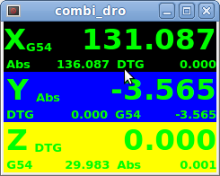

----
X = Relative Mode
Y = Absolute Mode
Z = DTG Mode
----

[[gladevcp:iconview]]
=== IconView (File Select)

This is a touch screen friendly widget to select a file and to change directories.

==== Properties

`IconView` widget has the following properties:

icon_size::
  Sets the size of the displayed icon. +
  Allowed values are integers in the range from 12 to 96. +
  Default is 48.
start_dir::
  Sets the directory to start in when the widget is shown first time. +
  Must be a string, containing a valid directory path. +
  Default is "/".
jump_to_dir::
  Sets the "jump to" directory, which is selected by the corresponding button in the bottom button list (the 5th button counting from the left). +
  Must be a string, containing a valid directory path. +
  Default is "\~".
filetypes::
  Sets the file filter for the objects to be shown. +
  Must be a string containing a comma separated list of extensions to be shown. +
  Default is "ngc,py".
sortorder::
  Sets the sorting order of the displayed icon. +
  Must be an integer value from 0 to 3, where: +
  * 0 = ASCENDING (sorted according to file names)
  * 1 = DESCENDING (sorted according to file names)
  * 2 = FOLDERFIRST (show the folders first, then the files), default
  * 3 = FILEFIRST (show the files first, then the folders)

==== Direct program control

Using GObject to set the above listed properties:

----
[widget name].set_property(property,Value)
----

There are Python methods to control the widget:

* `[widget name].show_buttonbox(state)` +
  If False the bottom button box will be hidden. +
  This is helpful in custom screens, with special buttons layouts to not alter the layout of the GUI.
  Good example for that is GMOCCAPY. +
  `state` = boolean (True or False). +
  Default is True.
* `[widget name].show_filelabel(state)` +
  If True the file label (between the IconView window and the bottom button box) will be shown. +
  Hiding this label may save place, but showing it is very useful for debugging reasons. +
  `state` = boolean (True or False). +
  Default is True.
* `[widget name].set_icon_size(iconsize)` +
  Sets the icon size. +
  Must be an integer in the range from 12 to 96. +
  Default = 48.
* `[widget name].set_directory(directory)` +
  Allows to set an directory to be shown. +
  `directory` = string (a valid file path).
* `[widget name].set_filetypes(filetypes)` +
  Sets the file filter to be used. +
  Only files with the given extensions will be shown. +
  `filetypes` = string containing a comma separated list of extensions. +
  Default = "ngc,py".
* `[widget name].get_selected()` +
  Returns the path of the selected file, or `None` if a directory has been selected.
* `[widget name].refresh_filelist()` +
  Refreshes the filelist. +
  Needed if you add a file without changing the directory.

If the button box has been hidden, you can reach the functions of this button through its clicked signals like so:

----
[widget name].btn_home.emit("clicked")
[widget name].btn_jump_to.emit("clicked")
[widget name].btn_sel_prev.emit("clicked")
[widget name].btn_sel_next.emit("clicked")
[widget name].btn_get_selected.emit("clicked")
[widget name].btn_dir_up.emit("clicked")
[widget name].btn_exit.emit("clicked")
----

==== Signals

The widget will emit the following signals:

* `selected` +
  This signal is emitted when the user selects an icon. +
  It will return a string containing a file path if a file has been selected, or `None` if a directory has been selected.
* `sensitive` +
  This signal is emitted when the buttons change their state from sensitive to not sensitive or vice versa. +
  This signal is useful to maintain surrounding GUI synchronized with the button of the widget. See GMOCCAPY as example. +
  It will return the **buttonname** and the new **state**: +
  ** `buttonname` is one of `btn_home`, `btn_dir_up`, `btn_sel_prev`,
     `btn_sel_next`, `btn_jump_to` or `btn_select`.
  ** `state` is a boolean and will be True or False.
* `exit` +
  This signal is emitted when the exit button has been pressed to close the IconView. +
  Mostly needed if the application is started as stand alone.

.Iconview Example
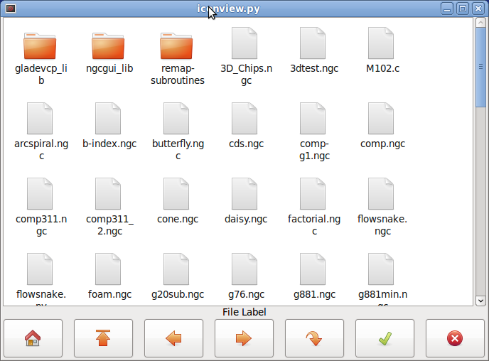

[[gladevcp:calculator]]
=== Calculator widget

This is a simple calculator widget, that can be used for numerical input. +
You can preset the display and retrieve the result or that preset value. +

==== Properties

`calculator` has the following properties:

is_editable::
  This allows the entry display to be typed into from a keyboard.
font::
  This allows you to set the font of the display.

==== Direct program control

There a couple ways to directly control the widget using Python.

Using goobject to set the above listed properties:

----
[widget name].set_property("is_editable",True)
[widget name].set_property("font","sans 25")
----

There are Python methods:

* `[widget name].set_value(2.5)` +
  This presets the display and is recorded.
* `[widget name].set_font("sans 25")`
* `[widget name].set_editable(True)`
* `[widget name].get_value()` +
  Returns the calculated value - a float.
* `[widget name].set_editable(True)` +
* `[widget name].get_preset_value()` +
  Returns the recorded value: a float.

[[gladevcp:tooledit]]
=== Tooleditor widget

This is a `tooleditor` widget for displaying and modifying a tool file. +
If in lathe mode, it will display wear offsets and tool offsets separately. +
Wear offsets are designated by tool number above 10000 (Fanuc style). +
It checks the current file once a second to see if LinuxCNC updated it.

NOTE: LinuxCNC requires remapping of tool calls to actually use wear offsets.

==== Properties

`tooleditor` has the following properties:

font:: 
  Display font to use
hide_columns::
  This will hide the given columns. +
  The columns are designated (in order) as such: `s,t,p,x,y,z,a,b,c,u,v,w,d,i,j,q`. +
  You can hide any number of columns including the select and comments.
lathe_display_type::
  Show lathe format

==== Direct program control

There a couple ways to directly control the widget using Python.

Using goobject to set the above listed properties:

----
[widget name].set_properties('hide_columns','uvwijq')
----

This would hide the uvwij and q columns and show all others.

There are Python methods:

* `[widget name].set_visible("ijq",False)` +
  Would hide ij and Q columns and leave the rest as they were.
* `[widget name].set_filename(path_to_file)` +
  Sets and loads the tool file.
* `[widget name].reload(None)` +
  Reloads the current toolfile.
* `[widget name].set_font('sans 16,tab='1')` +
  Sets the (Pango) font on the Tab, column title, and tool data. +
  The `all_offsets`, `wear_offsets`, `tool_offsets` can be set at the same time by adding 1, 2 and/or 3 to the tab string. +
  Default is all the tabs set.
* `[widget name].set_title_font('sans 16,tab='1')` +
  Sets the (Pango) font on the column titles only. +
  The `all_offsets`, `wear_offsets`, `tool_offsets` can be set at the same time by adding 1, 2 and/or 3 to the tab string. +
  Default is all the tabs set.
* `[widget name].set_tab_font('sans 16,tab='1')` +
  Sets the (Pango) font on the tabs only. +
  The `all_offsets`, `wear_offsets`, `tool_offsets` can be set at the same time by adding 1, 2 and/or 3 to the tab string. +
  Default is all the tabs set.
* `[widget name].set_col_visible("abcUVW", False, tab='1')` +
  This would hide (False) the abcuvw columns on tab 1 (all_offsets)
* `[widget name].set_lathe_display(value)` +
  Hides or shows the wear and tool offset tabs used for lathes
* `[widget name].get_toolinfo(toolnum)` +
  Returns the tool information array of the requested toolnumber or current tool if no tool number is specified. +
  Returns None if tool not found in table or if there is no current tool.
* `[widget name].hide_buttonbox(self, True)` +
  'Convenience' method to hide buttons. +
  You must call this after show_all().
* `[widget name].get_selected_tool()` +
  Return the user selected (highlighted) tool number.
* `[widget name].set_selected_tool(toolnumber)` +
  Selects (highlights) the requested tool.

.Tooleditor Example
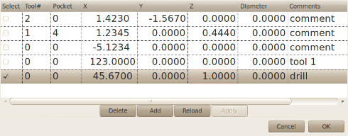

[[gladevcp:offsetpage]]
=== Offsetpage

The `Offsetpage` widget is used to display/edit the offsets of all the axes. +
It has convenience buttons for zeroing G92 and Rotation-Around-Z offsets. +
It will only allow you to select the edit mode when the machine is on and idle. +
You can directly edit the offsets in the table at this time.
Unselect the edit button to allow the `OffsetPage` to reflect changes.

==== Properties

It has the following properties:

display_units_mm::
  Display in metrice units
hide_columns::
  A no-space list of columns to hide.
  The columns are designated (in order) as such: `xyzabcuvwt`. +
  You can hide any of the columns.
hide_rows::
  A no-space list of rows to hide. +
  The rows are designated (in order) as such: `0123456789abc`. +
  You can hide any of the rows.
font::
  Sets text font type and size.
highlight_color::
  When editing this is the highlight color.
foreground_color::
  When `OffsetPage` detects an active user coordinate system it will use this color for the text.
mm_text_template::
  You can use Python formatting to display the position with different precision.
imperial_text_template::
  You can use Python formatting to display the position with different precision.

==== Direct program control

There a couple ways to directly control the widget using Python.

Using goobject to set the above listed properties:

----
[widget name].set_property("highlight_color",gdk.Color('blue'))
[widget name].set_property("foreground_color",gdk.Color('black'))
[widget name].set_property("hide_columns","xyzabcuvwt")
[widget name].set_property("hide_rows","123456789abc")
[widget name].set_property("font","sans 25")
----

There are Python methods to control the widget:

* `[widget name].set_filename("../../../configs/sim/gscreen/gscreen_custom/sim.var")`
* `[widget name].set_col_visible("Yabuvw",False)`
* `[widget name].set_row_visible("456789abc",False)`
* `[widget name].set_to_mm()`
* `[widget name].set_to_inch()`
* `[widget name].hide_button_box(True)`
* `[widget name].set_font("sans 20")`
* `[widget name].set_highlight_color("violet")`
* `[widget name].set_foreground_color("yellow")`
* `[widget name].mark_active("G55")` +
  Allows you to directly set a row to highlight, e.g., in case you wish to use your own navigation controls.
  See the chapter on <<cha:gmoccapy,GMOCCAPY>>.
* `[widget name].selection_mask = ("Tool","Rot","G5x")` +
  These rows are NOT selectable in edit mode.
* `[widget name].set_names([['G54','Default'],["G55","Vice1"],['Rot','Rotational']])` +
  This allows you to set the text of the 'T' column of each/any row. +
  This is a list of a list of offset-name/user-name pairs. +
  The default text is the same as the offset name.
* `[widget name].get_names()` +
  This returns a list of a list of row-keyword/user-name pairs. +
  The user name column is editable, so saving this list is user friendly. +
  See `set_names` above.

.Offsetpage Example
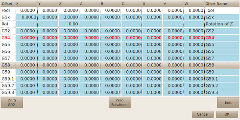

[[gladevcp:hal-sourceview]]
=== HAL_sourceview widget

This is for displaying and simple editing of G-code.
It looks for `.ngc` highlighting specs in `~/share/gtksourceview-4/language-specs/`.
The current running line will be highlighted.

With external Python glue code it can:

* Search for text, undo and redo changes.
* Be used for program line selection.

==== Direct program control

There are Python methods to control the widget:

* `[widget name].redo()` +
  Redo one level of changes.
* `[widget name].undo()` +
  Undo one level of changes
* `[widget name].text_search(direction=True,mixed_case=True,text='G92')` +
  Searches forward (direction = True) or backward, +
  Searches with mixed case (mixed_case = True) or exact match
* `[widget name].set_line_number(linenumber)` +
  Sets the line to highlight. +
  Uses the sourceview line numbers.
* `[widget name].get_line_number()` +
  Returns the currently highlighted line.
* `[widget name].line_up()` +
  Moves the highlighted line up one line.
* `[widget name].line_down()` +
  Moves the highlighted line down one line.
* `[widget name].load_file('filename')` +
  Loads a file. +
  Using None (not a filename string) will reload the same program.
* `[widget name].get_filename()` +
  FIXME description

.Sourceview Example
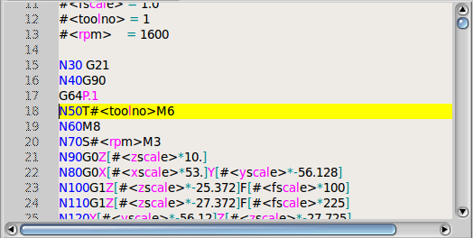

[[gladevcp:mdi-history]]
=== MDI history

This is for displaying and entering MDI codes. +
It will be automatically grayed out when MDI is not available, e.g., during E-stop and program running.

==== Properties

font_size_tree::
  Integer value between 8 and 96. +
  Will modify the default font size of the treeview to the selected value.
font_size_entry::
  Integer value between 8 and 96. +
  Will modify the default font size of the entry to the selected value. +
use_double_click::
  Boolean, True enables the mouse double click feature and a double click on an entry will submit that command. +
  It is not recommended to use this feature on real machines, as a double click on a wrong entry may cause dangerous situations.

==== Direct program control

Using goobject to set the above listed properties:

----
[widget name].set_property("font_size_tree",10)
[widget name].set_property("font_size_entry",20)
[widget name].set_property("use_double_click",False)
----

=== Animated function diagrams: HAL widgets in a bitmap

For some applications it might be desirable to have a background image - like a functional diagram - and position widgets at appropriate places in that image.
A good combination is setting a bitmap background image, like from a .png file, making the GladeVCP window fixed-size, and use the Glade Fixed widget to position widgets on this image.
The code for the below example can be found in `configs/apps/gladevcp/animated-backdrop`:

.HAL widgets in a bitmap Example
image::images/small-screenshot.png[align="center"]

== Action Widgets Reference

GladeVCP includes a collection of "canned actions" called **VCP Action Widgets** for the Glade user interface editor.

[NOTE]
====
Other than HAL widgets, which interact with HAL pins, VCP Actions interact with LinuxCNC and the G-code interpreter.
====

VCP Action Widgets are derived from the `Gtk.Action` widget.

The Action widget in a nutshell:

- It is an object available in Glade
- It has no visual appearance by itself
- Its purpose: Associate a visible, sensitive UI component like menu, toolbutton, button with a command.
  See these widget's 'General→Related→Action' property.
- The "canned action" will be executed when the associated UI component is triggered (button press, menu click..).
- It provides an easy way to execute commands without resorting to Python programming.

The appearance of VCP Actions in Glade is roughly as follows:

.Action Widgets
image::images/vcp-actions.png[align="center"]

Tooltip hovers provide a description.

=== VCP Action Widgets

VCP Action widgets are one-shot type widgets.
They implement a single action and are for use in simple buttons, menu entries or radio/check groups.

=== VCP Action Python

This widget is used to execute small arbitrary Python code.

The command string may use special keywords to access important functions.

* 'ACTION' for access to the ACTION command library.
* `GSTAT` for access to the Gstat status message library.
* 'INFO' for access to collected data from the INI file. 
* 'HAL' for access to the HAL linuxcnc Python module
* `STAT` for access to LinuxCNC's raw status via the LinuxCNC Python module.
* `CMD` for access to LinuxCNC's commands via the LinuxCNC Python module.
* `EXT` for access to the handler file functions if available.
* `linuxcnc` for access to the LinuxCNC Python module.
* `self` for access to the widget instance.
* 'dir' for access to the handlers list of attributes.

There are options to

- select when the widget will be active,
- set the mode before the command is executed.

Example command to just print a message to the terminal:

[source,python]
----
print('action activated')
----

Example command to set the machine to off state:

[source,python]
----
CMD.state(linuxcnc.STATE_OFF)
----

Example command to call a handler function that passes data:

[source,python]
----
EXT.on_button_press(self, 100)
----

You can use a semicolon to separate multiple commands;

[source,python]
----
print('Set Machine Off');CMD.state(linuxcnc.STATE_OFF)
----

More information on INFO and ACTION can be found here: <<cha:gladevcp-libraries,GladeVCP Libraries modules>>.

More information on GStat can be found here: <<cha:gstat,GStat>>.

=== VCP ToggleAction widgets

These are **bi-modal** widgets.
They implement two actions or use a second (usually `pressed`) state to indicate that currently an action is running.
Toggle actions are aimed for use in `ToggleButtons`, `ToggleToolButtons` or toggling menu items.
A simplex example is the `ESTOP` toggle button.

Currently the following widgets are available:

- The `ESTOP` toggle sends `ESTOP` or `ESTOP_RESET` commands to LinuxCNC depending on its state.
- The `ON/OFF` toggle sends `STATE_ON` and `STATE_OFF` commands.
- `Pause/Resume` sends `AUTO_PAUSE` or `AUTO_RESUME` commands.

The following toggle actions have only one associated command and use the `pressed` state to indicate that the requested operation is running:

- The `Run` toggle sends an `AUTO_RUN` command and waits in the `pressed` state until the interpreter is idle again.
- The `Stop` toggle is inactive until the interpreter enters the active state (is running G-code) and then allows user to send `AUTO_ABORT` command.
- The `MDI` toggle sends given MDI command and waits for its completion in `pressed` inactive state.

=== The Action_MDI Toggle and Action_MDI widgets

These widgets provide a means to execute arbitrary MDI commands. +
The `Action_MDI` widget does not wait for command completion as the `Action_MDI` Toggle does, which remains disabled until command complete.

=== A simple example: Execute MDI command on button press

`configs/apps/gladevcp/mdi-command-example/whoareyou.ui` is a Glade UI file which conveys the basics:

. Open it in Glade and study how it is done.
. Start AXIS, and then start this from a terminal window with `gladevcp whoareyou.ui`.
. See the `hal_action_mdi1` action and its `MDI command` property - this just executes `(MSG, "Hi, I'm an VCP_Action_MDI")` so there should be a message popup in AXIS like so:

.Action_MDI Simple Example
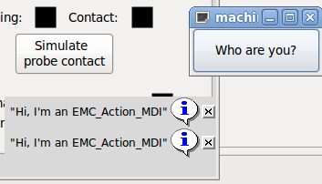

You'll notice that the button associated with the Action_MDI action is grayed out if the machine is off, in E-Stop or if the interpreter is running.
It will automatically become active when the machine is turned on and out of E-Stop, and the program is idle.

=== Parameter passing with Action_MDI and ToggleAction_MDI widgets

Optionally, `MDI command` strings may have parameters substituted before they are passed to the interpreter.
Parameters currently may be names of HAL pins in the GladeVCP component.
This is how it works:

- assume you have a 'HAL SpinBox' named +speed+, and you want to pass its current value as a parameter in an MDI command.
- The HAL SpinBox will have a float-type HAL pin named speed-f (see HalWidgets description).
- To substitute this value in the MDI command, insert the HAL pin name enclosed like so: `${pin-name}`
- for the above HAL SpinBox, we could use `(MSG, "The speed is: ${speed-f}")` just to show what's happening.

The example UI file is `configs/apps/gladevcp/mdi-command-example/speed.ui`.
Here's what you get when running it:

.Action_MDI Parameter Passing Example
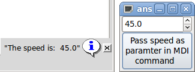

=== An advanced example: Feeding parameters to an O-word subroutine

It's perfectly OK to call an O-word subroutine in an MDI command, and pass HAL pin values as actual parameters.
An example UI file is in `configs/apps/gladevcp/mdi-command-example/owordsub.ui`.

Place `nc_files/gladevcp_lib/oword.ngc` so AXIS can find it, and run `gladevcp owordsub.ui` from a terminal window.
This looks like so:

.Action_MDI Advanced Example
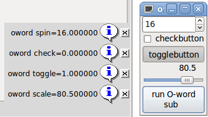

=== Preparing for an MDI Action, and cleaning up afterwards

The LinuxCNC G-code interpreter has a single global set of variables, like feed, spindle speed, relative/absolute mode and others.
If you use G-code commands or O-word subs, some of these variables might get changed by the command or subroutine - for example, a probing subroutine will very likely set the feed value quite low.
With no further precautions, your previous feed setting will be overwritten by the probing subroutine's value.

To deal with this surprising and undesirable side effect of a given O-word subroutine or G-code statement executed with an LinuxCNC ToggleAction_MDI,
you might associate pre-MDI and post-MDI handlers with a given LinuxCNC ToggleAction_MDI.
These handlers are optional and provide a way to save any state before executing the MDI Action, and to restore it to previous values afterwards.
The signal names are +mdi-command-start+ and +mdi-command-stop+; the handler names can be set in Glade like any other handler.

Here's an example how a feed value might be saved and restored by such handlers
(note that LinuxCNC command and status channels are available as `self.linuxcnc` and `self.stat` through the VCP_ActionBase class):

[source,python]
----
    def on_mdi_command_start(self, action, userdata=None):
        action.stat.poll()
        self.start_feed = action.stat.settings[1]

    def on_mdi_command_stop(self, action, userdata=None):
        action.linuxcnc.mdi('F%.1f' % (self.start_feed))
        while action.linuxcnc.wait_complete() == -1:
            pass
----

Only the `Action_MDI` Toggle widget supports these signals.

[NOTE]
====
In a later release of LinuxCNC, the new M-codes M70-M72 will be available.
They will make saving state before a subroutine call, and restoring state on return much easier.
====

=== Using the LinuxCNC Stat object to deal with status changes

Many actions depend on LinuxCNC status - is it in manual, MDI or auto mode?
Is a program running, paused or idle?
You cannot start an MDI command while a G-code program is running, so this needs to be taken care of.
Many LinuxCNC actions take care of this themselves, and related buttons and menu entries are deactivated when the operation is currently impossible.

When using Python event handlers - which are at a lower level than Actions - one needs to take care of dealing with status dependencies oneself.
For this purpose, there's the LinuxCNC Stat widget: to associate LinuxCNC status changes with event handlers.

LinuxCNC Stat has no visible component - you just add it to your UI with Glade.
Once added, you can associate handlers with its following signals:

* state-related:
  - `state-estop`: emitted when E-Stop condition occurs,
  - `state-estop-reset`: emitted when machine is reset,
  - `state-on`: emitted when machine is turned on,
  - `state-off`: emitted when machine is turned off.
* mode-related:
  - `mode-manual`: emitted when LinuxCNC enters manual mode,
  - `mode-mdi`: emitted when LinuxCNC enters MDI mode,
  - `mode-auto`: emitted when LinuxCNC enters automatic mode,
* interpreter-related: emitted when the G-code interpreter changes into that mode
  - `interp-run`
  - `interp-idle`
  - `interp-paused`
  - `interp-reading`
  - `interp-waiting`
  - `file-loaded`
  - `line-changed`
* homing-related: emitted when LinuxCNC is homed or not
  - `all-homed`
  - `not-all-homed`

[[gladevcp:programming]]
== GladeVCP Programming

=== User Defined Actions

Most widget sets, and their associated user interface editors, support the concept of callbacks,
i.e. functions in user-written code which are executed when 'something happens' in the UI - events like mouse clicks, characters typed, mouse movement, timer events, window hiding and exposure and so forth.

HAL output widgets typically map input-type events like a button press to a value change of the associated HAL pin by means of such a - predefined - callback.
Within PyVCP, this is really the only type of event handling supported - doing something more complex, like executing MDI commands to call a G-code subroutine, is not supported.

Within GladeVCP, HAL pin changes are just one type of the general class of events (called signals) in GTK+.
Most widgets may originate such signals, and the Glade editor supports associating such a signal with a Python method or function name.

If you decide to use user-defined actions, your job is to write a Python module whose class methods - or in the simple case, just functions - can be referred to in Glade as event handlers.
GladeVCP provides a way to import your module(s) at startup and will automatically link your event handlers with the widget signals as set in the Glade UI description.

=== Core Library

There are three libraries of functions that can be used to help program GladeVCP.

* 'Info': collects details from the INI file.
* 'Action': A collection of functions to change LinuxCNC states.
* 'Status': Reports the state of LinuxCNC. It wraps around 'Gstat'.

Importing and instantiating the libraries:

[source,python]
----
from gladevcp.core import Info, Action

ACTION = Action()
INFO = Info()
----

Using the library functions:

[source,python]
----
print(INFO.MACHINE_IS_METRIC)
ACTION.SET_ERROR_MESSAGE('Something went wrong')
----

More information can be found here: <<cha:gladevcp-libraries,GladeVCP Libraries modules>>.
There is a sample configuration that demonstrates using the core library with GladeVCP's action Python widgets and with a Python handler file.
Try loading 'sim/axis/gladevcp/gladevcp_panel_tester'.

=== An example: adding custom user callbacks in Python

This is just a minimal example to convey the idea - details are laid out in the rest of this section.

GladeVCP can not only manipulate or display HAL pins, you can also write regular event handlers in Python.
This could be used, among others, to execute MDI commands. Here's how you do it:

Write a Python module like so and save as e.g. handlers.py:

[source,python]
----
nhits = 0
def on_button_press(gtkobj,data=None):
    global nhits
    nhits += 1
    gtkobj.set_label("hits: %d" % nhits)
----

In Glade, define a button or HAL button, select the 'Signals' tab, and in the GtkButton properties select the 'pressed' line.
Enter 'on_button_press' there, and save the Glade file.

Then add the option '-u handlers.py' to the GladeVCP command line.
If your event handlers are spread over several files, just add multiple '-u <pyfilename>' options.

Now, pressing the button should change its label since it is set in the callback function.

What the `+-u+` flag does: all Python functions in this file are collected and setup as potential callback handlers for your Gtk widgets - they can be referenced from Glade 'Signals' tabs.
The callback handlers are called with the particular object instance as parameter, like the GtkButton instance above, so you can apply any GtkButton method from there.

Or do some more useful stuff, like calling an MDI command!

=== HAL value change events

HAL input widgets, like a LED, automatically associate their HAL pin state (on/off) with the optical appearance of the widget (LED lit/dark).

Beyond this built-in functionality, one may associate a change callback with any HAL pin, including those of predefined HAL widgets.
This fits nicely with the event-driven structure of a typical widget application:
Every activity, be it mouse click, key, timer expired, or the change of a HAL pin's value, generates a callback and is handled by the same orthogonal mechanism.

For user-defined HAL pins not associated with a particular HAL widget, the signal name is 'value-changed'.
See the <<gladevcp:adding-hal-pins,Adding HAL pins>> section below for details.

HAL widgets come with a pre-defined signal called 'hal-pin-changed'.
See the <<gladevcp:hal-pin-changed-signal,HAL Widgets>> section for details.

=== Programming model

The overall approach is as follows:

- Design your UI with Glade, and set signal handlers where you want actions associated with a widget.
- Write a Python module which contains callable objects (see 'handler models' below).
- Pass your module's path name to GladeVCP with the '-u <module>' option.
- GladeVCP imports the module, inspects it for signal handlers and connects them to the widget tree.
- The main event loop is run.

==== The simple handler model

For simple tasks it is sufficient to define functions named after the Glade signal handlers.
These will be called when the corresponding event happens in the widget tree.
Here's a trivial example - it assumes that the 'pressed' signal of a Gtk Button or HAL Button is linked to a callback called 'on_button_press':

[source,python]
----
nhits = 0
def on_button_press(gtkobj,data=None):
    global nhits
    nhits += 1
    gtkobj.set_label("hits: %d" % nhits)
----

Add this function to a Python file and run as follows:

----
gladevcp -u <myhandler>.py mygui.ui
----

Note communication between handlers has to go through global variables, which does not scale well and is positively un-pythonic.
This is why we came up with the class-based handler model.

==== The class-based handler model

The idea here is: Handlers are linked to class methods.
The underlying class(es) are instantiated and inspected during GladeVCP startup and linked to the widget tree as signal handlers.
So the task now is to write:

- One or more several class definition(s) with one or several methods, in one module or split over several modules,
- a function 'get_handlers' in each module which will return a list of class instances to GladeVCP - their method names will be linked to signal handlers.

Here is a minimum user-defined handler example module:

[source,python]
----
class MyCallbacks :
    def on_this_signal(self,obj,data=None):
        print("this_signal happened, obj=",obj)

def get_handlers(halcomp,builder,useropts):
    return [MyCallbacks ()]
----

Now, 'on_this_signal' will be available as signal handler to your widget tree.

==== GladeVCP-specific signals

For GladeVCP panel which respond to HAL inputs it may be important that the handler code can tell that the GladeVCP panel is currently active and displayed.
For example a panel inside the Touchy interface might well need to perform an action when the switch connected to touchy.cycle-start is operated (in the same way that the native tabs respond differently to the same button). +
To make this possible, a signal is sent from the GUI (at the time of writing, only Touchy) to the embedded tab.
The signal is of type "Gladevcp" and the two messages sent are "Visible" and "Hidden".
(Note that the signals have a fixed length of 20 characters so only the first characters should be used in any comparison, hence the [:7] below.)
A sample handler for these signals is:

[source,python]
----
    # This catches our messages from another program
    def event(self,w,event):
        print(event.message_type,event.data)
        if event.message_type == 'Gladevcp':
            if event.data[:7] == 'Visible':
                self.active = True
            else:
                self.active = False

    # connect to client-events from the host GUI
    def on_map_event(self, widget, data=None):
        top = widget.get_toplevel()
        print("map event")
        top.connect('client-event', self.event)
----

==== The get_handlers protocol

If during module inspection GladeVCP finds a function `get_handlers`, it calls it as follows:

----
get_handlers(halcomp,builder,useropts)
----

The arguments are:

- `halcomp` - refers to the HAL component under construction,
- `builder` - widget tree - result of reading the UI definition (either referring to a GtkBuilder or libglade-type object),
- `useropts` - a list of strings collected from the GladeVCP command line `-U <useropts>` option.

GladeVCP then inspects the list of class instances and retrieves their method names.
Qualifying method names are connected to the widget tree as signal handlers.
Only method names which do not begin with an '_' (underscore) are considered.

Note that regardless whether you're using the libglade or the new GtkBuilder format for your Glade UI, widgets can always be referred to as `builder.get_object(<widgetname>)`.
Also, the complete list of widgets is available as `builder.get_objects()` regardless of UI format.

=== Initialization sequence

It is important to know in which state of affairs your `get_handlers()` function is called so you know what is safe to do there and what not.
First, modules are imported and initialized in command line order.
After successful import, `get_handlers()` is called in the following state:

- The widget tree is created, but not yet realized (no toplevel `window.show()` has been executed yet).
- The halcomp HAL component is set up and all HAL widgets' pins have already been added to it.
- It is safe to add more HAL pins because `halcomp.ready()` has not yet been called at this point, so you may add your own pins, for instance in the class `__init__()` method.

Once all modules have been imported and method names extracted, the following steps happen:

- All qualifying method names will be connected to the widget tree with `connect_signals()/signal_autoconnect()` (depending on the type of UI imported - GtkBuilder vs the old libglade format).
- The HAL component is finalized with halcomp.ready().
- If a window ID was passed as argument, the widget tree is re-parented to run in this window, and Glade's toplevel window1 is abandoned (see FAQ).
- If a HAL command file was passed with `-H halfile`, it is executed with halcmd.
- The Gtk main loop is run.

So when your handler class is initialized, all widgets are existent but not yet realized (displayed on screen).
And the HAL component isn't ready as well, so its unsafe to access pins values in your `__init__()` method.

If you want to have a callback to execute at program start after it is safe to access HAL pins, then a connect a handler to the realize signal of the top level window1 (which might be its only real purpose).
At this point GladeVCP is done with all setup tasks, the HAL file has been run, and GladeVCP is about to enter the Gtk main loop.

=== Multiple callbacks with the same name

Within a class, method names must be unique.
However, it is OK to have multiple class instances passed to GladeVCP by get_handlers() with identically named methods.
When the corresponding signal occurs, these methods will be called in definition order - module by module, and within a module, in the order class instances are returned by `get_handlers()`.

=== The GladeVCP `-U <useropts>` flag

Instead of extending GladeVCP for any conceivable option which could potentially be useful for a handler class, you may use the -U <useroption> flag (repeatedly if you wish).
This flag collects a list of <useroption> strings.
This list is passed to the get_handlers() function (useropts argument).
Your code is free to interpret these strings as you see fit.
An possible usage would be to pass them to the Python exec function in your `get_handlers()` as follows:

[source,python]
----
debug = 0
...
def get_handlers(halcomp,builder,useropts):
    ...
    global debug # assuming there's a global var
    for cmd in useropts:
        exec cmd in globals()
----

This way you can pass arbitrary Python statements to your module through the `gladevcp -U` option, for example:

----
gladevcp -U debug=42 -U "print 'debug=%d' % debug" ...
----

This should set debug to 2 and confirm that your module actually did it.

=== Persistent variables in GladeVCP

An annoying aspect of GladeVCP in its earlier form and PyVCP is the fact that you may change values and HAL pins through text entry, sliders, spin boxes, toggle buttons, etc.,
but their settings are not saved and restored at the next run of LinuxCNC - they start at the default value as set in the panel or widget definition.

GladeVCP has an easy-to-use mechanism to save and restore the state of HAL widgets, and program variables (in fact any instance attribute of type int, float, bool or string).

This mechanism uses the popular INI file format to save and reload persistent attributes.

.Persistence, program versions and the signature check

Imagine renaming, adding or deleting widgets in Glade:
An .INI file lying around from a previous program version, or an entirely different user interface, would be not be able to restore the state properly since variables and types might have changed.

GladeVCP detects this situation by a signature which depends on all object names and types which are saved and to be restored.
In the case of signature mismatch, a new INI file with default settings is generated.

=== Using persistent variables

If you want any of Gtk widget state, HAL widgets output pin's values and/or class attributes of your handler class to be retained across invocations, proceed as follows:

- Import the `gladevcp.persistence` module.
- Decide which instance attributes, and their default values you want to have retained, if any.
- Decide which widgets should have their state retained.
- Describe these decisions in your handler class' `\__init()__` method through a nested dictionary as follows:

[source,python]
----
def __init__(self, halcomp,builder,useropts):
    self.halcomp = halcomp
    self.builder = builder
    self.useropts = useropts
    self.defaults = {
        # the following names will be saved/restored as method attributes
        # the save/restore mechanism is strongly typed - the variables type will be derived from the type of the
        # initialization value. Currently supported types are: int, float, bool, string
        IniFile.vars : { 'nhits' : 0, 'a': 1.67, 'd': True ,'c' : "a string"},
        # to save/restore all widget's state which might remotely make sense, add this:
        IniFile.widgets : widget_defaults(builder.get_objects())
        # a sensible alternative might be to retain only all HAL output widgets' state:
        # IniFile.widgets: widget_defaults(select_widgets(self.builder.get_objects(), hal_only=True,output_only = True)),
    }
----

Then associate an INI file with this descriptor:

[source,python]
----
self.ini_filename = __name__ + '.ini'
self.ini = IniFile(self.ini_filename,self.defaults,self.builder)
self.ini.restore_state(self)
----

After `restore_state()`, self will have attributes set if as running the following:

[source,python]
----
self.nhits = 0
self.a = 1.67
self.d = True
self.c = "a string"
----

Note that types are saved and preserved on restore.
This example assumes that the INI file didn't exist or had the default values from self.defaults.

After this incantation, you can use the following IniFile methods:

ini.save_state(obj)::
  Saves objs's attributes as per `IniFile.vars` dictionary and the widget state as described in `IniFile.widgets` in `self.defaults`.
ini.create_default_ini()::
  Create an INI file with default values.
ini.restore_state(obj)::
  Restore HAL out pins and obj's attributes as saved/initialized to default as above.

=== Saving the state on GladeVCP shutdown

To save the widget and/or variable state on exit, proceed as follows:

- Select some interior widget (type is not important, for instance a table).
- In the 'Signals' tab, select 'GtkObject'. It should show a 'destroy' signal in the first column.
- Add the handler name, e.g. 'on_destroy', to the second column.
- Add a Python handler like below:

[source,python]
----
import gtk
...
def on_destroy(self,obj,data=None):
    self.ini.save_state(self)
----

This will save state and shutdown GladeVCP properly, regardless whether the panel is embedded in AXIS, or a standalone window.

[CAUTION]
====
Do not use `window1` (the toplevel window) to connect a 'destroy' event.
Due to the way a GladeVCP panel interacts with AXIS, if a panel is embedded within AXIS, *window1 will not receive destroy events properly*.
However, since on shutdown all widgets are destroyed, anyone will do.
Recommended: use a second-level widget - for instance, if you have a table container in your panel, use that.
====

Next time you start the GladeVCP application, the widgets should come up in the state when the application was closed.

[CAUTION]
====
The 'GtkWidget' line has a similarly sounding 'destroy-event' - *dont use that to connect to the 'on_destroy' handler, it wont work* - make sure you use the 'destroy' event from the 'GtkObject' line.
====

=== Saving state when Ctrl-C is pressed

By default, the reaction of GladeVCP to a Ctrl-C event is to just exit - _without_ saving state.
To make sure that this case is covered, add a handler call `on_unix_signal` which will be automatically be called on Ctrl-C (actually on the SIGINT and SIGTERM signals).
Example:

[source,python]
----
def on_unix_signal(self,signum,stack_frame):
    print("on_unix_signal(): signal %d received, saving state" % (signum))
    self.ini.save_state(self)
----

=== Hand-editing INI (.ini) files

You can do that, but note that the values in self.defaults override your edits if there is a syntax or type error in your edit.
The error is detected, a console message will hint about that happened, and the bad inifile will be renamed to have the .BAD suffix.
Subsequent bad INI files overwrite earlier .BAD files.

[[gladevcp:adding-hal-pins]]
=== Adding HAL pins

If you need HAL pins which are not associated with a specific HAL widget, add them as follows:

[source,python]
----
import hal_glib
...
# in your handler class __init__():
self.example_trigger = hal_glib.GPin(halcomp.newpin('example-trigger', hal.HAL_BIT, hal.HAL_IN))
----

To get a callback when this pin's value changes, associate a `value-change` callback with this pin, add:

[source,python]
----
self.example_trigger.connect('value-changed', self._on_example_trigger_change)
----

and define a callback method (or function, in this case leave out the `self` parameter):

[source,python]
----
# note '_' - this method will not be visible to the widget tree
def _on_example_trigger_change(self,pin,userdata=None):
    print("pin value changed to:" % (pin.get()))
----

=== Adding timers

Since GladeVCP uses Gtk widgets which rely on the https://pygobject.readthedocs.io/en/latest/[PyGObject] base class, the full GLib functionally is available.
Here is an example for a timer callback:

[source,python]
----
def _on_timer_tick(self,userdata=None):
    ...
    return True # to restart the timer; return False for on-shot
...
# demonstrate a slow background timer - granularity is one second
# for a faster timer (granularity 100 ms), use this:
# GLib.timeout_add(100, self._on_timer_tick,userdata) # 10Hz
GLib.timeout_add_seconds(1, self._on_timer_tick)
----

=== Setting HAL widget properties programmatically

With Glade, widget properties are typically set fixed while editing.
You can, however, set widget properties at runtime, for instance from INI file values, which  would typically be done in the handler initialization code.
Setting properties from HAL pin values is possible, too.

In the following example (assuming a HAL Meter widget called `meter`), the meter's min value is set from an INI file parameter at startup,
and the max value is set via a HAL pin, which causes the widget's scale to readjust dynamically:

[source,python]
----
import linuxcnc
import os
import hal
import hal_glib

class HandlerClass:

    def _on_max_value_change(self,hal_pin,data=None):
        self.meter.max = float(hal_pin.get())
        self.meter.queue_draw() # force a widget redraw

    def __init__(self, halcomp,builder,useropts):
        self.builder = builder

        # HAL pin with change callback.
        # When the pin's value changes the callback is executed.
        self.max_value = hal_glib.GPin(halcomp.newpin('max-value',  hal.HAL_FLOAT, hal.HAL_IN))
        self.max_value.connect('value-changed', self._on_max_value_change)

        inifile = linuxcnc.ini(os.getenv("INI_FILE_NAME"))
        mmin = float(inifile.find("METER", "MIN") or 0.0)
        self.meter = self.builder.get_object('meter')
        self.meter.min = mmin

def get_handlers(halcomp,builder,useropts):
    return [HandlerClass(halcomp,builder,useropts)]
----

=== Value-changed callback with hal_glib

GladeVCP uses the hal_glib library, which can be used to connect a "watcher" signal on a HAL input pin. +
This signal can be used to register a function to call when the HAL pin changes state. +

One must import the `hal_glib` and the `hal` modules:

[source,python]
----
import hal_glib
import hal
----

Then make a pin and connect a 'value-changed' (the watcher) signal to a function call:

[source,python]
----
class HandlerClass:
    def __init__(self, halcomp,builder,useropts):
        self.example_trigger = hal_glib.GPin(halcomp.newpin('example-trigger', hal.HAL_BIT, hal.HAL_IN))
        self.example_trigger.connect('value-changed', self._on_example_trigger_change)
----

And have a function to be called:

[source,python]
----
    def _on_example_trigger_change(self,pin,userdata=None):
        print("pin value changed to: {}".format(pin.get()))
        print("pin name= {}".format(pin.get_name()))
        print("pin type= {}".format(pin.get_type()))

        # this can be called outside the function
        self.example_trigger.get()
----

=== Examples, and rolling your own GladeVCP application

Visit `linuxcnc_root_directory/configs/apps/gladevcp` for running examples and starters for your own projects.

== FAQ

[qanda]

I get an unexpected unmap event in my handler function right after startup. What's this?::
  This is a consequence of your Glade UI file having the window1 Visible property set to True, together with re-parenting the GladeVCP window into AXIS or touchy.
  The GladeVCP widget tree is created, including a top level window, and then 'reparented into AXIS', leaving that toplevel window laying around orphaned.
  To avoid having this useless empty window hanging around, it is unmapped (made invisible), which is the cause of the unmap signal you get.
  Suggested fix: set window1.visible to False, and ignore an initial unmap event.

My GladeVCP program starts, but no window appears where I expect it to be?::
  The window AXIS allocates for GladeVCP will obtain the 'natural size' of all its child widgets combined.
  It is the child widget's job to request a size (width and/or height).
  However, not all widgets do request a width greater than 0, for instance the Graph widget in its current form.
  If there's such a widget in your Glade file and it is the one which defines the layout you might want to set its width explicitly.
  Note that setting the window1 width and height properties in Glade does not make sense because this window will be orphaned during re-parenting and hence its geometry will have no impact on layout (see above).
  The general rule is: if you manually run a UI file with 'gladevcp <uifile>' and its window has reasonable geometry, it should come up in AXIS properly as well.

I want a blinking LED, but it wont blink::
  I ticked the checkbutton to let it blink with 100 msec interval.
  It wont blink, and I get a startup warning: Warning: value "0" of type `gint' is invalid or out of range for property `led-blink-rate' of type `gint'?
  This seems to be a Glade bug. Just type over the blink rate field, and save again - this works for me.

My GladeVCP panel in AXIS doesn't save state when I close AXIS, although I defined an on_destroy handler linked to the window destroy signal::
  Very likely this handler is linked to window1, which due to reparenting isn't usable for this purpose.
  Please link the on_destroy handler to the destroy signal of an interior window.
  For instance, I have a notebook inside window1, and linked on_destroy to the notebooks destroy signal, and that works fine.
  It doesn't work for window1.

I want to set the background color or text of a HAL_Label widget depending on its HAL pin value::
  See the example in configs/apps/gladevcp/colored-label.
  Setting the background color of a GtkLabel widget (and HAL_Label is derived from GtkLabel) is a bit tricky.
  The GtkLabel widget has no window object of its own for performance reasons, and only window objects can have a background color.
  The solution is to enclose the Label in an EventBox container, which has a window but is otherwise invisible - see the coloredlabel.ui file.

// FIXME: This is probably irrelevant now that we are on Python3 and Gtk3
I defined a `hal_spinbutton` widget in Glade, and set a default `value` property in the corresponding adjustment. It comes up with zero?::
  This is due to a bug in the old Gtk version distributed with Ubuntu 8.04 and 10.04, and is likely to be the case for all widgets using adjustment.
  The workaround mentioned for instance in http://osdir.com/ml/gtk-app-devel-list/2010-04/msg00129.html does not reliably set the HAL pin value,
  it is better to set it explicitly in an `on_realize` signal handler during widget creation.
  See the example in `configs/apps/gladevcp/by-widget/spinbutton.{ui,py}`.

== Troubleshooting

- Make sure you have the development version of LinuxCNC installed.
  You don't need the axisrc file any more, this was mentioned in the old GladeVCP wiki page.
- Run GladeVCP or AXIS from a terminal window.
  If you get Python errors, check whether there's still a `/usr/lib/python2.6/dist-packages/hal.so` file lying around besides the newer `/usr/lib/python2.6/dist-packages/_hal.so` (note the underscore);
  if yes, remove the `hal.so` file. It has been superseded by hal.py in the same directory and  confuses the import mechanism.
- If you're using run-in-place, do a 'make clean' to remove any accidentally left over hal.so file, then 'make'.
- If you're using 'HAL_table' or 'HAL_HBox' widgets, be aware they have an HAL pin associated with it which is off by default.
  This pin controls whether these container's children are active or not.

== Implementation note: Key handling in AXIS

We believe key handling works OK, but since it is new code, we're telling about it you so you can watch out for problems; please let us know of errors or odd behavior.
This is the story:

AXIS uses the TkInter widget set.
GladeVCP applications use Gtk widgets and run in a separate process context.
They are hooked into AXIS with the Xembed protocol.
This allows a child application like GladeVCP to properly fit in a parent's window, and - in theory - have integrated event handling.

However, this assumes that both parent and child application properly support the Xembed protocol, which Gtk does, but TkInter does not.
A consequence of this is that certain keys would not be forwarded from a GladeVCP panel to AXIS properly under all circumstances.
One of these situations was the case when an Entry, or SpinButton widget had focus:
In this case, for instance an Escape key would not have been forwarded to AXIS and cause an abort as it should, with potentially disastrous consequences.

Therefore, key events in GladeVCP are explicitly handled, and selectively forwarded to AXIS, to assure that such situations cannot arise.
For details, see the `keyboard_forward()` function in `lib/python/gladevcp/xembed.py`.

== Adding Custom Widgets

The LinuxCNC Wiki has information on adding custom widgets to GladeVCP.
link:https://wiki.linuxcnc.org/cgi-bin/wiki.pl?GladeVCP_Custom_Widgets[GladeVCP Custom Widgets]

== Auxiliary GladeVCP Applications

Support is provided for independently installed GladeVCP applications that conform to system directory placements as defined by the LINUXCNC_AUX_GLADEVCP and LINUXCNC_AUX_EXAMPLES items reported by the script linuxcnc_var:

----
$ linuxcnc_var LINUXCNC_AUX_GLADEVCP
/usr/share/linuxcnc/aux_gladevcp
$ linuxcnc_var LINUXCNC_AUX_EXAMPLES
/usr/share/linuxcnc/aux_examples
----

The system directory defined by LINUXCNC_AUX_GLADEVCP (/usr/share/linuxcnc/aux_gladevcp) specifies the location for a GladeVCP-compatible Python file(s) and related subdirectories.
The Python file is imported at GladeVCP startup and made available to subsequent GladeVCP applications including embedded usage in supporting GUIs.

The system directory defined by LINUXCNC_AUX_EXAMPLES (/usr/share/linuxcnc/aux_examples) specifies the location of example configuration subdirectories used for auxiliary applications.
See the getting-started/running-linuxcnc section for 'Adding Configuration Selection Items'.

For testing, a runtime specification of auxiliary applications may be specified using the exported environmental variable: GLADEVCP_EXTRAS.
This variable should be a path list of one or more configuration directories separated by a (:).
Typically, this variable would be set in a shell starting `linuxcnc` or in a user's `~/.profile` startup script.
Example:

----
export GLADEVCP_EXTRAS=~/mygladevcp:/opt/othergladevcp
----

Files found in directories specified with the environmental variable GLADEVCP_EXTRAS supersede identically-named files within subdirectories of the system directory specified by LINUXNC_AUX_GLADEVCP (e.g., /usr/share/linuxcnc/aux_gladevcp).
This provision allows a developer to test an application by exporting GLADEVCP_EXTRAS to specify a private application directory without removing a system-installed application directory.
Messages indicating rejected duplicates are printed to stdout.

[NOTE]
====
Support for auxiliary GladeVCP applications requires a Python module named 'importlib'.
This module may not be available in older installations like Ubuntu-Lucid.
====

// vim: set syntax=asciidoc:
