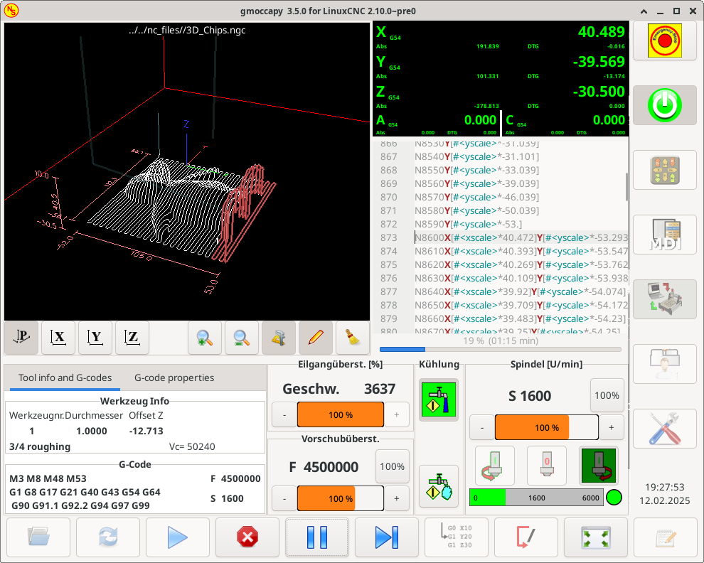

= gmoccapy

[[cha:gmoccapy-hu]]

== Bevezetés

'A GMOCCAPY(((GMOCCAPY))) egy grafikus felhasználói felület a LinuxCNC-hez.
A kezelőfelület érintőképernyőhöz készült, de lehet használni hagyományos monitorral és egérrel vagy hardveres nyomógombokkal és kézikerékkel (MPG) is, ugyanis a leggyakoribb felhasználásokhoz biztosít hozzáférést a HAL lábakhoz. 
Bővebb információ lentebb található.'

'A gmoccapy maximum 4 tengelyt tud megjeleníteni, támogatja hagyományos és hátsó késtartós esztergákat és a
beépített fülek és oldal panelek használatával könnyen testre szabható szinte minden feladathoz, amire jó példa a gmoccapy_plasma
felület: http://wiki.linuxcnc.org/cgi-bin/wiki.pl?Gmoccapy_plasma[gmoccapy_plasma]'

'A gmoccapy támogatja a beépített billentyűzetet (onboard vagy matchbox-keyboard), így nincs szükség külön külső billentyűzetre vagy egérre, bár természetesen lehet azokat is használni. 
A gmoccapy-ban létezik egy külön beállítás oldal, ahol a grafikus felület legnagyob részét lehet konfigurálni, így a beállítások megváltoztatásához legtöbbször egyéb fájlok szerkesztésére nincs szükség.'

'A gmoccapy üzenetei könnnyen lefordíthatóak más nyelvekre, ugyanis az idetartozó fájlok külön vannak választva a linuxcnc.po fájloktól, ezért nem szükséges egyéb fájlokat is lefordítani.
A fordításhoz szükséges fájlok a */src/po/gmoccapy* könyvtárban találhatóak. Csak a gmoccapy.pot fájlt kell lemásolni egy új néven, (pl. fr.po) és lefordítani annak tartalmát a gtranslator vagy poedit programokkal. 
A "make" parancs kiadása után a grafikus felület már felismeri az új nyelvet.'

'Kérjük tegye publikussá a fordítását, hogya hivatalos csomag részeként elérhető legyen mások számára is.
Jelen pillanatban angol, német spanyol, lengyel, szerb és magyar fordítások érhetők el.
Segítsen a további fordítások bevezetésében és keressn ezen az e-mail címen:, *nieson@web.de*.
Ha segítségre van szüksége, ne habozzon, keressen meg!.'

== Követelmények
A gmoccapy az UBUNTU 10.04-en, 12.04-en és Debian Wheezy-n a LinuxCNC 2.6 ,2.7 , master, Machinekit verziókkal
volt tesztelve. Másik program verziók használata esetén a hibákat vagy a megoldásokat a fórumon lehet jelezni: https://lists.sourceforge.net/lists/listinfo/emc-users[emc-users mailing list]

németül itt: http://www.cncecke.de/forum/showthread.php?t=78549[Peters CNC Ecke] +
angolul itt: http://www.linuxcnc.org/index.php/english/forum/41-guis/26314-gmoccapy-a-new-screen-for-linuxcnc[gmoccapy on linuxcnc] +

A gmoccapy képernyő minimális felbontása 979x751 az oldalsó panel nélkül, tehát minden szokásos képernyőn el kell, hogy férjen.

==  Honnan szerezzük be a gmoccapy-t
A LinuxCNC 2.6-al kezdődően a gmoccapy része a standard telepítõnek, így a legegyszerûbb módszer a telepítéshez az
http://www.linuxcnc.org/index.php/english/download[aktuális ISO] fájl letöltése és installálása CD / DVD /USB médiáról

A LinuxCNC korábbi verziójának frissítéséhez itt érhetõ el leírás: http://wiki.linuxcnc.org/cgi-bin/wiki.pl?UpdatingTo2.6[here]

Ilyen módon a frissítéseket szabványos debian csomagokban fogod megkapni.

Ha a "locale" beállítás *de* (German) akkor az alábbihoz hasonló képernyőképet fog megjelenni a képernyőn:
A pontos elrendezés a konfigurációtl függően változhat.

image::images/gmoccapy_3_axis.png[align="left"]

== Basic configuration
A gmoccapy használata nem igényel sok beállítást, de a program összes funkciójának használatához figyelmet kell fordítani néhány dologra.
Az alábbi INI fájlok megtalálhatóak a gmoccapy telepítése után, ezek bemutatják az alapokat: +
 +
* gmoccapy.ini						(gmoccayp alapkonfiguráció)
* gmoccapy_4_axis.ini				(4 tengelyes konfiguráció)
* gmoccapy_jog_wheels.ini			(kézikerekek használata)
* gmoccapy_lathe.ini				(eszterga konfiguráció)
* gmoccapy_lathe_imperial.ini		(eszterga coll mértékegységben)
* gmoccapy_left_panel.ini			(bal oldal panel használata)
* gmoccapy_right_panel.ini			(jobb oldal panel használata)
* gmoccapy_sim_hardware_button.ini	(szimulált hardver gombok)
* gmoccapy_tool_sensor.ini			(szerszám bemérõ használata)
* gmoccapy_with_user_tabs.ini		(felhasználói fülek használata)
* gmoccapy_messages.ini				(felhasználói üzenetek használata)
 +
Az INI fájlok nevei elég beszédesek (angolul), ez alapján következtetni lehet a felhasználási területre. +

Egy létezõ konfiguráció használata esetén módosítani kell az INI fájlt az  itt leírtaknak megfelelõen. +

[MACRO]-k használata esetén nem szabad elfeledkezni a makrók és szubrutinok elérési útvonalának beállításáról.

Vegyünk egy közelebbi pillantást az INI fájlra, minek kell szerepelni a gmoccapy használatához: +

=== A DISPLAY fejezet [[sub:the_display_section]]

 [DISPLAY]
 DISPLAY = gmoccapy
 PREFERENCE_FILE_PATH = gmoccapy_preferences
 DEFAULT_LINEAR_VELOCITY = 166.666
 MAX_LINEAR_VELOCITY = 166.666
 MAX_FEED_OVERRIDE = 1.5
 MAX_SPINDLE_OVERRIDE = 1.2
 MIN_SPINDLE_OVERRIDE = 0.5
 LATHE = 1
 BACK_TOOL_LATHE = 1
 PROGRAM_PREFIX = ../../nc_files/

''''

A legfontosabb, hogy megmondjuk a LinuxCNC-nek a [DISPLAY] fejezetben, hogy a gmoccapy-t szeretnénk használni:

 [DISPLAY]
 DISPLAY = gmoccapy

 PREFERENCE_FILE_PATH = gmoccapy_preferences

A PREFERENCE_FILE_PATH sor a használni kívánt gmoccapy beállítások fájlnak a helyét mondja meg.
Ebben a fájlban vannak letárolva a kezelõfelület beállításai, mint például a DRO mértékegysége, színek, billentyûzet beûllítások, egyebek. 
Nézze meg a <<sub:The_settings_page,Beállítások>> részt a további részletekért.

[NOTE]
===========================================================
Ha az INI fájlban nincs megadva fájlnév vagy elérési útvonal, akkor a gmoccapy a <te_géped_neve>.pref fájlt használja alapértelmezésként.
A fájl az adott konfiguráció könyvtárában kerül eltárolásra, így a beállítások nem keverednek össze több konfiguráció használata esetében sem.
===========================================================
''''
 DEFAULT_LINEAR_VELOCITY = 166.666

Beállítja az alapértelmezett lineáris sebesség értékét gépi mértékegység/másodperc-ben (mm/s, coll/s)

[NOTE]
===========================================================
Ha nincs érték megadva akkor 15 lesz az alapértelmezett.
If you don't set max linear velocity, the default linear velocity will be reduced to the default value max linear velocity (60)
Ha nincs megadva MAX_LINEAR_VELOCITY akkor az alapértelmezett lineáris sebesség ?????
If you don't set max velocity in TRAJ, it may be reduced as well see <<sub:The_TRAJ_Section,TRAY section>>
Ha a [TRAJ] fejezetben nincs megadva ??????
===========================================================
''''
 MAX_LINEAR_VELOCITY = 166.666

A léptetési sebesség maximális értékét lehet beállítani gépi mértékegység/másodpercben (mm/s, coll/s)

MEGJEGYZÉS: Ha nincs érték megadva akkor 60 lesz az alapértelmezett..
''''
 MAX_FEED_OVERRIDE = 1.5

Beállítja a maximális elõtolás túlvezérlés értékét. Jelen esetben az elõtolás túlvezérlés maximális értéke 150%
''''

 MAX_SPINDLE_OVERRIDE = 1.2
 MIN_SPINDLE_OVERRIDE = 0.5

Fõorsóó fordulat túlvezérlés értéke 50% és 120% között lesz.

''''
 LATHE = 1
 BACK_TOOL_LATHE = 1

Az elsõ sor beállítja az eszterga specifikus képernyõ elrendezést.

A második sor opcionális, ha meg van adva, akkor az X tengely a hátsó késtartónak megfelelõen fog megjelenni. A billentyû parancsok is megváltoznak ebben az esetben.

További információ a <<sub:LATHE_specific_section, ESZTERGA specifikus fejezetben>>

''''
 PROGRAM_PREFIX = ../../nc_files/

A fenti sor definiálja, hogy a gmoccapy hol keresse az ngc fájlokat. 

[NOTE]
===========================================================
Ha szerepel a sor, az alábbi könyvtárakban keres a program:

 * ~/linuxcnc/nc_files
 * ~/
===========================================================

==== A fülek és oldal panelek beállításai
A gmoccapy-hoz hozzá lehet adni beépülő Glade-ben készült programokat az Axis, Touchy és Gscreen felületekhze hasonlóan.
Mindez automatikus megtörténik amennyiben az INI fájl DISPLAY szekciójába beírunk pár sort: +

Ha még soha nem használta a glade panelt akkor itt talál róla egy nagyszerű leírást.
http://www.linuxcnc.org/docs/html/gui/gladevcp.html[Glade VCP] +

.Az alábbiak szerint lehet két felhasználói fület létrehozni:
****
 EMBED_TAB_NAME = DRO
 EMBED_TAB_LOCATION = ntb_user_tabs
 EMBED_TAB_COMMAND = gladevcp -x {XID} dro.glade

 EMBED_TAB_NAME = Második felhasználói fül
 EMBED_TAB_LOCATION = ntb_preview
 EMBED_TAB_COMMAND = gladevcp -x {XID} vcp_box.glade
****

Csak arra kell ügyelni, hogy a fentiek szerint a három sor szerepeljen minden újabb fül vagy oldal panel esetén, +
A három sor magyarázata:

''''
*EMBED_TAB_NAME* +
Az a bejegyzés definiálja a fül vagy panel nevét.
Tetszõleges név választható, de valaminek szerepelni kell. +

''''
*EMBED_TAB_LOCATION* +
Ez a bejegyzés mondja meg, hol lesz az új program helye a grafikus felületen belül: +

.A következő értékek lehetségesek:
****
* ntb_user_tabs              (fõ fülként elfoglalja a teljes képernyõt)
* ntb_preview                (következõ fül az elõnézeti oldalon)
* box_left                   (bal oldalon a képernnyõ tetején)
* box_right                  (jobb oldalon a normál képernyõ és a gombsor között)
* box_coolant_and_spindle    (a hûtés és fõorsó kijelzõk helyén)
* box_cooling                (a hûtés kijelzõ helyén)
* box_spindle                (a fõorsó kijelzõ helyén)
* box_vel_info               (a sebesség kijelzõ helyén)
* box_custom_1               (a sebesség kijelzõtõl balra)
* box_custom_2               (a hûtés kijelzõtõl balra)
* box_custom_3               (a fõorsó kijelzõtõl balra)
* box_custom_4               (a fõorsó kijelzõtõl jobbra)
****

A különbözõ beállításokra az INI fájlokban találhatók példák +

''''
*EMBED_TAB_COMMAND* +
Ez a végrehajtandó parancs leírása: +

 gladevcp -x {XID} dro.glade

Például a fenti sor elindítja a dro.glade nevû glade fájlt. A fájlnak a konfigurációs könyvtárban kell lennie,  általában ez a /home/felhasznalo/linuxcnc/configs/ könyvtár +

 gladevcp h_buttonlist.glade

Ez a sor megnyit egy új h_buttonlist.glade nevű önálló felhasználói ablakot amit a gmoccapy-tól függetlenül lehet mozgatni +

 camview-emc -w {XID}

A fenti sor a kamera képét fogja betenni a megadott helyre.Ügyelni kell arra, hogy a camview program telepítve legyen, mert alapértelmezésben nem kerül installálásra. További információ a camview-ról itt érhetõ el: http://psha.org.ru/b/camview-emc.html[cam view] +

 gladevcp -c gladevcp -u hitcounter.py -H manual-example.hal manual-example.ui

A fenti példa beemeli a manual-example.ui panelt, egy egyedi Python kezelõt (hitounter.py) és létrehozza az összes szükséges HAL kapcsolatot a manual-example.hal fájlnak megfelelõen. +

További példák: +

''''
*ntb_preview - teljes képernyõs megjelenés* +

image::images/gmoccapy_ntb_preview_maximized_2.png[align="left"]

''''
*ntb_preview* +

image::images/gmoccapy_ntb_preview.png[align="left"]

''''
*box_left - gmoccapy szövegszerkesztõ módban* +

image::images/gmoccapy_with_left_box_in_edit_mode.png[align="left"]

''''
*box_right - gmoccapy MDI üzemmódban* +

image::images/gmoccapy_with_right_panel_in_MDI_mode.png[align="left"]

==== Felhasználói üzenetek beállításai

A gmoccapy-ban is lehetõség van HAL-ból vezérelt üzenetek létrehozására. Ezt is az INI fájl [DISPLAY] részében kell definiálni.

Az alábbi példában 3 felhasználói üzenet megjelenítését definiáljuk pango nyelvi formátumban.
Részletes leírás a pango nyelvrõl itt található: https://developer.gnome.org/pango/stable/PangoMarkupFormat.html[Pango Markup]

 MESSAGE_TEXT = Megjelenítendõ szöveg, pango formátum használata megengedett+
 MESSAGE_TYPE = "status" , "okdialog" , "yesnodialog"+
 MESSAGE_PINNAME = A létrehozandó HAL láb csoport megnevezése+

 * 'status' : A gmoccapy üzenet rendszere egy felugró ablakban  megjeleníti az üzenet szövegét

 * 'okdialog' : Megjelenik az üzenet, az üzenet ablak aktív marad és a "-waiting"(várakozás) HAL láb kimenet aktív lesz.
				Az üzenet ablak bezárása a "-waiting"(várakozás) HAL kimenet inaktív lesz

 * 'yesnodialog' : Megjelenik az üzenet, az üzenet ablak aktív marad és a "-waiting"(várakozás) HAL láb kimenet aktív lesz.
				   A "-response" (válasz) HAL kimenet értéke elérhetõ lesz: "1" ha a felhasználó az "OK" gombra kattintott és "0" minden más esetben
				   Az üzenet ablak bezárása a "-waiting"(várakozás) HAL kimenet inaktív lesz.
				   A "-response" (válasz) HAL kimenet értéke mindaddig "1" lesz amíg a dialógus újra meghívásra kerül.

.Példa
****
 MESSAGE_TEXT = Ez egy  információs üzenet teszt
 MESSAGE_TYPE = status
 MESSAGE_PINNAME = allapotteszt
 
 MESSAGE_TEXT = Ez egy IGEN / NEM dialógus teszt
 MESSAGE_TYPE = yesnodialog
 MESSAGE_PINNAME = igennemdialogus
 
 MESSAGE_TEXT = A szöveg lehet kicsi <small>small</small>, <big>big</big>, vastagított, dõlt, vagy akár színes is.
 MESSAGE_TYPE = okdialog
 MESSAGE_PINNAME = okedialogus
****

Az idetartozó HAL láb névkonvenciók a HAl lábak fejezetben találhatóak <<sub:User_Created_Message_HAL_Pins, User Messages hal pin section>>

=== The RS274NGC Fejezet [[sub:RS274NGC]]

 [RS274NGC]
 SUBROUTINE_PATH = macros

A fenti sor beállítja a makrók és egyéb szubrutinok elérési útvonalát

=== The MACRO Fejezet [[sub:MACROS]]
A Touchy felülethez hasonlóan a gmoccapy-ban is van lehetõség a makrók definiálására. +
A makró semmi más mint egy G-kódot tartalmazó fájl.  +
MDI módban lehetõség van ezeket a makrókat egy gombnyomásra végrehajtani. +
Ehhez létre kell hozni a MACRO fejezetet mint az alábbi példa mutatja: +

 [MACROS]
 MACRO = elvesztem
 MACRO = hello_vilag
 MACRO = leptetes_korbe
 MACRO = inkrementalas xinc yinc
 MACRO = menj_a_poziciora X-pos Y-pos Z-pos

A fentiek alapján létrejön 5 makró az MDI gombokhoz rendelve.
Helytakarékossági okok miatt legfeljebb 9 makrót lehet megjeleníteni a grafikus felületen , de nem okoz hibát ha több szerepel az INI fájlban.
Az alábbi képen a gmoccapy-t mutatja 4 tengelyes elrendezésben, MDI módban és rejtett billentyűvel.

image::images/gmoccapy_mdi_hidden_keyboard.png[align="left"]

A fájl neve pontosan az kell, hogy legyen ami a MACRO sorban meg van adva.+
Tehát az "elvesztem" makró az "elvesztem.ngc" nevű programot fogja meghívni. +

.A makróknak a következõ szabályokat kell betartani::
****
* A makrónak tartalmazni kell egy szubrutint az alábbiak szerint: 
*	O<elvesztem>
* ahol a szubrutin neve pontosan megegyezik a makró nevével (kis és nagybetûk különbözõek)
* A makrónak végén O<elvesztem> endsub sornak kell lennie amit M2 parancs követ
* A fájlt az INI fájl [RS274NGC] fejezetében definiált könyvtárban kell elhelyezni, lásd még: (see <<sub:RS274NGC,RS274NGC>>)
****

A makróhoz rendelt gomb megnyomására a "sub" "endsub" közötti program hajtódik  végre.

[NOTE]
===========================================================
A gmoccapy sim könyvtárban találhatóak minta makrók a "macros" alkönytvárban.
===========================================================

A gmoccapy tud kezelni olyan makrókat is amelyek paraméter b-vitelét kérik:

 menj_a_megadott_poziciora X-pos Y-pos Z-pos

ahol a makró paramétereit szóközzel kell elválasztani.
A fenti példa meghívja a "menj_a_megadott_poziciora.ngc" aminek a tartalma így néz ki:

------------
 ; Tesztfájl menj_a_megadott_poziciora
 ; gyortsjártaban elmegy a kívánt pozícióba
 O<menj_a_megadott_poziciora> sub
 G17
 G21
 G54
 G61
 G40
 G49
 G80
 G90
 ;#1 = <X-Pos>
 ;#2 = <Y-Pos>
 ;#3 = <Z-Pos>
 (DBG, Will now move machine to X = #1 , Y = #2 , Z = #3)
 G0 X #1 Y #2 Z #3
 O<menj_a_megadott_poziciora> endsub
 M2
------------

Az adott makróhoz tartozó gomb lenyomásakor a makró bekéri az X-pos, Y-pos, Z-pos értékeit és ha mindhárom érték megadásra kerül akkor végrehajtja a makró további részeit.

image::images/gmoccapy_getting_macro_info.png[align="left"]

=== The TRAJ Fejezet[[sub:The_TRAJ_Section]]

 MAX_VELOCITY = 230.000

A gép maximális sebsségét állítja be. Ez az érték befolyással van az alapértelmezett sebsségre is.

== HAL lábak
A gmoccapy exportál néhány HAL lábat a külső hardver eszközök illesztéséhez. +
A cél az volt, hogy a felhasználói felületet a műhelyben lehessen használni teljesen vagy túlnyomó részben egér és billentyű nélkül.

[NOTE]
===========================================================
*A gmoccapy összes HAL pin bekötését a postgui.hal fájlban kell létrehozni, ugyanis ezek a lábak csak a kezelőfelület teljes betöltődése után állnak rendelkezésre.*
===========================================================

=== Jobb oldali és alsó kezelőgombok listája

A gmoccapy képernyőn két fő nyomógomb sor található: egy jobb oldalon egy pedig alul. +
A jobb kéz felőli sorban levő gombok funkciója nem változik, ellenben az alsó sor gombjaival. +
A gombok számozása fentről lefelé és balról jobbra nullától ("0") kezdődik. +

A hal_show a következő függőleges elrendezésű gombokat mutatja:

* gmoccapy.v-button-0
* gmoccapy.v-button-1
* gmoccapy.v-button-2
* gmoccapy.v-button-3
* gmoccapy.v-button-4
* gmoccapy.v-button-5
* gmoccapy.v-button-6

ezek pedig a vízszintes sorban levő gombok:

* gmoccapy.h-button-0
* gmoccapy.h-button-1
* gmoccapy.h-button-2
* gmoccapy.h-button-3
* gmoccapy.h-button-4
* gmoccapy.h-button-5
* gmoccapy.h-button-6
* gmoccapy.h-button-7
* gmoccapy.h-button-8
* gmoccapy.h-button-9

Az alsó sorban levő gombok funkciója a program üzemmódjaitól és a kontextustól függően változik, 
de a program ezt automatikus lekezeli, így a HAL fájlban nem kell azokat cserélgetni.

A fizikai nyomógombok kialakításának célja az volt, hogy a képernyőt érintő panel nélkül is lehessen használni, 
vagy érintő képernyő esetén védjük azt a túlságos igénybevételtől.

image::images/gmoccapy_0_9_7_sim_hardware_button.png[align="left"]

=== Sebességek és túlvezérlések

A gmoccapy összes csúszkájához illeszthető külső enkóder vagy hardveres potméter. +

''''
Az enkóderek bekötéshez a következő lábak kerültek kiexportálásra:

* gmoccapy.max-vel-counts          =  HAL_S32  ;  (A gép maximális sebessége)
* gmoccapy.jog-speed-counts        =  HAL_S32  ;  (Léptetési sebesség)
* gmoccapy.spindle-override-counts =  HAL_S32  ;  (Főorsó túlvezérlés)
* gmoccapy.feed-override-counts    =  HAL_S32  ;  (Előtolás túlvezérlés)
* gmoccapy.reset-feed-override     =  HAL_BIT  ;  (Előtolás túlvezérlésének visszaállítása 100%-ra)
* gmoccapy.reset-spindle-override  =  HAL_BIT  ;  (Főorsó túlvezérlésének visszaállítása 100%-ra)

''''
Potméterek bekötéséhez az alábbi lábak elérhetők:

* gmoccapy.analog-enable           = HAL_BIT   ;  Az analóg adatbevitelhez igaz (TRUE) értéket kell adni
* gmoccapy.jog-vel-value           = HAL_FLOAT ;  A léptetési sebesség csúszkájának eltolása
* gmoccapy.max-vel-value           = HAL_FLOAT ;  A maximális sebesség csúszkájának eltolása
* gmoccapy.feed-override-value     = HAL_FLOAT ;  Az előtolás túlvezérlés csúszkájának eltolása
* gmoccapy.spindle-override-value  = HAL_FLOAT ;  A főorsó fordulatszám túlvezérlés csúszkájának eltolása

A lebegőpontos beviteli lábak 0.0 és 1.0 közötti értékeket vehetnek fel, ezek a csúszkák eltolásának százalékos értékei.

FIGYELEM: Ha mindkét fajta beviteli láb használatban van, akkor azokat nem szabad ugyanarra a csúszkára bekötni, mert nem várt működés léphet fel!
Különböző csúszkákat be lehet kötni egy vagy több féle HAL láb típusra.

FONTOS: Ügyeljen arra, hogy a léptetési sebesség függ a "teknős" gomb állapotától, így a lépték más lehet a gyors ("nyúl") és lassú ("teknős) módban.
További részletek erről itt: <<sub:Jog_Vel_and_Turtle-Jog,Léptetési sebességek és teknős-lépés HAL láb>>.

.Példa
****
Főorsó túlvezérlés minimális értéke =  20 % +
Főorsó túlvezérlés maximális értéke = 120 % +
gmoccapy.analog-enable = 1 +
gmoccapy.spindle-override-value = 0.25 +
 +
felvett érték = Min. érték + (Max. érték - Min. érték) * gmoccapy.spindle-override-value +
felvett érték = 20 + (120 - 20) * 0.25 +
felvett érték = 45 % +
****

=== Léptetési HAL lábak
Az INI fájlban definiált összes tengelynek van egy léptetés-plusz és léptetés-minusz lába,
így hadrveres nymógombok használhatók a tengely léptetésre. +

A szabványos konfigurációhoz a következő HAL lábak állnak rendelkezésre:

* gmoccapy.jog-x-plus
* gmoccapy.jog-x-minus
* gmoccapy.jog-y-plus
* gmoccapy.jog-y-minus
* gmoccapy.jog-z-plus
* gmoccapy.jog-z-minus

ha az INI fájlban 4. tengely van definiálva, akkor az alábbi két láb elérhető:

* gmoccapy.jog-<your fourth axis letter >-plus
* gmoccapy.jog-<your fourth axis letter >-minus

"C" tengely esetén:

* gmoccapy.jog-c-plus
* gmoccapy.jog-c-minus

=== Léptetési sebességek és teknős-lépés HAL láb [[sub:Jog_Vel_and_Turtle-Jog]]
A léptetési sebesség  értéke beállítható a megfelelő csúszkával. +
A csúszka léptéke változik a lassú ("teknős") módba való kapcsolással. Ha a gomb nem látható akkor lehet, hogy letiltásra került itt:  <<sub:turtle_jog,Beállítások oldal>>. 
Ha a nyulat ábrázoló gomb látszik akkor a sebssség a minimális és maximális értékek között változhat. Ha a gomb teknőst ábrázol, akkor a maximális sebesség 1/20-a lesz csak elérhető alapértelmezésben. 
Az osztó beállítása itt történik <<sub:turtle_jog,Beállítások oldal>>.

Ilyen módon az érintőképernyőn sokkal könnyebb kiválasztani kisebb sebességéket.

=== Léptetési inkrementum HAL lábak
A léptetési inkrementumokat HAL lábak keresztül lehet kiválasztani, így hardveres forgókapcsoló használható erre a célra.
Az INI fájlban maximum 10 inkremenumot lehet hozzárendleni a HAL lábakhoz, ha ennél több van akkor azok nem elérhetőek a grafikus felületről, így nem is kerülnek kijelzésre

Ha 6 inkrementum van akkor a következő HAL  *7* láb lesz elérhető:

* gmoccapy.jog-inc-0
* gmoccapy.jog-inc-1
* gmoccapy.jog-inc-2
* gmoccapy.jog-inc-3
* gmoccapy.jog-inc-4
* gmoccapy.jog-inc-5
* gmoccapy.jog-inc-6

jog-inc-0 értéke nem változtatható és folyamatos léptetést jelent.

=== Hardver zárolás láb [[sub:hardware_unlock_pin]]
A beállítások zárolásához és a zárolás feloldásához lehetséges egy kölső hardver kulccsal is, ennek érdekében egy HAL láb kerül kiexportálásra:

* gmoccapy.unlock-settings

Ha a lábon magas jelszint van akkor a beállítások elérhetőek. +
Ezen a láb a használatát előzőleg a beállítás oldalon engedélyzeni kell.

=== Hiba HAL lábak

 * gmoccapy.error
 * gmoccapy.delete-message

gmoccapy.error is an bit out pin, to indicate an error, so a light can lit or even the machine may
be stopped. It will be reset with the pin gmoccapy.delete-message. gmoccapy.delete-message will
delete the first error and reset the gmoccapy.error pin to False after the last error has been cleared. +

NOTE: Messages or user infos will not affect the gmoccapy.error pin, but the gmoccapy.delete-message
pin will delete the last message if no error is shown!

=== User Created Message HAL Pins [[sub:User_Created_Message_HAL_Pins]]
gmoccapy may react to external errors, using 3 different user messages: +
Mind HAL_BIT lábak. +

'Status'

* gmoccapy.messages.statustest

'Yesnodialog'

* gmoccapy.messages.yesnodialog
* gmoccapy.messages.yesnodialog-waiting
* gmoccapy.messages.yesnodialog-responce

'Okdialog'

* gmoccapy.messages.okdialog
* gmoccapy.messages.okdialog-waiting

=== Spindle feedback pins
There are two pins for spindle feedback

* gmoccapy.spindle_feedback_bar
* gmoccapy.spindle_at_speed_led

'gmoccapy.spindle_feedback_bar' will accept an float input to show the spindle speed +
'gmoccapy.spindle_at_speed_led' is an bit-pin to lit the GUI led if spindle is at speed +

=== Pins to indicate program progress information
There are three pins giving information over the program progress +

* gmoccapy.program.length         = HAL_S32   ; showing the total number of lines of the program
* gmoccapy.program.current-line   = HAL_S32   ; indicating the current working line of the program
* gmoccapy.program.progress       = HAL_FLOAT ; giving the program progress in percentage

The values may not be very accurate, if you are working with subroutines or large remap procedures,
also loops will cause different values.

=== Pins to modify soft limits
Gmoccapy allows you to modify the soft limits using hal pin.
The pin do allow to reduce or enlarge the soft limits, so you are able to protect your
rotary table from collision just switching a hal pin. If you do not use it,
just reduce your soft limits. An other option would be a tool changer which is placed
in the working area, you do not want a collision during normal work, but you are forced
to enter the tool change area to change a tool, so during tool change you enlarge the soft limits.

* gmoccapy.axis-to-set    = HAL_S32    ; indicating the joint of the axis to modify (X=0, Y=1, Z=2 ...)
* gmoccapy.set-max-limit  = HAL_BIT    ; if set the value will modify the max limit value, else the min value
* gmoccapy.limit-value    = HAL_FLOAT  ; the new value to set as soft limit

This has not been tested with a rotary axis, so be careful with that kind of axis.
There will be no check to the limits you set, so if you set a limit and the tool is out of your limit area
you will get an error about being outside the soft limits.

IMPORTANT: You are responsible to take care about that!

You are only allowed to set limits if the machine is on!
A value of 0 as limit is not allowed, please give a value of 0.000001 instead.
The GUI will react to changes of the limit-value pin, so to modify the limits you have to apply a value change to that pin.

WARNING: This is very experimental at the moment, so please take care for your security.

=== Tool related pin

==== Tool Change Pin
This pin are provided to use gmoccapy's internal tool change dialog, similar to the one known from axis, but with several modifications,
so you will not only get the message to change to 'tool number 3', but also the description of that tool like '7.5 mm 3 flute cutter'.
The information is taken from the tool table, so it is up to you what to display.

image::images/manual_toolchange.png[align="left"]

* gmoccapy.toolchange-number    = HAL_S32    ; The number of the tool to be changed
* gmoccapy.toolchange-change    = HAL_BIT    ; Indicate that a tool has to be changed
* gmoccapy.toolchange-changed   = HAL_BIT    ; Indicate toll has been changed

usually they are connected like this for a manual tool change:

-----
 net tool-change            gmoccapy.toolchange-change    <=   iocontrol.0.tool-change
 net tool-changed           gmoccapy.toolchange-changed   <=   iocontrol.0.tool-changed
 net tool-prep-number       gmoccapy.toolchange-number    <=   iocontrol.0.tool-prep-number
 net tool-prep-loop         iocontrol.0.tool-prepare      <=   iocontrol.0.tool-prepared
-----

==== tool offset pins
This pins allows you to show the active tool offset values for X and Z in the tool information frame. +
You should know that they are only active after G43 has been send.

image::images/gmoccapy_0_9_7_tool_info.png[align="left"]

* gmoccapy.tooloffset-x
* gmoccapy.tooloffset-z

just connect them like so in your postgui hal.

------
 net tooloffset-x gmoccapy.tooloffset-x <= motion.tooloffset.x
 net tooloffset-z gmoccapy.tooloffset-z <= motion.tooloffset.z
------

Please note, that gmoccapy takes care of its own to update the offsets,
sending an G43 after any tool change, *but not in auto mode!*

IMPORTANT: So writing a program makes you responsible to include an G43 after each tool change!

== Auto Tool Measurement [[sub:Auto_Tool_Measurement]]

Gmoccapy offers an integrated auto tool measurement. +
To use this feature, you will need to do some additional settings and you may want to use the
offered hal pin to get values in your own ngc remap procedure.

IMPORTANT: Before starting the first test, do not forget to enter the Probe height and probe velocities
on the settings page! See <<sub:Tool_Measurement_Setup,Settings Page Tool Measurement>>

It might be also a good idea to take a look at the tool measurement video:
see <<sub:Tool_Measurement_Videos,tool measurement related videos>>

Tool Measurement in gmoccapy is done a little bit different to many other GUI. +
You should follow these steps:
* touch of you workpiece in X and Y
* measure the height of your block from the base where your tool switch is located, to the upper face of the block (including chuck etc.)
* Push the button block height and enter the measured value
* Go to auto mode and start your program

here is a small sketch:

image::images/sketch_auto_tool_measurement.png[align="left"]

With the first given tool change the tool will be measured and the offset will be set automatically
to fit the block height. The advantage of the gmoccapy way is, that you do not need a reference tool.

[NOTE]
=============================================================
Your program must contain a tool change at the beginning!
The tool will be measured, even it has been used before, so there is no danger, if the block height has changed.
There are several videos showing the way to do that on you tube.
=============================================================

=== Tool measurement pins
Gmoccapy offers 5 pins for tool measurement purpose +
The pins are mostly used to be read from a gcode subroutine, so the code can react to different values.

* gmoccapy.toolmeasurement = HAL_BIT ; enable or not tool measurement
* gmoccapy.blockheight = HAL_FLOAT ; the measured value of the top face of the workpiece
* gmoccapy.probeheight = HAL_FLOAT ; the probe switch height
* gmoccapy.searchvel = HAL_FLOAT ; the velocity to search for the tool probe switch
* gmoccapy.probevel = HAL_FLOAT ; the velocity to probe tool length

=== Tool Measurement INI File modifications
Modify your INI File to include the following:

==== The RS274NGC section

 [RS274NGC]
 # Enables the reading of INI and HAL values from gcode
 FEATURES=12

 # is the sub, with is called when a error during tool change happens
 ON_ABORT_COMMAND=O <on_abort> call

 # The remap code
 REMAP=M6  modalgroup=6 prolog=change_prolog ngc=change epilog=change_epilog

==== The tool sensor section
The position of the tool sensor and the start position of the probing movement,
all values are absolute coordinates, except MAXPROBE, what must be given in relative movement.

 [TOOLSENSOR]
 X = 10
 Y = 10
 Z = -20
 MAXPROBE =  -20

==== The Change position section
this is not named TOOL_CHANGE_POSITION  on purpose - canon uses that name and will interfere otherwise +
The position to move the machine before giving the change tool command. All values are in absolute coordinates

 [CHANGE_POSITION]
 X = 10
 Y = 10
 Z = -2

==== The Python section
the Python plugins serves interpreter and task

 [PYTHON]
 # The path to start a search for user modules
 PATH_PREPEND = python
 # The start point for all.
 TOPLEVEL = python/toplevel.py

=== Needed Files
You must copy the following files to your config dir

First make a directory 'python' in your config folder +
from 'your_linuxcnc-dev_directory/configs/sim/gmoccapy/python' +
Copy 'toplevel.py'  to your 'config_dir/python' folder +
Copy 'remap.py'     to your 'config_dir/python' folder +
Copy 'stdglue.py'   to your 'config_dir/python' folder +

from 'your_linuxcnc-dev_directory/configs/sim/gmoccapy/macros' +
copy 'on_abort.ngc' to the directory specified as SUBROUTINE_PATH see <<sub:RS274NGC, RS274NGC Section>> +
from 'your_linuxcnc-dev_directory/configs/sim/gmoccapy/macros' +
copy 'change.ngc' to the directory specified as SUBROUTINE_PATH see <<sub:RS274NGC, RS274NGC Section>> +
open 'change.ngc' with a editor and uncomment the following lines (49 and 50): +

 F #<_hal[gmoccapy.probevel]>
 G38.2 Z-4

You may want to modify this file to fit more your needs, feel free, but do not ask for support ;-)

=== Needed Hal connections
connect the tool probe in your hal file like so

 net probe  motion.probe-input <= <your_input_pin>

The line might look like this:

-------
 net probe  motion.probe-input <= parport.0.pin-15-in
-------

In your postgui.hal file add:

-------
 # The next lines are only needed if the pins had been connected before
 unlinkp iocontrol.0.tool-change
 unlinkp iocontrol.0.tool-changed
 unlinkp iocontrol.0.tool-prep-number
 unlinkp iocontrol.0.tool-prepared

 # link to gmoccapy toolchange, so you get the advantage of tool description on change dialog
 net tool-change            gmoccapy.toolchange-change    <=   iocontrol.0.tool-change
 net tool-changed           gmoccapy.toolchange-changed   <=   iocontrol.0.tool-changed
 net tool-prep-number       gmoccapy.toolchange-number    <=   iocontrol.0.tool-prep-number
 net tool-prep-loop         iocontrol.0.tool-prepare      <=   iocontrol.0.tool-prepared
-------

== The settings page [[sub:The_settings_page]]
To enter the page you will have to click on:

image::images/gmoccapy_settings_button.png[align="left"]

and give an unlock code, witch is *123* as default. If you want to change it at this time you will
have to edit the hidden preference file, see <<sub:the_display_section,the display section>> for details.

The page looks at the moment like so:

image::images/gmoccapy_settings_appearance.png[align="left"]

The page is separated in three main tabs:

=== Appearance

on this tab you will find the following options:

==== Main Window
Here you can select how you wish the GUI to start. The main reason for this was the wish to get an easy
way for the user to set the starting options without the need to touch code.

You have three options:

* start as fullscreen
* start maximized
* start as window

If you select start as window the spinboxes to set the position and size will get active. One time set,
the GUI will start every time on the place and with the size selected. Nevertheless the user can change
the size and position using the mouse, but that will not have any influence on the settings.

'*hide the cursor*' does allow to hide the cursor, what is very useful if you use a touch screen.

==== Keyboard

[NOTE]
=============================================================
If this section is not sensitive, you have not installed a virtual keyboard, +
supported are *onboard* and *matchbox-keyboard*.
=============================================================

The check-boxes allows the user to select if he want the on board keyboard to be shown immediately,
when entering the MDI Mode, when entering the offset page, the tooledit widget or when open a program
in the EDIT mode. The keyboard button on the bottom button list will not been affected by this settings,
so you be able to show or hide the keyboard by pressing the button. The default behavior will be set by
the check-boxes.

Default are :

* show keyboard on offset = True
* show keyboard on tooledit = False
* show keyboard on MDI = True
* show keyboard on EDIT = True
* show keyboard on load file = False

If the keyboard layout is not correct, i.e. clicking X gives Z, than the layout has not been set properly,
related to your locale settings. +
For onboard it can be solved with a small batch file with the following content:

---------
 #!/bin/bash
 setxkbmap -model pc105 -layout de -variant basic
---------

the letters "de" are for German, you will have to set them according to your locale settings +
Just execute this file before starting LinuxCNC, it can be done also adding a starter to your local folder

 ./config/autostart

so that the layout is set automatically on starting.

For matchbox-keyboard you will have to make your own layout, for a German layout ask in the forum.

==== On Touch Off
give the option to show the preview tab or the offset page tab if you enter the touch off mode by clicking the
corresponding bottom button.

* show preview
* show offsets

As the notebook tabs are shown, you are able to switch between both views in any case.

==== DRO Options
You have the option to select the background colors of the different DRO states.
So users suffering from protanopia (red/green weakness) are able to select proper colors

By default the backgrounds are:

* Relative mode  = black
* Absolute mode  = blue
* Distance to go = yellow

and the foreground color of the DRO can be selected with:

* homed color   = green
* unhomed color = red

'show dro in preview', the DRO will be shown in the preview window +
'show offsets', the Offsets will be shown in the preview window +
'show DTG' , the distance to go will be shown in the preview window + +
 +
'show DRO Button' will allow you to display additional buttons on the left side of the DRO. +

It will display: +
one button to switch from relative to absolute coordinates, +
one button to toggle between distance to go and the other states +
and one button to toggle the units from metric to imperial and vice versa.

WARNING: It is not recommended to use this option, because the user will loose the auto unit option, which
will toggle the units according to the active gcode G20 / G21

NOTE: *You can change through the DRO modes (absolute, relative, distance to go) by clicking on the DRO!*

'Use Auto Units' allows to disable the auto units option of the display, so you can run a program in inches and watch the DRO in mm.

'size' allows to set the size of the DRO font, default is 28, if you use a bigger screen you may want to increase the size up to 56. If you do use 4 axis, the DRO font size will be 3/4 of the value, because of space reason.

'digits' sets the number of digits of the DRO from 1 to 5.
NOTE: Imperial will show one digit more that metric. So if you are in imperial machine units and set the digit value to 1, you will get no digit at all in metric.

==== Preview

'Grid Size' +
Sets the grid size of the preview window. +
Unfortunately the size *has to be set in inches*, even if your machine units are metric.
We do hope to fix that in a future release.

NOTE: The grid will not be shown in perspective view.

'Show DRO' +
Will show the a DRO also in the preview window, it will be shown automatically in fullsize preview

'Show DTG' +
Will show also the DTG (direct distance to end point) in the preview, only if Show DRO is active and
not fullsize preview.

'Show Offsets' +
Will show the offsets in the preview window,

NOTE: If you only check this option and leave the others unchecked, you will get in fullsize preview a offset page

'Mouse Button Mode' +
With this combobox you can select the button behavior of the mouse to rotate, move or zoom within the preview. +

 * left rotate, middle move,   right zoom
 * left zoom,   middle move,   right rotate
 * left move,   middle rotate, right zoom
 * left zoom,   middle rotate, right move
 * left move,   middle zoom,   right rotate
 * left rotate, middle zoom,   right move

Default is left move, middle zoom, right rotate

The mouse wheel will still zoom the preview in every mode.

TIP: If you select an element in the preview, the selected element will be taken as rotation center point.

==== File to load on start up
Select the file you want to be loaded on start up.
In other GUI changing this was very cumbersome, because the users where forced to edit the INI File.

If a file is loaded, it can be set by pressing the current button to avoid that any program is
loaded at start up, just press the None button.

The file selection screen will use the filters you have set in the INI File,
if there aren't any filters given, you will only see *ngc* files.
The path will be set according to the INI settings in [DISPLAY] PROGRAM_PREFIX

==== Jump to dir
you can set here the directory to jump to if you press the corresponding button
in the file selection dialog.

image::images/gmoccapy_file_selection_dialog_with_keyboard.png[align="left"]

==== Themes and Sounds
This lets the user select what desktop theme to apply and what error and messages sounds should be played.
By default "Follow System Theme" is set.

=== Hardware

image::images/gmoccapy_settings_hardware.png[align="left"]

==== Hardware MPG Scales
For the different Hal Pin to connect MPG Wheels to, you may select individual scales to be applied.
The main reason for this was my own test to solve this through hal connections, resulting in a very
complex hal file. Imagine a user having an MPG Wheel with 100 ipr and he wants to slow down the max
vel from 14000 to 2000 mm/min, that needs 12000 impulses, resulting in 120 turns of the wheel!
Or an other user having a MPG Wheel with 500 ipr and he wants to set the spindle override witch has
limits from 50 to 120 % so he goes from min to max within 70 impulses, meaning not even 1/4 turn.

By default all scales are set using the calculation:

 (MAX - MIN)/100

==== Keyboard shortcuts
Some users want to jog there machine using the keyboard buttons and there are others that will never allow this.
So everybody can select whether to use them or not.

Default is to use keyboard shortcuts.

Please take care if you use a lathe, than the shortcuts will be different. See <<sub:LATHE_specific_section,the Lathe section>>

 * Arrow Left = X minus
 * Arrow Right = X plus
 * Arrow up = Y plus
 * Arrow Down = Y minus
 * Page Up = Z plus
 * Page Down = Z minus

 * F1 = Estop (will work even if keyboard shortcuts are disabled)
 * F2 = Machine on

 * ESC = Abort

There are additional keys for message handling, see <<sub:Message_behavior_and_appearance,Message behavior and appearance>>
 * WINDOWS = Delete last message
 * <STRG><SPACE> = Delete all messages

==== Unlock options

you have three options to unlock the settings page:

* use unlock code (the user must give a code to get in)
* Do not use unlock code (There will be no security check, not recommended)
* Use hal pin to unlock  (hardware pin must be high to unlock the settings, see <<sub:hardware_unlock_pin, hardware unlock pin>>

Default is use unlock code (default = *123*)

==== Spindle
The start RPM sets the rpm to be used if the spindle is started and no S value has been set.

With the MIN and MAX settings you set the limits of the spindle bar shown in the INFO frame on
the main screen. It is no error giving wrong values. If you give a maximum of 2000 and your spindle makes 4000 rpm, only the bar level will be wrong on higher speeds than 2000 rpm.

 default values are
 MIN = 0
 MAX = 6000

==== Turtle Jog [[sub:turtle_jog]]
This settings will have influence on the jog velocities.

* 'hide turtle jog button' will hide the button right of the jog velocity slider, if you hide this button, please take care that it shows the rabbit icon, otherwise you will not be able to jog faster than the turtle jog velocity, which is calculated using the turtle jog factor.
* 'Turtle jog factor' sets the scale to apply for turtle jog mode. If you set a factor of 20, the max jog velocity will be 1/20 of max velocity of the machine if in turtle mode (button pressed, showing the turtle)

NOTE: This button can be activated using the <<sub:Jog_Vel_and_Turtle-Jog,turtle-jog>> hal pin.

=== Advanced Settings

image::images/gmoccapy_settings_advanced.png[align="left"]

==== Tool Measurement [[sub:Tool_Measurement_Setup]]
If this part is not sensitive, you do not have a valid INI file configuration to use tool measurement.

Please check <<sub:Auto_Tool_Measurement, Auto Tool Measurement>>

* Use auto tool measurement : If checked, after each tool change, a tool measurement will be done,
the result will be stored in the tool table and an G43 will be executed after the change.

*Probe information* +
The following information is taken from your INI file and must be given in absolute coordinates

 * X Pos. = The X position of the tool switch
 * Y Pos. = The Y position of the tool switch
 * Z Pos. = The X position of the tool switch, we will go as rapid move to this coordinate

 * Max. Probe = is the distance to search for contact, an error will be launched, if no contact is given.
                The distance has to be given in relative coordinates, beginning the move from Z Pos.,
                so you have to give a negative value to go down!

 * Probe Height = is the height of your probe switch, you can measure it. Just touch off the base,
                  where the probe switch is located and set that to zero. Then make a tool change
                  and watch the tool_offset_z value, that is the height you must enter here.

*Probe velocities* +

 * Search Vel. = The velocity to search for the tool switch, after contact the tool will go up again
                and then goes toward the probe again with probe vel, so you will get better results.
 * Probe Vel. = Is the velocity for the second movement to the switch, it should be slower to get better
                touch results.(In sim mode, this is commented out in macros/change.ngc, otherwise the
                user would have to click twice on the probe button)

*Tool Changer* +
If your 4'th axis is used in a tool changer, you may want to hide the DRO and all the other buttons
related to that axis. +

You can do that by checking the checkbox, that will hide: +

 * 4'th axis DRO
 * 4'th axis Jog button
 * 4'th axis home button
 * column of 4'th axis in the offsetpage
 * column of 4'th axis in the tolleditor

==== Message behavior and appearance [[sub:Message_behavior_and_appearance]]
This will display small popup windows displaying the message or error text, the behavior is very similar
to the one axis uses. You can delete a specific message, by clicking on it's close button, if you want
to delete the last one, just hit the WINDOWS key on your keyboard, or delete all messages
at ones with <STRG><SPACE>.

You are able to set some options:

 * X Pos = The position of the top left corner of the message in X counted in pixel from the top left corner of the screen.
 * Y Pos = The position of the top left corner of the message in Y counted in pixel from the top left corner of the screen.
 * Width = The width of the message box
 * max = The maximum messages you want to see at ones, if you set this to 10, the 11th message will delete the first one,
         so you will only see the    last 10 ones.
 * Font = The font and size you want to use to display the messages
 * use frames = If you activate the checkbox, each message will be displayed in a frame, so it is much easiere to distinguish
   the messages. But you will need a little bit more space.
 * The button launch test message will just do what it is supposed to, it will show a message, so you can see the changes
   of your settings without the need to generate an error.

==== Run from line option

You can allow or disallow the run from line. This will set the corresponding button insensitive (grayed out),
so the user will not be able to use this option.

WARNING: It is not recommend to use run from line, as LinuxCNC will not take care of any previous
lines in the code before the starting line. So errors or crashes are very probably.

Default is disable run from line

==== Log Actions
If this button is active, nearly every button press or relevant action of LinuxCNC will be logged in the ALARM history.
This is very useful for debugging.

== LATHE specific section [[sub:LATHE_specific_section]]
If in the INI File LATHE = 1 is given, the GUI will change its appearance to the special needs for a lathe.
Mainly the Y axis will be hidden and the jog buttons will be arranged in a different order.

Normal Lathe:

image::images/gmoccapy_lathe.png[align="left"]

Back Tool Lathe:

image::images/gmoccapy_back_tool_lathe.png[align="left"]

As you see the R DRO has a black background and the D DRO is gray. This will change according to the active
G-Code G7 or G8. The active mode is visible by the black background, meaning in the shown images G8 is active.

The next difference to the standard screen is the location of the Jog Button.
X and Z have changed places and Y is gone.
You will note that the X+ and X- buttons changes there places according to normal or back tool lathe.

Also the keyboard behavior will change:

Normal Lathe:

 * Arrow Left = Z minus
 * Arrow Right = Z plus
 * Arrow up = X minus
 * Arrow Down = X plus

Back Tool Lathe:

 * Arrow Left = Z minus
 * Arrow Right = Z plus
 * Arrow up = X plus
 * Arrow Down = X minus

The tool information frame will show not only the Z offset, but also the X offset and the tool table
is showing all lathe relevant information.

== Plasma specific section

image::images/gmoccapy_plasma.png[align="left"]

There is a very good WIKI, which is actually growing, maintained by Marius

see http://wiki.linuxcnc.org/cgi-bin/wiki.pl?Gmoccapy_plasma[Plasma wiki page]

== Videók a YouTube-on
This are videos showing gmoccapy in action, unfortunately the videos don't show the latest version of gmoccapy,
but the way to use it will not change much in the future. I will try to actualize the videos as soon as possible.

=== Alapvető használat
Németül   = +
Angolul = https://www.youtube.com/watch?v=O5B-s3uiI6g

=== Szimulált kézikerék
Angolul = http://youtu.be/ag34SGxt97o

=== Beállítások oldal
Beállítások németül=  +
Beállítások angolul= https://www.youtube.com/watch?v=AuwhSHRJoiI

=== Szimulált hardveres nyomógombok
Hardveres nyomógombok németül = http://www.youtube.com/watch?v=DTqhY-MfzDE +
Hardveres nyomógombok angolul = http://www.youtube.com/watch?v=ItVWJBK9WFA

=== Felhasználói fülek
Felhasználói fülek angolul = http://www.youtube.com/watch?v=rG1zmeqXyZI

=== Tool_Measurement_Video [[sub:Tool_Measurement_Videos]]
English Auto Tool Measurement Simmulation = http://youtu.be/rrkMw6rUFdk +
English Auto Tool Measurement Screen = http://youtu.be/Z2ULDj9dzvk +
English Auto Tool Measurement Machine = http://youtu.be/1arucCaDdX4 +

== Known problems

=== Furcsa számok az információs területen
Ha az alábbikahoz hasonló furcsa számok vannak az információs területen:

image::images/strange_numbers.png[align="left"]

Akkor a konfigurációs állomány a StepConfWizard régebbi verziójával készült.
Ennek következtében az INI fájl [TRAJ] szekciójában a MAX_LINEAR_VELOCITY = xxx szerepel hibásan.
Azt át kell írni erre: MAX_VELOCITY = xxx
