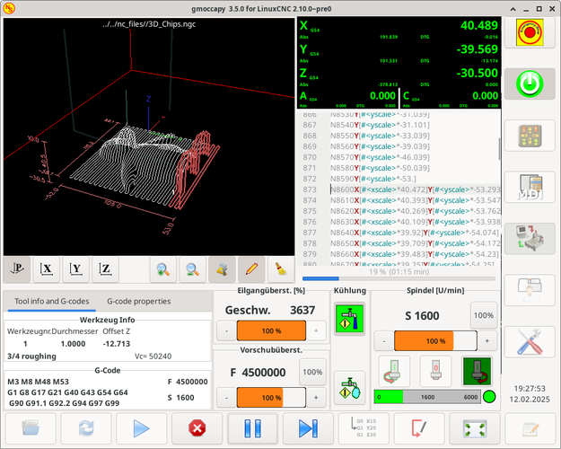
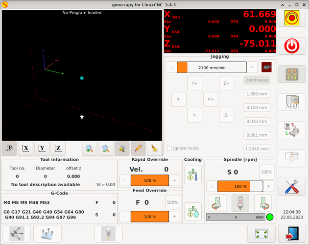
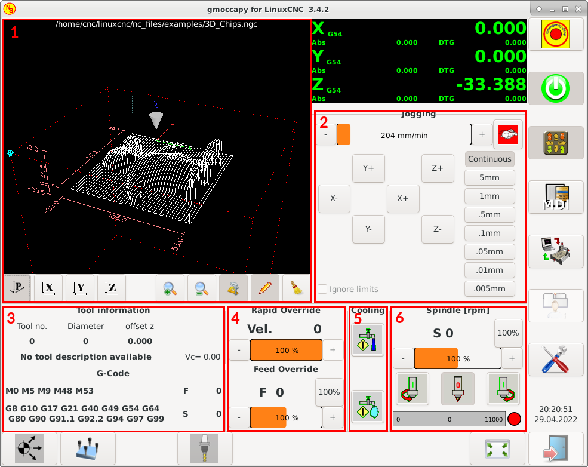
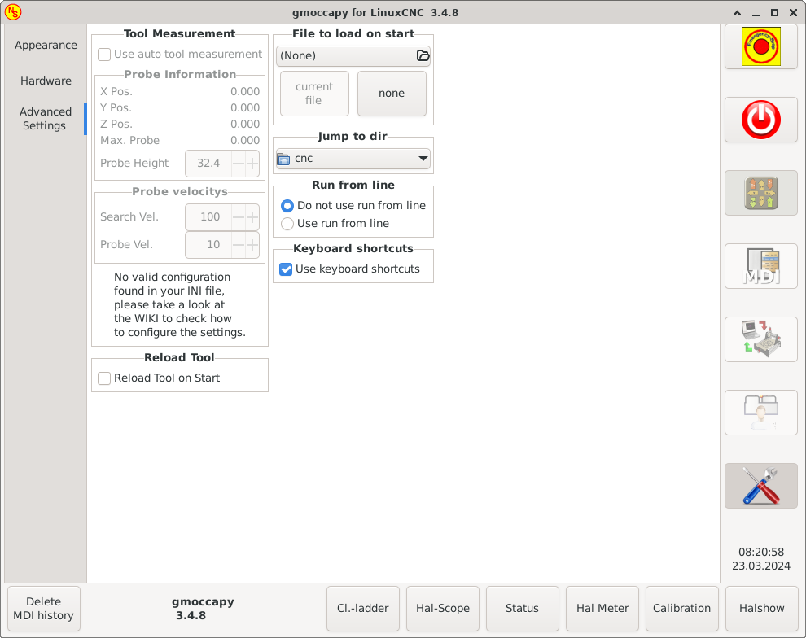
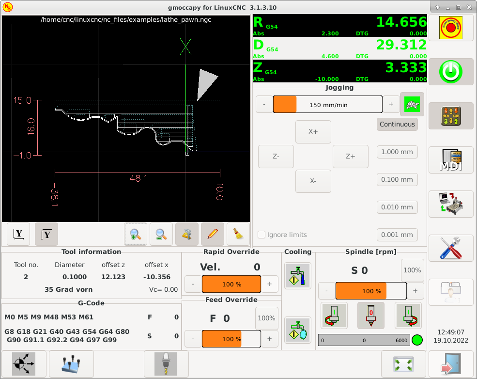

:lang: en
:pin_tab_options: cols="10,10,50", frame="none", grid="none", options="header"
:toc:

[[cha:gmoccapy]]
= GMOCCAPY

// Custom lang highlight
// must come after the doc title, to work around a bug in asciidoc 8.6.6
:ini: {basebackend@docbook:'':ini}
:hal: {basebackend@docbook:'':hal}
:ngc: {basebackend@docbook:'':ngc}
:css: {basebackend@docbook:'':css}

== Introduction

GMOCCAPY is a GUI for LinuxCNC, designed to be used with a touch screen,
but can also be used on normal screens with a mouse or hardware buttons and MPG wheels,
as it presents HAL Pins for the most common needs.
Please find more information in the following.

It offers the possibility to display up to 9 axes,
support a lathe mode for normal and back tool lathe and can be adapted to nearly every need,
because GMOCCAPY supports embedded tabs and side panels.
As a good example for that see https://wiki.linuxcnc.org/cgi-bin/wiki.pl?Gmoccapy_plasma[gmoccapy_plasma].

GMOCCAPY 3 does support up to 9 axes and 9 joints.
As GMOCCAPY 3 has been changed in code to support the joint / axis changes in LinuxCNC it does not work on 2.7 or 2.6 branch!

It has support for integrated virtual keyboard (onboard or matchbox-keyboard), so there is no need for a hardware keyboard or mouse, but it can also be used with that hardware.
GMOCCAPY offers a separate settings page to configure most settings of the GUI without editing files.

GMOCCAPY can be localized very easy, because the corresponding files are separated from the linuxcnc.po files, so there is no need to translate unneeded stuff.
The files are placed in */src/po/gmoccapy*.
You could just copy the gmoccapy.pot file to something like it.po and translate that file with gtranslator or poedit.
After rebuilding, you'd get the GUI in your preference language.
To facilitate the sharing of the translation, GMOCCAPY is available on the https://hosted.weblate.org/projects/linuxcnc/gmocappy/[Weblate web interface].
GMOCCAPY is currently available in English, German, Spanish, Polish, Serbian and Hungarian.
Feel free to help me to introduce more languages, be it locally or via the web.
If you need help, don't hesitate to contact me on *nieson@web.de*.

== Requirements

GMOCCAPY 3 has been tested on Debian Jessie, Debian Stretch and MINT 18 with LinuxCNC master and 2.8 release.
It fully support joint / axis changes of LinuxCNC, making it suitable as GUI for Scara, Robots or any other config with more joints than axes.
So it supports also gantry configs.
If you use other versions, please inform about problems and / or solutions on the
https://linuxcnc.org/index.php/english/forum/41-guis/26314-gmoccapy-a-new-screen-for-linuxcnc[LinuxCNC forum] or the
http://www.cncecke.de/forum/showthread.php?t=78549[German CNC Ecke Forum] or
https://lists.sourceforge.net/lists/listinfo/emc-users[LinuxCNC users mailing list].

The minimum screen resolution for GMOCCAPY for the normal layout (without side panels) is *980 x 750 Pixel*, so it should fit to every standard screen.
It is recommended to use screens with minimum resolution of 1024x768.
There is also a configuration which fits for 800x600 screens (introduced in GMOCCAPY 3.4.8).

== How to Get GMOCCAPY

GMOCCAPY 3 is included in the standard distribution of LinuxCNC since release 2.7.
So the easiest way to get GMOCCAPY on your controlling PC is just to download the https://linuxcnc.org/downloads/[ISO] and install it from the CD/DVD/USB-stick.
This allows you to receive updates with the regular Debian packages.

In the link:gmoccapy_release_notes.txt[*release notes*] aka changelist you can track the latest bugfixes and features.

You will get a similar screen to the following (the design may vary depending on your config):

== Basic Configuration

GMOCCAPY 3 supports the following command line options:

 * '-user_mode': If set, the setup button will be disabled, so normal machine operators are not able to edit the settings of the machine.
 * '-logo <path to logo file>': If given, the logo will hide the jog button tab in manual mode, this is only useful for machines with hardware buttons for jogging and increment selection.

There is really not to much to configure just to run GMOCCAPY,
but there are some points you should take care off if you want to use all the features of the GUI.

You will find a lot of simulation configurations (INI files) included, just to show the basics:

 * gmoccapy.ini
 * gmoccapy_4_axis.ini
 * lathe_configs/gmoccapy_lathe.ini
 * lathe_configs/gmoccapy_lathe_imperial.ini
 * gmoccapy_left_panel.ini
 * gmoccapy_right_panel.ini
 * gmoccapy_messages.ini
 * gmoccapy_pendant.ini
 * gmoccapy_sim_hardware_button.ini
 * gmoccapy_tool_sensor.ini
 * gmoccapy_with_user_tabs.ini
 * gmoccapy_XYZAB.ini
 * gmoccapy_XYZAC.ini
 * gmoccapy_XYZCW.ini
 * gmoccapy-JA/Gantry/gantry_mm.ini
 * gmoccapy-JA/scara/scara.ini
 * gmoccapy-JA/table-rotary-tilting/xyzac-trt.ini
 * and a lot more ...

The names should explain the main intention of the different INI files.

If you use an existing configuration of your machine, just edit your INI according to this document.

So let us take a closer look at the INI file and what you need to include to use GMOCCAPY on your machine:

[[gmoccapy:display-section]]
=== The DISPLAY Section

[source,{ini}]
----
[DISPLAY]
DISPLAY = gmoccapy
PREFERENCE_FILE_PATH = gmoccapy_preferences
MAX_FEED_OVERRIDE = 1.5
MAX_SPINDLE_OVERRIDE = 1.2
MIN_SPINDLE_OVERRIDE = 0.5
LATHE = 1
BACK_TOOL_LATHE = 1
PROGRAM_PREFIX = ../../nc_files/
----

- _DISPLAY = gmoccapy_ - This tells LinuxCNC to use GMOCCAPY.

- _PREFERENCE_FILE_PATH_ - Gives the location and name of the preferences file to be used.
  In most cases this line will not be needed, it is used by GMOCCAPY to store your settings of the GUI,
  like themes, DRO units, colors, and keyboard settings, etc., see <<gmoccapy:settings-page,settings page>> for more details.
+
[NOTE]
If no path or file is given, GMOCCAPY will use as default <your_machinename>.pref, if no machine name is given in your INI File it will use gmoccapy.pref.
The file will be stored in your config directory, so the settings will not be mixed if you use several configs.
If you only want to use one file for several machines, you need to include `PREFERENCE_FILE_PATH` in your INI.

- _MAX_FEED_OVERRIDE = 1.5_ - Sets the maximum feed override, in the example given, you will be allowed to override the feed by 150%.
+
[NOTE]
If no value is given, it will be set to 1.0.

- _MIN_SPINDLE_OVERRIDE = 0.5_ and _MAX_SPINDLE_OVERRIDE = 1.2_ - Will allow you to change the spindle override within a limit from 50% to 120%.
+
[NOTE]
If no values are given, MIN will be set to 0.1 and MAX to 1.0.

- _LATHE = 1_ - Set the screen layout to control a lathe.
- _BACK_TOOL_LATHE = 1_ - Is optional and will switch the X axis in a way you need for a back tool lathe.
  Also the keyboard shortcuts will react in a different way.
  It is allowed with GMOCCAPY to configure a lathe also with additional axes, so you may use also a XZCW config for a lathe.
+
[TIP]
See also the <<gmoccapy:lathe-section,Lathe Specific Section>>.

- _PROGRAM_PREFIX = ../../nc_files/_ - Is the entry to tell LinuxCNC/GMOCCAPY where to look for the NGC files.
+
[NOTE]
If not specified, GMOCCAPY will look in the following order for NGC files:
First `linuxcnc/nc_files` and then the users home directory.

[[gmoccapy:traj-section]]
=== The TRAJ Section

- _DEFAULT_LINEAR_VELOCITY = 85.0_ - Sets the default jog velocity of the machine.
+
[NOTE]
If not set, half of 'MAX_LINEAR_VELOCITY' will be used.
If that value is also not given, it will default to 180.

// max. jog velocity?
- _MAX_LINEAR_VELOCITY = 230.0_ - Sets the maximal velocity of the machine.
+
[NOTE]
Defaults to 600 if not set.

[[gmoccapy:macros]]
=== Macro Buttons

You can add macros to GMOCCAPY, similar to Touchy's way.
A macro is nothing else than a NGC file.
You are able to execute complete CNC programs in MDI mode by just pushing one button.
To do so, you first have to specify the search path for macros:

[[gmocappy:rs274ngc]]
[source,{ini}]
----
[RS274NGC]
SUBROUTINE_PATH = macros
----
This sets the path to search for macros and other subroutines.
Several subroutine paths can be separated ":".

Then you just have to add a section like this:

.Configuration of Five Macros to be Shown in the MDI Button List
[source,{ini}]
----
[MACROS]
MACRO = i_am_lost
MACRO = hello_world
MACRO = jog_around
MACRO = increment xinc yinc
MACRO = go_to_position X-pos Y-pos Z-pos
----

Then you have to provide the corresponding NGC files which have to follow these rules:

* The name of the file need to be exactly the same as the name mentioned in the macro line, just with the ".ngc" extension (case sensitive).
* The file must contain a subroutine like '*O<i_am_lost> sub*', the name of the sub must match exactly (case sensitive) the name of the macro.
* The file must end with an endsub '*O<i_am_lost> endsub*' followed by an '*M2*' command.
* The files need to be placed in a folder specified in your INI file by 'SUBROUTINE_PATH' in the RS274NGC section

The code between sub and endsub will be executed by pushing the corresponding macro button.

[NOTE]
A maximum of 16 macros will be shown in the GUI.
Due to space reasons you may need to click on an arrow to switch the page and display hidden macro buttons.
The macro buttons will be displayed in the order of the INI entries.
It is no error placing more than 16 macros in your INI file, they will just not be shown.

//.Macros example
//image::images/gmoccapy_mdi_hidden_keyboard.png[align="left"]

[NOTE]
You will find the sample macros in a folder named 'macros' placed in the GMOCCAPY sim folder.
If you have given several subroutine paths, they will be searched in the order of the given paths.
The first file found will be used.

GMOCCAPY will also accept macros asking for parameters like:
[source,{ini}]
----
[MACRO]
MACRO = go_to_position X-pos Y-pos Z-pos
----

The parameters must be separated by spaces.
This example calls a file 'go_to_position.ngc' with the following content:
[source,{ngc}]
----
; Test file "go to position"
; will jog the machine to a given position

O<go_to_position> sub

G17
G21
G54
G61
G40
G49
G80
G90

;#1 = <X-Pos>
;#2 = <Y-Pos>
;#3 = <Z-Pos>

(DBG, Will now move machine to X = #1 , Y = #2 , Z = #3)
G0 X #1 Y #2 Z #3

O<go_to_position> endsub
M2
----

After pushing the '*execute macro button*',
you will be asked to enter the values for '*X-pos Y-pos Z-pos*' and the macro will only run if all values have been given.

[NOTE]
If you would like to use a macro without any movement, see also the notes in <<sub:NOT_ENDING_MACROS,known problems>>.

.Macro example using the "go to position"-macro
image:images/gmoccapy_getting_macro_info_mid.png[align="left",link="images/gmoccapy_getting_macro_info.png"]

[[gmoccapy:configuration-of-tabs-and-side-panels]]
=== Embedded Tabs and Panels
You can add embedded programs to GMOCCAPY like you can do in AXIS, Touchy and Gscreen.
All is done by GMOCCAPY automatically if you include a few lines in your INI file in the DISPLAY section.

If you have never used a Glade panel, I recommend to read the excellent documentation on https://linuxcnc.org/docs/2.9/html/gui/gladevcp.html[Glade VCP].

.Embedded Tab Example

[source,{ini}]
----
EMBED_TAB_NAME = DRO
EMBED_TAB_LOCATION = ntb_user_tabs
EMBED_TAB_COMMAND = gladevcp -x {XID} dro.glade

EMBED_TAB_NAME = Second user tab
EMBED_TAB_LOCATION = ntb_preview
EMBED_TAB_COMMAND = gladevcp -x {XID} vcp_box.glade
----

All you have to take care of, is that you include for every tab or side panel the mentioned three lines:

* EMBED_TAB_NAME = Represents the name of the tab or side panel, it is up to you what name you use, but it must be present!
* EMBED_TAB_LOCATION = The place where your program will be placed in the GUI, see figure <<fig:gmoccapy_emb_tab_locations,Embedded tab locations>>. Valid values are:
** *ntb_user_tabs*            (as main tab, covering the complete screen)
** *ntb_preview*              (as tab on the preview side *(1)*)
** *hbox_jog*                 (will hide the jog buttons and introduce your glade file here *(2)*)
** *box_left*                 (on the left, complete high of the screen)
** *box_right*                (on the right, in between the normal screen and the button list)
** *box_tool_and_code_info*   (will hide the Tool information and G-code frames and introduce your glade file here *(3)*)
** *box_tool_info*            (will hide the Tool information frame and introduce your glade file here)
** *box_code_info*            (will hide the G-code information frame and introduce your glade file here)
** *box_vel_info*             (will hide the velocity frames and introduce your glade file *(4)*)
** *box_coolant_and_spindle*  (will hide the coolant and spindle frames and introduce your glade file here *(5)+(6)*)
** *box_cooling*              (will hide the cooling frame and introduce your glade file *(5)*)
** *box_spindle*              (will hide the spindle frame and introduce your glade file *(6)*)
** *box_custom_1*             (will introduce your glade file left of vel_frame)
** *box_custom_2*             (will introduce your glade file left of cooling_frame)
** *box_custom_3*             (will introduce your glade file left of spindle_frame)
** *box_custom_4*             (will introduce your glade file right of spindle_frame)
** *box_dro_side*             (will introduce your glade file right of the DRO)

[NOTE]
See also the included sample INI files to see the differences.

* EMBED_TAB_COMMAND = The command to execute, i.e.
+
----
gladevcp -x {XID} dro.glade
----
+
includes a custom glade file called dro.glade in the mentioned location.
The file must be placed in the config folder of your machine.
+
----
gladevcp h_buttonlist.glade
----
+
will just open a new user window called h_buttonlist.glade note the difference.
This one is stand alone, and can be moved around independent from GMOCCAPY window.
+
----
gladevcp -c gladevcp -u hitcounter.py -H manual-example.hal manual-example.ui
----
+
will add a the panel manual-example.ui, include a custom Python handler,
hitcounter.py and make all connections after realizing the panel according to manual-example.hal.
+
----
hide
----
+
will hide the chosen box.

[[fig:gmoccapy_emb_tab_locations]]
.Embedded tab locations

[NOTE]
If you make any HAL connections to your custom glade panel, you need to do that in the HAL file specified in the EMBED_TAB_COMMAND line,
otherwise you may get an error that the HAL pin does not exist -- this is because of race conditions loading the HAL files.
Connections to GMOCCAPY HAL pins need to be made in the postgui HAL file specified in your INI file,
because these pins do not exist prior of realizing the GUI.

Here are some examples:

[cols="10a,13a", grid="none", frame="none"]
|===
|.ntb_preview
image:images/gmoccapy_ntb_preview_small.png[align="left",link="images/gmoccapy_ntb_preview.png"] |
.box_right - and GMOCCAPY in MDI mode
image:images/gmoccapy_with_right_panel_in_MDI_mode_small.png[align="left",link="images/gmoccapy_with_right_panel_in_MDI_mode.png"]
|===

[[sub:gmocccapy-configuration-user-messages]]
=== User Created Messages
GMOCCAPY has the ability to create HAL driven user messages.
To use them you need to introduce some lines in the [DISPLAY] section of the INI file.

These three lines are needed to define a user pop up message dialog:
[source,{ini}]
----
MESSAGE_TEXT    = The text to be displayed, may be pango markup formatted
MESSAGE_TYPE    = "status" , "okdialog" , "yesnodialog"
MESSAGE_PINNAME = is the name of the HAL pin group to be created
----

The messages support pango markup language. Detailed information about the markup language can be found at
https://developer.gnome.org/pango/stable/PangoMarkupFormat.html[Pango Markup].

The following three dialog types are available:

* *status* - Will just display a message as pop up window, using the messaging system of GMOCCAPY.
* *okdialog* - Will hold focus on the message dialog and will activate a `-waiting` HAL pin.
* *yesnodialog* - Will hold focus on the message dialog and will activate a `-waiting` HAL pin and provide a `-response` HAL pin.

For more detailed information of the pins see <<gmoccapy:user-created-message,User Created Message HAL Pins>>.

.Example of User Message Configuration
[source,{ini}]
----
MESSAGE_TEXT = This is a info-message test
MESSAGE_TYPE = status
MESSAGE_PINNAME = statustest

MESSAGE_TEXT = This is a yes no dialog test
MESSAGE_TYPE = yesnodialog
MESSAGE_PINNAME = yesnodialog

MESSAGE_TEXT = Text can be <small>small</small>, <big>big</big>, <b>bold</b <i>italic</i>, and even be colored.
MESSAGE_TYPE = okdialog
MESSAGE_PINNAME = okdialog
----

[NOTE]
Currently the formatting doesn't work.

=== Preview Control

Magic comments can be used to control the G-code preview.
On very large programs the preview can take a long time to load.
You can control what is shown and what is hidden on the graphics screen by adding the appropriate comments from this list into your G-code:

----
(PREVIEW,hide)
<G-code to be hidden>
(PREVIEW,show)
----

=== User Command File

If a file `~/.gmoccapyrc` exists, its contents are executed as Python source code just after
the GUI is displayed. The details of what may be written in the `~/.gmoccapyrc` are subject
to change during the development cycle.

A configuration-specific Python file may be specified with an INI file setting
[source,{ini}]
----
[DISPLAY]
USER_COMMAND_FILE=filename.py
----
If this file is specified, this file is sourced just after the GMOCCAPY GUI is displayed
*instead* of `~/.gmoccapyrc`.

The following example changes the size of the vertical buttons:
.Example of .gmoccapyrc file
[source,python]
-----
self.widgets.vbtb_main.set_size_request(85,-1)
BB_SIZE = (70, 70) # default = (90, 56)
self.widgets.tbtn_estop.set_size_request(*BB_SIZE)
self.widgets.tbtn_on.set_size_request(*BB_SIZE)
self.widgets.rbt_manual.set_size_request(*BB_SIZE)
self.widgets.rbt_mdi.set_size_request(*BB_SIZE)
self.widgets.rbt_auto.set_size_request(*BB_SIZE)
self.widgets.tbtn_setup.set_size_request(*BB_SIZE)
self.widgets.tbtn_user_tabs.set_size_request(*BB_SIZE)
self.widgets.btn_exit.set_size_request(*BB_SIZE)
-----

The widget names can the looked up in the /usr/share/gmoccapy.glade file

=== User CSS File

Similar to the User command file it's possible to influence the appearance by cascading style sheets (CSS).
If a file `~/.gmoccapy_css` exists, its contents are loaded into the stylesheet provider and are so being applied to the GUI.

A configuration-specific CSS file may be specified with an INI file setting
[source,{ini}]
----
[DISPLAY]
USER_CSS_FILE=filename.css
----
If this file is specified, this file is used *instead* of `~/.gmoccapy_css`.

Information what can be controlled by CSS can be found here: link:https://docs.gtk.org/gtk3/css-overview.html[Overview of CSS in GTK]

Here an example how the color of checked buttons can be set to yellow:
.Example Yellow color for checked buttons
[source,{css}]
----
button:checked {
    background: rgba(250,230,0,0.8);
}
----

=== Logging

GMOCCAPY supports specifying the level of information (log level) that will be printed to the console and to the log file.

The order is _VERBOSE_, _DEBUG_, _INFO_, _WARNING_, _ERROR_, _CRITICAL_.
Default is _WARNING_, that means _WARNING_, _ERROR_ and _CRITICAL_ are printed.

You can specify the log level in the INI file like this:
[source,{ini}]
----
[DISPLAY]
DISPLAY = gmoccapy <log_level_param>
----
using these parameters:
----
Log level   <log_level_param>
DEBUG       -d
INFO        -i
VERBOSE     -v
ERROR       -q
----

.Example: Configure logging to print only errors
[source,{ini}]
----
[DISPLAY]
DISPLAY = gmoccapy -q
----

You can specify where to save the log file:
[source,{ini}]
----
[DISPLAY]
LOG_FILE = gmoccapy.log
----
If `LOG_FILE` is not set, logging happens to `$HOME/<base_log_name>.log`.

== HAL Pins

GMOCCAPY exports several HAL pins to be able to react to hardware devices.
The goal is to get a GUI that may be operated in a tool shop, completely/mostly without mouse or keyboard.

[NOTE]
====
You will have to do all connections to GMOCCAPY pins in your postgui.hal file.
When GMOCCAPY is started, it creates the HAL pins for the GUI then it executes the post-GUI HAL file named in the INI file:
[source,{ini}]
----
[HAL]
POSTGUI_HALFILE=<filename>
----
Typically `<filename>` would be the configs base name + `_postgui.hal`, e.g. `lathe_postgui.hal`, but can be any legal filename. +
These commands are executed after the screen is built, guaranteeing the widget's HAL pins are available. +
You can have multiple line of `POSTGUI_HALFILE=<filename>` in the INI file.
Each will be run one after the other in the order they appear.
====

=== Right and Bottom Button Lists

The screen has two main button lists, one on the right side an one on the bottom.
The right handed buttons will not change during operation, but the bottom button list will change very often.
The buttons are count from up to down and from left to right beginning with 0.

[NOTE]
The pin names have changed in GMOCCAPY 2 to order them in a better way.

The pins for the right (vertical) buttons are:

* *gmoccapy.v-button.button-0* _(bit IN)_
* *gmoccapy.v-button.button-1* _(bit IN)_
* *gmoccapy.v-button.button-2* _(bit IN)_
* *gmoccapy.v-button.button-3* _(bit IN)_
* *gmoccapy.v-button.button-4* _(bit IN)_
* *gmoccapy.v-button.button-5* _(bit IN)_
* *gmoccapy.v-button.button-6* _(bit IN)_

For the bottom (horizontal) buttons they are:

* *gmoccapy.h-button.button-0* _(bit IN)_
* *gmoccapy.h-button.button-1* _(bit IN)_
* *gmoccapy.h-button.button-2* _(bit IN)_
* *gmoccapy.h-button.button-3* _(bit IN)_
* *gmoccapy.h-button.button-4* _(bit IN)_
* *gmoccapy.h-button.button-5* _(bit IN)_
* *gmoccapy.h-button.button-6* _(bit IN)_
* *gmoccapy.h-button.button-7* _(bit IN)_
* *gmoccapy.h-button.button-8* _(bit IN)_
* *gmoccapy.h-button.button-9* _(bit IN)_

As the buttons in the bottom list will change according to the mode and other influences,
the hardware buttons will activate the displayed functions.
So you don't have to take care about switching functions around in HAL, because that is done completely by GMOCCAPY!

For a three axes XYZ machine the HAL pins will react as shown in the following three tables:

[[table:a]]
.Functional assignment of horizontal buttons (1)
[cols="10,10,10,10",  options="header"]
|===
| Pin                         | Manual Mode                                   | MDI Mode                                    | Auto Mode
m| gmoccapy.h-button.button-0 | open homing button                            | macro_0 or nothing                          | open file
m| gmoccapy.h-button.button-1 | open touch off stuff                          | macro_1 or nothing                          | reload program
m| gmoccapy.h-button.button-2 |                                               | macro_2 or nothing                          | run
m| gmoccapy.h-button.button-3 | open tool dialogs                             | macro_3 or nothing                          | stop
m| gmoccapy.h-button.button-4 |                                               | macro_4 or nothing                          | pause
m| gmoccapy.h-button.button-5 |                                               | macro_5 or nothing                          | step by step
m| gmoccapy.h-button.button-6 |                                               | macro_6 or nothing                          | run from line if enabled in settings, otherwise Nothing
m| gmoccapy.h-button.button-7 |                                               | macro_7 or nothing                          | optional blocks
m| gmoccapy.h-button.button-8 | full-size preview                             | macro_8 or switch page to additional macros | full-size preview
m| gmoccapy.h-button.button-9 | exit if machine is off, otherwise no reaction | open keyboard or abort if macro is running  | edit code
|===

[[table:b]]
.Functional assignment of horizontal buttons (2)
[cols="10,10,10,10", options="header"]
|===
| Pin                        | Settings Mode         | Homing Mode | Touch off Mode
m|gmoccapy.h-button.button-0 | delete MDI history    |             | edit offsets
m|gmoccapy.h-button.button-1 |                       | home all    | touch X
m|gmoccapy.h-button.button-2 |                       |             | touch Y
m|gmoccapy.h-button.button-3 |                       | home x      | touch Z
m|gmoccapy.h-button.button-4 | open classic ladder   | home y      |
m|gmoccapy.h-button.button-5 | open HAL scope        | home z      |
m|gmoccapy.h-button.button-6 | open HAL status       |             | zero G92
m|gmoccapy.h-button.button-7 | open HAL meter        |             |
m|gmoccapy.h-button.button-8 | open HAL calibration  | unhome all  | set selected
m|gmoccapy.h-button.button-9 | open HAL show         | back        | back
|===

[[table:c]]
.Functional assignment of horizontal buttons (3)
[cols="10,10,10,10", options="header"]
|===
| Pin                        | Tool Mode                                | Edit Mode     | Select File
m|gmoccapy.h-button.button-0 | delete tool(s)                           |               | go to home directory
m|gmoccapy.h-button.button-1 | new tool                                 | reload file   | one directory level up
m|gmoccapy.h-button.button-2 | reload tool table                        | save          |
m|gmoccapy.h-button.button-3 | apply changes                            | save as       | move selection left
m|gmoccapy.h-button.button-4 | change tool by number T? M6              |               | move selection right
m|gmoccapy.h-button.button-5 | set tool by number without change M61 Q? |               | jump to directory as set in settings
m|gmoccapy.h-button.button-6 | change tool to the selected one          | new file      |
m|gmoccapy.h-button.button-7 |                                          |               | select / ENTER
m|gmoccapy.h-button.button-8 | touch of tool in Z                       | show keyboard |
m|gmoccapy.h-button.button-9 | back                                     | back          | back
|===

So we have 67 reactions with only 10 HAL pins!

These pins are made available to be able to use the screen without a touch panel,
or protect it from excessive use by placing hardware buttons around the panel.
They are available in a sample configuration like shown in the <<gmoccapy-sim-hardware-button,image below>>.

[[gmoccapy-sim-hardware-button]]
.Sample configuration "gmoccapy_sim_hardware_button" showing the side buttons

=== Velocities and Overrides

All sliders from GMOCCAPY can be connected to hardware encoders or hardware potentiometers.

[NOTE]
For GMOCCAPY 3 some HAL pin names have changed when new controls have been implemented.
Max velocity does not exist any more, it was replaced by rapid override due to the demand of many users.

To connect encoders, the following pins are exported:

- *gmoccapy.jog.jog-velocity.counts*                _(s32 IN)_ - Jog velocity
- *gmoccapy.jog.jog-velocity.count-enable*          _(bit IN)_ - Must be True, to enable counts
- *gmoccapy.feed.feed-override.counts*              _(s32 IN)_ - feed override
- *gmoccapy.feed.feed-override.count-enable*        _(bit IN)_ - Must be True, to enable counts
- *gmoccapy.feed.reset-feed-override*               _(bit IN)_ - reset the feed override to *0%
- *gmoccapy.spindle.spindle-override.counts*        _(s32 IN)_ - spindle override
- *gmoccapy.spindle.spindle-override.count-enable*  _(bit IN)_ - Must be True, to enable counts
- *gmoccapy.spindle.reset-spindle-override*         _(bit IN)_ - reset the spindle override to *0%
- *gmoccapy.rapid.rapid-override.counts*            _(s32 IN)_ - Maximal Velocity of the *chine
- *gmoccapy.rapid.rapid-override.count-enable*      _(bit IN)_ - Must be True, to enable counts

To connect potentiometers, use the following pins:

- *gmoccapy.jog.jog-velocity.direct-value*          _(float IN)_ - To adjust the jog velocity slider
- *gmoccapy.jog.jog-velocity.analog-enable*         _(bit IN)_   - Must be True, to allow analog inputs
- *gmoccapy.feed.feed-override.direct-value*        _(float IN)_ - To adjust the feed override slider
- *gmoccapy.feed.feed-override.analog-enable*       _(bit IN)_   - Must be True, to allow analog inputs
- *gmoccapy.spindle.spindle-override.direct-value*  _(float IN)_ - To adjust the spindle override slider
- *gmoccapy.spindle.spindle-override.analog-enable* _(bit IN)_   - Must be True, to allow analog inputs
- *gmoccapy.rapid.rapid-override.direct-value*      _(float)_    - To adjust the max velocity slider
- *gmoccapy.rapid.rapid-override.analog-enable*     _(bit IN)_   - Must be True, to allow analog inputs

In addition, GMOCCAPY 3 offers additional HAL pins to control the new slider widgets with momentary switches.
The values how fast the increase or decrease will be, must be set in the glade file.
In a future release it will be integrated in the settings page.

.SPEED
- *gmoccapy.spc_jog_vel.increase*      _(bit IN)_    - As long as True the value of the slider will increase
- *gmoccapy.spc_jog_vel.decrease*      _(bit IN)_    - As long as True the value of the slider will decrease
- *gmoccapy.spc_jog_vel.scale*         _(float IN)_  - A value to scale the output value (handy to change units/min to units/sec)
- *gmoccapy.spc_jog_vel.value*         _(float OUT)_ - Value of the widget
- *gmoccapy.spc_jog_vel.scaled-value*  _(float OUT)_ - Scaled value of the widget
.FEED
- *gmoccapy.spc_feed.increase*         _(bit IN)_    - As long as True the value of the slider will increase
- *gmoccapy.spc_feed.decrease*         _(bit IN)_    - As long as True the value of the slider will decrease
- *gmoccapy.spc_feed.scale*            _(float IN)_  - A value to scale the output value (handy to change units/min to units/sec)
- *gmoccapy.spc_feed.value*            _(float OUT)_ - Value of the widget
- *gmoccapy.spc_feed.scaled-value*     _(float OUT)_ - Scaled value of the widget
.SPINDLE
- *gmoccapy.spc_spindle.increase*      _(bit IN)_    - As long as True the value of the slider will increase
- *gmoccapy.spc_spindle.decrease*      _(bit IN)_    - As long as True the value of the slider will decrease
- *gmoccapy.spc_spindle.scale*         _(float IN)_  - A value to scale the output value (handy to change units/min to units/sec)
- *gmoccapy.spc_spindle.value*         _(float OUT)_ - Value of the widget
- *gmoccapy.spc_spindle.scaled-value*  _(float OUT)_ - Scaled value of the widget
.RAPIDS
- *gmoccapy.spc_rapid.increase*        _(bit IN)_    - As long as True the value of the slider will increase
- *gmoccapy.spc_rapid.decrease*        _(bit IN)_    - As long as True the value of the slider will decrease
- *gmoccapy.spc_rapid.scale*           _(float IN)_  - A value to scale the output value (handy to change units/min to units/sec)
- *gmoccapy.spc_rapid.value*           _(float OUT)_ - Value of the widget
- *gmoccapy.spc_rapid.scaled-value*    _(float OUT)_ - Scaled value of the widget

The float pins do accept values from 0.0 to 1.0, being the percentage value you want to set the slider value.

[WARNING]
If you use both connection types, do not connect the same slider to both pin as the influences between the two has not been tested!
Different sliders may be connected to the one or other HAL connection type.

[IMPORTANT]
Please be aware that the jog velocity depends on the turtle button state.
It will lead to different slider scales depending on the mode (turtle or rabbit).
Please take also a look at <<gmoccapy:jog-velocity,jog velocities and turtle-jog HAL pin>> for more details.

.Setting a slider value
====
Spindle Override Min Value =  20 % +
Spindle Override Max Value = 120 % +
gmoccapy.analog-enable = 1 +
gmoccapy.spindle-override-value = 0.25 +
 +
value to set = Min Value + (Max Value - Min Value) * gmoccapy.spindle-override-value +
value to set = 20 + (120 - 20) * 0.25 +
value to set = 45 % +
====

=== Jog HAL Pins

All axes given in the INI file have a jog-plus and a jog-minus pin, so hardware momentary switches can be used to jog the axes.

[NOTE]
Naming of these HAL pins have changed in GMOCCAPY 2.

For the standard XYZ config following HAL pins will be available:

- *gmoccapy.jog.axis.jog-x-plus*  _(bit IN)_
- *gmoccapy.jog.axis.jog-x-minus* _(bit IN)_
- *gmoccapy.jog.axis.jog-y-plus*  _(bit IN)_
- *gmoccapy.jog.axis.jog-y-minus* _(bit IN)_
- *gmoccapy.jog.axis.jog-z-plus*  _(bit IN)_
- *gmoccapy.jog.axis.jog-z-minus* _(bit IN)_

If you use a 4 axes configuration, there will be two additional pins:

- *gmoccapy.jog.jog-<your fourth axis letter >-plus*  _(bit IN)_
- *gmoccapy.jog.jog-<your fourth axis letter >-minus* _(bit IN)_

For a C-axis you will see:

- *gmoccapy.jog.axis.jog-c-plus*  _(bit IN)_
- *gmoccapy.jog.axis.jog-c-minus* _(bit IN)_

[[gmoccapy:jog-velocity]]
=== Jog Velocities and Turtle-Jog HAL Pin

The jog velocity can be selected with the corresponding slider.
The scale of the slider will be modified if the turtle button (the one showing a rabbit or a turtle) has been toggled.
If the button is not visible, it might have been disabled on the <<gmoccapy:turtle-jog,settings page>>.
If the button shows the rabbit-icon, the scale is from min to max machine velocity.
If it shows the turtle, the scale will reach only 1/20 of max velocity by default.
The used divider can be set on the <<gmoccapy:turtle-jog,settings page>>.

So using a touch screen it is much easier to select smaller velocities.

GMOCCAPY offers this HAL pin to toggle between turtle and rabbit jogging:

- *gmoccapy.jog.turtle-jog* _(bit IN)_

=== Jog Increment HAL Pins

The jog increments given in the INI file like
[source,{ini}]
----
[DISPLAY]
INCREMENTS = 5mm 1mm .5mm .1mm .05mm .01mm
----
are selectable through HAL pins, so a selection hardware switch can be used to select the increment to use.
There will be a maximum of 10 HAL pins for the increments given in the INI file.
If you give more increments in your INI file, they will be not reachable from the GUI as they will not be displayed.

If you have 6 increments in your INI file like in the example above, you will get *7* pins:

- *gmoccapy.jog.jog-inc-0* _(bit IN)_ - This one is fixed and will represent continuous jogging.
- *gmoccapy.jog.jog-inc-1* _(bit IN)_ - First increment given in the INI file.
- *gmoccapy.jog.jog-inc-2* _(bit IN)_
- *gmoccapy.jog.jog-inc-3* _(bit IN)_
- *gmoccapy.jog.jog-inc-4* _(bit IN)_
- *gmoccapy.jog.jog-inc-5* _(bit IN)_
- *gmoccapy.jog.jog-inc-6* _(bit IN)_

GMOCCAPY offers also a HAL pin to output the selected jog increment:

- *gmoccapy.jog.jog-increment* _(float OUT)_

[[gmoccapy:hardware-unlock]]
=== Hardware Unlock Pin

To be able to use a key switch to unlock the settings page, the following
pin is exported:

- *gmoccapy.unlock-settings* _(bit IN)_ - The settings page is unlocked if the pin is high.
  To use this pin, you need to activate it on the settings page.

=== Error/Warning Pins

- *gmoccapy.error* _(bit OUT)_ - Indicates an error, so a light can lit or even the machine may be stopped. It will be reset with the pin `gmoccapy.delete-message`.
- *gmoccapy.delete-message* _(bit IN)_ - Will delete the first error and reset the `gmoccapy.error` pin to false after the last error has been cleared.
- *gmoccapy.warning-confirm* _(bit IN)_ - Confirms warning dialog like click on OK

[NOTE]
====
Messages or user infos will not affect the `gmoccapy.error` pin, but the `gmoccapy.delete-message` pin will delete the last message if no error is shown!
====

[[gmoccapy:user-created-message]]
=== User Created Message HAL Pins

GMOCCAPY may be configured to react to external errors, using 3 different user messages:

.status

- *gmoccapy.messages.status* _(bit IN)_ - Triggers the dialog.

.okdialog

- *gmoccapy.messages.okdialog* _(bit IN)_ - Triggers the dialog.
- *gmoccapy.messages.okdialog-waiting* _(bit OUT)_ - Will be '1' as long as the dialog is open. Closing the message will reset the this pin.

.yesnodialog

- *gmoccapy.messages.yesnodialog* _(bit IN)_ - Triggers the dialog.
- *gmoccapy.messages.yesnodialog-waiting* _(bit OUT)_ - Will be '1' as long as the dialog is open. Closing the message will reset the this pin.
- *gmoccapy.messages.yesnodialog-response* _(bit OUT)_ - This pin will change to '1' if the user clicks OK and in all other cases it will be '0'.
  This pin will remain '1' until the dialog is called again.

To add a user created message you need to add the message to the INI file in the DISPLAY section.
See <<sub:gmocccapy-configuration-user-messages,Configuration of User Created Messages>>.

.User Message Example (INI file)
[source,{ini}]
----
MESSAGE_TEXT = LUBE FAULT
MESSAGE_TYPE = okdialog
MESSAGE_PINNAME = lube-fault

MESSAGE_TEXT = X SHEAR PIN BROKEN
MESSAGE_TYPE = status
MESSAGE_PINNAME = pin
----

To connect these new pins you need to do this in the postgui HAL file.
Here are some example connections which connect the message signals to some place else in the HAL file.

.Example Connection of User Messages (HAL file)
[source,{hal}]
----
net gmoccapy-lube-fault gmoccapy.messages.lube-fault
net gmoccapy-lube-fault-waiting gmoccapy.messages.lube-fault-waiting
net gmoccapy-pin gmoccapy.messages.pin
----

For more information about HAL files and the net command see the
<<cha:basic-hal-reference,HAL Basics>>.

=== Spindle Feedback Pins

There are two pins for spindle feedback:

- *gmoccapy.spindle_feedback_bar* _(float IN)_ - Pin to show the spindle speed on the spindle bar.
- *gmoccapy.spindle_at_speed_led* _(bit IN)_ - Pin to lit the is-at-speed-led.

=== Pins to Indicate Program Progress Information

There are three pins giving information about the program progress:

- *gmoccapy.program.length* _(s32 OUT)_ - Shows the total number of lines of the program.
- *gmoccapy.program.current-line* _(s32 OUT)_ - Indicates the current working line of the program.
- *gmoccapy.program.progress* _(float OUT)_ - Gives the program progress in percentage.

The values may not be very accurate if you are working with subroutines or large remap procedures.
Also loops will cause different values.

=== Tool Related Pins

.Tool Change Pins
These pins are provided to use GMOCCAPY's internal tool change dialog, similar to the one known from AXIS, but with several modifications.
So you will not only get the message to change to 'tool number 3', but also the description of that tool like '7.5 mm 3 flute cutter'.
The information is taken from the tool table, so it is up to you what to display.

.GMOCCAPY tool change dialog
image::images/gmoccapy_manual_toolchange.png["Manual tool change",align="left"]

 - *gmoccapy.toolchange-number*  _(s32 IN)_ - The number of the tool to be changed
 - *gmoccapy.toolchange-change*  _(bit IN)_ - Indicates that a tool has to be changed
 - *gmoccapy.toolchange-changed* _(bit OUT)_ - Indicates tool has been changed
 - *gmoccapy.toolchange-confirm* _(bit IN)_ - Confirms tool change

Usually they are connected like this for a manual tool change:

[source,{hal}]
----
net tool-change gmoccapy.toolchange-change <= iocontrol.0.tool-change
net tool-changed gmoccapy.toolchange-changed <= iocontrol.0.tool-changed
net tool-prep-number gmoccapy.toolchange-number <= iocontrol.0.tool-prep-number
net tool-prep-loop iocontrol.0.tool-prepare <= iocontrol.0.tool-prepared
----

[NOTE]
Please take care, that this connections have to be done in the postgui HAL file.

.Tool Offset Pins
These pins allow you to show the active tool offset values for X and Z in the tool information frame.
You should know that they are only active after G43 has been sent.

.Tool information area

- *gmoccapy.tooloffset-x* _(float IN)_
- *gmoccapy.tooloffset-z* _(float IN)_

[NOTE]
The tooloffset-x line is not needed on a mill, and will not be displayed on a mill with trivial kinematics.

To display the current offsets, the pins have to be connected like this in the postgui HAL file:

[source,{hal}]
----
net tooloffset-x gmoccapy.tooloffset-x <= motion.tooloffset.x
net tooloffset-z gmoccapy.tooloffset-z <= motion.tooloffset.z
----

[IMPORTANT]
Please note, that GMOCCAPY takes care of its own to update the offsets, sending an G43 after any tool change, *but not in auto mode!* +
So writing a program makes you responsible to include an G43 after each tool change!

[[gmoccapy:auto-tool-measurement]]
== Auto Tool Measurement

GMOCCAPY offers an integrated auto tool measurement.
To use this feature, you will need to do some additional settings and you may want to use the offered HAL pin to get values in your own NGC remap procedure.

[IMPORTANT]
Before starting the first test, do not forget to enter the probe height and probe velocities on the settings page!
See <<gmoccapy:tool-measurement,Settings Page Tool Measurement>>.

It might be also a good idea to take a look at the tool measurement video,
see <<gmoccapy:tool-measurement-videos,tool measurement related videos>>.

Tool Measurement in GMOCCAPY is done a little bit different to many other GUIs.
You should follow these steps:

. Touch off your workpiece in X and Y.
. Measure the height of your block from the base where your tool switch is located, to the upper face of the block (including chuck etc.).
. Push the button block height and enter the measured value.
. Go to auto mode and start your program.

Here is a small sketch:

.Tool measurement data
image::images/sketch_auto_tool_measurement.png[align="left"]

With the first given tool change the tool will be measured and the offset will be set automatically to fit the block height.
The advantage of the GMOCCAPY way is, that you do not need a reference tool.

[NOTE]
====
Your program must contain a tool change at the beginning!
The tool will be measured, even it has been used before, so there is no danger, if the block height has changed.
There are several videos showing the way to do that on YouTube.
====

=== Provided Pins

GMOCCAPY offers five pins for tool measurement purposes.
These pins are mostly used to be read from a G-code subroutine, so the code can react to different values.

- *gmoccapy.toolmeasurement* _(bit OUT)_ - Enable or not tool measurement
- *gmoccapy.blockheight* _(float OUT)_ - The measured value of the top face of the workpiece
- *gmoccapy.probeheight* _(float OUT)_ - The probe switch height
- *gmoccapy.searchvel* _(float OUT)_ - The velocity to search for the tool probe switch
- *gmoccapy.probevel* _(float OUT)_ - The velocity to probe tool length

=== INI File Modifications

Modify your INI file to include the following sections.

.The RS274NGC Section
[source,{ini}]
----
[RS274NGC]
# is the sub, with is called when a error during tool change happens, not needed on every machine configuration
ON_ABORT_COMMAND=O <on_abort> call

# The remap code
REMAP=M6  modalgroup=6 prolog=change_prolog ngc=change epilog=change_epilog
----
[NOTE]
Make sure INI_VARS and HAL_PIN_VARS are not set to 0. They are set to 1 by default.

.The Tool Sensor Section
The position of the tool sensor and the start position of the probing movement,
all values are absolute coordinates, except MAXPROBE, which must be given in relative movement.

[source,{ini}]
----
[TOOLSENSOR]
X = 10
Y = 10
Z = -20
MAXPROBE = -20
----

.The Change Position Section
This is not named TOOL_CHANGE_POSITION  on purpose - *canon uses that name and will interfere otherwise.*
The position to move the machine before giving the change tool command. All values are in absolute coordinates.

[source,{ini}]
----
[CHANGE_POSITION]
X = 10
Y = 10
Z = -2
----

.The Python Section
The Python plug ins serves interpreter and task.

[source,{ini}]
----
[PYTHON]
# The path to start a search for user modules
PATH_PREPEND = python
# The start point for all.
TOPLEVEL = python/toplevel.py
----

=== Needed Files

First make a directory "python" in your config folder.
From `<your_linuxcnc-dev_directory>/configs/sim/gmoccapy/python` copy the following files into the just created `config_dir/python` folder:

- `toplevel.py`
- `remap.py`
- `stdglue.py`

From `<your_linuxcnc-dev_directory>/configs/sim/gmoccapy/macros` copy

- `on_abort.ngc`
- `change.ngc`

to the directory specified as `SUBROUTINE_PATH`, see <<gmocappy:rs274ngc,RS274NGC Section>>.

Open `change.ngc` with a editor and uncomment the following lines (49 and 50):

[source,{ngc}]
----
F #<_hal[gmoccapy.probevel]>
G38.2 Z-4
----

You may want to modify this file to fit more your needs.

=== Needed HAL Connections

Connect the tool probe in your HAL file like so:

[source,{hal}]
----
net probe  motion.probe-input <= <your_input_pin>
----

The line might look like this:

[source,{hal}]
-------
net probe  motion.probe-input <= parport.0.pin-15-in
-------

In your postgui.hal file add the following lines:

[source,{hal}]
-------
# The next lines are only needed if the pins had been connected before
unlinkp iocontrol.0.tool-change
unlinkp iocontrol.0.tool-changed
unlinkp iocontrol.0.tool-prep-number
unlinkp iocontrol.0.tool-prepared

# link to GMOCCAPY toolchange, so you get the advantage of tool description on change dialog
net tool-change gmoccapy.toolchange-change <= iocontrol.0.tool-change
net tool-changed gmoccapy.toolchange-changed <= iocontrol.0.tool-changed
net tool-prep-number gmoccapy.toolchange-number <= iocontrol.0.tool-prep-number
net tool-prep-loop iocontrol.0.tool-prepare <= iocontrol.0.tool-prepared
-------

[[gmoccapy:settings-page]]
== The Settings Page

To enter the page you will have to click on  and give an unlock code, which is *123* by default.
If you want to change it at this time you will have to edit the hidden preference file, see <<gmoccapy:display-section,the display section>> for details.

The page is separated in three main tabs:

=== Appearance

.GMOCCAPY settings page Appearance
image::images/gmoccapy_settings_appearance.png["Configuration page",align="left"]

On this tab you will find the following options:

.Main Window

Here you can select how you wish the GUI to start.
The main reason for this was the wish to get an easy way for the user to set the starting options without the need to touch code.
You have three options:

* _Start as full screen_
* _Start maximized_
* _Start as window_  - If you select start as window the spinboxes to set the position and size will get active.
  One time set, the GUI will start every time on the place and with the size selected.
  Nevertheless the user can change the size and position using the mouse, but that will not have any influence on the settings.
* _Window decorated_ - Allows the title bar to be hidden. (default: title bar visible)
* _hide cursor_ - Does allow to hide the cursor, what is very useful if you use a touch screen.
* _hide tooltips_ - Hides the tool tips.

.Keyboard

The checkboxes allow the user to select if he wants the on board keyboard to be shown immediately,
when entering the MDI Mode, when entering the offset page, the tooledit widget or when open a program in the EDIT mode.
The keyboard button on the bottom button list will not be affected by these settings, so you are able to show or hide the keyboard by pressing the button.
The default behavior will be set by the checkboxes.

Default are :

[NOTE]
If this section is not sensitive, you have not installed a virtual keyboard, supported ones are _onboard_ and _matchbox-keyboard_.

* _Show keyboard on offset_
* _Show keyboard on tooledit_
* _Show keyboard on MDI_
* _Show keyboard on EDIT_
* _Show keyboard on load file_

If the keyboard layout is not correct, i.e. clicking Y gives Z, than the layout has not been set properly, related to your locale settings.
For onboard it can be solved with a small batch file with the following content:

----
#!/bin/bash
setxkbmap -model pc105 -layout de -variant basic
----

The letters "de" are for German, you will have to set them according to your locale settings.
Just execute this file before starting LinuxCNC, it can be done also adding a starter to your local folder.

----
./config/autostart
----

So that the layout is set automatically on starting.

For matchbox-keyboard you will have to make your own layout, for a German layout ask in the forum.

.GMOCCAPY with Onboard keyboard in edit mode
image:images/gmoccapy_keyboard_edit_mode_mid.png["Onboard keyboard",align="left",link="images/gmoccapy_keyboard_edit_mode.png"]

.On Touch Off

This gives the option whether to show the preview tab or the offset page tab when you enter the touch off mode by clicking the corresponding bottom button.

* _show preview_
* _show offsets_

.DRO Options
You have the option to select the background colors of the different DRO states.
So users suffering from protanopia (red/green weakness) are able to select proper colors.

By default, the background colors are:

* Relative mode  = black
* Absolute mode  = blue
* Distance to go = yellow

The foreground color of the DRO can be selected with:

* homed color   = green
* unhomed color = red

[NOTE]
You can change through the DRO modes (absolute, relative, distance to go) by clicking the number on the DRO!
If you click on the left side letter of the DRO a popup window will allow you to set the value of the axes,
making it easier to set the value, as you will not need to go over the touch off bottom button.

size::
  Allows to set the size of the DRO font, default is 28, if you use a bigger screen you may want to increase the size up to 56.
  If you do use 4 axes, the DRO font size will be 3/4 of the value, because of space reason.
digits::
  Sets the number of digits of the DRO from 1 to 5.
+
[NOTE]
====
Imperial will show one digit more that metric.
So if you are in imperial machine units and set the digit value to 1, you will get no digit at all in metric.
====
toggle DRO mode::
  If not active, a mouse click on the DRO will not take any action. +
  By default this checkbox is active, so every click on any DRO will toggle the DRO readout from actual to relative to DTG (distance to go). +
  Neverthereless a click on the axis letter will open the popup dialog to set the axis value.

.Preview
- _Grid Size_ -
  Sets the grid size of the preview window.
  Unfortunately the size *has to be set in inches*, even if your machine units are metric.
  We do hope to fix that in a future release.

NOTE: The grid will not be shown in perspective view.

- _Show DRO_ - Will show the a DRO also in the preview pane, it will be always shown in fullsize preview.
- _Show DTG_ -  Will show the DTG (direct distance to end point) in the preview pane if Show DRO is active. Otherwise only in full size preview.
- _Show Offsets_ -  Will show the offsets in the preview pane when Show DRO is active. Otherwise only in full size preview.
- _Mouse Button Mode_ -  This combobox allows you to select the button behavior of the mouse to rotate, move or zoom within the preview:
+
* left rotate, middle move, right zoom
* left zoom, middle move, right rotate
* left move, middle rotate, right zoom
* left zoom, middle rotate, right move
* left move, middle zoom, right rotate
* left rotate, middle zoom, right move
+
Default is left move, middle zoom, right rotate.

The mouse wheel will still zoom the preview in every mode.

[TIP]
====
If you select an element in the preview,
the selected element will be taken as rotation center point and in auto mode the corresponding code line will be highlighted.
====

.File to load on start up

Select the file you want to be loaded on start up.
If a file is loaded, it can be set by pressing the current button.
To avoid that any program is loaded at start up, just press the None button.

The file selection screen will use the filters you have set in the INI file,
if there aren't any filters given, you will only see *NGC files*.
The path will be set according to the INI settings in `[DISPLAY] PROGRAM_PREFIX`.

.Jump to dir

You can set here the directory to jump to if you press the corresponding button in the file selection dialog.

// image::images/gmoccapy_file_selection_dialog_with_keyboard.png["Directory selection",align="left"]

.Themes and Sounds

This lets the user select what desktop theme to apply and what error and messages sounds should be played.
By default "Follow System Theme" is set.

It further allows to change the icon theme.
Currently there are three themes available:

- classic
- material
- material light

To create custom icon themes, see section <<gmoccapy:icon-theme-section,Icon Theme>> for details.

=== Hardware

image::images/gmoccapy_settings_hardware.png["Hardware settings",align="left"]

.Hardware MPG Scale

For the different HAL pins to connect MPG wheels to, you may select individual scales to be applied.
The main reason for this was my own test to solve this through HAL connections, resulting in a very complex HAL file.
Imagine a user having an MPG Wheel with 100 ipr and he wants to slow down the max. vel. from 14000 to 2000 mm/min,
that needs 12000 impulses, resulting in 120 turns of the wheel!
Or an other user having a MPG Wheel with 500 ipr and he wants to set the spindle override
which has limits from 50 to 120 % so he goes from min to max within 70 impulses, meaning not even 1/4 turn.

By default all scales are set using the calculation:

----
(MAX - MIN)/100
----

.Keyboard shortcuts

Some users want to jog there machine using the keyboard buttons and there are others that will never allow this.
So everybody can select whether to use them or not. +
Keyboard shortcuts are disabled by default.

[WARNING]
It is not recommended to use keyboard jogging, as it represents a serious risk for operator and machine.

Please take care if you use a lathe, then the shortcuts will be different,
see the <<gmoccapy:lathe-section,Lathe Specific Section>>.

General::

 * _F1_ - Trigger Estop (will work even if keyboard shortcuts are disabled)
 * _F2_ - Toggle machine on/off
 * _F3_ - Manual mode
 * _F5_ - MDI mode
 * _ESC_ - Abort

In Manual Mode::

 * _Arrow_Left_ or _NumPad_Left_ - Jog X minus
 * _Arrow_Right_ or _NumPad_Right_ - Jog X plus
 * _Arrow_up_ or _NumPad_Up_ - Jog Y plus
 * _Arrow_Down_ or _NumPad_Down_ - Jog Y minus
 * _Page_Up_ or _NumPad_Page_Up_ - Jog Z plus
 * _Page_Down_ or _NumPad_Page_Down_ - Jog Z minus

In Auto Mode::

 * _R_ or _r_ - Run program
 * _P_ or _p_ - Pause program
 * _S_ or _s_ - Resume program
 * _Control + R_ or _Control + r_ - Reload the loaded file

Message handling (see <<gmoccapy:message-behavior,Message behavior and appearance>>)::

 * _WINDOWS_ - Delete last message
 * _Control + Space_ - Delete all messages

.Unlock options

There are three options to unlock the settings page:

* _Use unlock code_ -  The user must give a code to get in.
* _Do not use unlock code_ - There will be no security check.
* _Use HAL pin to unlock_ - Hardware pin must be high to unlock the settings, see <<gmoccapy:hardware-unlock,hardware unlock pin>>.

Default is _use unlock code_ (default = *123*).

.Spindle
* _Starting RPM_ - Sets the rpm to be used if the spindle is started and no S value has been set.
+
[NOTE]
This value will be presetted according to your settings in `[DISPLAY] DEFAULT_SPINDLE_SPEED` of your INI file.
If you change the settings on the settings page, that value will be default from that moment, your INI file will not be modified.

* _Spindle bar min_ and _Spindle bar max_ - Sets the limits of the spindle bar shown in the INFO frame on the main screen. 
+
====
Default values are: +
MIN = 0 +
MAX = 6000
====
+
[NOTE]
It is no error giving wrong values.
If you give a maximum of 2000 and your spindle makes 4000 RPM, only the bar level will be wrong on higher speeds than 2000 RPM.

[[gmoccapy:turtle-jog]]
.Turtle Jog
This settings will have influence on the jog velocities.

* _Hide turtle jog button_ - Will hide the button right of the jog velocity slider.
  If you hide this button, please take care that the "rabbit mode" is activated,
  otherwise you will not be able to jog faster than the turtle jog velocity,
  which is calculated using the turtle jog factor.
* _Turtle jog factor_ - Sets the scale to apply for turtle jog mode (button pressed, showing the turtle).
  If you set a factor of 20, the turtle max. jog velocity will be 1/20 of the max. velocity of the machine.

[NOTE]
This button can be controlled using the <<gmoccapy:jog-velocity,Turtle-Jog HAL Pin>>.

[[gmoccapy:tool-measurement]]
=== Advanced Settings

.Tool Measurement

Please check <<gmoccapy:auto-tool-measurement,Auto Tool Measurement>>

[NOTE]
If this part is not sensitive, you do not have a valid INI file configuration to use tool measurement.

* _Use auto tool measurement_ - If checked, after each tool change, a tool measurement will be done,
  the result will be stored in the tool table and a G43 will be executed after the change.

Probe Information::
+
--
The following information is taken from your INI file and must be given in absolute coordinates.

* _X Pos._ - The X position of the tool switch.
* _Y Pos._ - The Y position of the tool switch.
* _Z Pos._ - The Z position of the tool switch, we will go as rapid move to this coordinate.
* _Max. Probe_  The distance to search for contact, an error will be launched, if no contact is given in this range.
  The distance has to be given in relative coordinates, beginning the move from Z Pos., so you have to give a negative value to go down!
* _Probe Height_ - The height of your probe switch, you can measure it.
  Just touch off the base where the probe switch is located and set that to zero.
  Then make a tool change and watch the tool_offset_z value, that is the height you must enter here.
--
Probe velocities::
+
--
* _Search Vel._ - The velocity to search for the tool switch.
  After contact the tool will go up again and then goes towards the probe again with probe vel, so you will get better results.
* _Probe Vel._ - The velocity for the second movement to the switch.
  It should be slower to get better touch results.
  In simulation mode, this is commented out in macros/change.ngc, otherwise the user would have to click twice on the probe button.
--
// TODO: check if this option is accidentally gone in 2.9
// Tool Changer::
// +
// --
// If your fourth axis is used as a tool changer, you may want to hide the
// DRO and all other buttons related to that axis.

// You can do that by marking the checkbox, which will hide:

// * 4^th^ axis DRO
// * 4^th^ axis jog button
// * 4^th^ axis homing button
// * 4^th^ axis column on the offset page.
// * 4^th^ axis column in the tool editor.

// [[gmoccapy:reload-tool-on-start]]
// If checked, the tool in spindle will be saved on each change in the preference
// file, making it possible to reload the last mounted tool on start up.
// The tool will be loaded after all axes are homed, because before it is not
// allowed to execute MDI commands. If you use NO_FORCE_HOMING you can not use
// this feature, because the needed all_homed_signal will never be emitted.
// --

Reload Tool::

* _Reload Tool on Start_ - Loads the last tool on start after homing.

.Run From Line Option

You can allow or disallow the run from line.
This will set the corresponding button insensitive (grayed out), so the user will not be able to use this option.
The default is disable run from line.

[WARNING]
It is not recommend to use run from line, as LinuxCNC will not take care of any previous lines in the code before the starting line.
So errors or crashes are fairly likely.

[[gmoccapy:message-behavior]]
.Message Behavior And Appearance

This will display small pop up windows displaying a message or error text, similar to the ones known from AXIS.
You can delete a specific message by clicking on its close button.
If you want to delete the last one, just hit the `WINDOWS` key on your keyboard, or delete all messages at once with `Control + Space`.

You are able to set some options:

* _X Pos_ - The position of the top left corner of the message in X counted in pixel from the top left corner of the screen.
* _Y Pos_ - The position of the top left corner of the message in Y counted in pixel from the top left corner of the screen.
* _Width_ - The width of the message box.
* _Max Messages_ - The maximum number of messages you want to see at once.
  If you set this to 10, the 11^th^ message will delete the first one, so you will only see the last 10.
* _Font_ - The font and size you want to use to display the messages.
* _Use frames_ - If you activate the checkbox, each message will be displayed in a frame,
  so it is much easier to distinguish the messages. But you will need a little bit more space.
* _Launch test message_-button - It will show a message, so you can see the changes of your settings without the need to generate an error.

[[gmoccapy:icon-theme-section]]
== Icon Theme

Icon themes are used to customize the look and feel of GMOCCAPY's icons.

GMOCCAPY ships with three different icon themes:

* _classic_ - The classic GMOCCAPY icons.
* _material_ - A modern icon theme inspired by Google's Material Icons that automatically adopts its coloring from the selected desktop theme.
* _material-light_ -  Derived from material but optimized for light desktop themes.

The icon theme used in GMOCCAPY is a regular GTK icon theme that follows the freedestktop icon theme specification.
Thus every valid GTK icon theme can be used as GMOCCAPY icon theme as long as it contains the required icons.

GMOCCAPY scans the following directories for icon themes:

* linuxcnc/share/gmoccapy/icons
* ~/.icons

=== Custom Icon Theme

Creating a custom icon theme is pretty easy.
All you need is a text editor and of course the desired icons as pixel or vector graphics.
Details about how exactly an icon theme is built can be found at the https://specifications.freedesktop.org/icon-theme-spec/icon-theme-spec-latest.html[Freedesktop Icon Theme Specification].

Start by creating an empty directory with the name of the icon theme.
Place the directory in one of GMOCCAPY's icon theme directories.
Then we need a file called index.theme in the root folder of our icon theme which contains the required metadata for the theme.
That's a simple text file with at least the following sections:

- [Icon Theme]
+
--
----
[Icon Theme]
Name=YOUR_THEME_NAME
Comment=A DESCRIPTION OF YOUR THEME
Inherits=hicolor
Directories=16x16/actions,24x24/actions,32x32/actions,48x48/actions,scalable/actions
----

* Name: The name of your icon theme.
* Comment: A description of your icon theme.
* Inherits: A icon theme can derive from another icon theme, the default is hicolor.
* Directories: A comma separated list of all the directories of your icon theme. +
  Each directory usually contains all the icons of the theme in a specific size, for example 16x16/actions should contain all icons with the category "actions" in the size 16x16 pixels as pixel-graphics (e.g. png files).
  A special case is the directory called "scalable/actions", this contains scalable icons not tied to a specific size (e.g. svg files). +
  By supplying different sized versions of the icons,
  we can guarantee a nice looking icon if different sizes and we also have the ability to change the icon according to its size,
  for example a 64x64 px sized icon may contain more details than its 16x16 px version.
--
- For each directory we also have to write a section in the index.theme file:
+
----
[16x16/actions]
Size=16
Type=Fixed
Context=Actions

[scalable/actions]
Size=48
Type=Scalable
Context=Actions
----

* Size: Nominal icon size in this directory
* Type: Fixed, Threshold or Scalable
* Context: Intended "category" of icons

Basically that's everything needed to create a custom icon theme.

=== Symbolic Icons

Symbolic icons are a special type of icon, usually a monochrome image.
The special feature of symbolic icons is that the icons are automatically colored at runtime to match the desktop theme.
That way, icon themes can be created that work well with dark and also light desktop themes
(in fact, that's not always the best option, that's why a dedicated "material-light" theme exists).

image::images/gmoccapy_icon_theme_symbolic.png[align="center"]

To make use of the symbolic feature,
a icon file has to have the suffix .symbolic.$ext (where $ext is the regular file extension like png) for example "power_on.symbolic.png".

With that name, GTK treats this image as symbolic icon and applies some recoloring when loading the icon.
There are only four colors allowed to use:

[frame="none",grid="none",cols="10,10,40",options="header"]
|===
|Color   |Hex Code   |Description
|black  m|#000000    |Primary color, gets changed to match the desktop themes primary color.
|red    m|#ff0000    |Success: this color indicates "success" (usually something green'ish).
|green  m|#00ff00    |Warning: this color indicates "warning"  (usually something yellow/orange'ish).
|blue   m|#0000ff    |Error: this color indicates "error" (usually something red'ish).
|===

[TIP]
Examples of symbolic icons can be found at `linuxcnc/share/gmoccapy/icons/material`.

[[gmoccapy:lathe-section]]
== Lathe Specific Section

If in the INI file `LATHE = 1` is given, the GUI will change its appearance to the special needs for a lathe.
Mainly the Y axis will be hidden and the jog buttons will be arranged in a different order.

.Normal Lathe
image::images/gmoccapy_lathe.png[align="left"]

.Back Tool Lathe

As you see the R DRO has a black background and the D DRO is gray.
This will change according to the active G-code G7 or G8.
The active mode is visible by the black background, meaning in the shown images G8 is active.

The next difference to the standard screen is the location of the jog buttons.
X and Z have changed places and Y is gone.
You will note that the X+ and X- buttons changes there places according to normal or back tool lathe.

Also the keyboard behavior will change:

Normal Lathe:

* _Arrow_Left_ or _NumPad_Left_ - Jog Z minus
* _Arrow_Right_ or _NumPad_Right_ - Jog Z plus
* _Arrow_up_ or _NumPad_Up_ - Jog X minus
* _Arrow_Down_ or _NumPad_Down_ - Jog X plus

Back Tool Lathe:

* _Arrow_Left_ or _NumPad_Left_ - Jog Z minus
* _Arrow_Right_ or _NumPad_Right_ - Jog Z plus
* _Arrow_up_ or _NumPad_Up_ - Jog X plus
* _Arrow_Down_ or _NumPad_Down_ - Jog X minus

The tool information frame will show not only the Z offset, but also the X offset and the tool table is showing all lathe relevant information.

== Plasma Specific Section

image::images/gmoccapy_plasma.png["Plasma GUI",align="left"]

There is a very good WIKI, which is actually growing, maintained by Marius,
see https://wiki.linuxcnc.org/cgi-bin/wiki.pl?Gmoccapy_plasma[Plasma wiki page].

== Videos on YouTube

Below is a series of videos that show GMOCCAPY in action.
Unfortunately, these videos don't show the latest version of GMOCCAPY,
but the way to use it will still be the same as in the current version.
I will update the videos as soon as possible.

=== Basic Usage

https://youtu.be/O5B-s3uiI6g

=== Simulated Jog Wheels

https://youtu.be/ag34SGxt97o

=== Settings Page

https://youtu.be/AuwhSHRJoiI

=== Simulated Hardware Button

German: https://youtu.be/DTqhY-MfzDE

English: https://youtu.be/ItVWJBK9WFA

=== User Tabs

https://youtu.be/rG1zmeqXyZI

[[gmoccapy:tool-measurement-videos]]
=== Tool Measurement Videos

Auto Tool Measurement Simulation: https://youtu.be/rrkMw6rUFdk

Auto Tool Measurement Screen: https://youtu.be/Z2ULDj9dzvk

Auto Tool Measurement Machine: https://youtu.be/1arucCaDdX4

== Known problems

=== Strange numbers in the info area

If you get strange numbers in the info area of GMOCCAPY like:

image::images/strange_numbers.png["Strange numbers",align="left"]

You have made your config file using an older version of StepConfWizard.
It has made a wrong entry in the INI file under the [TRAJ] named MAX_LINEAR_VELOCITY = xxx.
Change that entry to MAX_VELOCITY = xxx.

[[sub:NOT_ENDING_MACROS]]
=== Not ending macro

If you use a macro without movement, like this one:

[source,{ngc}]
---------
 o<zeroxy> sub

G92.1
G92.2
G40

G10 L20 P0 X0 Y0

o<zeroxy> endsub
m2
---------

GMOCCAPY will not see the end of the macro, because the interpreter needs to change its state to IDLE,
but the macro does not even set the interpreter to a new state.
To avoid that just add a G4 P0.1 line to get the needed signal.
The correct macro would be:

[source,{ngc}]
---------
 o<zeroxy> sub

G92.1
G92.2
G40

G10 L20 P0 X0 Y0

G4 P0.1

o<zeroxy> endsub
m2
---------

// vim: set syntax=asciidoc:
