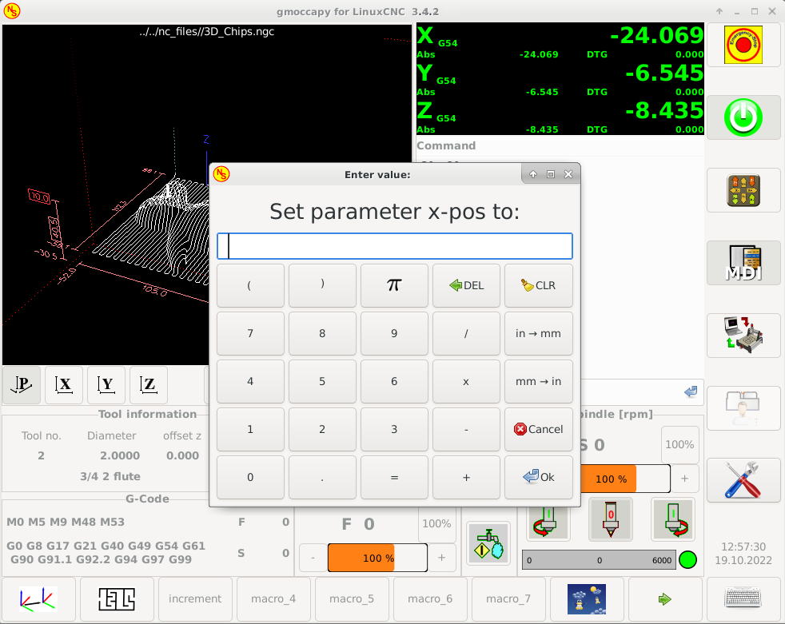
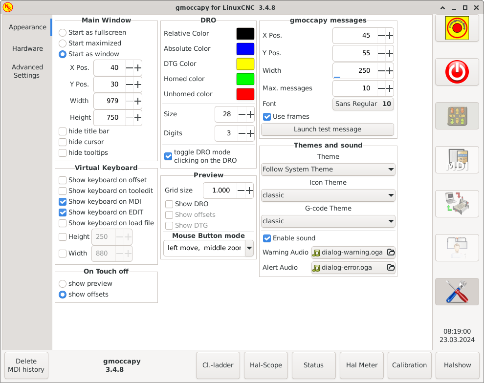
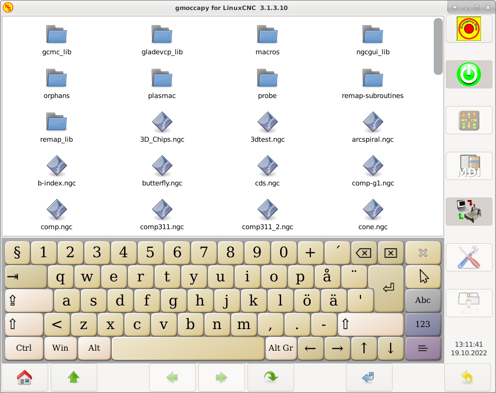
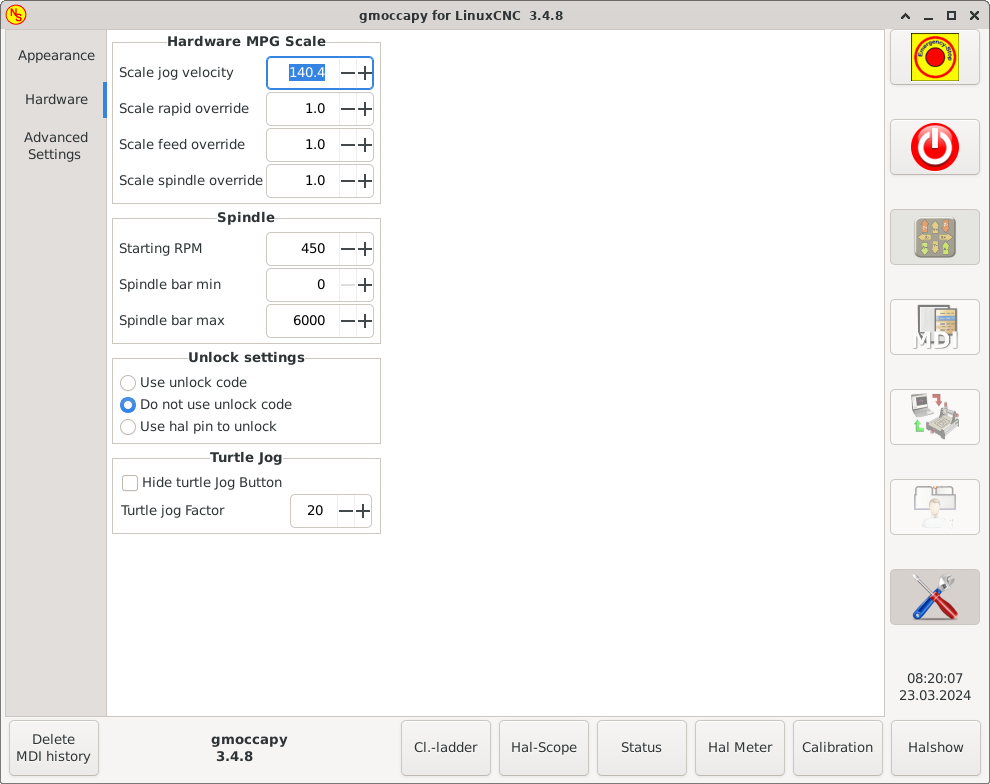

:lang: es

[[cha:gmoccapy]]

= GMOCCAPY

== Introducción

'GMOCCAPY' es una GUI para LinuxCNC, diseñada para ser utilizada con una pantalla táctil,
pero también se puede usar en pantallas normales con un mouse o botones de hardware y 
volantes MPG, ya que presenta pines HAL para las necesidades más comunes. Por favor, vea mas
información a continuación.

Ofrece la posibilidad de mostrar hasta 4 ejes, admite un modo de torno para
herramienta normal y posterior, que puede adaptarse a casi cualquier necesidad, ya que
gmoccapy soporta pestañas y paneles laterales incrustados.
Como un buen ejemplo de esto, puede verse.
http://wiki.linuxcnc.org/cgi-bin/wiki.pl?Gmoccapy_plasma[gmoccapy_plasma]

* gmoccapy 3 soporta hasta 9 ejes y 9 articulaciones. Como el código ha cambiado en gmoccapy 3
para admitir los cambios articulaciones/ejes en LinuxCNC, ¡NO trabaja en versiones 2.7 o 2.6!

Tiene soporte para teclado virtual (onboard o matchbox),
por lo que no hay necesidad de un teclado o mouse de hardware, pero también se puede usar
con ese hardware. Gmoccapy ofrece una página de configuración separada para configurar
la GUI sin editar archivos.

'GMOCCAPY' se puede localizar (usar idioma local) muy fácilmente, porque los archivos correspondientes estan
separados de los archivos .po de linuxcnc, por lo que no hay necesidad de traducir cosas innecesarias.
Los archivos se colocan en */src/po/gmoccapy*. Simplemente copiar el archivo gmoccapy.pot
a algo como fr.po, pl.po, es.po, etc. y traducir ese archivo con gtranslator o poedit.
Después de la recompilacion, tendra la GUI en su idioma preferido. Por favor, publique
su traducción para que pueda ser incluido en los paquetes oficiales y ser
publicado para otros usuarios. En el momento está disponible en inglés, alemán,
español, polaco, serbio y húngaro. Siéntete libre de ayudarme a introducir más
idiomas, *nieson@web.de*. Si necesita ayuda, no dude en preguntar.

image::images/gmoccapy_5_axis.png[align="center"]

== Requisitos

Gmoccapy 3 se ha probado en Debian Jessie, Debian Stretch y MINT 18
con la rama master y la 2.8 de LinuxCNC. Es totalmente compatible con los cambios articulaciones/ejes de LinuxCNC, haciendolo
adecuado como GUI para Scara, Robots o cualquier otra configuración con más articulaciones que
ejes. También soporta configuraciones de pórtico. Si usas otras versiones, por favor,
informar sobre problemas y/o soluciones en
http://www.linuxcnc.org/index.php/english/forum/41-guis/26314-gmoccapy-a-new-screen-for-linuxcnc[LinuxCNC forum] o en
http://www.cncecke.de/forum/showthread.php?t=78549[German CNC Ecke Forum] o en
https://lists.sourceforge.net/lists/listinfo/emc-users[LinuxCNC lista de correo de usuarios]

La resolución de pantalla mínima para gmoccapy, usándola sin paneles laterales, es
*979 x 750 píxeles*, por lo que debe ajustarse a todas las pantallas estándar.
Se recomienda una resolucion de 1024x748.

== Cómo obtener gmoccapy

A partir de LinuxCNC 2.8 gmoccapy se incluye en la instalación estándar.
Así que la forma más fácil de obtener gmoccapy en su PC de control, es simplemente obtener
http://www.linuxcnc.org/index.php/english/download[ISO] e instalar
desde el DVD/Stick-USB.

Usted recibirá actualizaciones con los paquetes deb regulares.

Gmoccapy 3 solo se incluye en la versión master y en la 2.8.

Obtendrá una pantalla similar a la siguiente:
(el diseño puede variar dependiendo de su configuración.)

image::images/gmoccapy_3_axis.png[align="left"]

== Configuración básica

Realmente no hay mucho que configurar para ejecutar gmoccapy, pero hay algunos puntos
con los que debe tener cuidado si desea utilizar todas las funciones de la GUI.

Encontrará los siguientes archivos INI incluidos, solo para mostrar lo básico: +
 +
 * gmoccapy.ini +
 * gmoccapy_4_axis.ini +
 * lathe_configs/gmoccapy_lathe.ini +
 * lathe_configs/gmoccapy_lathe_imperial.ini +
 * gmoccapy_left_panel.ini +
 * gmoccapy_right_panel.ini +
 * gmoccapy_messages.ini +
 * gmoccapy_pendant.ini +
 * gmoccapy_sim_hardware_button.ini +
 * gmoccapy_tool_sensor.ini +
 * gmoccapy_with_user_tabs.ini +
 * gmoccapy_XYZAB.ini +
 * gmoccapy_XYZAC.ini +
 * gmoccapy_XYZCW.ini +
 * gmoccapy-JA/Gantry/gantry_mm.ini +
 * gmoccapy-JA/scara/scara.ini +
 * gmoccapy-JA/table-rotary-tilting/xyzac-trt.ini +
 * y algunos mas... +
 +
Los nombres deben explicar la intención principal de los diferentes archivos INI. +

Si utiliza una configuración existente en su máquina, simplemente edite su INI de acuerdo con este documento. +

IMPORTANTE: si desea utilizar <<gmoccapy:macros, MACROS>>, no olvide configurar la ruta a sus macros o
carpeta de subrutinas como se describe a continuación.

Echemos un vistazo más de cerca al archivo INI y lo que necesita incluir
para usar gmoccapy en su máquina: +

[[gmoccapy:display-section]]
=== La sección DISPLAY
 
 [DISPLAY]
 DISPLAY = gmoccapy
 PREFERENCE_FILE_PATH = gmoccapy_preferences
 MAX_FEED_OVERRIDE = 1.5
 MAX_SPINDLE_OVERRIDE = 1.2
 MIN_SPINDLE_OVERRIDE = 0.5
 LATHE = 1
 BACK_TOOL_LATHE = 1
 PROGRAM_PREFIX = ../../nc_files/

''''

La parte más importante es decirle a LinuxCNC que use gmoccapy, editando la sección [DISPLAY].

 [DISPLAY]
 DISPLAY = gmoccapy

 PREFERENCE_FILE_PATH = gmoccapy_preferences

gmoccapy 3 admite las siguientes opciones de línea de comando:

* -user_mode: si está configurado, el botón de configuración se deshabilitará, por lo que los operadores normales de la máquina no podrán editar la configuración *
* -logo <ruta de acceso al archivo de logotipo>: si se proporciona, el logotipo ocultará la pestaña del botón de jog en modo manual, esto solo es útil para máquinas con botón de hardware para jogging y selección de incrementos +

La línea PREFERENCE_FILE_PATH proporciona la ubicación y el nombre del archivo de preferencias que se utilizará.
En la mayoría de los casos, esta línea no será necesaria; es utilizada por gmoccapy para almacenar su configuración de la GUI, como temas, unidades DRO, colores y configuraciones de teclado, etc., vea la <<gmoccapy:settings-page,página de configuración>> para más detalles.

[NOTE]
Si no se proporciona una ruta o archivo, gmoccapy usará como predeterminado
<your_machinename>.pref. Si no se da un nombre de máquina en el archivo INI, usara
gmoccapy.pref El archivo se almacenará en su directorio de configuración, por lo que
la configuración no se mezclará si utiliza varias configuraciones. Si solo quiere usar
un archivo para varias máquinas, debe incluir PREFERENCE_FILE_PATH en su
INI.

----
MAX_FEED_OVERRIDE = 1.5
----

Establece el porcentaje de alimentación máxima. En el ejemplo dado, se le permitirá
variar la alimentación hasta en un 150%.

[NOTE]
Si no se da ningún valor, se establecerá en 1.0

----
MAX_SPINDLE_OVERRIDE = 1.2
MIN_SPINDLE_OVERRIDE = 0.5
----

Le permitirá cambiar porcentajes del husillo dentro de un límite de 50% a 120%.

[NOTE]
Si no se dan valores, MAX se establecerá en 1.0 y MIN en 0.1

----
LATHE = 1
BACK_TOOL_LATHE = 1
----

La primera línea establece la pantalla con el diseño para controlar un torno.

La segunda línea es opcional y cambiará el eje X de la manera que se necesita para un
torno con herramienta posterior. También los atajos de teclado reaccionarán de una manera diferente.
Con gmoccapy se permite configurar un torno también con eje adicional, por lo que también puede usar una configuración XCW para un torno.

[TIP]
Consulte también la <<gmoccapy:lathe-section,sección específica del torno>>

* PROGRAM_PREFIX = ../../nc_files/

Es la entrada para indicar a linuxcnc/gmoccapy dónde buscar los archivos ngc.

[NOTE]
Si no se especifica, Gmoccapy buscará en el siguiente orden los archivos ngc:
linuxcnc/nc_files y luego el directorio home de los usuarios.

[[gmoccapy:configuration-of-tabs-and-side-panels]]
.Configuración de pestañas y paneles laterales.

Puede agregar programas integrados a gmoccapy como lo puede hacer en axis, touchy y gscreen. Todo se hace automáticamente por gmoccapy si incluye algunas líneas en su archivo INI en la sección DISPLAY.

Si nunca usó un panel glade, se recomienda leer la excelente documentación.
http://www.linuxcnc.org/docs/html/gui/gladevcp.html[Glade VCP]

.Ejemplo

----
 EMBED_TAB_NAME = DRO
 EMBED_TAB_LOCATION = ntb_user_tabs
 EMBED_TAB_COMMAND = gladevcp -x {XID} dro.glade

 EMBED_TAB_NAME = Segunda pestaña de usuario
 EMBED_TAB_LOCATION = ntb_preview
 EMBED_TAB_COMMAND = gladevcp -x {XID} vcp_box.glade
----

Todo lo que debe tener en cuenta es incluir para cada pestaña o panel lateral
las tres líneas mencionadas,

* EMBED_TAB_NAME = Representa el nombre de la pestaña o el panel lateral. Depende de usted
  qué nombre usar, pero debe estar presente.

* EMBED_TAB_LOCATION = Es el lugar donde se colocará su programa en la GUI.

.Los valores válidos son:

* ntb_user_tabs           (como pestaña principal, que cubre la pantalla completa)
* ntb_preview             (como pestaña en el lado de vista previa)
* box_left                (a la izquierda, arriba de la pantalla)
* box_right               (a la derecha, entre la pantalla normal y la lista de botones)
* box_coolant_and_spindle (ocultará los marcos del refrigerante y del husillo e introducirá aqui su archivo glade)
* box_cooling             (ocultará el cuadro de refrigerante e introducirá su archivo glade)
* box_spindle             (ocultará el marco del husillo e introducirá su archivo glade)
* box_vel_info            (ocultará los cuadros de velocidad e introducirá tu archivo glade)
* box_custom_1            (presentará tu archivo glade a la izquierda de vel_frame)
* box_custom_2            (presentará tu archivo glade a la izquierda de cooling_frame)
* box_custom_3            (presentará tu archivo glade a la izquierda de spindle_frame)
* box_custom_4            (presentará su archivo glade a la derecha de spindle_frame)

Vea los diferentes archivos INI incluidos para ver las diferencias.

* EMBED_TAB_COMMAND = el comando a ejecutar, por ejemplo,

----
gladevcp -x {XID} dro.glade
----

Incluye un archivo glade personalizado llamado dro.glade en la ubicación mencionada
El archivo se debe colocar en la carpeta de configuración de su máquina.

----
gladevcp h_buttonlist.glade
----

Solo abrirá una nueva ventana de usuario llamada h_buttonlist.glade. Note la diferencia;
esta es independiente y puede moverse independientemente de la ventana gmoccapy.

----
gladevcp -c gladevcp -u hitcounter.py -H manual-example.hal manual-example.ui
----

Agregará el panel manual-example.ui, incluirá un controlador personalizado de python,
hitcounter.py y realizará todas las conexiones después de realizar el panel de acuerdo con manual-example.hal.

[NOTE]
Si realiza alguna conexión hal al panel de glade personalizado, debe hacerlo en el archivo hal especificado 
en la línea EMBEDDED_TAB_COMMAND; de lo contrario, puede obtener un error de que el pin hal no existe.
Esto se debe a las condiciones de carga de los archivos hal . Las conexiones a pines gmoccapy hal  deben 
realizarse en el archivo hal postgui especificado en su archivo INI, porque este pin no existe antes de realizar la GUI

Aquí hay unos ejemplos:

.ntb_preview - como versión maximizada

image::images/gmoccapy_ntb_preview_maximized_2.png[align="left"]

.ntb_preview

image::images/gmoccapy_ntb_preview.png[align="left"]

.box_left - mostrando gmoccapy en modo de edición

image::images/gmoccapy_with_left_box_in_edit_mode.png[align="left"]

.box_right - y gmoccapy en modo MDI

image::images/gmoccapy_with_right_panel_in_MDI_mode.png[align="left"]

.Configuración de mensajes creados por el usuario

Gmoccapy tiene la capacidad de crear mensajes de usuario desde hal. Para usarlos
es necesario introducir algunas líneas en la sección [DISPLAY] del archivo INI.

Aquí se muestra cómo configurar 3 cuadros de diálogo de mensaje emergente de usuario. 
Los mensajes admiten el lenguaje de marcado pango. Puede encontrar información detallada sobre el lenguaje de marcado en
https://developer.gnome.org/pango/stable/PangoMarkupFormat.html[Pango Markup]

----
MESSAGE_TEXT = El texto a mostrar, puede tener formato pango
MESSAGE_TYPE = "status", "okdialog", "yesnodialog"
MESSAGE_PINNAME = es el nombre del grupo de pines hal que se creará
----

 * 'status' : solo mostrará un mensaje como ventana emergente, usando el 
   sistema de mensajes de gmoccapy

 * 'okdialog' : mantendrá el foco en el cuadro de diálogo del mensaje y activará un Hal_Pin OUT
  "-waiting". Cerrar el mensaje restablecerá el pin de espera

 * 'yesnodialog' : mantendrá el foco en el cuadro de diálogo del mensaje y lo activará
   un bit Hal_Pin OUT "-waiting" y también dará acceso a un bit Hal_Pin Out "-response".
   Este pin mantendrá 1 si el usuario hace clic en Aceptar, y en todos
   los otros estados será 0. Al cerrar el mensaje se restablecerá el pin de espera.
   El pin hal de respuesta permanecerá a 1 hasta que se vuelva a llamar al diálogo.

.Ejemplo
----
MESSAGE_TEXT = Este es un 
mensaje-info  de prueba
MESSAGE_TYPE = status
MESSAGE_PINNAME = statustest

MESSAGE_TEXT = Esta es una prueba de diálogo sí/no
MESSAGE_TYPE = yesnodialog
MESSAGE_PINNAME = yesnodialog

MESSAGE_TEXT = El texto puede ser <small>small</small>, <big>big</big>, <b>bold</ b<i>italic</i>, e incluso
puede ser coloreado.
MESSAGE_TYPE = okdialog
MESSAGE_PINNAME = okdialog
----

Las convenciones específicas de pines hal para esto se pueden encontrar en la seccion
<<gmoccapy:user-created-message,mensajes de usuario>>.

[[gmocappy:rs274ngc]]

=== La sección RS274NGC

----
[RS274NGC]
SUBROUTINE_PATH = macros
----

Establece la ruta para buscar macros y otras subrutinas. Si quiere usar
varias rutas de subrutinas, simplemente sepárelas con ":"

[[gmoccapy:macros]]

=== La sección MACRO

Puede agregar macros a gmoccapy, de manera parecida a Touchy. Una macro no es nada
más que un archivo ngc. Asi se pueden ejecutar programas completos de CNC en modo MDI,
simplemente pulsando un botón. Para hacerlo, tiene que agregar una sección parecida a:

----
[MACROS]
MACRO = i_am_lost
MACRO = hello_world
MACRO = jog_around
MACRO = increment xinc yinc
MACRO = go_to_position X-pos Y-pos Z-pos
----

Esto agregará 5 macros a la lista de botones MDI.

[NOTE]
Como aparecerán un máximo de 16 macros en la GUI, debido a razones de espacio, es posible que deba hacer 
clic en una flecha para cambiar de página y mostrar el botón de macro oculto.
No es un error colocar más en su archivo INI. El botón de macro se mostrará en el orden de las entradas INI.

image::images/gmoccapy_mdi_hidden_keyboard.png[align="left"]

El nombre del archivo debe ser *exactamente el mismo* que el nombre dado en la linea MACRO.
Así, la macro '*i_am_lost*' llamará al archivo '*i_am_lost.ngc*'.

Los archivos de macros deben seguir algunas reglas:

* el nombre del archivo debe ser el mismo que el nombre mencionado en la linea MACRO,
  con la extensión ngc
* El archivo debe contener una subrutina como: '*O<i_am_lost> sub*'; el nombre
  de la subrutina debe coincidir exactamente (*distingue entre mayúsculas y minúsculas*)con el nombre de la macro
* el archivo debe terminar con un endsub '*O<i_am_lost> endsub*' seguido de un
  comando '*M2*'
* los archivos deben colocarse en una carpeta especificada en su archivo INI en la
  sección [RS274NGC] (ver <<gmocappy:rs274ngc,RS274NGC>>)

El código entre sub y endsub se ejecutará presionando el
botón de macro correspondiente.

[NOTE]
Encontrará macros de muestra en la carpeta de macros colocadas en la carpeta sim de gmoccapy.
Si ha dado varias rutas de subrutinas, se buscarán
en el orden de los caminos dados. Se utilizará el primer archivo encontrado.

Gmoccapy también aceptará macros que soliciten parámetros como:

----
go_to_position X-pos Y-pos Z-pos
----

Los parámetros deben estar separados por espacios. Esto llama a un archivo
'go_to_position.ngc' con el siguiente contenido:

----
; Archivo de prueba ir a la posición
; moverá la máquina a una posición dada

O<go_to_position> sub

G17
G21
G54
G61
G40
G49
G80
G90

;#1 = <X-Pos>
;#2 = <Y-Pos>
;#3 = <Z-Pos>

(DBG, Ahora moverá la máquina a X = #1, Y = #2, Z = #3)
G0 X #1 Y #2 Z #3

O<go_to_position> endsub
M2
----

Después de presionar el botón '*ejecutar macro*', se le pedirá que ingrese
valores para '*X-pos Y-pos Z-pos*' y la macro solo se ejecutará si todos los valores
han sido dados.

[NOTE]
Si desea usar una macro sin ningún movimiento, vea también las notas en <<sub:NOT_ENDING_MACROS,problemas conocidos>>

[[gmoccapy:traj-section]]

=== La sección TRAJ

----
DEFAULT_LINEAR_VELOCITY = 85.0
MAX_VELOCITY = 230.000
----

Establece la velocidad máxima y la velocidad de jog predeterminada de la máquina.

[NOTE]
Si no se proporciona DEFAULT_LINEAR_VELOCITY, se utilizará la mitad de MAX_VELOCITY.
Si ese valor tampoco se da, se establecerá de forma predeterminada en 180
Si no se da MAX_VELOCITY, se establecerá por defecto en 600

== Pines HAL

gmoccapy exporta varios pines hal para poder reaccionar a dispositivos de hardware.
El objetivo es obtener una GUI que pueda operarse completamente o en su mayor parte
sin ratón ni teclado.

[NOTE]
Tendrá que hacer todas las conexiones a los pines gmoccapy en su archivo postgui.hal,
porque no están disponibles antes de cargar la GUI completamente. Es posible
llamar a varios archivos postgui hal, facilitando la depuración de la configuración. Para ello, use
un archivo postgui_call_list.hal. Las conexiones al panel de usuario deben hacerse en un
archivo hal separado, ya que los paneles se cargan después de la GUI.
Ver <<gmoccapy:configuration-of-tabs-and-side-panels,pestañas y paneles laterales>>
para detalles.

=== Listas de botones derecha e inferior

La pantalla tiene dos listas de botones principales, una en el lado derecho y otra en la
parte inferior. Los botones de la derecha no cambiarán durante la operación, pero
la lista de botones inferior cambiará muy a menudo. Los botones se numeran de arriba hacia
abajo y de izquierda a derecha comenzando con "0".

[NOTE]
los nombres de pin para *Gmoccapy 3* ha cambiado para ordenarlos mejor:

En hal_show verá que los botones derechos (verticales) son:

* gmoccapy.v-button.button-0
* gmoccapy.v-button.button-1
* gmoccapy.v-button.button-2
* gmoccapy.v-button.button-3
* gmoccapy.v-button.button-4
* gmoccapy.v-button.button-5
* gmoccapy.v-button.button-6

y los botones inferiores (horizontales) son:

* gmoccapy.h-button.button-0
* gmoccapy.h-button.button-1
* gmoccapy.h-button.button-2
* gmoccapy.h-button.button-3
* gmoccapy.h-button.button-4
* gmoccapy.h-button.button-5
* gmoccapy.h-button.button-6
* gmoccapy.h-button.button-7
* gmoccapy.h-button.button-8
* gmoccapy.h-button.button-9

A medida que los botones en la lista inferior cambien de acuerdo con el modo y otras
consideraciones, los botones de hardware activarán diferentes funciones, y usted
no tendra que cuidar de cambiar las funciones en hal, porque eso
se hace completamente dentro de gmoccapy!

for a 3 axis XYZ machine the hal pin will react as follows:

in manual mode:

* gmoccapy.h-button.button-0 == open homing button
* gmoccapy.h-button.button-1 == open touch off stuff
* gmoccapy.h-button.button-2 ==
* gmoccapy.h-button.button-3 == open tool dialogs
* gmoccapy.h-button.button-4 ==
* gmoccapy.h-button.button-5 ==
* gmoccapy.h-button.button-6 ==
* gmoccapy.h-button.button-7 ==
* gmoccapy.h-button.button-8 == full-size preview
* gmoccapy.h-button.button-9 == exit if machine is off, otherwise no reaction

in mdi mode:

* gmoccapy.h-button.button-0 == macro_0 or nothing
* gmoccapy.h-button.button-1 == macro_1 or nothing
* gmoccapy.h-button.button-2 == macro_2 or nothing
* gmoccapy.h-button.button-3 == macro_3 or nothing
* gmoccapy.h-button.button-4 == macro_4 or nothing
* gmoccapy.h-button.button-5 == macro_5 or nothing
* gmoccapy.h-button.button-6 == macro_6 or nothing
* gmoccapy.h-button.button-7 == macro_7 or nothing
* gmoccapy.h-button.button-8 == macro_8 or switch page to additional macros
* gmoccapy.h-button.button-9 == open keyboard or abort if macro is running

in auto mode

* gmoccapy.h-button.button-0 == open file
* gmoccapy.h-button.button-1 == reload program
* gmoccapy.h-button.button-2 == run
* gmoccapy.h-button.button-3 == stop
* gmoccapy.h-button.button-4 == pause
* gmoccapy.h-button.button-5 == step by step
* gmoccapy.h-button.button-6 == run from line if enabled in settings, otherwise Nothing
* gmoccapy.h-button.button-7 == optional blocks
* gmoccapy.h-button.button-8 == full-size preview
* gmoccapy.h-button.button-9 == edit code

in settings mode:

* gmoccapy.h-button.button-0 == delete MDI history
* gmoccapy.h-button.button-1 ==
* gmoccapy.h-button.button-2 ==
* gmoccapy.h-button.button-3 ==
* gmoccapy.h-button.button-4 == open classic ladder
* gmoccapy.h-button.button-5 == open hal scope
* gmoccapy.h-button.button-6 == open hal status
* gmoccapy.h-button.button-7 == open hal meter
* gmoccapy.h-button.button-8 == open hal calibration
* gmoccapy.h-button.button-9 == open hal show

in homing mode:

* gmoccapy.h-button.button-0 ==
* gmoccapy.h-button.button-1 == home all
* gmoccapy.h-button.button-2 ==
* gmoccapy.h-button.button-3 == home x
* gmoccapy.h-button.button-4 == home y
* gmoccapy.h-button.button-5 == home z
* gmoccapy.h-button.button-6 ==
* gmoccapy.h-button.button-7 ==
* gmoccapy.h-button.button-8 == unhome all
* gmoccapy.h-button.button-9 == back

in touch off mode:

* gmoccapy.h-button.button-0 == edit offsets
* gmoccapy.h-button.button-1 == touch X
* gmoccapy.h-button.button-2 == touch Y
* gmoccapy.h-button.button-3 == touch Z
* gmoccapy.h-button.button-4 ==
* gmoccapy.h-button.button-5 ==
* gmoccapy.h-button.button-6 == zero G92
* gmoccapy.h-button.button-7 ==
* gmoccapy.h-button.button-8 == set selected
* gmoccapy.h-button.button-9 == back

in tool mode:

* gmoccapy.h-button.button-0 == delete tool(s)
* gmoccapy.h-button.button-1 == new tool
* gmoccapy.h-button.button-2 == reload tool table
* gmoccapy.h-button.button-3 == apply changes
* gmoccapy.h-button.button-4 == change tool by number T? M6
* gmoccapy.h-button.button-5 == set tool by number without change M61 Q?
* gmoccapy.h-button.button-6 == change tool to the selected one
* gmoccapy.h-button.button-7 ==
* gmoccapy.h-button.button-8 == touch of tool in Z
* gmoccapy.h-button.button-9 == back

in edit mode:

* gmoccapy.h-button.button-0 == 
* gmoccapy.h-button.button-1 == reload file
* gmoccapy.h-button.button-2 == save
* gmoccapy.h-button.button-3 == save as
* gmoccapy.h-button.button-4 ==
* gmoccapy.h-button.button-5 ==
* gmoccapy.h-button.button-6 == new file
* gmoccapy.h-button.button-7 ==
* gmoccapy.h-button.button-8 == show keyboard
* gmoccapy.h-button.button-9 == back

in select file mode:

* gmoccapy.h-button.button-0 == go to home directory
* gmoccapy.h-button.button-1 == one directory level up
* gmoccapy.h-button.button-2 ==
* gmoccapy.h-button.button-3 == move selection left
* gmoccapy.h-button.button-4 == move selection right
* gmoccapy.h-button.button-5 == jump to directory as set in settings
* gmoccapy.h-button.button-6 ==
* gmoccapy.h-button.button-7 == select / ENTER
* gmoccapy.h-button.button-8 ==
* gmoccapy.h-button.button-9 == back

*So we have 67 reactions with only 10 hal pin!*

Estos pines están disponibles para poder utilizar la pantalla sin un
panel tactil, o protégerlos del uso excesivo colocando botones de hardware alrededor
el panel.

image::images/gmoccapy_0_9_7_sim_hardware_button.png[align="left"]

=== Velocidades y porcentajes

Todos los controles deslizantes de gmoccapy se pueden conectar a encoders o potenciómetros hardware.

[NOTE]
para Gmoccapy 3 los nombres de pines hal han cambiado, a medida que se implementaron nuevos controles.
La velocidad máxima ya no existe, ya que se ha implementado el porcentaje de rapidos.
Este cambio se ha hecho ya que lo pidieron muchos usuarios.

Para conectar los 'encoders' se exportan los siguientes pines:

[width="80%", options="header", cols="^,<,^"]
|====================================================================
|                   PIN                         |  TIPO   |  FUNCION
|gmoccapy.jog.jog-velocity.counts               | HAL_S32 | velocidad Jog
|gmoccapy.jog.jog-velocity.count-enable         | HAL_BIT | verdadero habilita conteos
|gmoccapy.feed.feed-override.counts             | HAL_S32 | porcentaje de alimentacion 
|gmoccapy.feed.feed-override.count-enable       | HAL_BIT | verdadero habilita conteos
|gmoccapy.feed.reset-feed-override              | HAL_BIT | restablece alimentación al 100%
|gmoccapy.spindle.spindle-override.counts       | HAL_S32 | porcentaje del husillo
|gmoccapy.spindle.spindle-override.count-enable | HAL_BIT | verdadero habilita conteos
|gmoccapy.spindle.reset-spindle-override        | HAL_BIT | restablece husillo al 100%
|gmoccapy.rapid.rapid_override.counts           | HAL_S32 | Velocidad máxima de la máquina
|gmoccapy.rapid.rapid_override.count-enable     | HAL_BIT | verdadero habilita conteos
|====================================================================

Para conectar 'potenciómetros', use los siguientes pines hal:

[width="80%", options="header", cols="^,<,^"]
|====================================================================
|                   PIN                          |  TIPO     |  FUNCION
|gmoccapy.jog.jog-velocity.direct-value          | HAL_FLOAT | velocidad Jog
|gmoccapy.jog.jog-velocity.analog-enable         | HAL_BIT   | verdadero habilita analogico
|gmoccapy.feed.feed-override.direct-value        | HAL_FLOAT | porcentaje de alimentacion 
|gmoccapy.feed.feed-override.analog-enable       | HAL_BIT   | verdadero habilita analogico
|gmoccapy.spindle.spindle-override.direct-value  | HAL_FLOAT | porcentaje del husillo
|gmoccapy.spindle.spindle-override.analog-enable | HAL_BIT   | verdadero habilita analogico
|gmoccapy.rapid.rapid_override.direct-value      | HAL_FLOAT | Velocidad máxima de la máquina
|gmoccapy.rapid.rapid_override.analog-enable     | HAL_BIT   | verdadero habilita analogico
|====================================================================

Además gmoccapy 3 ofrece pines hal adicionales para controlar
los nuevos widgets deslizantes con pulsadores. Los valores qué daran la rapidez del aumento
o disminución deben establecerse en el archivo glade. En un lanzamiento futuro esto
estara integrado en la página de configuración.

[width="80%", options="header", cols="^,<,^"]
|====================================================================
| PIN                              | TIPO          | FUNCION
|                                  |               |
|VELOCIDAD                         |               |
|gmoccapy.spc_jog_vel.increase     | HAL_BIT IN    | Si True, el valor del control deslizante aumentará
|gmoccapy.spc_jog_vel.decrease     | HAL_BIT IN    | Si True, el valor del control deslizante disminuira
|gmoccapy.spc_jog_vel.scale        | HAL_FLOAT IN  | Escalado del valor de salida (util en udes/min a udes/seg.)
|gmoccapy.spc_jog_vel.value        | HAL_FLOAT OUT | valor del widget
|gmoccapy.spc_jog_vel.scaled-value | HAL_FLOAT OUT | valor escalado del widget
|ALIMENTACION                      |               | 
|gmoccapy.spc_feed.increase        | HAL_BIT IN    | Si True, el valor del control deslizante aumentará
|gmoccapy.spc_feed.decrease        | HAL_BIT IN    | Si True, el valor del control deslizante disminuira
|gmoccapy.spc_feed.scale           | HAL_FLOAT IN  | Escalado del valor de salida (util en udes/min a udes/seg.)
|gmoccapy.spc_feed.value           | HAL_FLOAT OUT | valor del widget
|gmoccapy.spc_feed.scaled-value    | HAL_FLOAT OUT | valor escalado del widget
|HUSILLO                           |               |
|gmoccapy.spc_spindle.increase     | HAL_BIT IN    | Si True, el valor del control deslizante aumentará
|gmoccapy.spc_spindle.decrease     | HAL_BIT IN    | Si True, el valor del control deslizante disminuira
|gmoccapy.spc_spindle.scale        | HAL_FLOAT IN  | Escalado del valor de salida (util en udes/min a udes/seg.)
|gmoccapy.spc_spindle.value        | HAL_FLOAT OUT | valor del widget
|gmoccapy.spc_spindle.scaled-value | HAL_FLOAT OUT | valor escalado del widget
|RAPIDOS                           |               |
|gmoccapy.spc_rapid.increase       | HAL_BIT IN    | Si True, el valor del control deslizante aumentará
|gmoccapy.spc_rapid.decrease       | HAL_BIT IN    | Si True, el valor del control deslizante disminuira
|gmoccapy.spc_rapid.scale          | HAL_FLOAT IN  | Escalado del valor de salida (util en udes/min a udes/seg.)
|gmoccapy.spc_rapid.value          | HAL_FLOAT OUT | valor del widget
|gmoccapy.spc_rapid.scaled-value   | HAL_FLOAT OUT | valor escalado del widget
|====================================================================

Los pines float aceptan valores de 0.0 a 1.0, siendo el valor de porcentaje que
desea establecer como valor del control deslizante

[AVISO] Si usa ambos tipos de conexión, no conecte el mismo control deslizante a
ambos pines, ya que las influencias entre los dos no han sido probadas. Diferentes
deslizadores pueden estar conectados a uno u otro tipo de conexión hal.

[IMPORTANT] Tenga en cuenta que la velocidad de jog depende del estado del botón tortuga,
con diferentes escalas deslizantes dependiendo del modo (tortuga o conejo).
Por favor, eche un vistazo también a <<gmoccapy:jog-velocity,velocidades jog y pin hal jog-tortuga>> para más
detalles

.Ejemplo
----
Spindle Override Min Value =  20 %
Spindle Override Max Value = 120 %
gmoccapy.analog-enable = 1
gmoccapy.spindle-override-value = 0.25

value to set = Min Value + (Max Value - Min Value) * gmoccapy.spindle-override-value
value to set = 20 + (120 - 20) * 0.25
value to set = 45 %
----

=== Pines Jog Hal

Todos los ejes dados en el archivo INI tienen un pin jog-plus y un jog-minus, por lo que
se pueden utilizar interruptores momentáneos de hardware para mover el eje.

[NOTE]
el nombre de este pin ha cambiado para Gmoccapy 3

Para la configuración estándar de XYZ, los siguientes pines estarán disponibles:

* gmoccapy.jog.axis.jog-x-plus
* gmoccapy.jog.axis.jog-x-minus
* gmoccapy.jog.axis.jog-y-plus
* gmoccapy.jog.axis.jog-y-minus
* gmoccapy.jog.axis.jog-z-plus
* gmoccapy.jog.axis.jog-z-minus

Si usa un archivo INI de 4 ejes, habrá dos pines adicionales

* gmoccapy.jog.<cuarta letra de eje>-plus
* gmoccapy.jog.< cuarta letra de eje>-minus

Para un eje "C" se veria:

* gmoccapy.jog.axis.jog-c-plus
* gmoccapy.jog.axis.jog-c-minus

[[gmoccapy:jog-velocity]]

=== Velocidades Jog y pin hal jog-tortuga

La velocidad de jog se puede seleccionar con el control deslizante correspondiente. La escala
del control deslizante se modificará si el botón tortuga (el que muestra un conejo o una
tortuga) ha sido pulsado. Si el botón no es visible, podría haber sido
desactivado en la <<gmoccapy:turtle-jog,página de configuración>>. Si el botón muestra el
icono de conejo, la escala de velocidad de la máquina es de min. a máx. . Si muestra una
tortuga, la escala alcanzará solo 1/20 de velocidad máxima por defecto.
La fraccion se puede configurar en la <<gmoccapy:turtle-jog, página de configuración>>.

Con ello, el usar una pantalla táctil es mucho más fácil al seleccionar velocidades más pequeñas.

gmoccapy ofrece un pin hal para alternar entre jogs tortugas y conejos

* gmoccapy.jog.turtle-jog (Hal Bit In)

=== Pines hal de incremento de jog

Los incrementos de jog se pueden seleccionar a través de pines hal, por lo que un interruptor hardware de selección
se puede usar para seleccionar el incremento a usar. Habrá un máximo
de 10 pines hal para los incrementos dados en el archivo INI; si da más
incrementos en su archivo INI, no serán accesibles desde la GUI ya que
no se mostrarán.

[NOTE]
Gmoccapy 3 utiliza diferentes nombres de pin hal

Si tiene 6 incrementos en su hal, obtendrá * 7 * pines:
jog-inc-0 no se puede cambiar y representará jogging continuo.

* gmoccapy.jog.jog-inc-0
* gmoccapy.jog.jog-inc-1
* gmoccapy.jog.jog-inc-2
* gmoccapy.jog.jog-inc-3
* gmoccapy.jog.jog-inc-4
* gmoccapy.jog.jog-inc-5
* gmoccapy.jog.jog-inc-6

[[gmoccapy:hardware-unlock]]

=== Pin de desbloqueo hardware

Para poder usar un interruptor de llave para desbloquear la página de configuración, 
se exporta siguiente pin:

* gmoccapy.unlock-settings

La página de configuración está desbloqueada si el pin está alto.
Para usar este pin, debes activarlo en la página de configuración.

=== Pines de error

 * gmoccapy.error
 * gmoccapy.delete-message

gmoccapy.error es un pin de salida, para indicar un error, por lo que una luz puede encenderse o incluso la máquina puede
ser detenida. Se resetea con el pin gmoccapy.delete-message, que
elimina el primer error y restablece el pin gmoccapy.error en False una vez que se haya borrado el último error.

NOTA: Los mensajes o las informaciones de usuario no afectarán el pin gmoccapy.error, pero el mensaje gmoccapy.delete
pin borrará el último mensaje si no se muestra ningún error!

[[gmoccapy:user-created-message]]

=== Pines HAL de Mensajes creados por el usuario

gmoccapy puede reaccionar a errores externos, utilizando 3 mensajes de usuario diferentes (todos son HAL_BIT):

'Estado'

* gmoccapy.messages.statustest

'dialogo-YesNo'

* gmoccapy.messages.yesnodialog
* gmoccapy.messages.yesnodialog-waiting
* gmoccapy.messages.yesnodialog-responce

'dialogo-Ok'

* gmoccapy.messages.okdialog
* gmoccapy.messages.okdialog-waiting

Para agregar un mensaje creado por el usuario, debe agregar el mensaje al archivo INI en el
Sección [DISPLAY]. Aquí hay un par de ejemplos.

----
MESSAGE_BOLDTEXT = FALLO EN SISTEMA DE LUBRICACION
MESSAGE_TEXT = Fallo de lubricación
MESSAGE_TYPE = okdialog
MESSAGE_PINNAME = lube-fault

MESSAGE_BOLDTEXT = NONE
MESSAGE_TEXT = X SHEAR PIN BROKEN
MESSAGE_TYPE = status
MESSAGE_PINNAME = pin
----

Para 'conectar' los nuevos pines debe hacerlo en el archivo HAL Postgui.
Aquí hay algunos ejemplos de conexiones que tienen la señal conectada a una entrada en
algún otro lugar en el archivo HAL.

----
net gmoccapy-lube-fault gmoccapy.messages.lube-fault
net gmoccapy-lube-fault-waiting gmoccapy.messages.lube-fault-waiting
red gmoccapy-pin gmoccapy.messages.pin
----

Para obtener más información sobre los archivos HAL y el comando net, consulte la
<<cha:basic-hal-reference, referencia HAL básica>>.

=== Pines de realimentación del husillo

Hay dos pines para la retroalimentación del husillo.

* gmoccapy.spindle_feedback_bar
* gmoccapy.spindle_at_speed_led

'gmoccapy.spindle_feedback_bar' aceptará una entrada float para mostrar la velocidad del husillo.
'gmoccapy.spindle_at_speed_led' es un pin de bit para encender el led GUI si el husillo está
a su velocidad.

=== Pines para indicar información sobre el progreso del programa

Hay tres pines que dan información sobre el progreso del programa:

* gmoccapy.program.length, HAL_S32, que muestra el número total de líneas de programa
* gmoccapy.program.current-line, HAL_S32, que indica la línea de trabajo actual del programa
* gmoccapy.program.progress, HAL_FLOAT, que da el progreso del programa en porcentaje

Los valores pueden no ser muy precisos, si está trabajando con subrutinas o
procedimientos de remapeo grandes; también los bucles causarán diferentes valores.

=== Pines relacionado con la herramienta

.Pin de cambio de herramienta

Este pin se proporciona para usar el diálogo de cambio de herramienta interno de gmoccapy, similar
al conocido de AXIS, pero con varias modificaciones. No solo le mostrara
el mensaje para cambiar 'número de herramienta 3', sino también la descripción de esa
herramienta, como 'Fresa 7,5 mm 3 filos'. La información se toma de la tabla de herramientas,
por lo que depende de usted lo qué se muestre.

.Cambio manual de herramienta

image::images/manual_toolchange.png[align = "center"]

* gmoccapy.toolchange-number, HAL_S32, El número de la herramienta que se va a cambiar
* gmoccapy.toolchange-change, HAL_BIT, Indica que se debe cambiar una herramienta
* gmoccapy.toolchange-modified, HAL_BIT, Indica que la herramienta ha cambiado

Por lo general, se conectan así para un cambio de herramienta manual:

----
net tool-change gmoccapy.toolchange-change <= iocontrol.0.tool-change
net tool-changed gmoccapy.toolchange-changed <= iocontrol.0.tool-changed
net tool-prep-number gmoccapy.toolchange-number <= iocontrol.0.tool-prep-number
net tool-prep-loop iocontrol.0.tool-prepare <= iocontrol.0.tool-prepared
----

.Pines de offsets de herramientas

Estos pines le permiten mostrar los valores de offset de la herramienta activa para X y Z en el
cuadro de información de la herramienta. Solo están activos después de G43.

.Informacion de herramienta

image::images/gmoccapy_0_9_7_tool_info.png[align="center"]

* gmoccapy.tooloffset-x
* gmoccapy.tooloffset-z

Conéctelos en su postgui hal.

[NOTE]
la línea tooloffset-x no es necesaria en una fresadora, y no se mostrará en una
fresadora con cinemática trivial.

----
 net tooloffset-x gmoccapy.tooloffset-x <= motion.tooloffset.x
 net tooloffset-z gmoccapy.tooloffset-z <= motion.tooloffset.z
----

Tenga en cuenta que gmoccapy se encarga de actualizar los offsets,
enviando un G43 después de cualquier cambio de herramienta, *pero no en modo automático!*

[IMPORTANT]
Al escribir un programa, usted es responsable de incluir un G43 después
cada cambio de herramienta!

[[gmoccapy:auto-tool-measurement]]

== Medición automática de herramientas

Gmoccapy ofrece una medición automática integrada de herramientas. Para usar esta característica, usted
tendrá que hacer algunos ajustes adicionales y es posible que desee utilizar el
pin hal que se ofrece para obtener valores en su propio procedimiento ngc de remapeo.

[IMPORTANT] Antes de comenzar la primera prueba, no olvide ingresar
altura y velocidades de la sonda en la página de configuración! Ver
<<gmoccapy:tool-measurement, página de configuración de medición de Herramienta>>

También podría ser una buena idea echar un vistazo a la herramienta de medición en video:
ver <<gmoccapy:tool-measurement-videos, videos relacionados con la medición de herramientas>>

La medición de herramientas en gmoccapy se realiza de forma un poco diferente a muchas otras GUI.
Debe seguir estos pasos:

* toque de su pieza en X e Y
* mida la altura de su bloque desde la base donde está ubicado su interruptor de herramienta
  a la cara superior del bloque (incluida mordaza, etc.)
* Presione el botón de altura del bloque e ingrese el valor medido
* Ir al modo automático y comenzar su programa

Aquí hay un pequeño boceto:

.Datos para medicion de herramientas

image::images/sketch_auto_tool_measurement.png[align="center"]

Con el primer cambio de herramienta, la herramienta se medirá y el offset
se configura automáticamente para adaptarse a la altura del bloque. La ventaja de gmoccapy
es que no se necesita una herramienta de referencia.

[NOTE]
¡Su programa debe contener un cambio de herramienta al principio! La herramienta será
medida, incluso se ha utilizado antes, por lo que no hay peligro si
la altura del bloque ha cambiado. Hay varios videos que muestran la manera de hacerlo en
Youtube.

=== Pines de medición de herramientas

Gmoccapy ofrece 5 pines para fines de medición de herramientas. Los pines se utilizan principalmente
para leer desde una subrutina de gcode, para que el código pueda reaccionar a diferentes valores.

* gmoccapy.toolmeasurement, HAL_BIT, permitir o no medición de herramientas
* gmoccapy.blockheight, HAL_FLOAT, el valor medido de la cara superior de la pieza de trabajo
* gmoccapy.probeheight, HAL_FLOAT, la altura del interruptor de la sonda
* gmoccapy.searchvel, HAL_FLOAT, la velocidad para buscar el interruptor de la sonda de herramienta
* gmoccapy.probevel, HAL_FLOAT, la velocidad para sondear la longitud de la herramienta

=== Modificaciones de archivos INI en medición de herramienta

Modifique su archivo INI para incluir lo siguiente:

En la sección [RS274NGC]

----
[RS274NGC]
# Habilita lectura de valores INI y HAL desde gcode
FEATURES=12

# sub que se llama cuando ocurre un error durante el cambio de herramienta
ON_ABORT_COMMAND=O <on_abort> call

# El código de remapeo
REMAP=M6  modalgroup=6 prolog=change_prolog ngc=change epilog=change_epilog
----

.La seccion del sensor de herramienta

Todos los valores de la posición del sensor de la herramienta y la posición inicial del movimiento de sondeo
son coordenadas absolutas, excepto MAXPROBE, que debe darse en movimiento relativo.

----
[TOOLSENSOR]
X = 10
Y = 10
Z = -20
MAXPROBE = -20
----

.La sección de cambio de posición

Esto no se ha llamado TOOL_CHANGE_POSITION a propósito - *canon usa ese nombre e
interferiria.*. Es la posición a donde mover la máquina antes de dar el comando
para cambiar la herramienta. Todos los valores están en coordenadas absolutas.

----
[CHANGE_POSITION]
X = 10
Y = 10
Z = -2
----

.La Sección de Python.

Los complementos de Python sirven como intérprete y tarea.

----
[PYTHON]
# La ruta para iniciar una búsqueda de módulos de usuario.
PATH_PREPEND = python
# El punto de inicio para todos.
TOPLEVEL = python/toplevel.py
----

=== Archivos Necesarios

Debe copiar los siguientes archivos a su directorio de configuración

Primero cree un directorio 'python' en su carpeta de configuración. Desde
'su_directorio_linuxcnc-dev/configs/sim/gmoccapy/python' copie:
'toplevel.py',
'remap.py' y 
'stdglue.py' 
a su carpeta 'config_dir / python'.

Desde 'su_directorio_linuxcnc-dev/configs/sim/gmoccapy/macros' copie:
'on_abort.ngc' y 
'change.ngc' 
al directorio especificado como SUBROUTINE_PATH. 
Vea <<gmocappy:rs274ngc, Seccion RS274NGC>>.

Abra 'change.ngc' con un editor y descomente las siguientes líneas
(49 y 50):

----
F #<_ hal [gmoccapy.probevel]>
G38.2 Z-4
----

Es posible que desee modificar este archivo para que se ajuste más a sus necesidades.

=== Conexiones Hal necesarias

Conecte la sonda de la herramienta en su archivo hal así:

----
net probe  motion.probe-input <= <your_input_pin>
----

La línea podría verse así:

-------
 net probe  motion.probe-input <= parport.0.pin-15-in
-------

En su archivo postgui.hal agregue:

-------
# Las siguientes líneas solo son necesarias si los pines se habían conectado antes
unlinkp iocontrol.0.tool-change
unlinkp iocontrol.0.tool-changed
unlinkp iocontrol.0.tool-prep-number
unlinkp iocontrol.0.tool-prepared

# enlace a gmoccapy toolchange, para obtener la ventaja de la descripción en el cuadro de diálogo de cambio de herramienta  
net tool-change gmoccapy.toolchange-change <= iocontrol.0.tool-change
net tool-changed gmoccapy.toolchange-changed <= iocontrol.0.tool-changed
net tool-prep-number gmoccapy.toolchange-number <= iocontrol.0.tool-prep-number
net tool-prep-loop iocontrol.0.tool-prepare <= iocontrol.0.tool-prepared
-------

[[gmoccapy:settings-page]]

== La página de configuración

Para ingresar a la página deberás hacer click en
image:images/gmoccapy_settings_button.png[align="left"]
y dar un código de desbloqueo, que es * 123 * por defecto. Si quieres cambiarlo
en este momento tendrá que editar el archivo de preferencias oculto. Vea
<<gmoccapy:display-section, la sección de pantalla>> para más detalles.

La página se ve así:

.Pagina de configuracion

La página está separada en tres pestañas principales:

=== Apariencia

En esta pestaña encontrará las siguientes opciones:

Ventana principal::
    Aquí puede seleccionar cómo desea que comience la GUI. La razón principal de esto fue el deseo de obtener una forma +
    facil para el usuario de configurar las opciones de inicio sin la necesidad de tocar código. +
    +
    Tienes tres opciones: +

* iniciar como pantalla completa
* iniciar maximizado
* iniciar como ventana
    +
    Si selecciona Iniciar como ventana, se activarán los cuadros para establecer la posición y el tamaño. +
    Una vez establecidos, la GUI se iniciará cada vez en el lugar y con el tamaño seleccionado. +
    Sin embargo, el usuario puede cambiar el tamaño y la posición con el mouse, pero eso +
    no tiene ninguna influencia en la configuración. +

'* Ocultar cursor *' permite ocultar el cursor, lo que es muy útil si utilizar una pantalla táctil.

Teclado::
    Las casillas de verificación permiten al usuario seleccionar si desea que el teclado integrado se muestre de inmediato, +
    al ingresar al modo MDI, al ingresar a la página de offsets, al widget tooledit o al abrir un programa +
    en el modo EDITAR. El botón del teclado en la lista de botones inferior no se verá afectado por esta configuración, +
    para que pueda mostrar u ocultar el teclado presionando el botón. El comportamiento por defecto será establecido por +
    las casillas de verificación. +
    +
    Los valores predeterminados son: +

[NOTE]
Si esta sección no es confidencial, no se ha instalado un teclado virtual;
+ los admitidos son 'onboard' y 'matchbox-keyboard'.

* Mostrar teclado en offset = Verdadero
* Mostrar teclado en tooledit = False
* Mostrar teclado en MDI = Verdadero
* Mostrar teclado en EDITAR = Verdadero
* Mostrar teclado en carga de = Falso

Si la distribución del teclado no es correcta, es decir, al hacer clic en X se obtiene Z,
el diseño no se ha establecido correctamente, en relacion con la configuración regional. Para
'onboard' se puede resolver con un pequeño archivo por lotes con el siguiente contenido:

----
 #!/bin/bash
 setxkbmap -model pc105 -layout XX -variant basic
----

Las letras XX se tendrán que configurar de acuerdo con su
configuración regional (para español de España, *es*). Simplemente ejecute este archivo antes de iniciar LinuxCNC. Tambien puede
agregar un starter a su carpeta local

----
./config/autostart
----

para que el diseño se establezca automáticamente en el inicio.

Para matchbox-keyboard tendrá que hacer su propio diseño.

On Touch Off::
    da la opción de mostrar la pestaña de vista previa o de la página de offsets si ingresa en el modo touch off haciendo clic en
    botón inferior correspondiente.

* Mostrar vista previa
* Mostrar offsets

A medida que se muestran las pestañas, puede cambiar entre ambas vistas en
cualquier caso.

Mostrar pantalla auxiliar::
    Al hacer clic en este botón se abrirá una ventana adicional. Este botón solo es sensible si un archivo llamado 'Gmoccapy 3.glade'
    se encuentra en su carpeta de configuración. Puedes construir la pantalla Aux usando Glade.

[WARNING]
'La ventana principal de la pantalla auxiliar debe llamarse window2'

Opciones de DRO::
Tiene la opción de seleccionar los colores de fondo de los diferentes estados del DRO.
Por lo tanto, los usuarios que sufren de protanopia (debilidad roja/verde) pueden seleccionar los colores adecuados

Por defecto los fondos son:

* Modo relativo = negro
* Modo absoluto = azul
* Distancia a recorrer = amarillo

El color de primer plano del DRO se puede seleccionar con:

* homed color = verde
* unhomed color = rojo

'mostrar DRO en vista previa' +
el DRO se mostrará en la ventana de vista previa + +

'mostrar los offsets' +
Los offsets se mostrarán en la ventana de vista previa + +

'mostrar DTG' +
La distancia a recorrer se mostrará en la ventana de vista previa + +
 +
'mostrar boton DRO' +
le permitirá mostrar botones adicionales en el lado izquierdo del DRO. +

Se mostrará: +
* Un botón para cambiar de coordenadas relativas a absolutas, +
* un botón para alternar entre la distancia a recorrer y los otros estados +
* y un botón para alternar las unidades de métricas a imperiales y viceversa.

[WARNING]
No se recomienda usar esta opción, porque el usuario
puede perder la opción de unidad automática, que alternará las unidades según el
gcode activo G20/G21.

[NOTE]
Puede cambiar a través de los modos DRO (absoluto, relativo, distancia
a recorrer) haciendo clic en el DRO!

'Usar unidades automáticas' +
permite deshabilitar la opción de unidades automáticas de la pantalla, para que pueda ejecutar un programa en pulgadas y ver el DRO en mm. + +

'tamaño' +
permite configurar el tamaño de la fuente DRO; el valor predeterminado es 28; si usa una pantalla más grande, es posible que desee aumentar el tamaño hasta 56.
    Si utiliza 4 ejes, el tamaño de fuente DRO será 3/4 del valor, debido a razones de espacio. + +

'dígitos' +
establece el número de dígitos del DRO de 1 a 5. +
 
[NOTE]
Imperial mostrará un dígito más que métrico; si está en unidades de máquinas imperiales y establece el valor de dígito en 1, no obtendrá ningún dígito en métrico.

'cambiar modo DRO' +
Si no está activo, un clic del ratón en el DRO no realizará ninguna acción. +
De forma predeterminada, esta casilla de verificación está activa, por lo que cada clic en cualquier DRO cambiará la lectura DRO de real a relativa a DTG (distancia a recorrer). + +

Vista previa::

'Tamaño de cuadrícula' Establece el tamaño de cuadrícula de la ventana de vista previa. Desafortunadamente, el tamaño
* debe establecerse en pulgadas *, incluso si las unidades de su máquina son métricas. Esperamos
arreglar eso en un futuro lanzamiento.

[NOTE]
La cuadrícula no se mostrará en la vista en perspectiva.

'Mostrar DRO' +
Mostrará el DRO también en la ventana de vista previa. Se mostrará automáticamente en vista previa a tamaño completo

'Mostrar DTG' mostrará también la DTG (distancia al punto final) en la
vista previa, solo si 'Mostrar DRO' está activo y no es vista previa a tamaño completo.

'Mostrar offsets' mostrará los offsets en la ventana de vista previa.

[NOTE]
Si solo marca esta opción y deja las otras sin marcar,
obtendra una vista previa a tamaño completo de la página de offsets

'Modo de botón del ratón' este cuadro combinado puede seleccionar el comportamiento del botón de
ratón para girar, mover o hacer zoom dentro de la vista previa. Las combinaciones posibles,
con el orden de botones izquierdo-medio-derecho son:

* girar, mover, zoom
* zoom,  mover, girar
* mover, girar, zoom
* zoom,  girar, mover
* mover, zoom,  girar
* girar, zoom,  mover

El valor predeterminado es mover, zoom , girar.

La rueda del ratón seguirá ampliando la vista previa en todos los modos.

[TIP]
Si selecciona un elemento en la vista previa, el elemento seleccionado será
tomado como punto central de rotación.

Archivo para cargar en el inicio::
Seleccione el archivo que desea cargar en el inicio.
En otras GUI, cambiar esto es muy engorroso, porque los usuarios se ven obligados a editar el archivo INI.

Seleccione el archivo que desea cargar en el inicio. Si se carga un archivo,
esto puede configurarse presionando el botón actual para evitar que cualquier programa se cargue en
Inicia, solo presiona el botón Ninguno.

La pantalla de selección de archivos utilizará los filtros que haya configurado en el archivo INI.
Si no hay filtros, solo verá los archivos *ngc*. El camino
se establecerá de acuerdo con la configuración de INI en [DISPLAY]PROGRAM_PREFIX

Saltar a dir::
Puede configurar aquí el directorio a donde saltar si presiona el botón correspondiente
en el cuadro de diálogo de selección de archivos.

.Seleccion de directorio

Temas y sonidos ::
    Esto le permite al usuario seleccionar qué tema de escritorio aplicar y qué sonidos de error y mensajes deben reproducirse.
    Por defecto está establecido "Seguir tema del sistema".

=== Hardware

Escalas de hardware MPG::
Para los diferentes pines Hal se conectan a los volantes MPG, puede seleccionar escalas individuales.
La razón principal de esto fue mi propia prueba para resolver esto a través de conexiones hal, resultando en un
archivo hal muy complejo. Imagine a un usuario que tiene un volante MPG con 100 ipr y quiere reducir la velocidad máxima
de 14000 a 2000 mm/min; necesita 12000 impulsos!, lo que da como resultado 120 giros del volante!
O a otro usuario que tiene un volante MPG con 500 ipr y quiere configurar el porcentaje del husillo, que tiene
limites de 50 a 120%; de mín a máx solo van 70 impulsos, lo que significa que no llega ni a 1/4 de vuelta.

Por defecto, todas las escalas se establecen utilizando el cálculo:

----
(MAX - MIN)/100
----

Atajos de teclado::
Algunos usuarios desean hacer jog usando los botones del teclado y hay otros que nunca lo permitirán.
Así que todos pueden elegir si usarlos o no.

Por defecto, se usan los atajos de teclado.

Por favor, tenga cuidado si usa un torno, ya que los atajos serán diferentes.
Ver <<gmoccapy:lathe-section, la sección de Torno>>

 * Flecha izquierda o NumPad_Left = X menos
 * Flecha derecha o NumPad_Right = X más
 * Flecha arriba o NumPad_Up = Y más
 * Flecha abajo o NumPad_Down = Y menos
 * Page Up o NumPad_Page_Up = Z mas
 * Page Down o NumPad_Page_Down = Z menos

 * F1 = Estop (funcionará incluso si los atajos de teclado están desactivados)
 * F2 = Máquina encendida
 * F3 = Modo manual
 * F5 = Modo MDI
 
 * ESC = Abortar

Hay teclas adicionales para el manejo de mensajes, ver
<<gmoccapy:message-behavior, comportamiento y apariencia del mensaje >>

 * WINDOWS = Borrar el último mensaje
 * <CTRL><SPACE> = Borrar todos los mensajes

Desbloquear opciones::

Hay tres opciones para desbloquear la página de configuración:

* usar un código de desbloqueo (el usuario debe dar un código para entrar)
* No usar código de desbloqueo (no habrá verificación de seguridad)
* Usar un pin para desbloquear (el pin de hardware debe estar alto para desbloquear la configuración,
  ver <<gmoccapy:hardware-unlock, pin de desbloqueo hardware>> )

El valor predeterminado es usar el código de desbloqueo (predeterminado = * 123 *)

Husillo::
RPM establece las rpm que se utilizarán si el husillo se inicia y no se ha establecido ningún valor de S.

[NOTE]
Este valor será predefinido de acuerdo con su configuración en
[DISPLAY]DEFAULT_SPINDLE_SPEED de su INI. Si cambia la configuración en la
página de configuración, ese valor será el predeterminado desde ese momento; su archivo INI
no sera modificado

Con los ajustes MÍN y MÁX, usted establece los límites de la barra de husillo mostrada en
el cuadro de información en la pantalla principal. No es un error dar valores erróneos. Si
da un máximo de 2000 y su eje llega a 4000 rpm, solo el nivel de barra
estara equivocado en velocidades superiores a 2000 rpm.

----
los valores por defecto son
MIN = 0
MAX = 6000
----

[[gmoccapy:turtle-jog]]

Turtle Jog:: [[sub:turtle_jog]]
Esta configuración tendrá influencia en las velocidades de jog.

* 'Ocultar boton jog tortuga' ocultará el botón a la derecha del control deslizante de velocidad de jog.
Si oculta este botón, tenga cuidado de que se muestre el icono conejo,
de lo contrario no podrá hacer jog más rápido que la velocidad de tortuga,
que se calcula utilizando el factor jog de tortuga.

* 'factor de jog de tortuga' establece la escala para el modo jog tortuga. Si le pone
un factor de 20, la velocidad máxima de jog será 1/20 de la velocidad máxima de la máquina
si está en modo tortuga (botón presionado, mostrando la tortuga)

[NOTE]
Este botón se puede activar usando el pin hal <<gmoccapy:jog-velocity, turtle-jog>>.

=== Configuración avanzada

.Configuracion avanzada

image::images/gmoccapy_settings_advanced.png[align="center"]

[[gmoccapy:tool-measurement]]

.Medición de herramientas

Si esta parte no es sensible, no tiene una configuración de archivo INI válida
para utilizar la medición de herramienta.

Verifique <<gmoccapy:auto-tool-measurement, medición automática de herramientas>>

* Usar la medición automática de herramientas: si se marca, después de cada cambio de herramienta
se realizará la medición. El resultado se almacenará en la tabla de herramientas y se ejecutará un
G43 después del cambio.

.Información de sonda

Las siguientes informaciones se tomaran de las de su archivo INI y se deben proporcionar
en coordenadas absolutas

 * X Pos. = La posición X del interruptor de herramienta
 * Y Pos. = La posición Y del interruptor de herramienta
 * Z Pos. = La posición Z del interruptor de la herramienta, iremos como movimiento rápido a
 esta coordenada

 * Max. Sonda = es la distancia para buscar contacto. Un error será
 lanzado si no se da contacto dentro de ella. La distancia tiene que ser dada en coordenadas relativas,
 comenzando el movimiento desde Z Pos., por lo que tiene que dar un valor negativo
 para bajar!

 * Altura sonda = es la altura de su interruptor de sonda; puede medirlo.
 Solo toque la base donde se encuentra el interruptor de la sonda y ajústelo a
 cero. Luego haga un cambio de herramienta y observe el valor de tool_offset_z, que es el
 valor que debe entrar aquí.

.Las velocidades de la sonda

 * Vel. Búsqueda = La velocidad para buscar el interruptor. Después del contacto,
 la herramienta volverá a subir y luego volverá hacia la sonda con la velocidad de sonda,
 por lo que obtendrá mejores resultados.

 * Vel. Sonda = Es la velocidad para el segundo movimiento hacia el interruptor, que
 debe ser más lento para obtener mejores resultados. (En modo sim, esto es
 comentado en macros/change.ngc, de lo contrario el usuario tendría que hacer clic
 dos veces en el botón de la sonda)

.Cambiador de herramientas

Si su cuarto eje 'se utiliza en un cambiador de herramientas, es posible que desee ocultar el DRO
y todos los demás botones relacionados con ese eje.

Puedes hacerlo marcando la casilla de verificación, que ocultará:

 * 4º eje DRO
 * 4º eje boton Jog
 * 4º eje botón de referencia (home)
 * Columna del 4º eje en la página offset.
 * Columna del 4º eje en el editor de herramientas.

[[gmoccapy:reload-tool-on-start]]

Si se marca, la herramienta en el husillo se guardará en cada cambio en el archivo de preferencias,
lo que hace posible volver a cargar la última herramienta montada en nuevo arranque.
La herramienta se cargará después de que todos los ejes estén conectados, porque antes no está
permitido ejecutar comandos MDI. Si usa NO_FORCE_HOMING no puedes usar
esta característica, porque nunca se emitirá la señal 'all_homed' necesaria.

[[gmoccapy:message-behavior]]

.Comportamiento y apariencia de mensajes.

Esto mostrará pequeñas ventanas emergentes que muestran el mensaje o el texto de error.
El comportamiento es muy similar al que utiliza AXIS. Puede eliminar un determinado
mensaje haciendo clic en el botón Cerrar. Si desea eliminar el último,
simplemente presione la tecla WINDOWS en su teclado o borre todos los mensajes
con <CTRL><SPACE>.

Puedes configurar algunas opciones:

 * X Pos = La posición X de la esquina superior izquierda del mensaje
 en pixels desde la esquina superior izquierda de la pantalla.
 * Y Pos = La posición Y de la esquina superior izquierda del mensaje
 en pixels desde la esquina superior izquierda de la pantalla.
 * Ancho = El ancho del cuadro de mensaje
 * max = el máximo de mensajes que desea ver. Si establece esto en 10,
 el mensaje número 11 eliminará el primero, por lo que solo verá los últimos 10.
 * Fuente = la fuente y el tamaño que desea utilizar para mostrar los mensajes
 * usar marcos = Si activa la casilla de verificación, se mostrará cada mensaje
 en un marco, por lo que es mucho más fácil distinguir los mensajes, pero 
 se necesitara un poco más de espacio.
 * Lanzamiento de mensaje de prueba solo hará lo que se supone que debe hacer,
 mostrar un mensaje, para que pueda ver los cambios de su configuración sin la necesidad
 para generar un error.

.La opción Ejecutar desde línea

Puede permitir o rechazar la ejecución desde línea. Esto pondra al correspondiente
botón insensible (en gris), por lo que el usuario no podrá utilizar esta
opción. El valor predeterminado es deshabilitar la ejecución desde la línea.

[WARNING]
No se recomienda usar 'Ejecutar desde línea', ya que LinuxCNC no comprobara
ninguna línea anterior en el código antes de la línea de inicio. Así, errores o choques
son mas que probables

[[gmoccapy:lathe-section]]

== Sección específica del torno

Si en el archivo INI se da LATHE = 1, la GUI cambiará su apariencia
a las necesidades especiales de un torno. Principalmente se ocultará el eje Y y
Los botones de jog se ordenarán en un orden diferente.

.Torno normal (herramienta delantera)

image::images/gmoccapy_lathe.png[align="center"]

.Torno con herramienta trasera

image::images/gmoccapy_back_tool_lathe.png[align="center"]

Como ve, el R DRO tiene un fondo negro y el de D DRO es gris. Esto puede
cambiar de acuerdo con el código G7 o G8 activo. El modo activo es visible por
el fondo negro, es decir, en las imágenes mostradas G8 está activo.

La siguiente diferencia a la pantalla estándar es la ubicación del botón Jog.
X y Z han cambiado de lugar e Y ha desaparecido. Notese que los botones X+ y X-
cambian de lugar según sea torno normal o trasero.

También cambiará el comportamiento del teclado:

Torno normal:

 * Flecha izquierda o NumPad_Left = Z menos
 * Flecha derecha o NumPad_Right = Z más
 * Flecha arriba o NumPad_Up = X menos
 * Flecha abajo o NumPad_Down = X más

Torno de herramienta trasera:

 * Flecha izquierda o NumPad_Left = Z menos
 * Flecha derecha o NumPad_Right = Z más
 * Flecha arriba o NumPad_Up = X más
 * Flecha abajo o NumPad_Down = X menos

El cuadro de información de la herramienta mostrará no solo el desplazamiento Z, sino también el
offset X y la tabla de herramientas muestra toda la información relevante del torno.

== Sección específica de plasma

.GUI plasma

image::images/gmoccapy_plasma.png[align="center"]

Hay un muy buen WIKI, que en realidad está creciendo, mantenido por Marius.
vea http://wiki.linuxcnc.org/cgi-bin/wiki.pl?Gmoccapy_plasma[página de la wiki]

== Video en You Tube

Estos videos muestran gmoccapy en acción. Desafortunadamente los videos no
muestra la última versión de gmoccapy, pero la forma de usarlo no cambiará
mucho en el futuro. Intentaré actualizar los videos lo antes posible.

=== Uso básico

https://www.youtube.com/watch?v=O5B-s3uiI6g

=== Volantes Jog simulados

http://youtu.be/ag34SGxt97o

=== Página de configuración

https://www.youtube.com/watch?v=AuwhSHRJoiI

=== Botón de hardware simulado

Aleman = http://www.youtube.com/watch?v=DTqhY-MfzDE

Inglés = http://www.youtube.com/watch?v=ItVWJBK9WFA

=== Pestañas de usuario

http://www.youtube.com/watch?v=rG1zmeqXyZI

[[gmoccapy:tool-measurement-videos]]

=== Videos de Medicion de Herramientas

Simulacion de medicion Auto = http://youtu.be/rrkMw6rUFdk

Pantalla de medición automática de herramienta = http://youtu.be/Z2ULDj9dzvk

Máquina de medición automática de herramientas = http://youtu.be/1arucCaDdX4

== Problemas conocidos

=== Números extraños en el área de información

Si obtienes números extraños en el área de información de gmoccapy como:

.Numeros extraños

image::images/strange_numbers.png[align="center"]

ha creado su archivo de configuración con una versión anterior de StepConfWizard.
Este ha hecho una entrada incorrecta en el archivo INI bajo [TRAJ]MAX_LINEAR_VELOCITY = xxx. 
Cambia esa entrada a MAX_VELOCITY = xxx

=== Macro no finalizada [[sub:NOT_ENDING_MACROS]]

Si usas una macro sin movimiento, como esta:

---------
 o<zeroxy> sub

G92.1
G92.2
G40

G10 L20 P0 X0 Y0

o<zeroxy> endsub 
m2
---------

gmoccapy no verá el final de la macro, porque el intérprete necesita
cambie su estado a IDLE, pero la macro ni siquiera configura el intérprete a
un nuevo estado. Para evitar eso, simplemente agregue una línea G4 P0.1 para obtener la señal necesaria.
La macro correcta sería:

---------
 o<zeroxy> sub

G92.1
G92.2
G40

G10 L20 P0 X0 Y0

G4 P0.1

o<zeroxy> endsub 
m2
---------

