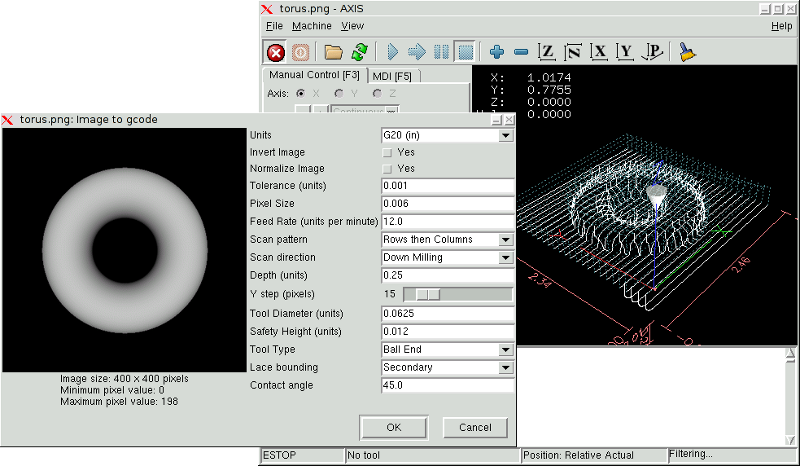
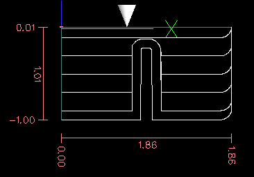

:lang: fr
:toc:

= Image-to-gcode: Usiner un depth maps

== Qu'est-ce qu'un _depth map_?

Il s'agit d'une image en échelle de gris dont la luminosité de chaque
pixel corresponds à la profondeur (ou hauteur) de chaque point de
l'objet.

== Intégrer image-to-gcode dans l'interface utilisateur d'AXIS

Ajoutez les lignes suivantes dans la section: _[FILTER]_ de votre
fichier .ini pour qu'AXIS invoque automatiquement
image-to-gcode à l'ouverture d'une image .png, .gif, ou .jpg:
----
PROGRAM_EXTENSION = .png,.gif,.jpg Grayscale Depth Image
----

Le fichier de configuration: _sim/axis.ini_ est déjà configuré de
cette façon.

== Utilisation d'image-to-gcode

image-to-gcode peut être démarré soit en ouvrant une image dans AXIS,
soit en invoquant image-to-gcode dans une console, de la manière
suivante:
----
image-to-gcode torus.png > torus.ngc
----

Ajustez les réglages dans la colonne de droite, puis pressez _OK_ pour
créer le G-code. Selon la taille de l'image et les options choisies, le
traitement peut durer de quelques secondes à quelques minutes. Quand
une image est appelée, le G-code sera automatiquement chargé et
visualisé dans AXIS une fois le traitement terminé. Dans AXIS, faites
_Recharger_ pour afficher de nouveau l'écran d'options d'
image-to-gcode, vous pourrez ainsi travailler en boucle.

== Les différentes options

=== Unités

Spécifie quelle unité sera utilisée dans le G-code généré G20 (pouces)
ou G21 (mm), ce sera également l'unité utilisée par toutes les options
marquées: _(units)_.

=== Invert Image

Si _no_, le pixel noir sera le point le plus bas et le pixel blanc le
point le plus haut. Si _yes_, le pixel noir sera le point le plus haut
et le pixel blanc le point le plus bas.

=== Normalize Image

Si _yes_, le pixel le plus sombre est ramené au noir, le pixel le plus
lumineux est ramené au blanc.

=== Expand Image Border

Si _None_, l'image entrée sera utilisée telle-quelle, les détails les
plus aux bords de l'image pourraient être coupés. Si _White_ ou
_Black_, alors une bordure de pixels égale au diamètre de l'outil sera
ajoutée sur tout le pourtour pour éviter ce risque.

=== Tolerance (unités)

Quand une série de points est proche d'une ligne droite au point
d'être dans la _tolerance_ , elle sera traitée comme une ligne droite
en sortie. Augmenter la
tolérance peut donner de meilleures performances de contourage avec
LinuxCNC, mais peut aussi estomper ou gommer les détails les plus fins de
l'image.

=== Pixel Size (unités)

Il y a beaucoup d'unités pour un pixel dans l'image entrée.
Habituellement ce nombre est beaucoup plus petit que 1.0. Par exemple,
pour usiner un objet de 50x50mm depuis une image de 400x400 pixels,
utiliser un _pixel size_ de 0.125, parce que 50 / 400 = 0.125.

=== Plunge Feed Rate (unités par minute)

Vitesse du mouvement de plongée initial.

=== Feed Rate (unités par minute)

Vitesse d'avance pour le reste de l'usinage.

=== Spindle Speed (RPM)

Vitesse de rotation de la broche, en tours/mn

=== Scan Pattern

Modèles de balayage possibles:

 - Rangées
 - Colonnes
 - Rangées puis colonnes
 - Colonnes puis rangées

=== Scan Direction

Directions de balayage possibles:

 -  Positive: le fraisage commence à de petites valeurs de X ou Y et se
   poursuit avec des valeurs croissantes.
 -  Négative: le fraisage commence à des valeurs élevées de X ou Y et se
   poursuit avec des valeurs décroissantes.
 -  Alternative: le fraisage commence aux valeurs de X ou Y où s'est
   terminé le dernier mouvement. Cela réduit les déplacements _en l'air_.
 -  Up Milling: le fraisage commence en points bas et se poursuit vers les
   points hauts.
 -  Down Milling: le fraisage commence en points hauts et se poursuit vers
   les points bas.

=== Depth (unités)

Le dessus du bloc est toujours à _Z=0_. La profondeur d'usinage dans
le matériau est de _Z=-depth._

=== Step Over (pixels)

Distance entre rangées ou colonnes adjacentes. Pour trouver le nombre
en pixels pour une distance donnée en unités, calculez: _distance/pixel
size_ et arrondissez au nombre le plus proche'.' Par exemple: si _pixel
size=.006_ et le pas souhaité sur la _distance=.015_, alors utilisez un
Step Over de 2 ou 3 pixels, parce que _.015/.006=2.5_'.'

=== Tool Diameter

Le diamètre du taillant de l'outil.

=== Safety Height

La hauteur à laquelle les mouvements de traversée. image-to-gcode
considère toujours le dessus du matériau comme étant: _Z=0_.

=== Tool Type

La forme du taillant de l'outil. Les formes possibles sont:

 - Hémisphèrique
 - Plate
 - Vé à 45 degrés
 - Vé à 60 degrés

=== Lace bounding

Contrôle si les zones relativement plates le long d'une colonne ou
d'une rangée peuvent être ignorées. Ces options n'ont de sens que pour
un fraisage dans les deux directions. Trois choix sont possibles:

 - None: toutes les rangées et les colonnes seront entièrement fraisées.
 -  Secondary: lors du fraisage dans la deuxième direction, les zones qui
   ne présentent pas une forte pente dans cette direction seront ignorées.
 -  Full: lors du fraisage dans la première direction, les zones qui
   présentent une forte pente dans la deuxième direction seront ignorées.
   Lors du fraisage dans la deuxième direction, les zones qui ne
   présentent pas une forte pente dans cette direction seront ignorées.

=== Contact angle

Quand _Lace bounding_ n'est pas None, les pentes qui présentent une
pente supérieure à _Contact angle_ seront considérées comme de
_fortes_ pentes et celles en dessous de
cet angle considérées comme de faible pentes.

=== Offset d'ébauche et profondeur par passe d'ébauche

Image-to-gcode peut optionnellement produire des passes d'ébauche. La
profondeur des passes d'ébauche successives est fixée par _Roughing
depth per pass_. Par exemple, entrer 0.2 pour une première passe
d'ébauche d'une profondeur de 0.2, la seconde passe d'ébauche aura une
profondeur de 0.4 et ainsi de suite, jusqu'à-ce que la profondeur
totale Depth de l'image soit atteinte. Aucune des passes d'ébauche
n'usinera plus près de la partie finale que Roughing Offset. La figure 
ci-dessous montre une grande profondeur verticale à
usiner. Sur cette image, la profondeur des passes d'ébauche est de 0.2
pouces et Roughing Offset de 0.1 pouces.

.Passes d'ébauche[[cap:Passes-Ebauche]]

