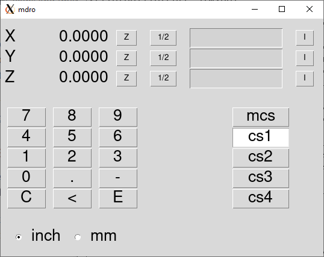

:lang: en
:toc:

[[cha:mdro-gui]]
= MDRO GUI(((mdro GUI)))

// Custom lang highlight
// must come after the doc title, to work around a bug in asciidoc 8.6.6
:ini: {basebackend@docbook:'':ini}
:hal: {basebackend@docbook:'':hal}
:ngc: {basebackend@docbook:'':ngc}

== Introduction

MDRO is a simple graphical front-end for LinuxCNC providing a display of data
from Digital Read Out (DRO) scales. It provides functionality similar to
a normal machinist's DRO display, allowing the user to use the DRO scales
on the machine when operating in a manual-only (hand-cranked) mode. It is
most useful for manual machines such as DRO equipped Bridgeport style mills
that have been converted to CNC but still have the manual controls.

MDRO is mouse and touch screen friendly.

[[fig:mdro-window]]
.MDRO Window

== Getting Started

If your configuration is not currently set up to use MDRO,
you can change it by editing the INI file. In the
`[DISPLAY]` section, change the `DISPLAY =` line to read
`DISPLAY = mdro`. MDRO defaults to XYZ for the axes but that can
be changed.
Set `[DISPLAY]` section `GEOMETRY = XYZ` for a 3 axis mill. A lathe with
with DRO scales on the X and Z axes might use `GEOMETRY = XZ`.

When MDRO starts, a window like the one in the figure
<<fig:mdro-window>> above opens.

=== INI File Options

Other options that can be included on the `[DISPLAY]` section include:

* `MDRO_VAR_FILE = <file.var>` - preload G54 - G57 coordinate system data.
** Preload a .var file. This is typically the .var file used by the
   operational code.
* `POINT_SIZE = <n>` - Set text point size.
** This option sets the size of the font used which sets the overall
   size of the window. The default point size is 20, Typical sizes are
   20 to 30.
* `MM = 1` Set this if the DRO scales provide data scaled in millimeters.

=== Command Line Options

MDRO can be started by a `loadusr` command in a HAL file. Options equivalent
to those in the INI file can be set on the command line:

* `-l <file.var>` - preload G54 - G57 coordinate system data.
* `-p <n>` - Set text point size.
* `-m` - Set this if the DRO scales provide data scaled in millimeters.
* `<axes>` - axes to display. See `GEOMETRY` above.

=== Pins

Using an example of "XYZA" for an AXES argument, these pins will be created
when MDRO starts:

[source,python]
----
mdro.axis.0
mdro.axis.1
mdro.axis.2
mdro.axis.3
mdro.index-enable.0
mdro.index-enable.1
mdro.index-enable.2
mdro.index-enable.3
----

In this example, the first row of the display will be labeled `X` and will
show the data from the DRO scale connected to pin `mdro.axis.0`. The
`mdro.index-enable.n` pins should be connected to the index pins of the DRO
if the DRO supports them.

The pins must be connected in the
file specified in the `POSTGUI_HALFILE` entry of the INI file when the
program is started from an INI file. They can be set directly after the
loadusr command if the program is started in a HAL file.

== MDRO Window

The MDRO window contains the following elements:

* A row for each axis. Each row includes:
** the name of the axis,
** the current value,
** a "z" button that zeros the value,
** a "1/2" button that halves the value,
** a entry field that can be used to set a user-defined value. This
   field can be set from the keyboard or from the on-screen keypad.
** A "I" button that starts an index operation (see below),
* a keypad used to set values in the entry field via a mouse or
  touchscreen,
* coordinate system selection buttons:
** The "mcs" button selects the machine coordinate system. These are
   the raw values from the encoders connected to the `mdro.axis.n`
   pins.
** The "cs1" - "cs4" buttons allow the user to select among one of
   four user-defined coordinate systems. If the program is started
   with the `MDRO_VAR_FILE =` option, the labels will be changed to
   "g54" - "g57" and the values from the specified .var file will be
   preloaded. Note that any changes to the values are not persistent:
   the .var file is never changed.
* Inch/Millimeter selection buttons.

== Index operations

`MDRO` supports DRO scales with index marks. Hit the "I" button on the
axis row then crank the axis to the index position. The machine
coordinate will be zeroed. This is easiest to see at startup or when the "mcs"
coordinate system has been selected.

== Simulation

The easiest way to see how `MDRO` works is to try it in a simulation
environment.  Add this section to the end of your simulation HAL file,
usually "hallib/core_sim.hal":

[source,python]
----
loadusr -W mdro -l sim.var XYZ
net x-pos-fb  => mdro.axis.0
net y-pos-fb  => mdro.axis.1
net z-pos-fb  => mdro.axis.2
----
