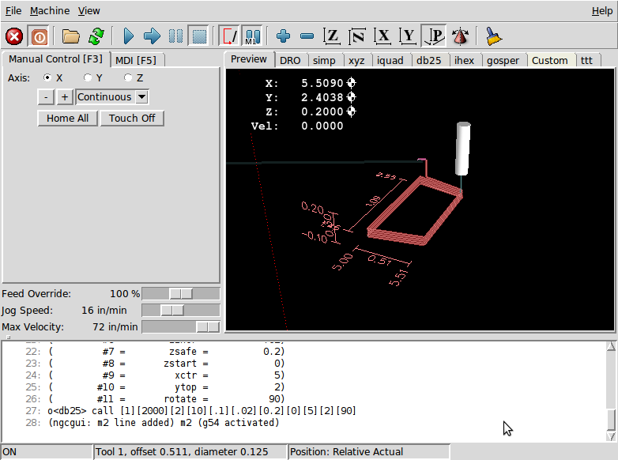
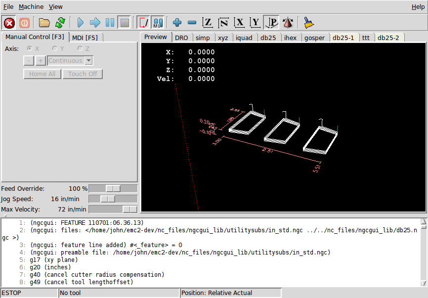

:lang: en
:toc:

[[cha:ngcgui]]
= NGCGUI(((NGCGUI)))

// Custom lang highlight
// must come after the doc title, to work around a bug in asciidoc 8.6.6
:ini: {basebackend@docbook:'':ini}
:hal: {basebackend@docbook:'':hal}
:ngc: {basebackend@docbook:'':ngc}

.NGCGUI embedded into AXIS
image::images/ngcgui.png[align="center"]

== Overview

* 'NGCGUI' is a Tcl application to work with subroutines. It allows you to
  have a conversational interface with LinuxCNC. You can organize the
  subroutines in the order you need them to run and concatenate the
  subroutines into one file for a complete part program.
* 'NGCGUI' can run as a standalone application or can be embedded in
  multiple tab pages in the AXIS GUI.
* 'PyNGCGUI' is an alternate, Python implementation of NGCGUI.
* 'PyNGCGUI' can run as a standalone application or can be embedded as
  a tab page (with its own set of multiple subroutine tabs) in any
  GUI that supports embedding of GladeVCP applications AXIS, Touchy, Gscreen
  and GMOCCAPY.

Using NGCGUI or PyNGCGUI:

* Tab pages are provided for each subroutine specified in the INI file.
* New subroutines tab pages can be added on the fly using the
  <<ngcgui-ini,custom tab>>.
* Each subroutine tab page provides entry boxes for all subroutine parameters.
* The entry boxes can have a default value and an label that
  are identified by special comments in the subroutine file.
* Subroutine invocations can be concatenated together to form a multiple step
  program.
* Any single-file G-code subroutine that conforms to NGCGUI conventions can be used.
* Any gcmc (G-code-meta-compiler) program that conforms to NGCGUI conventions
  for tagging variables can be used. (The gcmc executable must be installed
  separately, see: https://www.vagrearg.org/content/gcmc)

[NOTE]
====
NGCGUI and PyNGCGUI implement the same functions and both process .ngc and .gcmc
files that conform to a few NGCGUI-specific conventions.  In this document,
the term 'NGCGUI' generally refers to either application.
====

== Demonstration Configurations

A number of demonstration configurations are located in the sim directory
of the Sample Configurations offered by the LinuxCNC configuration picker. The
configuration picker is on the system's main menu: Applications > CNC > LinuxCNC

Examples are included for the AXIS, Touchy, gscreen, and GMOCCAPY.
These examples demonstrate both 3-axis (XYZ) cartesian configurations
(like mills) and lathe (XZ) setups.  Some examples show the use of a
pop up keyboard for touch screen systems and other examples demonstrate
the use of files created for the gcmc (G-code Meta Compiler) application.
The touchy examples also demonstrate incorporation of a GladeVCP back plot
viewer (gremlin_view).

The simplest application is found as:

  Sample Configurations/sim/axis/ngcgui/ngcgui_simple

A comprehensive example showing gcmc compatibility is at:

  Sample Configurations/sim/axis/ngcgui/ngcgui_gcmc

A comprehensive example embedded as a GladeVCP app and using gcmc is at:

  Sample Configurations/sim/gscreen/ngcgui/pyngcgui_gcmc

The example sim configurations make use of library files that provide
example G-code subroutine (.ngc) files and G-code-meta-compiler (.gcmc) files:

* 'nc_files/ngcgui_lib'
** 'ngcgui.ngc' - An easy to understand example using subroutines
** 'arc1.ngc' - basic arc using cutter radius compensation
** 'arc2.ngc' - arc speced by center, offset, width, angle (calls arc1)
** 'backlash.ngc' - routine to measure an axis backlash with dial indicator
** 'db25.ngc' - creates a DB25 plug cutout
** 'gosper.ngc' - a recursion demo (flowsnake)
** 'helix.ngc' - helix or D-hole cutting
** 'helix_rtheta.ngc' - helix or D-hole positioned by radius and angle
** 'hole_circle.ngc' - equally spaced holes on a circle
** 'ihex.ngc' - internal hexagon
** 'iquad.ngc' - internal quadrilateral
** 'ohex.ngc' - outside hexagon
** 'oquad.ngc' - outside quadrilateral
** 'qpex_mm.ngc' - demo of qpockets (mm based)
** 'qpex.ngc' - demo of qpockets (inch based)
** 'qpocket.ngc' - quadrilateral pocket
** 'rectangle_probe.ngc' - probe a rectangular area
** 'simp.ngc' - a simple subroutine example that creates two circles
** 'slot.ngc' - slot from connecting two endpoints
** 'xyz.ngc' - machine exerciser constrained to a box shape
** 'Custom' - Creates custom tabs
** 'ttt' - True Type Tracer, to create texts to be engraved

* 'nc_files/ngcgui_lib/lathe'
** 'ngcgui-lathe' - Example lathe subroutine
** 'g76base.ngc' - GUI for G76 threading
** 'g76diam.ngc' - threading speced by major, minor diameters
** 'id.ngc' - bores the inside diameter
** 'od.ngc' - turns the outside diameter
** 'taper-od.ngc' - turns a taper on the outside diameter
** 'Custom' - Creates custom tabs

* 'nc_files/gcmc_lib'
** 'drill.gcmc' - drill holes in rectangle pattern
** 'square.gcmc' - simple demo of variable tags for gcmc files
** 'star.gcmc' - gcmc demo illustrating functions and arrays
** 'wheels.gcmc' - gcmc demo of complex patterns

To try a demonstration, select a sim configuration and start
the LinuxCNC program.

If using the AXIS GUI, press the 'E-Stop'
image:images/tool_estop.png[] then 'Machine Power'
image:images/tool_power.png[] then 'Home All'. Pick a NGCGUI tab, fill in
any empty blanks with sensible values and press
'Create Feature' then 'Finalize'. Finally  press the 'Run'
image:images/tool_run.png[] button to watch it run. Experiment
by creating multiple features and features from different tab pages.

To create several subroutines concatenated into a single file, go to each tab
fill in the blanks, press 'Create Feature' then using the arrow keys move any
tabs needed to put them in order. Now press 'Finalize' and answer the prompt
to create

Other GUIs will have similar functionality but the buttons and names
may be different.

[NOTE]
====
The demonstration configs create tab pages for just a few of the provided
examples. Any GUI with a <<ngcgui-ini,custom tab>> can open any of the library
example subroutines or any user file if it is in the LinuxCNC subroutine
path.

To see special key bindings, click inside an NGCGUI tab page to get
focus and then press Control-k.

The demonstration subroutines should run on the simulated
machine configurations included in the distribution.  A user
should always understand the behavior and purpose of a program
before running on a real machine.
====

== Library Locations

In LinuxCNC installations installed from deb packages, the simulation configs
for NGCGUI use symbolic links to non-user-writable LinuxCNC libraries for:

* 'nc_files/ngcgui_lib'             NGCGUI-compatible subfiles
* 'nc_files/ngcgui_lib/lathe'       NGCGUI-compatible lathe subfiles
* 'nc_files/gcmc_lib'               NGCGUI-gcmc-compatible programs
* 'nc_files/ngcgui_lib/utilitysubs' Helper subroutines
* 'nc_files/ngcgui_lib/mfiles'      User M files

These libraries are located by INI file items that specify the search
paths used by LinuxCNC (and NGCGUI):

[source,{ini}]
----
[RS274NGC]
SUBROUTINE_PATH = ../../nc_files/ngcgui_lib:../../nc_files/gcmc_lib:../../nc_files/ngcgui_lib/utilitysubs
USER_M_PATH     = ../../nc_files/ngcgui_lib/mfiles
----

[NOTE]
====
These are long lines (not continued on multiple lines)
that specify the directories used in a search patch.  The
directory names are separated by colons (:). No spaces should
occur between directory names.
====

A user can create new directories for their own subroutines and
M-files and add them to the search path(s).

For example, a user could create directories from the terminal with the commands:

----
mkdir /home/myusername/mysubs
mkdir /home/myusername/mymfiles
----

And then create or copy system-provided files to these user-writable directories.
For instance, a user might create a NGCGUI-compatible subfile named:

----
/home/myusername/mysubs/example.ngc
----

To use files in new directories, the INI file must be edited to include the new
subfiles and to augment the search path(s).  For this example:

[source,{ini}]
----
[RS274NGC]
...
SUBROUTINE_PATH = /home/myusername/mysubs:../../nc_files/ngcgui_lib:../../nc_files/gcmc_lib:../../nc_files/ngcgui_lib/utilitysubs
USER_M_PATH     = /home/myusername/mymfiles:../../nc_files/ngcgui_lib/mfiles

[DISPLAY]
...
NGCGUI_SUBFILE = example.ngc
...
----

LinuxCNC (and NGCGUI) use the first file found when searching
directories in the search path.  With this behavior, you can
supersede an ngcgui_lib subfile by placing a subfile with an
identical name in a directory that is found earlier in the path
search. More information can be found in the INI chapter of the
Integrators Manual.

== Standalone Usage

=== Standalone NGCGUI

For usage, type in a terminal:

----
ngcgui --help
Usage:
  ngcgui --help | -?
  ngcgui [Options] -D <nc files directory name>
  ngcgui [Options] -i <LinuxCNC INI file name>
  ngcgui [Options]

Options:
  [-S subroutine_file]
  [-p preamble_file]
  [-P postamble_file]
  [-o output_file]
  [-a autosend_file]            (autosend to AXIS default:auto.ngc)
  [--noauto]                    (no autosend to AXIS)
  [-N | --nom2]                 (no m2 terminator (use %))
  [--font [big|small|fontspec]] (default: "Helvetica -10 normal")
  [--horiz|--vert]              (default: --horiz)
  [--cwidth comment_width]      (width of comment field)
  [--vwidth varname_width]      (width of varname field)
  [--quiet]                     (fewer comments in outfile)
  [--noiframe]                  (default: frame displays image)
----

[NOTE]
====
As a standalone application, NGCGUI handles a single subroutine file which
can be invoked multiple times.  Multiple standalone NGCGUI applications
can be started independently.
====

=== Standalone PyNGCGUI

For usage, type in a terminal:

----
pyngcgui --help
Usage:
pyngcgui [Options] [<sub_filename>]
Options requiring values:
    [-d | --demo] [0|1|2] (0: DEMO standalone toplevel)
                          (1: DEMO embed new notebook)
                          (2: DEMO embed within existing notebook)
    [-S | --subfile       ]
    [-p | --preamble      <preamble file name>]
    [-P | --postamble     <postamble file name>]
    [-i | --ini           <INI file name>]
    [-a | --autofile      <auto file name>]
    [-t | --test          <testno>]
    [-K | --keyboardfile  <glade_file>] (use custom popupkeyboard glade file)
Solo Options:
    [-v | --verbose]
    [-D | --debug]
    [-N | --nom2]         (no m2 terminator (use %))
    [-n | --noauto]       (save but do not automatically send result)
    [-k | --keyboard]     (use default popupkeybaord)
    [-s | --sendtoaxis]   (send generated NGC file to AXIS GUI)
Notes:
      A set of files is comprised of a preamble, subfile, postamble.
      The preamble and postamble are optional.
      One set of files can be specified from cmdline.
      Multiple sets of files can be specified from an INI file.
      If --ini is NOT specified:
         search for a running LinuxCNC and use its INI file.
----

[NOTE]
====
As a standalone application, PyNGCGUI can read an INI file (or a
running LinuxCNC application) to create tab pages for multiple
subfiles.
====

== Embedding NGCGUI

=== Embedding NGCGUI in AXIS

The following INI file items go in the [DISPLAY] section. (See additional
sections below for additional items needed)

* 'TKPKG = Ngcgui 1.0' - the NGCGUI package
* 'TKPKG = Ngcguittt 1.0' - the True Type Tracer package for generating text
  for engraving (optional, must follow TKPKG = Ngcgui).
* 'NGCGUI_FONT = Helvetica -12 normal' - Sets the font used
* 'NGCGUI_PREAMBLE = in_std.ngc' - The preamble file to be added at the
  beginning of the subroutine. When several subroutines are concatenated,
  it is only added once.
* 'NGCGUI_SUBFILE = simp.ngc' - Creates a tab from the named subroutine.
//FIXME * 'NGCGUI_SUBFILE = "" - Creates a custom tab ?
* 'NGCGUI_SUBFILE = ""' - Creates a custom tab
* '#NGCGUI_OPTIONS = opt1 opt2 ...' - NGCGUI options:
** 'nonew'    -- Prohibits creation of new custom tab
** 'noremove' -- Prohibits deleting a tab page
** 'noauto'   -- Do not run automatically (makeFile, then manual run)
** 'noiframe' -- No internal image, image on separate top level
* 'TTT = truetype-tracer' - name of the truetype tracer program (it must be in user PATH)
* 'TTT_PREAMBLE = in_std.ngc' - Optional, specifies filename for preamble used for
  ttt created subfiles. (alternate: mm_std.ngc)

[NOTE]
====
The optional truetype tracer items are used to specify an NGCGUI-compatible tab page
that uses the application truetype-tracer.  The truetype-tracer application must
be installed independently and located in the user PATH.
====

=== Embedding PyNGCGUI as a GladeVCP tab page in a GUI

The following INI file items go in the [DISPLAY] section for use with the
AXIS, Gscreen, or Touchy GUIs.  (See additional sections below for additional
items needed)

.EMBED_ Items
* `EMBED_TAB_NAME = PyNGCGUI` - name to appear on embedded tab
* `EMBED_TAB_COMMAND = gladevcp -x {XID} pyngcgui_axis.ui` - invokes GladeVCP
* `EMBED_TAB_LOCATION = name_of_location` - where the embedded page is located

[NOTE]
====
The EMBED_TAB_LOCATION specifier is not used for the AXIS GUI.  While
PyNGCGUI can be embedded in AXIS, integration is more complete when using
NGCGUI (using TKPKG = Ngcgui 1.0).  To specify the EMBED_TAB_LOCATION
for other GUIs, see the <<sub:ini:sec:display,DISPLAY Section>> of the INI
Configuration Chapter.
====

[NOTE]
====
The truetype tracer GUI front-end is not currently available for GladeVCP
applications.
====

[[ngcgui-ini]]
=== Additional INI File items required for NCGUI or PyNGCGUI

The following INI file items go in the [DISPLAY] section for any GUI
that embeds either NGCGUI or PyNGCGUI.

* 'NGCGUI_FONT = Helvetica -12 normal' - specifies the font name,size, normal|bold
* 'NGCGUI_PREAMBLE = in_std.ngc' - the preamble file to be added in front of the
  subroutines. When concatenating several common subroutine invocations, this preamble
  is only added once.  For mm-based machines, use mm_std.ngc
* 'NGCGUI_SUBFILE = filename1.ngc' - creates a tab from the filename1 subroutine
* 'NGCGUI_SUBFILE = filename2.ngc' - creates a tab from the filename2 subroutine
* '... etc.'
* 'NGCGUI_SUBFILE = gcmcname1.gcmc' - creates a tab from the gcmcname1 file
* 'NGCGUI_SUBFILE = gcmcname2.gcmc' - creates a tab from the gcmcname2 file
* '... etc.'
* 'NGCGUI_SUBFILE = ""' - creates a custom tab that can open any subroutine in the search path
* 'NGCGUI_OPTIONS = opt1 opt2 ...' - NGCGUI options
** 'nonew' - disallow making a new custom tab
** 'noremove' - disallow removing any tab page
** 'noauto' - no autosend (use makeFile, then save or manually send)
** 'noiframe' - no internal image, display images on separate top level widget
** 'nom2' - do not terminate with m2, use % terminator.  This option eliminates all
   the side effects of m2 termination
* 'GCMC_INCLUDE_PATH = dirname1:dirname2' - search directories for gcmc include files

This is an example of embedding NGCGUI into AXIS. The subroutines need to be
in a directory specified by the [RS274NGC]SUBROUTINE_PATH.  Some example
subroutines use other subroutines so check to be sure you have the
dependences, if any, in a SUBROUTINE_PATH directory.  Some subroutines may
use custom M-files which must be in a directory specified by the
[RS274NGC]USER_M_PATH.

The G-code-meta-compiler (gcmc) can include statements like:

----
include("filename.inc.gcmc");
----

By default, gcmc includes the current directory which, for LinuxCNC, will be
the directory containing the LinuxCNC INI file. Additional directories can be
prepended to the gcmc search order with the GCMC_INCLUDE_PATH item.

.Sample AXIS-GUI-based INI
[source,{ini}]
----
[RS274NGC]
...
SUBROUTINE_PATH   = ../../nc_files/ngcgui_lib:../../ngcgui_lib/utilitysubs
USER_M_PATH       = ../../nc_files/ngcgui_lib/mfiles

[DISPLAY]
TKPKG             = Ngcgui    1.0
TKPKG             = Ngcguittt 1.0
# Ngcgui must precede Ngcguittt

NGCGUI_FONT       = Helvetica -12 normal
# specify filenames only, files must be in [RS274NGC]SUBROUTINE_PATH
NGCGUI_PREAMBLE   = in_std.ngc
NGCGUI_SUBFILE    = simp.ngc
NGCGUI_SUBFILE    = xyz.ngc
NGCGUI_SUBFILE    = iquad.ngc
NGCGUI_SUBFILE    = db25.ngc
NGCGUI_SUBFILE    = ihex.ngc
NGCGUI_SUBFILE    = gosper.ngc
# specify "" for a custom tab page
NGCGUI_SUBFILE    = ""
#NGCGUI_SUBFILE   = "" use when image frame is specified if
#                      opening other files is required
#                      images will be put in a top level window
NGCGUI_OPTIONS    =
#NGCGUI_OPTIONS   = opt1 opt2 ...
# opt items:
#   nonew      -- disallow making a new custom tab
#   noremove   -- disallow removing any tab page
#   noauto     -- no auto send (makeFile, then manually send)
#   noiframe   -- no internal image, image on separate top level
GCMC_INCLUDE_PATH = /home/myname/gcmc_includes

TTT               = truetype-tracer
TTT_PREAMBLE      = in_std.ngc

PROGRAM_PREFIX    = ../../nc_files
----

[NOTE]
====
The above is not a complete AXIS GUI INI -- the items show are those
used by NGCGUI.  Many additional items are required by LinuxCNC to have
a complete INI file.
====

=== Truetype Tracer

Ngcgui_ttt provides support for truetype-tracer (v4).  It creates an AXIS tab
page which allows a user to create a new NGCGUI tab page after entering text
and selecting a font and other parameters.  (Truetype-tracer must be installed
independently).

To embed ngcgui_ttt in AXIS, specify the following items in addition to NGCGUI
items:

----
Item:    [DISPLAY]TKPKG = Ngcgui_ttt version_number
Example: [DISPLAY]TKPKG = Ngcgui_ttt 1.0
Note:    Mandatory, specifies loading of ngcgui_ttt in an AXIS tab page named ttt.
         Must follow the TKPKG = Ngcgui item.

Item:    [DISPLAY]TTT = path_to_truetype-tracer
Example: [DISPLAY]TTT = truetype-tracer
Note:    Optional, if not specified, attempt to use /usr/local/bin/truetype-tracer.
         Specify with absolute pathname or as a simple executable name,
         in which case the user PATH environment will used to find the program.

Item:    [DISPLAY]TTT_PREAMBLE = preamble_filename
Example: [DISPLAY]TTT_PREAMBLE = in_std.ngc
Note:    Optional, specifies filename for preamble used for ttt created subfiles.
----

=== INI File Path Specifications

NGCGUI uses the LinuxCNC search path to find files.
The search path begins with the standard directory specified by:

[source,{ini}]
----
[DISPLAY]PROGRAM_PREFIX = directory_name
----

followed by multiple directories specified by:

[source,{ini}]
----
[RS274NGC]SUBROUTINE_PATH = directory1_name:directory1_name:directory3_name ...
----

.Directories

Directories may be specified as absolute paths or relative paths.

* Example: `[DISPLAY]PROGRAM_PREFIX = /home/myname/linuxcnc/nc_files`
* Example: `[DISPLAY]PROGRAM_PREFIX = ~/linuxcnc/nc_files`
* Example: `[DISPLAY]PROGRAM_PREFIX = ../../nc_files`

.Absolute Paths

An absolute path beginning with a "/" specifies a complete filesystem
location.  A path beginning with a "\~/" specifies a path starting
from the user's home directory.  A path beginning with "~username/"
specifies a path starting in username's home directory.

.Relative Paths

Relative paths are based on the startup directory which is the directory containing the INI file.
Using relative paths can facilitate relocation of configurations but requires a good understanding of Linux path specifiers.

* `./d0`        is the same as d0, e.g., a directory named d0 in the startup directory
* `../d1`       refers to a directory d1 in the parent directory
* `../../d2`    refers to a directory d2 in the parent of the parent directory
* `../../../d3` etc.

Multiple directories can be specified with [RS274NGC]SUBROUTINE_PATH by separating them with colons.
The following example illustrates the format for multiple directories and shows the use of relative and absolute paths.

.Multiple Directories Example:
[source,{ini}]
----
[RS274NGC]SUBROUTINE_PATH = ../../nc_files/ngcgui_lib:../../nc_files/ngcgui_lib/utilitysubs:/tmp/tmpngc
----

This is one long line, do not continue on multiple lines.
When LinuxCNC and/or NGCGUI searches for files, the first file found in the search is used.

LinuxCNC (and NGCGUI) must be able to find all subroutines including helper routines that are called from within NGCGUI subfiles.
It is convenient to place utility subs in a separate directory as indicated in the example above.

The distribution includes the ngcgui_lib directory and demo files for preambles, subfiles, postambles and helper files.
To modify the behavior of the files, you can copy any file and place it in an earlier part of the search path.
The first directory searched is [DISPLAY]PROGRAM_PREFIX.
You can use this directory but it is better practice to create dedicated directory(ies) and put them at the beginning of the [RS274NGC]SUBROUTINE_PATH.

In the following example, files in /home/myname/linuxcnc/mysubs will be found before files in ../../nc_files/ngcgui_lib.

.Adding User Directory Example:
[source,{ini}]
----
[RS274NGC]SUBROUTINE_PATH = /home/myname/linuxcnc/mysubs:../../nc_files/ngcgui_lib:../../nc_files/ngcgui_lib/utilitysubs`
----

New users may inadvertently try to use files that are not structured to be compatible with NGCGUI requirements.
NGCGUI will likely report numerous errors if the files are not coded per its conventions.
Good practice suggests that NGCGUI-compatible subfiles should be placed in a directory dedicated to that,purpose
and that preamble, postamble, and helper files should be in separate directory(ies) to discourage attempts to use them as subfiles.
Files not intended for use as subfiles can include a special comment: "(not_a_subfile)" so that NGCGUI will reject them automatically with a relevant message.

=== Summary of INI File item details for NGCGUI usage

[RS274NGC]SUBROUTINE_PATH = dirname1:dirname2:dirname3 ...::
  _Example_: `[RS274NGC]SUBROUTINE_PATH = ../../nc_files/ngcgui_lib:../../nc_files/ngcgui_lib/utilitysubs` +
  _Note_:    Optional, but very useful to organize subfiles and utility files.

[RS274NGC]USER_M_PATH = dirname1:dirname2:dirname3 ...::
  _Example_: `[RS274NGC]USER_M_PATH = ../../nc_files/ngcgui_lib/mfiles` +
  _Note_:    Optional, needed to locate custom user M-files.

[DISPLAY]EMBED_TAB_NAME = name to display on embedded tab page::
  _Example_: `[DISPLAY]EMBED_TAB_NAME = Pyngcgui` +
  _Note_:    The entries: `EMBED_TAB_NAME`, `EMBED_TAB_COMMAND`, `EMBED_TAB_LOCATION`
             define an embedded application for several LinuxCNC GUIs.

[DISPLAY]EMBED_TAB_COMMAND = programname followed by arguments::
  _Example_: `[DISPLAY]EMBED_TAB_COMMAND = gladevcp -x {XID} pyngcgui_axis.ui` +
  _Note_:    For GladeVCP applications, see the <<cha:glade-vcp,GladeVCP Chapter>>.

[DISPLAY]EMBED_TAB_LOCATION = name_of_location::
  _Example_: `[DISPLAY]EMBED_TAB_LOCATION = notebook_main` +
  _Note_:    See example INI files for possible locations. +
             Not required for the AXIS GUI.

[DISPLAY]PROGRAM_PREFIX = dirname::
  _Example_: `[DISPLAY]PROGRAM_PREFIX = ../../nc_files` +
  _Note_:    Mandatory and needed for numerous LinuxCNC functions. +
             It is the first directory used in the search for files.

[DISPLAY]TKPKG = NGCGUI version_number::
  _Example_: `[DISPLAY]TKPKG = Ngcgui 1.0` +
  _Note_:    Required only for AXIS GUI embedding. +
             Specifies loading of NGCGUI AXIS tab pages.

[DISPLAY]NGCGUI_FONT = font_descriptor::
  _Example_: [DISPLAY]NGCGUI_FONT = Helvetica -12 normal +
  _Note_:    Optional, font_descriptor is a tcl-compatible font specifier with items for fonttype -fontsize fontweight. +
             Default is: Helvetica -10 normal. +
             Smaller font sizes may be useful for small screens. +
             Larger font sizes may be helpful for touch screen applications .

[DISPLAY]NGCGUI_SUBFILE = subfile_filename::
  _Example_: `[DISPLAY]NGCGUI_SUBFILE = simp.ngc` +
  _Example_: `[DISPLAY]NGCGUI_SUBFILE = square.gcmc` +
  _Example_: `[DISPLAY]NGCGUI_SUBFILE = ""` +
  _Note_:    Use one or more items to specify NGCGUI-compatible subfiles or gcmc programs that require a tab page on startup. +
             A "Custom" tab will be created when the filename is "". +
             A user can use a "Custom" tab to browse the file system and identify preamble, subfile, and postamble files.

[DISPLAY]NGCGUI_PREAMBLE = preamble_filename::
  _Example_: `[DISPLAY]NGCGUI_PREAMBLE = in_std.ngc` +
  _Note_:    Optional, when specified, the file is prepended to a subfile. +
             Files created with "Custom" tab pages use the preamble specified with the page.

[DISPLAY]NGCGUI_POSTAMBLE = postamble_filename::
  _Example_: `[DISPLAY]NGCGUI_POSTAMBLE = bye.ngc` +
  _Note_:    Optional, when specified, the file is appended to a subfiles. +
             Files created with "Custom" tab pages use the postamble specified with the page.

[DISPLAY]NGCGUI_OPTIONS = opt1 opt2 ...::
  _Example_: [DISPLAY]NGCGUI_OPTIONS = nonew noremove +
  _Note_:    Multiple options are separated by blanks. +
             By default, NGCGUI configures tab pages so that: +
               1) a user can make new tabs; +
               2) a user can remove tabs (except for the last remaining one); +
               3) finalized files are automatically sent to LinuxCNC; +
               4) an image frame (iframe) is made available to display an image for the subfile (if an image is provided); +
               5) the NGCGUI result file sent to LinuxCNC is terminated with an M2 (and incurs M2 side-effects). +
+
The options `nonew`, `noremove`, `noauto`, `noiframe`, `nom2` respectively
disable these default behaviors.
+
By default, if an image (.png,.gif,jpg,pgm) file is found in the same directory as the subfile, the image is displayed in the iframe.
Specifying the `noiframe` option makes available additional buttons for selecting a preamble, subfile, and postamble and additional checkboxes.
Selections of the checkboxes are always available with special keys: +
  `Ctrl-R` Toggle "Retain values on Subfile read", +
  `Ctrl-E` Toggle "Expand subroutine", +
  `Ctrl-a` Toggle "Autosend", +
  `Ctrl-k` lists all keys and functions. +
+
If `noiframe` is specified and an image file is found, the image is displayed in a separate window and all functions are available on the tab page.
The `NGCGUI_OPTIONS` apply to all NGCGUI tabs except that the `nonew`, `noremove`, and `noiframe` options are not applicable for "Custom" tabs.
Do not use "Custom" tabs if you want to limit the user's ability to select subfiles or create additional tab pages.

[DISPLAY]GCMC_INCLUDE_PATH = dirname1:dirname2:...::
  _Example_: `[DISPLAY]GCMC_INCLUDE_PATH = /home/myname/gcmc_includes:/home/myname/gcmc_includes2` +
  _Note_:    Optional, each directory will be included when gcmc is invoked using the option: `--include dirname`.

:showcomments:
// FIXME Keyboard shortcuts do not work in version _fr.

== File Requirements for NGCGUI Compatibility

=== Single-File Gcode (.ngc) Subroutine Requirements

An NGCGUI-compatible subfile contains a single subroutine definition.
The name of the subroutine must be the same as the filename (not including the .ngc suffix).
LinuxCNC supports named or numbered subroutines, but only named subroutines are compatible with NGCGUI. For more information see the <<cha:o-codes,O-Codes>> chapter.

The first non-comment line should be a `sub` statement. +
The last non-comment line should be a `endsub` statement.

.examp.ngc:
----
(info: info_text_to_appear_at_top_of_tab_page)
; comment line beginning with semicolon
( comment line using parentheses)
o<examp> sub
  BODY_OF_SUBROUTINE
o<examp> endsub
; comment line beginning with semicolon
( comment line using parentheses)
----

The body of the subroutine should begin with a set of statements that define local named parameters for each positional parameter expected for the subroutine call.
These definitions must be consecutive beginning with #1 and ending with the last used parameter number.
Definitions must be provided for each of these parameters (no omissions).

.Parameter Numbering
----
#<xparm> = #1
#<yparm> = #2
#<zparm> = #3
----

LinuxCNC considers all numbered parameters in the range #1 thru #30 to be calling parameters, so NGCGUI provides entry boxes for any occurrence of parameters in this range.
It is good practice to avoid use of numbered parameters #1 through #30 anywhere else in the subroutine.
Using local, named parameters is recommended for all internal variables.

Each defining statement may optionally include a special comment and a default value for the parameter.

.Statement Prototype
----
#<vname> = #n (=default_value)
or
#<vname> = #n (comment_text)
or
#<vname> = #n (=default_value comment_text)
----

.Parameter Examples
----
#<xparm> = #1 (=0.0)
#<yparm> = #2 (Ystart)
#<zparm> = #3 (=0.0 Z start setting)
----

If a default_value is provided, it will be entered in the entry box for the parameter on startup.
If comment_text is included, it will be used to identify the input instead of the parameter name.

.Global Named Parameters

Notes on global named parameters and NGCGUI:

(global named parameters have a leading underscore in the name, like #<_someglobalname>)

As in many programming languages, use of globals is powerful but can often lead to unexpected consequences.
In LinuxCNC, existing global named parameters will be valid at subroutine execution and subroutines can modify or create global named parameters.

Passing information to subroutines using global named parameters is discouraged
since such usage requires the establishment and maintenance of a well-defined global context that is difficult to maintain.
Using numbered parameters #1 thru #30 as subroutine inputs should be sufficient to satisfy a wide range of design requirements.

//FIXME are input global named parameters supported or not ?
NGCGUI supports some input global named parameter but their usage is obsolete and not documented here.

While input global named parameters are discouraged, LinuxCNC subroutines must use global named parameters for returning results.
Since NGCGUI-compatible subfiles are aimed at GUI usage, return values are not a common requirement.
However, NGCGUI is useful as a testing tool for subroutines which do return global named parameters
and it is common for NGCGUI-compatible subfiles to call utility subroutine files that return results with global named parameters.

To support these usages, NGCGUI ignores global named parameters that include a colon (:) character in their name.
Use of the colon (:) in the name prevents NGCGUI from making entryboxes for these parameters.

.Global Named Parameters Example
----
o<examp> sub
...
#<_examp:result> = #5410       (return the current tool diameter)
...
o<helper> call [#<x1>] [#<x2>] (call a subroutine)
#<xresult> = #<_helper:answer> (immediately localize the helper global result)
#<_helper:answer> = 0.0        (nullify global named parameter used by subroutine)
...
o<examp> endsub
----

In the above example, the utility subroutine will be found in a separate file named helper.ngc.
The helper routine returns a result in a global named parameter named #<_helper:answer.

For good practice, the calling subfile immediately localizes the result for use elsewhere in the subfile
and the global named parameter used for returning the result is nullified in an attempt to mitigate its inadvertent use elsewhere in the global context.
A nullification value of 0.0 may not always be a good choice.

NGCGUI supports the creation and concatenation of multiple features for a subfile and for multiple subfiles.
It is sometimes useful for subfiles to determine their order at runtime, so NGCGUI inserts a special global parameter that can be tested within subroutines.
The parameter is named #<_feature:>.
Its value begins with a value of 0 and is incremented for each added feature.

.Additional Features

A special 'info' comment can be included anywhere in an NGCGUI-compatible subfile. The format is:

[source,{ngc}]
----
(info: info_text)
----

The info_text is displayed near the top of the NGCGUI tab page in AXIS.

Files not intended for use as subfiles can include a special comment so that NGCGUI will reject them automatically with a relevant message.

[source,{ngc}]
----
(not_a_subfile)
----

An optional image file (.png,.gif,.jpg,.pgm) can accompany a subfile.
The image file can help clarify the parameters used by the subfile.
The image file should be in the same directory as the subfile and have the same name with an appropriate image suffix,
e.g. the subfile example.ngc could be accompanied by an image file examp.png.
NGCGUI attempts to resize large images by subsampling to a size with maximum width of 320 and maximum height of 240 pixels.

None of the conventions required for making an NGCGUI-compatible subfile preclude its use as general purpose subroutine file for LinuxCNC.

The LinuxCNC distribution includes a library (ngcgui_lib directory)
that includes both example NGCGUI-compatible subfiles and utility files to illustrate the features of LinuxCNC subroutines and NGCGUI usage.
Another library (gcmc_lib) provides examples for subroutine files for the G-code meta compiler (gcmc).

Additional user sumitted subroutines can be found on the Forum in the Subroutines Section.

=== Gcode-meta-compiler (.gcmc) file requirements

Files for the Gcode-meta-compiler (gcmc) are read by NGCGUI and it creates entry boxes for variables tagged in the file.
When a feature for the file is finalized, NGCGUI passes the file as input to the gcmc compiler and, if the compile is successful,
the resulting G-code file is sent to LinuxCNC for execution.
The resulting file is formatted as single-file subroutine; .gcmc files and .ngc files can be intermixed by NGCGUI.

The variables identified for  inclusion in NGCGUI are tagged with lines that will appear as comments to the gcmc compiler.

.Variable Tags Formats
----
//ngcgui: varname1 =
//ngcgui: varname2 = value2
//ngcgui: varname3 = value3, label3;
----

.Variable Tags Examples
----
//ngcgui: zsafe =
//ngcgui: feedrate = 10
//ngcgui: xl = 0, x limit
----

For these examples, the entry box for varname1 will have no default, the entry box for varname2 will have a default of value2,
and the entry box for varname 3 will have a default of value 3 and a label label3 (instead of varname3).
The default values must be numbers.

To make it easier to modify valid lines in a gcmc file, alternate tag line formats accepted.
The alternate formats ignore trailing semicolons (;) and trailing comment markers (//).
With this provision, it is often makes it possible to just add the //ngcgui: tag to existing lines in a .gcmc file.

.Alternate Variable Tags Formats
----
//ngcgui: varname2 = value2;
//ngcgui: varname3 = value3; //, label3;
----

.Alternate Variable Tags Examples
----
//ngcgui: feedrate = 10;
//ngcgui: xl = 0; //, x limit
----

An info line that will appear at the top of a tab page may be optionally included with a line tagged as:

.Info tag
----
//ngcgui: info: text_to_appear_at_top_of_tab_page
----

When required, options can be passed to the gcmc compiler with a line tagged:

.Option line tag format
----
//ngcgui: -option_name [ [=] option_value]
----

.Option line tag Examples
----
//ngcgui: -I
//ngcgui: --imperial
//ngcgui: --precision 5
//ngcgui: --precision=6
----

Options for gcmc are available with the terminal command:

----
gcmc --help
----

A gcmc program by default uses metric mode.
The mode can be set to inches with the option setting:

----
//ngcgui: --imperial
----

A preamble file, if used, can set a mode (g20 or g21) that conflicts with the mode used by a gcmc file.
To ensure that the gcmc program mode is in effect, include the following statement in the .gcmc file:

----
include("ensure_mode.gcmc")
----

and provide a proper path for gcmc include_files in the INI file, for example:

[source,{ini}]
----
[DISPLAY]
GCMC_INCLUDE_PATH = ../../nc_files/gcmc_lib
----

== DB25 Example

The following shows the DB25 subroutine.
In the first photo you see where you fill in the blanks for each variable.

image::images/ngcgui-db25-1.png[align="center"]

This photo shows the backplot of the DB25 subroutine.

This photo shows the use of the new button and the custom tab to create three DB25 cutouts in one program.

== Creating a subroutine

* For creating a subroutine for use with NGCGUI, the filename and the subroutine name must be the same.
* The file must be placed in the subdirectory pointed to in the INI file.
* On the first line there may be a comment of type `info:`
* The subroutine must be surrounded by the `sub` and `endsub` tags.
* The variables used must be numbered variables and must not skip number.
* Comments and presets may be included.

.Subroutine Skeleton Example
----
(info: simp -- simple exemple de sous-programme -- Ctrl-U pour éditer)
o<simp> sub
  #<ra>       = #1 (=.6 Rayon A) ;Example de paramètre avec un commentaire
  #<radius_b> = #2 (=0.4)         ;Example de paramètre sans commentaire
  #<feedrate> = #3 (Feedrate)     ;Example de paramètre sans preset
  g0x0y0z1
  g3 i#<ra> f#<feedrate>
  g3 i[0-#<radius_b>]
o<simp> endsub
----

// vim: set syntax=asciidoc:
