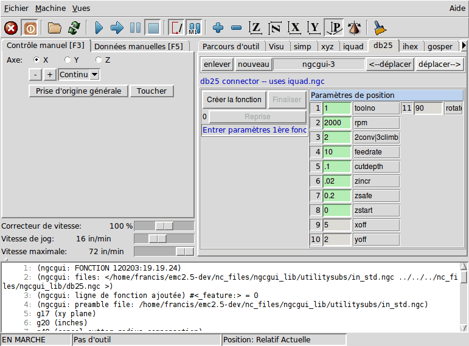

:lang: fr
:toc:

[[cha:ngcgui]]
= L'utilitaire graphique NGCGUI(((NGCGUI)))

.NGCGUI embedded into Axis
image::images/ngcgui_fr.png[align="center"]

== Vue d'ensemble

* NGCGUI est un utilitaire écrit en Tcl pour construire les programmes de G-code en
  sous-programmes. Les sous-programmes peuvent être concaténés pour fournir un programme de
  G-code complet. De multiples instances d'un sous-programme peuvent être utilisées pour
  fournir la même tâche à différents emplacements sur la même pièce.
* NGCGUI peut être utilisé en autonome ou intégré, dans ce dernier cas,
  il crée des onglets multiples sur la page de l'interface graphique Axis.
* 'PYNGCGUI' is an alternate, python implementation of ngcgui.
* 'PYNGCGUI' can run as a standalone application or can be embedded as
  a tab page (with its own set of multiple subroutine tabs) in any
  GUI that supports embedding of gladevcp applications axis, touchy, gscreen
  and gmoccapy.

Using NGCGUI or PYNGCGUI:

* Tab pages are provided for each subroutine specified in the INI file
* New subroutines tab pages can be added on the fly using the
  <<ngcgui-ini,custom tab>>
* Each subroutine tab page provides entry boxes for all subroutine parameters
* The entry boxes can have a default value and an label that
  are identified by special comments in the subroutine file
* Subroutine invocations can be concatenated together to form a multiple step
  program
* Any single-file G-code subroutine that conforms to ngcgui conventions can be used
* Any gcmc (G code-meta-compiler) program that conforms to ngcgui conventions
  for tagging variables can be used. (The gcmc executable must be installed
  separately, see: http://www.vagrearg.org/content/gcmc)

[NOTE]
====
NGCGUI and PYNGCGUI implement the same functions and both process .ngc and .gcmc
files that conform to a few ngcgui-specific conventions.  In this document,
the term 'NGCGUI' generally refers to either application.
====

== Configurations fournies en exemple.

Trois configurations sont fournies, elles se trouve dans le répertoire _sim_
du sélecteur de configuration de LinuxCNC. Le sélecteur de configuration se
trouve quand à lui dans le menu _Applications → CNC → LinuxCNC_.

Examples are included for the axis, touchy, gscreen, and gmoccapy.
These examples demonstrate both 3-axis (XYZ) cartesian configurations
(like mills) and lathe (XZ) setups.  Some examples show the use of a
pop up keyboard for touch screen systems and other examples demonstrate
the use of files created for the gcmc (G-code Meta Compiler) application.
The touchy examples also demonstrate incorporation of a gladevcp back plot
viewer (gremlin_view).

The simplest application is found as:

  Sample Configurations/sim/axis/ngcgui/ngcgui_simple

A comprehensive example showing gcmc compatibility is at:

  Sample Configurations/sim/axis/ngcgui/ngcgui_gcmc

A comprehensive example embedded as a GladeVCP app and using gcmc is at:

  Sample Configurations/sim/gscreen/ngcgui/pyngcgui_gcmc

The example sim configurations make use of library files that provide
example G-code subroutine (.ngc) files and G-code-meta-compiler (.gcmc) files:

* 'nc_files/ngcgui_lib'
** _ngcgui_ - Un exemple facile à comprendre utilisant ces sous-programmes:
** ** 'arc1.ngc' - basic arc using cutter radius compensation
** 'arc2.ngc' - arc speced by center, offset, width, angle (calls arc1)
** 'backlash.ngc' - routine to measure an axis backlash with dial indicator
** _db25_ - Crée la découpe pour une fiche DB25.
** _gosper_ - Une démo sur la récursion.
** 'helix.ngc' - helix or D-hole cutting
** 'helix_rtheta.ngc' - helix or D-hole positioned by radius and angle
** 'hole_circle.ngc' - equally spaced holes on a circle
** _ihex_ - Crée un hexagone interne.
** _iquad_ - Crée un quadrilatère interne.
** 'ohex.ngc' - outside hexagon
** 'oquad.ngc' - outside quadrilateral
** 'qpex_mm.ngc' - demo of qpockets (mm based)
** 'qpex.ngc' - demo of qpockets (inch based)
** 'qpocket.ngc' - quadrilateral pocket
** 'rectangle_probe.ngc' - probe a rectangular area
** _simp_ - Un exemple simple créant deux cercles.
** 'slot.ngc' - slot from connecting two endpoints
** _xyz_ - Crée une boîte basée sur deux coins opposés.
** _Custom_ - Crée des onglets personnalisés.
** _ttt_ - Traceur True Type, pour créer des textes à graver.

* 'nc_files/ngcgui_lib/lathe'
** _ngcgui-lathe_ - Un exemple de sous-programme pour un tour:
** 'g76base.ngc' - gui for g76 threading
** 'g76diam.ngc' - threading speced by major, minor diameters
** _id_ - Alésage intérieur.
** _od_ - Cylindrage extérieur.
** _taper-od_ - Tourne un cône mâle.
** _Custom_ - Crée des onglets personnalisés.

* 'nc_files/gcmc_lib'
** 'drill.gcmc' - drill holes in rectangle pattern
** 'square.gcmc' - simple demo of variable tags for gcmc files
** 'star.gcmc' - gcmc demo illustrating functions and arrays
** 'wheels.gcmc' - gcmc demo of complex patterns

To try a demonstration, select a sim configuration and start
the LinuxCNC program.

Pour visualiser les sous-programmes presser l'_**A**rrêt d'**U**rgence_ 
image:images/tool_estop.png[] puis, activer la _Marche Machine_ 
image:images/tool_power.png[] et réaliser la _Prise d'origine générale_.
Cliquer sur un onglet de ngcgui et presser _Créer la fonction_ 
puis _Finaliser_. Enfin, presser sur le bouton 
image:images/tool_run.png[] _Départ cycle_ pour exécuter le G-code. Experiment
by creating multiple features and features from different tab pages.

To create several subroutines concatenated into a single file, go to each tab
fill in the blanks, press 'Create Feature' then using the arrow keys move any
tabs needed to put them in order. Now press 'Finalize' and answer the prompt
to create

Other guis will have similar functionality but the buttons and names
may be different.

[NOTE]
====
The demonstration configs create tab pages for just a few of the provided
examples. Any gui with a <<ngcgui-ini,custom tab>> can open any of the library
example subroutines or any user file if it is in the LinuxCNC subroutine
path.

To see special key bindings, click inside an ngcgui tab page to get
focus and then press Control-k.

Les sous-programmes d'exemples fournis avec la distribution doivent tous
fonctionner avec la configuration de la machine simulée. Un utilisateur doit
toujours comprendre le comportement et les implications d'un programme avant
de tenter de l'exécuter sur une machine réelle.
====

== Librairies

Les configurations en simulation pour ngcgui utilisent les liens suivants vers
des librairies de LinuxCNC protégées en écriture:

* _Sous-fichiers compatibles ngcgui_ - ngcgui_lib
* 'nc_files/ngcgui_lib/lathe'       ngcgui-compatible lathe subfiles
* 'nc_files/gcmc_lib'               ngcgui-gcmc-compatible programs
* _Sous-programme d'aide_ - ngcgui_lib/utilitysubs
* _Fichiers M utilisateurs_ - ngcgui_lib/mfiles

Ces librairies sont définies dans le fichier ini par les items that specify the search
paths used by linuxCNC (and ngcgui):

----
[RS274NGC]
SUBROUTINE_PATH = ../../../nc_files/ngcgui_lib:../../../nc_files/ngcgui_lib/utilitysubs
USER_M_PATH     = ../../../nc_files/ngcgui_lib/mfiles
----

[NOTE]
====
C'est une longue ligne (ne pas continuer sur de multiples lignes) qui spécifie
les répertoires utilisés dans le chemin de recherche. Les noms de répertoires
sont séparés par le caractère (:). No spaces should
occur between directory names.
====

L'utilisateur peut créer de nouveaux répertoires pour ses propres
sous-programmes et fichiers M et les ajouter dans le chemin de recherche.

Par exemple, un utilisateur pourrait créer ces répertoires à partir de la console.

----
mkdir /home/myusername/mysubs
mkdir /home/myusername/mymfiles
----

Puis y créer ou y copier des fichiers qui lui seront accessibles en écriture.
Par exemple, créer un sous-fichier compatible ngcgui nommé:

----
/home/myusername/mysubs/exemple.ngc
----

Le fichier ini doit être édité pour lui inclure les nouveaux sous-fichiers et
les ajouter au chemin. Pour cet exemple:

----
[RS274NGC]
...
SUBROUTINE_PATH = /home/myusername/mysubs:../../../nc_files/ngcgui_lib:../../../nc_files/ngcgui_lib/utilitysubs
USER_M_PATH     = /home/myusername/mymfiles:../../../nc_files/ngcgui_lib/mfiles

[DISPLAY]
...
NGCGUI_SUBFILE = exemple.ngc
...
----

LinuxCNC et ngcgui utilisent le premier fichier trouvé lors d'une recherche
dans les répertoires du chemin de recherche. Avec ce comportement, Il est
possible de substituer un sous-fichier ngcgui_lib en plaçant un sous-fichier
avec un nom identique plus tôt dans le chemin de recherche pour qu'il soit 
trouvé avant. Plus d'informations peuvent être trouvées au chapitre INI dans le
Manuel de l'intégrateur.

== Standalone Usage

=== Standalone NGCGUI

For usage, type in a terminal:

----
ngcgui --help
Usage:
  ngcgui --help | -?
  ngcgui [Options] -D nc_files_directory_name
  ngcgui [Options] -i LinuxCNC_inifile_name
  ngcgui [Options]

  Options:
         [-S subroutine_file]
         [-p preamble_file]
         [-P postamble_file]
         [-o output_file]
         [-a autosend_file]            (autosend to axis default:auto.ngc)
         [--noauto]                    (no autosend to axis)
         [-N | --nom2]                 (no m2 terminator (use %))
         [--font [big|small|fontspec]] (default: "Helvetica -10 normal")
         [--horiz|--vert]              (default: --horiz)
         [--cwidth comment_width]      (width of comment field)
         [--vwidth varname_width]      (width of varname field)
         [--quiet]                     (fewer comments in outfile)
         [--noiframe]                  (default: frame displays image)
----

[NOTE]
====
As a standalone application, ngcgui handles a single subroutine file which
can be invoked multiple times.  Multiple standalone ngcgui applications
can be started independently.
====

=== Standalone PYNGCGUI

For usage, type in a terminal:

----
pyngcgui --help
Usage:
pyngcgui [Options] [sub_filename]
Options requiring values:
    [-d | --demo] [0|1|2] (0: DEMO standalone toplevel)
                          (1: DEMO embed new notebook)
                          (2: DEMO embed within existing notebook)
    [-S | --subfile       sub_filename]
    [-p | --preamble      preamble_filename]
    [-P | --postamble     postamble_filename]
    [-i | --ini           inifile_name]
    [-a | --autofile      auto_filename]
    [-t | --test          testno]
    [-K | --keyboardfile  glade_file] (use custom popupkeyboard glade file)
Solo Options:
    [-v | --verbose]
    [-D | --debug]
    [-N | --nom2]         (no m2 terminator (use %))
    [-n | --noauto]       (save but do not automatically send result)
    [-k | --keyboard]     (use default popupkeybaord)
    [-s | --sendtoaxis]   (send generated ngc file to axis gui)
Notes:
      A set of files is comprised of a preamble, subfile, postamble.
      The preamble and postamble are optional.
      One set of files can be specified from cmdline.
      Multiple sets of files can be specified from an inifile.
      If --ini is NOT specified:
         search for a running LinuxCNC and use its inifile
----

[NOTE]
====
As a standalone application, pyngcgui can read an ini file (or a
running LinuxCNC application) to create tab pages for multiple
subfiles.
====

== Embedding NGCGUI

=== Intégration de ngcgui dans Axis

D'autres exemples de sous-programmes se trouvent dans le répertoire sim/ngcgui
Les items de fichier INI pour NGCGUI vont dans la section [DISPLAY].

* _TKPKG_             = Ngcgui 1.0 - Le paquet principal de NGCGUI (doit précéder Ngcguittt).
* _TKPKG_             = Ngcguittt 1.0 - Le paquet du traceur True Type pour
  générer des textes à graver.
* _NGCGUI_FONT_       = Helvetica -12 normal - Spécifie la police utilisée.
* _NGCGUI_PREAMBLE_   = in_std.ngc - Le fichier de préambule à ajouter au début
  du sous-programme. Quand plusieurs sous-programmes sont concaténés, un seul
  est ajouté.
* _NGCGUI_SUBFILE_    = simp.ngc - Crée un onglet depuis le sous-programme nommé.
//FIXME * _NGCGUI_SUBFILE_    = "" - Crée un onglet personnalisé. ?
* _#NGCGUI_OPTIONS_   = opt1 opt2 ... - Options Ngcgui
** # opt items:
*** #   nonew      -- interdit la création d'un nouvel onglet personnalisé
*** #   noremove   -- interdit l'effacement d'une page d'onglet
*** #   noauto     -- pas d'envoi auto (makeFile, puis envoi manuel)
*** #   noiframe   -- no internal image, image on separate top level
* _TTT_               = Le programme True-type Tracer
* _TTT_PREAMBLE_      = in_std.ngc - Optionnel, spécifie le nom de fichier de
  préambule utilisé par ttt pour créer les sous-fichiers.

[NOTE]
====
The optional truetype tracer items are used to specify an ngcgui-compatible tab page
that uses the application truetype-tracer.  The truetype-tracer application must
be installed independently and located in the user PATH.
====

=== Embedding PYNGCGUI as a gladevcp tab page in a gui

The following INI file items go in the [DISPLAY] section for use with the
axis, gscreen, or touchy guis.  (See additional sections below for additional
items needed)

.EMBED_ Items
* `EMBED_TAB_NAME = Pyngcgui` - name to appear on embedded tab
* `EMBED_TAB_COMMAND = gladevcp -x {XID} pyngcgui_axis.ui` - invokes gladevcp
* `EMBED_TAB_LOCATION = name_of_location` - where the embedded page is located

[NOTE]
====
The EMBED_TAB_LOCATION specifier is not used for the axis gui.  While
pyngcgui can be embedded in axis, integration is more complete when using
ngcgui (using TKPKG = Ngcgui 1.0).  To specify the EMBED_TAB_LOCATION
for other guis, see the <<sub:ini:sec:display,DISPLAY Section>> of the INI
Configuration Chapter.
====

[NOTE]
====
The truetype tracer gui front-end is not currently available for gladevcp
applications.
====

[[ngcgui-ini]]
=== Additional INI File items required for ngcgui or pyngcgui

The following INI file items go in the [DISPLAY] section for any gui
that embeds either ngcgui or pyngcgui.

* 'NGCGUI_FONT = Helvetica -12 normal' - specifies the font name,size, normal|bold
* 'NGCGUI_PREAMBLE = in_std.ngc' - the preamble file to be added in front of the
  subroutines. When concatenating several common subroutine invocations, this preamble
  is only added once.  For mm-based machines, use mm_std.ngc
* 'NGCGUI_SUBFILE = filename1.ngc' - creates a tab from the filename1 subroutine
* 'NGCGUI_SUBFILE = filename2.ngc' - creates a tab from the filename2 subroutine
* '... etc'
* 'NGCGUI_SUBFILE = gcmcname1.gcmc' - creates a tab from the gcmcname1 file
* 'NGCGUI_SUBFILE = gcmcname2.gcmc' - creates a tab from the gcmcname2 file
* '... etc'
* 'NGCGUI_SUBFILE = ""' - creates a custom tab that can open any subroutine in the search path
* 'NGCGUI_OPTIONS = opt1 opt2 ...' - NGCGUI options
** 'nonew' - disallow making a new custom tab
** 'noremove' - disallow removing any tab page
** 'noauto' - no autosend (use makeFile, then save or manually send)
** 'noiframe' - no internal image, display images on separate top level widget
** 'nom2' - do not terminate with m2, use % terminator.  This option eliminates all
   the side effects of m2 termination
* 'GCMC_INCLUDE_PATH = dirname1:dirname2' - search directories for gcmc include files

Voici un exemple d'intégration de NGCGUI dans Axis. Les sous-programmes doivent
être placés dans un répertoire spécifié par la variable [RS274NGC]SUBROUTINE_PATH. Certains exemples de sous-programmes utilisent
d'autres sous-programmes, bien vérifier pour être sur d'avoir les bonnes
dépendances, le cas échéant, dans un répertoire SUBROUTINE_PATH. Certains
sous-programmes peuvent utiliser des fichiers M (Mfiles) personnalisés qui
doivent se trouver dans un répertoire spécifié par [RS274NGC]USER_M_PATH.

The G-code-meta-compiler (gcmc) can include statements like:

----
include("filename.inc.gcmc");
----

By default, gcmc includes the current directory which, for linuxCNC,  will be
the directory containing the linuxCNC ini file.  Additional directories can be
prepended to the gcmc search order with the GCMC_INCLUDE_PATH item.

.Simple fichier.ini
----
[RS274NGC]
...
SUBROUTINE_PATH   = ../../nc_files/ngcgui_lib:../../ngcgui_lib/utilitysubs
USER_M_PATH       = ../../nc_files/ngcgui_lib/mfiles

[DISPLAY]
TKPKG             = Ngcgui    1.0
TKPKG             = Ngcguittt 1.0
# Ngcgui must precede Ngcguittt

NGCGUI_FONT       = Helvetica -12 normal
# specifie seulement les noms de fichiers, doit être dans [RS274NGC]SUBROUTINE_PATH
NGCGUI_PREAMBLE   = in_std.ngc
NGCGUI_SUBFILE    = simp.ngc
NGCGUI_SUBFILE    = xyz.ngc
NGCGUI_SUBFILE    = iquad.ngc
NGCGUI_SUBFILE    = db25.ngc
NGCGUI_SUBFILE    = ihex.ngc
NGCGUI_SUBFILE    = gosper.ngc
# specifie "" pour une page d'onglet personnalisée
NGCGUI_SUBFILE    = ""
#NGCGUI_SUBFILE   = "" utilisé quand une trame d'image est spécifiée si
#                      ouvrir d'autres fichiers est requis
#                      les images seront mises dans une fenêtre de haut niveau
NGCGUI_OPTIONS    =
#NGCGUI_OPTIONS   = opt1 opt2 ...
# opt items:
#   nonew      -- interdit la création d'un nouvel onglet personnalisé
#   noremove   -- interdit l'effacement d'une page d'onglet
#   noauto     -- pas d'envoi auto (makeFile, puis envoi manuel)
#   noiframe   -- no internal image, image on separate top level
GCMC_INCLUDE_PATH = /home/myname/gcmc_includes

TTT               = truetype-tracer
TTT_PREAMBLE      = in_std.ngc

PROGRAM_PREFIX    = ../../nc_files
----

[NOTE]
====
Il ne s'agit pas d'un fichier ini complet, les items montrés sont ceux utilisés 
par ngcgui. D'autres items sont requis par LinuxCNC pour obtenir un fichier ini
complet.
====

=== Traceur Truetype

Ngcgui_ttt fourni le support pour truetype-tracer (v4). Il crée un onglet
sur Axis qui permet à l'utilisateur de créer ses propres textes dans de 
nouveaux onglets ngcgui et en choisissant leurs fontes et autres paramètres. 
(Truetype-tracer doit être installé indépendamment).

L'intégration de ngcgui_ttt dans Axis, nécessite les items suivants en plus de ceux de ngcgui:

----
Item:    [DISPLAY]TKPKG = Ngcgui_ttt numéro_de_version
Exemple: [DISPLAY]TKPKG = Ngcgui_ttt 1.0
Note:    Obligatoire, spécifie le chargement de ngcgui_ttt dans un onglet 
d'Axis nommé ttt. Doit suivre l'item TKPKG = Ngcgui.

Item:    [DISPLAY]TTT = chemein_de_truetype-tracer
Exemple: [DISPLAY]TTT = truetype-tracer
Note:    Optionnel, s'il n'est pas spécifié, utilisera 
/usr/local/bin/truetype-tracer. Spécifier avec un chemin absolut ou simplement
le nom de l'exécutable, dans ce cas, la variable d'environnement PATH de l'utilisateur sera utilisée pour rechercher le programme.

Item:    [DISPLAY]TTT_PREAMBLE = nom_fichier_préambule
Exemple: [DISPLAY]TTT_PREAMBLE = in_std.ngc
Note:    Optionnel, spécifie le nom du fichier de préambule utilisé pour les sous-fichiers créés par ttt.
----

=== Exemples d'INI

Ngcgui utilise le chemin de recherche de LinuxCNC pour chercher les fichiers.

Le chemin de recherche commence avec le répertoire standard spécifié par:

----
[DISPLAY]PROGRAM_PREFIX = directory_name
----

suivi par les répertoires multiples spécifiés par:

----
[RS274NGC]SUBROUTINE_PATH = directory1_name:directory1_name:directory3_name ...
----

.Répertoires

Les répertoires peuvent être spécifiés comme des chemins absolus ou des chemins relatifs.

* Exemple: `[DISPLAY]PROGRAM_PREFIX = /home/myname/linuxcnc/nc_files`
* Exemple: `[DISPLAY]PROGRAM_PREFIX = ~/linuxcnc/nc_files`
* Exemple: `[DISPLAY]PROGRAM_PREFIX = ../../../nc_files`

.Chemins absolus

Un chemin absolu commence avec un "/" qui indique un emplacement par rapport au
système de fichiers complet.  Un chemin qui commence par "\~/" indique un
chemin commençant _depuis_ le répertoire home de l'utilisateur. Un chemin qui
commence par "~nomutilisateur/" indique un chemin commençant _dans_ le répertoire utilisateur.

.Chemins relatifs

Un chemin relatif commence dans le répertoire de démarrage qui est celui
contenant le fichier ini. L'usage des chemins relatifs facilite l'accès aux
configurations mais requiert une bonne compréhension de la façon dont les chemins sont spécifiés sous Linux.

* `./d0`      est le même que d0, ex: un répertoire nommé d0 dans le répertoire de départ.
* `../d1`     se réfère au répertoire d1 dans le répertoire parent.
* `../../d2`  se réfère au répertoire d2 dans le répertoire parent du parent.
* `../../../d3` etc.

Des répertoires multiples peuvent être spécifiés par la variable:
[RS274NGC]SUBROUTINE_PATH suivie des chemins séparés par le signe ":". 
L'exemple suivant illustre le format utilisé pour les chemins multiples et montre l'utilisation de répertoires relatifs et absolus.

.Multiple Directories Example:
----
_[RS274NGC]SUBROUTINE_PATH = ../../../nc_files/ngcgui_lib:../../../nc_files/ngcgui_lib/utilitysubs:/tmp/tmpngc_
----

C'est une longue ligne, ne pas continuer sur de multiples lignes. Quand
LinuxCNC et/ou Ngcgui cherchent un fichier, c'est le premier trouvé qui est utilisé.

LinuxCNC (et NGCGUI) doivent pouvoir trouver tous les sous-programmes avec
les routines additionnelles qui sont appelées depuis les sous-fichiers NGCGUI.
Il est pratique de placer les fichiers utilitaires dans un répertoire séparé comme indiqué dans l'exemple précédent.

La distribution inclus le répertoire ngcgui_lib et les fichiers de préambule,
sous-fichiers, postambule et fichiers d'aide pour les démos. Pour modifier
le comportement des fichiers, il est possible de copier n'importe quel fichier
et de le placer en avant du chemin de recherche. Le premier répertoire
recherché est: [DISPLAY]PROGRAM_PREFIX. Il est possible de l'utiliser mais
c'est une meilleure pratique de créer un répertoire dédié en le plaçant au début du chemin donné par [RS274NGC]SUBROUTINE_PATH.

Dans l'exemple suivant, les fichiers dans /home/myname/emc2/mysubs seront 
trouvés avant ceux étant dans ../../../nc_files/ngcgui_lib.

.Adding User Directory Example:
----
_[RS274NGC]SUBROUTINE_PATH = /home/myname/emc2/mysubs:../../../nc_files/ngcgui_lib:../../../nc_files/ngcgui_lib/utilitysubs_
----

Les débutants pourraient essayer par inadvertance d'utiliser des 
fichiers non structurés comme le nécessite ngcgui. Ngcgui déclencherait alors
rapidement de nombreuses erreurs si les fichiers ne répondent pas à ses 
conventions. Une bonne pratique suggère que les sous-fichiers compatibles
ngcgui doivent être placés dans un répertoire dédié à cette fin et que
les préambules, postambules et fichiers d'aide doivent être dans un répertoire
séparés pour dissuader toute tentative d'utilisation de ces
sous-fichiers. 

=== Summary of INI File item details for NGCGUI usage

[RS274NGC]SUBROUTINE_PATH = dirname1:dirname2:dirname3 ...::
  _Exemple_: `[RS274NGC]SUBROUTINE_PATH = ../../nc_files/ngcgui_lib:../../nc_files/ngcgui_lib/utilitysubs` +
  _Note_:    Optionnel, mais très utile pour organiser les sous-fichiers et les fichiers utilitaires.

[RS274NGC]USER_M_PATH = dirname1:dirname2:dirname3 ...::
  _Example_: `[RS274NGC]USER_M_PATH = ../../nc_files/ngcgui_lib/mfiles` +
  _Note_:    Optional, needed to locate custom user mfiles.

[DISPLAY]EMBED_TAB_NAME = name to display on embedded tab page::
  _Example_: `[DISPLAY]EMBED_TAB_NAME = Pyngcgui` +
  _Note_:    The entries: `EMBED_TAB_NAME`, `EMBED_TAB_COMMAND`, `EMBED_TAB_LOCATION`
             define an embedded application for several LinuxCNC GUIs.

[DISPLAY]EMBED_TAB_COMMAND = programname followed by arguments::
  _Example_: `[DISPLAY]EMBED_TAB_COMMAND = gladevcp -x {XID} pyngcgui_axis.ui` +
  _Note_:    For GladeVCP applications, see the <<cha:glade-vcp,GladeVCP Chapter>>.

[DISPLAY]EMBED_TAB_LOCATION = name_of_location::
  _Example_: `[DISPLAY]EMBED_TAB_LOCATION = notebook_main` +
  _Note_:    See example INI files for possible locations. +
             Not required for the AXIS GUI.

[DISPLAY]PROGRAM_PREFIX = dirname::
  _Exemple_: `[DISPLAY]PROGRAM_PREFIX = ../../../nc_files` +
  _Note_:    Obligatoire et nécessaire pour de nombreuses fonctions de LinuxCNC. +
             C'est le premier répertoire utilisé lors de la recherche de fichiers.

[DISPLAY]TKPKG=Ngcgui version_number::
  _Exemple_: `[DISPLAY]TKPKG=Ngcgui 1.0` +
  _Note_:    Obligatoire pour l'inclusion dans AXIS. +
             Spécifie le chargement des onglets NGCGUI dans AXIS.

[DISPLAY]NGCGUI_FONT = font_descriptor::
  _Exemple_: `[DISPLAY]NGCGUI_FONT = Helvetica -12 normal` +
  _Note_:    Optionnel, descripteur de fontes compatible avec celui de Tcl
             avec des items pour fonttype -fontsize fontweight. +
             Par défaut c'est la police: Helvetica -10 normal
             FIXME
             FIXME

[DISPLAY]NGCGUI_SUBFILE = subfile_filename::
  _Exemple_: `[DISPLAY]NGCGUI_SUBFILE = simp.ngc` +
  _Exemple_: `[DISPLAY]NGCGUI_SUBFILE = xyz.ngc` +
  _Exemple_: `[DISPLAY]NGCGUI_SUBFILE = ""` +
  _Note_:    Utilise un ou plusieurs items pour spécifier des sous-fichiers compatibles
             ngcgui ou des programmes gcmc qui requierent un onglet dans Axis au
             lancement. +
             Un onglet "personnalisé" est créé quand le nom de fichier est "". +
             Un utilisateur peut utiliser un onglet "Personnalisé" pour lire un
             fichier système et identifier un préambule, un sous-fichier ou un postambule.

[DISPLAY]NGCGUI_PREAMBLE = preamble_filename::
  _Exemple_: `[DISPLAY]NGCGUI_PREAMBLE = in_std.ngc` +
  _Note_:    Optionnel, si spécifié, alors ce fichier sera prépondérant sur tous les
             sous-fichiers. +
             Les fichiers créés avec l'onglet "Personnalisé" utilisent
             le préambule spécifié avec cette page.

[DISPLAY]NGCGUI_POSTAMBLE = postamble_filename::
  _Exemple_: `[DISPLAY]NGCGUI_POSTAMBLE = bye.ngc` +
  _Note_:    Optionnel, si spécifié, le fichier est ajouté à tous les sous-fichiers. +
             Les fichiers créés avec l'onglet "Personnalisé" utilisent le postambule
             spécifié avec cette page.

[DISPLAY]NGCGUI_OPTIONS = opt1 opt2 ...::
  _Exemple_: `[DISPLAY]NGCGUI_OPTIONS = nonew noremove` +
  _Note_:    Options multiples séparées par des espaces. +
             Par défaut,  ngcgui gère les onglets de cette manière: +
               1) Un utilisateur peut créer de nouveaux onglets; +
               2) Un utilisateur peut enlever des onglets (excepté le dernier restant); +
               3) La finalisation envoie automatiquement les fichiers à AXIS. +
               4) Une trame d'image (iframe) est rendue disponible pour afficher
                  une image pour le sous-fichier. +
               5) the ngcgui result file sent to linuxCNC is terminated with
                  an m2 (and incurs m2 side-effects). +
+
Les options `nonew`, `noremove`, `noauto`, `noiframe` respectivement,
désactivent ces comportements par défaut.
+
Par défaut, Si un fichier d'image (.png, .gif, .jpg, .pgm)
est trouvé dans le même répertoire que le sous-fichier, l'image
est affichée dans une iframe.  Spécifier l'option
`noiframe` rendra disponibles d'autres boutons pour sélectionner
un préambule, un sous-fichier ou un postambule et
des cases à cocher additionnelles. Les cases à cocher sont toujours
disponibles avec les touches spéciales suivantes: +
  `Ctrl-R` Bascule "Conserver les valeurs à la lecture du sous-fichier", +
  `Ctrl-E` Bascule "Déployer le sous-programme", +
  `Ctrl-a` Bascule "EnvoiAuto", +
  `Ctrl-k` lists all keys and functions.
+
Si `noiframe` est spécifié et qu'un fichier image est trouvé,
l'image est affichée dans une fenêtre séparée et
toutes les fonctions sont disponibles dans la page de l'onglet.
+
Les `NGCGUI_OPTIONS` s'appliquent à tous les onglets ngcgui excepté
ceux sur lesquels les options `nonew`, `noremove`, et `noiframe` ne
sont pas applicables pour l'onglet "Personnalisé".
Ne pas utiliser l'onglet "Personnalisé" si les utilisateurs doivent
avoir des possibilités de sélection de sous-fichiers et de création
d'onglet additionnels limitées.

[DISPLAY]GCMC_INCLUDE_PATH = dirname1:dirname2:...::
  _Example_: `[DISPLAY]GCMC_INCLUDE_PATH = /home/myname/gcmc_includes:/home/myname/gcmc_includes2` +
  _Note_:    Optional, each directory will be included when gcmc is invoked
             using the option: `--include dirname`.

:showcomments:
// FIXME Keyboard shortcuts do not work in version _fr.

== File Requirements for NGCGUI Compatibility

=== Single-File Gcode (.ngc) Subroutine Requirements

Un sous-fichiers compatible NGCGUI contient une simple définition de
sous-programme. Le nom du sous-programme doit être le même que celui du
fichier (non inclus l'extension .ngc). LinuxCNC supporte les sous-programmes
nommés ou numérotés, mais seuls les sous-programmes nommés sont compatible
avec NGCGUI. Pour plus d'informations voir le chapitre sur les <<cha:O-codes,O-Codes>>.

La première ligne, autre qu'un commentaire, doit être une déclaration `sub`. +
La dernière ligne, autre qu'un commentaire, doit être une déclaration `endsub_.

.exemple.ngc:
----
(info: info_text_to_appear_at_top_of_tab_page)
; comment line beginning with semicolon
( comment line using parentheses)
o<exemple> sub
  CORPS_DU_SOUS-PROGRAMME
o<exemple> endsub
; comment line beginning with semicolon
( comment line using parentheses)
----

Le corps du sous-programme doit commencer par un jeu de déclarations
définissant les paramètres nommés locaux pour chaque paramètre positionnel
attendu pour l'appel du sous-programme. Ces définitions doivent être
consécutives, commencer par #1 et finir avec le numéro du dernier paramètre
utilisé. Les définitions doivent être fournies pour chacun de ces paramètres (aucune omissions).

.Numérotation des paramètres
----
#<xparm> = #1
#<yparm> = #2
#<zparm> = #3
----

LinuxCNC considère tous les paramètres numérotés entre #1 est #30 comme étant
des paramètres appelables, de même, ngcgui fourni des dialogues de saisie pour
n'importe quel paramètres dans cette fourchette. Il est de bonne pratique 
d'éviter d'utiliser un paramètre numéroté de #1 jusqu'à #30 n'importe où
ailleurs dans le sous-programme. L'utilisation de paramètres nommés locaux est recommandée pour toutes le variables internes.

Chaque définition de déclaration peut optionnellement inclure un commentaire
spécial et une valeur par défaut pour le paramètre.

.Prototypage de déclaration
----
#<vname> = #n (=valeur_par_défaut)
ou
#<vname> = #n (texte_de_commentaire)
ou
#<vname> = #n (=valeur_par_défaut texte_de_commentaire)
----

.Exemples de paramètres
----
#<xparm> = #1 (=0.0)
#<yparm> = #2 (Ystart)
#<zparm> = #3 (=0.0 Z start setting)
----

Si une valeur_par_défaut est donnée, elle sera placée au démarrage, dans la
boîte de saisie pour le paramètre.

Si un texte_de_commentaire est inclus, il sera utilisé pour identifier l'entrée
à la place du nom du paramètre.

.Paramètres nommés globaux

Note sur les paramètres nommés globaux (#<_nom_global>) avec ngcgui:

(global named parameters have a leading underscore in the name, like
#<_someglobalname>)

Comme dans de nombreux langages de programmation, l'utilisation de variables
globales est puissante, mais peut souvent mener à des conséquences inattendues.
Dans LinuxCNC, les paramètres nommés globaux existants seront valides lors de
l'exécution du sous-programme et les sous-programmes peuvent les modifier ou en créer.

L'utilisation de paramètres nommé globaux comme entrées dans un sous-programme
est déconseillé parce-que de tels usages requiert l'établissement et la
maintenance d'un contexte global bien défini, ce qui est problématique à
maintenir. L'utilisation de paramètres numérotés en #1 et #30 devrait être
suffisant pour satisfaire les besoins les plus exigeants.

//FIXME are input global named parameters supported or not ?
Ngcgui supporte quelques entrées par paramètres nommés globaux mais leurs usage
est obsolète et non documenté ici.

Bien que les entrées par paramètres nommés globaux soient déconseillées, les sous-programmes LinuxCNC doivent utiliser des paramètres nommés globaux pour
retourner les résultats. Puisque les sous-fichiers compatibles ngcgui sont
destinés à l'usage de l'interface graphique, les valeurs de retour n'ont pas
d'exigence commune. Toutefois, ngcgui est utile comme outil de test pour les
sous-programmes qui ne retournent pas de paramètres nommés globaux et il est commun pour les sous-fichiers compatibles ngcgui d'appeler des fichiers de 
sous-programmes utilitaires qui eux retournent des résultats avec des paramètres nommés globaux.

Pour supporter ces usages, ngcgui ignore les paramètres nommés globaux qui
incluent le caractère (:) dans leur nom. Utilisation des deux points (:) dans
un nom prévient ngcgui de créer une bîte de saisie pour ces paramètres.

.Exemple de paramètres nommés globaux
----
o<exemp> sub
...
#<_exemp:result> = #5410       (retourne le diamètre de l'outil courant)
...
o<helper> call [#<x1>] [#<x2>] (appel d'un sous-programme)
#<xresult> = #<_helper:answer> (localise immédiatement le résultat du fichier d'aide)
#<_helper:answer> = 0.0 (rend nul le paramètre nommé global utilisé par le sous-programme)
...
o<exemp> endsub
----

Dans l'exemple précédent, le sous-programme utilitaire sera trouvé dans un 
fichier séparé nommé helper.ngc. Le sous-programme d'aide retourne un résultat
dans un paramètre nommé global nommé #<_helper:answer>.

Pour une bonne pratique, le sous-fichier appelant localise immédiatement
le résultat pour une utilisation ailleurs dans le sous-fichier et le paramètre
nommé global, utilisé pour retourner le résultat est mis à zéro pour diminuer
les chances qu'il soit utilisé par inadvertance ailleurs dans le contexte
global. (La mise à zéro avec 0.0 n'est pas toujours le meilleur choix).

Ngcgui supporte la création et la concaténation de multiples fonctions pour
un sous-fichier et pour de multiples sous-fichiers. Il est parfois pratique 
pour les sous-fichiers de déterminer leur ordre au début de l'exécution afin
que ngcgui insère un paramètre global spécial qui pourra être testé par tous les sous-programmes. Ce paramètre est nommé #<_feature:>.
Sa valeur commence avec 0 et est incrémentée avec chaque fonction qui lui est ajoutée.

.Fonctions additionelles

Un commentaire spécial 'info' peut être inclus quelque part dans les
sous-fichier compatibles ngcgui. Le format est le suivant:

----
(info: info_text)
----

La chaine _info_text_ est affichée vers le haut de la page de l'onglet ngcgui dans Axis.

Les fichiers non destinés à servir de sous-fichiers peuvent inclure le
commentaire spécial: "(not_a_subfile)" de sorte que ngcgui les rejette automatiquement avec un message explicatif.

----
(not_a_subfile)
----

Un fichier image optionnel (.png, .gif, .jpg, .pgm) peut accompagner un
sous-fichier. Le fichier image peut aider à clarifier les paramètres utilisés
par le sous-fichier. Le fichier image doit être dans le même répertoire que le
sous-fichier et doit avoir le même nom avec une extension appropriée au fichier
image, ex: le sous-fichier exemp.ngc doit être accompagné par l'image exemp.png.
Ngcgui tente de redimensionner de grandes images par sous-échantillonnage à une largeur maximale de 320 et une hauteur maximum de 240 pixels.

Aucune des conventions nécessaires pour faire une sous-fichier compatible
ngcgui n'empêche son utilisation en tant que fichier de sous-programme pour LinuxCNC.

La distribution LinuxCNC inclus une librairie (répertoire ngcgui_lib) qui
contient plusieurs exemples de sous-fichiers et de fichiers utilitaires
compatibles ngcgui pour illustrer les fonctions des sous-programmes de LinuxCNC et l'usage de ngcgui.
Another library (gcmc_lib) provides examples for subroutine files for
the Gcode meta compiler (gcmc).

Des sous-programmes additionnels soumis par les utilisateurs se trouvent dans
le forum dans la section _Subroutines_.

=== Gcode-meta-compiler (.gcmc) file requirements

Files for the Gcode-meta-compiler (gcmc) are read by ngcgui and it
creates entry boxes for variables tagged in the file.  When a feature
for the file is finalized, ngcgui passes the file as input to the gcmc
compiler and, if the compile is successful, the resulting G-code file
is sent to LinuxCNC for execution.  The resulting file is formatted as
single-file subroutine; .gcmc files and .ngc files can be intermixed
by ngcgui.

The variables identified for  inclusion in ngcgui are tagged with lines
that will appear as comments to the gcmc compiler.

.Variable Tags Formats
----
//ngcgui: varname1 =
//ngcgui: varname2 = value2
//ngcgui: varname3 = value3, label3;
----

.Variable Tags Examples
----
//ngcgui: zsafe =
//ngcgui: feedrate = 10
//ngcgui: xl = 0, x limit
----

For these examples, the entry box for varname1 will have no default,
the entry box for varname2 will have a default of value2, and the
entry box for varname 3 will have a default of value 3 and a label
label3 (instead of varname3).  The default values must be numbers.

To make it easier to modify valid lines in a gcmc file, alternate
tag line formats accepted.  The alternate formats ignore trailing
semicolons (;) and trailing comment markers (//)  With this provision,
it is often makes it possible to just add the //ngcgui: tag to
existing lines in a .gcmc file.

.Alternate Variable Tags Formats
----
//ngcgui: varname2 = value2;
//ngcgui: varname3 = value3; //, label3;
----

.Alternate Variable Tags Examples
----
//ngcgui: feedrate = 10;
//ngcgui: xl = 0; //, x limit
----

An info line that will appear at the top of a tab page may be optionally
included with a line tagged as:

.Info tag
----
//ngcgui: info: text_to_appear_at_top_of_tab_page
----

When required, options can be passed to the gcmc compiler with a line tagged:

.Option line tag format
----
//ngcgui: -option_name [ [=] option_value]
----

.Option line tag Examples
----
//ngcgui: -I
//ngcgui: --imperial
//ngcgui: --precision 5
//ngcgui: --precision=6
----

Options for gcmc are available with the terminal command:

----
gcmc --help
----

A gcmc program by default uses metric mode.  The mode can be
set to inches with the option setting:

----
//ngcgui: --imperial
----

A preamble file, if used, can set a mode (g20 or g21) that
conflicts with the mode used by a gcmc file.  To ensure that
the gcmc program mode is in effect, include the following
statement in the .gcmc file:

----
include("ensure_mode.gcmc")
----

and provide a proper path for gcmc include_files in the ini file,
for example:

----
[DISPLAY]
GCMC_INCLUDE_PATH = ../../nc_files/gcmc_lib
----

== Exemple, découpe pour DB25

L'exemple ci-dessous montre l'utilisation du sous-programme DB25.

Dans la première image on voit les champs remplis pour chaque variable.

Cette image montre le parcours d'outil du sous-programme DB25.

image::images/ngcgui-db25-2_fr.png[align="center"]

Cette image montre l'action du bouton _Nouveau_ et de l'onglet personnalisé pour
créer très facilement la découpe de trois DB25 en un seul programme.

image::images/ngcgui-db25-3_fr.png[align="center"]

== Création d'un sous-programme

* Pour la création d'un sous-programme à utiliser avec Ngcgui, le nom de fichier
  et le nom du sous-programme doivent être les mêmes.
* Le fichier doit être placé dans le sous-répertoire pointé dans le fichier ini.
* À la première ligne peut se trouver un commentaires de type info: qui doit être placé au début du sous-programme.
* Le sous-programme doit être entouré par les balises `sub` et `endsub`.
* Les variables utilisées doivent être des variables numérotées et ne doivent pas sauter de numéro.
* Des commentaires et presets peuvent être inclus.

.Subroutine Skeleton Example
----
(info: simp -- simple exemple de sous-programme -- Ctrl-U pour éditer)
o<simp> sub
  #<ra>       = #1 (=.6 Rayon A) ;Example de paramètre avec un commentaire
  #<radius_b> = #2 (=0.4)         ;Example de paramètre sans commentaire
  #<feedrate> = #3 (Feedrate)     ;Example de paramètre sans preset
  g0x0y0z1
  g3 i#<ra> f#<feedrate>
  g3 i[0-#<radius_b>]
o<simp> endsub
----

// vim: set syntax=asciidoc:
