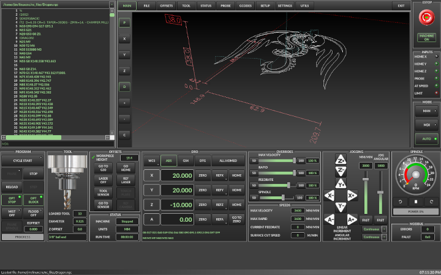
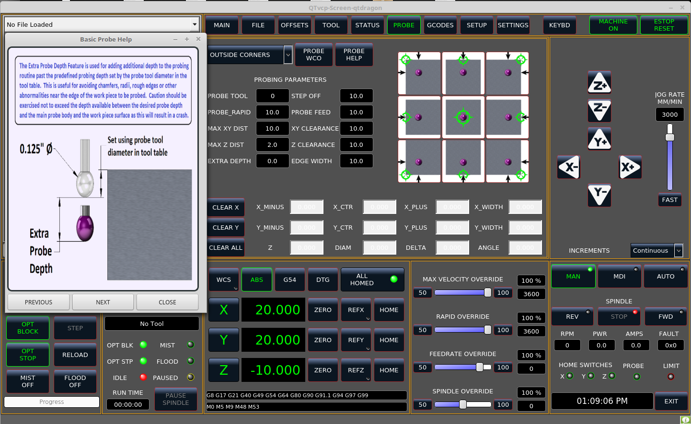
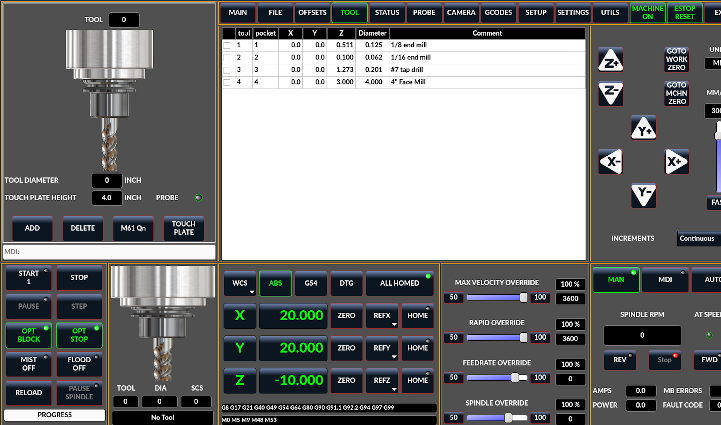
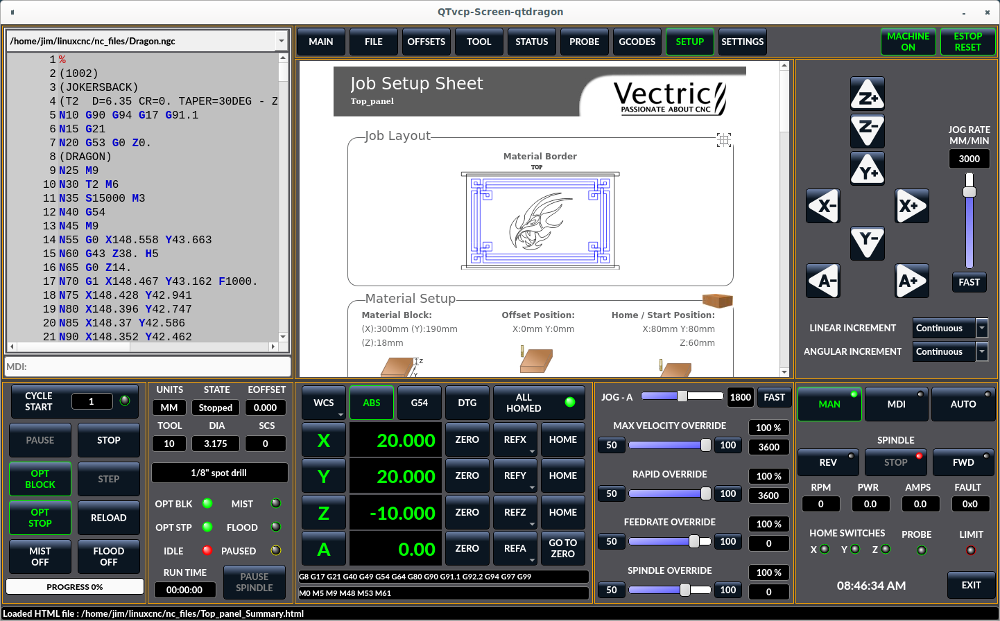
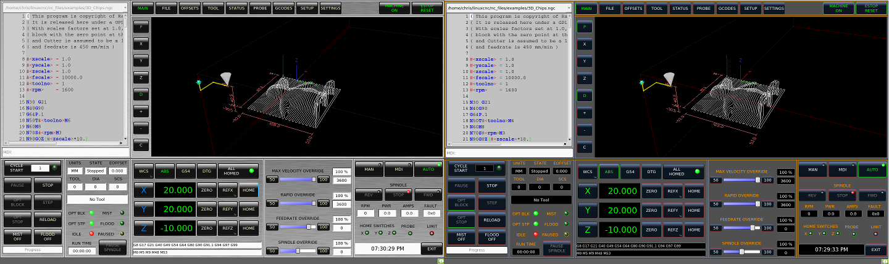
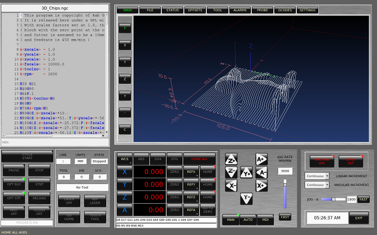

[[cha:qtdragon-gui]](((QtDragon)))

:ini: {basebackend@docbook:'':ini}
:hal: {basebackend@docbook:'':hal}

= QtDragon GUI

== Introduction
QtDragon and QtDragon_hd are built with the QTVCP framework.
Much of it is based on the excellent work of others in the LinuxCNC community.
[NOTE]
QtDragon and QtVcp are new programs added into linuxcnc.
Bugs and oddities are possible. Please test carefully when using a 
dangerous machine. Please forward reports to the forum or maillist.

.qtdragon - 3 or 4 Axis Sample (1440x860) in silver theme
image::images/silverdragon.png["QTDragon Router",scale="25%"]

.qtdragon_hd - 3 or 4 Axis Sample for larger monitors (1920x1056) in dark theme

== Getting Started

If your configuration is not currently set up to use QtDragon, 
you can change it by editing the INI file. +
This is not an exhaustive list of options. +
<<sec:display-section,Display Section>>

=== Display
In the section '[DISPLAY]' change the 'DISPLAY' line to read: +
'qtdragon' for a small version +
'qtdradon_hd' for the large version. +
you can add '-c-' or '-v' for debug output to the terminal. +

[source,{ini}]
----
[DISPLAY]
DISPLAY = qtvcp qtdragon
----

=== Preference
To keep track of preferences, qtdragon looks for a preference text file. +
add the following entry under the '[DISPLAY]' heading. +
This will save the file in the config folder of the launch screen. +
(other options are possible see the qtvcp's screenoption widget docs.) +

[source,{ini}]
----
[DISPLAY]
PREFERENCE_FILE_PATH = WORKINGFOLDER/qtdragon.pref
----

=== Logging
You can specify where to save history/logs. +
In the section '[DISPLAY]' add: +

[source,{ini}]
----
[DISPLAY]
MDI_HISTORY_FILE = mdi_history.dat
MACHINE_LOG_PATH = machine_log.dat
LOG_FILE = qtdragon.log
----

=== Override controls
set override controls (1.0 = 100 percent):
[source,{ini}]
----
[DISPLAY]
MAX_SPINDLE_0_OVERRIDE = 1.5
MIN_SPINDLE_0_OVERRIDE = .5
MAX_FEED_OVERRIDE       = 1.2
----

=== Spindle controls
Spindle control settings (in rpm and watts):
[source,{ini}]
----
[DISPLAY]
DEFAULT_SPINDLE_0_SPEED = 500
SPINDLE_INCREMENT = 200
MIN_SPINDLE_0_SPEED = 100
MAX_SPINDLE_0_SPEED = 2500
MAX_SPINDLE_POWER = 1500
----

=== Jogging increments
Set selectable jogging increments
[source,{ini}]
----
[DISPLAY]
INCREMENTS = Continuous, .001 mm, .01 mm, .1 mm, 1 mm, 1.0 inch, 0.1 inch, 0.01 inch
ANGULAR_INCREMENTS = 1, 5, 10, 30, 45, 90, 180, 360
----

=== Jog speed
Set jog speed controls (in units per minute)
[source,{ini}]
----
[DISPLAY]
MIN_LINEAR_VELOCITY     = 0
MAX_LINEAR_VELOCITY     = 60.00
DEFAULT_LINEAR_VELOCITY = 50.0
----

=== User message dialog system
Popup Message dialogs, controlled by HAL pins +
MESSAGE_TYPE can be 'okdialog' or 'yesnodialog' +
[source,{ini}]
----
[DISPLAY]
MESSAGE_BOLDTEXT = This is the short text
MESSAGE_TEXT = This is the longer text of the both type test. It can be longer then the status bar text
MESSAGE_DETAILS = BOTH DETAILS
MESSAGE_TYPE = okdialog
MESSAGE_PINNAME = oktest
----

=== Program Extensions/Filters

You can control what programs are displayed in the filemanager window with program extensions: +
Create a line with the . endings you wish to use separated by commas, then a space and the description. +
You can add multiple lines for different selections in the combo box +

[source,{ini}]
----
[FILTER]
PROGRAM_EXTENSION = .ngc,.nc,.tap G-Code File (*.ngc,*.nc,*.tap)
----

Qtdragon has the ability to send loaded files through a 'filter program'. +
This filter can do any desired task: Something as simple as making sure +
the file ends with 'M2', or something as complicated as generating +
G-Code from an image. +

The '[FILTER]'  section of the ini file controls how filters work. +
First, for each type of file, write a 'PROGRAM_EXTENSION' line. +
Then, specify the program to execute for each type of file. +
This program is given the name of the input file as its first argument, +
and must write rs274ngc code to standard output. This output is what +
will be displayed in the text area, previewed in the display area, and +
executed by LinuxCNC when 'Run'. The following lines add support for the +
'image-to-gcode' converter included with LinuxCNC and running python based +
filter programs: +

[source,{ini}]
----
[FILTER]
PROGRAM_EXTENSION = .png,.gif,.jpg Greyscale Depth Image
PROGRAM_EXTENSION = .py Python Script
png = image-to-gcode
gif = image-to-gcode
jpg = image-to-gcode
py = python
----

QtDragon has custom INI entries: +
[source,{ini}]
----
[TOOLSENSOR]
MAXPROBE = 40
SEARCH_VEL = 200
PROBE_VEL = 50
TOUCH = 29.7

[LASER]
X = 106.9
Y = -16.85
----

QtDragon has two optional probing tab screens:
[source,{ini}]
----
[PROBE]
#USE_PROBE = versaprobe
USE_PROBE = basicprobe
----

QtDragon has two convenience buttons for moving between +
current user system origin (zero point) and Machine system origin  +
These could also call OWord routines if desired. +
user origin is the first MDI command in the list, machine origin is the second. +
This example shows how to move Z axis up first. the commands are separated by the ;

[source,{ini}]
----
[MDI_COMMAND_LIST]
MDI_COMMAND = G0 Z0;X0 Y0
MDI_COMMAND = G53 G0 Z0;G53 G0 X0 Y0
----

The sample configuration
'sim/qtvcp_screens/qtdragon/qtdragon_xyza.ini' is already configured to use QtDragon as its front-end. +
There are several others, to demonstrate different machine configurations.

== Key Bindings
QtDragon is not intended to primarily use a keyboard for machine control. +
It lacks many keyboatd short cuts that for instance AXIS has - but you can use a mouse. +
There are several key presses that will control the machine for convenience. +
----
F1 - Estop on/off
F2 - Machine on/off
F12 - Style Editor
Home - Home All Joint of the Machine
Escape - Abort Movement
Pause -Pause Machine Movement
----

== Buttons

Buttons that are checkable will change their text colour when checked.

== Virtual Keyboard
QtDragon includes a virtual keyboard for use with touchscreens. +
To enable the keyboard, check the Use Virtual Keyboard checkbox in the Settings page. +
Clicking on any input field, such as probe parameters or tool table entries, will show the keyboard. +
It can also be shown by clicking the KEYBD button on the top of the screen, +
unless the machine is in AUTO mode. To hide the keyboard, do one of the following: +
  -  click the MAIN page button +
  - click the KEYBD button 
  - go into AUTO mode +

It should be noted that keyboard jogging is disabled when using the virtual keyboard. +

== HAL Pins
These pins are specific to the QtDragon screen, There are of course are many more HAL pins +
that must be connected for linuxcnc to function. +

If you need a manual tool change prompt, add these lines in your postgui file.
[source,{hal}]
----
net tool-change      hal_manualtoolchange.change   <=  iocontrol.0.tool-change 
net tool-changed     hal_manualtoolchange.changed  <=  iocontrol.0.tool-changed
net tool-prep-number hal_manualtoolchange.number   <=  iocontrol.0.tool-prep-number
----

This input pin should be connected to indicate probe state: 
[source,{hal}]
----
qtdragon.led-probe
----

These pins are inputs related to spindle VFD indicating:
The volt and amp pins are used to calculate spindle power.
(You must also set the MAX_SPINDLE_POWER in the INI)
[source,{hal}]
----
qtdragon.spindle-modbus-errors
qtdragon.spindle-amps
qtdragon.spindle-fault
qtdragon.spindle-volts
----

This bit pin is an output to the spindle control to pause it: +
You would connect it to spindle.0.inhibit. 
[source,{hal}]
----
qtdragon.spindle-inhibit
----

This bit output pin can be connected to turn on a laser:
[source,{hal}]
----
qtdragon.btn-laser-on
----

This float output pin indicates the camera rotation in degrees:
[source,{hal}]
----
qtdragon.cam-rotation
----

These bit/s32 pins are related to external offsets if they are used:
[source,{hal}]
----
qtdragon.eoffset-clear
qtdragon.eoffset-count
qtdragon.eoffset-enable
qtdragon.eoffset-value
----

These float output pins reflect the current slider jograte (in machine units):
[source,{hal}]
----
qtdragon.slider-jogspeed-linear
qtdragon.slider-jogspeed-angular
----

These float output pins reflect the current slider override rates:
[source,{hal}]
----
qtdragon.slider-override-feed
qtdragon.slider-override-maxv
qtdragon.slider-override-rapid
qtdragon.slider-override-spindle
----

== HAL files

The HAL files supplied are for simulation only. A real machine needs its own custom HAL files. The Qtdragon screen
works with 3 or 4 axes with one joint per axis or 3 or 4 axes in a gantry configuration. (2 joints on 1 axis)

== Manual Tool Changes
If your machine requires manual tool changes, QtDragon can pop a message box to direct you. +
You must connect the proper HAL pin in the postgui HAL file.
For example:
[source,{hal}]
----
net tool-change      hal_manualtoolchange.change   <=  iocontrol.0.tool-change 
net tool-changed     hal_manualtoolchange.changed  <=  iocontrol.0.tool-changed
net tool-prep-number hal_manualtoolchange.number   <=  iocontrol.0.tool-prep-number
----

== Spindle

The screen is intended to interface to a VFD, but will still work without it. There are a number of VFD drivers included 
in the linuxcnc distribution. It is up to the end user to supply the appropriate driver and HAL file connections according
to his own machine setup.

== Auto Raise Z Axis

QtDragon can be set up to automatically raise and lower the Z axis when the spindle is paused. +
When a program is paused, then you press the 'Spindle Pause' button to stop the spindle and raise it in Z. +
Press the button again to start spindle and lower it, then unpause program. +
The amount to raise and lower is set in the 'Settings' tab under the heading 'Z Ext Offset'. +
This requires additions to the INI and the qtdragon_post_gui file. +

In the INI, under the AXIS_Z heading. +
----
[AXIS_Z]
OFFSET_AV_RATIO  = 0.2
----

In the qtdragon_postgui.hal file add:

[source,{hal}]
----
# Set up Z axis external offsets
net eoffset_clear    qtdragon.eoffset-clear => axis.z.eoffset-clear
net eoffset_count    qtdragon.eoffset-count => axis.z.eoffset-counts
net eoffset          qtdragon.eoffset-value <= axis.z.eoffset

# uncomment for dragon_hd
#net limited          qtdragon.led-limits-tripped <= motion.eoffset-limited

setp axis.z.eoffset-enable 1
setp axis.z.eoffset-scale 1.0
----

== Probing

The probe screen has been through basic testing but there could still be some minor bugs. +
When running probing routines, use extreme caution until you are familiar with how everything works. + 
Probe routines run without blocking the main GUI. This gives the operator the opportunity +
to watch the DROs and stop the routine at any time. +

[NOTE]
Probing is very unforgiving to mistakes; be sure to check settings before using.

.qtdragon - Probe Sample

QtDragon has 2 possible methods for setting Z0. The first is a touchplate, where a metal plate of known thickness is placed on top of the workpiece and then the tool is lowered until it touches the plate, triggering the probe signal. Z0 is set to probe height - plate thickness. +

The second method uses a tool setter in a fixed position and a known height above the table where the probe signal will be triggered. In order to set Z0 to the top of the workpiece, it has to know how far above the table the probe trigger point is (tool setter height) and how far above the table the top of the workpiece is. This operation has to be done every time the tool is changed as the tool length is not saved.

For touching off with a touch probe, whether you use the touchplate operation with thickness set to 0 or use a probing routine, the height from table to top of workpiece parameter is not taken into account and can be ignored. It is only for the tool setter.

== Touch plate
.qtdragon - Touch Plate

You can use a conductive touch plate or equivalent to auto touch off (zero the user coordinate) for the Z position of a tool. +
There must be a tool loaded prior to probing. +
In the tool tab set the touch plate height then press the 'Touch Plate' button. +
There is a LED to confirm the probe connection is reliable prior to probing. +

== Run from Line

A gcode program can be started at any line by clicking on the desired line in the gcode display while in AUTO mode. +
It is the operator's responsibility to ensure the machine is in the desired operational mode. +
A dialog will be shown allowing the spindle direction and speed to be preset. +
The start line is indicated in the box labelled LINE, next to the CYCLE START button. +
The run from line feature can be disabled in the settings page.

[NOTE]
Linuxcnc's run-from-line is not very user friendly. eg. It does not start the spindle or confirm the proper tool. +
It does not handle subroutines well. If used it is best to start on a rapid move.

== Laser buttons

The LASER ON/OFF button in intended to turn an output on or off which is connected to a small laser crosshair projector. +
When the crosshair is positioned over a desired reference point on the workpiece, the REF LASER button can be pushed which then sets +
the X and Y offsets to the values indicated by the LASER OFFSET fields in the Settings page and the INI file. +

== Setup Tab
It's possible to load Html or PDF file (.html ending) with setup notes. +
HTML docs will be displayed in the setup tab and PDF will launch the system PDF Viewer. +
Some program, such as Fusion and Aspire will create this files for you. +
If you load a gcode program and there is an HTML/PDF file of the same name, it will load automatically.

.qtdragon - Setup Tab Sample

== Styles

Nearly all aspects of the GUI appearance are configurable via the qtdragon.qss stylesheet file. The file can be edited manually or 
through the stylesheet dialog widget in the GUI. To call up the dialog, press F12 on the main window. New styles can be applied
temporarily and then saved to a new qss file, or overwrite the current qss file.

.qtdragon - Two Style Examples

== Screen resolution

This GUI was initially developed for a screen with 1440 x 900 resolution. +
QtDragon_hd has a resolution of 1920 x 1056. +
They are not resizable. They will work in window mode on +
any monitor with higher resolution but not on monitors with lower resolution. +

== Customization

=== Stylesheets
Stylesheets can be leveraged to do a fair amount of customization, but you usually need to know a bit about the widget names. +
Pressing F12 will display a stylesheet editor dialog to load/test/save modification. +
For instance: +

To change the DRO font (look for this entry and change the font name):

[source,{ini}]
----
DROLabel,
StatusLabel#status_rpm {
    border: 1px solid black;
    border-radius: 4px;
    font: 20pt "Noto Mono";
}
----

To change the text of the mist button to 'air' (add these lines)

[source,{ini}]
----
#action_mist{
qproperty-true_state_string: "Air\\nOn";
qproperty-false_state_string: "Air\\nOff";
}
----

=== QtDesigner and python code
All aspects of the GUI are fully customization through Qt Designer and/or python code. +
This capability is included with the Qtvcp development environment. +
The extensive use of Qtvcp widgets keeps the amount of required python code to a minimum, allowing relatively easy modifications. +
The LinuxCNC website has extensive documentation on the installation and use of Qtvcp libraries. +
<<cha:qtvcp,QtVCP Overview>> for more information

.qtdragon - Customized QtDragon

