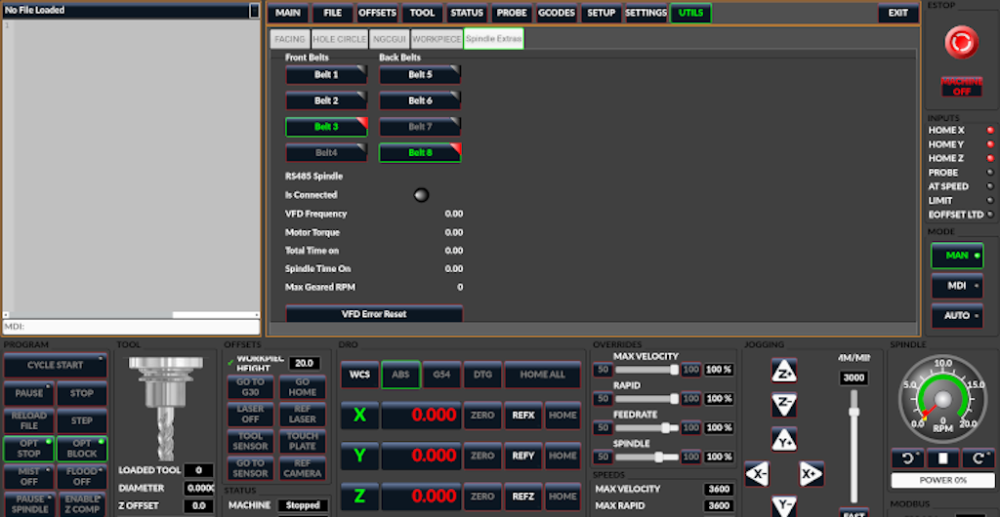
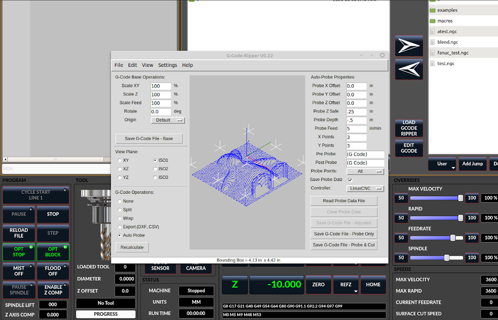
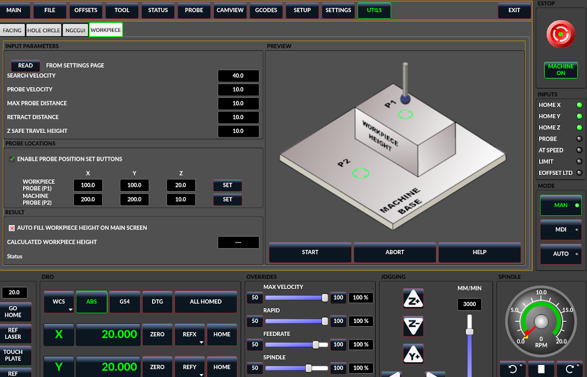
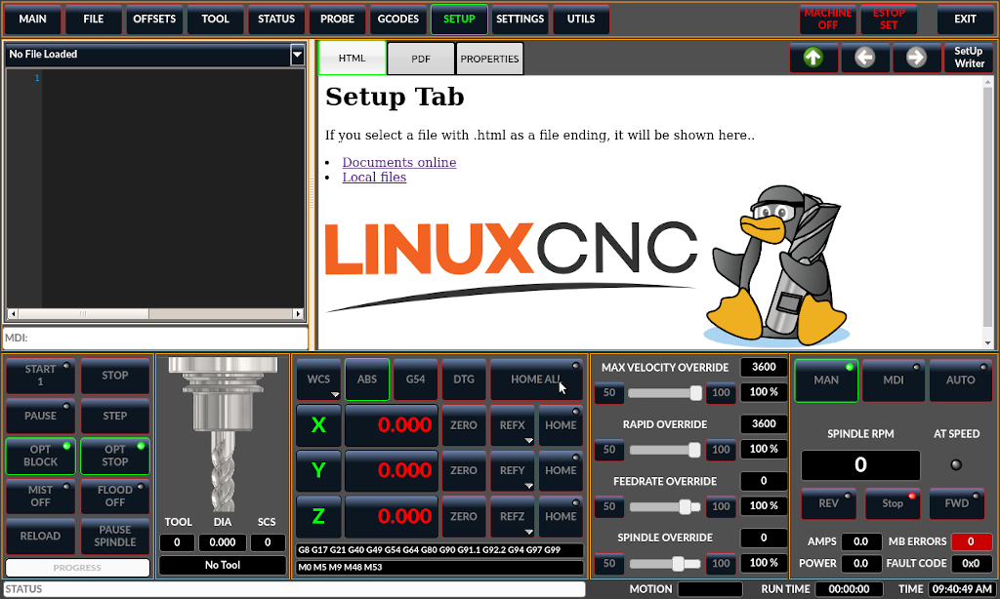

:lang: en
:toc:

[[cha:qtdragon-gui]]
= QtDragon GUI(((QtDragon)))

:ini: {basebackend@docbook:'':ini}
:hal: {basebackend@docbook:'':hal}
:ngc: {basebackend@docbook:'':ngc}

== Introduction

QtDragon and QtDragon_hd are built with the QtVCP framework.
It is the creative vision of forum personality Persei8.
Much of it is based on the excellent work of others in the LinuxCNC community.
LinuxCNC's version is adapted from Persei8's Github versions.
It is primarily meant for 3/4 axes machines such as mills or routers.
It works well with a touchscreen and/or mouse.
QtDragon supports multiple ways to touch off tools and probing work pieces.
You can use LinuxCNC's external offsets capability to automatically raise the spindle during a pause.
If you the VersaProbe option and remap code you can add auto tool length probing at tool changes.

[NOTE]
QtDragon and QtVCP are relatively new programs added into LinuxCNC.
Bugs and oddities are possible. Please test carefully when using a dangerous machine.
Please forward reports to the forum or maillist.

=== QtDragon

.QtDragon - 3 or 4 axis sample (1440x860) in silver theme
image::images/silverdragon.png["QtDragon Router",scale="25%"]

QtDragon is resizable from a resolution of 1280x768 to 1680x1200.
It will work in window mode on any monitor with higher resolution but not on monitors with lower resolution.

=== QtDragon_hd

.QtDragon_hd - 3 or 4 axis sample for larger monitors (1920x1056) in dark theme
image::images/qtdragon_hd.png["QtDragon_hd",scale="25%"]

QtDragon_hd is a similar design as QtDragon but modified to utilize the extra space of modern larger monitors.
There are some small differences in layout and utility.

QtDragon_hd has a resolution of 1920x1056 and is not resizeable.
It will work in window mode on any monitor with higher resolution but not on monitors with lower resolution.

== Getting Started - The INI File

If your configuration is not currently set up to use QtDragon, you can change it by editing the INI file sections.
For an exhaustive list of options, see the <<sub:ini:sec:display,display section>> of the INI file documentation.

[NOTE]
You can only have one of each section (e.g., [HAL]) in the INI file.
If you see in these docs multiple section options, place them all under the one appropriate section name.

=== Display

In the section `[DISPLAY]` change the `DISPLAY =` assignment to read:

* `qtdragon` for a small version
* `qtdradon_hd` for the large version.

You can add `-v`, `-d`, `-i`, or `-q` for (respectably) verbose, debug, info or quiet output to the terminal.

[source,{ini}]
----
[DISPLAY]
DISPLAY = qtvcp qtdragon
----

=== Preferences

To keep track of preferences, QtDragon looks for a preference text file.
Add the following entry under the `[DISPLAY]` heading. +
It can use `~` for home directory or `WORKINGFOLDER` or `CONFIGFOLDER` to represent QtVCP's idea of those directories: +
This example will save the file in the config folder of the launch screen.
(Other options are possible see the QtVCP's screenoption widget docs.)

[source,{ini}]
----
[DISPLAY]
PREFERENCE_FILE_PATH = WORKINGFOLDER/qtdragon.pref
----

=== Logging

You can specify where to save history/logs. +
These file names can be user selected. +
In the section `[DISPLAY]` add:

[source,{ini}]
----
[DISPLAY]
MDI_HISTORY_FILE = mdi_history.dat
MACHINE_LOG_PATH = machine_log.dat
LOG_FILE = qtdragon.log
----

=== Override controls

These set qtdragon's override controls (1.0 = 100 percent):

[source,{ini}]
----
[DISPLAY]
MAX_SPINDLE_0_OVERRIDE = 1.5
MIN_SPINDLE_0_OVERRIDE = .5
MAX_FEED_OVERRIDE       = 1.2
----

=== Spindle controls

Spindle control settings (in rpm and watts):

[source,{ini}]
----
[DISPLAY]
DEFAULT_SPINDLE_0_SPEED = 500
SPINDLE_INCREMENT = 200
MIN_SPINDLE_0_SPEED = 100
MAX_SPINDLE_0_SPEED = 2500
MAX_SPINDLE_POWER = 1500
----

=== Jogging increments

Set selectable jogging increments. +
These increments can be user changed.

[source,{ini}]
----
[DISPLAY]
INCREMENTS = Continuous, .001 mm, .01 mm, .1 mm, 1 mm, 1.0 inch, 0.1 inch, 0.01 inch
ANGULAR_INCREMENTS = 1, 5, 10, 30, 45, 90, 180, 360
----

=== Jog speed

Set jog speed controls (in units per second)

[source,{ini}]
----
[DISPLAY]
MIN_LINEAR_VELOCITY     = 0
MAX_LINEAR_VELOCITY     = 60.00
DEFAULT_LINEAR_VELOCITY = 50.0
DEFAULT_ANGULAR_VELOCITY = 10
MIN_ANGULAR_VELOCITY = 1
MAX_ANGULAR_VELOCITY = 360
----

=== User message dialog system

Optional popup custom message dialogs, controlled by HAL pins. +
MESSAGE_TYPE can be 'okdialog' or 'yesnodialog'.
See `qtvcp/library/messages` for more information. +
This example shows how to make a dialog that requires the user to select 'ok' to acknowledge and hide. +
These dialogs could be used for such things as low lube oil warnings, etc.

[source,{ini}]
----
[DISPLAY]
MESSAGE_BOLDTEXT = This is the short text
MESSAGE_TEXT = This is the longer text of the both type test. It can be longer than the status bar text
MESSAGE_DETAILS = BOTH DETAILS
MESSAGE_TYPE = okdialog
MESSAGE_PINNAME = oktest
----

=== Embed Custom VCP Panels

You can optionally embed QtVCP Virtual Control Panels into the QtDragon or QtDragon_hd screen. +
These panels can be either user built or builtin <<cha:qtvcp:panels,QtVCP Panels>>. +
See QtVCP/VCP panels for other available builtin panels.

The `EMBED_TAB_NAME` entry will used as the title for the new tab.(must be unique) +
Tab `EMBED_TAB_LOCATION` options include: `tabWidget_utilities`, `tabWidget_setup` and `stackedWidget_mainTab`. +
Tab `EMBED_TAB_COMMAND` specifies what embed-able program to run, including any of its command line options.

If using the `tabWidget_utilities` or `tabWidget_setup` locations, an extra tab will appear with the panel. +
If using `stackedWidget_mainTab`, a button labelled 'User' will appear. +
Pressing this button will cycle through displaying all available panels (specified for this location) on the main tab area.

==== Embedding Vismach Mill
.Sample adding a builtin panel to the utilities tab, i.e., a graphical animated machine using the vismach library.
[source,{ini}]
----
[DISPLAY]
EMBED_TAB_NAME = Vismach demo
EMBED_TAB_COMMAND = qtvcp vismach_mill_xyz
EMBED_TAB_LOCATION = tabWidget_utilities
----

==== Embedding Spindle Belts Panel

This example panel is designed to display additional RS485 VFD data and also to configure a 4 sheave, 2 belt spindle drive via a series of buttons.

[source,{ini}]
----
[DISPLAY]
EMBED_TAB_NAME = Spindle Belts
EMBED_TAB_COMMAND = qtvcp spindle_belts
EMBED_TAB_LOCATION = tabWidget_utilities
----

=== Subroutine Paths

If using NGCGUI, remap or custom M codes routines, LinuxCNC needs to know where to look for the files. +
This sample is typical of what is needed for NgcGui, Basic Probe. and Versa Probe remap code. +
These paths will need to be adjusted to point to the actual files on your system.
<<sub:ini:sec:rs274ngc,RS274NZGC Section Details>>

[source,{ini}]
----
[RS274NGC]
SUBROUTINE_PATH = :~/linuxcnc/nc_files/examples/ngcgui_lib:~/linuxcnc/nc_files/examples/ngcgui_lib/utilitysubs; \
~/linuxcnc/nc_files/examples/probe/basic_probe/macros:~/linuxcnc/nc_files/examples/remap-subroutines: \
~/linuxcnc/nc_files/examples/ngcgui_lib/remap_lib
----

QtVCP's NGCGUI program also need to know where to open for subroutine selection and pre-selection. +
NGCGUI_SUBFILE_PATH must point to an actual path on your system and also a path described in SUBROUTINE_PATHS.

[source,{ini}]
----
[DISPLAY]
# NGCGUI subroutine path.
# Thr path must also  be in [RS274NGC] SUBROUTINE_PATH
NGCGUI_SUBFILE_PATH = ~/linuxcnc/nc_files/examples/ngcgui_lib
# pre selected programs tabs
# specify filenames only, files must be in the NGCGUI_SUBFILE_PATH
NGCGUI_SUBFILE = slot.ngc
NGCGUI_SUBFILE = qpocket.ngc
----

=== Preview Control

Magic comments can be used to control the G-code preview.

On very large programs the preview can take a long time to load.
You can control what is shown and what is hidden the the graphics screen by adding the appropriate comments from this list into your G-code:

----
(PREVIEW,stop)
(PREVIEW,hide)
(PREVIEW,show)
----

=== Program Extensions/Filters

You can control what programs are displayed in the filemanager window with program extensions. +
Create a line with the '.' endings you wish to use separated by commas, then a space and the description. +
You can add multiple lines for different selections in the combo box.

[source,{ini}]
----
[FILTER]
PROGRAM_EXTENSION = .ngc,.nc,.tap G-Code file (*.ngc,*.nc,*.tap)
----

QtDragon has the ability to send loaded files through a 'filter program'.
This filter can do any desired task: Something as simple as making sure the file ends with 'M2', or something as complicated as generating G-code from an image.
See <<cha:filter,Filter Programs>> for more information.

The '[FILTER]'  section of the INI file controls how filters work.
First, for each type of file, write a 'PROGRAM_EXTENSION' line.
Then, specify the program to execute for each type of file.
This program is given the name of the input file as its first argument, and must write rs274ngc code to standard output.
This output is what will be displayed in the text area, previewed in the display area, and executed by LinuxCNC when 'Run'.

The following lines add support for the `image-to-gcode` converter included with LinuxCNC and running Python based filter programs:

[source,{ini}]
----
[FILTER]
PROGRAM_EXTENSION = .png,.gif,.jpg Greyscale Depth Image
PROGRAM_EXTENSION = .py Python Script
png = image-to-gcode
gif = image-to-gcode
jpg = image-to-gcode
py = python
----

=== Probe/Touchplate/Laser Settings

QtDragon has INI entries for two optional probing tab screens available.
Comment/uncomment which ever you prefer.

* 'Versa probe' is a QtVCP ported version of a popular GladeVCP probing panel.
* 'Basic Probe' is a QtVCP ported version based on the third party basic probe screen.

Both perform similar probing routines, though Versa probe optionally handles auto tool measurement.

[source,{ini}]
----
[PROBE]
#USE_PROBE = versaprobe
USE_PROBE = basicprobe
----

=== Abort detection
When using qtdragon's probing routines, it is important to detect a user abort request. +
By default, LinuxCNC does not report an abort in a useful way for the probe routines. +
You need to add a ngc file to print out an error that can be detected.
<<sub:remap:sec:error-handling, Remap Abort Details>>

[source,{ini}]
----
[RS274NGC]
# on abort, this ngc file is called. required for basic/versa probe routines. +
ON_ABORT_COMMAND=O <on_abort> call
----

This example code will send a message on abort. The probe routines can detect this sample. +
According to the setting above, it would need to be saved as 'on_abort.ngc' within LinuxCNC's [RS274NGC] SUBROUTINE_PATHS and [DISPLAY] PROGRAM_PREFIX search paths.

[source,{ngc}]
----
o<on_abort> sub

o100 if [#1 eq 5]
    (machine on)
o100 elseif [#1 eq 6]
    (machine off)
o100 elseif [#1 eq 7]
    (estopped)
o100 elseif [#1 eq 8]
    (msg,Process Aborted)
o100 else
    (DEBUG,Abort Parameter is %d[#1])
o100 endif

o<on_abort> endsub
m2
----

=== Startup codes

You should set default M/G code for start up. These will be overridden by running a NGC file. +
These are only sample codes, integrator should choose appropriate codes.

[source,{ini}]
----
[RS274NGC]
# start up G/M codes when first loaded
RS274NGC_STARTUP_CODE = G17 G20 G40 G43H0 G54 G64P0.0005 G80 G90 G94 G97 M5 M9
----

=== Macro Buttons

QtDragon has up to ten convenience buttons for calling 'macro actions'. +
These could also call OWord routines if desired. +
In the sample configurations they are labelled for moving between
current user system origin (zero point) and Machine system origin. +
User origin is the first MDI command in the INI list, machine origin is the second. +
This example shows how to move Z axis up first. The commands are separated by the ';'.

The label is set after the comma. The symbols '\n' adds a line break.

[source,{ini}]
----
[MDI_COMMAND_LIST]
# for macro buttons
MDI_COMMAND = G0 Z25;X0 Y0;Z0, Goto\nUser\nZero
MDI_COMMAND = G53 G0 Z0;G53 G0 X0 Y0,Goto\nMachn\nZero
----

=== Post GUI HAL File

These optional HAL files will be called after QtDragon has loaded everything else. +
You can add multiple line for multiple file. Each one will be called in the order they appear. +
Calling HAL files after QtDragon is already loaded assures that QtDragon's HAL pins are available.

.Sample with typical entries for the specificion of HAL files to be read after the QtDragon was started. Adjust these lines to match actual requirements.
[source,{ini}]
----
[HAL]
POSTGUI_HALFILE = qtdragon_hd_postgui.hal
POSTGUI_HALFILE = qtdragon_hd_debugging.hal
----

=== Post GUI HAL Command

These optional HAL commands will be run after QtDragon has loaded everything else. +
You can add multiple line. Each one will be called in the order they appear. +
Any HAL command can be used.

.Sample with typical files in INI file to load modules after the GUI is available. Adjusti these to match your actual requirements.
[source,{ini}]
----
[HAL]
POSTGUI_HALCMD = loadusr qtvcp test_probe
POSTGUI_HALCMD = loadusr qtvcp test_led
POSTGUI_HALCMD = loadusr halmeter
----

=== Builtin Sample Configurations

The sample configurations `sim/qtdragon/` or `sim/qtdragon_hd` are already configured to use QtDragon as the screen.
There are several examples that demonstrate various machine configurations.

== Key Bindings

QtDragon is not intended to primarily use a keyboard for machine control. +
It lacks many keyboard short cuts that for instance AXIS has - but you can use a mouse or touchscreen. +
There are several key presses that will control the machine for convenience.

----
F1 - Estop on/off
F2 - Machine on/off
F12 - Style Editor
Home - Home All Joint of the Machine
Escape - Abort Movement
Pause - Pause Machine Movement
----

== Buttons

Buttons that are checkable will change their text colour when checked.
This is controlled by the stylesheet/theme

== Virtual Keyboard

QtDragon includes a virtual keyboard for use with touchscreens.
To enable the keyboard, check the Use Virtual Keyboard checkbox in the Settings page.
Clicking on any input field, such as probe parameters or tool table entries, will show the keyboard.
To hide the keyboard, do one of the following:

- click the MAIN page button
- The currently selected page button.
- go into AUTO mode

It should be noted that keyboard jogging is disabled when using the virtual keyboard.

== HAL Pins

These pins are specific to the QtDragon screen. +
There are of course are many more HAL pins that must be connected for LinuxCNC to function.

If you need a manual tool change prompt, add these lines in your postgui file. +
QtDragon emulates the hal_manualtoolchange HAL pins - don't load the separate HAL component 'hal_manualtoolchange'.

[source,{hal}]
----
net tool-change      hal_manualtoolchange.change   <=  iocontrol.0.tool-change
net tool-changed     hal_manualtoolchange.changed  <=  iocontrol.0.tool-changed
net tool-prep-number hal_manualtoolchange.number   <=  iocontrol.0.tool-prep-number
----

Also if you don't have an automatic tool changer make sure these pins are connected in one of the HAL files:

[source,{hal}]
----
net tool-prepare-loopback iocontrol.0.tool-prepare => iocontrol.0.tool-prepared
----

This input pin should be connected to indicate probe state.

[source,{hal}]
----
qtdragon.led-probe
----

These pins are inputs related to spindle VFD indicating. +
The volt and amp pins are used to calculate spindle power.
You must also set the MAX_SPINDLE_POWER in the INI.

[source,{hal}]
----
qtdragon.spindle-modbus-connection
qtdragon.spindle-modbus-errors
qtdragon.spindle-amps
qtdragon.spindle-fault
qtdragon.spindle-volts
----

This bit pin is an output to the spindle control to pause it. +
You would connect it to `spindle.0.inhibit`.

[source,{hal}]
----
qtdragon.spindle-inhibit
----

QtDragon spindle speed display and spindle-at-speed LED require that
 `spindle.0.speed-in` be connected to spindle speed feedback. +
Encoder or VFD feedback could be used, as long as the feedback is in revolutions per second (RPS). +
If no feedback is available you can have the display show the requested speed by connecting pins like so:

[source,{hal}]
----
net spindle-speed-feedback spindle.0.speed-out-rps => spindle.0.speed-in 
----

This bit output pin can be connected to turn on a laser:

[source,{hal}]
----
qtdragon.btn-laser-on
----

This float output pin indicates the camera rotation in degrees:

[source,{hal}]
----
qtdragon.cam-rotation
----

These bit/s32/float pins are related to external offsets if they are used:

[source,{hal}]
----
qtdragon.eoffset-clear
qtdragon.eoffset-enable
qtdragon.eoffset-value
qtdragon.eoffset-spindle-count
qtdragon.eoffset-zlevel-count
----

These float output pins reflect the current slider jograte (in machine units):

[source,{hal}]
----
qtdragon.slider-jogspeed-linear
qtdragon.slider-jogspeed-angular
----

These float output pins reflect the current slider override rates:

[source,{hal}]
----
qtdragon.slider-override-feed
qtdragon.slider-override-maxv
qtdragon.slider-override-rapid
qtdragon.slider-override-spindle
----

These output pins are available when setting the Versa Probe INI option.
They can be used for auto-tool-length-probe at tool change - with added remap code.

[source,{hal}]
----
qtversaprobe.enable
qtversaprobe.blockheight
qtversaprobe.probeheight
qtversaprobe.probevel
qtversaprobe.searchvel
qtversaprobe.backoffdist
----

== HAL files

The HAL files supplied are for simulation only.
A real machine needs its own custom HAL files.
The QtDragon screen works with 3 or 4 axes with one joint per axis or 3 or 4 axes in a gantry configuration (2 joints on 1 axis).

== Manual Tool Changes

If your machine requires manual tool changes, QtDragon can pop a message box to direct you.
QtDragon emulates the hal_manualtoolchange HAL pins - don't load the separate HAL component 'hal_manualtoolchange'.
Hereto you must connect the proper HAL pin in the postgui HAL file, for example:

[source,{hal}]
----
net tool-change      hal_manualtoolchange.change   <=  iocontrol.0.tool-change
net tool-changed     hal_manualtoolchange.changed  <=  iocontrol.0.tool-changed
net tool-prep-number hal_manualtoolchange.number   <=  iocontrol.0.tool-prep-number
----

== Spindle

The screen is intended to interface to a VFD, but will still work without it. +
There are a number of VFD drivers included in the LinuxCNC distribution. +
It is up to the end user to supply the appropriate driver and HAL file connections according to his own machine setup.

== Auto Raise Z Axis on Spindle Pause

QtDragon can be set up to automatically raise and lower the Z axis when the spindle is paused. +
When a program is paused, then you press the 'Spindle Pause' button to stop the spindle and raise it in Z. +
Press the button again to start spindle and lower it, then unpause the program. +
If you have the HAL pin `spindle.0.at-speed` connected to a driving pin, the spindle will not lower until the pin is true +
You typically connect this to a timer or logic that detects the speed of the spindle. +
If that pin is not connected to a driving pin, a dialog will pop up to warn you to wait for the spindle response. +
The spindle will lower when you close that dialog. +
The amount to raise is set in the 'Settings' tab under the heading 'SPINDLE RAISE'. +
This line edit box can only be directly set when not in Auto mode. +
The up/down buttons can be used to adjust the raise amount at any time, including when the spindle is already raised. +
The button increments are 1 inch or 5 mm (depending on the units the machine is based on) +
This optional behaviour requires additions to the INI and the qtdragon_post_gui HAL file.

In the INI, under the AXIS_Z heading.

[source,{ini}]
----
[AXIS_Z]
OFFSET_AV_RATIO  = 0.2
----

In the qtdragon_postgui.hal file add:

[source,{hal}]
----
# Set up Z axis external offsets
net eoffset_clear    qtdragon.eoffset-clear => axis.z.eoffset-clear
net eoffset_count    qtdragon.eoffset-spindle-count => axis.z.eoffset-counts
net eoffset          qtdragon.eoffset-value <= axis.z.eoffset

# uncomment for dragon_hd
#net limited          qtdragon.led-limits-tripped <= motion.eoffset-limited

setp axis.z.eoffset-enable 1
setp axis.z.eoffset-scale 1.0
----

== Z level compensation

QtDragon_hd can be set up to probe and compensate for Z level height changes by utilizing the external program 'G-code Ripper'.

[NOTE]
This is only available in the QtDragon_hd version.

Z level compensation is a bed levelling/distortion correction function typically used in 3D printing or engraving.
It uses a HAL non-realtime component which utilizes the external offsets feature of LinuxCNC.
The component has a HAL pin that specifies an interpolation type, which must be one of cubic, linear or nearest (0, 1, 2 respectively).
If none is specified or if an invalid number is specified, the default is assumed to be cubic.

When Z LEVEL COMP is enabled, the compensation component reads a probe data file, which must be called 'probe_points.txt'.
The file can be modified or updated at any time while compensation is disabled.
When next enabled, the file will be reread and the compensation map is recalculated.
This file is expected to be in the configuration directory.

The probe data file is generated by a probing program, which itself is generated by an external python program called `gcode_ripper`,
which can be launched from the file manager tab using the 'G-code Ripper' button.

=== Using G-code Ripper for Z level Compensation

.QtDragon_hd showing G-code Ripper

[NOTE]
G-code Ripper offers many functions that we will not go in to here.
This is only available in the QtDragon_hd version.

* In qtdragon_hd, switch to the file tab and press the load G-code Ripper button.
* Set origin to match the origin of the G-code file to be probed.
* Under G-Code Operations, check Auto Probe.
* File -> Open G-Code File (The file you will run after compensation)
* If necessary, make adjustments and press Recalculate.
* Press Save G-Code File - Probe Only.
* Save the generated file to the nc_files folder.
* Exit gcode_ripper.
* There should now be a file in the nc_files folder called {something}-probe-only.ngc. Set the file filter to G-Code files, navigate to the nc_files directory and load this file.
* Without changing the offsets, run this program. Make sure the probe tool is installed. When complete, there will be a file in the config directory called 'probe_points.txt'.
* In qtdragon_hd, press the 'Enable Z Comp' button to enable compensation.
  Look at the status line for indication of success or failure.
  Active compensation will be displayed beside the label: 'Z Level Comp'
  While jogging that display should change based on the compensation component.

[NOTE]
If you use auto raise Z to lift the spindle on pause, you must combine the two with a HAL component and feed that to LinuxCNC's motion component.

.Sample postgui HAL file for combined spindle raise and Z Level compensation
[source,{hal}]
----
# load components
########################################################################

loadrt logic names=logic-and personality=0x102
addf logic-and servo-thread

# load a summing component for adding spindle lift and Z compensation
loadrt scaled_s32_sums
addf scaled-s32-sums.0 servo-thread

loadusr -Wn z_level_compensation z_level_compensation
# method parameter must be one of nearest(2), linear(1), cubic (0)
setp z_level_compensation.fade-height 0.0
setp z_level_compensation.method 1

# connect signals to LinuxCNC's motion component
########################################################################

net eoffset-clear    axis.z.eoffset-clear
net eoffset-counts   axis.z.eoffset-counts
setp axis.z.eoffset-scale .001
net eoffset-total          axis.z.eoffset
setp axis.z.eoffset-enable True

# external offsets for spindle pause function
########################################################################
net eoffset-clear              qtdragon.eoffset-clear
net eoffset-spindle-count   <= qtdragon.eoffset-spindle-count
net spindle-pause              qtdragon.spindle-inhibit     spindle.0.inhibit

## Z level compensation
####################################################
net eoffset-clr2            z_level_compensation.clear      => logic-and.in-01
net xpos-cmd                z_level_compensation.x-pos      <= axis.x.pos-cmd
net ypos-cmd                z_level_compensation.y-pos      <= axis.y.pos-cmd
net zpos-cmd                z_level_compensation.z-pos      <= axis.z.pos-cmd
net z_compensation_on       z_level_compensation.enable-in  <= qtdragon.comp-on
net eoffset-zlevel-count    z_level_compensation.counts     => qtdragon.eoffset-zlevel-count

# add Z level and scaled spindle raise level values together
net eoffset-spindle-count   scaled-s32-sums.0.in0
net eoffset-zlevel-count    scaled-s32-sums.0.in1
setp scaled-s32-sums.0.scale0 1000
net eoffset-counts          scaled-s32-sums.0.out-s

----

== Probing

The probe screen has been through basic testing but there could still be some minor bugs.
When running probing routines, use extreme caution until you are familiar with how everything works.
Probe routines run without blocking the main GUI.
This gives the operator the opportunity to watch the DROs and stop the routine at any time.

[NOTE]
Probing is very unforgiving to mistakes; be sure to check settings before using.

QtDragon has 2 methods for setting Z0.
The first is a touchplate, where a metal plate of known thickness is placed on top of the workpiece,
then the tool is lowered until it touches the plate, triggering the probe signal.
The current user system's (G5x) Z0 is set to probe height - the entered plate thickness.

The second method uses a tool setter in a fixed position and a known height above the table where the probe signal will be triggered.
In order to set Z0 to the top of the workpiece, it has to know

 . how far above the table the probe trigger point is (tool setter height) and
 . how far above the table the top of the workpiece is.

This operation has to be done every time the tool is changed as the tool length is not saved.

For touching off with a touch probe, whether you use the touchplate operation with thickness set to 0 or use a probing routine,
the height from table to top of workpiece parameter is not taken into account and can be ignored.
It is only for the tool setter.

=== Versa Probe

.QtDragon - Versa Probe Option
image::images/qtvcp_versaProbe.png["QtDragon Probe",scale="25%"]

Versa probe is used to semi-automatically probe work pieces to find edges, centers and angles. +
It can also be sued to auto probe tool length at tool changes with added remap code.

You must carefully set the 'Probing Parameters':

* 'DIAMETER':: This is the diameter of the probe tip. The accuracy of probe measurements is directly affected by the accuracy of the probe tip diameter.
* 'TRAVEL':: The distance that the probe will travel during the initial search. If the search distance is too short, you will receive a message like "G38 finished without making contact". For safety reasons, it is recommended to set this parameter to 3-4 mm more than probe stylus diameter.
* 'LATCH RTN':: The distance the probe is retracted after making initial contact with the workpiece. This should be a short distance because the second approach will be at a slow speed, but large enough for the probe to break contact and bring it to the search ready state. If the Latch Rtn distance too large, you will end up spending a lot of time waiting for the search to complete. Recommendation: 1-2 mm
* 'SEARCH':: This is the feed rate at which the probe searches for the target workpiece in machine units per minute. The search speed should be slow enough to give an acceptable initial accuracy, but fast enough to not waste time waiting for movement. Recommendation: 200-500 mm/min.
* 'PROBE':: Once initial contact has been made and the probe is retracted, it will wait for 0.5 seconds before performing the search again at a lower speed, the probe velocity. This lower speed ensures the machine can stop movement as quickly as possible on contact with the workpiece.
* 'RAPID':: Axis movements not associated with searching are done at the speed defined by RAPID in machine units per minute.
* 'SIDE/EDGE LENGTH':: This is the distance the probe will move at the rapid rate to the position where it will begin a search. If measuring a corner, it will move EDGE LENGTH units away from the corner, then move away from the workpiece by XY CLEARANCE, lower by Z CLEARANCE and begin the initial search. If measuring an inner circle, then EDGE LENGTH should be set to the approximate radius of the circle. Note: NOT the diameter.
* 'PROBE HT':: The height of the tool sensor from the machine table surface. This value is used to calculate the Z zero height for the current work coordinate system when using the probe with a tool setter sensor.
* 'BLOCK HT':: The height of the top of the workpiece from the machine table surface. This value is used to calculate the Z zero height for the current work coordinate system when using the probe with a tool setter sensor.
* 'XY CLEARANCE':: The distance that the probe will move away from an edge or corner before performing a search. It should be large enough to ensure that the probe will not contact the workpiece or any other fixtures before moving down. It should be small enough to avoid excessive waiting for movement while searching.
* 'Z CLEARANCE':: The distance that the probe will move down before performing a search. If measuring an inside hole, the probe could be manually jogged to the starting Z height and then set Z CLEARANCE to 0.

There are three toggle buttons:

* 'Auto Zero' This selects if after probing the relevant axis is set to zero in the current user system.
* 'Auto Skew' This selects if after probing, the system will be rotated or just display the calculated rotation.
* 'Tool Measure' This (if integrated) turns auto tool probing on and off.

=== Basic probe

.QtDragon - Basic Probe Option
image::images/qtvcp_basicProbe.png["QtDragon Probe",scale="25%"]

Basic probe is used to semi-automatically probe work pieces to find edges, centers and angles.
The combo box allows selecting the basic type of probing buttons shown:

* Outside Corners
* Inside Corners
* Edge Angles
* Boss and Pockets
* Ridge and Valleys
* Calibration

You must carefully set the 'Probing Parameters':

* 'Probe Tool': will only allow probing if this tool number is in the spindle
* 'Probe Diameter': the size of the probe tip
* 'Probe Rapid': the speed of rapid moves in machine units
* 'Probe Search': the speed of the first 'rough' search in machine units
* 'Probe Feed': the speed of the second 'fine' search in machine units
* 'Step Off': back off and re-probe distance
* 'Max XY Distance': the maximum distance the probe will search for in X and Y before failing with error
* 'Max Z Distance':  the maximum distance the probe will search for in Z before failing with error
* 'XY Clearance': clearance distance from probe to wall edge before rapid traversing down in Z and 'rough' probing
* 'Z Clearance': clearance distance from probed to top of material
* 'Extra Depth': distance from top of material to desired probe depth

There are also hint parameters depending on selected probing type:

* 'Edge Width': desired distance from the probe start position, along wall edge before starting to probe
* 'Diameter Hint': used by Round Boss or Round Pocket probing (start move: 1/2 diameter plus XY clearance)
* 'X Hint': used by Rectangular Boss/Pocket probing (start move: 1/2 X length plus XY clearance)
* 'Y Hint': used by Rectangular Boss/Pocket probing (start move: 1/2 Y length plus XY clearance)

After setting the parameters and hints:

* Manually move the probe to the approximate position represented by the green target on the button.
* Confirm the parameters are reasonable.
* Press the desired probing button.

The probing routine will start immediately.
[NOTE]
Pressing the stop button or the keyboard escape key, will abort the probing.

==== Corner Probe Example

Lets discuss inside corner probing using the top right button in Basic Probe (back_right_inside).
While all probe entries must be correct, the most important settings to change for each each probe:

* XY CLEARANCE - distance away from edge before rough probing,
* Z CLEARANCE  - distance from probe to top of material,
* EXTRA DEPTH  - distance to lower probe from top of material,
* EDGE WIDTH   - distance along edge wall (away from corner) to start probing.

[NOTE]
These distance are always to be set in 'machine units' (mm for metric machine, inch for imperial machine).

Preset:

* manual set probe at the intersection of the edges (ie corner) of material as described by the green bullseye on the button. Set it Z CLEARANCE above the top of material. These can be done by eye.
* set EXTRA CLEARANCE to a value that you want the probe to go below the _top_ of material.
  (So the probe will move from its start position down  Z Clearance + Extra Clearance distance.)
* set XY CLEARANCE to a value that definitely gives clearance from the wall so when the probe goes down it does not hit anything.
* set EDGE WIDTH to a value that describes the distance measured from the corner, along the wall to where you wish to probe. this edge distance will be used along the X wall and then the Y wall.

Sequence after pressing the probe button: +

. Rapid EDGE WIDTH distance away from corner at the same time moving XY CLEARANCE away from edge. So this is a slightly diagonal move.
. Move probe down by Z CLEARANCE + EXTRA DEPTH,
. probe wall twice (rough and fine),
. move diagonally to the other wall as set by EDGE WIDTH and XY CLEARANCE,
. probe wall twice,
. raise probe up by Z CLEARANCE + EXTRA DEPTH (returns to starting height),
. rapid back to starting corner (now calculated using the probed walls),
. if auto zero button is enabled, set X and Y of the current user system to zero.

== Touch plate

.QtDragon - Touch Plate
image::images/qtdragon_touchplate.png["QtDragon Touch Plate",scale="25%"]

You can use a conductive touch plate or equivalent to auto touch off (zero the user coordinate) for the Z position of a tool.
There must be a tool loaded prior to probing.
In the tool tab or settings tab, set the touch plate height, search and probe velocity and max. probing distance.

[NOTE]
When using a conductive plate the search and probe velocity should be the same and slow.
If using a tool setter that has spring loaded travel then you can set search velocity faster.
LinuxCNC ramps speed down at the maximum acceleration rate, so there can be travel after the probe trip if the speed is set to high.

Place the plate on top of the surface you wish to zero Z on.
Connect the probe input wire to the tool (if using a conductive plate).
There is a LED to confirm the probe connection is reliable prior to probing.
Move the tool manually within the max probe distance.
Press the 'Touch Plate' button.
The machine will probe down twice and the current user offset (G5X) will be zeroed at the bottom of the plate by calculation from the touchplate height setting.

== Auto Tool Measurement

QtDragon can be setup to do integrated auto tool measurement using the Versa Probe widget and remap code.
To use this feature, you will need to do some additional settings and you may want to use the offered HAL pin to get values in your own ngc remap procedure.

[IMPORTANT]
Before starting the first test, do not forget to enter the probe height and probe velocities on the versa probe settings page.

Tool Measurement in QtDragon is done with the following steps:

* Touch off your workpiece in X and Y.
* Measure the height of your block from the base, where your tool switch is located, to the upper face of the block (including chuck etc.).
* In the Versa probe tab, enter the measured value for block height.
* Make sure the use tool measurement button in the Vesa probe tab is enabled.
* Go to auto mode and start your program.

[NOTE]
When fist setting up auto tool measurement, please use caution until you confirm tool change and probe locations - it is easy to break a tool/probe.
Abort will be honoured while the probe is in motion.

.Auto tool measurement
image::images/sketch_auto_tool_measurement.png[align="left"]

With the first given tool change the tool will be measured and the offset will be set automatically to fit the block height.
The advantage of this way is, that you do not need a reference tool.

[NOTE]
Your program must contain a tool change at the beginning.
The tool will be measured, even it has been used before, so there is no danger if the block height has changed.
There are several videos on you tube that demonstrate the technique using GMOCCAPY.
The GMOCCAPY screen pioneered the technique.

The sequence of events (using the default files):

* Rapid move in Z to position defined in the INI's [TOOL_CHANGE] Z
* Rapid move in X and Y to number defined in INI's [TOOL_CHANGE] X and Y
* Request tool change
* Rapid move in X and Y to position defined in the INI's [VERSA_TOOLSETTER] X and Y
* Rapid move down in Z to position defined in the INI's [VERSA_TOOLSETTER] Z
* Probe down in Z to maximum defined in the INI's [VERSA_TOOLSETTER] MAXPROBE
* Return Z to position defined in the INI's [TOOL_CHANGE] Z

[NOTE]
The [TOOL_CHANGE] Z position should be high enough so the tool will not hit the tool probe
when moving to the [VERSA_TOOLSETTER] X and Y position.
MAXPROBE distance needs to be high enough for the tool to touch the probe.

=== Work Piece Height Probing

.QtDragon_hd - Work piece Height probing

This program probes 2 user specified locations in the Z axis and calculates the difference in heights.

[NOTE]
This is only available in the QtDragon_hd version.

.Enable Probe Position Set Buttons
* When checked, the SET buttons are enabled.
* This allows the user to automatically fill in the X, Y and Z parameters with the current position as displayed on the DROs.

.Autofill Workpiece Height on Main Screen
* When checked, the calculated height is automatically transferred to the Workpiece Height field in the main screen.
* Otherwise, the main screen is not affected.

.Workpiece Probe At
* the X, Y and Z coordinates specify where the first probing routine should start, in current WCS

.Machine Probe At
* the X, Y and Z coordinates specify where the second probing routine should start, in current WCS

.Z Safe Travel Height
* The machine is raised to the Z safe travel height before jogging to the X and Y coordinates.
* The spindle then lowers to the specified Z coordinate.
* It should be selected so that the tool clears all obstructions while jogging.

.START button
* The machine will jog to the first location and then probe down.
* The machine then jogs to the second location and probes down again.
* The difference in probed values is reported as Calculated Workpiece Height.
* The parameters for search velocity, probe velocity, maximum probe distance and return distance are read from the main GUI Settings page.

.ABORT button
* causes all jog and probe routines currently executing to stop.

.HELP button
* displays this help file.

[NOTE]
* Any 2 points within the machine operating volume can be specified.
* If the first point is higher than the second, the calculated height will be a positive number.
* If the first point is lower than the second, the calculated height will be a negative number.
* Units are irrelevant in this program. The probed values are not saved and only the difference is reported.

[CAUTION]
Setting incorrect values can lead to crashes into fixtures on the machine work surface.
Initial testing with no tool and safe heights is recommended.

=== Tool Measurement Pins

Versaprobe offers 5 output pins for tool measurement purpose.
The pins are used to be read from a remap G-code subroutine, so the code can react to different values.

* `qtversaprobe.enable` (HAL_BIT) measurement enabled or not tool. Reflects screen button state.
* `qtversaprobe.blockheight` (HAL_FLOAT) the measured height of the top face of the workpiece. Reflects screen entry.
* `qtversaprobe.probeheight` (HAL_FLOAT) the toolsetter probe switch height. Reflects screen entry.
* `qtversaprobe.searchvel` (HAL_FLOAT) the velocity to search for the tool probe switch
* `qtversaprobe.probevel` (HAL_FLOAT) the velocity to probe tool length. Reflects screen entry.
* 'qtversaprobe.backoffdist' (HAL_FLOAT) the distance the probe backs off after triggering. Reflects screen entry.

=== Tool Measurement INI File Modifications

Modify your INI file to include the following:

==== The PROBE section

QtDragon allows you to select one of two styles of touch probe routines.
Versa probe works with a M6 remap to add auto tool probing.

[source,{ini}]
----
[PROBE]
#USE_PROBE = versaprobe
USE_PROBE = basicprobe
----

==== The RS274NGC section
<<sub:ini:sec:rs274ngc, RS274NGC Section Details>> +
<<sub:remap:sec:remap-statement, Remap Statement Details>> +
<<sub:remap:sec:error-handling, Remap Abort Details>>

[NOTE]
These default entries should work fine in most situations. Some systems may need to use 'linuxcnc/nc_files/examples/'
instead of 'linuxcnc/nc_files/'. please check that paths are valid. Custom entries pointing to modified file are possible.

[source,{ini}]
----
[RS274NGC]

# Adjust this paths to point to folders with stdglue.py, qt_auto_tool_probe.ngc and on_abort.ngc
# or similarly coded custom remap files.
SUBROUTINE_PATH = ~/linuxcnc/nc_files/remap-subroutines:\
~/linuxcnc/nc_files/remap_lib

# is the sub, with is called when a error during tool change happens.
ON_ABORT_COMMAND=O <on_abort> call

# The remap code for QtVCP's versaprobe's automatic tool probe of Z
REMAP=M6  modalgroup=6 prolog=change_prolog ngc=qt_auto_probe_tool epilog=change_epilog
----

==== The Tool Sensor Section

The position of the tool sensor and the start position of the probing movement. +
All values are absolute (G53) coordinates, except MAXPROBE, which is expressed in relative movement. +
All values are in machine native units. +
X,Y,Z set the tool setter probe location. +
auto probe action sequence (this could be changed with a modified ngc remap file): +

* go to TOOLCHANGE Z position
* go to TOOLCHANGE XY position.
* wait for manual tool change acknowledgement
* go to VERSA_TOOLSETTER XY position
* go to VERSA_TOOLSETTER Z position
* fast probe
* slow probe
* go to TOOLCHANGE Z position

Z_MAX_CLEAR is the Z position to go to before moving to the tool setter when using the 'Travel to Toolsetter button'. +
'Travel to Toolsetter' Action sequence: +

* go to VERSA_TOOLSETTER Z_MAX_CLEAR Z position
* go to VERSA_TOOLSETTER XY position
* go to VERSA_TOOLSETTER Z position.

[source,{ini}]
----
[VERSA_TOOLSETTER]
X = 10
Y = 10
Z = -20
Z_MAX_CLEAR = -2
MAXPROBE =  -20
----

==== The Change Position Section

This is not named TOOL_CHANGE_POSITION  on purpose - *canon uses that name and will interfere otherwise*.
The position to move the machine before giving the change tool command.
All values are in absolute coordinates.
All values are in machine native units.

[source,{ini}]
----
[CHANGE_POSITION]
X = 10
Y = 10
Z = -2
----

==== The Python Section

The Python section sets up what files LinuxCNC's Python interpreter looks for, e.g., `toplevel.py` file in the `python` folder in the configuration directory:
These default entries should work fine in most situations. Some systems may need to use 'linuxcnc/nc_files/examples/' instead of 'linuxcnc/nc_files/'.
Custom entries pointing to modified file are possible.

[source,{ini}]
----
# The path start point for all remap searches, i.e. Python's sys.path.append()
PATH_APPEND = ~/linuxcnc/nc_files/remap_lib/python-stdglue/python
# path to the tremap's 'toplevel file
TOPLEVEL = ~/linuxcnc/nc_files/remap_lib/python-stdglue/python/toplevel.py
----

=== Required HAL Connections

Make sure to connect the tool probe input in your HAL file:
If connected properly, you should be able to toggle the probe LED in QtDragon if you press the probe stylus.

[source,{hal}]
----
net probe  motion.probe-input <= <your_input_pin>
----

== Run from Line

A G-code program can be started at any line by clicking on the desired line in the G-code display while in AUTO mode.
It is the operator's responsibility to ensure the machine is in the desired operational mode.
A dialog will be shown allowing the spindle direction and speed to be preset.
The start line is indicated in the box labelled LINE, next to the CYCLE START button.
The run from line feature can be disabled in the settings page.

[NOTE]
LinuxCNC's run-from-line is not very user friendly.
E.g., it does not start the spindle or confirm the proper tool.
Also, it does not handle subroutines well. If used it is best to start on a rapid move.

== Laser buttons

The LASER ON/OFF button in intended to turn an output on or off which is connected to a small laser crosshair projector.
When the crosshair is positioned over a desired reference point on the workpiece, the REF LASER button can be pushed,
which then sets the X and Y offsets to the values indicated by the LASER OFFSET fields in the Settings page.

== Tabs Description

Tabs allow the user to select the most appropriate info/control on the top three panels.
If the on screen keyboard is showing and the user wishes to hide it but keep the current tab, they can do that by pressing the current show tab.
In QtDragon, there is a splitter handle between the G-code text display and the G-code graphical display.
One can use this to split the size between the two areas. This can be set differently in each tab and in each mode.

=== Main tab

This tab displays the graphical representation of the current program.
The side buttons will control the display.

* 'User View': Select/restore a user set view of the current program.
* 'P','X','Y','Z': Set standard views.
* 'D': Toggle display of dimensions.
* '+', '-': Zoom controls.
* 'C': Clear graphics of tool movement lines.

In `qtdragon_hd` there are also macro buttons available on the right side.
Up to tens buttons can be defined in the INI.

=== File Tab

You can use this tab to load or transfer programs.
Editing of G-code programs can be selected from this tab.
With `qtdragon_hd`, this is where you can load the 'G-code Ripper'.

=== Offsets Tab

You can monitor/modify system offsets from this tab.
There are convenience buttons for zeroing the rotation.G92 and current G5x user offset.

=== Tool Tab

You can monitor/modify tool offsets from this tab.
Adding and deleting tools from the tool file can also be done from this tab.
When this tab is selected the individual home buttons in the DRO area will change to tool offset setting buttons.
They will return to home buttons when you select another tab.
Pressing this tool button will drop down a when menu of options:

* Set Current Tool Position
* Adjust Current Tool Position
* Zero Current Tool Position
* Set Tool Offset Directly
* Reset To Last

=== Status Tab

A time-stamped log of important machine or system events will be shown here.
Machine events would be more suited to an operator, where the system events may help in debugging problems.

=== Probe Tab

Probing routines options are displayed on this tab.
Depending on INI options, this could be VersaProbe or BasicProbe style.
They are functionally similar.
QtDragon_hd will also show a smaller graphics display window.

=== Camview Tab

If the recognized webcam is connected, this tab will display the video image overlaid with a cross-hair, circle and degree readout.
This can be adjusted to suit a part feature for such things as touchoff.
The underlying library uses openCV Python module to connect to the webcam. +
To adjust the X or Y size aspect ratio, or camera number, look in the preference file for: +

----
[CUSTOM_FORM_ENTRIES]
Camview xscale = 100
Camview yscale = 100
Camview cam number = 0
----

These are in percent, usually the range will be 100 - 200 in one axis. +
The preference file can only be edited when QtDragon is not running.

=== G-codes Tab

This tab will display a list of LinuxCNC's G-code.
if you click on a line, a description of the code will be displayed.

=== Setup Tab

It's possible to load HTML or PDF file (.html / .pdf ending) with setup notes, and will be displayed in the setup tab. +
If you load a G-code program and there is an HTML/PDF file of the same name, it will load automatically. +
Some program, such as Fusion 360 and Aspire will create these files for you.
You can also write your own HTML docs with the included SetUp Writer button. +
There are three sub tabs:

* 'HTML' - any loaded HTML pages are displayed here. The navigation buttons work on this page.
* 'PDF' - any loaded PDF setup pages are displayed here.
* 'PROPERTIES' - when a program is loaded its G-code properties are displayed here.

There are navigation buttons for HTML page:

* The up arrow returns you to the default HTML page.
* The left arrow moves backward one HTML page.
* The right arrow moves forward one HTML page.

If you wish to include a custom default HTML page, name it 'default_setup.html' and place it in your configuration folder. +
Custom QtVCP panels can be displayed in this tab by setting the EMBED_TAB_LOCATION option to 'tabWidget_setup'.

.QtDragon - Setup Tab Sample

=== Settings Tab

The settings tab is used to set running options, probing/touchplate/laser/camera offsets and load debugging external programs.

=== Utilities Tab

This tabs will display another stab election of G-code utility programs:

* 'Facing': allows quick face milling of a definable area at angles of 0,45 and 90 degrees.
* 'Hole Circle': allows quick setting of a program to drill a bolt circle of definable diameter and number of holes.
* 'NGCGUI': is a QtVCP version of the popular G-code subroutine builder/selector, see <<sub:qtvcp:widgets:qt-ngcgui,Widgets-NGCGUI>>.

Custom QtVCP panels can be displayed here by setting the EMBED_TAB_LOCATION option to `tabWidget_utilities`

=== User Tab

This tab will only be displayed if an embedded panel has been designated for the location `stackedWidget_mainTab`.
If more then one embedded tab has been designated, then pressing the user tab will cycle through them.

== Styles

Nearly all aspects of the GUI appearance are configurable via the QtDragon.qss stylesheet file.
The file can be edited manually or through the stylesheet dialog widget in the GUI.
To call up the dialog, press F12 on the main window.
New styles can be applied temporarily and then saved to a new qss file, or overwrite the current qss file.

.QtDragon - Two Style Examples
image::images/style-comparison.png["QtDragon styles",scale="25%"]

== Customization

A general overview of <<cha:qtvcp:modifying-screens,Customizing Stock Screens>>.

=== Stylesheets

Stylesheets can be leveraged to do a fair amount of customization, but you usually need to know a bit about the widget names.
Pressing F12 will display a stylesheet editor dialog to load/test/save modification.
Sometimes these lines will be present and you can change them, otherwise you will need to add them.

For instance, to change the DRO font (look for this entry and change the font name):

[source,{ini}]
----
DROLabel,
StatusLabel#status_rpm {
    border: 1px solid black;
    border-radius: 4px;
    font: 20pt "Noto Mono";
}
----

To change the DRO display font and display format:

[source,{ini}]
----
DROLabel {
    font: 25pt "Lato Heavy";
    qproperty-imperial_template: '%9.5f';
    qproperty-metric_template: '%10.4f';
    qproperty-angular_template: '%11.2f';
}
----

To change the text of the mist button to 'air' (add these lines)

[source,{ini}]
----
#action_mist{
    qproperty-true_state_string: "Air\\nOn";
    qproperty-false_state_string: "Air\\nOff";
}
----

To change the Offsets display font and format:

[source,{ini}]
----
ToolOffsetView {
    font: 20pt "Lato Heavy";
    qproperty-imperial_template: '%9.1f';
    qproperty-metric_template: '%10.1f';

}

OriginOffsetView {
    font: 12pt "Lato Heavy";
    qproperty-imperial_template: '%9.1f';
    qproperty-metric_template: '%10.1f';
}
----

To stop the blur effect with dialogs:

[source,{ini}]
----
#screen_options {
    qproperty-focusBlur_option: false;
}
----

Change the G-code text display colors/fonts:

[source,{ini}]
----
}
EditorBase{
 background:black;
qproperty-styleColorBackground:grey;
qproperty-styleColor0: black;
qproperty-styleColor1: darkblue;
qproperty-styleColor2: blue;
qproperty-styleColor3: red;
qproperty-styleColor4: lightblue;
qproperty-styleColor5: white;
qproperty-styleColor6: lightGreen;
qproperty-styleColor7: yellow ;
qproperty-styleColorSelectionText: white;
qproperty-styleColorSelectionBackground: blue;
qproperty-styleFont0: "Times,15,-1,5,90,0,0,1,1,0";
qproperty-styleFont1: "Times,15,-1,5,90,1,0,1,0,0";
qproperty-styleFont2: "Times,15,-1,5,90,0,0,1,1,0";
qproperty-styleFont3: "Times,15,-1,5,90,0,0,1,1,0";
qproperty-styleFont4: "Times,15,-1,5,90,0,0,1,1,0";
qproperty-styleFont5: "Times,15,-1,5,90,0,0,1,1,0";
qproperty-styleFont6: "Times,15,-1,5,90,0,0,1,1,0";
qproperty-styleFont7: "Times,15,-1,5,90,0,0,1,1,0";
}
----

To have the manual spindle buttons also incrementally increase/decrease speed:

[source,{ini}]
----
#action_spindle_fwd{
    qproperty-spindle_up_action: true;
}
#action_spindle_rev{
    qproperty-spindle_down_action: true;
}
----

=== Qt Designer and Python code

All aspects of the GUI are fully customization through Qt Designer and/or Python code.
This capability is included with the QtVCP development environment.
The extensive use of QtVCP widgets keeps the amount of required Python code to a minimum, allowing relatively easy modifications.
The LinuxCNC website has extensive documentation on the installation and use of QtVCP libraries.
See <<cha:qtvcp,QtVCP>> for more information about QtVCP in general. +
QtDragon can also utilize QtVCP's rc file to do minor python code modifications without using a custom handler file.

[source,{ini}]
----
[DISPLAY]
USER_COMMAND_FILE = CONFIGFOLDER/qtdragonrc.py
----

See <<cha:qtvcp:modifying-screens,Modifying Screens>> for more information about customization.

.QtDragon - Customized QtDragon
image::images/silverdragon_custom.png["QtDragon customized",scale=25]

// vim: set syntax=asciidoc:
