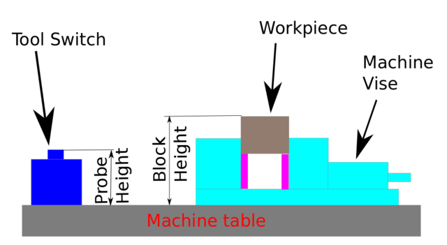

:lang: en
:toc:

[[cha:qtdragon-gui]]
= QtDragon GUI(((QtDragon)))

:ini: {basebackend@docbook:'':ini}
:hal: {basebackend@docbook:'':hal}
:ngc: {basebackend@docbook:'':ngc}

== Introduction

QtDragon and QtDragon_hd are built with the QTVCP framework.
It is the creative vision of forum personality Persei8.
Much of it is based on the excellent work of others in the LinuxCNC community.
LinuxCNC's version is adapted from Persei8's Github versions.
It is primarily meant for 3/4 axes machines such as mills or routers.
It works well with a touchscreen and/or mouse.
QtDragon supports multiple ways to touch off tools and probing work pieces.
You can use LinuxCNC's external offsets capability to automatically raise the
spindle during a pause.
If you the VersaProbe option and remap code you can add auto tool length probing
at tool changes.

[NOTE]
QtDragon and QtVcp are relatively new programs added into LinuxCNC. +
Bugs and oddities are possible. Please test carefully when using a
dangerous machine. Please forward reports to the forum or maillist.

=== Qtdragon

.qtdragon - 3 or 4 Axis Sample (1440x860) in silver theme
image::images/silverdragon.png["QTDragon Router",scale="25%"]

Qtdragon has a resolution of 1440x900 and is not resizable. +
It will work in window mode on any monitor with higher resolution but not
on monitors with lower resolution.

=== Qtdragon_hd

.qtdragon_hd - 3 or 4 Axis Sample for larger monitors (1920x1056) in dark theme
image::images/qtdragon_hd.png["QTDragon_hd",scale="25%"]

Qtdragon_hd is a similar design as Qtdragon but modified to utilize the extra
space of modern larger monitors. +
There are some small differences in layout and utility. +
Qtdragon_hd has a resolution of 1920x1056 and is not realizable. +
It will work in window mode on any monitor with higher resolution but not on
monitors with lower resolution.

== Getting Started

If your configuration is not currently set up to use QtDragon,
you can change it by editing the INI file [DISPLAY] section.
For an exhaustive list of options, see the
<<sub:ini:sec:display,display section>> of INI file documentation.

=== Display

In the section '[DISPLAY]' change the 'DISPLAY' line to read:

* 'qtdragon' for a small version
* 'qtdradon_hd' for the large version.

You can add '-c-' or '-v' for debug output to the terminal.

[source,{ini}]
----
[DISPLAY]
DISPLAY = qtvcp qtdragon
----

=== Preferences

To keep track of preferences, qtdragon looks for a preference text file.
add the following entry under the '[DISPLAY]' heading.
This will save the file in the config folder of the launch screen.
(other options are possible see the qtvcp's screenoption widget docs.)

[source,{ini}]
----
[DISPLAY]
PREFERENCE_FILE_PATH = WORKINGFOLDER/qtdragon.pref
----

=== Logging

You can specify where to save history/logs.
In the section '[DISPLAY]' add:

[source,{ini}]
----
[DISPLAY]
MDI_HISTORY_FILE = mdi_history.dat
MACHINE_LOG_PATH = machine_log.dat
LOG_FILE = qtdragon.log
----

=== Override controls

set override controls (1.0 = 100 percent):

[source,{ini}]
----
[DISPLAY]
MAX_SPINDLE_0_OVERRIDE = 1.5
MIN_SPINDLE_0_OVERRIDE = .5
MAX_FEED_OVERRIDE       = 1.2
----

=== Spindle controls

Spindle control settings (in rpm and watts):

[source,{ini}]
----
[DISPLAY]
DEFAULT_SPINDLE_0_SPEED = 500
SPINDLE_INCREMENT = 200
MIN_SPINDLE_0_SPEED = 100
MAX_SPINDLE_0_SPEED = 2500
MAX_SPINDLE_POWER = 1500
----

=== Jogging increments

Set selectable jogging increments

[source,{ini}]
----
[DISPLAY]
INCREMENTS = Continuous, .001 mm, .01 mm, .1 mm, 1 mm, 1.0 inch, 0.1 inch, 0.01 inch
ANGULAR_INCREMENTS = 1, 5, 10, 30, 45, 90, 180, 360
----

=== Jog speed

Set jog speed controls (in units per minute)

[source,{ini}]
----
[DISPLAY]
MIN_LINEAR_VELOCITY     = 0
MAX_LINEAR_VELOCITY     = 60.00
DEFAULT_LINEAR_VELOCITY = 50.0
----

=== User message dialog system

Popup Message dialogs, controlled by HAL pins.
MESSAGE_TYPE can be 'okdialog' or 'yesnodialog'.

[source,{ini}]
----
[DISPLAY]
MESSAGE_BOLDTEXT = This is the short text
MESSAGE_TEXT = This is the longer text of the both type test. It can be longerthen the status bar text
MESSAGE_DETAILS = BOTH DETAILS
MESSAGE_TYPE = okdialog
MESSAGE_PINNAME = oktest
----

=== Embed Custom VCP Panels

You can embed QTVCP Virtual Control Panels into the QtDragon or QtDragon_hd screen. +
These panels can be either user built or builtin <<cha:qtvcp-vcp-panels,QtVCP Panels>>. +
The TAB_NAME entry will used as the title for the new tab. + 
Tab TAB_LOCATION options include: 'tabWidget_utilities' and 'tabWidget_setup' +

This sample adds a builtin panel; a graphical animated machine using the vismach library. 
[source,{ini}]
----
[DISPLAY]
EMBED_TAB_NAME = Vismach demo
EMBED_TAB_COMMAND = qtvcp vismach_mill_xyz
EMBED_TAB_LOCATION = tabWidget_utilities
----

=== Preview Control

Magic comments can be used to control the G-code preview. +
On very large programs the preview can take a long time to load. You can control 
what is shown and what is hidden the the graphics screen by adding the appropriate 
comments from this list:

----
(PREVIEW,stop)
(PREVIEW,hide)
(PREVIEW,show)
----

=== Program Extensions/Filters

You can control what programs are displayed in the filemanager window with
program extensions:
Create a line with the . endings you wish to use separated by commas, then a
space and the description.
You can add multiple lines for different selections in the combo box

[source,{ini}]
----
[FILTER]
PROGRAM_EXTENSION = .ngc,.nc,.tap G-Code File (*.ngc,*.nc,*.tap)
----

Qtdragon has the ability to send loaded files through a 'filter program'.
This filter can do any desired task: Something as simple as making sure
the file ends with 'M2', or something as complicated as generating
G-Code from an image.

The '[FILTER]'  section of the INI file controls how filters work.
First, for each type of file, write a 'PROGRAM_EXTENSION' line.
Then, specify the program to execute for each type of file.
This program is given the name of the input file as its first argument,
and must write rs274ngc code to standard output. This output is what
will be displayed in the text area, previewed in the display area, and
executed by LinuxCNC when 'Run'. The following lines add support for the
'image-to-gcode' converter included with LinuxCNC and running python based
filter programs:

[source,{ini}]
----
[FILTER]
PROGRAM_EXTENSION = .png,.gif,.jpg Greyscale Depth Image
PROGRAM_EXTENSION = .py Python Script
png = image-to-gcode
gif = image-to-gcode
jpg = image-to-gcode
py = python
----

=== Probe/Touchplate/Laser Settings

QtDragon has custom INI entries for required setup.

[source,{ini}]
----
[TOOLSENSOR]
MAXPROBE = 40
SEARCH_VEL = 200
PROBE_VEL = 50
TOUCH = 29.7

[LASER]
X = 106.9
Y = -16.85
----

QtDragon has two optional probing tab screens:

[source,{ini}]
----
[PROBE]
#USE_PROBE = versaprobe
USE_PROBE = basicprobe
----

=== Macro Buttons

QtDragon has up to ten convenient macro buttons.
In the sample configurations they are labelled for moving between
current user system origin (zero point) and Machine system origin.
User origin is the first MDI command in the INI list, machine origin is the
second.
These could also call OWord routines if desired.
This example shows how to move Z axis up first. The commands are separated by
the ';'
The label is set after the comma. The symbols '\n' adds a line break.

[source,{ini}]
----
[MDI_COMMAND_LIST]
# for macro buttons
MDI_COMMAND = G0 Z25;X0 Y0;Z0, Goto\nUser\nZero
MDI_COMMAND = G53 G0 Z0;G53 G0 X0 Y0,Goto\nMachn\nZero
----

=== Builtin Sample Configurations

The sample configurations 'sim/qtvcp_screens/qtdragon/qtdragon_xyza.ini' is
already configured to use QtDragon as its front-end. +
There are several others, to demonstrate different machine configurations.

== Key Bindings

QtDragon is not intended to primarily use a keyboard for machine control.
It lacks many keyboatd short cuts that for instance AXIS has - but you can use
a mouse.
There are several key presses that will control the machine for convenience.

----
F1 - Estop on/off
F2 - Machine on/off
F12 - Style Editor
Home - Home All Joint of the Machine
Escape - Abort Movement
Pause -Pause Machine Movement
----

== Buttons

Buttons that are checkable will change their text colour when checked. +
This is controlled by the stue theme +

== Virtual Keyboard

QtDragon includes a virtual keyboard for use with touchscreens. +
To enable the keyboard, check the Use Virtual Keyboard checkbox in the Settings
page. +
Clicking on any input field, such as probe parameters or tool table entries,
will show the keyboard. +
It can also be shown by clicking the KEYBD button on the top of the screen, +
unless the machine is in AUTO mode. To hide the keyboard, do one of the
following:

- click the MAIN page button
- click the KEYBD button
- go into AUTO mode

It should be noted that keyboard jogging is disabled when using the virtual
keyboard.

== HAL Pins

These pins are specific to the QtDragon screen, There are of course are many
more HAL pins that must be connected for LinuxCNC to function.

If you need a manual tool change prompt, add these lines in your postgui file.

[source,{hal}]
----
net tool-change      hal_manualtoolchange.change   <=  iocontrol.0.tool-change
net tool-changed     hal_manualtoolchange.changed  <=  iocontrol.0.tool-changed
net tool-prep-number hal_manualtoolchange.number   <=  iocontrol.0.tool-prep-number
----

This input pin should be connected to indicate probe state:

[source,{hal}]
----
qtdragon.led-probe
----

These pins are inputs related to spindle VFD indicating:
The volt and amp pins are used to calculate spindle power.
(You must also set the MAX_SPINDLE_POWER in the INI)

[source,{hal}]
----
qtdragon.spindle-modbus-errors
qtdragon.spindle-amps
qtdragon.spindle-fault
qtdragon.spindle-volts
----

This bit pin is an output to the spindle control to pause it:
You would connect it to spindle.0.inhibit.

[source,{hal}]
----
qtdragon.spindle-inhibit
----

This bit output pin can be connected to turn on a laser:

[source,{hal}]
----
qtdragon.btn-laser-on
----

This float output pin indicates the camera rotation in degrees:

[source,{hal}]
----
qtdragon.cam-rotation
----

These bit/s32 pins are related to external offsets if they are used:

[source,{hal}]
----
qtdragon.eoffset-clear
qtdragon.eoffset-count
qtdragon.eoffset-enable
qtdragon.eoffset-value
----

These float output pins reflect the current slider jograte (in machine units):

[source,{hal}]
----
qtdragon.slider-jogspeed-linear
qtdragon.slider-jogspeed-angular
----

These float output pins reflect the current slider override rates:

[source,{hal}]
----
qtdragon.slider-override-feed
qtdragon.slider-override-maxv
qtdragon.slider-override-rapid
qtdragon.slider-override-spindle
----

These pins are available when setting the Versa Probe INI option.
They can be used for auto-tool-length-probe at tool change - with added
remap code.

[source,{hal}]
----
qtdragon.versaprobe-blockheight
qtdragon.versaprobe-probeheight
qtdragon.versaprobe-probevel
qtdragon.versaprobe-searchvel
----

== HAL files

The HAL files supplied are for simulation only. A real machine needs its own
custom HAL files. The Qtdragon screen works with 3 or 4 axes with one joint per
axis or 3 or 4 axes in a gantry configuration. (2 joints on 1 axis)

== Manual Tool Changes

If your machine requires manual tool changes, QtDragon can pop a message box to
direct you.
You must connect the proper HAL pin in the postgui HAL file.
For example:

[source,{hal}]
----
net tool-change      hal_manualtoolchange.change   <=  iocontrol.0.tool-change
net tool-changed     hal_manualtoolchange.changed  <=  iocontrol.0.tool-changed
net tool-prep-number hal_manualtoolchange.number   <=  iocontrol.0.tool-prep-number
----

== Spindle

The screen is intended to interface to a VFD, but will still work without it.
There are a number of VFD drivers included
in the LinuxCNC distribution. It is up to the end user to supply the appropriate
driver and HAL file connections according to his own machine setup.

== Auto Raise Z Axis

QtDragon can be set up to automatically raise and lower the Z axis when the
spindle is paused.
When a program is paused, then you press the 'Spindle Pause' button to stop the
spindle and raise it in Z.
Press the button again to start spindle and lower it, then unpause program.
The amount to raise and lower is set in the 'Settings' tab under the heading
'Z Ext Offset'.
This requires additions to the INI and the qtdragon_post_gui file.

In the INI, under the AXIS_Z heading.

[source,{ini}]
----
[AXIS_Z]
OFFSET_AV_RATIO  = 0.2
----

In the qtdragon_postgui.hal file add:

[source,{hal}]
----
# Set up Z axis external offsets
net eoffset_clear    qtdragon.eoffset-clear => axis.z.eoffset-clear
net eoffset_count    qtdragon.eoffset-count => axis.z.eoffset-counts
net eoffset          qtdragon.eoffset-value <= axis.z.eoffset

# uncomment for dragon_hd
#net limited          qtdragon.led-limits-tripped <= motion.eoffset-limited

setp axis.z.eoffset-enable 1
setp axis.z.eoffset-scale 1.0
----

== Probing

The probe screen has been through basic testing but there could still be some
minor bugs.
When running probing routines, use extreme caution until you are familiar with
how everything works.
Probe routines run without blocking the main GUI. This gives the operator the
opportunity to watch the DROs and stop the routine at any time.

[NOTE]
Probing is very unforgiving to mistakes; be sure to check settings before using.

.qtdragon - Probe Sample
image::images/silverdragon_probe.png["QtDragon Probe",scale="25%"]

QtDragon has 2 possible methods for setting Z0. The first is a touchplate, where
a metal plate of known thickness is placed on top of the workpiece and then the
tool is lowered until it touches the plate, triggering the probe signal. Z0 is
set to probe height - plate thickness.

The second method uses a tool setter in a fixed position and a known height
above the table where the probe signal will be triggered. In order to set Z0 to
the top of the workpiece, it has to know how far above the table the probe
trigger point is (tool setter height) and how far above the table the top of the
workpiece is. This operation has to be done every time the tool is changed as
the tool length is not saved.

For touching off with a touch probe, whether you use the touchplate operation
with thickness set to 0 or use a probing routine, the height from table to top
of workpiece parameter is not taken into account and can be ignored. It is only
for the tool setter.

== Touch plate

.qtdragon - Touch Plate
image::images/qtdragon_touchplate.png["QtDragon Touch Plate",scale="25%"]

You can use a conductive touch plate or equivalent to auto touch off (zero the
user coordinate) for the Z position of a tool.
There must be a tool loaded prior to probing.
In the tool tab or settings tab, set the touch plate height, search and probe
velocity and Max probing distance.

[NOTE]
When using a conductive plate the search and probe velocity should be the same
and slow.
If using a tool setter that has spring loaded travel then you can set search
velocity faster.
Linuxcnc ramps speed down at the maximum acceleration rate, so there can be
travel after the probe trip if the speed is set to high.

Place the plate on top of the surface you wish to zero Z on.
Connect the probe input wire to the tool (if using a conductive plate)
There is a LED to confirm the probe connection is reliable prior to probing.
Move the tool manually within the max probe distance.
Press the 'Touch Plate' button.
The machine will probe down twice and the current user offset (G5X) will be
zeroed at the bottom of the plate by calculation from the touchplate height
setting.

== Auto Tool Measurement

QtDragon can be setup to do integrated auto tool measurement using the
Versa Probe widget.
To use this feature, you will need to do some additional settings and you may
want to use the offered HAL pin to get values in your own ngc remap procedure.

[IMPORTANT]
Before starting the first test, do not forget to enter the probe
height and probe velocities on the versa probe settings page.

Tool Measurement in QtDragon is done with the following steps:

* touch of you workpiece in X and Y
* measure the height of your block from the base where your tool switch is
  located, to the upper face of the block (including chuck etc.)
* In the Versa probe tab, enter the measured value for block height
* Make sure the use tool measurement button in the Vesa probe tab is enabled
* Go to auto mode and start your program

[NOTE]
When fist setting up auto tool measurement, please use caution until you confirm
tool change and probe locations - it's easy to break a tool/probe. Abort will
be honoured while the probe is in motion.

.Auto tool measurement

With the first given tool change the tool will be measured and the offset will
be set automatically to fit the block height.
The advantage of this way is, that you do not need a reference tool.

[NOTE]
Your program must contain a tool change at the beginning.
The tool will be measured, even it has been used before, so there is no danger
if the block height has changed.
There are several videos on you tube that demonstrate the technique using
Gmoccapy.
The Gmoccapy screen pioneered the technique.

=== Tool Measurement Pins

Versaprobe offers 5 pins for tool measurement purpose. The pins are used
to be read from a remap G-code subroutine, so the code can react to different
values.

* qtversaprobe.toolmeasurement HAL_BIT enable or not tool measurement
* qtversaprobe.blockheight HAL_FLOAT the measured value of the top face of the
  workpiece
* qtversaprobe.probeheight HAL_FLOAT the probe switch height
* qtversaprobe.searchvel HAL_FLOAT the velocity to search for the tool probe
  switch
* qtversaprobe.probevel HAL_FLOAT the velocity to probe tool length

=== Tool Measurement INI File Modifications

Modify your INI File to include the following:

==== The PROBE section

QtDragon allows you to select one of two styles of touch probe routines.
Versa probe works with a M6 remap to add auto tool probing.

[source,{ini}]
----
[PROBE]
USE_PROBE = versaprobe
----

==== The RS274NGC section

[source,{ini}]
----
[RS274NGC]

# adjust this paths to point to folders with stdglu.py and qt_auto_tool_probe.ngc
# or similarly coded custom remap files
SUBROUTINE_PATH = ~/linuxcnc/nc_files/remap-subroutines:~/linuxcnc/nc_files/remap_lib

# is the sub, with is called when a error during tool change happens, not needed on every machine configuration
ON_ABORT_COMMAND=O <on_abort> call

# The remap code for Qtvcp's versaprobe's automatic tool probe of Z
REMAP=M6  modalgroup=6 prolog=change_prolog ngc=qt_auto_probe_tool epilog=change_epilog
----

==== The Tool Sensor Section

The position of the tool sensor and the start position of the probing movement,
all values are absolute (G53) coordinates, except MAXPROBE, what must be given
in relative movement.
All values are in machine native units

[source,{ini}]
----
[TOOLSENSOR]
X = 10
Y = 10
Z = -20
MAXPROBE =  -20
----

==== The Change Position Section

This is not named TOOL_CHANGE_POSITION  on purpose - *canon uses that name and
will interfere otherwise.* The position to move the machine before giving the
change tool command. All values are in absolute coordinates.
All values are in machine native units

[source,{ini}]
----
[CHANGE_POSITION]
X = 10
Y = 10
Z = -2
----

==== The Python Section

The Python section sets up what files LinuxCNC's python interpreter looks for.
ie. 'toplevel.py' file in the 'python' folder in the configuration directory:

[source,{ini}]
----
[PYTHON]
# The path to start a search for user modules
PATH_PREPEND = python
# The start point for all.
TOPLEVEL = python/toplevel.py
----

=== Needed Files

You must copy the following files to your config directory

First create a folder named 'python' in your machine's configuration folder.

If using a compiled RIP version of LinuxCNC: +
From 'YOUR-LINUXCNC-DIRECTORY/configs/sim/QtDragon/python', copy 'toplevel.py'
and 'remap.py' to your configuration's new 'python' folder.

if using an installed version of LinuxCNC: +
from '/usr/share/doc/linuxcnc/examples/sample-configs/sim/qtvcp_screens/qtdragon/python/'
, copy 'toplevel.py' and 'remap.py' to your configuration's new 'python' folder.

alternately, You can make new files in your 'python' folder that you made in your configuration folder,
with a text editor.

One named 'remap.py' saved with this text: 
[source,python]
----
from stdglue import *
----

One named 'toplevel.py' saved with this text:
[source,python]
----
import remap
----

Make a system link or copy the following files into the 'python' folder
described above.

In '~/linuxcnc/nc_files/examples/remap_subroutine/' folder

In '~/linuxcnc/nc_files/examples/remap_lib/python_stdglue/' folder

[NOTE]
These file names and location could be different depending on installed verses
development (RIP) version of LinuxCNC.
For instance '&ndash;/linuxcnc/nc_files/macros' is '&ndash;/linuxcnc/nc_files/examples/macros'
in installed versions of LinuxCNC.
You could use customized versions of the same files or name them differently.
The entries in the '[RS274NGC]' section dictate to LinuxCNC what and where to
look.
The names and location quoted should be available in either system by default.

=== Needed HAL Connections

Make sure to connect the tool probe input in your HAL file:
If connected properly, you should be able to toggle the probe LED in qtdragon
if you press the probe stylus.

[source,{hal}]
----
net probe  motion.probe-input <= <your_input_pin>
----

== Run from Line

A G-code program can be started at any line by clicking on the desired line in
the G-code display while in AUTO mode.
It is the operator's responsibility to ensure the machine is in the desired
operational mode.
A dialog will be shown allowing the spindle direction and speed to be preset.
The start line is indicated in the box labelled LINE, next to the CYCLE START
button.
The run from line feature can be disabled in the settings page.

[NOTE]
Linuxcnc's run-from-line is not very user friendly. eg. It does not start the
spindle or confirm the proper tool.
It does not handle subroutines well. If used it is best to start on a rapid
move.

== Laser buttons

The LASER ON/OFF button in intended to turn an output on or off which is
connected to a small laser crosshair projector.
When the crosshair is positioned over a desired reference point on the workpiece,
the REF LASER button can be pushed which then sets
the X and Y offsets to the values indicated by the LASER OFFSET fields in the
Settings page and the INI file.

== Tabs Description

Tabs allow the user to select the most appropriate info/control on the top three
panels. +
If the on screen keyboard is showing and the user wishes to hide it but keep the
current tab, +
they can do that by pressing the current show tab.

=== Main tab

This tab displays the graphical representation of the current program. +
The side buttons will control the display.

* 'User View': Select/restore a user set view of the current program
* 'P','X','Y','Z': Set standard views
* 'D': Toggle display of dimensions
* '+', '-': Zoom controls
* 'C': Clear graphics of tool movement lines

In Qtdragon_hd there are also macro buttons available on the right side. +
Up to tens buttons can be defined in the INI.

=== File Tab

You can use this tab to load or transfer programs. +
Editing of G-code programs can be selected from this tab.

=== Offsets Tab

You can monitor/modify system offsets from this tab.
there are convenience buttons for zeroing the rotation.G92 and current G5x user
offset.

=== Tool Tab

You can monitor/modify tool offsets from this tab. +
Adding and deleting tools from the tool file can also be done from this tab.

=== Status Tab

A time-stamped log of important machine or system events will be shown here. +
Machine events would be more suited to an operator, where the system events may
help in debugging problems.

=== Probe Tab

Probing routines options are displayed on this tab. Depending on INI options,
this could be +
VersaProbe or BasicProbe style. They are functionally similar. +
Qtdragon_hd will also show a smaller graphics display window.

=== Camview Tab

If the recognized webcam is connected, this tab will display the video image
overlayed with a cross-hair +
, circle and degree readout. This can be adjusted to suit a part feature for
such things as touchoff. +
The underlying library uses openCV python module to connect to the webcam.

=== G-codes Tab

This tab will display a list of LinuxCNC's G-code. +
if you click on a line, a description of the code will be displayed.

=== Setup Tab

It's possible to load HTML or PDF file (.html / .pdf ending) with setup
notes. 
HTML/PDF docs will be displayed in the setup tab.
Some program, such as Fusion 360 and Aspire will create these files for
you.
If you load a G-code program and there is an HTML/PDF file of the same
name, it will load automatically.
You can also write your own HTML docs with the included SetUp Writer
button.

.qtdragon - Setup Tab Sample
image::images/silverdragon_setup.png["QtDragon Setup Tab",scale="25%"]

=== Settings Tab

The settings tab is used to set running options, probing/touchplate/laser/camera
offsets and load debugging external programs.

=== Utilities Tab

This tabs will display another stab election of G-code utility programs. +

* 'Facing': allows quick face milling of a definable area at angles of 0,45 and
  90 degrees
* 'Hole Circle': allows quick setting of a program to drill a bolt circle of
  definable diameter and number of holes.
* 'NgcGui': is a Qtvcp version of the popular G-code subroutine builder/selector.

== Styles

Nearly all aspects of the GUI appearance are configurable via the qtdragon.qss
stylesheet file. The file can be edited manually or
through the stylesheet dialog widget in the GUI. To call up the dialog, press
F12 on the main window. New styles can be applied
temporarily and then saved to a new qss file, or overwrite the current qss file.

.qtdragon - Two Style Examples
image::images/style-comparison.png["QtDragon styles",scale="25%"]

== Customization

=== Stylesheets

Stylesheets can be leveraged to do a fair amount of customization, but you
usually need to know a bit about the widget names.
Pressing F12 will display a stylesheet editor dialog to load/test/save
modification.
For instance:

To change the DRO font (look for this entry and change the font name):

[source,{ini}]
----
DROLabel,
StatusLabel#status_rpm {
    border: 1px solid black;
    border-radius: 4px;
    font: 20pt "Noto Mono";
}
----

To change the text of the mist button to 'air' (add these lines)

[source,{ini}]
----
#action_mist{
qproperty-true_state_string: "Air\\nOn";
qproperty-false_state_string: "Air\\nOff";
}
----

=== QtDesigner and python code

All aspects of the GUI are fully customization through Qt Designer and/or
python code.
This capability is included with the Qtvcp development environment.
The extensive use of Qtvcp widgets keeps the amount of required python code to
a minimum, allowing relatively easy modifications.
The LinuxCNC website has extensive documentation on the installation and use of
Qtvcp libraries.
<<cha:qtvcp,QtVCP Overview>> for more information

.qtdragon - Customized QtDragon
image::images/silverdragon_custom.png["QtDragon customized",scale=25]

// vim: set syntax=asciidoc:
