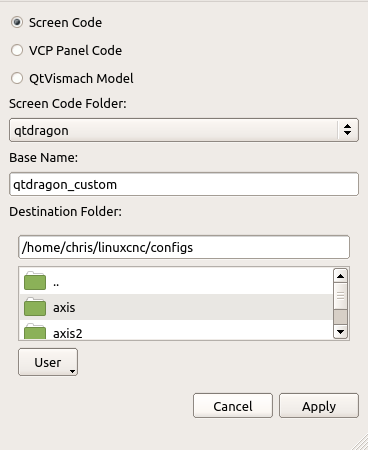
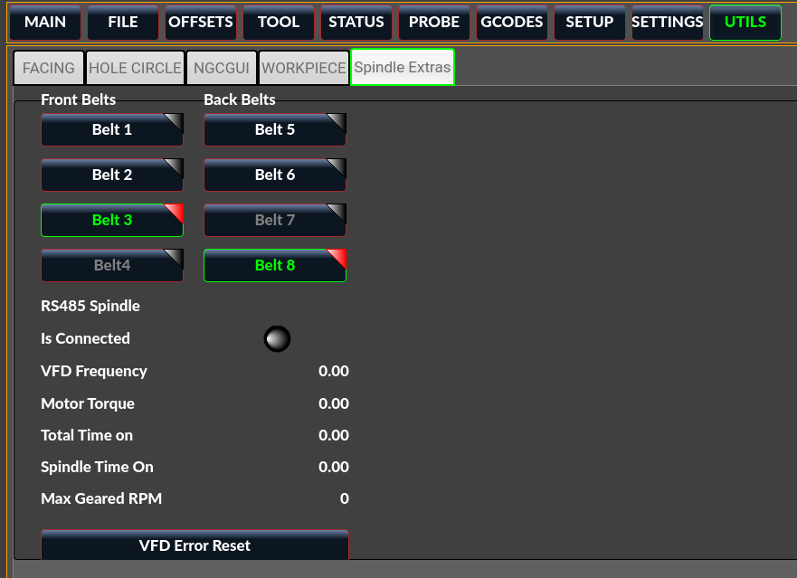
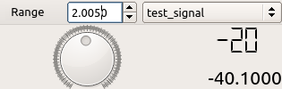
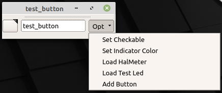
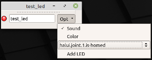
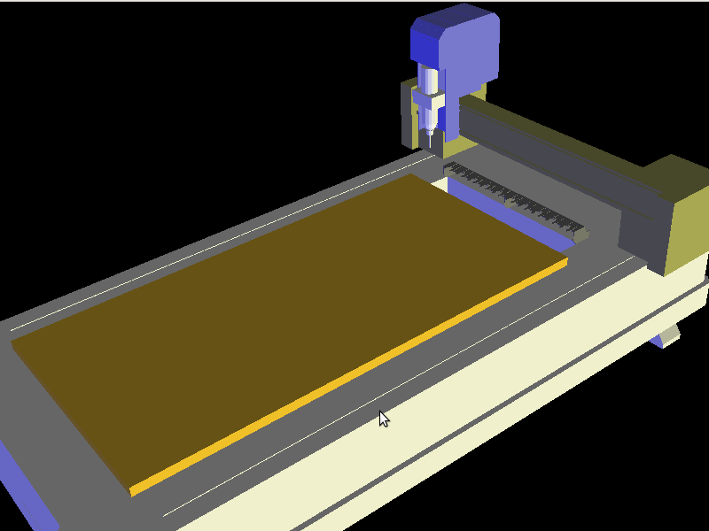
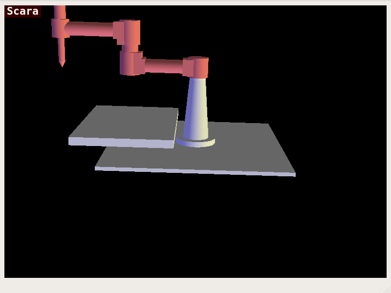
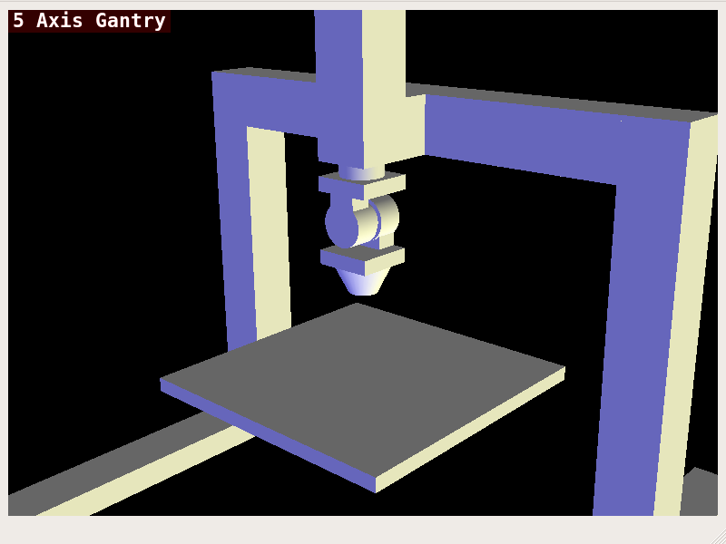
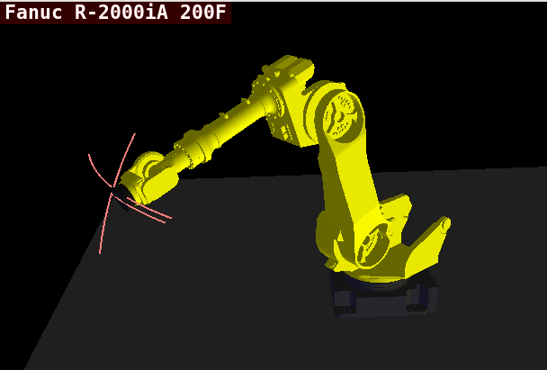

:lang: en
:toc:

[[cha:qtvcp:panels]]
= QtVCP Virtual Control Panels

// Custom lang highlight
// must come after the doc title, to work around a bug in asciidoc 8.6.6
:ini: {basebackend@docbook:'':ini}
:hal: {basebackend@docbook:'':hal}
:ngc: {basebackend@docbook:'':ngc}

QtVCP can be used to *create control panels* that interface with _HAL_.

[[sec:qtvcp:panels:builtin]]
== Builtin Virtual Control Panels

There are several *builtin HAL panels* available.

In a terminal type `qtvcp list` to see a list.

//TODO Add list output

[[sub:qtvcp:panels:copy]]
=== `copy`

Used for *copying QtVCP's builtin Screens/VCP Panels/QtVismach code to a folder* so one can _customize_ it.

In a terminal run:

[source,{hal}]
----
qtvcp copy
----

.QtVCP `copy` Dialog - Screen, VCP Panel or QtVismach Code Copy Panel

[[sub:qtvcp:panels:spindle-belts]]
=== spindle_belts

This panel is designed to display additional RS485 VFD data and also to configure a 4 sheave, 2 belt spindle drive via a series of buttons.

In addition, it is also a useful template to use for your custom panel because it includes:

* Display of additional HAL data
* Buttons and button groups
* Dynamic changes to button enabled/disabled state based on the state of other buttons
* Saving data to the qtdragon.prefs file
* Custom button to reset the VFD

Modify this panel to suit your own requirements. Most common features are used.
The advantage of using panels is that it separates your custom display code from the qtdragon core code so upgrading the system will not break your customization.

==== Additional Requirements

* A spindle drive (for instance VFDMOD)
* A custom component that scales the VFD frequency to obtain the desired spindle speed.
* A belt driven spindle that uses two belts and an intermediate idler pulley much like a drill press.
* Connect the input pins qtdragon.belts.<pin-name> in your postgui HAL file.

==== Function
The belts are broken into two button groups, the front belts and the rear belts.
These are numbered as per the plate on the machine.
Buttons in a group are mutually exclusive, i.e., only one can be selected in the group.

Additionally, it's not possible to have both belts on the same level with this kind of mechanism because you cannot fit two belts to the one idler pulley sheave.
So if a belt is selected, its opposite button is disabled.
E.g., if belt 3 is selected, belt 7 is disabled.

==== Embedding commands
Add these lines to the [DISPLAY] section in your .ini file +
The example tab_location is for the QtDragon screen.
----
EMBED_TAB_NAME=Spindle Extras
EMBED_TAB_COMMAND=qtvcp spindle_belts
EMBED_TAB_LOCATION=tabWidget_utilities
----

Here is how to load `spindle_belt` from a HAL script:

[source,{hal}]
----
loadusr qtvcp spindle_belts
----

==== Customization Hints

Customizing the panel: +

* Copy the files located in /user/share/qtvcp/qtdragon/panels/belts to:
~/linuxcnc/configs/<my_configuration_folder>/qtvcp/panels/belts (you can use the copy dialog panel to do this)

* Edit belts.ui with designer.
* Edit belts_handler.py with a text editor
* Connect the relevant pins in a postgui.hal file
* Make sure your postgui file is loaded by your .ini file.

For information on the finer points, consult the QtVCP and QtDragon documentation.
The Python handler file also provides a useful template for any custom panel.

[[sub:qtvcp:panels:test-dial]]
=== `test_dial`

- This panel has a *dial that adjusts S32 and Float HAL output pins*.
- The dial's range can be adjusted from a drop down menu.
- The output can be scaled with the `spinbox`.
- A `combobox` can be used to automatically select and connect to a signal.

[source,{hal}]
----
loadusr qtvcp test_dial
----

.QtVCP `test_dial` Panel - Test Dial VCP

=== test_button

- This panel has a *button that will set a HAL pin*.
- The button can be selected as a _momentary_ or a _toggle_ button.
- The button's _indicator color_ can be adjusted from a drop down menu.
- You can add more buttons from the drop down menu.
- You can load a Halmeter from the drop down menu.
- You can load a test LED from the drop down menu.
- The button can be detached from the main windows.

Here is how to load `test_button` from a HAL script:

[source,{hal}]
----
loadusr qtvcp test_button
loadusr qtvcp -o 4 test_button
----

The `-o` switch sets how many buttons the panel starts with. +
If loading directly from a terminal omit the `loadusr`.

.QtVCP `test_button` - Test Button VCP

[[sub:qtvcp:panels:test-led]]
=== `test_led`

- This panel has an *LED that can selected to watch HAL bit pins/signals*.
- The LED's color can be adjusted from a drop down menu.
- The text box and state can be output as speech if sound is selected.
- A `combobox` can be used to automatically select and connect to a pin/signal.
- You can add more LEDs from the drop down menu.
- The LED can be detached from the main windows.

Here is how to load `test_led` from a HAL script:

[source,{hal}]
----
loadusr qtvcp test_led
loadusr qtvcp -o 4 test_led
----

The `-o` switch sets how many LEDs the panel starts with. +
If loading directly from a terminal omit the 'loadusr'.

.QtVCP `test_dial` Panel - Test LED VCP

[[sub:qtvcp:panels:test-panel]]
=== `test_panel`

*Collection of useful widgets for testing HAL component*, including
speech of LED state.

[source,{hal}]
----
loadusr qtvcp test_panel
----

.QtVCP `test_panel` - HAL Component Testing Panel
image::images/test_panel.png["QtVCP test_panel - HAL Component Testing Panel",align="center"]

[[sub:qtvcp:panels:cam-align]]
=== `cam_align`

A *camera display widget for rotational alignment*.

.QtVCP `cam_align` Panel - Camera Based Alignment Panel
image::images/qtvcp-cam-align.png["QtVCP cam_align Panel - Camera Based Alignment Panel",align="center"]

.Usage
Add these lines to the INI file:
[source,{ini}]
----
[DISPLAY]
EMBED_TAB_NAME = cam_align
EMBED_TAB_COMMAND = halcmd loadusr -Wn qtvcp_embed qtvcp -d -c qtvcp_embed -x {XID} cam_align
# The following line is needed if embedding in GMOCCAPY
EMBED_TAB_LOCATION = ntb_preview
----

You can add window width and height size, rotation increment, and camera number from the INI with -o options.
----
EMBED_TAB_COMMAND = halcmd loadusr -Wn qtvcp_embed qtvcp -d -c qtvcp_embed -x {XID} -o size=400,400 -o rotincr=.2 -o camnumber=0 cam_align
----

Mouse controls:

* left mouse single click - increase cross hair rotation one increment
* right mouse single click - decrease cross hair rotation one increment
* middle mouse single click - cycle through rotation increments
* left mouse hold and scroll - scroll camera zoom
* right mouse hold and scroll - scroll cross hair rotation angle
* mouse scroll only - scroll circle diameter
* left mouse double click - reset zoom
* right mouse double click - reset rotation
* middle mouse double click - reset circle diameter

To use the top buttons you have to assign a command (or a sub-routine). This could look like this:
[source,{ini}]
----
[MDI_COMMAND_LIST]
MDI_COMMAND=G10 L20 P1 X0 Y0,Set XY\nOrigin
MDI_COMMAND=G0 X0 Y0,Go To\nOrigin
----
Where the first command is referring to the button "SET origin" and the second to the button "GOTO Origin". +
Note the comma and text after is optional - it will override the default button text. +
These buttons are QtVCP action buttons and follow those rules.

[[sub:qtvcp:panels:sim-panel]]
=== `sim_panel`

Small control panel to *simulate MPG jogging controls etc* for simulated configurations. +
The MPG, selection buttons and control buttons export HAL pins to connect to linuxcnc. +
The selection and control group boxes can be hidden if not needed by using the '-o hide=' option. +
'groupBoxControl' and 'groupBoxSelection' are the widget names that can be hidden. +
If you want to hide both, use a comma between them with no spaces. +
The '-a' option will make the panel always-on-top of all windows.

[source,{hal}]
----
loadusr qtvcp sim_panel
----

Here we load the panel with no MPG selection buttons and the always-on-top option.

[source,{hal}]
----
loadusr qtvcp -a -o hide=groupBoxSelection sim_panel
----

.QtVCP `sim_panel` - Simulated Controls Panel For Screen Testing.
image::images/qtvcp_sim_panel.png["QtVCP sim_panel - Simulated Controls Panel For Screen Testing",align="center"]

[[sub:qtvcp:panels:tool-dialog]]
=== `tool_dialog`

*Manual tool change dialog* that gives tool description.

[source,{hal}]
----
loadusr -Wn tool_dialog qtvcp -o speak_on -o audio_on tool_dialog
----

Options:

* `-o notify_on` - _use desktop notify_ dialogs instead of QtVCP native
  ones.
* `-o audio_on` - _play sound on tool change_
* `-o speak_on` - _speak announcement of tool change_

.QtVCP `tool_dialog` - Manual Tool Change Dialog
image::images/qtvcp_toolChange.png["QtVCP tool_dialog - Manual Tool Change Dialog",align="center"]

[[sub:qtvcp:panels:vismach]]
== `vismach` 3D Simulation Panels
These panels are prebuilt simulation of common machine types.

These are also embed-able in other screens such as AXIS or GMOCCAPY.

=== QtVCP `vismach_mill_xyz`

3D OpenGL view of a _3-Axis milling machine_.

[source,{hal}]
----
loadusr qtvcp vismach_mill_xyz
----

.QtVCP `vismach_mill_xyz` - 3-Axis Mill 3D View Panel
image::images/qtvismach.png["QtVCP vismach_mill_xyz - 3-Axis Mill 3D View Panel",align="center"]

=== QtVCP `vismach_router_atc`

3D OpenGL view of a _3-Axis router style, gantry bed milling machine_. +
This particular panel shows how to define and connect the model parts in the handler file,
rather then importing the pre-built model from QtVCP's vismach library.

[source,{hal}]
----
loadusr qtvcp vismach_router_atc
----

.QtVCP `vismach_router_atc` - 3-Axis Gantry Bed Mill 3D View Panel

=== QtVCP `vismach_scara`

3D OpenGL view of a _SCARA based milling machine_.

[source,{hal}]
----
loadusr qtvcp vismach_scara
----

.QtVCP `vismach_scara` - SCARA Mill 3D View Panel

=== QtVCP `vismach_millturn`

3D OpenGL view of a _3-Axis milling machine with an A axis/spindle_.

[source,{hal}]
----
loadusr qtvcp vismach_millturn
----

.QtVCP `vismach_millturn` - 4 Axis MillTurn 3D View Panel
image::images/qtvismach_millturn.png["QtVCP vismach_millturn - 4 Axis MillTurn 3D View Panel",align="center"]

=== QtVCP `vismach_mill_5axis_gantry`

3D OpenGL view of a _5-Axis gantry type milling machine_.

[source,{hal}]
----
loadusr qtvcp vismach_mill_5axis_gantry
----

.QtVCP `vismach_mill_5axis_gantry` - 5-AxIs Gantry Mill 3D View Panel

=== QtVCP `vismach_fanuc_200f`

3D openGL view of a _6 joint robotic arm_.

[source,{hal}]
----
loadusr qtvcp vismach_fanuc_200f
----

.QtVCP `vismach_fanuc_200f` - 6 Joint Robotic Arm

[[sec:qtvcp:panels:custom]]
== Custom Virtual Control Panels

You can of course *make your own panel and load it*.

If you made a UI file named `my_panel.ui` and a HAL file named `my_panel.hal`,
you would then load this from a terminal with:

----
halrun -I -f my_panel.hal
----

.Example HAL file loading a QtVCP panel
[source,{hal}]
----
# load realtime components
loadrt threads
loadrt classicladder_rt

# load non-realtime programs
loadusr classicladder
loadusr -Wn my_panel qtvcp my_panel.ui  # <1>

# add components to thread
addf classicladder.0.refresh thread1

# connect pins
net bit-input1     test_panel.checkbox_1        classicladder.0.in-00
net bit-hide       test_panel.checkbox_4        classicladder.0.hide_gui

net bit-output1    test_panel.led_1             classicladder.0.out-00

net s32-in1        test_panel.doublescale_1-s   classicladder.0.s32in-00

# start thread
start
----

<1> In this case we load `qtvcp` using *`-Wn`* which waits for the panel to finish loading before continuing to run the next HAL command. +
    This is to _ensure that the panel created HAL pins are actually done_ in case they are used in the rest of the file.

== Embedding QtVCP Virtual Control Panels into QtVCP Screens
QtVCP panels can be embedded into most QtVCP screens and avoids problems such as focus transferring that can be a problem in non-native embedding.

=== Embedding Commands
A typical screen such as QtDragon will search the INI file under the heading [DISPLAY] for commands to embed a panel.

[source,{ini}]
----
[DISPLAY]
EMBED_TAB_NAME=Embedding demo
EMBED_TAB_COMMAND=qtvcp simple_hal
EMBED_TAB_LOCATION=tabWidget_utilities
----

*'EMBED_TAB_NAME'*:: will typically be the title of the tab.
*'EMBED_TAB_LOCATION'*:: will be specific to the screen and specifies the tabWidget or stackedWidget to embed into.
*'EMBED_TAB_COMMAND'*:: is the command used to invoke loading of the panel. For native embedded panels the first word will always be 'qtvcp', the last will be the panel name to load. You can also pass options to the panel with -o switches in the command line between 'qtvcp' and the panel name. The panel will follow the debugging mode setting of the main screen.

=== Location of builtin Panels
There are panels available that are included with LinuxCNC. To see a list open a terminal and type 'qtvcp' and press return. +
You will get a help printout and a list of builtin screen and panels. +
Pick any of the names from the panel list and add that to the COMMAND entry after 'qtvcp'. +
The builtin panel search path is 'share/qtvcp/panels/PANELNAME'. +
Run-In-Place and installed versions of LinuxCNC have these in different locations on the system.

=== Location of Custom Panels
Custom panels can be embedded too -either a modified builtin panel or a new user-built one. +
When loading panels, QtVCP looks in the configuration folders path for 'qtvcp/panels/PANELNAME/PANELNAME.ui'. +
'PANNELNAME' being any valid string with no spaces. If no path is found there, then looks in the builtin file path. +
QtVCP will do the same process for the optional handler file: 'qtvcp/panels/PANELNAME/PANELNAME_handler.py'

=== Handler Programming Tips
In a screen handler file, the reference used for the window is 'self.w'. +
In QtVCP panels, that reference will refers to the panel's window. +
To reference the main window use 'self.w.MAIN'
If your panel is to be able to run independently and embedded, you must trap errors from referencing objects not available.
(Note, main screen objects are not available in an independent panel.)

E.g., this would use the panel's preference file if there is one.
[source,{hal}]
----
try:
    belt_en = self.w.PREFS_.getpref('Front_Belt_enabled', 1, int, 'SPINDLE_EXTRAS')
except:
    belt_en = 1
----

This would use the main screen preference file if there is one.
[source,{hal}]
----
try:
    belt_en = self.w.MAIN.PREFS_.getpref('Front_Belt_enabled', 1, int, 'SPINDLE_EXTRAS')
except:
    belt_en = 1
----

=== Designer Widget Tips

When using Python command option in Action Button widgets of an embedded panel:

*`INSTANCE`*::
  refers to the panel window.
  E.g., `INSTANCE.my_panel_handler_function_call(True)`

*'MAIN_INSTANCE'*::
  refers to the main screen window.
  E.g., `MAIN_INSTANCE.my_main_screen_handler_function_call(True)`

If the panel is not embedded, both refer to the panel window.

=== Handler Patching - Subclassing Builtin Panels

We can have QtVCP load a subclassed version of the standard handler file. in that file we can manipulate the original functions or add new ones. +
Subclassing just means our handler file first loads the original handler file and adds our new code on top of it - so a patch of changes. +
This is useful for changing/adding behaviour while still retaining standard handler updates from LinuxCNC repositories. +

You may still need to use the handler copy dialog to copy the original handler file to decide how to patch it.

There should be a folder in the config folder; for panel: named '<CONFIG FOLDER>/qtvcp/panels/<PANEL NAME>/' +
add the handle patch file there, named like so <ORIGINAL PANEL NAME>_handler.py +
ie for cam_align the file would be called 'cam_align_handler.py' +

Here is a sample to change the circle color in cam_align: +

[source,python]
----
import sys
import os
import importlib
from PyQt5.QtCore import Qt
from qtvcp.core import Path

PATH = Path()

# get reference to original handler file so we can subclass it
sys.path.insert(0, PATH.PANELDIR)
panel = os.path.splitext(os.path.basename(os.path.basename(__file__)))[0]
base = panel.replace('_handler','')
module = "{}.{}".format(base,panel)
mod = importlib.import_module(module, PATH.PANELDIR)
sys.path.remove(PATH.PANELDIR)
HandlerClass = mod.HandlerClass

# return our subclassed handler object to Qtvcp
def get_handlers(halcomp, widgets, paths):
    return [UserHandlerClass(halcomp, widgets, paths)]

# subclassed from HandlerClass which was imported above
class UserHandlerClass(HandlerClass):
    print('Custom subclassed panel handler loaded\n')

    def initialized__(self):
        # call original handler initialized function
        super().initialized__()

        # add our customization
        self.w.camview.circle_color = Qt.green

----
// vim: set syntax=asciidoc:
