:lang: en
:toc:

[[cha:qtvcp:widgets]]
= QtVCP Widgets

// Custom lang highlight
// must come after the doc title, to work around a bug in asciidoc 8.6.6
:ini: {basebackend@docbook:'':ini}
:hal: {basebackend@docbook:'':hal}
:ngc: {basebackend@docbook:'':ngc}
:css: {basebackend@docbook:'':css}

*`Qtscreen`* uses _QtVCP widgets_ for LinuxCNC integration.

*Widget* is the general name for the _UI objects_ such as buttons and
labels in PyQt.

You are free to use any available *default widgets* in the _Qt Designer_ editor.

There are also *special widgets* made for LinuxCNC that make integration easier.
These are split in two, heading on the right side of the editor:

* One is for *HAL only widgets*.
* The other is for *CNC control widgets*.

You are free to mix them in any way on your panel.

[NOTE]
This description of widget properties can easily be out of date due to further development and lack of people to write docs (a good way to give back to the project).
The definitive descriptions are found by looking in the https://github.com/LinuxCNC/linuxcnc/tree/master/lib/python/qtvcp/widgets[source code].

[[sec:qtvcp:widgets:hal]]
== HAL Only Widgets

These widgets usually have _HAL pins_ and *don't react to the machine controller*.

[[sub:qtvcp:widgets:xembed]]
=== `XEmbed` - Program Embedding Widget

Allows one to *embed a program into the widget*.

Only programs that utilize the `xembed` protocol will work such as:

* GladeVCP virtual control panels
* Onboard virtual keyboard
* QtVCP virtual control panels
* mplayer video player

[[sub:qtvcp:widgets:slider]]
=== `Slider` - HAL Pin Value Adjusting Widget

//TODO QtVCP slider widget capture

Allows one to *adjust a HAL pin value using a sliding pointer*.

[[sub:qtvcp:widgets:led]]
=== `LED` - Indicator Widget

.QtVCP `LED`: LED Indicator Widget

A *LED like indicator* that optionally follows a HAL pin's logic.

*`halpin_option`*::
  Selects if the LED follows an input HAL pin or program state.
*`diameter`*::
  Diameter of the LED. defaults to 15)
*`color`*::
  Color of the LED when on. (defaults to green)
*`off_color`*::
  Color of the LED when off. (defaults to black)
*`gradient`*::
  turns the gradient high light on or off. (defaults to on)
*`on_gradient_color`*::
  Color highlight of the LED when on. (defaults to white)
*`off_gradient_color`*::
  Color highlight of the LED when off. (defaults to white)
*`alignment`*::
  Qt alignment hint.
*`state`*::
  Current state of LED
*`flashing`*::
  Turns flashing option on and off.
*`flashRate`*::
  Sets the flash rate.

The `LED` properties can be defined in a _stylesheet_ with the following code added to the `.qss` file,
`name_of_led` being the widget name defined in Qt Designer's editor:

[source,{css}]
----
LED #name_0f_led{
  qproperty-color: red;
  qproperty-diameter: 20;
  qproperty-flashRate: 150;
}
----

[[sub:qtvcp:widgets:checkbox]]
=== `CheckBox` Widget

//TODO QtVCP checkbox widget capture

This widget allows the user to *check a box to set a HAL pin true or false*.

It is based on PyQt's _QCheckButton_.

[[sub:qtvcp:widgets:radio]]
=== `RadioButton` Widget

//TODO QtVCP radio button widget capture
//FIXME Is that one HAL pin per button ?
This widget allows a user to *set HAL pins true or false*.
Only one `RadioButton` widget of a group can be true at a time.

It is based on PyQt's _QRadioButton_.

[[sub:qtvcp:widgets:gauge]]
=== `Gauge` - Round Dial Gauge Widget

.QtVCP `Gauge`: Round Dial Gauge Widget
image::images/qtvcp_round_gauge.png["QtVCP `Gauge`: Round Dial Gauge Widget",scale="25%",align="center"]

Round Gauge can be used in a LinuxCNC GUI to *display an input parameter* on the dial face.

.Customizable Parameters
There are several properties that are user settable in order to customize the _appearance of the gauge_.

The following parameters can be set either programmatically or via the Qt Designer property editor.

*`halpin_option`*::
  Setting this to `True` will _create 2 HAL pins_:
  ** One is for setting the `value` input
  ** The other is for setting the `setpoint`.

+
If this option is not set, then `value` and `setpoint` must be connected programmatically, i.e., in the handler file.

*`max_reading`*::
  This value determines the _highest number displayed_ on the gauge face.
*`max_value`*::
  This is the _maximum expected value of the value input signal_. +
  In other words, it is the full scale input.
*`num_ticks`*::
  This is the _number of ticks/gauge readings_ on the gauge face. +
  It should be set to a number that ensures the text readings around the gauge face are readable. +
  The minimum allowed value is 2.
*`zone1_color`*::
  Zone1 extends _from the maximum reading to the threshold point_. +
  It can be set to any RGB color.
*`zone2_color`*::
  Zone2 extends _from the threshold point to the minimum reading_, which is 0. +
  It can be set to any RGB color.
*`bezel_color`*::
  This is the color of the _outer ring of the gauge_.
*`bezel_width`*::
  This is the width of the _outer ring of the gauge_.
*`threshold`*::
  The threshold is the _transition point between the zones_. +
  It should be set to a value between 0 and the maximum value. +
  The maximum allowed value is set to the gauge's `max_value` and minimum value is 0.
*`gauge_label`*::
  This is the _text below the value readout_, near the bottom of the gauge. +
  The function of the gauge is then easily visible.
*`base_color`*::
  The color of the gauge.
*`base_gradient_color`*::
  The highlight color of the gauge.
*`center_color`*::
  The color of the center of the gauge.
*`center_gradient_color`*::
  The highlight color of the center of the gauge.

.Non Customizable Parameters
There are 2 inputs that are not customizable.
They can be set via HAL pins, programmatically or via signals from other widgets:

*`value`*::
  This is the _actual input value_ that will be displayed with the gauge needle and in the digital readout. +
  It must be set to a value between 0 and `max_value` maximum value.
*`setpoint`*::
  This is a value that determines the location of a small _marker on the gauge face_.
  It must be set to a value between 0 and the maximum value.

=== 'HalBar' - HAL Bar Level Indicator

.QtVCP `HalBar`: Panel demonstrating the HAL Bar Level Indicator
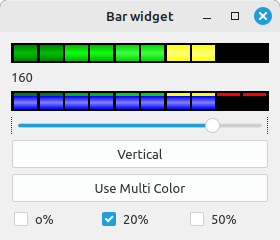

This widget is used to indicate level or value, usually of a HAL s32/float pin. +
you can also disable the HAL pin and use Qt signals or python commands to change the level. +

==== Bar Properties:
HalBar is a subclass of the Bar widget, so it inherits these properties  + 

* 'stepColorList': a list of color strings, the number of colors defines the number of bars.
* 'backgroundColor': a QColor definition of the background color.
* 'setMaximum': an integer that defines the maximum level of indication.
* 'setMinimum': an integer that defines the lowest level of indication.

==== halBar Properties:

* 'pinType': to select *HAL pins type*:
** `NONE` no HAL pin will be added
** `S32` A S32 integer pin will be added
** `FLOAT` A Float pin will be added

* 'pinName': to change the *HAL pin name* otherwise the widget base name is used.

==== HalBar style sheets
The above Bar properties could be set in _styles sheets_. +
pinType and pinName properties can not be changed in stylesheets.

[NOTE]
In style sheets, stepColorList is a single string of color names separated by commas.

[source,{css}]
----
HalBar{
    qproperty-backgroundColor: #000;
    qproperty-stepColorList: 'green,green,#00b600,#00b600,#00d600,#00d600,yellow,yellow,red,red';
}
----

[[sub:qtvcp:widgets:halpad]]
=== `HALPad` - HAL Buttons Joypad

.QtVCP `HALPad`: HAL Buttons Joypad
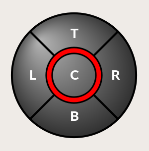

This widget looks and acts like a *5 buttons D-pad*, with an LED ring.

Each button has an selectable type (Bit, S32 or Float) output HAL pin.

The LED center ring has selectable colors for off and on and is controlled by a bit HAL pin.

.`HALPad` `ENUMS`
There are _enumerated constants_ used:

* To reference *indicator positions*:
** `NONE`
** `LEFT`
** `RIGHT`
** `CENTER`
** `TOP`
** `BOTTOM`
** `LEFTRIGHT`
** `TOPBOTTOM`

* For *HAL pins type*:
** `NONE`
** `BIT`
** `S32`
** `FLOAT`

You use the widget name in Qt Designer plus the reference constant:

[source,python]
----
self.w.halpadname.set_highlight(self.w.halpadname.LEFTRIGHT)
----

.`HALPad` Properties
*`pin_name`*::
  Optional name to use for the _HAL pins basename_. If left blank, the Qt Designer widget name will be used.
*`pin_type`*::
  Select the _HAL output pin type_. This property is only used at startup.
  Selection can be set in Qt Designer:
+
** `NONE`
** `BIT`
** `S32`
** `FLOAT`

//FIXME Does this really need to be repeated ?

*`left_image_path`*::
*`right_image_path`*::
*`center_image_path`*::
*`top_image_path`*::
*`bottom_image_path`*::
  File or resource path to an image to display in the described button location. +
  If the reset button is pressed in the Qt Designer editor property, the image will not be displayed (allowing optional text).
*`left_text`*::
*`right_text`*::
*`center_text`*::
*`top_text`*::
*`bottom_text`*::
  A text string to be displayed in the described button location. +
  If left blank an image can be designated to be displayed.
*`true_color`*::
*`false_color`*::
  Color selection for the center LED ring to be displayed when the `<BASENAME>.light.center` HAL pin is `True` or `False`.
*`text_color`*::
  Color selection for the button text.
*`text_font`*::
  Font selection for the button text.

.`HALPad` Styles
The above properties could be set in _styles sheets_.

[source,{css}]
----
HALPad{
    qproperty-on_color: #000;
    qproperty-off_color: #444;
}
----

[[sub:qtvcp:widgets:pushbutton]]
=== `PushButton` - HAL Pin Toggle Widget

This widget allows a user to *set a HAL pin true or false* with the push of a button.

As an option it can be a _toggle button_.

For  a _LED Indicator Option_, see <<sub:qtvcp:widgets:indicatedpushbutton>>[IndicatedPushButton] below for more info.

It also has other options.

It is based on PyQt's _QPushButton_.

[[sub:qtvcp:widgets:focus-ovelay]]
=== `focusOverlay` - Focus Overlay Widget

This widget places a *colored overlay over the screen*, usually while a dialog is showing.

.Focus overlay example for confirm close prompt
image::images/qtvcp_focusOverlay.png["QtVCP focus overlay",scale="25%"]

Used to create a 'focused' feel and to draw attention to critical information.

It can also show a translucent image. +
It can also display message text and buttons.

This widget _can be controlled with `STATUS` messages_.

[[sub:qtvcp:widgets:grid-layout]]
=== `gridLayout` - Grid Layout Widget

This widget *controls if the widgets inside it are enabled or disabled*.

Disabled widgets typically have a different color and do not respond to actions.

It is based on PyQt's `QGridLayout`.

[[sub:qtvcp:widgets:hal-label]]
=== `hal_label` - HAL Label Widget

This widget *displays values sent to it*.

Values can be sent from:

* _HAL pins_ +
  The input pin can be selected as Bit, S32, Float or no pin selected
* _Programmatically_
* _A `QtSignal`_

There is a `textTemplate` property to set the rich text and/or to format the text. +
Basic formatting might be:

* `%r` for booleans
* `%d` for integers
* `%0.4f` for floats.

A rich text example might be:

[source,python]
----
self.w.my_hal_label.setProperty(textTemplate,"""
<html>
<head/>
<body>
  
%0.4f

</body>
</html>
"""
)
----

The `setDisplay` slot can be connected to an integer, a float or a bool signal.

If the property `pin_name` is not set the widget name will be used.

There are function calls to display values:

*`[HALLabelName].setDisplay(some_value)`*::
  Can be used to set the display if no HAL pin is selected.
*`[HALLabelName].setProperty(textTemplate,"%d")`*::
  Sets the template of the display.

It is based on PyQt's _QLabel_.

[[sub:qtvcp:widgets:lcdnumber]]
=== `LCDNumber` - LCD Style Number Readout Widget

//TODO MCDNumber widget capture

This widget _displays HAL float/s32/bit values in a LCD looking way_.

It can display numbers in decimal, hexadecimal, binary and octal formats by setting the *`mode`* property.

When using floats you can set a formatting string.

You must set the *`digitCount`* property to an appropriate setting to display the largest number.

.Properties
*`pin_name`*::
  Option string to be used as the HAL pin name. +
  If set to an empty string the widget name will be used.
*`bit_pin_type`*::
  Selects the input pin as type BIT.
*`s32_pin_type`*::
  Selects the input pin as type S32.
*`float_pin_type`*::
  Select the input pin as type `FLOAT`.
*`floatTemplate`*::
  A string that will be used as a Python3 format template to tailor the LCD display. +
  Only used when a `FLOAT` pin is selected, e.g., `{:.2f}` will display a float rounded to 2 numbers after the decimal. +
  A blank setting will allow the decimal to move as required.

It is based on PyQt's _QLCDNumber_.

[[sub:qtvcp:widgets:doublescale]]
=== `DoubleScale` - Spin Button Entry Widget

//TODO DoubleScale widget capture

This widget is a *spin button entry* widget used for _setting a s32 and float HAL pin_.

It has an internal _scale factor_, set to a default of 1, that can be set programmatically or using a QtSignal.

The `setInput` slot can be connected to an integer, or a float signal.

*`[HALLabelName].setInput(some_value)`*::
  This is a function call to change the internal scaling factor.

The HAL pins will be set to the value of the _internal scale times the widget displayed value_.

[[sub:qtvcp:widgets:generalhalinput]]
=== `GeneralHALInput` - General Signals/Slots Input Connection Widget

This widget is used to *connect an arbitrary Qt widget to HAL using signals/slots*.

It is used _for widgets that should *respond* to HAL pin changes_.

[[sub:qtvcp:widgets:generalhaloutput]]
=== `GeneralHALOutput` - General Signals/Slots Output Connection Widget

This widget is used to *connect an arbitrary Qt widget to HAL using signals/slots*.

It is used _for widgets that should *control* HAL pins_.

[[sub:qtvcp:widgets:widgetswitche]]
=== `WidgetSwitcher` - Multi-widget Layout View Switcher Widget

//TODO WidgetSwitcher widget capture

This is used to switch the view of a multi-widget layout to show just one widget,
i.e. to *flip between a large view of a widget and a smaller multi widget view*.

It is _different from a stacked widget_ as it can pull a widget from anywhere in the screen
and place it in its page with a different layout than it originally had.

The _original widget must be in a layout_ for switcher to put it back.

In Qt Designer you will:

//FIXME Add an entry about widget numbering
* Add the `WidgetSwitcher` widget on screen.
* Right click the `WidgetSwitcher` and add a page.
* Populate it with the widgets/layouts you wish to see in a default form.
* Add as many pages as there are views to switch to.
* On each page, add a layout widget. +
  After adding the layout you must right click the widget switcher again and set the layout option.
* Click on the `WidgetSwitcher` widget and then scroll to the bottom of the property editor.
* Look for the dynamic property `widget_list` and double click to the right of it.
* A dialog pops up allowing you to add the names of the widgets to move to the pages you added to the `WidgetSwitcher`.

There are _function calls_ to display specific widgets. +
By calling one of these functions, you control what widget is currently displayed:

*`[_WidgetSwitcherName_].show_id_widget(_number_)`*::
*`[_WidgetSwitcherName_].show_named_widget(_widget_name_)`*::
*`[_WidgetSwitcherName_].show_default()`*::
  This shows the `page 0` layout, and puts all other widgets back to where they were as initially built in Qt Designer.
*`[_WidgetSwitcherName_].show_next()`*:: Show next widget.

It is based on the _QStack_ widget.

[[sec:qtvcp:widgets:machine-controller]]
== Machine Controller Widgets

These widgets *interact with the Machine Controller state*.

[[sub:qtvcp:widgets:actionbutton]]
=== `ActionButton` - Machine Controller Action Control Widget

//TODO ActionButton widget captures/examples

These buttons are used for *control actions on the machine controller*.

They are built on top of `IndicatedPushButton` so can have LEDs overlaid.

[NOTE]
If you left double click on this widget you can launch a dialog to set any of these actions.
The dialogs will help to set the right related data to the selected action.
You can also change these properties directly in the property editor.

.Actions
You can select one of these:

//FIXME are capitalization and "underscoring" OK ?
*`Estop`*::
*`Machine On`*::
*`Auto`*::
*`mdi`*::
*`manual`*::
*`run`*::
*`run_from_line status`*::
  Gets line number from `STATUS` message `gcode-line-selected`.
*`run_from_line slot`*::
  Gets line number from Qt Designer int/str slot `setRunFromLine`.
*`abort`*::
*`pause`*::
*`load dialog`*:: Requires a dialog widget present.
*`Camview dialog`*:: Requires `camview` dialog widget present.
*`origin offset dialog`*:: Requires origin offset dialog widget present.
*`macro dialog`*:: Requires macro dialog widget present.
*`Launch Halmeter`*::
*`Launch Status`*::
*`Launch Halshow`*::
*`Home`*:: Set the joint number to -1 for `all-home`.
*`Unhome`*:: Set the joint number to -1 for `all-unhome`.
*`Home Selected`*:: Homes the joint/axis selected by `STATUS`.
*`Unhome Selected`*:: Unhomes the joint/axis selected by `STATUS`.
*`zero axis`*::
*`zero G5X`*:: Zeros the current user coordinate system offsets.
*`zero G92`*:: Zeros the optional `G92` offsets.
*`zero Z rotational`*:: Zeros the rotation offset.
*`jog joint positive`*:: Set the joint number.
*`jog joint negative`*:: Set the joint number.
*`jog selected positive`*:: Selected with a different widget or `STATUS`.
*`jog selected negative`*:: Selected with a different widget or `STATUS`.
*`jog increment`*:: Set metric/imperial/angular numbers.
*`jog rate`*:: Set the float/alt float number.
*`feed override`*:: Set the float/alt float number.
*`rapid override`*:: Set the float/alt float number.
*`spindle override`*:: Set the float/alt float number.
*`spindle fwd`*::
*`spindle backward`*::
*`spindle stop`*::
*`spindle up`*::
*`spindle down`*::
*`view change`*:: Set `view_type_string`.
*`limits override`*::
*`flood`*::
*`mist`*::
*`block delete`*::
*`optional stop`*::
*`mdi command`*:: Set `command_string`, i.e.,calls a hard coded MDI command
*`INI mdi number`*:: Set `ini_mdi_number`, i.e., calls an INI based MDI command
*`dro absolute`*::
*`dro relative`*::
*`dro dtg`*::
*`exit screen`*:: Closes down LinuxCNC
*`Override limits`*:: Temporarily override hard limits
*`launch dialogs`*:: Pops up dialogs if they are included in ui file.
*`set DRO to relative`*::
*`set DRO to absolute`*::
*`set DRO to distance-to-go`*::
// end definition list

.Attributes
These set _attributes_ of the selected action (availability depends on the widget):

*`toggle float option`*::
  Allows jog rate and overrides to toggle between two rates.
*`joint number`*::
  Selects the joint/axis that the button controls.
*`incr imperial number`*::
  Sets the imperial jog increment (set negative to ignore).
*`incr mm number`*::
  Sets the metric jog increment (set negative to ignore).
*`incr angular number`*::
  Sets the angular jog increment (set negative to ignore).
*`float number`*::
  Used for `jograte` and overrides.
*`float alternate number`*::
  For `jograte` and overrides that can toggle between two float numbers.
*`view type string`*::
  Can be:
  * `p`,
  * `x`, `y`, `y2`, `z`, `z2`,
  * `zoom-in`, `zoom-out`,
  * `pan-up`, `pan-down`, `pan-left`, `pan-right`,
  * `rotate-up`, `rotate-down`, `rotate-cw`, `rotate-ccw`
  * `clear`.
*`command string`*::
  MDI command string that will be invoked if the MDI command action is selected.
*`ini_mdi_number`*::
  (Legacy way) +
  A reference to the _INI file_ `[MDI_COMMAND_LIST]` section. +
  Set an integer of select one line under the INI`s `[MDI_COMMAND]` line starting at 0. +
  Then in the INI file, under the heading `[MDI_COMMAND_LIST]` add appropriate lines. +
  Commands separated by the `;` will be run one after another +
  The button label text can be set with any text after a comma, the `\n` symbol adds a line break.

*`ini_mdi_key`*::
  (preferred way) +
  A reference to the _INI file_ `[MDI_COMMAND_LIST]` section. +
  This string will be added to 'MDI_COMMAND_' to form an entry to look for +
  in the INI file, under the heading `[MDI_COMMAND_LIST]`. +
  Commands separated by the `;` will be run one after another +
  The button label text can be set with any text after a comma, the `\n` symbol adds a line break.
[source,{ini}]
----
[MDI_COMMAND_LIST]
MDI_COMMAND_MACRO0 = G0 Z25;X0 Y0;Z0, Goto\nUser\nZero
MDI_COMMAND_MACRO1 = G53 G0 Z0;G53 G0 X0 Y0, Goto\nMachn\nZero
----

//FIXME add link to Indicated_PushButton section
Action buttons are subclassed from
<<sub:qtvcp:widgets:indicatedpushbutton>>[`IndicatedPushButton`].
See the following sections for more information about:

* <<sub:qtvcp:widgets:indicatedpushbutton:led,LED Indicator option>>
* <<sub:qtvcp:widgets:indicatedpushbutton:state-enabled,Enabled on State>>
* <<sub:qtvcp:widgets:indicatedpushbutton:state-text,Text Changes On State>>
* <<sub:qtvcp:widgets:indicatedpushbutton:python-command,Call Python Command On State>>

[[sub:qtvcp:widgets:actiontoolbutton]]
=== `ActionToolButton` - Optional Actions Menu Button Widget

//TODO ActionToolButton widget capture

*`ActionToolButton`* buttons are similar in concept to action buttons,
but they use _QToolButtons_ to allow for *optional actions* to be selected by pushing and holding the button till the option menu pops up.

//FIXME meaning only one ActionToolButton, right ?
Currently there is only one option: `userView`.

It is based on PyQt's _QToolButton_.

[[sub:qtvcp:widgets:userview]]
.`userView` Record and Set User View Widget

//TODO userView widget capture

User View tool button allows to *record and return to an arbitrary graphics view*.

Press and hold the button to have the menu pop up and press _record view_ to record the currently displayed graphics view.

Click the button normally to return to the last recorded position.

The recorded position will be remembered at shutdown if a preference file option is set up.

[NOTE]
Due to programming limitations, the recorded position may not show exactly the same.
Particularly, if you pan zoomed out and pan zoomed in again while setting the desired view. +
_Best practice_ is to select a main view, modify as desired, record, then immediately click the button to switch to the recorded position.
If it is not as you like, modify its existing position and re-record.

[[sub:qtvcp:widgets:roundbutton]]
=== `RoundButton` - Round Shapped `ActionButton` Widget

//TODO RoundButton widget capture/example

Round buttons work the same as _ActionButtons_ other than the button is cropped round.

They are intended only to be visually different.

They have _two path properties_ for displaying *images on true and false*.

[[sub:qtvcp:widgets:axistoolbutton]]
=== `AxisToolButton` - Select and Set Axis Widget

//TODO AxisToolButton widget capture/example

This allows one to *select and set an axis*.

If the button is set checkable, it will indicate which axis is selected.

If you press and hold the button a pop up menu will show allowing one to:

* Zero the axis
* Divide the axis by 2
* Set the axis arbitrarily
* Reset the axis to the last number recorded

You must have selected an entry dialog widget that corresponds to the dialog_code_string,
usually this is selected from the screenOptions widget.

*`halpin_option`*::
  Will set a HAL pin true when the axis is selected.
*`joint_number`*::
  Should be set to the appropriate joint number
*`axis_letter`*::
  Should be set to the appropriate axis letter

These are the click-and-hold menu properties: +

*`showLast`*::
 show the 'Set to last' action
*`showDivide`*::
 show the 'Divide by 2' action
*`showGotoOrigin`*::
 show the 'Go to G53/G5x origin' action
*`showZeroOrigin`*::
 show the 'Zero Origin' action
*`showSetOrigin`*::
 show the 'Set Origin' action
*`dialog_code_string`*::
  Sets which dialog will pop up with numerical entry. ie. 'ENTRY' or 'CALCULATOR'
to call a typing only entry dialog or a touch/typing calculator type entry dialog.

Here is a sample stylesheet entry:

[source,{css}]
----
AxisToolButton {
    /* Modify all the menu options */
    qproperty-showLast: false;
    qproperty-showDivide : true;
    qproperty-showGotoOrigin: true;
    qproperty-showZeroOrigin: true;
    qproperty-showSetOrigin: false;
    qproperty-dialog_code_string: CALCULATOR;
}
----

It is based on PyQt's _QToolButton_.

[[sub:qtvcp:widgets:camview]]
=== `CamView` - Workpiece Alignment and Origin Setting Widget

//TODO CamView widget capture/example

This widget *displays a image from a web camera*.

It _overlays an adjustable circular and cross hair target_ over the image.

CamView was built with precise visual positioning in mind.

This is used to *align the work piece or zero part features using a webcam*.

It uses _OpenCV_ vision library.

[[sub:qtvcp:widgets:drolabel]]
=== `DROLabel` - Axis Position Display Widget

//TODO DROLabel widget capture/example

This will *display the current position of an axis*. +
You can also click on the label and see a list of actions. +

*`Qjoint_number`*::
  Joint index number (X=0 Y=1) of offset to display (10 will specify rotational offset).
*`Qreference_type`*::
  Actual, relative or distance to go (0,1,2).
*`metric_template`*::
  Format of display, e.g. `%10.3f`.
*`imperial_template`*::
  format of display, e.g. `%9.4f`.
*`angular_template`*::
  Format of display, e.g. `%Rotational: 10.1f`.
*`always_display_diameter`*::
  Toggles display option
*`always_display_radius`*::
  Toggles display option
*`display_as_per_m7m8`*::
  Toggles display option. Will follow the current M7/8 mode
*`follow_reference_changes`*::
  Toggles display option. Will follow the STATUS message reference mode. ie.
 you can use Action buttons to set how it's currently displayed.

These are the click-on-menu options:

*`showLast`*::
 show the 'Set to last' action
*`showDivide`*::
 show the 'Divide by 2' action
*`showGotoOrigin`*::
 show the 'Go to G53/G5x origin' action
*`showZeroOrigin`*::
 show the 'Zero Origin' action
*`showSetOrigin`*::
 show the 'Set Origin' action
*`dialogName`*::
  Sets which dialog will pop up with numerical entry. ie ENTRY or CALCULATOR

The `DROLabel` widget holds a property *`isHomed`* that can be used with a stylesheet to change the _color of the `DRO_Label`
based on homing state of the joint_ number in LinuxCNC.

Here is a sample stylesheet entry that:

* Sets the font of all `DRO_Label` widgets,
* Sets the text template (to set resolution) of the DRO,
* Then sets the text color based on the Qt `isHomed` property.
* show all the menu options.

[source,{css}]
----
DROLabel {
    font: 25pt "Lato Heavy";
    qproperty-imperial_template: '%9.4f';
    qproperty-metric_template: '%10.3f';
    qproperty-angular_template: '%11.2f';

    /* Modify all the menu options */
    qproperty-showLast: true;
    qproperty-showDivide : true;
    qproperty-showGotoOrigin: true;
    qproperty-showZeroOrigin: true;
    qproperty-showSetOrigin: true;
    qproperty-dialogName: CALCULATOR;
}

DROLabel[isHomed=false] {
    color: red;
}

DROLabel[isHomed=true] {
    color: green;
}
----

Here is how you specify a particular widget by its `objectName` in Qt Designer:

[source,{css}]
----
DROLabel #dr0_x_axis [isHomed=false] {
    color: yellow;
}
----

It is based on PyQt's _QLabel_.

[[sub:qtvcp:widgets:gcodedisplay]]
=== `GcodeDisplay` - G-code Text Display Widget

//TODO GcodeDisplay capture/example

This *displays G-code in text form*, highlighting the currently running line.

This can also display:

* *MDI history* when LinuxCNC is in `MDI` mode.
* *Log entries* when LinuxCNC is in `MANUAL` mode.
* *Preference file entries* if you enter `PREFERENCE` in capitals into the `MDILine` widget.

It has a _signal_ *`percentDone(int)`* that can be connected to a slot (such as a `progressBar` to display percent run).

*`auto_show_mdi_status`*::
  Set true to have the widget switch to MDI history when in MDI mode.
*`auto_show_manual_status`*::
  Set true to have the widget switch to machine log when in Manual mode.

The `GcodeDisplay` properties can be set in a stylesheet with the following code added to the .qss file
(the following color choices are random).

[source,{css}]
----
EditorBase{
    qproperty-styleColorBackground: lightblue;
    qproperty-styleColorCursor:white;
    qproperty-styleColor0: black;
    qproperty-styleColor1: #000000; /* black */
    qproperty-styleColor2: blue;
    qproperty-styleColor3: red;
    qproperty-styleColor4: green;
    qproperty-styleColor5: darkgreen;
    qproperty-styleColor6: darkred;
    qproperty-styleColor7: deeppink;
    qproperty-styleColorMarginText: White;
    qproperty-styleColorMarginBackground: blue;
    qproperty-styleFont0: "Times,12,-1,0,90,0,0,0,0,0";
    qproperty-styleFont1: "Times,18,-1,0,90,1,0,0,0,0";
    qproperty-styleFont2: "Times,12,-1,0,90,0,0,0,0,0";
    qproperty-styleFont3: "Times,12,-1,0,90,0,0,0,0,0";
    qproperty-styleFont4: "Times,12,-1,0,90,0,0,0,0,0";
    qproperty-styleFont5: "Times,12,-1,0,90,0,0,0,0,0";
    qproperty-styleFont6: "Times,12,-1,0,90,0,0,0,0,0";
    qproperty-styleFont7: "Times,12,-1,0,90,0,0,0,0,0";
    qproperty-styleFontMargin: "Times,14,-1,0,90,0,0,0,0,0";
}
----

For `GcodeDisplay` widget's _default G-code lexer_:

* *styleColor0 = Default*: Everything not part of the groups below
* *styleColor1 = LineNo and Comments*: Nxxx and comments (characters inside of and including '()' or anything after ';' (when used outside of parenthesis) with the exception of the note below)
* *styleColor2 = G-code*: G and the digits after
* *styleColor3 = M-code*: M and the digits after
* *styleColor4 = Axis*: XYZABCUVW
* *styleColor5 = Other*: EFHIJKDQLRPST (feed, rpm, radius, etc.)
* *styleColor6 = AxisValue*: Values following XYZABCUVW
* *styleColor7 = OtherValue*: Values following EFHIJKDQLRPST$

NOTE: For comments, the "OtherValue" color (Color 5) can be used to highlight "print," "debug," "msg," "logopen," "logappend," "logclose" "log," "pyrun," "pyreload" "abort," "probeopen" "probeclose" inside of a parenthesis comment in a line of G-code.
As well as "py," if a line that starts with ";py,".
Examples: (print, text), (log, text), (msg, text), or (debug, text).
Only the last of the examples will be highlighted if there are more than one on the same line.

//FIXME Explain/explicit
_Font definitions_:

  "style name, size, -1, 0, bold setting (0-99), italics (0-1),
  underline (0-1),0,0,0"

It is based on PyQt's _QsciScintilla_.

[[sub:qtvcp:widgets:gcodeeditor]]
=== `GcodeEditor` - G-code Program Editor Widget

//TODO GcodeEditor widget capture

This is an extension of the `GcodeDisplay` widget that *adds editing convenience*.

It is based on PyQt's _QWidget_ which incorporates `GcodeDisplay` widget.

[[sub:qtvcp:widgets:gcodegraphics]]
=== `GCodeGraphics` - G-code Graphic Backplot Widget

//TODO Replace GCodeGraphics capture with one with a G-code path ?
.QtVCP GcodeGraphics: G-code Graphic Backplot Widget
image::images/qtvcp_gcodeGraphics.png["QtVCP GcodeGraphics: G-code Graphic Backplot Widget",scale="25%",align="center"]

This *displays the current G-code in a graphical form*.

.Stylesheets Properties
*`dro-font/dro-large-font`* _(string)_::
  Sets the small and large DRO font properties +
  Here we reference with the widget base name; GCodeGraphics
[source,{css}]
----
GCodeGraphics{
    qproperty-dro_font:"monospace  bold 12";
}
GCodeGraphics{
    qproperty-dro_large_font:"Times 25";
}
----

*`_view`* _(string)_::
  Sets the _default view orientation_ on GUI load. +
  Valid choices for a lathe are p, y, y2. For other screens, valid choices are p, x, y, z, z2. +
  The following shows an example of how to set this property (referenced using the widget user selected name):
+
[source,{css}]
----
#gcodegraphics{
    qproperty-_view: z;
}
----

*`_dro`* _(bool)_::
  Determines whether or not to _show the DRO_. +
  The following shows an example of how to set this property:
+
[source,{css}]
----
#gcodegraphics{
    qproperty-_dro: False;
}
----

*`_dtg`* _(bool)_::
  Determine whether or not to _show the Distance To Go_. +
  The following shows an example of how to set this property:
+
[source,{css}]
----
#gcodegraphics{
    qproperty-_dtg: False;
}
----

*`_metric`* _(bool)_::
  Determines whether or not to _show the units in metric by default_. +
  The following shows an example of how to set this property:
+
[source,{css}]
----
#gcodegraphics{
    qproperty-_metric: False;
}
----

*`_overlay`* _(bool)_::
  Determines whether or not to _show the overlay by default_. +
  The following shows an example of how to set this property:
+
[source,{css}]
----
#gcodegraphics{
    qproperty-_overlay: False;
}
----

*`_offsets`* _(bool)_::
  Determines whether or not to _show the offsets by default_. +
  The following shows an example of how to set this property:
+
[source,{css}]
----
#gcodegraphics{
    qproperty-_offsets: False;
}
----

*`_small_origin`* _(bool)_::
  Determines whether or not to _show the small origin by default_. +
  The following shows an example of how to set this property:
+
[source,{css}]
----
#gcodegraphics{
    qproperty-_small_origin: False;
}
----

*`overlay_color`* _(primary, secondary, or RGBA formatted color)_::
  Sets the _default overlay color_. +
  The following shows an example of how to set this property:
+
[source,{css}]
----
#gcodegraphics{
    qproperty-overlay_color: blue;
}
----

*`overlay_alpha`* _(float)_::
  Sets the _default overlay alpha value_. This affects the opacity of the overlay when set between 0.0 and 1.0. +
  The following shows an example of how to set this property:
+
[source,{css}]
----
#gcodegraphics{
    qproperty-overlay_alpha: 0.15;
}
----

*`background_color`* _(primary, secondary, or RGBA formatted color)_::
  Sets the _default background color_. +
  The following shows an example of how to set this property:
+
[source,{css}]
----
#gcodegraphics{
    qproperty-background_color: blue;
}
----

*`+_use_gradient_background+`* _(bool)_::
  Determines whether or not _use a gradient background by default_. +
  The following shows an example of how to set this property:
+
[source,{css}]
----
#gcodegraphics{
    qproperty-_use_gradient_background: False;
}
----

*`jog_color`* _(primary, secondary, or RGBA formatted color)_::
  Sets the _default jog color_. +
  The following shows an example of how to set this property:
+
[source,{css}]
----
#gcodegraphics{
    qproperty-jog_color: red;
}
----

*`Feed_color`* _(primary, secondary, or RGBA formatted color)_::
  Sets the _default feed color_. +
  The following shows an example of how to set this property:
+
[source,{css}]
----
#gcodegraphics{
    qproperty-Feed_color: green;
}
----

*`Rapid_color`* _(primary, secondary, or RGBA formatted color)_::
  Sets the _default rapid color_. +
  The following shows an example of how to set this property:
+
[source,{css}]
----
#gcodegraphics{
    qproperty-Rapid_color: rgba(0, 0, 255, .5);
}
----

*`InhibitControls`* _(bool)_::
  Determines whether or not to _inhibit external controls by default_. +
  The following shows an example of how to set this property:
+
[source,{css}]
----
#gcodegraphics{
    qproperty-InhibitControls:True;
}
----

*`MouseButtonMode`* _(int)_::
  Changes the _mouse button behavior_ to rotate, move or zoom within
  the preview. +
  The following shows an example of how to set this property:
+
[source,{css}]
----
#gcodegraphics{
    qproperty-MouseButtonMode: 1;
}
----
+
There are 12 valid modes:
+
[width="50%",cols="1,1,1,1"]
|===
|*Mode* |*Move* |*Zoom* |*Rotate*
|0 |Left   |Middle |Right
|1 |Middle |Right  |Left
|2 |Middle |Left   |Right
|3 |Left   |Right  |Middle
|4 |Right  |Left   |Middle
|5 |Right  |Middle |Left
|===
+
Modes 6-11 are intended for machines that only require a 2D preview such as plasma or some lathes and have no rotate button assigned.
+
[width="50%",cols="1,1,1"]
|===
|*Mode* |*Move* |*Zoom*
|6  |Left   |Middle
|7  |Middle |Left
|8  |Right  |Left
|9  |Left   |Right
|10 |Middle |Right
|11 |Right  |Middle
|===

*`MouseWheelInvertZoom`* _(bool)_::
  Determines whether or not to _invert the zoom direction_ when zooming with the mouse wheel. +
  The following shows an example of how to set this property:
+
[source,{css}]
----
#gcodegraphics{
    qproperty-MouseWheelInvertZoom:True;
}
----

.`ACTION` functions

The `ACTION` library can control the G-code graphics widget.

*`ACTION.RELOAD_DISPLAY()`*::
  Reload the current program which recalculates the origin/offsets.
*`ACTION.SET_GRAPHICS_VIEW(_view_)`*::
  The following `view` commands can be sent:
  * `clear`
  * `zoom-in`
  * `zoom-out`
  * `pan-up`
  * `pan-down`
  * `pan-right`
  * `pan-left`
  * `rotate-cw`
  * `rotate-ccw`
  * `rotate-up`
  * `rotate-down`
  * `overlay-dro-on`
  * `overlay-dro-off`
  * `overlay-offsets-on`
  * `overlay-offsets-off`
  * `alpha-mode-on`
  * `alpha-mode-off`
  * `inhibit-selection-on`
  * `inhibit-selection-off`
  * `dimensions-on`
  * `dimensions-off`
  * `grid-size`
  * `record-view`
  * `set-recorded-view`
  * `P`
  * `X`
  * `Y`
  * `Y2`
  * `Z`
  * `Z2`
  * 'set-large-dro'
  * 'set-small-dro'
*`ACTION.ADJUST_PAN(_X,Y_)`*::
  Directly set the relative pan of view in x and y direction.
*`ACTION.ADJUST_ROTATE(_X,Y_)`*::
  Directly set the relative rotation of view in x and y direction.

It is based on PyQt's _OpenGL_ widget.

[[sub:qtvcp:widgets:statelabel]]
=== `StateLabel` - Controller Modes State Label Display Widget

//TODO StateLabel widget capture/example

This will *display a label based on the machine controller modes true/false states*.

You can select between different texts based on true or false.

.States Selection Properties
The states are selectable via these properties:

*`css_mode_status`*::
  `True` when machine is in `G96` _Constant Surface Speed Mode_.
*`diameter_mode_status`*::
  `True` when machine is in `G7` _Lathe Diameter Mode_.
*`fpr_mode_status`*::
  `True` when machine is in `G95` _Feed per revolution Mode_.
*`metric_mode_status`*::
  `True` when machine is in `G21` _Metric Mode_.

.Text templates properties

*`true_textTemplate`*::
  This will be the text set when the option is `True`. +
  You can use _Qt rich text_ code for different fonts/colors etc. +
  Typical template for metric mode in true state, might be: _Metric Mode_
*`false_textTemplate`*::
  This will be the text set when the option is `False`. +
  You can use _Qt rich text_ code for different fonts/colors etc. +
  Typical template for metric mode in false state, might be: _Imperial Mode_.

It is based on PyQt's _QLabel_.

[[sub:qtvcp:widgets:statuslabel]]
=== `StatusLabel` - Controller Variables State Label Display Widget

//TODO StatusLabel widget capture/example

This will display a label based on selectable status of the machine controller. +
You can change how the status will be displayed by substituting python formatting code in the text template. You can also use rich text for different fonts/colors etc.

.Selectable States
These states are selectable:

*`actual_spindle_speed_status`*::
  Used to display the actual spindle speed as _reported from the HAL pin_ `spindle.0.speed-i`. +
  It's converted to _RPM_. +
  A `textTemplate` of `%d` would typically be used.
*`actual_surface_speed_status`*::
  Used to display the actual cutting surface speed on a lathe based on X axis and spindle speed. +
  It's converted to distance per minute. +
  A `textTemplate` of `%4.1f` (feet per minute) and `altTextTemplate` of `%d` (meters per minute) would typically be used.
*`blendcode_status`*::
  Shows the current `G64` setting.
*`current_feedrate_status`*::
  Shows the current actual feedrate.
*`current_FPU_status`*::
  Shows the current actual feed per unit.
*`fcode_status`*::
  Shows the current programmed `F` code setting.
*`feed_override_status`*::
  Shows the current feed override setting in percent.
*`filename_status`*::
  Shows the last loaded file name.
*`filepath_status`*::
  Shows the last loaded full file path name.
*`gcode_status`*::
  Shows all active G-codes.
*`gcode_selected_status`*::
  Show the current selected G-code line.
*`halpin_status`*::
  Shows the HAL pin output of a selected HAL pin.
*`jograte_status`*::
  Shows the current QtVCP based Jog Rate.
*`jograte_angular_status`*::
  Shows the current QtVCP based Angular Jog Rate.
*`jogincr_status`*::
  Shows the current QtVCP based Jog increment.
*`jogincr_angular_status`*::
  Shows the current QtVCP based Angular Jog increment.
*`machine_state_status`*::
  Shows the current _machine interpreter state_ using the text described from the machine_state_list. +
  The interpreter states are:
  * `Estopped`
  * `Running`
  * `Stopped`
  * `Paused`
  * `Waiting`
  * `Reading`
*`max_velocity_override_status`*::
  Shows the current max axis velocity override setting.
*`mcode_status`*::
  Shows _all active M-codes_.
*'motion_type_status'*::
  Shows current type of machine motion using the text described from the motion_type_list. +
  * 'None'
  * 'Rapid'
  * 'Feed'
  * 'Arc'
  * 'Tool Change'
  * 'Probe'
  * 'Rotary Index'
*`requested_spindle_speed_status`*::
  Shows the requested spindle speed - actual may be different.
*`rapid_override_status`*::
  Shows the current rapid override setting in (0-100) percent.
*`spindle_override_status`*::
  Shows the current spindle override setting in percent.
*`timestamp_status`*::
  Shows the time based on the system settings. +
  An example of a useful `textTemplate` setting: `%I:%M:%S %p`. +
  See the Python time module for more info.
*`tool comment_status`*::
  Returns the comment text from the current loaded tool.
*`tool diameter_status`*::
  Returns the diameter from the current loaded tool.
*`tool_number_status`*::
  Returns the tool number of the current loaded tool.
*`tool_offset_status`*::
  Returns the offset of the current loaded tool, indexed by `index_number` to select axis (0=x,1=y,etc.).
*`user_system_status`*::
  Shows the _active user coordinate system_ (`G5x` setting).

.Other Properties

*`index_number`*::
  Integer that specifies the tool status index to display.
*`state_label_list`*::
  List of labels used to describe different machine states.
*'motion_label_list'*::
  List of labels used to describe different motion types.
*`halpin_names`*::
  Name of a halpin to monitor (must be the complete name, including the HAL component basename).
*`textTemplate`*::
  This is usually used for *imperial (`G20`) or angular numerical settings*,
  though not every option has imperial/metric conversion. +
  This uses _Python formatting rules_ to set the text output. +
  One can use `%s` for no conversion, `%d` for integer conversion, `%f` for float conversion, etc. +
  You can also use _Qt rich text_ code. +
  Typical template used for formatting imperial float numbers to text would be `%9.4f` or `%9.4f inch`.
*`alt_textTemplate`*::
  This is usually used for *metric (`G21`) numerical settings*. +
  This uses _Python formatting rules_ to set the text output. +
  Typical template used for formatting metric float to text would be `%10.3f` or `%10.3f mm`.

It is based on PyQt's _QLabel_.

[[sub:qtvcp:widgets:gcodegraphics:statusimageswitcher]]
=== `StatusImageSwitcher` - Controller Status Image Switcher

Status image switcher will *switch between images based on LinuxCNC states*.

*`watch_spindle`::
  Toggles between _3 images_: `stop`, `fwd`, `revs`.
*`watch_axis_homed`::
  Toggles between _2 images_: `axis not homed`, `axis homed`.
*`watch_all_homed`::
  Would toggle between _2 images_: `not all homed`, `all homed`.
*`watch_hard_limits`::
  Would toggle between _2 images or one per joint_.

Here is an example of using it to display an icon of Z axis homing state:

.QtVCP `StatusImageSwitcher`: Controller Status Image Switcher
image::images/statusImageSwitcher.png["QtVCP StatusImageSwitcher: Controller Status Image Switcher",scale="25%",align="center"]

In the properties section notice that:

* `watch_axis_homed` is checked
* `axis_letter` is set to Z

If you double click the `image_list` a dialog will show and allow you to add image paths to.

If you have one image as an icon and one _clear image_ then that will look like it shows and _hides the icon_.

Selecting image paths can be done by selecting the `pixmap` property and selecting an image.

NOTE: The `pixmap` setting is for test display only and will be ignored outside of Qt Designer.

* Right click the image name and you should see 'Copy path'.
* Click 'Copy path'.
* Now double click the 'image list' property so the dialog shows.
* Click the 'New' button.
* Paste the image path in the entry box.

Do that again for the next image. +
_Use a clear image to represent a hidden icon._

You can _test the images display_ from the image list by changing the `image number`.
In this case `0` is unhomed and `1` would be homed. +
This is for test display only and will be ignored outside of Qt Designer.

[[sub:qtvcp:widgets:statusstacked]]
=== `StatusStacked` - Mode Status Display Switching Widget

//TODO StatusStacked widget capture/example

This widget *displays one of three panels based on LinuxCNC's mode*.

This allows you to automatically display different widgets on _Manual_, _MDI_ and _Auto_ modes.

//TODO StatusStacked widget documentation
.TODO

It is based on PyQt's _QStacked_ widget.

[[sub:qtvcp:widgets:jogincrements]]
=== `JogIncrements` - Jog Increments Value Selection Widget

//TODO JogIncrements widget capture/example

This widget allows the user to *select jog increment values for jogging*.

The jogging values come from the _INI file_ under:

* `[DISPLAY]INCREMENTS`, or
* `[DISPLAY]ANGULAR_INCREMENTS`

This will be _available to all widgets_ through `STATUS`.

You can select linear or angular increments by the property *`linear_option`* in Qt Designer property editor.

It is based on PyQt's _ComboBox_.

[[sub:qtvcp:widgets:screenoption]]
=== `ScreenOption` - General Options Setting widget

This widget doesn't add anything visually to a screen but *sets up important options*.

This is the _preferred way to use these options_.

.Properties
These properties can be set in Qt Designer, in Python handler code or (if appropriate) in stylesheets.

These include:

*`halCompBaseName`*::
  If left empty QtVCP will use the screen's name as the HAL component's basename. +
  If set, QtVCP will use this string as the HAL component's basename. +
  If the `-c` command line option is used when loading QtVCP, it will use the name specified on the command line - it overrides all above options. +
  If you programmatically set the basename in the `handlerfile` - it will override all above options. +
  This property cannot be set in stylesheets.
*`notify_option`*::
  Hooking into the desktop notification bubbles for error and messages.
*`notify_max_messages`*::
  Number of messages shown on screen at one time.
*`catch_close_option`*::
  Catching the close event to pop up a _'are you sure' prompt_.
*`close_overlay_color`*::
  Color of transparent layer shown when quitting.
*`catch_error_option`*::
  _Monitoring of the LinuxCNC error channel_. +
  This also sends the message through `STATUS` to anything that registers.
*`play_sounds_option`*::
  Playing sounds using `beep`, `espeak` and the system sound.
*`use_pref_file_option`*::
  Setting up a _preferences file path_. +
  Using the magic word `WORKINGFOLDER` in the preference file path will be replaced with the launched configuration path, e.g. `WORKINFOLDER/my_preferences`.
*`use_send_zmq_option`*::
  Used to initiate _ZMQ based outgoing messages_.
*`use_receive_zmq_messages`*::
  Used to initiate _ZMQ based in coming messages_. +
  These messages _can be used to call functions in the handler file_,
  allowing *external programs to integrate tightly with QtVCP* based screens.
*`embedded_program_option`*::
  Embed programs defined in the _INI_.
*`default_embed_tab`*::
  This is the property for a _default location to embed external programs_. +
  It should be set to name of a tab page widget in Qt Designer.
*`focusOverlay_option`*::
  Focus_overlay will put a transparent image or colored panel over the main screen to emphasize focus to an external event - typically a dialog.
*`messageDialog_option`*::
  Sets up the message dialog - used for general messages.
*`message_overlay_color`*::
  Color of transparent layer shown when the message dialog is shown.
*`closeDialog_option`*::
  Sets up the standard close screen prompt dialog.
*`entryDialog_option`*::
  Sets up the numerical entry dialog.
*`entryDialogSoftKey_option`*::
  Sets up a floating software keyboard when entry dialog is focused.
*`entry_overlay_color`*::
  Color of transparent layer shown when the entry dialog is shown.
*`toolDialog_option`*::
  Sets up the manual tool change dialog, including HAL pin.
*`tool_overlay_color`*::
  Color of transparent layer shown when the tool dialog is shown.
*`ToolUseDesktopNotify`*::
  Option to use desktop notify dialogs for manual tool change dialog.
*`ToolFrameless`*::
  Frameless dialogs can not be easily moved by users.
*`fileDialog_option`*::
  Sets up the file choosing dialog.
*`file_overlay_color`*::
  Color of transparent layer shown when the file dialog is shown.
*`keyboardDialog_option`*::
  Sets up a keyboard entry widget.
*`keyboard_overlay_color`*::
  Color of transparent layer shown when the keyboard dialog is shown.
*`vesaProbe_option`*::
  Sets up the Versa style probe dialog.
*`versaProbe_overlay_color`*::
  Color of transparent layer shown when the `versaProbe` dialog is shown.
*`macroTabDialog_option`*::
  Sets up the macro selection dialog.
*`macroTab_overlay_color`*::
  Color of transparent layer shown when the `macroTab` dialog is shown.
*`camViewDialog_option`*::
  Sets up the camera alignment dialog.
*`camView_overlay_color`*::
  Color of transparent layer shown when the `camView` dialog is shown.
*`toolOffset_option`*::
  Sets up the tool offset display/editor dialog.
*`toolOffset_overlay_color`*::
  Color of transparent layer shown when the `toolOffset` dialog is shown.
*`originOffset_option`*::
  Sets up the origin display/editor dialog.
*`originOffset_overlay_color`*::
  Color of transparent layer shown when the `originOffset` dialog is shown.
*`calculatorDialog_option`*::
  Sets up the calculator entry dialog.
*`calculator_overlay_color`*::
  Color of transparent layer shown when the calculator dialog is shown.
*`machineLogDialog_option`*::
  Sets up a dialog to display logs from the machine and QtVCP.
*`machineLog_overlay_color`*::
  Color of transparent layer shown when the `machineLog` dialog is shown.
*`runFromLineDialog_option`*::
  Sets up a dialog to display starting options when starting machine execution from a arbitrary line.
*`runFromLine_overlay_color`*::
  Color of transparent layer shown when the `runFromLine` dialog is shown.
*`user1Color`*::
  Optional color the screen designer can use in their design.
*`user2Color`*::
  Optional color the screen designer can use in their design.
*`user3Color`*::
  Optional color the screen designer can use in their design.
*`user4Color`*::
  Optional color the screen designer can use in their design.
*`user5Color`*::
  Optional color the screen designer can use in their design.
*`user6Color`*::
  Optional color the screen designer can use in their design.
*`user7Color`*::
  Optional color the screen designer can use in their design.
*`user8Color`*::
  Optional color the screen designer can use in their design.
*`user9Color`*::
  Optional color the screen designer can use in their design.
*`user10Color`*::
  Optional color the screen designer can use in their design.

.Setting Properties Programmatically
The screen designer chooses the *default settings of the `screenOptions` widget*.

Once chosen, most won't ever need to be changed.
But if needed, some can be changed in the handler file or in stylesheets.

* *In the handler file*: +
  Here we reference the widget by the Qt Designer user defined name:
+
[source,python]
----
# red,green,blue,alpha 0-255
color = QtGui.QColor(0, 255, 0, 191)
self.w.screen_options.setProperty('close_overlay_color', color)
self.w.screen_options.setProperty('play_sounds_option',False)
----

* *In style sheets*: +
  Here we can reference the widget by Qt Designer user defined name or by widget class name.
+
[source,{css}]
----
/* red, green, blue 0-255, alpha 0-100% or 0.0 to 1.0 */
/* the # sign is used to refer to Qt Designer defined widget name */
/* matches/applied to only this named widget */
#screen_options {
  qproperty-close_overlay_color: rgba(0, 255, 0, 0.75)
}
----

*Some settings are only checked on startup* so will not cause changes after startup.
In these cases you would need to _make the changes in Qt Designer only_.

.Preference File Entries

If the _preference file option is selected_, `screenOption` widget will make an *INI based preference file*.

While _other QtVCP widgets will add to this list_, the `screenOptions` widget will add these entries under the following headings:

*`[SCREEN_OPTIONS]`*::
  *`catch_errors`* _(bool)_;;
  *`desktop_notify`* _(bool)_;;
    Whether to display errors/messages in the system's notification mechanism.
  *`notify_max_msgs`* _(int)_;;
    Number of displayed errors at one time.
  *`shutdown_check`* _(bool)_;;
    Whether to pop a confirmation dialog.
  *`sound_player_on`* _(bool)_;;
    Turns all sounds on or off.
*`[MCH_MSG_OPTIONS]`*::
  *`mchnMsg_play_sound`* _(bool)_;;
    To play alert sound when dialog pops.
  *`mchnMsg_speak_errors`* _(bool)_;;
    To use Espeak to speak error messages.
  *`mchnMsg_speak_text`* _(bool)_;;
    To use Espeak to speak all other messages.
  *`mchnMsg_sound_type`* _(str)_;;
    Sound to play when messages displayed. See notes below.
*`[USER_MSG_OPTIONS]`*::
  *`usermsg_play_sound`* _(bool)_;;
    To play alert sound when dialog pops.
  *`userMsg_sound_type`* _(str)_;;
    Sound to play when user messages displayed. See notes below.
  *`userMsg_use_focusOverlay`* _(bool)_;;
*`[SHUTDOWN_OPTIONS]`*::
  *`shutdown_play_sound`* _(bool)_;;
  *`shutdown_alert_sound_type`* _(str)_;;
    Sound to play when messages displayed. See notes below.
  *`shutdown_exit_sound_type`* _(str)_;;
    Sound to play when messages displayed. See notes below.
  *`shutdown_msg_title`* _(str)_;;
    Short title string to display in dialog.
  *`shutdown_msg_focus_text`* _(str)_;;
    Large text string to superimpose in focus layer.
  *`shutdown_msg_detail`* _(str)_;;
    Longer descriptive string to display in dialog.
*`NOTIFY_OPTIONS`*::
  *`notify_start_greeting`* _(bool)_;;
    Whether to display a greeting dialog on start-up.
  *`notify_start_title`* _(str)_;;
    Short Title string. +
    If the speak option is also selected it will be spoken with Espeak.
  *`notify_start_detail`* _(str)_;;
    Longer description string.
  *`notify_start_timeout`* _(int)_;;
    Time in seconds to display before closing.

.`*_sound_type` entries

* *System Sounds* +
  In Debian/Ubuntu/Mint based installations these _system sounds_ should be available as sound-type entries above:

** `ERROR`
** `READY`
** `DONE`
** `ATTENTION`
** `RING`
** `LOGIN`
** `LOGOUT`
** `BELL`

+
These Sound options require `python3-gst1.0` installed.

* *Audio Files* +
  You can also specify a _file path to an arbitrary audio file_. +
  You can use `~` in path to substitute for the user home file path.

* *Kernel Beeps* +
  If the `beep` _kernel module_ is installed and it is not disabled, these sound-type entries are available:

** `BEEP`
** `BEEP_RING`
** `BEEP_START`

* *Text-To-Speech* +
  If the _Espeak_ module (`python3-espeak`) is installed, you can use the `SPEAK` entry to pronounce text:

* *`SPEAK '_my message_'`*

[[sub:qtvcp:widgets:statusslider]]
=== `StatusSlider` - Controller Setting Adjustment Slider Widget

//TODO StatusSlider widget capture

This widget allow the user to *adjust a LinuxCNC setting via a slider*.

The widget can adjust:

* Jog rate
* Angular jog rate
* Feed rate
* Spindle override rate
* Rapid override rate

.Properties

`StatusSlider` has the following properties:

*`halpin_option`*::
  Sets option to make a HAL float pin that reflects current value.
*`rapid_rate`*::
  Selects a rapid override rate slider.
*`feed_rate`*::
  Selects a feed override rate slider.
*`spindle_rate`*::
  Selects a spindle override rate slider.
*`jograte_rate`*::
  Selects a linear jograte slider.
*`jograte_angular_rate`*::
  Selects a angular jograte slider.
*`max_velocity_rate`*::
  Selects a maximum velocity rate slider.
*`alertState`*::
  String to define style change: `read-only`, `under`, `over` and `normal`.
*`alertUnder`*::
  Sets the float value that signals the stylesheet for 'under' warning.
*`alertOver`*::
  Sets the float value that signals the stylesheet for 'over' warning.

These can be set in:

* Qt Designer
* Python handler code,
+
[source,python]
----
self.w.status_slider.setProperty('spindle_rate',True)
self.w.status_slider.setProperty('alertUnder',35)
self.w.status_slider.setProperty('alertOver',100)
----

* Or (if appropriate) in stylesheets.
+
[source,{css}]
----
/* warning colors for overrides if out of normal range*/
/* widget object name is slider_spindle_ovr */

#slider_spindle_ovr[alertState='over'] {
    background: red;
}
#slider_spindle_ovr[alertState='under'] {
    background: yellow;
}
----

It is based on PyQt's _QSlider_.

[[sub:qtvcp:widgets:stateled]]
=== `StateLED` - Controller State LED Widget

//TODO StateLED widget capture/example

This widget gives *status on the selected LinuxCNC state*.

.States
The state options are:

*`is_paused_status`*::
*`is_estopped_status`*::
*`is_on_status`*::
*`is_idle_status_`*::
*`is_homed_status`*::
*`is_flood_status`*::
*`is_mist_status`*::
*`is_block_delete_status`*::
*`is_optional_stop_status`*::
*`is_joint_homed_status`*::
*`is_limits_overridden_status`*::
*`is_manual_status`*::
*`is_mdi_status`*::
*`is_auto_status`*::
*`is_spindle_stopped_status`*::
*`is_spindle_fwd_status`*::
*`is_spindle_rev_status`*::
*`is_spindle_at_speed_status`*::
*`is_neg_limit_tripped`*::
*`is_pos_limit_tripped`*::
*`is_limits_tripped`*::
// end definition list

.Properties
There are properties that can be changed:

*`halpin_option`*::
  Adds an output pin that reflects selected state.
*`invert_state_status`*::
  Invert the LED state compared to the LinuxCNC state.
*`diameter`*::
  Diameter of the LED.
*`color`*::
  Color of the LED when on.
*`off_color`*::
  Color of the LED when off.
*`alignment`*::
  Qt Alignment hint.
*`state`*::
  Current state of LED (for testing in Qt Designer).
*`flashing`*::
  Turns flashing option on and off.
*`flashRate`*::
  Sets the flash rate.

The LED properties can be defined in a stylesheet with the following code added to the `.qss` file. +

[source,{css}]
----
State_LED #name_of_led{       <1>
  qproperty-color: red;
  qproperty-diameter: 20;
  qproperty-flashRate: 150;
}
----

<1> `name_of_led` would be the name defined in Qt Designer's editor.

It is based on the _LED_ widget.

[[sub:qtvcp:widgets:statusadjustmentbar]]
=== `StatusAdjustmentBar` - Controller Value Setting Widget

//TODO StatusAdjustmentBar widget capture

This widget allows *setting values using buttons while displaying a bar*.

It also has an _optional hi/low toggle button_ that can be held down to set the *levels*.

The widget can adjust:

* Jog rate
* Angular jog rate
* Feed rate
* Spindle override rate
* Rapid override rate

It is based on PyQt's _QProgressBar_.

[[sub:qtvcp:widgets:systemtoolbutton]]
=== `SystemToolButton` - User System Selection Widget

//TODO SystemToolButton widget capture/example

This widget allows you to *manually select a G5x user system by pressing and holding*.

If you don't set the button text it will automatically update to the current system.

It is based on PyQt's _QToolButton_.

[[sub:qtvcp:widgets:macrotab]]
=== `MacroTab` - Special Macros Widget

.QtVCP `MacroTab`: Special Macros Widget
image::images/qtvcp_macro.png["QtVCP MacroTab: Special Macros Widget",scale="25%"]

This widget allows a user to *select and adjust special macro programs* for doing small jobs.

It uses _images for visual representation_ of the macro and for an icon.

It searches for special macros using the _INI definition_:

[source,{ini}]
----
[RS274NGC]
SUBROUTINE_PATH =
----

The macros are *`O-word` subroutines with special comments* to work with the launcher.
The first three lines _must_ have the keywords below, the fourth is optional.

Here is a sample for the first four lines in an _O-word file_:

[source,{ini}]
----
; MACROCOMMAND = Entry1,Entry2
; MACRODEFAULTS = 0,true
; MACROIMAGE = my_image.svg,Icon layer number,Macro layer number
; MACROOPTIONS = load:yes,save:yes,default:default.txt,path:~/macros
----

.`MACROCOMMAND`

This is the _first line_ in the O-word file.

It is a *comma separated list of text to display above an entry*. +
There will be *one for every variable required* in the O-word function.

If the macro does not require variables, leave it empty:

[source,{ini}]
----
; MACROCOMMAND=
----

.`MACRODEFAULTS`

This must be the _second line_ in the O-word file.

It is a *comma separated list of the default values for each variable* in the O-word function.

If you use the word `true` or `false` in the list, a `*checkbutton*` will be shown.

.`MACROIMAGE`

This must be the _third line_ in the O-word file.

* *SVG Images* +
  If using SVG image files, they must end with the `.svg` extension. +
+
The images must be added to _SVG layers_ which are used to define the different images for macro and icon.
+
Value is comma separated list of three ordered fields:
+
[source,{ini}]
----
; MACROIMAGE=filename.svg,macro_layer_name[,icon_layer_name]
----
+
With:
+
*`_filename_.svg`*::
  SVG image file name as first field. +
  It is assumed to be in the same folder as the O-word file.
*`*macro_layer_name`*::
  Macro image layer name as second field.
*`icon_layer_name`*::
  Icon image layer name as optional third field.
  If the third entry is missing, the same image will be used for macro and icon.
* *PNG/JPG Images*: +
  Value remains a comma separated list:
+
[source,{ini}]
----
; MACROIMAGE=macro_image.(png|jpg)[,icon_image.(png|jpg)]
----
+
With:
+
*`_macro_image_.(png|jpg)`*::
  Macro image file name as first field. +
  It is assumed that the image file are in the same folder than the macro.
*`_icon_image_.(png|jpg)`*::
  *Icon image file name* as optional second field. +
  If the second entry is missing the same image will be used for macro and image.

If the keyword is present but the entries are missing, no images will be used.

.`MACROOPTIONS`

This _optional line must be the fourth_ line in the O-word file.

It is a comma separated list of keyword and data:

*`LOAD:yes`*::
  Shows a load button.
 *`SAVE:yes`*::
  Shows a save button.

[[sub:qtvcp:widgets:mdiline]]
=== `MDILine` - MDI Commands Line Entry Widget

//TODO MDILine widget capture

One can *enter MDI commands* here.

A popup keyboard is available.

.Embedded Commands
There are also *embedded commands* available from this widget.

Enter any of these _case sensitive_ commands to load the respective program or access the feature:

*`HALMETER`*::
  Starts LinuxCNC
  link:../hal/tools.html#sec:halmeter[`halmeter`] utility.
*`HALSHOW`*::
  Starts LinuxCNC
  link:../hal/halshow.html#cha:halshow[`halshow`] utility.
*`HALSCOPE`*::
  Starts LinuxCNC
  link:../hal/tutorial.html#sec:tutorial-halscope[`halscope`] utility.
*`STATUS`*::
  Starts LinuxCNC
  link:../man/man1/linuxcnctop.1.html[`status`] utility.
*`CALIBRATION`*::
  Starts LinuxCNC
  link:../man/man1/emccalib.1.html[Calibration]
*`CLASSICLADDER`*::
  Starts the link:../ladder/classic-ladder.html[ClassicLadder GUI] if the _ClassicLadder realtime HAL component_ was loaded by the machine's config files.
*`PREFERENCE`*::
  _Loads the preference file_ into the `GcodeEditor`.
*`CLEAR HISTORY`*::
  _Clears the MDI History_.
*`net`*::
  See link:../man/man1/halcmd.1.html#COMMANDS[`halcmd net` commands]. +
  An error will result if the command is unsuccessful.
  * _Syntax_: `net <signal name> <pin name>`
  * __Example__: `net plasmac:jog-inhibit motion.jog-stop`
*`setp`*::
  _Sets the value of a pin or a parameter_. +
  Valid values depend on the object type of the pin or parameter. +
  It results in an error if the data types do not match or the pin is connected to a signal.
  * _Syntax_: `setp <pin/parameter-name> <value>`
  * _Example_: `setp plasmac.resolution 100`
*`unlinkp`*::
  _Disconnects a pin from a signal_. +
  An error will result if the pin does not exist. +
  Running LinuxCNC from terminal may help determine the root cause as error messages from `hal_lib.c` will be displayed there.
  * _Syntax_: `unlinkp <pin name>`
  * __Example__: `unlinkp motion.jog-stop`

NOTE: The `MDILine` function *`spindle_inhibit`* can be used by a GUI's handler file to inhibit `M3`, `M4`, and `M5` spindle commands if necessary.

It is based on PyQt's _QLineEdit_.

[[sub:qtvcp:widgets:mdihistory]]
=== `MDIHistory` - MDI Commands History Widget

//TODO MDIHistory widget capture
//TODO Merge MDILine and MDIHistory sections ?

Displays a *scrollable list of past MDI command*.

An edit line is embedded for MDI commands.
The same MDILine embedded commands may be accessed from this widget.

The history is _recorded on a file defined in the INI_ under the heading `[DISPLAY]` (this shows the default):

[source,{ini}]
----
MDI_HISTORY_FILE = '~/.axis_mdi_history'
----

[[sub:qtvcp:widgets:mditouchy]]
=== `MDITouchy` - Touch Screen MDI Entry Widget

.QtVCP `MDITouchy`: Touch Screen MDI Entry Widget
image::images/qtvcp_mdiTouchy.png["QtVCP MDITouchy: Touch Screen MDI Entry Widget",scale="25%"]

This widget displays *buttons and entry lines to use for entering MDI commands*.

Based on LinuxCNC's Touchy screen's MDI entry process, its large buttons are most useful for touch screens.

To use `MDITouchy`:

* First press one of the `G/XY`, `G/RO`, `M` or `T` button.
  On the left will show the entry fields that can be filled out.
* Then press `Next` and `Back` to navigate between fields.
* `Calc` will pop up a calculator dialog.
* `Clear` clears the current entry.
* `Set Tool` will call for a tool change.
* `Set Origin` will allow setting the origin of the current G6x system.
* `Macro` will call any available macro ngc programs.

The widget _requires an explicit call to MDITouchy Python code_ to _actually run the MDI command_:

* *For handler file code* +
  If the widget was named 'mditouchy' in Qt Designer, the command below would run the displayed MDI command:
+
[source,python]
----
self.w.mditouchy.run_command()
----

* *For action button use* +
  If the widget was named 'mditouchy' in Qt Designer, use the action button's 'Call Python commands' option and enter:
+
[source,python]
----
INSTANCE.mditouchy.run_command()
----

The macro button _cycles though macros defined in the INI [DISPLAY] heading_.

Add one or more `MACRO` lines of the following format:

[source,{ini}]
----
MACRO = macro_name [param1] [... paramN]
----

In the example below, `increment` is the name of the macro, and it accepts two parameters, named `xinc` and `yinc`.

[source,{ini}]
----
MACRO = incerment xinc yinc
----

Now, place the macro in a file named `macro_name.ngc` in the `PROGRAM_PREFIX` directory,
or into any directory in the `SUBROUTINE_PATH` specified in the INI file.

Keeping on with the example above, it would be named `increment.ngc` and its content could look like:

[source,{ngc}]
----
O<increment> sub
G91 G0 X#1 Y#2
G90
O<increment> endsub
----

Notice the _name of the sub matches the file name and macro name exactly_, including case.

When you invoke the macro by pressing the Macro button you can enter values for parameters (`xinc` and `yinc` in our example). +
These are passed to the macro as positional parameters: `#1`, `#2`...  `#N` respectively. +
Parameters you leave empty are passed as value `0`.

If there are several different macros, press the Macro button repeatedly to cycle through them.

In this simple example, if you enter -1 for xinc and invoke the running of the MDI cycle,
a rapid 'G0' move will be invoked, moving one unit to the left.

This macro capability is useful for edge/hole probing and other setup tasks,
as well as perhaps hole milling or other simple operations that can be done from the panel without requiring specially-written G-code programs.

[[sub:qtvcp:widgets:originoffsetview]]
=== `OriginOffsetView` - Origins View and Setting Widget

.QtVCP `OriginOffsetsView`: Origins View and Setting Widget
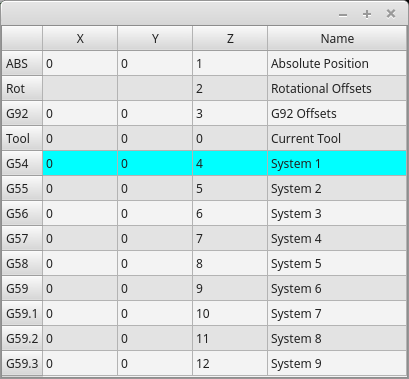

This widget allows one to *visualize and modify User System Origin offsets* directly.

It will _update LinuxCNC's Parameter file_ for changes made or found.

The settings can only be changed in LinuxCNC after homing and when the motion controller is idle.

The display and entry will change between metric and imperial, based on LinuxCNC's _current_ `G20` / `G21` setting.

The current in-use user system will be highlighted.

Extra actions can be integrated to manipulate settings. +
These actions depend on extra code added either to a combined widget,
like `originoffsetview` dialog, or the screens handler code. +
Typical actions might be 'Clear Current User offsets' or 'Zero X'.

Clicking on the columns and rows allows one to adjust the settings.

A dialog can be made to popup for data or text entry.

The comments section will be recorded in the preference file.

It is based on PyQt's _QTableView_, _QAbstractTableModel_, and _ItemEditorFactory_. +
Properties, functions and styles of the PyQt base objects are always available.

.Properties
`OriginOffsetView` has the following properties:

*`dialog_code_string`*::
  Sets which dialog will pop up with numerical entry.
*`test_dialog_code_string`*::
  Sets which dialog will pop up with text entry.
*`metric_template`*::
  Metric numerical data format.
*`imperial_template`*::
  Imperial numerical data format.
*`styleCodeHighlight`*::
  Current in-use user system highlight color.

These can be set in:

* Qt Designer, in
* Python handler code
+
[source,python]
----
self.w.originoffsetview.setProperty('dialog_code','CALCULATOR')
self.w.originoffsetview.setProperty('metric_template','%10.3f')
----
* Or (if appropriate) in stylesheets
+
[source,{css}]
----
OriginOffsetView{
  qproperty-styleColorHighlist: lightblue;
}
----

[[sub:qtvcp:widgets:stateenablegridlayout]]
=== `StateEnableGridlayout` - Controller State Enabled Container Widget

//TODO StateEnableGridlayout widget capture/example

 _disable the widgets inside it depending on LinuxCNC's current state_.

This is a *container that other widgets can be placed in*.

Embedded widgets are be greyed-out when the `StateEnableGridlayout` is disabled.

It can selectably react to:

* Machine on
* Interpreter idle
* E-stop off
* All-homed

It is based on PyQt's _QGridLayout_.

[[sub:qtvcp:widgets:machinelog]]
=== `MachineLog` - Machine Events Journal Display Widget

//TODO MachineLog widget capture/example
FIXME MachineLog documentation

[[sub:qtvcp:widgets:jointenabledwidget]]
=== `JointEnableWidget` - FIXME

//TODO JointEnableWidget widget capture/example
FIXME JointEnableWidget documentation

[[sub:qtvcp:widgets:statusimageswitcher]]
=== `StatusImageSwitcher` - Controller Status Image Switching Widget

//TODO StatusImageSwitcher widget capture/example

This widget will *display images based on LinuxCNC status*.

You can watch:

* the state of the spindle,
* the state of all homed,
* the state of a certain axis homed,
* the state of hard limits.

It is based on PyQt's FIXME

[[sub:qtvcp:widgets:filemanager]]
=== `FileManager` - File Loading Selector Widget

.QtVCP `FileManager`: File Loading Selector Widget
image::images/qtvcp_fileManager.png["QtVCP FileManager: File Loading Selector Widget",scale="25%"]

This widget is used to *select files to load*.

It has a the ability to scroll the names with hardware such as a MPG.

One can class patch the function `load(self,fname)` to customize file loading.

The function `getCurrentSelected()` will return a Python tuple, containing the file path and whether it is a file.

[source,python]
----
temp = FILEMANAGER.getCurrentSelected()
print('filepath={}'.format(temp[0]))
if temp[1]:
    print('Is a file')
----

.Stylesheets Properties

*`doubleClickSelection`* _(bool)_::
  Determines whether or not to _require double clicking on a folder_. +
  Single clicking a folder (False) is enabled by default and is intended for touch screen users. +
  The following shows an example of how to set this property:
+
[source,{css}]
----
#filemanager {
    qproperty-doubleClickSelection: True;
}
----

*`showListView`* _(bool)_::
  Determines whether or not to _show the file/folder structure in list form_. +
  Table view (False) is enabled by default. +
  The following shows an example of how to set this property:
+
[source,{css}]
----
#filemanager {
    qproperty-showListView: True;
}
----

It is based on PyQt's FIXME

[[sub:qtvcp:widgets:radioaxisselector]]
=== `RadioAxisSelector` - FIXME

//TODO RadioAxisSelector widget capture/example
FIXME RadioAxisSelector documentation

[[sub:qtvcp:widgets:tooloffsetview]]
=== `ToolOffsetView` - Tools Offsets View And Edit Widget

.QtVCP `ToolOffsetView`: Tools Offsets View And Edit Widget
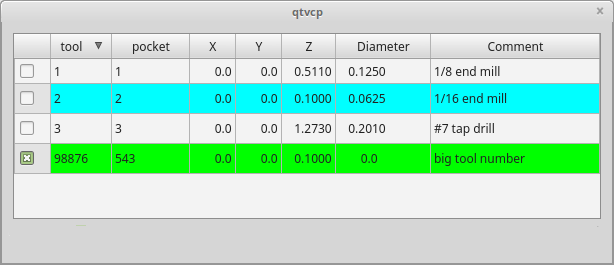

This widget *displays and allows one to modify tools offsets*.

It will _update LinuxCNC's tool table_ for changes made or found.

The tool settings can only be changed in LinuxCNC after homing and when the motion controller is idle.

The display and entry will change between metric and imperial based on LinuxCNC's _current_ `G20`/`G21` setting.

The current in-use tool will be highlighted, and the current selected tool will be highlighted in a different color.

The checkbox beside each tool can be used to select too for an _action_ that depends on extra code added either to a combined widget,
like the `toolOffsetView` dialog or the screens handler code. +
Typical actions are 'load selected tool', 'delete selected tools', etc.

Clicking on the columns and rows allows one to adjust the settings.

A dialog can be made to popup for data or text entry.

The comments section will typically be displayed in the manual tool change dialog.

If using a _lathe configuration_, there can be columns for X and Z wear.

To use these columns to adjust the _tool wear_, it requires a remapped tool change routine.

It is based on PyQt's _QTableView_, _QAbstractTableModel_, and _ItemEditorFactory_. +
Properties, functions and styles of the PyQt base objects are always available.

.Properties
`ToolOffsetView` has properties that can be set in Qt Designer, in Python handler code or (if appropriate) in stylesheets:

*`dialog_code_string`*::
  Sets which dialog will pop up with numerical entry.
*`text_dialog_code_string`*::
  Sets which dialog will pop up with text entry.
*`metric_template`*::
  Metric numerical data format.
*`imperial_template`*::
  Imperial numerical data format.
*`styleCodeHighlight`*::
  Current tool-in-use highlight color.
*`styleCodeSelected`*::
  Selected highlight color.

In a handler file:

[source,python]
----
self.w.tooloffsetview.setProperty('dialog_code','CALCULATOR')
self.w.tooloffsetview.setProperty('metric_template','%10.3f')
----

and in style sheets:

[source,{css}]
----
ToolOffsetView{
  qproperty-styleColorHighlist: lightblue;
  qproperty-styleColorSelected: #444;
}
----

.Functions
`ToolOffsetView` has some functions useful for screen builders to add actions:

*`add_tool()`*::
  Adds a blank dummy tool (99) that the user can edit to suit.
*`delete_tools()`*::
  Deletes the currently checkbox selected tools.
*`get_checked_list()`*::
  Returns a list of tools selected by checkboxs.
*`set_all_unchecked()`*::
  Uncheck all selected tools.

.Example for handler file executing aforementioned functions.
[source,python]
----
self.w.tooloffsetview.add_tool()
self.w.tooloffsetview.delete_tools()
toolList = self.w.tooloffsetview.get_checked_list()
self.w.tooloffsetview.set_all_unchecked()
----

[[sub:qtvcp:widgets:basicprobe]]
=== `BasicProbe` - Simple Mill Probing Widget

.QtVCP `BasicProbe`: Simple Mill Probing Widget
image::images/qtvcp_basicProbe.png["QtVCP BasicProbe: Simple Mill Probing Widget",scale="25%"]

Widget for *probing on a mill*.
Used by the _QtDragon_ screen.

[[sub:qtvcp:widgets:vesaprobe]]
=== `VersaProbe` - Mill Probing Widget

.QtVCP `VersaProbe`: Mill Probing Widget
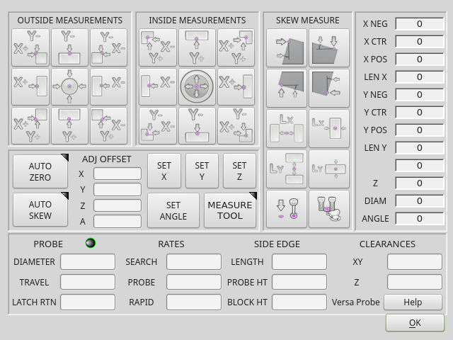

Widget for *probing on a mill*.
Used by the _QtDragon_ screen.

[[sec:qtvcp:widgets:dialog]]
== Dialog Widgets

Dialogs are used to *present or request immediately required information* in a focused way.

The typical used dialogs can be loaded using the `ScreenOptions` _widget_.

You can also add them directly to the _UI_ - but each dialog must have a unique launch name or you will see multiple dialogs displayed, one after another.

.Use dialogs from Python Code
You can show dialogs directly with _Python code_, but a safer way is to *use `STATUS` messages* to request the dialog to launch and to return the gathered information.

* *Register to `STATUS` channel*: +
  To set this up, first register to catch the `general` message from `STATUS`:
+
[source,python]
----
STATUS.connect('general',self.return_value)
----

* *Add a function to call a dialog*: +
  This function must _build a message `dict` to send to the dialog_. +
  This message will be passed back in the general message with the addition of the _`return` variable_. +
  It is possible to add _extra user information_ to the message.
  The dialog will ignore these and pass them back.
  `NAME`:: Launches code name of dialog to show.
  `ID`:: A unique id so we process only a dialog that we requested.
  `TITLE`:: The title to use on the dialog.

+
[source,python]
----
def show_dialog(self):
    mess = {'NAME':'ENTRY','ID':'__test1__',
            'TITLE':'Test Entry'}
    ACTION.CALL_DIALOG, mess)
----

* *Add a callback function that processes the general message*: +
  Keep in mind this function will _get all general messages_ so the `dict` keynames are not guaranteed to be there.
  Using the `.get()` function and/or using `try`/`except` is advisable.
  This function should:
  ** check the name and id is the same as we sent,
  ** then extract the return value and any user variables.

+
[source,python]
----
# process the STATUS return message
def return_value(self, w, message):
    rtn = message.get('RETURN')
    code = bool(message.get('ID') == '__test1__')
    name = bool(message.get('NAME') == 'ENTRY')
    if code and name and not rtn is None:
        print('Entry return value from {} = {}'.format(code, rtn))
----

[[sub:qtvcp:widgets:lcncdialog]]
=== `LcncDialog` - General Message Dialog Widget

//TODO LcncDialog widget capture

This is a *general message dialog widget*.

If there is a Focus Overlay widget present, it can signal it to display.

If the sound library is set up it can _play sounds_.

There are _options_ that can be set when requesting a dialog, these would be added to the message `dict`.

*`TITLE`*:: Title of the dialog window.
*`MESSAGE`*:: Title message text in bold.
*`MORE`*:: Standard text under the heading.
*`DETAILS`*:: Initial hidden text.
*`TYPE`* _(`OK`|`YESNO`|`OKCANCEL`)_::
*`ICON`* (`QUESTION`|`INFO`|`CRITICAL`|`WARNING`)::
*`PINNAME`*::
  Not implemented yet.
*`FOCUSTEXT`* _(overlay text|`None`)_::
  Text to display if focus overlay is used.  Use `None` for no text.
*`FOCUSCOLOR`* (`QColor(_R, G, B, A_)`)::
  Color to use if focus overlay is used.
*`PLAYALERT`*::
  Sound to play if sound is available, i.e., `SPEAK` _<spoken_message>_ .

When using `STATUS` 's `request-dialog` function, the _default launch name_ is *`MESSAGE`*.

It is based on PyQt's _QMessagebox_.

[[sub:qtvcp:widgets:tooldialog]]
=== `ToolDialog` - Manual Tool Change Dialog Widget

.QtVCP `ToolDialog`: Manual Tool Change Dialog
image::images/qtvcp_toolChange.png["QtVCP ToolDialog: Manual Tool Change Dialog",scale="25%"]

This is used as a *manual tool change prompt*.

It has _HAL pins to connect to the machine controller_.
The pins are named the same as the original AXIS manual tool prompt and works the same.

The tool change dialog _can only be launched by HAL pins_.

If there is a Focus Overlay widget present, it will signal it to display.

It is based on PyQt's _QMessagebox_.

[[sub:qtvcp:widgets:filedialog]]
=== `FileDialog` - Load and Save File Chooser Dialog Widget

.QtVCP `FileDialog`: Load and Save File Chooser Widget
image::images/qtvcp_fileDialog.png["QtVCP FileDialog: Load and Save File Chooser Widget",scale="25%"]

This is used to *load G-code files*.

If there is a Focus Overlay widget present, it will signal it to display.

When using `STATUS` 's `request-dialog` function, the default launch names are *`LOAD`* or *`SAVE`*.

There are _options_ that can be set when requesting a dialog, these would be added to the message dict:

*`EXTENSIONS`*::
*`FILENAME`*::
*`DIRECTORY`*::
// end definition list

An example Python call, for a _load dialog_:

[source,python]
----
mess = {'NAME':'LOAD','ID':'_MY_DIALOG_',
            'TITLE':'Load Some text File',
            'FILENAME':'~/linuxcnc/nc_files/someprogram.txt',
            'EXTENSIONS':'Text Files (*.txt);;ALL Files (*.*)'
            }
ACTION.CALL_DIALOG(mess)
----

And for a _save dialog_

[source,python]
----
mess = {'NAME':'SAVE','ID':'_MY_DIALOG_',
            'TITLE':'Save Some text File',
            'FILENAME':'~/linuxcnc/nc_files/someprogram.txt',
            'EXTENSIONS':'Text Files (*.txt);;ALL Files (*.*)'
            }
ACTION.CALL_DIALOG(mess)
----

It is based on PyQt's _QMessagebox_.

[[sub:qtvcp:widgets:originoffsetdialog]]
=== `OriginOffsetDialog` - Origin Offset Setting Dialog Widget

.QtVCP `OriginOffsetDialog`: Origin Offset Setting Widget
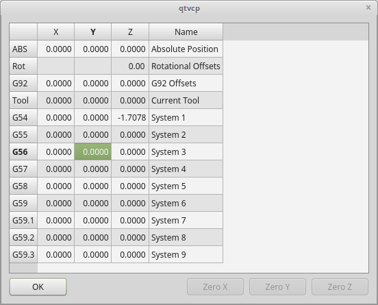

This widget allows one to *modify User System origin offsets directly* in a dialog form.

If there is an Focus Overlay widget present, it will signal it to display.

When using `STATUS` 's `request-dialog` function, the default launch name is *`ORIGINOFFSET`*.

It is based on PyQt's _QDialog_.

[[sub:qtvcp:widgets:tooloffsetdialog]]
=== `ToolOffsetDialog` - Tool Offset Setting Dialog Widget

.QtVCP `ToolOffsetDialog`: Tool Offset Setting Dialog Widget
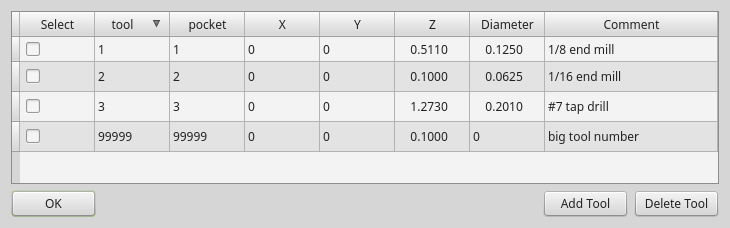

This widget allows one to *modify Tool offsets directly* in a dialog form.

If there is an Focus Overlay widget present, it will signal it to display.

When using `STATUS` 's `request-dialog` function, the default launch name is *`TOOLOFFSET`*.

It is based on PyQt's _QDialog_.

[[sub:qtvcp:widgets:macrotabdialog]]
=== `MacroTabDialog` - Macro Launch Dialog Widget

//TODO MacroTab dialog capture

This is a dialog to *display the macrotab widget*.

`MacroTab` displays a _choice of macro programs to run using icons_.

If there is a Focus Overlay widget present, it will signal it to display.

When using ``STATUS``'s `request-dialog` function, the default launch name is *`MACROTAB`*.

It is based on PyQt's _QDialog_.

[[sub:qtvcp:widgets:camviewdialog]]
=== `CamViewDialog` - WebCam Part Alignment Dialog Widget

//TODO CamView dialog capture

This is a dialog to *display the CamView widget for Webcam part alignment*.

When using ``STATUS``'s `request-dialog` function, the default launch name is *`CAMVIEW`*.

It is based on PyQt's _QDialog_.

[[sub:qtvcp:widgets:entrydialog]]
=== `EntryDialog` - Edit Line Dialog Widget

//TODO EntryDialog dialog capture

This is a dialog to *display an edit line for information entry*, such as origin offset.

It returns the entry via `STATUS` messages using a Python `DICT`.

The `DICT` contains at minimum, the name of the dialog requested and an ID code.

When using ``STATUS``'s `request-dialog` function, the default launch name is *`ENTRY`*.

It is based on PyQt's _QDialog_.

[[sub:qtvcp:widgets:calculatordialog]]
=== `CalculatorDialog` - Calculator Dialog Widget

.QtVCP `CalculatorDialog`: Calculator Dialog Widget
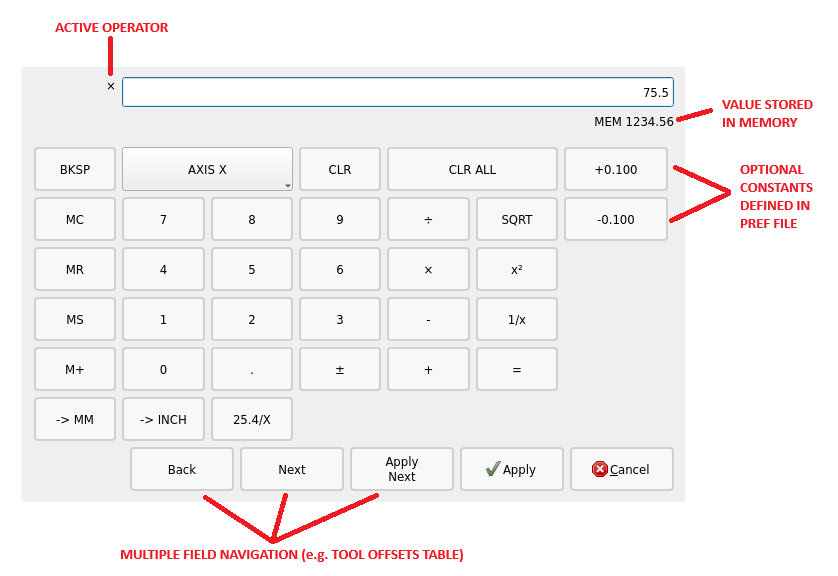

This is a dialog to *display a calculator for numeric entry*, such as origin offset.

It returns the entry via `STATUS` messages using a Python `DICT`.

The `DICT` contains at minimum, the name of the dialog requested and an ID code.

When using ``STATUS``'s `request-dialog` function, the default launch name is *`CALCULATOR`*.

It is based on PyQt's _QDialog_.

[[sub:qtvcp:widgets:runfromlinedialog]]
=== `RunFromLine` - Run-From-Line Dialog Widget

.QtVCP `RunFromLine`: Run-From-Line Dialog Widget
image::images/qtvcp_runFromLine.png["QtVCP RunFromLine: Run-From-Line Dialog Widget",scale="25%"]

Dialog to *preset spindle settings before running a program from a specific line*.

It is based on PyQt's _QDialog_.

[[sub:qtvcp:widgets:versaprobedialog]]
=== `VersaProbeDialog` - Part Touch Probing Dialog Widget

.QtVCP `VersaProbeDialog`: Part Touch Probing Dialog Widget

This is a dialog to display a *part probing screen based on Verser Probe v2*.

It is based on PyQt's _QDialog_.

[[sub:qtvcp:widgets:machinelogdialog]]
=== `MachineLogDialog` - Machine and Debugging Logs Dialog Widget

.QtVCP `MachineLogDialog`: Machine and Debugging Logs Dialog Widget
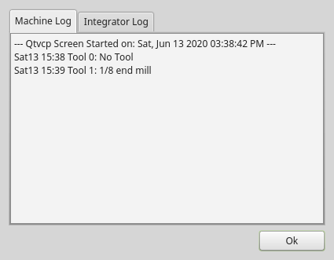

This is a dialog to *display the machine log and QtVCP's debugging log*.

It is based on PyQt's _QDialog_.

[[sec:qtvcp:widgets:other]]
== Other Widgets

Other available widgets:

[[sub:qtvcp:widgets:nurbseditor]]
=== `NurbsEditor` - NURBS Editing Widget

.QtVCP `NurbsEditor`: NURBS Editing Widget
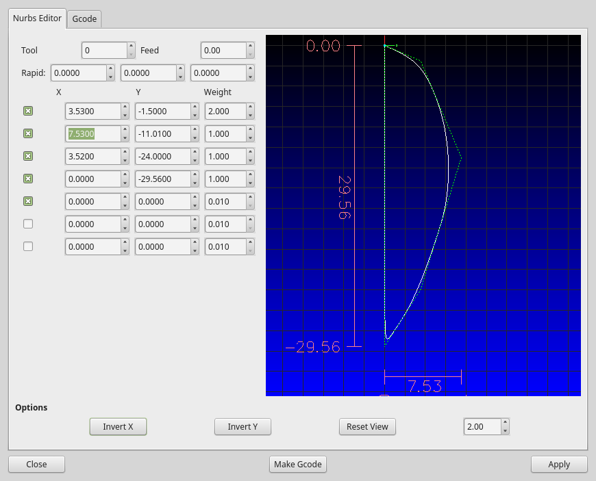

The Nurbs editor allows you to *manipulate a NURBS based geometry* on screen and then *convert NURBS to G-code*.

You can edit the G-code on screen and then send it to LinuxCNC.

It is based on PyQt's _QDialog_.

[[sub:qtvcp:widgets:joypad]]
=== `JoyPad` - 5 button D-pad Widget

//TODO JoyPad widget capture

It is the base class for the `HALPad` widget.

This widget looks and acts like a *5 button D-pad, with a LED like indicators in a ring*.

You can put text or icons in each of the button positions.

You can _connect to output signals_ when the buttons are pressed.

There are also _input slots_ to change the color of the indicator(s).

.ENUMS
There are *enumerated constants used to reference indicator positions*. +
They are used in Qt Designer editor's property editor or in Python code.

*`NONE`*::
*`LEFT`, `L`*::
*`RIGHT`, `R`*::
*`CENTER`, `C`*::
*`TOP`, `T`*::
*`BOTTOM`, `B`*::
*`LEFTRIGHT`, `X`*::
*`TOPBOTTOM`, `A`*::

For Python handler code, you use the widget name in Qt Designer plus the reference constant:

[source,python]
----
self.w.joypadname.set_highlight(self.w.joypadname.LEFT)
----

.Useful Override-able Functions

[source,python]
----
def _pressedOutput(self, btncode):
    self.joy_btn_pressed.emit(btncode)
    self[''.format(btncode.lower())].emit(True)

def _releasedOutput(self, btncode):
    self.joy_btn_released.emit(btncode)
    self['joy_{}_pressed'.format(btncode.lower())].emit(False)
----

As coded these function _issue (emit) PyQt5 signals (joy_btn_pressed and joy_<letter>_pressed) for the any button pressed or released_.

Signal 'joy_btn_pressed' outputs a string code for the button. +
Signal 'joy_<letter>_pressed' outputs a bool value.

You could override the functions to do something else if making a custom widget:

.Callable Functions
*`reset_highlight()`*::
  Clears the highlight indicator.
*`set_highlight(_button_, state=_True_)`*::
  Set the highlight indicator in position `button` to state `state`. +
//FIXME Document "strings letters"
  You can use _strings letters_ (`LRCTBXA`) or _position_ `ENUMS` for the button argument.
*`set_button_icon(_button_, _pixmap_)`*::
  Sets the button's icon pixmap.
*`set_button_text(_button_, _text_)`*::
  Sets the button's icon text.
*`set_tooltip(_button_, _text_)`*::
  Sets the buttons pop-up tooltip descriptive text.
*`setLight(_state_)`*::
  Sets the highlight indicator to the `True` color or `False` color. +
  The `set_highlight()` function must be used prior to set the indicator to use.

.Signals
These signals will be *sent when buttons are pressed*.

They can be connected to in Qt Designer editor or Python code.

The first two output a string that indicates the button pressed:

*`joy_btn_pressed`* _(string)_::
*`joy_btn_released`* _(string)_::
*`joy_l_pressed`* _(bool)_::
*`joy_l_released`* _(bool)_::
*`joy_r_pressed`* _(bool)_::
*`joy_r_released`* _(bool)_::
*`joy_c_pressed`* _(bool)_::
*`joy_c_released`* _(bool)_::
*`joy_t_pressed`* _(bool)_::
*`joy_t_released`* _(bool)_::
*`joy_b_pressed`* _(bool)_::
*`joy_b_released`* _(bool)_::
// end definition list

They are based on PyQt's  _Signal_ (`QtCore.pyqtSignal()`)

.Slots
Slots can be connected to in Qt Designer editor or Python code:

*`set_colorStateTrue()`*::
*`set_colorStateFalse()`*::
*`set_colorState(_bool_)`*::

*`set_true_color(_str_)`*::
*`set_true_color(_qcolor_)`*::

*`set_false_color(_str_)`*::
*`set_false_color(_qcolor_)`*::
// end definition list

.Properties
These can be set in stylesheets or Python code:

*`highlightPosition`*::
  Set the indicator position.
*`setColorState`*::
  Select the color state of the indicator.
*`left_image_path`*::
*`right_image_path`*::
*`center_image_path`*::
*`top_image_path`*::
*`bottom_image_path`*::
  A file path or resource path to an image to display in the described button location. +
  If the reset button is pressed in Qt Designer editor property, the image will not be displayed (allowing optionally text).
*`left_text`*::
*`right_text`*::
*`center_text`*::
*`top_text`*::
*`bottom_text`*::
  A text string to be displayed in the described button location. +
  If left blank an image can be designated to be displayed.
*`true_color`*::
*`false_color`*::
  Color selection for the center LED ring to be displayed, when the `BASENAME.light.center` _HAL pin_ is `True` or `False`.
*`text_color`*::
  Color selection for the button text.
*`button_font`*::
  Font selection for the button text.

The above properties could be set in:

* *Stylesheets*: +
  You would usually use the Qt Designer widget name with `#` _prefix_ to set individual widget properties,
  otherwise you would use the `JoyPad` _class name_ to set all `JoyPad` widgets the same:
+
[source,{css}]
----
#joypadname{
  qproperty-true_color: #000;
  qproperty-false_color: #444;
}
----

* *In Python handler code*: +
+
[source,python]
----
self.w.joypadename.setProperty('true_color','green')
self.w.joypadename.setProperty('false_color','red')
----

=== 'WebWidget'
This widget will create a html/pdf viewing page using the QtWebKit or QtWebEngine libraries.
The newer QtWebEngine is preferred if both are on the system. +
If the QtWebEngine library is used with the Qt Designer editor, a placeholder QWidget will show in Qesigner.
This will be replaced with the QtWebEngine widget at run time.

[[sec:qtvcp:widgets:baseclass-mixin]]
== BaseClass/Mixin Widgets

These widgets are used to *combine different properties and behaviours into other widgets*.

You will see them as a collapsible header in the Qt Designer properties column.

[[sub:qtvcp:widgets:indicatedpushbutton]]
=== `IndicatedPushButtons`

This class *modifies `QPushButton` behaviour*.

[[sub:qtvcp:widgets:indicatedpushbutton:led]]
==== Indicator Option

*`indicator_option`* _puts a 'LED' on the top of the button_.

.QtVCP `PushButton`: Indicated Action Button, LED Indicator Option
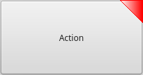

//FIXME Better document IndicatedPushButton
// https://github.com/LinuxCNC/linuxcnc/blob/master/lib/python/qtvcp/widgets/simple_widgets.py#L317
It can be a _triangle_, _circle_, _top bar_, or _side bar_. +
The _size_ and _position_ can be adjusted.

It will indicate:

* the *current state of the button*, or
* the *state of a HAL pin*, or
* *LinuxCNC status*.

.Properties
These properties are available to customize the indicator (not all are applicable to every LED shape):

*`on_color`*::
*`off_color`*::
*`flashIndicator`*::
*`flashRate`*::
*`indicator_size`*::
*`circle_diameter`*::
*`shape_option`*::
*`right_edge_offset`*::
*`top_edge_offset`*::
*`height_fraction`*::
*`width_fraction`*::
*`corner_radius`*:: Indicator corner radius.

The LED indicator color can be defined in a _stylesheet_ with the following code added to the `.qss` file:

[source,{css}]
----
Indicated_PushButton{
  qproperty-on_color: #000;
  qproperty-off_color: #444;
}
----

Or for a particular button:

[source,{css}]
----
Indicated_PushButton #button_estop{
  qproperty-on_color: black;
  qproperty-off_color: yellow;
}
----

.Options
`IndicatedPushButton` have *exclusive options*:

*`indicator_HAL_pin_option`*::
  Adds a `halpin`, named `<buttonname>-led` that controls the button indicator state.
*`indicator_status_option`*::
  Makes the LED indicate the state of these selectable LinuxCNC status:
+
* _Is Estopped_
* _Is On_
* _All Homed_
* _Is Joint Homed_
* _Idle_
* _Paused_
* _Flood_
* _Mist_
* _Block Delete_
* _Optional Stop_
* _Manual_
* _MDI_
* _Auto_
* _Spindle Stopped_
* _Spindle Forward_
* _Spindle Reverse_
* _On Limits_

+
Some `indicator_status_options` holds a property that can be used with a _stylesheet_
to change the color of the button based on the state of the property in LinuxCNC. +
Currently these status properties can be used to auto style buttons:

* `is_estopped_status` will toggle the `isEstop` property
* `is_on_status` will toggle the `isStateOn` property
* `is_manual_status`, `is_mdi_status`, `is_auto_status` will toggle the `isManual`, `isMDI`, `isAuto` properties.
* `is_homed_status` will toggle the 'isAllHomed' property

Here is a sample stylesheet entry setting the background of mode button widgets when LinuxCNC is in that mode:

[source,{css}]
----
ActionButton[isManual=true] {
    background: red;
}
ActionButton[isMdi=true] {
    background: blue;
}
ActionButton[isAuto=true] {
    background: green;
}
----

Here is how you specify a particular widget by its objectName in Qt Designer:

[source,{css}]
----
ActionButton #estop button [isEstopped=false] {
    color: yellow;
}
----

[[sub:qtvcp:widgets:indicatedpushbutton:state-enabled]]
==== Enabled by LinuxCNC State

Often, having the button disabled and enabled based on the state of LinuxCNC's motion controller is necessary.

There are several properties that can be selected to aid with this:

*`isAllHomedSentive`*::
*`isOnSensitive`*::
*`isIdleSensitive`*::
*`isRunSensitive`*::
*`isRunPausedSensitive`*::
*`isManSensitive`*::
*`isMDISensitive`*::
*`isAutoSensitive`*::

You can select multiple properties for combined requirements.

[[sub:qtvcp:widgets:indicatedpushbutton:state-text]]
==== Text Changes On State

//FIXME What is a 'checkable' button ? A checkbox ?
Choosing the *`checked_state_text_option`* allows a 'checkable' button to _change the text based on its checked state_.

It uses the following properties to specify the text for each state:

*`true_state_string`*::
*`false_state_string`*::

`\\n` will be converted to a newline.

You can set/change these in stylesheets:

[source,{css}]
----
ActionButton #action_aux{
  qproperty-true_state_string: "Air\\nOn";
  qproperty-false_state_string: "Air\\nOff";
}
----

[[sub:qtvcp:widgets:indicatedpushbutton:python-command]]
==== Call Python Commands On State

The *`python_command_option`* allow small snippets of Python code to be run from the push of a button, without having to edit the handler file.
Though, it can call functions in the handler file.

When using the `command_string` properties.

*`true_python_cmd_string`*::
  A Python command that will be called when the button is toggled `True`.
*`false_python_cmd_string`*::
  A Python command that will be called when the button is toggled `False`.

_Special capitalized words_ will give access to the following:

*`INSTANCE`*::
  Will give access to the widgets instances and handler functions. +
  E.g., `INSTANCE.my_handler_function_call(True)`
*`ACTION`*::
  Will give access to QtVCP's `ACTION` library. +
  E.g., `ACTION.TOGGLE_FLOOD()`
*`PROGRAM_LOADER`*::
  Will give access to QtVCP's `PROGRAM_LOADER` library. +
  E.g., `PROGRAM_LOADER.load_halshow()`
*`HAL`*::
  Will give access to HAL's Python module. +
  E.g., `HAL.set_p('motion.probe-input','1')`

[[sec:qtvcp:widgets:import-only]]
== Import-Only Widgets

These widgets are usually the *base class widget for other QtVCP widgets*.

They are _not available directly from the Qt Designer editor_ but could be *imported and manually inserted*.

They could also be *subclassed* to make a similar widget with new features.

[[sub:qtvcp:widgets:auto-height]]
=== Auto Height

Widget for measuring two heights with a probe. +
For setup.

[[sub:qtvcp:widgets:gcode-utility]]
=== G-code Utility

Widgets for performing common machining processes.

[[sub:qtvcp:widgets:facing]]
=== Facing

Slab or face a definable area with different strategies.

[[sub:qtvcp:widgets:hole-circle]]
=== Hole Circle

Drill multiple holes on a bolt hole circle.

[[sub:qtvcp:widgets:qt-ngcgui]]
=== Qt NGCGUI

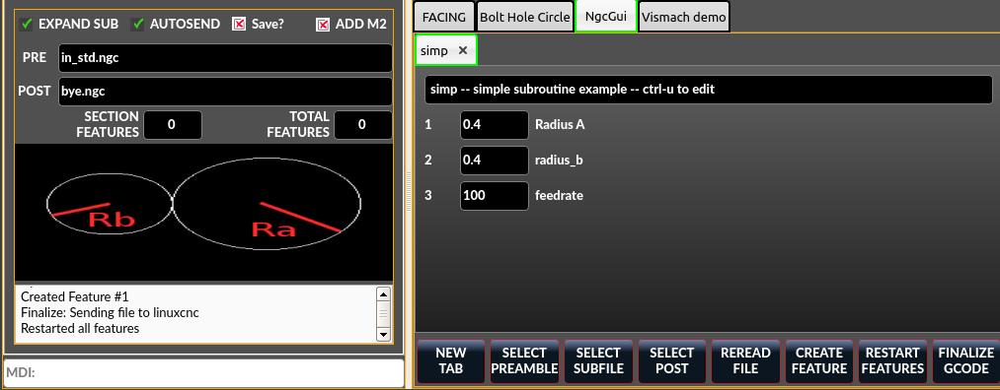
QtVCP's version of NGC subroutine selector (Shown as used in QtDragon).

==== INI settings

LinuxCNC needs to know where to look to run the subroutines. +
If the subroutine calls other subroutines or custom M codes, those paths must be added too.

[source,{ini}]
----
[RS274NGC]
SUBROUTINE_PATH = ~/linuxcnc/nc_files/examples/ngcgui_lib:~/linuxcnc/nc_files/examples/ngcgui_lib/utilitysubs
----

QtVCP needs to know where to open subroutines from. +
You can also specify subroutines to be pre-opened in tabs.

[source,{ini}]
----
[DISPLAY]
# NGCGUI subroutine path.
# This path must also be in [RS274NGC] SUBROUTINE_PATH
NGCGUI_SUBFILE_PATH = ~/linuxcnc/nc_files/examples/ngcgui_lib
# pre selected programs tabs
# specify filenames only, files must be in the NGCGUI_SUBFILE_PATH
NGCGUI_SUBFILE = slot.ngc
NGCGUI_SUBFILE = qpocket.ngc
----

==== Buttons

* 'NEW TAB' - add new blank tab to NGCGUI
* 'SELECT PREAMBLE' - select a file that add preamble G-code
* 'SELECT SUBFILE' - select a NGCGUI subroutine file
* 'SELECT POST' - select a file that add post G-code
* 'REREAD FILE' - reload the subroutine file
* 'CREATE FEATURE' - add feature to the list
* 'RESTART FEATURE' - remove all features from the list
* 'FINALIZE GCODE' - create the full G-code and send it to LinuxCNC/a file

==== Adding Custom Subroutines
You can create your own subroutines for use with NGCGUI.
They must follow these rules:

* For creating a subroutine for use with NGCGUI, the filename and the subroutine name must be the same.
* The subroutine must be in a folder within LinuxCNC's INI designated search path.
* On the first line there may be a comment of type info:
* The subroutine must be surrounded by the sub and endsub tags.
* The variables used must be numbered variables and must not skip number.
* Comments and presets may be included.
* If an image file of the same name is in the folder, it will be shown.

[source,{css}]
----
(info: feedrate -- simple example for setting feedrate)
o<feedrate> sub
    #<feedrate>       = #1 (= 6 Feed Rate) ; comments in brackets will be shown in ngcui
    f#<feedrate>
o<feedrate> endsub
----

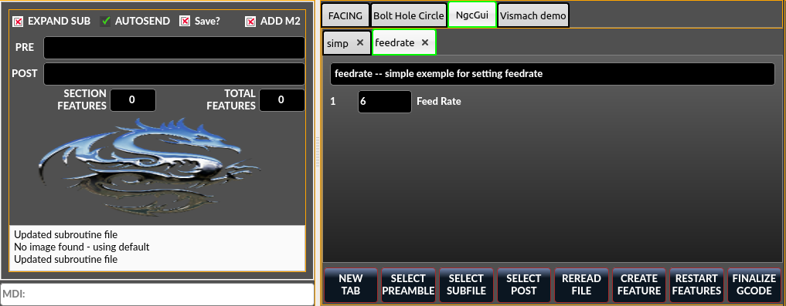

[[sub:qtvcp:widgets:qt-pdf]]
=== Qt PDF

Allows adding loadable PDFs to a screen.

[[sub:qtvcp:widgets:qt-vismach]]
=== Qt Vismach

Use this to build/add OpenGl simulated machines.

=== Hal Selection Box
This widget is combobox that will allows selection of a pin or signal on the system. +

[source,python]
----
from qtvcp.widgets.hal_selectionbox import HALSelectionBox

    def buildComboBox(self):
        # combo box for HAL pin selection
        combobox = HALSelectionBox()
        combobox.setShowTypes([combobox.PINS,combobox.SIGNALS])
        combobox.setPinTypes([combobox.HAL_BIT], direction = [combobox.HAL_IN])
        combobox.setSignalTypes([combobox.HAL_BIT], driven = [False,True])
        combobox.hal_init()
        combobox.selectionUpdated.connect(lambda w: self.signalSelected(w))

    def signalSelected(self, sig):
        print('Watching:',sig)

----

There are function calls

[source,python]
----
# set the list of types to show from: PINS SIGNALS
combobox.setShowTypes([combobox.PINS])

# set the pin types to show: HAL_BIT,HAL_FLOAT,HAL_S32,HAL_U32
# and a list of directions: HAL_IN HAL_OUT
combobox.setPinTypes(types=[combobox.HAL_BIT], direction = [HAL_IN])

# set the signal types to show: HAL_BIT,HAL_FLOAT,HAL_S32,HAL_U32
# and a list of driven/undriven (by a connected pin) to show
combobox.setSignalTypes( types=[combobox.HAL_BIT], driven = [True,True])
----

// vim: set syntax=asciidoc:
