:lang: en
:toc:

[[cha:qtvcp]]
= QtVCP

// Custom lang highlight
// must come after the doc title, to work around a bug in asciidoc 8.6.6
:ini: {basebackend@docbook:'':ini}
:hal: {basebackend@docbook:'':hal}
:ngc: {basebackend@docbook:'':ngc}
:css: {basebackend@docbook:'':css}

QtVCP is an *infrastructure to build custom CNC screens or control panels for LinuxCNC*.

It displays a _`.ui` file built with Qt Designer_ screen editor and
combines this with _Python programming_ to create a GUI screen for
running a CNC machine.

QtVCP is completely _customizable_: you can add different buttons and
status LEDs etc. or add Python code for even finer grain customization.

== Showcase

Few examples of QtVCP built screens and virtual control panels:

.QtDragon - 3/4-Axis Sample
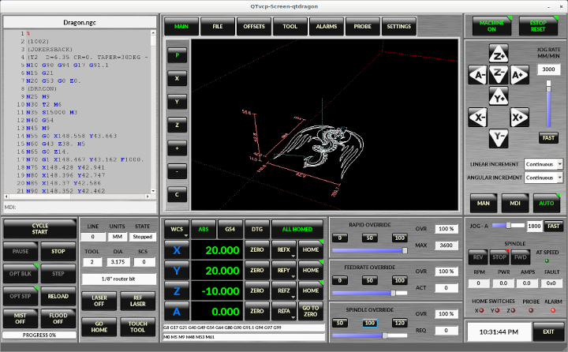

.QtDefault - 3-Axis Sample
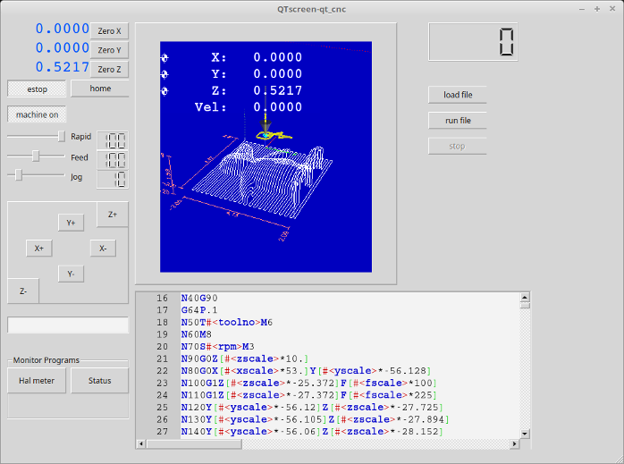

.QtAxis - Self Adjusting Axis Sample
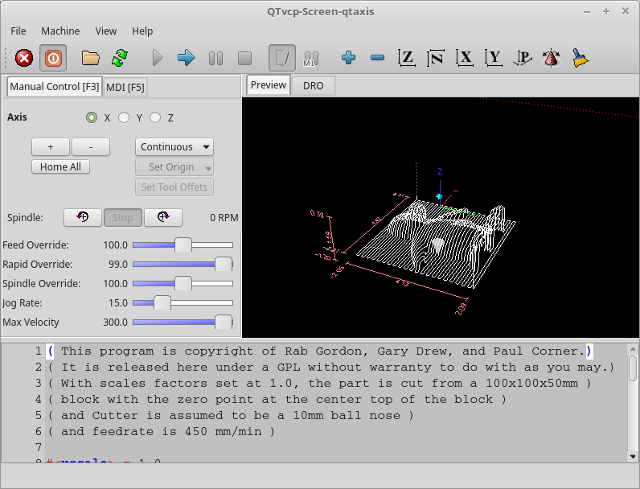

.Blender - 4-Axis Sample
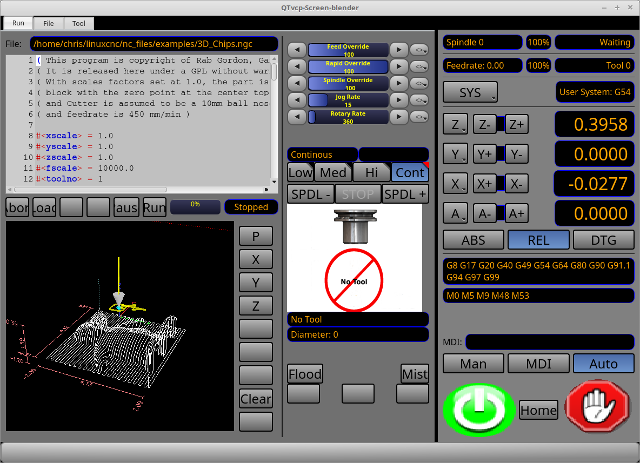

.X1mill - 4-Axis Sample
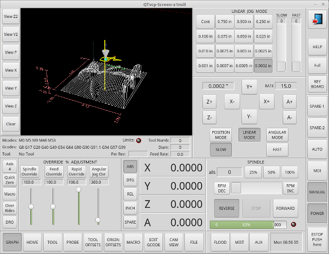

.cam_align - Camera Alignment VCP
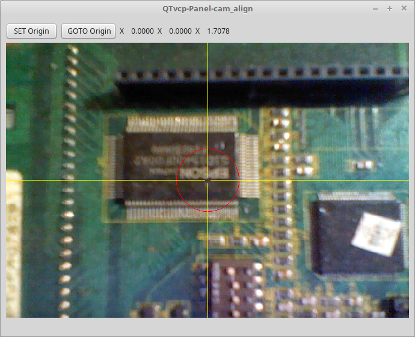

.test_panel - Test Panel VCP
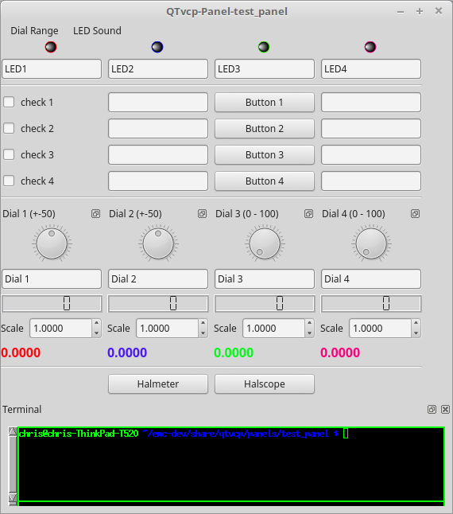

[[sec:qtvcp-overview]]
== Overview(((QtVCP Overview)))

_Two files are used, individually or in combination_, to add customizations:

* A *UI file* that is a _XML_ file made with _Qt Designer_ graphical editor.
* A *handler file* which is a _Python_ code text file.

Normally QtVCP uses the stock UI and handler file, but you can specify
QtVCP to use 'local' UI and handler files. +
A *'local' file* is one that is in the _configuration folder_ that defines
the rest of the machine's requirements.

One is not restricted to adding a custom panel on the right or a custom
tab as QtVCP leverages _Qt Designer_ (the editor) and _PyQT5_ (the
widget toolkit).

QtVCP has some added *special LinuxCNC widgets and actions*. +
There are special widgets to bridge third party widgets to HAL pins. +
It's possible to create widget responses by connecting signals to
Python code in the handler file.

=== QtVCP Widgets

QtVCP uses the *PyQt5 toolkit's widgets* for LinuxCNC integration.

*Widget* is the _general name for user interface objects_ such as buttons and labels in PyQT5.

You are free to use any available *default widgets* in the Qt Designer editor.

There are also *special widgets* made for LinuxCNC that make integration easier. +
These are split in three heading on the left side of the editor:

//TODO Add links to sections of QtVCP Widgets chapter
* One is for _HAL only widgets_;
* One is for _CNC control widgets_;
* One is for _Dialog widgets_.

You are free to mix them in any way on your panel.

A very important widget for CNC control is the *`ScreenOptions` widget*:
It does not add anything visually to the screen but, allows important details to be selected rather then be coded in the handler file.

=== INI Settings

If you are using QtVCP to make a CNC motion control screen (rather then a HAL based panel), in the INI file, in the `[DISPLAY]` section, add a line with the following pattern:

[source,{ini}]
----
DISPLAY = qtvcp <options> <screen_name>
----

[NOTE]
All `<options>` must appear before `<screen_name>`.

.Options

* `-d` Debugging on.
* `-i` Enable info output.
* `-v` Enable verbose debug output.
* `-q` Enable only error debug output.
* `-a` Set window always on top.
* `-c NAME` HAL component name. Default is to use the UI file name.
* `-g GEOMETRY` Set geometry WIDTHxHEIGHT+XOFFSET+YOFFSET. Values are in pixel units,
  XOFFSET/YOFFSET is referenced from top left of screen.
  Use -g WIDTHxHEIGHT for just setting size or -g +XOFFSET+YOFFSET for just position.
  Example: `-g 200x400+0+100`
* `-H FILE` Execute hal statements from FILE with halcmd after the component is set up and ready.
* `-m` Maximize window.
* `-f` Fullscreen the window.
* `-t THEME` Default is system theme
* `-x XID` Embed into a X11 window that doesn't support embedding.
* `--push_xid` Send QtVCP's X11 window id number to standard output; for embedding.
* `-u USERMOD` File path of a substitute handler file.
* `-o USEROPTS` Pass a string to QtVCP's handler file under `self.w.USEROPTIONS_` list variable. Can be multiple -o.

.<screen_name>
`<screen_name>` is the _base name of the .ui and _handler.py files_.
If `<screen_name>` is missing, the default screen will be loaded.

QtVCP assumes the UI file and the handler file use the *same base name*.
QtVCP will first search the LinuxCNC configuration directory that was launched for the files, then in the system skin folder holding standard screens.

.Cycle Times

[source,{ini}]
----
[DISPLAY]
CYCLE_TIME = 100
GRAPHICS_CYCLE_TIME = 100
HALPIN_CYCLE = 100
----

Adjusts the response rate of the GUI updates in milliseconds.
Defaults to 100, useable range 50 - 200.

The widgets, graphics and HAL pin update can be set separately.

If the update time is not set right the screen can become unresponsive or very jerky.

=== Qt Designer UI File

A Qt Designer file is a text file organized in the _XML_ standard that describes the *layout and widgets* of the screen.

_PyQt5_ uses this file to build the display and react to those widgets.

The Qt Designer editor makes it relatively easy to build and edit this file.

=== Handler Files

A handler file is a file containing _Python_ code, which *adds to QtVCP default routines*.

A handler file allows one to _modify defaults_, or _add logic_ to a QtVCP screen without having to modify QtVCP's core code.
In this way you can have *custom behaviors*.

If present a handler file will be loaded.
*Only one file* is allowed.

=== Libraries Modules

QtVCP, as built, does little more than display the screen and react to widgets.
For more *prebuilt behaviors* there are available libraries (found in `lib/python/qtvcp/lib` in RIP LinuxCNC install).

*Libraries* are prebuilt _Python modules_ that *add features* to QtVCP.
In this way you can select what features you want - yet don't have to build common ones yourself.

Such libraries include:

* `audio_player`
* `aux_program_loader`
* `keybindings`
* `message`
* `preferences`
* `notify`
* `virtual_keyboard`
* `machine_log`

=== Themes

Themes are a way to modify the *look and feel* of the widgets on the screen.

For instance the _color_ or _size_ of buttons and sliders can be changed using themes.

The _Windows theme_ is default for screens. +
The _System theme_ is default for panels.

To see available themes, they can be loaded by running the following command in a terminal:

----
qtvcp -d -t <theme_name>
----

QtVCP can also be customized with _Qt stylesheets (QSS)_ using CSS.

=== Local Files

If present, local UI/QSS/Python files in the configuration folder will be loaded instead of the stock UI files.

Local UI/QSS/Python files allow you to use your customized designs rather than the default screens.

QtVCP will look for a folder named <screen_name> (in the launched configuration folder that holds the INI file).

In that folder, QtVCP will load any of the available following files:

* `<screen_name>.ui`,
* `<screen_name>_handler.py`, and
* `<screen_name>.qss`.

[[cha:qtvcp:modifying-screens]]
=== Modifying Stock Screens

There are _three ways_ to customize a screen/panel.

==== Minor StyleSheet Changes
Stylesheets can be used to *set Qt properties*.
If a widget uses properties then they usually can be modified by stylesheets.

.Example of a widget with accompanying style sheet settings.
[source,{css}]
----
State_LED #name_of_led{
  qproperty-color: red;
  qproperty-diameter: 20;
  qproperty-flashRate: 150;
  }
----

==== Handler Patching - Subclassing Builtin Screens
We can have QtVCP load a subclassed version of the standard handler file. in that file we can manipulate the original functions or add new ones. +
Subclassing just means our handler file first loads the original handler file and adds our new code on top of it - so a patch of changes. +
This is useful for changing/adding behaviour while still retaining standard handler updates from LinuxCNC repositories. +

You may still need to use the handler copy dialog to copy the original handler file to decide how to patch it.
See 'custom handler file'

There should be a folder in the config folder; for screens: named '<CONFIG FOLDER>/qtvcp/screens/<SCREEN NAME>/' +
add the handle patch file there, named like so <ORIGINAL SCREEN NAME>_handler.py +
ie for Qtdragon the file would be called 'qtdragon_handler.py' +

Here is a sample to add X axis jog pins to a screen like Qtdragon: +

[source,python]
----
import sys
import importlib
from qtvcp.core import Path, Qhal, Action
PATH = Path()
QHAL = Qhal()
ACTION = Action()

# get reference to original handler file so we can subclass it
sys.path.insert(0, PATH.SCREENDIR)
module = "{}.{}_handler".format(PATH.BASEPATH,PATH.BASEPATH)
mod = importlib.import_module(module, PATH.SCREENDIR)
sys.path.remove(PATH.SCREENDIR)
HandlerClass = mod.HandlerClass

# return our subclassed handler object to QtVCP
def get_handlers(halcomp, widgets, paths):
    return [UserHandlerClass(halcomp, widgets, paths)]

# sub class HandlerClass which was imported above
class UserHandlerClass(HandlerClass):
    # add a terminal message so we know this got loaded
    print('\nCustom subclassed handler patch loaded.\n')

    def init_pins(self):
        # call original handler init_pins function
        super().init_pins()

        # add jog pins X axis
        pin = QHAL.newpin("jog.axis.jog-x-plus", QHAL.HAL_BIT, QHAL.HAL_IN)
        pin.value_changed.connect(lambda s: self.kb_jog(s, 0, 1, fast = False, linear = True))

        pin = QHAL.newpin("jog.axis.jog-x-minus", QHAL.HAL_BIT, QHAL.HAL_IN)
        pin.value_changed.connect(lambda s: self.kb_jog(s, 0, -1, fast = False, linear = True))
----

==== Minor Python Code Changes

Another Python file can be used to *add commands* to the screen, after the handler file is parsed.
This can be useful for minor changes while still honouring standard handler updates from LinuxCNC repositories.

[NOTE]
Handler patching is a better way to add changes - instance patching is black magic voodoo - this is here for legacy reasons.

In the _INI file_ under the `[DISPLAY]` heading add *`USER_COMMAND_FILE = _PATH_`* +
_PATH_ can be any valid path.
It can use `~` for home directory or `WORKINGFOLDER` or `CONFIGFOLDER` to represent QtVCP's idea of those directories:

[source,{ini}]
----
[DISPLAY]
USER_COMMAND_FILE = CONFIGFOLDER/<screen_name_added_commands>
----

If no entry is found in the _INI_, QtVCP will look in the *default path*.
The default path is in the configuration directory as a hidden file using the screen basename and rc, e.g., *`CONFIGURATION DIRECTORY/.<screen_name>rc`*.

This file will be read and executed as Python code in the *handler file context*.

*Only local functions and local attributes* can be referenced. +
Global libraries defined in the screen's handler file can be referenced by importing the handler file. +
These are usually seen as all capital words with no preceding self. +
'self' references the window class functions +
'self.w' typically references the widgets

What can be used can vary by screen and development cycle.

.A simple example
Reference the main window to change the title (won't show if using INI entries for title change).

[source,python]
----
self.w.setWindowTitle('My Title Test')
----

.An advanced instance patching example
This could work with the Qtdragon screen's handler file. +
Here we show how to add new functions and override existing ones.

[source,python]
----
# Needed to instance patch.
# reference: https://ruivieira.dev/python-monkey-patching-for-readability.html
import types

# import the handlerfile to get reference to its libraries.
# use <screenname>_handler
import qtdragon_handler as hdlr

# This is actually an unbounded function with 'obj' as a parameter.
# You call this function without the usual preceding 'self.'.
# This is because will will not be patching it into the original handler class instance
# It will only be called from code in this file.
def test_function(obj):
    print(dir(obj))

# This is a new function we will added to the existing handler class instance.
# Notice it calls the unbounded function with 'self' as an parameter 'self' is the only global reference available.
# It references the window instance.
def on_keycall_F10(self,event,state,shift,cntrl):
    if state:
        print ('F10')
        test_function(self)

# This will be used to override an existing function in the existing handler class instance.
# Note, we also call a copy of the original function too.
# This shows how to extend an existing function to do extra functions.
def on_keycall_F11(self,event,state,shift,cntrl):
    if state:
        self.on_keycall_F11_super(event,state,shift,cntrl)
        print ('Hello')

# We are referencing the KEYBIND library that was instantiated in the original handler class instance
# by adding 'hdlr.' to it (from the imp).
# This function tells KEYBIND to call 'on_keycall_F10' when F10 is pressed.
hdlr.KEYBIND.add_call('Key_F10','on_keycall_F10')

# Here we are instance patching the original handler file to add a new function
# that calls our new function (of the same name) defined in this file.
self.on_keycall_F10 = types.MethodType(on_keycall_F10, self)

# Here we are defining a copy of the original 'on_keycall_F11' function,
# so we can call it later. We can use any valid, unused function name.
# We need to do this before overriding the original function.
self.on_keycall_F11_super = self.on_keycall_F11

# Here we are instance patching the original handler file to override an existing function
# to point to our new function (of the same name) defined in this file.
self.on_keycall_F11 = types.MethodType(on_keycall_F11, self)

# add a new pin to the screen:

# pin callback to print the state
def new_pin_changed(data):
    print(data)

# Special function that gets called before the HAL component is set ready.
# Here we used the function to add a bit input pin with a callback.
def after_override__(self):
    try:
        pin = hdlr.QHAL.newpin("new_pin", hdlr.QHAL.HAL_BIT, hdlr.QHAL.HAL_IN)
        pin.value_changed.connect(new_pin_changed)
    except Exception as e:
        print(e)

# Here we are instance patching the original handler file to add a new function
# that calls our new function (of the same name) defined in this file.
self.after_override__ = types.MethodType(after_override__, self)

----

==== Full Creative Control with custom handler/ui files
If you wish to *modify a stock screen* with full control, _copy its UI
and handler file to your configuration folder_.

There is a QtVCP panel to help with this:

* Open a terminal and run the following command:
+
----
qtvcp copy
----

* Select the screen and destination folder in the dialog
* If you wish to *name your screen* differently than the builtin screen's default name, change the _basename_ in the edit box.
* There should be a folder in the config folder; for screens: named '<CONFIG FOLDER>/qtvcp/screens/' for panels:  named '<CONFIG FOLDER>/qtvcp/panels/' add the folders if they are missing and copy your folder/files in it.
* Validate to copy all the files
* Delete the files you don't wish to modify so that the original files will be used.

[[sec:qtvcp:vcp-panels]]
== VCP Panels

QtVCP can be used to create control panels that interface with *HAL*.

=== Builtin Panels

There are several *builtin HAL panels* available.

In a terminal type `qtvcp <return>` to see a list:

*`test_panel`*:: Collection of useful widgets for testing HAL components, including speech of LED state.
+
.QtVCP HAL Test Builtin Panel
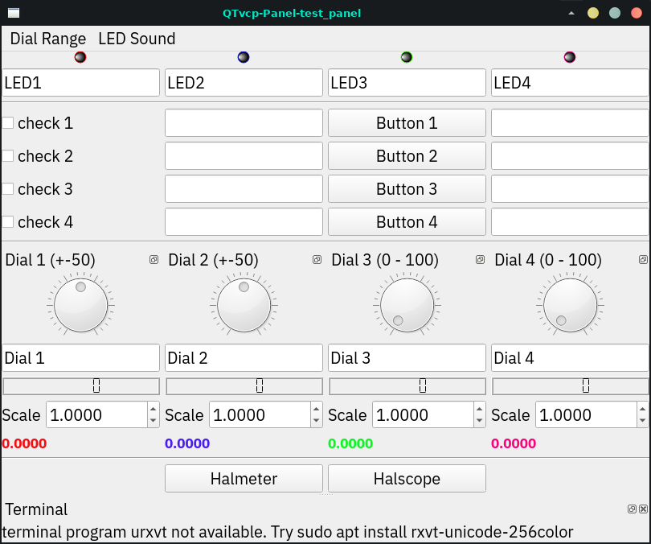

*`cam_align`*:: A camera display widget for rotational alignment.
+
.cam_align - Camera Alignment VCP

*`sim_panel`*::
  A small control panel to simulate MPG jogging controls etc. +
  For simulated configurations.
+
.QtVCP Sim Builtin Panel
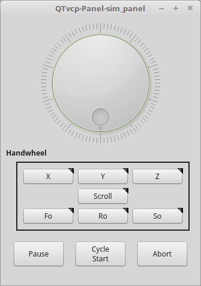

*`vismach_mill_xyz`*:: 3D OpenGL view of a 3-axis milling machine.
+
.QtVismach - 3-Axis Mill Builtin Panel
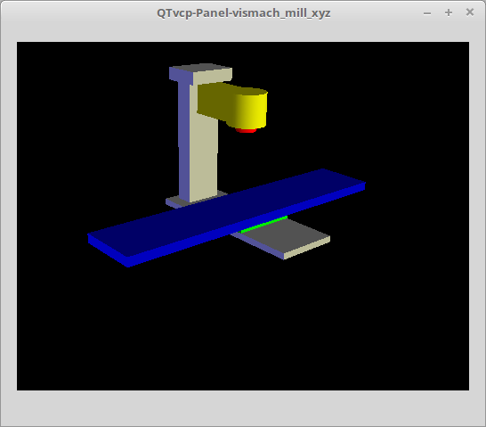

You can load these from the terminal or from a HAL file with this basic command:

[source,{hal}]
----
loadusr qtvcp test_panel
----

But more typically like this:

[source,{hal}]
----
loadusr -Wn test_panel qtvcp test_panel
----
In this way HAL will wait till the HAL pins are made before continuing on.

=== Custom Panels

You can of course *make your own panel and load it*.

If you made a UI file named `my_panel.ui` and a HAL file named `my_panel.hal`, you would then load this from a terminal with:

----
halrun -I -f my_panel.hal
----

.Example HAL file loading a QtVCP panel
[source,{hal}]
----
# load realtime components
loadrt threads
loadrt classicladder_rt

# load non-realtime programs
loadusr classicladder
loadusr -Wn my_panel qtvcp my_panel.ui  # <1>

# add components to thread
addf classicladder.0.refresh thread1

# connect pins
net bit-input1     test_panel.checkbox_1        classicladder.0.in-00
net bit-hide       test_panel.checkbox_4        classicladder.0.hide_gui

net bit-output1    test_panel.led_1             classicladder.0.out-00

net s32-in1        test_panel.doublescale_1-s   classicladder.0.s32in-00

# start thread
start
----

<1> In this case we load `qtvcp` using *`-Wn`* which waits for the panel to finish loading before continuing to run the next HAL command. +
    This is to _ensure that the panel created HAL pins are actually done_ in case they are used in the rest of the file.

== Build A Simple Clean-sheet Custom Screen

.QtVCP Ugly custom screen
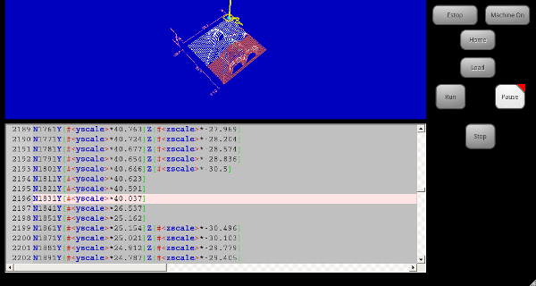

=== Overview

To build a panel or screen:

* Use Qt Designer to build a design you like and save it to your configuration folder with a name of your choice, ending with `.ui`
* Modify the configuration INI file to load QtVCP using your new `.ui` file.
* Then connect any required HAL pins in a HAL file.

=== Get Qt Designer To Include LinuxCNC Widgets

//TODO Create a Qt Designer install section, or chapter (maybe in docs/src/code)
//TODO Convert https://github.com/LinuxCNC/linuxcnc/blob/master/lib/python/qtvcp/designer/README.txt to AsciiDoc and include it directly in install section/chapter
//TODO Upgrade install to document use of https://github.com/LinuxCNC/linuxcnc/blob/master/lib/python/qtvcp/designer/install_script

.Install Qt Designer
First you must have the *Qt Designer installed*. +
The following commands should add it to your system, or use your package manager to do the same:

----
sudo apt-get install qttools5-dev-tools qttools5-dev libpython3-dev
----

////
FIXME Do we need to keep this ?
Luego necesita agregar la biblioteca de carga del módulo python.
QtVCP usa QT5 con python2. Esta combinación normalmente no está
disponible desde repositorios. Puede compilarlo usted mismo, o hay
versiones precompiladas disponible para sistemas comunes.
En 'lib/python/qtvcp/designer' hay carpetas basadas en arquitecturas de
sistema y luego la versión QT.
Debe elegir la carpeta de arquitectura de la CPU y luego elegir la
serie; 5.5, 5.7 o 5.9 de Qt.
Actualmente el estiramiento de Debian usa 5.7, Mint 12 usa 5.5, Mint 19
usa 5.9.
En caso de duda, verifique la versión de QT5 en el sistema.

Debe descomprimir el archivo y luego copiar esa versión adecuada de 'libpyqt5_py2.so' a esta carpeta '/usr/lib/x86_64-linux-gnu/qt5/plugins/designer'.

(x86_64-linux-gnu podría llamarse algo ligeramente diferente en diferentes sistemas)

Necesitará privilegios de superusuario para copiar el archivo en la carpeta.
////

.Add `qtvcp_plugin.py` link to the Qt Designer Search Path
Then you must add a link to the `qtvcp_plugin.py` in one of the folders that Qt Designer will search into.

In a _RIP_ version of LinuxCNC `qtvcp_plugin.py` will be:

  '~/LINUXCNC_PROJECT_NAME/lib/python/qtvcp/plugins/qtvcp_plugin.py'

For a _Package installed_ version it should be:

  'usr/lib/python2.7/qtvcp/plugins/qtvcp_plugin.py' or
  'usr/lib/python2.7/dist-packages/qtvcp/plugins/qtvcp_plugin.py'

Make a symbolic link to the above file and move it to one of the places Qt Designer searches in.

Qt Designer searches in these two place for links (pick one):

  '/usr/lib/x86_64-linux-gnu/qt5/plugins/designer/python' or
  '~/.designer/plugins/python'

You may need to create the `plugins/python` folder.

.Start Qt Designer:

* For a _RIP install_: +
  Open a terminal, set the environment for LinuxCNC <1>, then load Qt Designer <2> with :
+
----
. scripts/rip-environment   <1>
designer -qt=5              <2>
----

* For a _package install_: +
  Open a terminal and type:
+
----
designer -qt=5
----

If all goes right, Qt Designer will launch and you will see the selectable LinuxCNC widgets on the left hand side.

=== Build The Screen `.ui` File

.Create `MainWindow` Widget
When Qt Designer is first started there is a _'New Form' dialog_ displayed. +
Pick _'Main Window'_ and press the _'Create'_ button. +
A _`MainWindow` widget_ is displayed.

We are going to make this window a specific non resizeable size:

.Set `MainWindow` Minimum and Maximum Size
* Grab the corner of the window and resize to an appropriate size, say 1000x600. +
* Right click on the window and click set _minimum size_.
* Do it again and set _maximum size_.

Our sample widget will now not be resizable.

.Add the `ScreenOptions` Widget
Drag and drop the `ScreenOptions` widget anywhere onto the main window.

This widget doesn't add anything visually but sets up some *common options*.

It's recommended to always _add this widget before any other_.

Right click on the main window, not the `ScreenOptions` widget, and set the _layout_ as vertical to make the `ScreenOptions` fullsized.

.Add Panel Content
On the right hand side there is a panel with tabs for a _Property editor_ and an _Object inspector_.

On the Object inspector click on the _ScreenOptions_. +
Then switch to the Property Editor and, under the _ScreenOptions_ heading, toggle *`filedialog_option`*.
//TODO Explain what this FileDialo_option does

Drag and drop a *`GCodeGraphics`* _widget_ and a *`GcodeEditor`* _widget_. +
Place and resize them as you see fit leaving some room for buttons.

.Add Action Buttons
Add 7 action buttons on to the main window.

If you double click the button, you can add text. +
Edit the button labels for 'Estop', 'Machine On', 'Home', 'Load', 'Run', 'Pause' and 'stop'.

Action buttons _default to no action_ so we must change the properties for defined functions. You can edit the properties:

* directly in the _property editor_ on the right side of Qt Designer, or
* conveniently, left double clicking on the button to launch a _properties dialog_ that allows selecting actions while only displaying relevant data to the action.

We will describe the convenient way first:

* Right click the 'Machine On' button and select _Set Actions_.
* When the dialog displays, use the combobox to navigate to `MACHINE CONTROLS - Machine On`.
* In this case there is no option for this action so select 'OK'. +

Now the button will turn the machine on when pressed.

And now the direct way with Qt Designer's property editor:

* Select the 'Machine On' button.
* Go to the Property Editor on the right side of Qt Designer.
* Scroll down until you find the _ActionButton_ heading.
* Click  the `machine_on` action checkbox you will see in the list of properties and values.

The button will now control machine on/off.

Do the same for all the other button with the addition of:

* With the 'Home' button we must also change the `joint_number` property to `-1`. +
  This tells the controller to _home all the axes_ rather then a specific axis.
* With the 'Pause' button:
** Under the `Indicated_PushButton` heading check the `indicator_option`.
** Under the `QAbstactButton` heading check `checkable`.

.Qt Designer: Selecting Pause Button's Properties
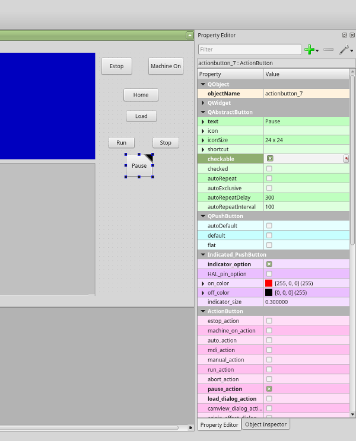

.Save The `.ui` File
We then need to save this design as `tester.ui` in the `sim/qtvcp` folder.

We are saving it as _tester_ as that is a file name that QtVCP recognizes and will use a built in handler file to display it.

=== Handler file

A handler file is *required*.

It allows customizations to be written in Python.

For instance, _keyboard controls_ are usually written in the handler file.

In this example, the built in file `tester_handler.py` is automatically used:
It does the minimum required to display the `tester.ui` defined screen and do basic keyboard jogging.

=== INI Configuration

.[DISPLAY] Section

If you are using QtVCP to make a CNC control screen, under the _INI file_ `[DISPLAY]` heading, set:

[source,{ini}]
----
DISPLAY = qtvcp <screen_name>
----

`<screen_name>` is the _base name_ of the `.ui` and `_handler.py` files.

In our example there is already a sim configuration called tester, that we will use to display our test screen.

.[HAL] Section

If your screen used _widgets with HAL pins_, then you must *connect them in a HAL file*.

QtVCP looks in the _INI file_, under the `[HAL]` heading for the entries below:

*`POSTGUI_HALFILE=<filename>`*::
  Typically `<filename>` would be `+<screen_name>_postgui.hal+`, but can be any legal filename. +
  You can have _multiple `POSTGUI_HALFILE` lines_ in the INI: each will be run one after the other in the order they appear. +
  These commands are _executed after the screen is built_, guaranteeing the widget HAL pins are available.

*`POSTGUI_HALCMD=<command>`*::
  `<command>` would be _any valid HAL command_. +
  You can have _multiple `POSTGUI_HALCMD` lines_ in the INI: each will be run one after the other in the order they appear. +
  To guaranty the widget HAL pins are available, these commands are executed:
  * _after the screen is built_,
  * _after all the POSTGUI_HALFILEs are run_.

In our example there are no HAL pins to connect.

== Handler File In Detail

Handler files are used to _create custom controls using Python_.

=== Overview

Here is a sample handler file.

It's broken up in sections for ease of discussion.

//TODO Move this to a sample_handler.py include
[source,python]
----
############################
# **** IMPORT SECTION **** #
############################
import sys
import os
import linuxcnc

from PyQt5 import QtCore, QtWidgets

from qtvcp.widgets.mdi_line import MDILine as MDI_WIDGET
from qtvcp.widgets.gcode_editor import GcodeEditor as GCODE
from qtvcp.lib.keybindings import Keylookup
from qtvcp.core import Status, Action

# Set up logging
from qtvcp import logger
LOG = logger.getLogger(__name__)

# Set the log level for this module
#LOG.setLevel(logger.INFO) # One of DEBUG, INFO, WARNING, ERROR, CRITICAL

###########################################
# **** INSTANTIATE LIBRARIES SECTION **** #
###########################################

KEYBIND = Keylookup()
STATUS = Status()
ACTION = Action()
###################################
# **** HANDLER CLASS SECTION **** #
###################################

class HandlerClass:

    ########################
    # **** INITIALIZE **** #
    ########################
    # widgets allows access to  widgets from the QtVCP files
    # at this point the widgets and hal pins are not instantiated
    def __init__(self, halcomp,widgets,paths):
        self.hal = halcomp
        self.w = widgets
        self.PATHS = paths

    ##########################################
    # SPECIAL FUNCTIONS SECTION              #
    ##########################################

    # at this point:
    # the widgets are instantiated.
    # the HAL pins are built but HAL is not set ready
    # This is where you make HAL pins or initialize state of widgets etc
    def initialized__(self):
        pass

    def processed_key_event__(self,receiver,event,is_pressed,key,code,shift,cntrl):
        # when typing in MDI, we don't want keybinding to call functions
        # so we catch and process the events directly.
        # We do want ESC, F1 and F2 to call keybinding functions though
        if code not in(QtCore.Qt.Key_Escape,QtCore.Qt.Key_F1 ,QtCore.Qt.Key_F2,
                    QtCore.Qt.Key_F3,QtCore.Qt.Key_F5,QtCore.Qt.Key_F5):

            # search for the top widget of whatever widget received the event
            # then check if it is one we want the keypress events to go to
            flag = False
            receiver2 = receiver
            while receiver2 is not None and not flag:
                if isinstance(receiver2, QtWidgets.QDialog):
                    flag = True
                    break
                if isinstance(receiver2, MDI_WIDGET):
                    flag = True
                    break
                if isinstance(receiver2, GCODE):
                    flag = True
                    break
                receiver2 = receiver2.parent()

            if flag:
                if isinstance(receiver2, GCODE):
                    # if in manual do our keybindings - otherwise
                    # send events to G-code widget
                    if STATUS.is_man_mode() == False:
                        if is_pressed:
                            receiver.keyPressEvent(event)
                            event.accept()
                        return True
                elif is_pressed:
                    receiver.keyPressEvent(event)
                    event.accept()
                    return True
                else:
                    event.accept()
                    return True

        if event.isAutoRepeat():return True

        # ok if we got here then try keybindings
        try:
            return KEYBIND.call(self,event,is_pressed,shift,cntrl)
        except NameError as e:
            LOG.debug('Exception in KEYBINDING: {}'.format (e))
        except Exception as e:
            LOG.debug('Exception in KEYBINDING:', exc_info=e)
            print('Error in, or no function for: %s in handler file for-%s'%(KEYBIND.convert(event),key))
            return False

    ########################
    # CALLBACKS FROM STATUS #
    ########################

    #######################
    # CALLBACKS FROM FORM #
    #######################

    #####################
    # GENERAL FUNCTIONS #
    #####################

    # keyboard jogging from key binding calls
    # double the rate if fast is true
    def kb_jog(self, state, joint, direction, fast = False, linear = True):
        if not STATUS.is_man_mode() or not STATUS.machine_is_on():
            return
        if linear:
            distance = STATUS.get_jog_increment()
            rate = STATUS.get_jograte()/60
        else:
            distance = STATUS.get_jog_increment_angular()
            rate = STATUS.get_jograte_angular()/60
        if state:
            if fast:
                rate = rate * 2
            ACTION.JOG(joint, direction, rate, distance)
        else:
            ACTION.JOG(joint, 0, 0, 0)

    #####################
    # KEY BINDING CALLS #
    #####################

    # Machine control
    def on_keycall_ESTOP(self,event,state,shift,cntrl):
        if state:
            ACTION.SET_ESTOP_STATE(STATUS.estop_is_clear())
    def on_keycall_POWER(self,event,state,shift,cntrl):
        if state:
            ACTION.SET_MACHINE_STATE(not STATUS.machine_is_on())
    def on_keycall_HOME(self,event,state,shift,cntrl):
        if state:
            if STATUS.is_all_homed():
                ACTION.SET_MACHINE_UNHOMED(-1)
            else:
                ACTION.SET_MACHINE_HOMING(-1)
    def on_keycall_ABORT(self,event,state,shift,cntrl):
        if state:
            if STATUS.stat.interp_state == linuxcnc.INTERP_IDLE:
                self.w.close()
            else:
                self.cmnd.abort()

    # Linear Jogging
    def on_keycall_XPOS(self,event,state,shift,cntrl):
        self.kb_jog(state, 0, 1, shift)

    def on_keycall_XNEG(self,event,state,shift,cntrl):
        self.kb_jog(state, 0, -1, shift)

    def on_keycall_YPOS(self,event,state,shift,cntrl):
        self.kb_jog(state, 1, 1, shift)

    def on_keycall_YNEG(self,event,state,shift,cntrl):
        self.kb_jog(state, 1, -1, shift)

    def on_keycall_ZPOS(self,event,state,shift,cntrl):
        self.kb_jog(state, 2, 1, shift)

    def on_keycall_ZNEG(self,event,state,shift,cntrl):
        self.kb_jog(state, 2, -1, shift)

    def on_keycall_APOS(self,event,state,shift,cntrl):
        pass
        #self.kb_jog(state, 3, 1, shift, False)

    def on_keycall_ANEG(self,event,state,shift,cntrl):
        pass
        #self.kb_jog(state, 3, -1, shift, linear=False)

    ###########################
    # **** closing event **** #
    ###########################

    ##############################
    # required class boiler code #
    ##############################

    def __getitem__(self, item):
        return getattr(self, item)
    def __setitem__(self, item, value):
        return setattr(self, item, value)

################################
# required handler boiler code #
################################

def get_handlers(halcomp,widgets,paths):
     return [HandlerClass(halcomp,widgets,paths)]
----

=== IMPORT Section

This section is for *importing required library modules* for your screen.

It would be typical to import QtVCP's _keybinding_, _Status_ and _Action_ libraries.

=== INSTANTIATE LIBRARIES Section

By instantiating the libraries here we *create global reference*.

You can note this by the commands that don't have `self.` in front of them.

By convention we _capitalize the names of globally referenced libraries_.

=== HANDLER CLASS Section

The *custom code* is placed _in a class so QtVCP can utilize it_.

This is the definitions of the handler class.

=== INITIALIZE Section

Like all Python libraries the *`+__init__+` function* is called when the library is _first instantiated_.

This is where you would set up _defaults_, as well as _reference variables_ and _global variables_.

The widget references are not available at this point.

The variables `halcomp`, `widgets` and `paths` give access to QtVCP's HAL component, widgets, and path info respectively.

=== SPECIAL FUNCTIONS Section

There are several _special functions_ that QtVCP looks for in the handler file.

If QtVCP finds these it will call them, if not it will silently ignore them.

*`class_patch__(self):`*::
  _Class patching_, also known as _monkey patching_, allows to *override function calls in an imported module*. +
  Class patching must be done _before the module is instantiated_, and it _modifies all instances_ made after that. +
  An example might be patching button calls from the G-code editor to call functions in the handler file instead. +

*`initialized__(self):`*::
  This function is _called after the widgets and HAL pins are built_. +
  You can manipulate the widgets and HAL pins or add more HAL pins here. +
  Typically there can be
  * preferences checked and set,
  * styles applied to widgets,
  * status of LinuxCNC connected to functions.
  * keybindings would be added.

*`after_override__(self):`*::
  This function is called after the optional override file is loaded but +
  before the optional HAL file is loaded or HAL component is set ready.

*`processed_key_event__(self,receiver,event,is_pressed,key,code,shift,cntrl):`*::
  This function is called to facilitate _keyboard jogging_, etc. +
  By using the _`keybinding` library_ this can be used to easily add functions bound to keypresses.

*`keypress_event__(self,receiver, event):`*::
  This function gives *raw key press events*. +
  It takes _precedence over_ the `processed_key_event`.

*`keyrelease_event__(receiver, event):`*::
  This function gives *raw key release events*. +
  It takes _precedence over_ the `processed_key_event`.

*`before_loop__(self):`*::
  This function is _called just before the Qt event loop is entered_.
  At that point, all widgets/libraries/initialization code has completed and the screen is already displayed.

*`system_shutdown_request__(self):`*::
  If present, this function *overrides the normal function called for total system shutdown*. +
  It could be used to do _pre-shutdown housekeeping_. +
  +
  The Linux _system will not shutdown if using this function_, you will have to do that yourself. +
  QtVCP/LinuxCNC will terminate without a prompt once this function returns.

*`closing_cleanup__(self):`*::
  This function is _called just before the screen closes_.
  It can be used to do cleanup before closing.

//TODO Are there/what are relations b/w system_shutdown_request__() and clocing_cleanup__()

=== STATUS CALLBACKS Section

By convention this is where you would put functions that are *callbacks from STATUS definitions*.

=== CALLBACKS FROM FORM Section

By convention this is where you would put functions that are *callbacks from the widgets connected to the MainWindow* in the Qt Designer editor.

=== GENERAL FUNCTIONS Section

By convention this is where you put your *general functions*.

=== KEY BINDING Section

If you are _using the `keybinding` library_ this is where you place your *custom key call routines*.

The function signature is:

[source,python]
----
def on_keycall_KEY(self,event,state,shift,cntrl):
    if state:
        self.do_something_function()
----

`KEY` being the code (from the keybindings library) for the desired key.

=== CLOSING EVENT Section

Putting the *`closeEvent` function here will catch closing events*.

This _replaces any predefined `closeEvent`_ function from QtVCP.

[source,python]
----
def closeEvent(self, event):
    self.do_something()
    event.accept()
----

NOTE: It is usually better to use the special `closing_cleanup__` function.

== Connecting Widgets to Python Code

It is possible to connect widgets to Python code using *signals and slots*.

In this way you can:

* _Give new functions to LinuxCNC widgets_, or
* _Utilize standard Qt widgets to control LinuxCNC_.

=== Overview

*In the Qt Designer editor*:

* You _create user function slots_
* You _connect the slots to widgets using signals_.

*In the handler file*:

* You _create the slot's functions_ defined in Qt Designer.

[[sub:qtvcp:designer-slots]]
=== Using Qt Designer to add Slots

When you have loaded your screen into Qt Designer, add a plain `PushButton` to the screen. +
You could change the name of the button to something interesting like 'test_button'.

There are two ways to edit connections - This is the graphical way.

* There is a button in the top tool bar of Qt Designer for editing signals.
  After pushing it, if you click-and-hold on the button it will show an arrow (looks like a ground signal from electrical schematic).
* Slide this arrow to a part of the main window that does not have widgets on it.
* A 'Configure Connections' dialog will pop up.
** The list on the left are the available signals from the widget.
** The list on the right are the available slots on the main window and you can add to it.
* Pick the signal `clicked()` - this makes the slots side available.
* Click 'Edit' on the slots list.
* A 'Slots/Signals of MainWindow' dialog will pop up.
* On the slots list at the top there is a '+' icon - click it.
* You can now edit a new slot name.
* Erase the default name `slot()` and change it to `test_button()`
* Press the 'OK' button.
* You'll be back to the 'Configure Connections' dialog.
* Now you can select your new slot in the slot list.
* Then press 'OK' and save the file.

.Qt Designer Signal/Slot Selection
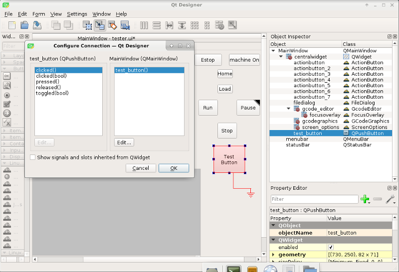

=== Python Handler Changes

Now you must *add the function to the handler file*.

The function signature is *`def slot_name(self):`*.

For our example, we will add some code to print the widget name:

[source,python]
----
def test_button(self):
    name = self.w.sender().text()
    print(name)
----

Add this code under the section named:

[source,python]
----
#######################
# callbacks from form #
#######################
----

In fact it doesn't matter where in the handler class you put the commands but by convention this is where to put it.

Save the handler file.

Now when you load your screen and press the button it should print the name of the button in the terminal.

== More Information

<<cha:qtvcp:panels,QtVCP Builtin Virtual Control Panels>>

<<cha:qtvcp:widgets,QtVCP Widgets>>

<<cha:qtvcp:libraries,QtVCP Libraries>>

<<cha:qtvcp:vismach,Qt Vismach>>

<<cha:qtvcp:code,QtVCP Handler File Code Snippets>>

<<cha:qtvcp:devel,QtVCP Development>>

<<cha:qtvcp:custom-widgets,QtVCP Custom Qt Designer Widgets>>

// vim: set syntax=asciidoc:
