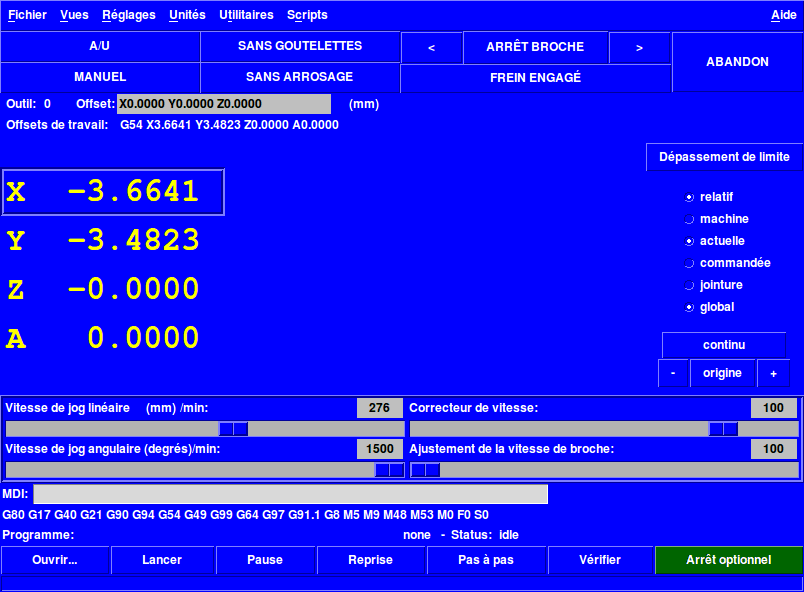
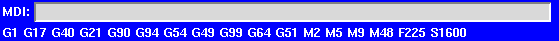

:lang: fr
:toc:

= L'interface graphique TkLinuxCNC

[[cha:TkLinuxCNC]]

== Introduction

TkLinuxCNC(((tklinuxcnc))) est l'interface utilisateur graphique la plus
populaire après Axis, c'est l'interface traditionnelle de LinuxCNC. Elle est
écrite en Tcl(((Tcl))) et utilise le toolkit Tk(((Tk))) pour
l'affichage. Le fait d'être écrite en TCL la rend vraiment très
portable (elle fonctionne sur une multitude de plateformes).

[[cap:affichage-TkLinuxCNC]]
.L'affichage de TkLinuxCNC

== Utiliser TkLinuxCNC

Pour sélectionner l'interface graphique TkLinuxCNC avec LinuxCNC, éditer le
fichier .ini et dans la section [DISPLAY] modifier l'affichage comme
ci-dessous:
----
DISPLAY = tklinuxcnc
----

Puis, lancer LinuxCNC et choisir ce fichier ini. La configuration qui se
trouve dans _sim/tklinuxcnc/tklinuxcnc.ini_ est déjà configurée pour utiliser TkLinuxCNC
comme interface utilisateur.

Quand LinuxCNC est lancé avec TkLinuxCNC, une fenêtre 
<<cap:affichage-TkLinuxCNC,comme celle-ci s'affiche>>.

=== Une session typique avec TkLinuxCNC

 . Lancer LinuxCNC et sélectionner un fichier de configuration.
 . Libérer l'_Arrêt d'Urgence_(((A/U))) et mettre la machine en marche
   (en pressant F1 puis F2).
 . Faire l'_Origine(((Origine Machine))) Machine_ de chacun des axes.
 . Charger un fichier d'usinage.
 . Brider le brut à usiner sur la table.
 . Faire l'_Origine (((Origine Piece)))Pièce_ de chacun des axes, à
   l'aide du jog ou en introduisant une valeur de décalage d'origine après
   un clic droit sur le nom d'un axe.
 . Lancer le programme.
 . Pour refaire une autre pièce identique, reprendre à l'étape 6. Pour
   usiner une pièce différente, reprendre à l'étape 4. Quand c'est
   terminé, quitter LinuxCNC.

== Éléments affichés par TkLinuxCNC

La fenêtre TkLinuxCNC contient les éléments suivants:

 - Une barre de menu permettant diverses actions;
 - Un jeu de boutons permettant d'agir sur le mode de travail,
   Marche/Arrêt de la broche et autres éléments;
 - Une barre de statut pour l'affichage des différents offsets;
 - Une zone d'affichage des coordonnées;
 - Un jeu de curseurs pour contrôler la 
   _vitesse de jog(((vitesse de jog)))_, le 
   _Correcteur de vitesse d'avance(((correcteur de vitesse)))_ et 
   le _Correcteur de vitesse broche(((correcteur vitesse broche)))_ qui
   permettent d'augmenter ou de diminuer ces vitesses ;
 - Une boîte d'entrée de données manuelles(((MDI))); 
 - Une barre de statut affichant le bloc de programme actif, G-codes,
   M-codes, mots F et S;
 - Les boutons relatifs à l'interpréteur;
 - Une zone d'affichage de texte montrant le G-code du programme chargé.

=== Boutons principaux

Dans la première ligne de la gauche vers la droite et cycliquement:

 .  Marche Machine: _Arrêt d'Urgence(((A/U)))_ 
   _Arrêt d'Urgence relâché_ / _Marche_ 
 . Bascule gouttelettes(((Gouttelettes)))
 . Broche moins vite
 . Direction de rotation de la broche(((broche))) _Arrêt broche_ /
   _Broche sens horaire_ / _Broche sens anti-horaire_
 . Broche plus vite
 . Annuler

puis dans la deuxième ligne:

 . Mode de marche: _MANUEL(((Manuel)))_ / _MDI(((MDI))))_ / _AUTO(((Auto)))_
 . Bascule d'arrosage
 . Bascule du contrôle frein de broche

=== Barre de statut des différents offsets

Elle affiche, l'offset de rayon de l'outil courant (sélectionné avec
Txx M6), l'offset éventuel de longueur d'outil si il est actif et les
offsets de travail (ajustables par un clic droit sur les coordonnées).

=== Zone d'affichage des coordonnées

La partie principale affiche la position courante de l'outil. La
couleur varie selon l'état de l'axe. Si l'axe n'est pas référencé il
est affiché en caractères jaunes. Si il est référencé il s'affiche en
vert. Si il est en erreur, TkLinuxCNC l'affiche en rouge pour montrer un
défaut. (par exemple si un contact de fin de course est activé).

Pour interpréter correctement les différentes valeurs, se référer aux
boutons de droite. Si la position est _Machine_, alors la valeur
affichée est en coordonnées machine. Si elle est _Relative_, la valeur
affichée est en coordonnées pièce. Deux autres en dessous indiquent
_actuelle_ ou _commandée_. Actuelle fait référence aux valeurs retournées
par les codeurs (si la machine est équipée de servomoteurs) et
_commandée_ fait référence à la position à atteindre envoyée aux
moteurs. Ces valeurs peuvent différer pour certaines raisons: Erreur de
suivi, bande morte, résolution d'encodeur ou taille de pas. Par
exemple, si un mouvement est commandé vers X0.08 sur une fraiseuse,
mais qu'un pas moteur fait 0.03, alors la position _Commandée_ sera
0.03 mais la position _Actuelle_ sera soit 0.06 (2 pas) soit 0.09 (3
pas).

Deux autres boutons permettent de choisir entre la vue _Articulation_ et
la vue _Globale_. Cela a peu de sens avec les machines de type normal
(cinématiques triviales), mais se révèle très utile sur les machines
avec des cinématiques non triviales telles que les robots ou plateforme
de Stewart. (Des informations plus complètes se trouvent dans le manuel
de l'intégrateur).

==== Parcours d'outil

Quand la machine se déplace, elle laisse un tracé appelé parcours
d'outil. La fenêtre d'affichage du parcours d'outil s'active via le
menu _Vues → Parcours d'outil_.

=== Contrôle en automatique

[[cap:TkLinuxCNC-Interpreteur]]
.Interpréteur de TkLinuxCNC

image::images/tklinuxcnc_interp_fr.png[alt="Interpréteur de TkLinuxCNC"]

==== Boutons de contrôle

Les boutons de contrôle de la partie inférieure de TkLinuxCNC, visibles sur
l'image ci-dessus, sont utilisés pour l'exécution du
programme:

* _Ouvrir_ (((ouvrir))) pour charger un fichier,
* _Lancer_ (((lancer))) pour commencer l'usinage,
* _Pause_ (((pause))) pour stopper temporairement l'usinage,
* _Reprise_ (((reprise))) pour reprendre un programme mis en pause, 
* _Pas à pas_ (((pas a pas))) pour avancer d'une seule ligne de programme,
* _Vérifier_ (((vérifier))) pour vérifier si il contient des erreurs, 
* _Arrêt optionnel_ (((arrêt optionnel))) pour basculer l'arrêt optionnel, si 
   ce bouton est vert l'exécution du programme est stoppée quand un code M1 
   est rencontré.

==== Zone texte d'affichage du programme

Quand un programme est lancé, la ligne courante est affichée en
surbrillance blanche. L'affichage du texte défile automatiquement pour
montrer la ligne courante.

=== Contrôle en manuel

==== Touches implicites

TkLinuxCNC permet les déplacements manuels de la machine. Cette action
s'appelle le _jog_. Premièrement, sélectionner l'axe à déplacer en
cliquant dessus. Puis, cliquer et maintenir les boutons *+* ou *-*
selon la direction du mouvement souhaité. Les quatre premiers axes
peuvent aussi être déplacés à l'aide des touches fléchées pour les axes
X et Y, Pg.préc et Pg.suiv pour l'axe Z et les touches [ et ] pour
l'axe A.

Si _Continu_ est activé, le mouvement sera continu tant que la touche
sera pressée, si une valeur d'incrément est sélectionnée, le mobile se
déplacera exactement de cette valeur à chaque appui sur la touche ou à
chaque clic. Les valeurs disponibles sont:

    1.0000 0.1000 0.0100 0.0010 0.0001

En cliquant le bouton _Origine_ ou en pressant la touche Origine,
l'axe actif est référencé sur son origine machine. Selon la
configuration, la valeur de l'axe peut être simplement mise à la
position absolue 0.0, ou la machine peut se déplacer vers un point
spécifique matérialisé par le _contact d'origine_. Voir le manuel de
l'intégrateur pour plus de détails sur les prises d'origine.

En cliquant le bouton _Dépassement de limite_, la machine permet un
jog temporaire pour même si l'axe à franchi une limite d'axe fixée dans
le fichier .ini. Noter que si _Dépassement de limite_ est activé il
s'affiche en rouge.

[[cap:Override-Limits]]
.Exemple de dépassement de limite et incréments de jog

image::images/tkemc-override-limits.png[alt="Exemple de dépassement de limite et incréments de jog"]

==== Le groupe de boutons _Broche_(((broche)))

Le bouton central du dessus sélectionne le sens de rotation de la
broche: Anti-horaire, Arrêt, Horaire. Les boutons fléchés augmentent ou
diminuent la vitesse de rotation. Le bouton central du dessous permet
d'engager ou de relâcher le frein de broche. Selon la configuration de
la machine, les items de ce groupe ne sont peut être pas tous visibles.

==== Le groupe de boutons _Arrosage_(((arrosage)))

Ces deux boutons permettent d'activer ou non les lubrifiants
_Gouttelettes_ et _Arrosage_. Selon la configuration de la machine, les
items de ce groupe ne sont peut être pas tous visibles.

=== Entrée manuelle de G-code (MDI)

L'entrée manuelle de données (aussi appelée MDI), permet d'entrer et
d'exécuter des lignes de G-code, une à la fois. Quand la machine n'est
pas en marche ni mise en mode MDI, l'entrée de code n'est pas possible.

.Le champ de saisie des entrées manuelles

docs: image alt-tags added
Signed-off-by: Thoren Seufl <t_seufl@gmx.de>==== MDI:

Le mode MDI permet d'exécuter une commande en G-code en pressant la
touche _Entrée_.

==== G-Codes actifs

Ce champs montre les _codes modaux_ actuellement actifs dans
l'interpréteur. Par exemple, *G54* indique que le système de
coordonnées courant est celui de G54 et qu'il s'applique à toutes les
coordonnées entrées.

=== Vitesse de Jog 

En déplaçant ce curseur, la vitesse de jog peut être modifiée. Le
nombre indique une vitesse en unités par minute. Le champs de texte est
cliquable. Un clic ouvre un dialogue permettant d'entrer un nombre.

=== Correcteur de vitesse d'avance travail

En déplaçant ce curseur, la vitesse d'avance travail peut être
modifiée. Par exemple, si la vitesse d'avance travail du programme est
*F600*  et que le curseur est placé sur 120%, alors la vitesse d'avance
travail sera de 720. Le champs de texte est cliquable. Un clic ouvre un
dialogue permettant d'entrer un nombre.

=== Correcteur de vitesse de broche

Le fonctionnement de ce curseur est le même que celui de la vitesse
d'avance, mais il contrôle la vitesse de rotation de la broche. Si le
programme demande S500 (broche à 500 tr/mn) et que le curseur est placé
sur 80%, alors la vitesse de broche résultante sera de 400 tr/mn. Le
minimum et le maximum pour ce curseur sont définis dans le fichier ini.
Par défaut le curseur est placé sur 100%. Le champs de texte est
cliquable. Un clic ouvre un dialogue permettant d'entrer un nombre.

== Raccourcis clavier

La plupart des actions de TkLinuxCNC peuvent être accomplies au clavier.
Beaucoup des raccourcis clavier ne sont pas accessibles en mode MDI.

Les raccourcis clavier les plus fréquemment utilisés sont montrés dans
la table ci-dessous.

[[cap:Raccourcis-clavier-frequents]]
.Les raccourcis clavier les plus utilisés

[width="90%", options="header"]
|========================================
|Touche           | Action
|F1               | Bascule de l'Arrêt d'Urgence
|F2               | Marche/Arrêt machine
|*, 1 .. 9, 0     | Correcteur vitesse d'avance 0% à 100%
|X, *             | Active le premier axe
|Y, 1             | Active le deuxième axe
|Z, 2             | Active le troisième axe
|A, 3             | Active le quatrième axe
|Origine          | POM de l'axe actif
|Gauche, Droite   | Jog du premier axe
|Haut, Bas        | Jog du deuxième axe
|Pg.prec, Pg.suiv | Jog du troisième axe
|[, ]             | Jog du quatrième axe
|Echap            | Arrête l'exécution
|========================================

