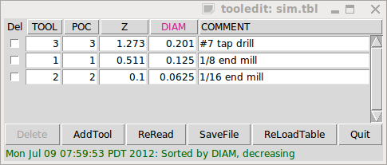
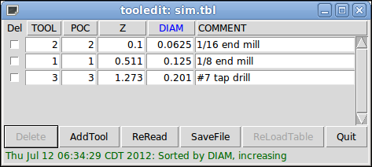
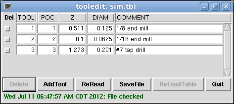

[[cha:tooledit-gui]]

= Tool Edit GUI

== Overview

The 'tooledit' program can update the tool table file with
edited changes by using the SaveFile button.  The SaveFile button
updates the system file but a separate action is required to
update the tool table data used by a running LinuxCNC instance.
With the axis GUI, both the file and the current tool table data
used by LinuxCNC can be updated with the ReloadTable button.
This button is enabled only when the machine is ON and IDLE.

== Column Sorting

The tool table display can be sorted on any column in ascending
order by clicking on the column header.  A second click sorts
in descending order.  Column sorting requires that the machine
is configured with the default tcl version >= 8.5.

Depending upon other applications installed on the system, it may be
necessary to enable tcl/tk8.5 with the commands:
----
sudo update-alternatives --config tclsh  ;# select the option for tclsh8.5
sudo update-alternatives --config wish   ;# select the option for wish8.5
----

== Column Selection
By default, the 'tooledit' program will display all possible
tool table parameter columns.  Since few machines use all
parameters, the columns displayed can be limited with the
following ini file setting:

.INI File Syntax
----
[DISPLAY]
TOOL_EDITOR = tooledit column_name column_name ...
----

.Example for Z and DIAM columns
----
[DISPLAY]
TOOL_EDITOR = tooledit Z DIAM
----

== Stand Alone Use
The 'tooledit' program can also be invoked as a standalone
program. For example, if the program is in the user PATH, typing
'tooledit' will show the usage syntax:

.Stand Alone
----
tooledit
Usage:
tooledit filename
tooledit [column_1 ... column_n] filename
----

To synchronize a standalone 'tooledit' with a running LinuxCNC
application, the filename must resolve to the same [EMCIO]TOOL_TABLE
filename specified in the LinuxCNC ini file.

When using the program 'tooledit' while LinuxCNC is running,
gcode command execution or other programs may alter tool table
data and the tool table file.  File changes are detected by
'tooledit' and a message is displayed:

  Warning: File changed by another process

The 'tooledit' tool table display can be updated to read the
modified file with the ReRead button.

he tool table is specified in the ini file with an entry:

  [EMCIO]TOOL_TABLE = tool_table_filename

The tool table file can be edited with any simple text editor (not
a word processor).

The axis GUI can optionally use an ini file setting to specify the tool
editor program:

  [DISPLAY]TOOL_EDITOR = path_to_editor_program

By default, the program named 'tooledit' is used. This editor
supports all tool table parameters, allows addition and deletion
of tool entries, and performs a number of validity checks on
parameter values.

