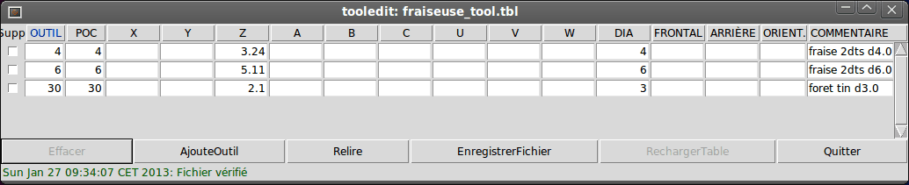
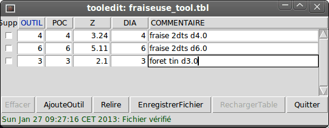
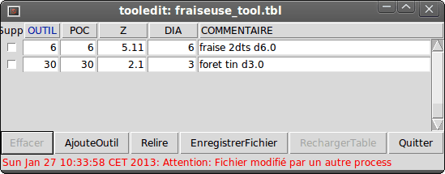

:lang: fr
:toc:

= Éditeur graphique de table d'outils

[[cha:editeur-tooledit]] 

== Versions requises pour l'éditeur d'outils
[NOTE]
Les éléments de tooledit modifiables décrits ici sont disponibles
dans les versions 2.5.1 et suivantes. Dans la version 2.5.0, l'interface
graphique ne permet pas ces ajustements.

Le programme tooledit rafraichi le fichier de la table d'outils avec les
changements édités puis enregistrés avec le bouton _EnregistrerFichier_.
Le bouton _EnregistrerFichier_ met à jour le fichier système mais une action
manuelle dans le menu _Fichier -> Recharger la table d'outils_ est requise pour
mettre à jour la table d'outils en cours d'utilisation par l'instance courante
de LinuxCNC. Avec l'interface graphique Axis, il est toutefois possible, grâce
au bouton _RechargerTable_, de rafraichir le fichier tout en mettant à jour la
table d'outils courante. Ce dernier bouton est disponible uniquement quand la
machine est _En marche_ et inactive.

== Choix des colonnes
Par défaut, le programme tooledit affiche toutes les colonnes utilisables dans
une table d'outils. Très peu de machines utilisent tous les paramètres,
les colonnes affichées peuvent être limitées aux paramètres utilisés. Pour cela,
passer une ligne de paramètre dans le fichier ini, comme ci-dessous:

.Syntaxe
----
[DISPLAY]
TOOL_EDITOR = tooledit nom_colonne nom_colonne ...
----

.Exemple pour les colonnes Z et DIAM
----
[DISPLAY]
TOOL_EDITOR = tooledit Z DIAM
----

.Résultat obtenu
image::images/tooledit-columns_fr.png[align="left", alt="Éditeur graphique de table d’outils - Choix des colonnes"]

== Tri par colonne
Les outils de la table affichée peuvent être triés selon n'importe quelle
colonne, par ordre croissant ou décroissant, en cliquant sur l'entête de la
colonne. Un second clic inverse l'ordre de tri. Le tri par colonne nécessite
une version de TCL/TK >= 8.5

Sous Ubuntu Lucid 10.04 tcl/tk8.4 est installé par défaut. Il est possible
d'ajouter tcl/tk8.5 avec la commande suivante:
----
sudo apt-get install tcl8.5 tk8.5
----

Si le tri ne fonctionne pas il peut être nécessaire d'activer tcl/tk8.5 avec
les commandes:
----
sudo update-alternatives --config tclsh  ;# choisir l'option pour tclsh8.5
sudo update-alternatives --config wish   ;# choisir l'option pour wish8.5
----

== Utilisation autonome
Le programme _tooledit_ peut aussi être invoqué comme un programme autonome.
Par exemple si le programme est dans le PATH de l'utilisateur, taper _tooledit_
en suivant une des syntaxes suivantes selon le besoin:

.Tooledit autonome
----
tooledit
Usage:
tooledit nomfichier
tooledit [colonne_1 ... colonne_n] nomfichier
----

Pour synchroniser un tooledit autonome avec l'application LinuxCNC courante,
le nom de fichier doit être le même que celui spécifié par le paramètre
*[EMCIO]TOOL_TABLE* dans le fichier ini.

Lors de l'utilisation de tooledit pendant la marche de LinuxCNC,
l'exécution d'un g-code ou d'un autre programme peut altérer les données de la
table d'outils. Toute modification est alors détectée par tooledit qui affiche
le message: Attention: Fichier modifié par un autre process

L'affichage de la table d'outils dans tooledit peut être rafraichi par le
bouton _Relire_, pour relire le fichier modifié.

Le nom de la table d'outils est spécifié dans le fichier ini par l'entrée:
----
[EMCIO]TOOL_TABLE = nom_fichier_table_
----

Le fichier de table d'outils est éditable avec n'importe quel simple éditeur de
texte. (et non avec un traitement de texte)

L'interface graphique Axis peut optionnellement utiliser un paramètre du fichier
ini pour spécifier quel éditeur doit être utilisé:
----
[DISPLAY]TOOL_EDITOR = path_pour_editeur
----

Par défaut, le programme tooledit est utilisé. Cet éditeur supporte tous les
paramètres de table d'outils, permet l'ajout ou l'effacement d'outils et fourni
un certain nombre de contrôles de validité des paramètres introduits.

