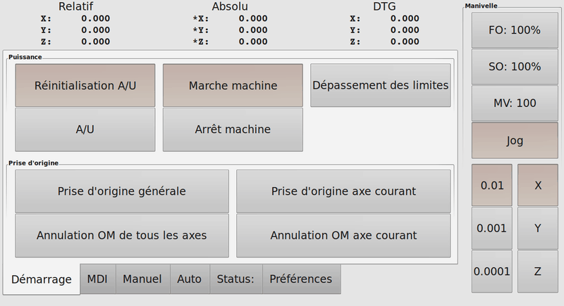

:lang: fr
:toc:

= L'interface graphique Touchy

[[cha:touchy-gui]]

Touchy est une interface utilisateur pour LinuxCNC, destinée à être utilisée avec les
panneaux de commande de machines. Il ne nécessite ni clavier, ni souris.

Il a été conçu pour fonctionner également sur les écrans tactiles, en combinaison
avec une manivelle électronique (MPG) et des boutons et interrupteurs.

.L'interface tactile Touchy

== Panneau de Configuration

=== Connections avec HAL

Touchy requiert qu'un fichier nommé _touchy.hal_ soit créé, dans le même
répertoire de configuration que le fichier ini, pour y connecter ses contrôles.
Touchy exécute les commandes de HAL dans ce fichier après qu'il a créé ses propres
pins, lesquelles sont disponibles pour connexion.

Touchy dispose de plusieurs pins de sortie destinées à être connectées au
contrôleur de mouvement pour gérer les manivelles de jog:

 - touchy.jog.wheel.increment,
    qui doit être connecté à la pin _axis.N.jog-scale_ de chacun des N axes.

 - touchy.jog.wheel.N, qui doit être connecté à _axis.N.jog-enable_ pour
    chacun des N axes.

 - En plus d'être connecté à _touchy.wheel-counts_, le compteur d'impulsions
    de la manivelle doit aussi être connecté à _axis.N.jog-counts_ pour chacun
    des N axes. Si le composant de HAL _ilowpass_ est utilisé pour adoucir les
    mouvements de jog à la manivelle, il faut l'appliquer uniquement sur
    _axis.N.jog-counts_ et non sur _touchy.wheel-counts_.

==== Contrôles requis

 - Un bouton _Abandon_ (contact momentané) connecté sur la HAL pin _touchy.abort_
 - Un bouton de _Départ cycle_ (contact momentané) connecté à _touchy.cycle-start_
 - Volant/Manivelle/MPG, connecté à _touchy.wheel-counts_ et à la pin de mouvement
   comme décrit précédemment.
 - Un bouton à bascule simple (contact à deux positions) connecté à
_touchy.single-block_

==== Contrôles optionnels

 -  Pour le jog continu, un interrupteur à trois positions avec retour au centre
   (ou deux boutons momentanés) pour chacun des axes concernés, attaché à
    _touchy.jog.continuous.x.negative_ et à _touchy.jog.continuous.x.positive_,
    etc. pour les autres axes.
 -  Si un bouton de genouillère est nécessaire, (pour jogger Z en haut de sa
    course en grande vitesse), un bouton à contact momentané sera connecté à
_touchy.quill-up_.

==== Voyants de panneau optionnels

 - _touchy.jog.active_ indique quand les contrôles de jog du panneau sont actifs.
 - _touchy.status-indicator_ est allumé en continu quand la machine exécute un
    G-code et clignote quand la machine est en marche mais en pause, ou en
    vitesse à zéro.

=== Recommandé pour toutes les configurations

 - Un bouton d'Arrêt d'Urgence (A/U) câblé physiquement, dans la chaîne d'arrêt
   d'urgence.

== Réglages

Pour utiliser Touchy, dans la section [DISPLAY] du fichier ini de la machine,
modifier la ligne de cette manière: DISPLAY = touchy

Quand Touchy démarre pour la première fois, vérifier l'onglet _Préférences_.
Dans le cas d'un écran tactile, choisir de cacher le pointeur dans les options,
pour obtenir les meilleurs résultats.

La fenêtre d'état est fixée en haut, ajustée par la taille d'une police fixe.
La résolution de Gnome peut affecter cela. Si le bas de l'écran est coupé, aller
dans le gestionnaire de résolution de Gnome pour revenir au réglage d'origine,
à 96 DPI.

=== Macros

Touchy peut invoquer les macros avec mots O au travers de l'interface MDI. Pour
configurer cette possibilité, dans la section [TOUCHY] du fichier ini, ajouter
une ou plusieurs lignes avec MACRO. Chacune de ces lignes doit respecter le
format suivant:

----
MACRO=increment xinc yinc
----

Dans lequel, _increment_ est le nom de la macro, laquelle accepte deux paramètres,
nommés ici _xinc_ et _yinc_.

Maintenant, placer la macro proprement dite dans un fichier nommé
_increment.ngc_. La variable PROGRAM_PREFIX du fichier ini pourra être
utilisée pour identifier le répertoire contenant ce fichier. Il est également
possible de le déclarer dans la variable SUBROUTINE_PATH.

Elle pourrait ressembler à cela:

----
O<increment> sub
G91 G0 X#1 Y#2
G90
O<increment> endsub
----

Noter que le nom du sous-programme, le nom de la macro ainsi que le nom du
fichier .ngc doivent correspondre exactement, y compris les minuscules/
majuscules des noms.

Quand la macro est invoquée en pressant le bouton _Macro_ dans l'onglet MDI
de Touchy, il est possible de saisir des valeurs pour xinc et yinc, lesquelles
seront passées à la macro comme étant respectivement *#1* et *#2*. Les
paramètres laissées vides sont passés comme des valeur *0*.

Si il y a plusieurs macros différentes, presser le bouton _Macro_
répétitivement pour les faire défiler.

Dans notre petit exemple, si -1 est entré pour xinc puis que le _Départ cycle_
est pressé, un *G0*, sera invoqué, provoquant un déplacement en vitesse rapide,
vers la gauche, de une unité machine.

Cette capacité d'utilisation des macros est très utile pour le palpage de 
contours ou d'orifices ainsi que pour d'autres opérations simples 
pré-configurées, de fraisage ou de perçage, qui pourront être réalisées depuis 
le panneau de Touchy sans avoir, pour cela, à écrire de programme G-code.

