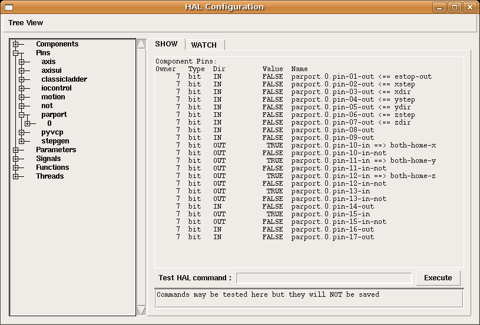
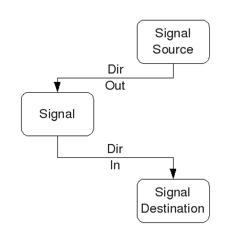

:lang: fr
:toc:

= Commandes et composants de base

[[sec:Commandes-de-HAL]]

== Commandes de Hal

Des informations plus détaillées peuvent être trouvées dans la man
page en tapant 'man halcmd' dans une console. Pour voir la
configuration de HAL ainsi que le statut de ses pins et paramètres
utiliser la fenêtre HAL Configuration dans le menu 'Machine' d'AXIS.
Pour visualiser le statut des pins, ouvrir l'onglet 'Watch' puis
cliquer dans l'arborescence sur les pins qui doivent être visualisées
dans la fenêtre watch.

.Fenêtre de configuration de HAL

=== loadrt

La commande 'loadrt' charge un composant temps réel de HAL. Les
composants temps réel doivent être ajoutés au thread temps réel pour
être fonctionnels. Il n'est pas possible de charger un composant de
l'espace utilisateur dans l'espace temps réel.

Syntaxe et exemple:

----
loadrt <component> <options>

loadrt mux4 count=1
----

=== addf

La commande 'addf' ajoute une fonction à un thread temps réel. Si
l'assistant StepConf a été utilisé pour créer la configuration, deux
threads ont été créés.

 - base-thread (le thread haute vitesse) ce thread prends en main les
   items nécessitant une réponse très rapide comme la génération
   d'impulsions, la lecture et l'écriture sur le port parallèle.
 - servo-thread (le thread basse vitesse) ce thread prends en main les
   items n'étant pas influencés par la vitesse comme le contrôleur de
   mouvement, l'API Classic Ladder et les commandes manuelles.

Syntaxe et exemple:
----
addf <component> <thread>

addf mux4 servo-thread
----

=== loadusr[[sec:loadusr]]

La commande 'loadusr' charge un composant de HAL de l'espace
utilisateur. Les programmes de l'espace utilisateur ont leur propre
processus séparé qui optionnellement communique avec les autres composants
de HAL via leurs pins et paramètres. Il n'est pas possible de charger
un composant temps réel dans l'espace utilisateur.

Les drapeaux peuvent être un ou plusieurs parmi les suivants:

-W::
     pour attendre que le composant soit prêt. Le composant est supposé
    avoir le même nom que le premier argument de la commande.

-Wn <nom>::
    pour attendre un composant, qui porte le nom donné sous la forme <nom>.

-w::
    pour attendre la fin du programme

-i::
    pour ignorer la valeur retournée par le programme (avec -w)

Syntaxe et exemple:
----
loadusr <component> <options>

loadusr halui
loadusr -Wn spindle gs2_vfd -n spindle
----

En anglais ça donne 'loadusr wait for name spindle component gs2_vfd name spindle'.
Le -n spindle est une partie du composant gs2_vfd et non de la commande loadusr.

=== net[[sub:net]]

La commande 'net' crée une 'connexion' entre un signal et une ou plusieurs pins.
Si le signal n'existe pas, net le crée. Les flèches de direction '<=', '=>' et
'<=>' sont seulement là pour aider à la lecture de la logique, ils ne sont pas
utilisés par la commande net. Un espace doit séparer les flèches de direction 
des noms de pin.

.Syntaxe et exemple:
----
net signal-name pin-name <direction optionnelle> (<second pin-name optionnel>)

net home-x axis.0.home-sw-in <= parport.0.pin-11-in
----

Dans l'exemple ci-dessus, 'home-x' est le nom du signal, 'axis.0.home-sw-in' est
une pin de direction IN, '<=' est une flèche de direction optionnelle et
'parport.0.pin-11-in' est une pin de direction OUT. Cela peut paraître déroutant
mais les labels in et out, pour une broche de port parallèle, indiquent la
direction physique dans laquelle travaille la broche et non comment elle est
traitée dans HAL.

Une pin peut être connectée à un signal si elle obéit aux règles suivantes:

* Une pin IN peut toujours être connectée à un signal.
* Une pin IO peut être connectée à moins qu'une pin OUT soit présente sur le signal.
* Une pin OUT peut être connectée seulement si il n'y a pas d'autre pin OUT ou IO
  sur le signal.

Le même 'signal-name' peut être utilisé dans de multiples commandes net pour
connecter des pins additionnelles, tant que les règles précédentes sont observées.

.Direction du signal[[cap:Signal-Direction]]

Voici un exemple qui montre le signal xStep avec la source qui est stepgen.0.out
et avec deux lecteurs, parport.0.pin-02-out etparport.0.pin-08-out. Simplement
la valeur de stepgen.0.out est envoyée au signal xStep et cette valeur est alors
envoyée sur parport.0.pin-02-out.
----
#   signal    source            destination
net xStep stepgen.0out => parport.0.pin-02-out
----

Puisque le signal xStep contient la valeur de stepgen.0.out (la source) il est
possible de ré-utiliser le même signal pour envoyer la valeur à d'autres lecteurs,
utiliser simplement le signal avec les autres lecteurs sur de nouvelles lignes:
----
#   signal       destination2
net xStep => parport.0.pin-08-out
----

Ce qui peut également s'écrire en une seule ligne:
----
#   signal    source            destination1          destination2
net xStep stepgen.0.out => parport.0.pin-02-out parport.0.pin-08-out
----

.Pins I/O
Les pins appelées I/O pins comme 'index-enable', ne suivent pas cette règle.

=== setp[[sub:setp]]
(((setp)))

La commande 'setp' ajuste la valeur d'une pin ou d'un paramètre. Les
valeurs valides dépendront du type de la pin ou du paramètre.

C'est une erreur si les types de donnée ne correspondent pas.

Certains composants ont des paramètres qui doivent être positionnés avant
utilisation. Il n'est pas possible d'utiliser 'setp' sur une pin connectée à
un signal.

Syntaxe et exemple:
----
setp <pin/parameter-name> <value>

setp parport.0.pin-08-out TRUE
----

=== sets [[sub:sets]] (((sets)))

La commande 'sets' positionne la valeur d'un signal.

Syntaxe et exemple:

----
sets <signal-name> <value>

net mysignal and2.0.in0 pyvcp.my-led
sets mysignal 1
----

C'est une erreur si:

* Le nom de signal n'existe pas
* Le signal à déjà été écrit
* La valeur n'est pas du type correct pour le signal

=== unlinkp

La commande 'unlinkp' déconnecte la pin du signal auquel elle est connectée.
Si aucun signal n'a été connecté à la pin avant de lancer cette commande,
rien ne se passe.

Syntaxe et exemple:
----
unlinkp <pin-name>

unlinkp parport.0.pin-02-out
----

=== Commandes obsolètes

Les commandes suivantes sont dépréciées et seront retirées dans les futures
versions. Toute nouvelle configuration doit utiliser la commande <<sub:net,'net'>>.

=== linksp

La commande 'linksp' a été remplacée par la commande 'net'.

La commande 'linksp' créait une 'connexion' entre un signal et une pin.

Syntaxe et exemple:
----
linksp <signal-name> <pin-name>

linksp X-step parport.0.pin-02-out
----

=== linkps

La commande 'linkps' a été remplacée par la commande 'net'.

La commande 'linksp' créait une 'connexion' entre une pin et un signal. C'est la
même chose que linksp mais les arguments sont inversés.

Syntaxe et exemple:
----
linkps <pin-name> <signal-name>

linkps parport.0.pin-02-out X-Step
----

=== newsig

the command 'newsig' creates a new HAL signal by the name <signame>
and the data type of <type>. Type must be 'bit', 's32', 'u32' or
'float'. Error if <signame> already exists.

Syntaxe et exemple:
----
newsig <signame> <type>

newsig Xstep bit
----

D'autres informations peuvent être trouvées dans le manuel de HAL ou
la man page de 'halrun'.

== HAL Data[[sec:HAL-Data]] 
footnote:[NDT la description des données de HAL reste en Anglais, elle sont
suffisamment simples pour être comprises.]

=== Bit (((Bit)))

A bit value is an on or off.

 - bit values = true or 1 and false or 0 (True, TRUE, true are all valid)

=== Float (((Float)))

A 'float' is a floating point number. In other words the decimal point
can move as needed.

 - float values = a 64 bit floating point value, with approximately 53 bits of
resolution and over 1000 bits of dynamic range.
   
For more information on floating point numbers see:

http://fr.wikipedia.org/wiki/Nombre_flottant[http://fr.wikipedia.org/wiki/Nombre_flottant]

=== s32 (((s32)))

An 's32' number is a whole number that can have a negative or positive
value.

 - s32 values = integer numbers -2147483648 to 2147483647

=== u32 (((u32)))

A 'u32' number is a whole number that is positive only.

 - u32 values = integer numbers 0 to 4294967295

== Fichiers Hal

Si l'assistant StepConf a été utilisé pour générer la configuration
trois fichiers HAL ont dû être créés dans le répertoire de la
configuration.

 - ma-fraiseuse.hal (si ne nom de la config est "ma-fraiseuse") Ce
   fichier est chargé en premier, il ne doit pas être modifié sous peine
   de ne plus pouvoir l'utiliser avec l'assistant StepConf.
 - custom.hal Ce fichier est le deuxième à être chargé et il l'est avant
   l'interface utilisateur graphique (GUI). C'est dans ce fichier que ce
   trouvent les commandes personnalisées de l'utilisateur devant être
   chargées avant la GUI.
 - custom_postgui.hal Ce fichier est chargé après la GUI. C'est dans ce
   fichier que se trouvent les commandes personnalisées de l'utilisateur
   devant être chargées après la GUI. Toutes les commandes relatives aux
   widgets de pyVCP doivent être placées ici.

== Composants de HAL

Deux paramètres sont automatiquement ajoutés à chaque composants HAL quand il
est créé. Ces paramètres permettent d'encadrer le temps d'exécution d'un composant.

+.time+(((time)))

+.tmax+(((tmax)))

'time' est le nombre de cycles du CPU qu'il a fallu pour exécuter la fonction.

'tmax' est le nombre maximum de cycles du CPU qu'il a fallu pour exécuter la fonction.
'tmax' est un paramètre en lecture/écriture, de sorte que l'utilisateur peut le
mettre à 0 pour se débarrasser du premier temps d'initialisation de la fonction.

== Composants de logiques combinatoire

Hal contient plusieurs composants logiques temps réel. Les composants
logiques suivent une tables de vérité montrant les états logiques des
sorties en fonction de l'état des entrées. Typiquement, la manipulation
des bits d'entrée détermine l'état électrique des sorties selon la
table de vérité des portes.

=== and2

Le composant 'and2' est une porte 'and' à deux entrées. Sa table de
vérité montre la sortie pour chaque combinaison des entrées.

Syntaxe
----
and2 [count=N] or [names=name1[,name2...]]
----

Fonctions

+and2.n+

Pins

    and2.N.in0 (bit, in)
    and2.N.in1 (bit, in)
    and2.N.out (bit, out)

Table de vérité

[width="90%", options="header"]
|========================================
|in0   | in1   | out
|False | False | False
|True  | False | False
|False | True  | False
|True  | True  | True
|========================================

=== not

Le composant 'not' est un simple inverseur d'état.

Syntaxe
----
not [count=n] or [names=name1[,name2...]]
----

Fonctions

    not.all
    not.n

Pins

    not.n.in (bit, in)
    not.n.out (bit, out)

Table de vérité

[width="90%", options="header"]
|========================================
|in    | out
|True  | False
|False | True
|========================================

=== or2

Le composant 'or2' est une porte OR à deux entrées.

Syntaxe
----
or2[count=n] or [names=name1[,name2...]]
----

Functions

+or2.n+

Pins

    or2.n.in0 (bit, in)
    or2.n.in1 (bit, in)
    or2.n.out (bit, out)

Table de vérité

[width="90%", options="header"]
|========================================
|in0   | in1   | out
|True  | False | True
|True  | True  | True
|False | True  | True
|False | False | False
|========================================

=== xor2

Le composant 'xor2' est une porte XOR à deux entrées (OU exclusif).

Syntaxe
----
xor2[count=n] or [names=name1[,name2...]]
----

Fonctions

+xor2.n+

Pins

    xor2.n.in0 (bit, in)
    xor2.n.in1 (bit, in)
    xor2.n.out (bit, out)

Table de vérité

[width="90%", options="header"]
|========================================
|in0   | in1   | out
|True  | False | True
|True  | True  | False
|False | True  | True
|False | False | False
|========================================

=== Exemples en logique combinatoire

Un exemple de connexion avec un "and2", deux entrées vers une sortie.
----
loadrt and2 count=1
addf and2.0 servo-thread
net my-sigin1 and2.0.in0 <= parport.0.pin-11-in
net my-sigin2 and2.0.in1 <= parport.0.pin-12-in
net both-on parport.0.pin-14-out <= and2.0.out
----

Dans cet exemple un and2 est chargé dans l'espace temps réel, puis
ajouté à servo thread. Ensuite la broche d'entrée 11 du port parallèle
est connectée à l'entrée in0 de la porte. Puis la broche d'entrée 12 du
port est connectée à l'entrée in1 de la porte. Enfin la sortie
and2.0.out de la porte est connectée à la broche de sortie 14 du port
parallèle. Ainsi en suivant la table de vérité du and2, si les broches
11 et 12 du port sont à 1, alors sa sortie 14 est à 1 aussi.

== Composants de conversion

=== Somme pondérée  (weighted_sum)

La somme pondérée converti un groupe de bits en un entier. La conversion est la
somme des 'poids' des bits présents plus n'importe quel offset. C'est similaire
au 'binaire codé décimal' mais avec plus d'options. Le bit 'hold' interrompt le
traitement des entrées, de sorte que la valeur 'sum' ne change plus.

La syntaxe suivante est utilisée pour charger le composant weighted_sum.
----
loadrt weighted_sum wsum_sizes=size[,size,...]
----

Crée des groupes de weighted_sum, chacun avec le nombre donné de bits d'entrée (size).

Pour mettre à jour la weighted_sum, le process_wsums doit être attaché à un thread.

----
addf process_wsums servo-thread
----

Ce qui met à jour le composant weighted_sum.

Dans l'exemple suivant, une copie de la fenêtre de configuration de HAL d'Axis,
les bits '0' et '2' sont TRUE, ils n'ont pas d'offset. Le poids ('weight') du bit 0
est 1, celui du bit 2 est 4, la somme est donc 5.

.weighted_sum (somme pondérée)
----
Component Pins:
Owner   Type  Dir         Value  Name
    10  bit   In           TRUE  wsum.0.bit.0.in
    10  s32   I/O             1  wsum.0.bit.0.weight
    10  bit   In          FALSE  wsum.0.bit.1.in
    10  s32   I/O             2  wsum.0.bit.1.weight
    10  bit   In           TRUE  wsum.0.bit.2.in
    10  s32   I/O             4  wsum.0.bit.2.weight
    10  bit   In          FALSE  wsum.0.bit.3.in
    10  s32   I/O             8  wsum.0.bit.3.weight
    10  bit   In          FALSE  wsum.0.hold
    10  s32   I/O             0  wsum.0.offset
    10  s32   Out             5  wsum.0.sum
----

