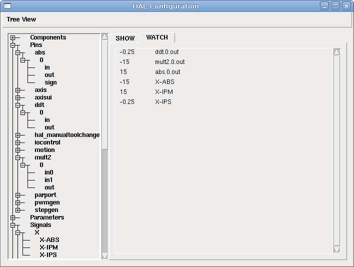
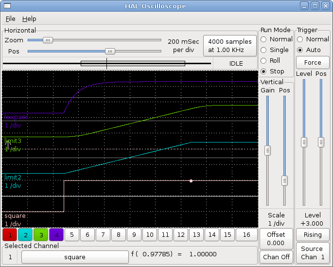

:lang: es

[[cha:hal-examples]]

= Ejemplos HAL

Todos estos ejemplos suponen que se comienza con una configuración basada
en stepconf que tiene dos hilos 'base-thread' y 'servo-thread'.
El asistente stepconf creará un archivo custom.hal vacío y un
archivo custom_postgui.hal. El archivo custom.hal se cargará después del
archivo HAL de configuración y el archivo custom_postgui.hal se cargan después de
que la GUI ha sido cargada.

== Conexión de dos salidas

Para conectar dos salidas a una entrada, puede usar el componente or2. or2 funciona
así; si cualquiera de las entradas a or2 está activada, entonces la salida or2 está activada. Si ninguna
entrada a or2 está activada, la salida or2 está desactivada.

Por ejemplo, tener dos botones pyvcp ambos conectados a un led.

.El archivo .xml
----
<pyvcp>
  <button>
    <halpin>"button-1"</halpin>
    <text>"Button 1"</text>
  </button>

  <button>
    <halpin>"button-2"</halpin>
    <text>"Button 2"</text>
  </button>

  <led>
    <halpin>"led-1"</halpin>
    <size>50</size>
    <on_color>"green"</on_color>
    <off_color>"red"</off_color>
  </led>
</pyvcp>
----

.El archivo postgui.hal
----
loadrt or2
addf or2.0 servo-thread
net button-1 or2.0.in0 <= pyvcp.button-1
net button-2 or2.0.in1 <= pyvcp.button-2
net led-1 pyvcp.led-1 <= or2.0.out
----

Cuando ejecuta este ejemplo creado con el Asistente Stepconf en 
una simulacion Axis, puede abrir un terminal y ver los pines creados con 'loadrt o2'
escribiendo 'halcmd show pin or2' en el terminal.

----
halcmd show pin or2
Component Pins:
Owner   Type  Dir         Value  Name
    22  bit   IN          FALSE  or2.0.in0 <== button-1
    22  bit   IN          FALSE  or2.0.in1 <== button-2
    22  bit   OUT         FALSE  or2.0.out ==> led-1
----

Puede ver en la salida del comando hal 'show pin or2' que el pin 'button-1' esta
conectado al pin 'or2.0.in0' y por la flecha de dirección puede ver que
el botón es una salida y 'or2.0.in0' es una entrada. La salida de or2
va a la entrada del led.

== Cambio manual de herramientas

En este ejemplo, se supone que está usando su propia
configuración y desea agregar la ventana HAL Manual Toolchange.
El cambio manual de herramientas HAL es principalmente útil si tiene herramientas preestablecidas y
almacena los offsets en la tabla de herramientas. Si necesita hacer touch off para
cada cambio de herramienta, entonces es mejor dividir su código g. 
Para usar la ventana HAL Manual Toolchange básicamente tiene que cargar el
componente hal_manualtoolchange y luego enviar el 'cambio de herramienta' de iocontrol a
el "cambio" de hal_manualtoolchange y devolver el cambio de hal_manualtool
'cambiada' a iocontrol 'herramienta cambiada'. Se proporciona un pin para una
entrada externa para indicar que el cambio de herramienta está completo.

Este es un ejemplo de cambio de herramienta manual 'con'
el componente HAL Manual Toolchange:

----
loadusr -W hal_manualtoolchange 
net tool-change iocontrol.0.tool-change => hal_manualtoolchange.change
net tool-changed iocontrol.0.tool-changed <= hal_manualtoolchange.changed
net external-tool-changed hal_manualtoolchange.change_button <= parport.0.pin-12-in
net tool-number iocontrol.0.tool-prep-number => hal_manualtoolchange.number
net tool-prepare-loopback iocontrol.0.tool-prepare => iocontrol.0.tool-prepared
----

Este es un ejemplo de cambio de herramienta manual 'sin'
el componente HAL Manual Toolchange:

----
net tool-number <= iocontrol.0.tool-prep-number 
net tool-change-loopback iocontrol.0.tool.-change => iocontrol.0.tool-changed 
net tool-prepare-loopback iocontrol.0.tool-prepare => iocontrol.0.tool-prepared 
----

== Cálculo de la velocidad

Este ejemplo usa 'ddt', 'mult2' y 'abs' para calcular la velocidad de
un solo eje. Para obtener más información sobre los componentes en tiempo real, consulte las
páginas de manual o la sección Componentes en tiempo real (<<sec:realtime-components>>).

Lo primero es verificar su configuración para asegurarse de que
no usa ninguno de los componentes en tiempo real. Puedes hacer esto
abriendo la ventana de configuración de HAL y buscando los componentes en
la sección de pines. Si encuentra alguno, busque el archivo .hal que están siendo
cargado y aumente los count para ajustar las instancia al
valor correcto. Agregue lo siguiente a su archivo custom.hal.

Carga de componentes de tiempo real.

----
loadrt ddt count=1 
loadrt mult2 count=1 
loadrt abs count=1 
----

Agregue las funciones a un hilo para que se actualicen.

----
addf ddt.0 servo-thread 
addf mult2.0 servo-thread 
addf abs.0 servo-thread 
----

Haga las conexiones.

----
setp mult2.in1 60 
net xpos-cmd ddt.0.in 
net X-IPS mult2.0.in0 <= ddt.0.out 
net X-ABS abs.0.in <= mult2.0.out 
net X-IPM abs.0.out 
----

En esta última sección, se ha configurado mult2.0.in1 a 60 para convertir
pulgadas por segundo, que obtenemos de ddt.0.out, a pulgadas por minuto .

La señal xpos-cmd envía la posición ordenada a ddt.0.in. El componente ddt
calcula la derivada del cambio de la entrada, es decir, la velocidad.

ddt2.0.out se multiplica por 60 para dar IPM.

mult2.0.out se envía a abs para obtener el valor absoluto.

La siguiente figura muestra el resultado cuando el eje X se mueve a 15
IPM en la dirección negativa. Tenga en cuenta que podemos obtener el valor absoluto
desde el pin abs.0.out o la señal X-IPM.

.Ejemplo cálculo de velocidad[[cap:Velocity-Example]]

== Arranque suave

Este ejemplo muestra cómo los componentes HAL 'lowpass', 'limit2' o
'limit3' puede usarse para limitar la rapidez con que cambia una señal.

En este ejemplo, tenemos un servomotor que impulsa un husillo de torno. Si
solo usamos las velocidades de husillo ordenadas, el servo intentará ir
desde la velocidad actual hasta la velocidad ordenada lo más rápido posible. Esto podría
causar un problema o dañar la unidad. Para reducir la velocidad de cambio podemos
envar spindle.N.speed-out a través de un limitador antes del PID, con lo que
el valor del comando PID cambiará a nuevos valores más lentamente.

Los tres componentes integrados que limitan una señal son:

* 'limit2' limita el rango y la primera derivada de una señal.

* 'limit3' limita el rango, primera y segunda derivada de una señal.

* 'lowpass' utiliza un promedio móvil ponderado exponencialmente para rastrear una señal de entrada.

Para encontrar más información sobre estos componentes HAL, consulte las páginas del manual.

Coloque lo siguiente en un archivo de texto llamado softstart.hal. Si no está
familiarizado con Linux, coloque el archivo en su directorio de usuario.

----
loadrt threads period1=1000000 name1=thread  
loadrt siggen  
loadrt lowpass  
loadrt limit2  
loadrt limit3  
net square siggen.0.square => lowpass.0.in limit2.0.in limit3.0.in  
net lowpass <= lowpass.0.out  
net limit2 <= limit2.0.out  
net limit3 <= limit3.0.out  
setp siggen.0.frequency .1  
setp lowpass.0.gain .01  
setp limit2.0.maxv 2  
setp limit3.0.maxv 2  
setp limit3.0.maxa 10  
addf siggen.0.update thread  
addf lowpass.0 thread  
addf limit2.0 thread  
addf limit3.0 thread  
start  
loadusr halscope 
----

Abra una ventana de terminal y ejecute el archivo con el siguiente comando.

----
halrun -I softstart.hal
----

Cuando el osciloscopio HAL se inicie por primera vez, haga clic en 'Aceptar' para aceptar el
hilo predeterminado

A continuación, debe agregar las señales a los canales. Haga clic en el canal 1
y seleccione 'cuadrado' en la pestaña Señales. Repita para los canales 2-4 y
agregue lowpass, limit2 y limit3.

A continuación, para configurar una señal de disparo, haga clic en el botón Source None y
seleccione cuadrado. El botón cambiará a Source Chan 1.

Luego haga clic en Single en el cuadro de botones de opción de Modo de ejecución. Esto
comenzara a correr y cuando termine verá las trazas en el osciloscopio.

Para separar las señales para que pueda verlas mejor, haga clic en un canal y
luego use el control deslizante Pos en el cuadro Vertical para establecer las posiciones.

.Arranque suave[[cap:Softstart]]

To see the effect of changing the set point values of any of the
components you can change them in the terminal window. To see what
different gain settings do for lowpass just type the following in the
terminal window and try different settings.
Para ver el efecto de cambiar los valores del punto de ajuste de cualquiera de los
componentes, puede cambiarlos en la ventana de terminal. Para ver qué hacen
diferentes configuraciones de ganancia para lowpass simplemente escriba lo siguiente en la
ventana de terminal y pruebe diferentes configuraciones.

----
setp lowpass.0.gain *.01
----

Después de cambiar una configuración, vuelva a ejecutar el osciloscopio para ver el cambio.

Cuando haya terminado, escriba 'exit' en la ventana de terminal para cerrar
halrun y halscope. No cierre la ventana del terminal con
halrun corriendo, ya que podría dejar algunas cosas en la memoria que podrían
interferir con la carga de LinuxCNC.

Para obtener más información sobre Halscope, consulte el manual de HAL.

== Stand Alone HAL

In some cases you might want to run a GladeVCP screen with just HAL. For
example say you had a stepper driven device that all you need is to run a
stepper motor. A simple 'Start/Stop' interface is all you need for your
application so no need to load up and configure a full blown CNC application.

In the following example we have created a simple GladeVCP panel with one 

.Basic Syntax
== HAL independiente

En algunos casos, es posible que desee ejecutar una pantalla GladeVCP solo con HAL. Por
ejemplo, digamos que tiene un dispositivo controlado por pasos que todo lo que necesita es ejecutar un
motor paso a paso. Todo lo que necesita para su interfaz es "Iniciar/Parar", por lo que 
no es necesario cargar y configurar una aplicación CNC completa.

En el siguiente ejemplo, hemos creado un panel GladeVCP simple.

.Sintaxis Básica
----
# cargar la GUI winder.glade y nombrarla winder
loadusr -Wn winder gladevcp -c winder -u handler.py winder.glade

# cargar componentes de tiempo real
loadrt threads name1=fast period1=50000 fp1=0 name2=slow period2=1000000
loadrt stepgen step_type=0 ctrl_type=v
loadrt hal_parport cfg="0x378 out"

# agregar funciones a hilos
addf stepgen.make-pulses fast
addf stepgen.update-freq slow
addf stepgen.capture-position slow
addf parport.0.read fast
addf parport.0.write fast

# hacer conexiones hal
net winder-step parport.0.pin-02-out <= stepgen.0.step
net winder-dir parport.0.pin-03-out <= stepgen.0.dir
net run-stepgen stepgen.0.enable <= winder.start_button

# iniciar los hilos
start

# comentar las siguientes líneas durante las pruebas y utilizar el interactivo
# option halrun -I -f start.hal to be able to show pins etc.

# espere hasta que la GUI gladevcp llamada winder termine
waitusr winder

# detener hilos HAL
stop

# descarguetodos los componentes HAL antes de salir
unloadrt all
----

