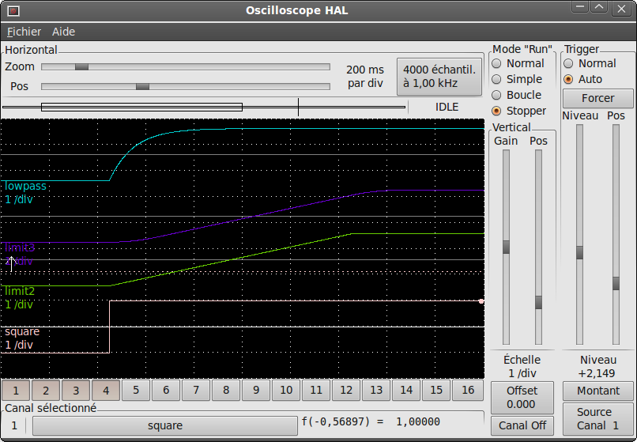

:lang: fr
:toc:

[[cha:hal-examples]]
= Exemples pour HAL(((HAL Examples)))

Tous ces exemples s'appuient sur une configuration créée par Stepconf,
elle a deux threads, _base-thread_ et _servo-thread_.
L'assistant de configuration Stepconf aura créé le fichier vide _custom.hal_
et le fichier _custom_postgui.hal_.
Le fichier custom.hal sera chargé après le fichier de configuration de HAL,
le fichier custom_postgui.hal sera chargé après que l'interface graphique ne le soit.

== Changement d'outil manuel

To connect two outputs to an input you can use the or2 component. The or2 works
like this, if either input to or2 is on then the or2 output is on. If neither
input to or2 is on the or2 output is off.

Voici un exemple _avec_ utilisation du composant de HAL, pour clarifier tout cela:

.The .xml file
----
<pyvcp>
  <button>
    <halpin>"button-1"</halpin>
    <text>"Button 1"</text>
  </button>

  <button>
    <halpin>"button-2"</halpin>
    <text>"Button 2"</text>
  </button>

  <led>
    <halpin>"led-1"</halpin>
    <size>50</size>
    <on_color>"green"</on_color>
    <off_color>"red"</off_color>
  </led>
</pyvcp>
----

.The postgui.hal file
----
loadrt or2
addf or2.0 servo-thread
net button-1 or2.0.in0 <= pyvcp.button-1
net button-2 or2.0.in1 <= pyvcp.button-2
net led-1 pyvcp.led-1 <= or2.0.out
----

When you run this example in an Axis simulator created with the Stepconf
Wizard you can open a terminal and see the pins created with 'loadrt or2' by
typing in 'halcmd show pin or2' in the terminal

----
halcmd show pin or2
Component Pins:
Owner   Type  Dir         Value  Name
    22  bit   IN          FALSE  or2.0.in0 <== button-1
    22  bit   IN          FALSE  or2.0.in1 <== button-2
    22  bit   OUT         FALSE  or2.0.out ==> led-1
----

You can see from the hal command 'show pin or2' that the 'button-1' pin is
connected to the 'or2.0.in0' pin and from the direction arrow you can see that
the button is and output and the 'or2.0.in0' is an input. The output from or2
goes to the input of the led.

== Manual Toolchange

Dans cet exemple, il est supposé que la configuration a été réalisée et
qu'il faut lui ajouter la fenêtre de changement d'outil de HAL. Le composant
de changement d'outil manuel de HAL est surtout intéressant si les outils
sont mesurables avec précision en longueur et que les offsets sont stockés
dans la table d'outils. Si il est nécessaire de faire un _Toucher_ pour chaque
outil, il sera préférable de scinder le programme G-code en plusieurs tronçons.
Pour utiliser la fenêtre de changement manuel d'outil de HAL, il faut d'abord
charger le composant _hal_manualtoolchange_ puis envoyer l'ordre
_iocontrol tool change_ vers le _change_ de hal_manualtoolchange ainsi
qu'envoyer le _changed_ de hal_manualtoolchange en retour sur le iocontrol tool changed.

This is an example of manual toolchange 'with'
the HAL Manual Toolchange component:

----
loadusr -W hal_manualtoolchange
net tool-change iocontrol.0.tool-change => hal_manualtoolchange.change
net tool-changed iocontrol.0.tool-changed <= hal_manualtoolchange.changed
net external-tool-changed hal_manualtoolchange.change_button <= parport.0.pin-12-in
net tool-number iocontrol.0.tool-prep-number => hal_manualtoolchange.number
net tool-prepare-loopback iocontrol.0.tool-prepare => iocontrol.0.tool-prepared
----

Et voici un exemple _sans_ le composant de
changement manuel:

----
net tool-number <= iocontrol.0.tool-prep-number
net tool-change-loopback iocontrol.0.tool-change => iocontrol.0.tool-changed
net tool-prepare-loopback iocontrol.0.tool-prepare => iocontrol.0.tool-prepared
----

== Calcul de vitesse

Cet exemple utilise _ddt_, _mult2_ et _abs_ pour calculer la vitesse de
déplacement sur un axe. Pour plus de détails, voir la section
<<cha:Composants-de-HAL, sur les composants de HAL>>.

En premier il convient de vérifier si la configuration contient déjà des
composants temps réel. Il est possible de le vérifier en ouvrant la fenêtre de
Halshow et en cherchant les composants dans la section des pins. Si il y en a
déjà en activité, il faudra augmenter leur nombre et ajuster l'instance de ces
composants à la
valeur correcte. Ajouter le code suivant dans le fichier _custom.hal_.

Charger les composants temps réel.

----
loadrt ddt count=1
loadrt mult2 count=1
loadrt abs count=1
----

Ajouter les fonctions au thread pour qu'elles soient rafraîchies.

----
addf ddt.0 servo-thread
addf mult2.0 servo-thread
addf abs.0 servo-thread
----

Faire les connections.

----
setp mult2.in1 60
net xpos-cmd ddt.0.in
net X-IPS mult2.0.in0 <= ddt.0.out
net X-ABS abs.0.in <= mult2.0.out
net X-IPM abs.0.out
----

Dans la dernière section, nous avons fixé le _mult2.0.in1_ à 60 pour convertir
les unités par seconde en unités par minute (dans cet exemple, des pouces/mn), nous l'obtenons sur la sortie _ddt.0.out_.

La commande _xpos-cmd_ envoie la position commandée à l'entrée _ddt.0.in_.
Le _ddt_ calcule la dérivée de la variation du signal sur son entrée.

La sortie ddt2.0.out est multipliée par 60 pour obtenir des unités par minute.

La sortie mult2.0.out est envoyée au composant _abs_ pour obtenir la valeur absolue.

La figure suivante montre le résultat quand l'axe X se déplace à 15 unités/mn
dans la direction négative. Noter que la valeur absolue peut être prise sur
la pin _abs.0.out_ ou le signal X-IPM.

[[cap:hal-exemple-velocite]]
.HAL: Exemple avec la vélocité(((HAL:Exemple avec la vélocité)))
image::images/velocity-01.png["HAL: Exemple avec la vélocité",align="center"]

== Amortissement d'un signal

Cette exemple montre comment les composants de HAL _lowpass_, _limit2_ ou _limit3_
peuvent être utilisés pour amortir de brusques changements d'un signal.

Nous sommes sur un tour dont la broche est pilotée par un servomoteur. Si nous
envoyions directement la consigne de vitesse de broche sur le servo, celui-ci
chercherait, à partir de la vitesse courante, à atteindre la vitesse commandée
le plus vite possible. Cette situation est problématique et peut détériorer
le matériel. Pour amortir ce changement de vitesse, nous pouvons faire passer
la sortie _spindle.N.speed-out_ à travers un limiteur avant d'aller au PID, de sorte que la valeur de commande du PID soit amortie.

Les trois composants intégrés pour amortir le signal seront:

* 'limit2' Limite le signal de sortie pour qu’il soit entre min et max. Limite sa vitesse de montée à moins de MaxV par seconde. (dérivée première)
* 'limit3' Limite le signal de sortie pour qu’il soit entre min et max. Limite sa vitesse de montée à moins de MaxV par seconde. (dérivée première). Limite sa vitesse de montée à moins de MaxV par seconde^2^. (dérivée seconde)
* 'lowpass' Filtre passe-bas.

Pour plus de détails voir <<cha:Composants-de-HAL, les composants de HAL>> ou les man pages des composants concernés.

Placer le code suivant dans un fichier appelé 'softstart.hal'. FIXME  If you're not
familiar with Linux place the file in your home directory.

----
loadrt threads period1=1000000 name1=thread
loadrt siggen
loadrt lowpass
loadrt limit2
loadrt limit3
net square siggen.0.square => lowpass.0.in limit2.0.in limit3.0.in
net lowpass <= lowpass.0.out
net limit2 <= limit2.0.out
net limit3 <= limit3.0.out
setp siggen.0.frequency .1
setp lowpass.0.gain .01
setp limit2.0.maxv 2
setp limit3.0.maxv 2
setp limit3.0.maxa 10
addf siggen.0.update thread
addf lowpass.0 thread
addf limit2.0 thread
addf limit3.0 thread
start
loadusr halscope
----

Ouvrir un terminal et et lancer le fichier avec la commande suivante:

----
halrun -I softstart.hal
----

Pour démarrer l'oscilloscope de HAL pour la première fois, cliquer _OK_ pour
accepter le thread par défaut.

Ensuite, il faut ajouter les signaux à suivre aux canaux du scope. Cliquer sur 
le canal _1_ puis sélectionner _square_ depuis l'onglet _Signaux_. Répéter 
pour les canaux suivants en ajoutant _lowpass_, _limit2_ et _limit3_.

Ensuite, pour régler le signal du déclencheur cliquer sur le bouton _Source_ est
sélectionner _square_. Le bouton devrait changer pour _Source Canal 1_.

Puis, cliquer sur _Simple_ dans le groupe _Mode Run_. L'oscillo 
devrait faire un balayage puis, afficher les traces.

Pour séparer les signaux et mieux les visualiser, cliquer sur un canal et 
utiliser le curseur de position verticale pour positionner les traces.

[[fig:softstart]]

Pour voir l'effet d'un changement du point de réglage des valeurs des composants,
il est possible de passer des commandes depuis le terminal. Par exemple,pour 
voir différentes valeurs de gain pour le passe-bas, taper la commande suivante,
puis essayer différentes valeurs:

----
setp lowpass.0.gain .01
----

Après un changement de réglage, relancer Halscope pour visualiser l'effet.

Pour terminer, taper _exit_ dans le terminal pour fermer halrun et halscope. 
Ne pas refermer le terminal avec halrun en marche, la mémoire ne serait pas
vidée proprement, ce qui pourrait
empêcher LinuxCNC de se charger.

Pour tout savoir sur Halscope et Halrun <<sec:Intro-tutoriel,voir le tutoriel de HAL>>.

== HAL en autonome

Dans certains cas il peut être utile de lancer un écran GladeVCP avec juste HAL.
Par exemple, nous avons un moteur pas à pas a piloter et tout ce qu'il nous faut
pour notre application est une simple interface avec _Marche/Arrêt_ plutôt que
charger une application de CNC complète.

Dans l'exemple qui suit, nous allons créer ce simple panneau GladeVCP.

.Syntaxe de base
----
# charge l'interface graphique winder.glade et la nome winder
loadusr -Wn winder gladevcp -c winder -u handler.py winder.glade

# charge les composants temps réel
loadrt threads name1=fast period1=50000 fp1=0 name2=slow period2=1000000
loadrt stepgen step_type=0 ctrl_type=v
loadrt hal_parport cfg="0x378 out"

# ajoute les fonctions aux threads
addf stepgen.make-pulses fast
addf stepgen.update-freq slow
addf stepgen.capture-position slow
addf parport.0.read fast
addf parport.0.write fast

# effectue les connections de hal
net winder-step parport.0.pin-02-out <= stepgen.0.step
net winder-dir parport.0.pin-03-out <= stepgen.0.dir
net run-stepgen stepgen.0.enable <= winder.start_button

# démarre les threads
start

# commenter la ligne suivante pendant les essais et utiliser le mode interactif pour voir les pins etc.
# option halrun -I -f start.hal

# attends que la GUI gladevcp nommée winder soit terminée
waitusr winder

# arrête tous les threads
stop

# décharge tous les composants de HAL avant de quitter
unloadrt all
----

// vim: set syntax=asciidoc:
