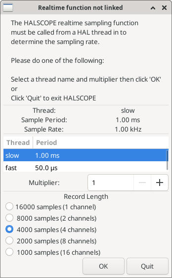
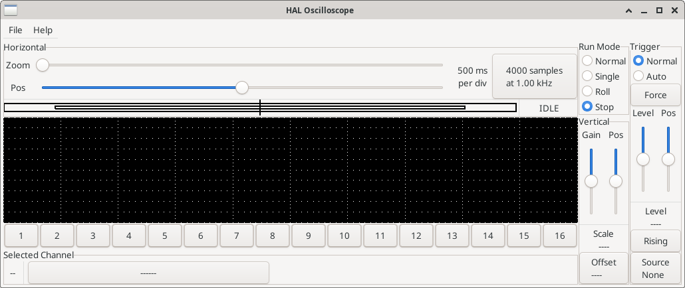
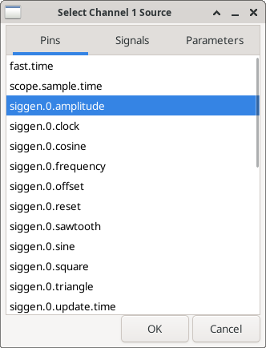
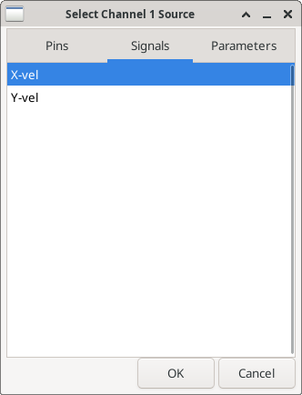
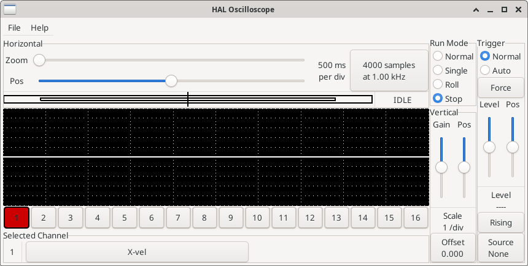
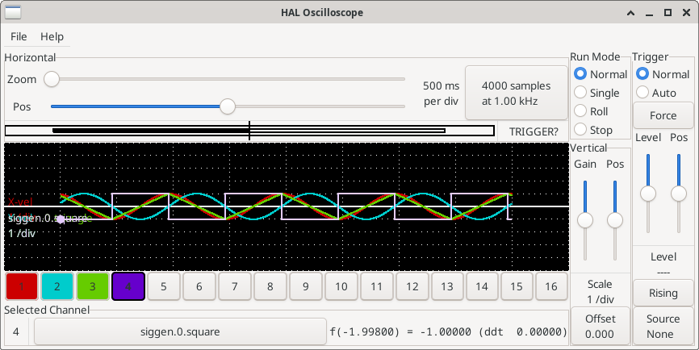
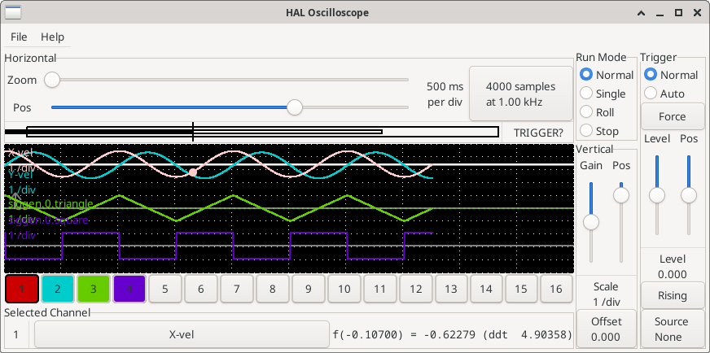
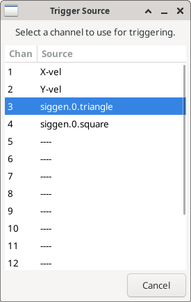
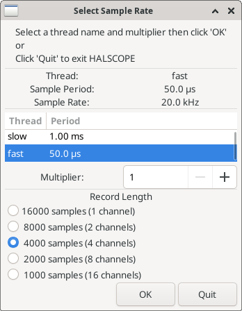
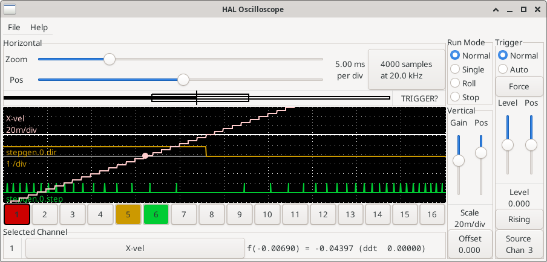

[[sec:tutorial-halscope]]
== Halscope

(((Tutorial Halscope)))
The previous example generates some very interesting signals. But much
of what happens is far too fast to see with halmeter. To take a closer
look at what is going on inside the HAL, we want an oscilloscope.
Fortunately HAL has one, called halscope.

Halscope has two parts - a realtime part that reads the HAL signals, and a non-realtime part that provides the GUI and display. However, you don't need to worry about this because the non-realtime part will automatically load the realtime part when needed.

With LinuxCNC running in a terminal you can start halscope with the following command.

.Starting Halscope
----
halcmd loadusr halscope
----

If LinuxCNC is not running or the autosave.halscope file does not match
the pins available in the current running LinuxCNC the scope GUI window
will open, immediately followed by a 'Realtime function not linked'
dialog that looks like the following figure. To change the sample rate
left click on the samples box.

[[fig:halscope-rt-function-not-linked]]
.Realtime function not linked dialog

This dialog is where you set the sampling rate for the oscilloscope.
For now we want to sample once per millisecond, so click on the 1.00 ms
thread 'slow' and leave the multiplier at 1. We will also leave the
record length at 4000 samples, so that we can use up to four channels
at one time. When you select a thread and then click 'OK', the dialog
disappears, and the scope window looks something like the following
figure.

[[fig:halscope-init-window]]
.Initial scope window

=== Hooking up the scope probes

At this point, Halscope is ready to use. We have already selected a
sample rate and record length, so the next step is to decide what to
look at. This is equivalent to hooking 'virtual scope probes' to the
HAL. Halscope has 16 channels, but the number you can use at any one
time depends on the record length - more channels means shorter
records, since the memory available for the record is fixed at
approximately 16,000 samples.

The channel buttons run across the bottom of the halscope screen.
Click button '1', and you will see the 'Select Channel Source' dialog
as shown in the following figure. This dialog is very similar to the
one used by Halmeter. We would like to look at the signals we defined
earlier, so we click on the 'Signals' tab, and the dialog displays all
of the signals in the HAL (only two for this example).

[[fig:halscope-channel-source-selection]]
.Select Channel Source

To choose a signal, just click on it. In this case, we want channel 1
to display the signal 'X-vel'. Click on the Signals tab then click on
'X-vel' and the dialog closes and the channel is now selected.

[[fig:halscope-source-signal-selection]]
.Select Signal

The channel 1 button is pressed in, and channel number 1 and the name
'X-vel' appear below the row of buttons. That display always indicates
the selected channel - you can have many channels on the screen, but
the selected one is highlighted, and the various controls like vertical
position and scale always work on the selected one.

[[fig:halscope]]
.Halscope

To add a signal to channel 2, click the '2' button. When the dialog
pops up, click the 'Signals' tab, then click on 'Y-vel'. We also want
to look at the square and triangle wave outputs. There are no signals
connected to those pins, so we use the 'Pins' tab instead. For channel
3, select `siggen.0.triangle` and for channel 4, select
`siggen.0.square`.

=== Capturing our first waveforms

Now that we have several probes hooked to the HAL, it's time to
capture some waveforms. To start the scope, click the 'Normal' button
in the 'Run Mode' section of the screen (upper right). Since we have a
4000 sample record length, and are acquiring 1000 samples per second,
it will take halscope about 2 seconds to fill half of its buffer.
During that time a progress bar just above the main screen will show
the buffer filling. Once the buffer is half full, the scope waits for a
trigger. Since we haven't configured one yet, it will wait forever. To
manually trigger it, click the 'Force' button in the 'Trigger' section
at the top right. You should see the remainder of the buffer fill, then
the screen will display the captured waveforms. The result will look
something like the following figure.

[[fig:halscope-captured-owaveform]]
.Captured Waveforms

The 'Selected Channel' box at the bottom tells you that the purple
trace is the currently selected one, channel 4, which is displaying the
value of the pin `siggen.0.square`. Try clicking channel buttons 1
through 3 to highlight the other three traces.

=== Vertical Adjustments

The traces are rather hard to distinguish since all four are on top of
each other. To fix this, we use the 'Vertical' controls in the box to
the right of the screen. These controls act on the currently selected
channel. When adjusting the gain, notice that it covers a huge range -
unlike a real scope, this one can display signals ranging from very
tiny (pico-units) to very large (Tera-units). The position control
moves the displayed trace up and down over the height of the screen
only. For larger adjustments the offset button should be used.

[[fig:halscope-vertical-adjustment]]
.Vertical Adjustment

The large _Selected Channel_ button at the bottom indicates that channel 1 is
currently selected channel and that it matches the _X-vel_ signal.
Try clicking on the other channels to put their traces in evidence and
to be able to move them with the _Pos_ cursor.

=== Triggering

Using the 'Force' button is a rather unsatisfying way to trigger the
scope. To set up real triggering, click on the 'Source' button at the
bottom right. It will pop up the 'Trigger Source' dialog, which is
simply a list of all the probes that are currently connected. Select a
probe to use for triggering by clicking on it. For this example we will
use channel 3, the triangle wave as shown in the following figure.

[[fig:halscope-trigger-source]]
.Trigger Source Dialog

After setting the trigger source, you can adjust the trigger level and
trigger position using the sliders in the 'Trigger' box along the right
edge. The level can be adjusted from the top to the bottom of the
screen, and is displayed below the sliders. The position is the
location of the trigger point within the overall record. With the
slider all the way down, the trigger point is at the end of the record,
and halscope displays what happened before the trigger point. When the
slider is all the way up, the trigger point is at the beginning of the
record, displaying what happened after it was triggered. The trigger
point is visible as a vertical line in the progress box above the
screen. The trigger polarity can be changed by clicking the button just
below the trigger level display. It will then become _descendant_.
Note that changing the trigger position stops the scope once the position
has been adjusted, you relaunch the scope by clicking on the _Normal_
button of _Run mode_ the group.

Now that we have adjusted the vertical controls and triggering, the
scope display looks something like the following figure.

[[fig:halscope-waveforms-with-triggering]]
.Waveforms with Triggering

=== Horizontal Adjustments

To look closely at part of a waveform, you can use the zoom slider at
the top of the screen to expand the waveforms horizontally, and the
position slider to determine which part of the zoomed waveform is visible.
However, sometimes simply expanding the waveforms isn't enough and you need to increase the sampling rate.
For example, we would like to look at the actual step pulses that are being generated in our example.
Since the step pulses may be only 50 µs long, sampling at 1 kHz isn't fast enough.
To change the sample rate, click on the button that displays the number
of samples and sample rate to bring up the 'Select Sample Rate' dialog figure.
For this example, we will click on the 50 µs thread, 'fast', which gives us a sample rate of about 20 kHz.
Now instead of displaying about 4 seconds worth of data, one record is 4000 samples at 20 kHz, or about 0.20 seconds.

[[fig:halscope-sample-rate-choice]]
.Sample Rate Dialog

=== More Channels

Now let's look at the step pulses.
Halscope has 16 channels, but for this example we are using only 4 at a time.
Before we select any more channels, we need to turn off a couple.
Clicking on a selected channel button (black border) will turn the channel off.
So click on the channel 2 button, then click again on this button and the channel will turn off.
Then click twice on channel 3 and do the same for channel 4.
Even though the channels are turned off, they still remember what they
are connected to, and in fact we will continue to use channel 3 as the trigger source.
To add new channels, select channel 5, and choose pin `stepgen.0.dir`, then channel 6, and select `stepgen.0.step`.
Then click run mode 'Normal' to start the scope, and adjust the horizontal zoom to 5 ms per division.
You should see the step pulses slow down as the velocity command (channel 1) approaches zero,
then the direction pin changes state and the step pulses speed up again.
You might want toincrease the gain on channel 1 to about 20 milli per division to better see
the change in the velocity command.
The result should look like the following figure.

[[fig:halscope-step-pulses]]
.Step Pulses

=== More samples

If you want to record more samples at once, restart realtime and load
halscope with a numeric argument which indicates the number of samples
you want to capture.

----
halcmd loadusr halscope 80000
----

If the 'scope_rt' component was not already loaded, halscope will
load it and request 80000 total samples, so that when sampling
4 channels at a time there will be 20000 samples per channel.
(If 'scope_rt' was already loaded, the numeric argument to
halscope will have no effect).
