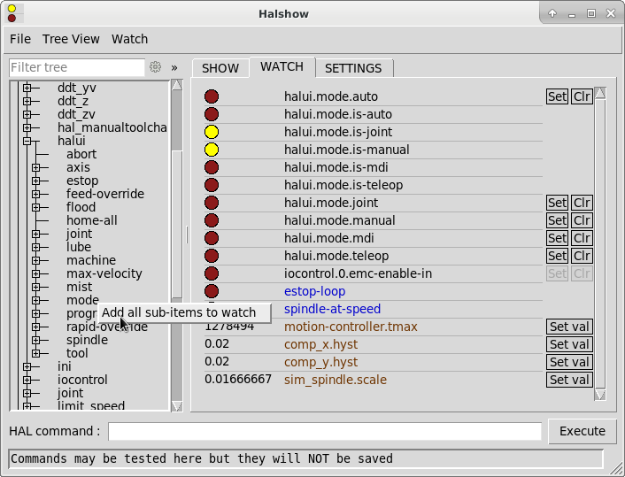

:lang: en
:toc:

[[cha:halshow]]
= Halshow(((Halshow)))

// Custom lang highlight
// must come after the doc title, to work around a bug in asciidoc 8.6.6
:ini: {basebackend@docbook:'':ini}
:hal: {basebackend@docbook:'':hal}
:ngc: {basebackend@docbook:'':ngc}

The script `halshow` can help you find your way around a running HAL.
It displays chosen HAL values and updates them continously.

This is a very specialized system and it must connect to a working HAL.
It cannot run standalone because it relies on the ability of HAL to "introspect" and report what it knows of itself through the halcmd interface library.
When the configuration of LinuxCNC changes, so will the output of halshow be different, too.

As we will soon see, this ability of HAL to document itself is one key to establish an effective CNC system.

== Starting Halshow

Halshow is available

- in the AXIS menu under Machine/Show HAL Configuration,
- in the TkLinuxCNC menu under Scripts/HAL Show,
- in GMOCCAPY on the settings page.

`halshow` can also be started from a terminal command line and specify formats for integer and float items (pins or signals) and identify a saved watchlist file to use:

----
$ halshow --help
Usage:
  halshow [Options] [watchfile]
  Options:
           --help    (this help)
           --fformat format_string_for_float
           --iformat format_string_for_int
           --noprefs don't use preference file to save settings

Notes:
       Create watchfile in halshow using: 'File/Save Watch List'.
       LinuxCNC must be running for standalone usage.
----

Example to limit number of decimal points for floats and use a file named my.halshow in the current directory:

----
$ halshow  --fformat "%.5f" ./my.halshow
----

For more information regarding the format, please refer to https://www.tcl.tk/man/tcl/TclCmd/format.html[the Tcl format man page].

[[cap:halshow-layout]]
.Halshow Layout
image::images/halshow-layout.png["Halshow Layout",align="center"]

At the left of its display as shown in above figure is a tree view, resembling what you may have seen as file browsers.
At the right is a tabbed notebook with tabs for show, watch and settings.

== HAL Tree Area

=== Filter Tree

Per default this entry filters the tree by pin names or tree-nodes by a regular expression.
For example, entering "lim-sw" would filter the tree to the following:

.Filtering tree for pin names with the substring "lim-sw".
----
joint.0.neg-lim-sw-in
joint.0.pos-lim-sw-in
joint.1.neg-lim-sw-in
joint.1.pos-lim-sw-in
joint.2.neg-lim-sw-in
joint.3.pos-lim-sw-in
----

If you would like to display all `joint.0`-related, you have to click the settings icon and select "Full path".
Pay attention to escape the regex special characters, so you have to enter "joint\.1\." to explicitly request the dot and not also find joint 10.

=== Tree

The tree shows all of the major parts of a HAL.
In front of each is a small plus (+) or minus (-) sign in a box to expand or collapse the corresponding section of the tree.

You can also expand or collapse the tree display using the Tree View menu at the upper left edge of the display.

Under _Tree View_ you will find:
_Expand All_, _Collapse All_; _Expand Pins_, _Expand Parameters_, _Expand Signals_; and _Reload tree view_.
_Reload tree view_ is useful when new components are loaded during runtime and should be displayed.

== HAL Show Area

[[fig:halshow-show-tab]]
.Halshow: Show Tab
image::images/halshow-show-tab.png["Halshow: Show Tab",align="center"]

Clicking on the node name in the tree, e.g. "Components", will show you (under the "Show" tab) all that HAL knows about the contents of that node.
Figure <<fig:halshow-show-tab,Halshow Show Tab>> shows a list exactly like you will see if you click the "Components" name.
The information display is exactly like those shown in traditional text based HAL analysis tools.
The advantage here is that we have mouse click access, access that can be as broad or as focused as you need.

If we take a closer look at the tree display we can see that the six major parts of a HAL can all be expanded at least one level.
As these levels are expanded you can get more focused with the reply when you click on the rightmost tree node.
You will find that there are some HAL pins and parameters that show more than one reply.
This is due to the nature of the search routines in halcmd itself.
If you search one pin you may get two, like this:

----
Component Pins:
Owner  Type  Dir  Value  Name
06     bit    -W   TRUE  parport.0.pin-10-in
06     bit    -W  FALSE  parport.0.pin-10-in-not
----

The second pin's name contains the complete name of the first.

.New in 2.9
****
Selected text inside the Show tab can be copied by right-click or CTRL-C. +
The Show area allows to add pins from selected text by using the right-click menu.
All valid pins that are enclosed in the selction are added to the Watch tab.
****

== Watch Tab Area

Clicking the watch tab produces a blank canvas.
You can add signals and pins to this canvas and watch their values.
You can add signals or pins when the watch tab is displayed by clicking on the name of it in the tree view.

.New in 2.9
****
You can also add all sub-items of this node by selecting that in the right click menu (see figure <<fig:halshow-watch-tab-1,Halshow Watch Tab>>).
****

The following figure shows this canvas with several pins.

[[fig:halshow-watch-tab-1]]
.Halshow: Watch Tab(((Halshow: Watch Tab)))

_Watch_ displays bit type (binary) values using colored circles representing LEDs.
They show as dark red when a bit signal or pin is false, and as light yellow whenever that signal is true.
If you select a pin or signal that is not a bit type (binary) signal, _watch_ will show it as a numerical value.
Pins are displayed in black, signals in blue and parameters in brown.

_Watch_ will quickly allow you to test switches or see the effect of changes that you make to LinuxCNC while using the graphical interface.
_Watch's_ refresh rate is a bit slow to see stepper pulses, but you can use it for these if you move an axis very slowly or in very small increments of distance.

.New in 2.9
****
The pins and signals that are writable have buttons for manipulation on the right side. Pins that are linked to a signal have disabled buttons.
To set these values, the corresponding pin has to be unlinked from the signal.
That can be done by right-click on the signal name and select "Unlink pin", see <<cap:watch-tab-context-menu,Watch Tach Context Menu>>.

The watch list will be saved automatically on exit.
If you don't want Halshow to save your watchlist, it can be disabled in the <<sec:halshow-settings,Settings>>.
****

*Context Menu*

.New in 2.9
****
The context menu allows further:

  - Copy the pin name to clipboard
  - Set a value
  - Unlink a pin (if linked to a signal)
  - Show apin in the Tree view (highlights the pin, doesn't scroll to the position)
  - Remove a pin from the list
****

[[cap:watch-tab-context-menu]]
.Halshow: Watch Tab Context Menu
image::images/halshow-5.png["Halshow: Watch Tab Context Menu",align="center"]

== Command Entry

In the lower part is an entry box to test HAL commands.
The commands you enter here and the effect that they have on the running HAL are not saved.
They will persist as long as LinuxCNC remains up but are gone as soon as LinuxCNC is.

.New in 2.9
****
The command entry has a BASH-like history (during the session), so you can restore inserted commands with the arrow up key.
****

The entry box labeled "HAL Command:" will accept any of the commands listed for halcmd.
These include:

- `loadrt`, `unloadrt` (load/unload real-time module)
- `loadusr`, `unloadusr` (load/unload non-realtime component)
- `addf`, `delf` (add/delete a function to/from a real-time thread)
- `net` (create a connection between two or more items)
- `setp` (set parameter (or pin) to a value)

This little editor will enter a command any time you press _enter_ or push the execute button.
An error message from halcmd will be shown when these commands are not properly formed.
If you are not certain how to set up a proper command, you'll need to read again the documentation on halcmd and the specific modules that you are working with.

[[sec:halshow-settings]]
== Settings

.New in 2.9
****
The geometry of the window and the settings are saved in a file in the configuration directory on exit.
If that path cannot be determined, they are stored in the home directory.
The path will be displayed in the settings page.
You can omit using the preferences file by calling halshow with the command line argument `--no-prefs`. +
The further settings should be self-explaining.
****

[[cap:halshow-settings]]
.Halshow Settings

== Example/Tutorial

Let's use this editor to add a differential module to a HAL and connect it to axis position so that we could see the rate of change in position, i.e., acceleration.
We first need to load a HAL component named ddt, add it to the servo thread, then connect it to the position pin of a joint.
Once that is done we can find the output of the differentiator in halscope. So let's go. 

[source,{hal}]
----
loadrt ddt
----

Now look at the components node and you should see ddt in there someplace.

[source,{hal}]
----
Loaded HAL Components:
ID Type        Name
10 User halcmd29800
09 User halcmd29374
08   RT         ddt
06   RT hal_parport
05   RT    scope_rt
04   RT     stepgen
03   RT      motmod
02 User   iocontrol
----

Sure enough there it is. Notice that its ID is 08.
Next we need to find out what functions are available with it so we look at functions:

----
Exported Functions:
Owner  CodeAddr      Arg  FP Users Name
  08   E0B97630 E0DC7674 YES     0 ddt.0
  03   E0DEF83C 00000000 YES     1 motion-command-handler
  03   E0DF0BF3 00000000 YES     1 motion-controller
  06   E0B541FE E0DC75B8  NO     1 parport.0.read
  06   E0B54270 E0DC75B8  NO     1 parport.0.write
  06   E0B54309 E0DC75B8  NO     0 parport.read-all
  06   E0B5433A E0DC75B8  NO     0 parport.write-all
  05   E0AD712D 00000000  NO     0 scope.sample
  04   E0B618C1 E0DC7448 YES     1 stepgen.capture-position
  04   E0B612F5 E0DC7448  NO     1 stepgen.make-pulses
  04   E0B614AD E0DC7448 YES     1 stepgen.update-freq
----

Here we look for owner #08 and see a function named ddt.0.
We should be able to add ddt.0 to the servo thread and it will do its math each time the servo thread is updated.
Once again we look up the addf command and find that it uses three arguments like this:

[source,{hal}]
----
addf <functname> <threadname> [<position>]
----

We already know the functname=ddt.0 so let's get the thread name right by expanding the thread node in the tree.
Here we see two threads, servo-thread and base-thread.
The position of `ddt.0` in the thread is not critical.
So we add the function `ddt.0` to the servo-thread:

[source,{hal}]
----
addf ddt.0 servo-thread
----

This is just for viewing, so we leave position blank and get the last position in the thread.
The following figure shows the state of halshow after this command has been issued.

[[fig:halshow-addf-command]]
.Addf command
image::images/halshow-2.png["Addf command",align="center"]

Next we need to connect ddt to something.
But how do we know what pins are available?
The answer is to look under pins.
There we find ddt and see this:

----
Component Pins:
Owner Type  Dir Value       Name
08    float R-  0.00000e+00 ddt.0.in
08    float -W  0.00000e+00 ddt.0.out
----

That looks easy enough to understand, but what signal or pin do we want to to connect to it?
It could be an axis pin, a stepgen pin, or a signal.
We see this when we look at `joint.0`:

----
Component Pins:
Owner Type  Dir Value       Name
03    float -W  0.00000e+00 joint.0.motor-pos-cmd ==> Xpos-cmd
----

So it looks like Xpos-cmd should be a good signal to use.
Back to the editor where we enter the following command:

[source,{hal}]
----
linksp Xpos-cmd ddt.0.in
----

Now if we look at the `Xpos-cmd` signal using the tree node we'll see what we've done:

----
Signals:
Type Value Name
float 0.00000e+00 Xpos-cmd
<== joint.0.motor-pos-cmd
==> ddt.0.in
==> stepgen.0.position-cmd
----

We see that this signal comes from `joint.o.motor-pos-cmd` and goes to both `ddt.0.in` and `stepgen.0.position-cmd`.
By connecting our block to the signal we have avoided any complications with the normal flow of this motion command.

The HAL Show Area uses `halcmd` to discover what is happening in a running HAL.
It gives you complete information about what it has discovered.
It also updates as you issue commands from the little editor panel to modify that HAL.
There are times when you want a different set of things displayed without all of the information available in this area.
That is where the HAL Watch Area is of value.

// vim: set syntax=asciidoc:
