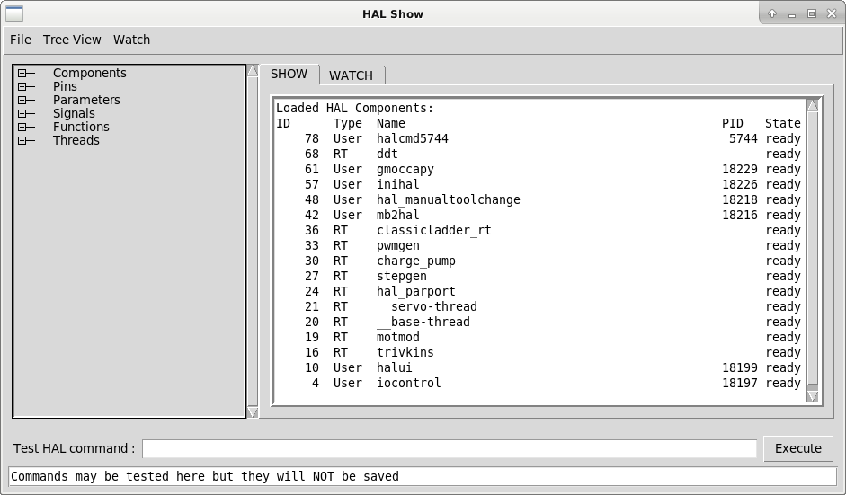
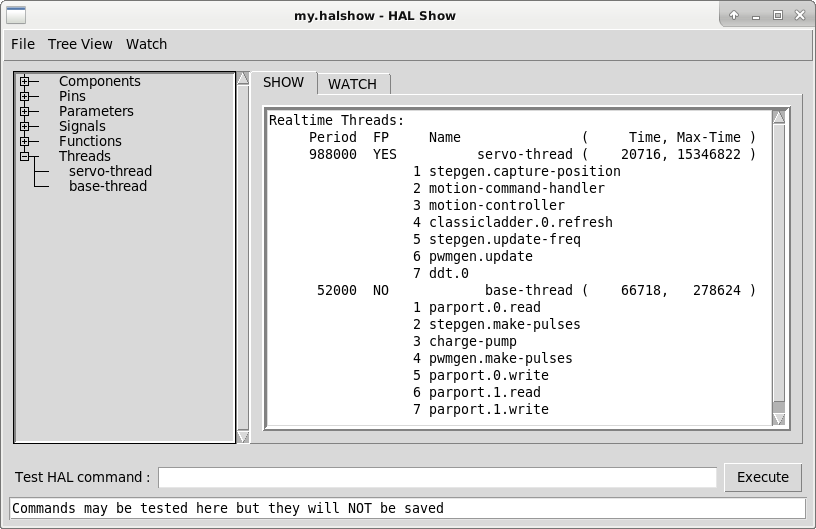
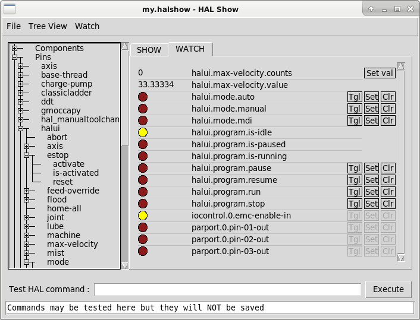

:lang: es

[[cha:halshow]]

= Halshow

El script halshow puede ayudarle a revisar HAL en ejecución.
Este es un sistema muy especializado y debe conectarse con HAL en funcionamiento.
No puede ejecutarse de forma independiente porque depende de la capacidad de HAL para
informar de lo que sabe de sí mismo a través de la biblioteca de interfaz halcmd; esto
se basa en el descubrimiento de sus propias capacidades. Cada vez que halshow se ejecuta con un LinuxCNC diferente,
la configuración será diferente.

Como veremos, esta capacidad de HAL para documentarse es clave
para hacer un sistema CNC efectivo.

== Comenzando Halshow

Halshow se encuentra en el menú AXIS en Máquina > Mostrar Configuración HAL.

Halshow está en TkLinuxCNC bajo el menú Scripts > HAL Show.

Halshow se puede iniciar desde una línea de comandos del terminal y especificar
formatos para elementos enteros y de punto flotante (pines o señales) e identificar un
archivo guardado de lista de seguimiento para su utilización:

----
$ halshow --help
Uso:
  halshow [Opciones] [watchfile]
  Opciones:
           --help (esta ayuda)
           --fformat format_string_for_float
           --iformat format_string_for_int

Notas:
       Cree un archivo de seguimiento en halshow usando: 'Archivo > Guardar lista de seguimiento'
       linuxcnc debe estar ejecutándose para uso independiente
----

Ejemplo para limitar a cinco el número de decimales para flotantes
y usar un archivo llamado my.halshow en el directorio actual:

----
$ halshow --fformat ".5f" ./my.halshow
----

== Area de Arbol HAL

A la izquierda de su pantalla, como se muestra en la figura, hay una vista de árbol parecido
al de los navegadores de archivos. A la derecha hay un cuaderno con las pestañas SHOW (ver) y WATCH (observar).

[[cap:halshow-layout]]

.Ventana de Halshow

El árbol muestra todas las partes principales de HAL. Delante de cada una hay un
pequeño signo más (\+) o menos (-) en un recuadro. Al hacer clic en el signo (+)
se expande el nodo del árbol para mostrar lo que está bajo de él. Si esa casilla muestra un
signo menos (-), al hacer clic en él, contraerá esa sección del árbol.

También puede expandir o contraer la visualización del árbol usando el menu 'Tree View'
en el borde superior izquierdo de la pantalla. Bajo 'Tree View' podrá encontrar:
Expandir Árbol, Contraer árbol, Expandir pines, Expandir parámetros,
Expandir Señales y Borrar Observacion (Erase Watch). (Tenga en cuenta que Erase Watch borra 'todo' lo
previamente establecido en WATCH; no puede borrar solo un item.)

.Pestaña "Show"

== Area Show HAL

Al hacer clic en el nombre de un nodo, "Components" por ejemplo,
mostrara (en la pestaña "SHOW") todos los contenidos HAL sobre 
ese nodo. La Figura <<cap:halshow-layout>> muestra una lista exactamente como la
veria si hace clic en el nombre de "Components" mientras ejecuta, por ejemplo, una
tarjeta servo Mesa m5i20 estándar. La información en pantalla es exactamente como
la que se muestran en las herramientas tradicionales de análisis de HAL basadas en texto. La ventaja
aquí es que tenemos acceso con un clic del mouse, acceso que puede ser tan amplio o
tan enfocado como se necesite.

Si echamos un vistazo más de cerca a la pantalla del árbol podemos ver que las seis
partes principales de HAL pueden expandirse al menos en un nivel. Cuando estos
niveles se expanden, puede enfocarse más lo que interesa
haciendo clic en el nodo de árbol más a la derecha. Usted encontrará que hay algunos
pines y parámetros HAL que muestran más de una respuesta. Esto se debe a la
naturaleza de las rutinas de búsqueda en halcmd. Si busca un pin determinado,
puede obtener dos, como en este caso:

----
Component Pins: 
Owner  Type  Dir  Value  Name 
06     bit    -W   TRUE  parport.0.pin-10-in 
06     bit    -W  FALSE  parport.0.pin-10-in-not 
----

El nombre del segundo pin contiene el nombre completo del primero.

Debajo del área de exhibición a la derecha hay un conjunto de widgets que permitirán
interactuar con HAL. Los comandos que se ingresan aquí y los
efecto que tienen en el HAL en ejecución no se guardan. Seran
persistentes mientras LinuxCNC permanezca activo, pero se borraran tan pronto como LinuxCNC se cierre.

El cuadro de entrada etiquetado "Comando de prueba HAL:" aceptará cualquiera de los
comandos listados para halcmd. Éstos incluyen:

 - loadrt, unloadrt (cargar/descargar módulo en tiempo real)
 - loadusr, unloadusr (cargar/descargar componente de espacio de usuario)
 - addf, delf (agregar/eliminar una función a/desde un hilo en tiempo real)
 - net (crear una conexión entre dos o más elementos)
 - setp (establecer parámetro o pin a un valor)

Este pequeño editor ingresará un comando cada vez que presione <enter> o
presione el botón 'Execute'. Cuando estos comandos no están formados correctamente, se mostrará
un mensaje de error de halcmd. 
Si no está seguro de cómo configurar un comando adecuado, necesitará leer
una vez más la documentación sobre halcmd y los módulos específicos que está utilizando.

Usemos este editor para agregar un módulo diferencial a un HAL y
conéctarlo a la posición del eje para que podamos ver la tasa de cambio de
posición, es decir, la aceleración. Primero necesitamos cargar un componente HAL llamado
ddt; agréguelo al hilo del servo. Luego conéctelo al pin de posición
de una articulación. Una vez hecho esto podemos encontrar la salida del
diferenciador en halscope. Veamoslo.

----
loadrt ddt
----

Ahora mire el nodo de componentes y debería ver ddt en algún lugar.

----
Loaded HAL Components:
ID Type        Name
10 User halcmd29800
09 User halcmd29374
08   RT         ddt
06   RT hal_parport
05   RT    scope_rt
04   RT     stepgen
03   RT      motmod
02 User   iocontrol
----

Por supuesto, ahí está. Tenga en cuenta que su ID es 08. A continuación necesitamos
averigüar qué funciones están disponibles con él, por lo que seleccionaremos el nodo funciones:

----
Exported Functions: 
Owner  CodeAddr      Arg  FP Users Name 
  08   E0B97630 E0DC7674 YES     0 ddt.0 
  03   E0DEF83C 00000000 YES     1 motion-command-handler 
  03   E0DF0BF3 00000000 YES     1 motion-controller 
  06   E0B541FE E0DC75B8  NO     1 parport.0.read 
  06   E0B54270 E0DC75B8  NO     1 parport.0.write 
  06   E0B54309 E0DC75B8  NO     0 parport.read-all 
  06   E0B5433A E0DC75B8  NO     0 parport.write-all 
  05   E0AD712D 00000000  NO     0 scope.sample 
  04   E0B618C1 E0DC7448 YES     1 stepgen.capture-position 
  04   E0B612F5 E0DC7448  NO     1 stepgen.make-pulses 
  04   E0B614AD E0DC7448 YES     1 stepgen.update-freq 
----

Aquí buscamos el ID 08 y vemos una función llamada ddt.0. Deberíamos poder agregar ddt.0 al hilo del servo y
hará sus cálculos cada vez que se actualice ese hilo. El comando 'addf' usa tres argumentos como
estos:

----
addf <functname> <nombre de hilo> [<posición>]
----

Ya conocemos la functname = ddt.0, así que obtengamos el nombre del hilo correcto
expandiendo el nodo de hilos (Threads) en el árbol. Aquí vemos dos hilos;
hilo servo e hilo base. La posición de ddt.0 en el hilo no es
crítica. Agregemos la función ddt.0 al hilo servo:

----
addf ddt.0 servo-thread
----

Esto es solo para ver su valor, así que dejamos [<posición>] en blanco y la funcion queda en la última
posición en el hilo. La siguiente figura muestra el estado de halshow
después de que este comando ha sido emitido.

.Comando Addf

image::images/halshow-2.png[align="center",alt="Comando Addf"]

A continuación necesitamos conectar ddt a algo. Pero ¿cómo sabemos
qué pines están disponibles?. La respuesta es mirar debajo de los pines. Ahí
encontraremos ddt y se vera esto:

----
Component Pins: 
Owner Type  Dir Value       Name 
08    float R-  0.00000e+00 ddt.0.in 
08    float -W  0.00000e+00 ddt.0.out 
----

Parece fácil de entender, pero ¿qué señal o pin queremos conectar a ddt?. Podría ser un pin de eje, un pin de stepgen o una
señal. Vemos esto cuando miramos joint.0:

----
Component Pins: 
Owner Type  Dir Value       Name 
03    float -W  0.00000e+00 joint.0.motor-pos-cmd ==> Xpos-cmd
----

Así que parece que Xpos-cmd debería ser una buena señal para usar. De vuelta al
editor, donde ingresamos el siguiente comando:

----
linksp Xpos-cmd ddt.0.in
----

Ahora, si observamos la señal Xpos-cmd usando el nodo del árbol, veremos
lo que hemos hecho

----
Signals: 
Type Value Name 
float 0.00000e+00 Xpos-cmd
<== joint.0.motor-pos-cmd
==> ddt.0.in 
==> stepgen.0.position-cmd
----

Vemos que esta señal proviene de joint.0.motor-pos-cmd y va a
ddt.0.in y stepgen.0.position-cmd. Al conectar nuestro bloque a
la señal hemos evitado cualquier complicación con el flujo normal de
este comando de movimiento.

El area 'Show' utiliza halcmd para descubrir lo que está sucediendo en un
HAL en ejecucion. Da información completa sobre lo que ha
descubierto. También se actualiza a medida que se emiten los comandos en el pequeño
panel de edición para modificar esa HAL. Hay momentos en que se quiere que se muestren un
conjunto diferente de cosas sin toda la información disponible en este area.
Ahí es donde el Área 'WATCH' de HAL es de valor.

== Pestaña WATCH

Al hacer clic en la pestaña WATCH aparece un cuadro en blanco. Puede añadir señales y pines
a este cuadro y ver sus valores. footnote:[La frecuencia de actualización de la
pantalla es mucho más baja que Halmeter o Halscope. Si necesita buena resolucion
del tiempo de las señales, esas herramientas son mucho más efectivas.] Usted puede agregar
señales o pines cuando se muestra la pestaña WATCH haciendo clic en sus nombres.
La siguiente figura muestra este cuadro con varias señales de tipo "bit". Estas
señales incluyen habilitación de salida (enable-out) para los primeros tres ejes y dos de las tres
señales de "estop" de iocontrol. Observe que los ejes no están habilitados aunque
las señales de parada indican que LinuxCNC no está en parada. Una mirada rápida a la gui de usuario
muestra que la condición de LinuxCNC es ESTOP RESET (para TkLinuxCNC) u OFF (en Axis, esquina inferior izquierda).
La habilitacion del amplificador no pasara a 'verdadero' hasta que la máquina se haya encendido.

.Watch Tab

WATCH muestra valores de tipo de bit (binarios) utilizando círculos de colores
representando leds. Se muestran en color marrón oscuro cuando la señal de bit o el pin son 'Falso', y amarillo claro si es verdadero.
Si selecciona un pin o señal que no es una señal de tipo bit (binario), WATCH mostrará un valor numérico.

WATCH permite probar rápidamente interruptores o ver el efecto de
los cambios que realice en LinuxCNC mientras utiliza la interfaz gráfica.
La frecuencia de actualización de WATCH es un poco lenta para ver los pulsos de paso, pero puede
usarlo para eso si mueve un eje muy lentamente o en muy pequeños
incrementos de distancia. Si ha usado IO_Show en LinuxCNC, la página de visualización
en halshow puede configurarse para ver un parport como lo hizo con IO_Show.

