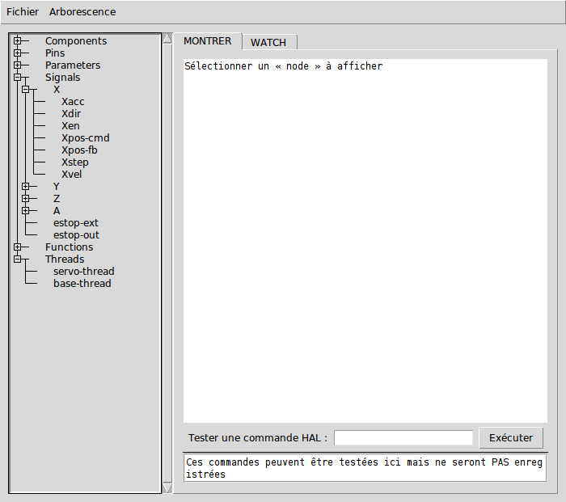
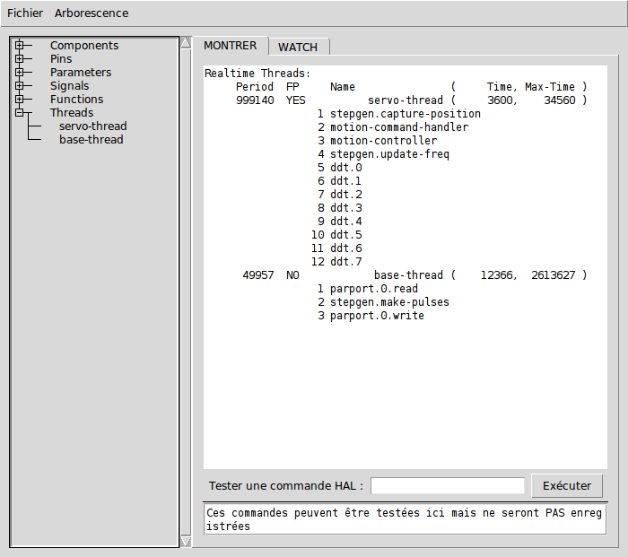

:lang: fr
:toc:

[[cha:halshow]]
= Halshow(((Halshow)))

Le script halshow peut vous aider à retrouver votre chemin dans un HAL
en fonctionnement. Il s'agit d'un système très spécialisé qui doit se
connecter à un HAL en marche. Il ne peut pas fonctionner seul car il
repose sur la capacité de HAL de rapporter ce qu'il connaît de lui même
par la librairie d'interface de halcmd. Chaque fois que halshow
fonctionne avec une configuration de LinuxCNC différente, il sera différent.

Comme nous le verrons bientôt, cette capacité de HAL de se documenter
lui même est un des facteurs clés pour arriver à un système CNC optimum.

== Starting Halshow

On peut accéder à Halshow depuis Axis, pour cela, aller dans le menu _Machine_ puis choisir _Afficher la configuration de HAL_.

Halshow is in the TkLinuxCNC menu under Scripts/HAL Show.

Halshow can be started from a terminal command line and specify
formats for integer and float items (pins or signals) and identify a
saved watchlist file to use:

----
$ halshow --help
Usage:
  halshow [Options] [watchfile]
  Options:
           --help    (this help)
           --fformat format_string_for_float
           --iformat format_string_for_int

Notes:
       Create watchfile in halshow using: 'File/Save Watch List'
       linuxcnc must be running for standalone usage
----

Example to limit number of decimal points for floats
and use a file named my.halshow in the current directory:

----
$ halshow  --fformat "%.5f" ./my.halshow
----

For more information regarding the format, please refer to https://www.tcl.tk/man/tcl/TclCmd/format.html

== Zone de l'arborescence de Hal

La gauche de l'écran que montre la figure ci-dessous est
une arborescence, un peu comme vous pouvez le voir avec certains
navigateurs de fichiers. Sur la droite, une zone avec deux onglets: MONTRER et WATCH.

[[fig:halshow-layout]]
.Fenêtre de Halshow

L'arborescence montre toutes les parties principales de HAL. En face
de chacune d'entre elles, se trouve un petit signe + ou - dans une
case. Cliquer sur le signe plus pour déployer cette partie de
l'arborescence et affichera son contenu. Si cette case affiche un signe moins, cliquer dessus repliera cette section de l'arborescence.

Il est également possible de déployer et de replier l'arborescence
complète depuis le menu _Arborescence_ FIXME at the upper left edge of the display. Under Tree View you will
find: Expand Tree, Collapse Tree; Expand Pins, Expand Parameters,
Expand Signals; and Erase Watch. (Note that Erase Watch erases 'all'
previously set watches, you cannot erase just one watch.)

[[fig:halshow-onglet-montrer]]
.Halshow: Onglet Montrer
image::images/halshow-3.png["Halshow: Onglet Montrer",align="center"]

== Zone de l'onglet Montrer

En cliquant sur un nom dans l'arborescence plutôt que sur son signe
plus ou moins, par exemple le mot _Components_, HAL affichera tout ce
qu'il connait du contenu de celui-ci. La figure
<<cap:Fenetre-Halshow,halshow>> montre une liste comme celle que vous verrez si
vous cliquez sur _Components_ avec une carte servo standard m5i20 en
fonctionnement. L'affichage des informations est exactement le même que
celui des traditionnels outils d'analyse de HAL en mode texte.
L'avantage ici, c'est que nous y avons accès d'un clic de souris. Accès qui peut être aussi large ou aussi focalisé que vous le voulez.

.[yellow-background]#New in 2.9#
* Selected text from the Show tab can be copied by right-click or CTRL-C.
* The command entry provides now a bash-like history (only for the session) for executed commands.

Si nous examinons de plus près l'affichage de l'arborescence, nous
pouvons voir que les six éléments principaux peuvent tous être déployés
d'au moins un niveau. Quand ces niveaux sont à leur tour déployés vous
obtenez une information de plus en plus focalisée en cliquant sur le
nom des éléments dans l'arborescence. Vous trouverez que certaines hal
pins et certains paramètres affichent plusieurs réponses. C'est dû à la
nature des routines de recherche dans halcmd lui même. Si vous cherchez une pin, vous pouvez en trouver deux comme cela:

----
Component Pins:
Owner  Type  Dir  Value  Name
06     bit    -W   TRUE  parport.0.pin-10-in
06     bit    -W  FALSE  parport.0.pin-10-in-not
----

Le deuxième nom de pin contient le nom complémenté du premier.

Dans le bas de l'onglet Montrer, un champ de saisie permet de jouer
sur le fonctionnement de HAL. Les commandes que vous entrez ici et leur
effet sur HAL, ne sont pas enregistrés. Elles persisteront tant que LinuxCNC
tournera, mais disparaîtront dès son arrêt.

Le champ de saisie marqué _Tester une commande HAL:_ acceptera
n'importe quelle commande valide pour halcmd. Elles incluent:

- Loadrt, unloadrt (chargement / déchargement en temps réel du module)
- Loadusr, unloadusr (chargement / déchargement de l'espace utilisateur des composants)
- addf, delf (ajout / suppression d'une fonction de / vers un fil en temps réel)
- net (créer une connexion entre deux ou plusieurs articles)
- setp (jeu de paramètres (ou broches) à une valeur)

Ce petit éditeur entrera une commande à chaque fois que vous presserez
_Entrée_ ou que vous cliquerez sur le bouton _Exécuter_. Si une
commande y est mal formée, un dialogue d'erreur s'affichera. Si vous
n'êtes pas sûr de savoir comment formuler une commande, vous trouverez
la réponse dans la documentation de halcmd et des modules spécifiques
avec lesquels vous travaillez.

Nous allons utiliser cet éditeur pour ajouter un module différentiel à
HAL et le connecter à la position d'un axe pour voir le ratio de
changement de position, par exemple, l'accélération. Il faut d'abord
charger un module de HAL nommé ddt, l'ajouter au thread servo et le
connecter à la pin position d'un axe. Une fois cela fait, nous pourrons
retrouver la sortie du différenciateur dans halscope. Alors allons-y. (oui j'ai vérifié).

[NOTE]
Le message qui s'affiche au chargement de ddt ne l'empêche pas de fonctionner.

----
loadrt ddt
----

Maintenant, regardez dans components, vous devriez y voir ddt
quelque part.

----
Loaded HAL Components:
ID Type        Name
10 User halcmd29800
09 User halcmd29374
08   RT         ddt
06   RT hal_parport
05   RT    scope_rt
04   RT     stepgen
03   RT      motmod
02 User   iocontrol
----

Effectivement, il est là. Dans notre cas l'id est 08. Ensuite nous
devons savoir quelles fonctions sont disponibles avec lui, nous regardons dans Functions.

----
Exported Functions:
Owner  CodeAddr      Arg  FP Users Name
  08   E0B97630 E0DC7674 YES     0 ddt.0
  03   E0DEF83C 00000000 YES     1 motion-command-handler
  03   E0DF0BF3 00000000 YES     1 motion-controller
  06   E0B541FE E0DC75B8  NO     1 parport.0.read
  06   E0B54270 E0DC75B8  NO     1 parport.0.write
  06   E0B54309 E0DC75B8  NO     0 parport.read-all
  06   E0B5433A E0DC75B8  NO     0 parport.write-all
  05   E0AD712D 00000000  NO     0 scope.sample
  04   E0B618C1 E0DC7448 YES     1 stepgen.capture-position
  04   E0B612F5 E0DC7448  NO     1 stepgen.make-pulses
  04   E0B614AD E0DC7448 YES     1 stepgen.update-freq
----

Ici, nous cherchons owner #08 et voyons que blocks a exporté une
fonction nommée ddt.0. Nous devrions être en mesure d'ajouter ddt.0 au
thread servo et il fera ses calculs chaque fois que le thread sera mis
à jour. Encore une fois recherchons la commande addf et on voit qu'elle
utilise trois arguments comme cela:

----
addf <functname> <threadname> [<position>]
----

Nous connaissons déjà functname=ddt.0, pour trouver le nom du thread,
déployons l'arborescence des Threads. Nous y trouvons deux threads,
servo-thread et base-thread. La position de ddt.0 dans le thread n'est
pas critique. Passons la commande:

----
addf ddt.0 servo-thread
----

Comme c'est juste pour visualiser, nous laissons la position en blanc
pour obtenir la dernière position dans le thread. La figure
<<cap:Commande-addf, sur la commande addf>> affiche l'état de halshow après que cette commande a été exécutée.

[[fig:halshow-commande-addf]]
.Commande addf

Ensuite, nous devons connecter ce bloc à quelque chose. Mais comment
savoir quelles pins sont disponibles? La réponse se trouve dans
l'arbre, en regardant sous Pins. On y trouve ddt et on voit:

----
Component Pins:
Owner Type  Dir Value       Name
08    float R-  0.00000e+00 ddt.0.in
08    float -W  0.00000e+00 ddt.0.out
----

Cela semble assez facile à comprendre, mais à quel signal ou pin
voulons-nous nous connecter, ça pourrait être une pin d'axe, une pin de
stepgen, ou un signal. On vois cela en regardant dans axis.0.

----
Component Pins:
Owner Type  Dir Value       Name
03    float -W  0.00000e+00 joint.0.motor-pos-cmd ==> Xpos-cmd
----

Donc, il semble que Xpos-cmd devrait être un bon signal à utiliser.
Retour à l'éditeur et entrons la commande suivante:

----
linksp Xpos-cmd ddt.0.in
----

Maintenant si on regarde le signal Xpos-cmd dans l'arbre, on voit ce
qu'on a fait.

----
Signals:
Type Value Name
float 0.00000e+00 Xpos-cmd
<== joint.0.motor-pos-cmd
==> ddt.0.in
==> stepgen.0.position-cmd
----

Nous voyons que ce signal provient de axis.0.motor-pos-cmd et va, à la
fois, sur ddt.0.in et sur stepgen.0.position-cmd. En connectant notre
bloc au signal nous avons évité les complications avec le flux normal
de cette commande de mouvement.

La zone de l'onglet _Montrer_ utilise halcmd pour découvrir ce qui se
passe à l'intérieur de HAL pendant son fonctionnement. Il vous donne
une information complète de ce qu'il découvre. Il met aussi à jour dès
qu'une commande est envoyée depuis le petit éditeur pour modifier ce
HAL. Il arrive un temps ou vous voulez autre chose d'affiché, sans la
totalité des informations disponibles dans cette zone. C'est la grande valeur de l'onglet _WATCH_ d'offrir cela graphiquement.

== Zone de l'onglet Watch

.[yellow-background]#New in 2.9#
* Buttons for pin/signal/parameter manipulation
* Right-click menu to
  - Copy name
  - Set value
  - Unlink pin
  - Remove from view
* Menu entries for
  - Add signals/pins/parameters by name
  - Set watch interval

En cliquant sur l'onglet Watch, une zone vide s'affichera. footnote:[Le taux de rafraîchissement de la zone Watch est plus
lent que celui de Halmeter ou de Halscope. Si vous avez besoin d'une bonne résolution
dans le timming des signaux, ces outils sont plus efficaces.] 
Vous pouvez ajouter des pins ou des signaux quand l'onglet Watch est
ouvert, en cliquant sur leurs noms. La figure <<cap:onglet-Montrer, 4>>
montre cette zone avec plusieurs signaux de type _bit_. Parmis ces
signaux, les enable-out pour les trois premiers axes et deux de la
branche iocontrol, les signaux _estop_. Notez que les axes ne sont pas
activés même si les signaux estop disent que LinuxCNC n'est pas en estop. Un
bref regard sur TkLinuxCNC en arrière plan, montre que l'état de LinuxCNC est
ESTOP RESET. L'activation des amplis ne deviendra pas vraie tant que la machine ne sera pas mise en marche.

[[fig:halshow-onglet-watch]]
.Halshow: Onglet Watch(((Halshow: Onglet Watch)))
image::images/halshow-4.png["Halshow: Onglet Watch",align="center"]

Les cercles de deux couleurs, simili Leds, sont toujours bruns foncé
quand un signal est faux. Elle sont jaunes quand le signal est vrai.
Quand une pin ou un signal est sélectionné
mais n'est pas de type bit,
sa valeur numérique s'affiche.

Watch permet de visualiser rapidement le résultat de tests sur des contacts ou de voir l'effet d'un changement que vous faites dans LinuxCNC en
utilisant l'interface graphique. Le taux de rafraîchissement de Watch
est un peu trop lent pour visualiser les impulsions de pas d'un moteur
mais vous pouvez l'utiliser si vous déplacez un axe très lentement ou
par très petits incréments de distance. Si vous avez déjà utilisé
IO_Show dans LinuxCNC, la page de Watch de halshow peut être réglée pour afficher ce que fait le port parallèle.

[[cap:watch-tab-context-menu]]
.Halshow: Watch Tab Context Menu
image::images/halshow-5.png["Halshow: Watch Tab Context Menu",align="center"]

// vim: set syntax=asciidoc:
