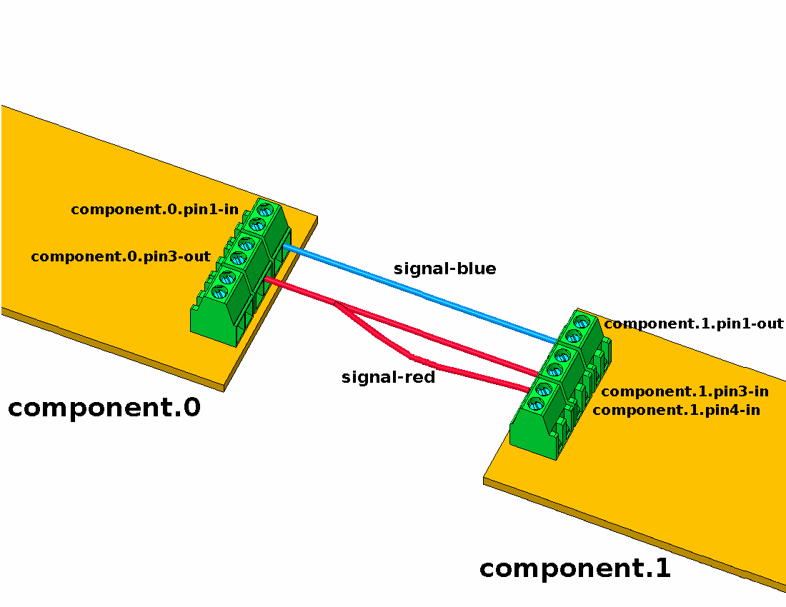
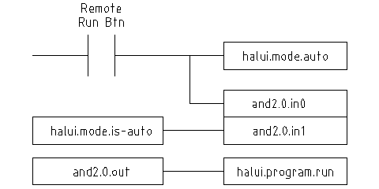

:lang: en
:toc:

[[cha:hal-introduction]]

= HAL Introduction(((HAL Introduction)))

// Custom lang highlight
// must come after the doc title, to work around a bug in asciidoc 8.6.6
:ini: {basebackend@docbook:'':ini}
:hal: {basebackend@docbook:'':hal}
:ngc: {basebackend@docbook:'':ngc}

LinuxCNC is about interacting with hardware. But few users have the same exact hardware specifications - similar, but not the same.
And even for the exact same hardware, there may be different ways to use it, say for different materials or with different mills, which would require adaptations to the control of an already running system.
An abstraction was needed to make it easier to configure LinuxCNC for a wide variety of hardware devices.
At the highest level, it could simply be a way to allow a number of 'building blocks' to be loaded and interconnected to assemble a complex system.

This chapter introduces to that Hardware Abstraction Layer.
You will see that many of the building blocks are indeed, drivers for hardware devices.
However, HAL can do more than just configure hardware drivers.

== HAL Overview(((HAL)))

The Hardware Abstraction Layer (or with a reference to the link:https://en.wikipedia.org/wiki/2001:_A_Space_Odyssey_(film)[2001 Space Odyssey movie] just "HAL") is a software to

* provide the infrastructure for the communication with and between the many software and hardware components of the system.
* optionally process and/or override that information as it flows from component to component.

In itself, this link:https://en.wikipedia.org/wiki/Middleware[Middleware] is agnostic about its application on CNC.
An Internet search, for example, found an astronomical application to control telescopes using LinuxCNC.
Motors move the telescope into the right position, and it needs to know how to map motor activity with the effect of that positioning with the real world.
Such a synchronisation of motor positions with real-world positions is reminiscent of what CNC machines need to do, or space craft.

Any machine controller needs to know:

* about its internal state and how this maps to the environment (machine coordinates, state of switches/regulators),
* how actuators are expected to change that state,
* how allow for updates of the internal state by sensors (encoders, probes).

The HAL layer consists of parts (referred to as "components") that

* are connected with each other, e.g., to update position data or have the planning algorithm tell the motors about the next step.
* may know how to communicate with hardware,
* may simply process incoming data and provide data outputs to other components,
* are always periodically executed either
  - with a very high frequency of a few microseconds (µs) execution time, called base thread, e.g., to
    . give a stepper motor a trigger to step ahead, or to
    . read out the position presented by an encoder.
  - with a lower frequency every millisecond (ms), e.g. to
    . adjust the planning for the next moves to complete a G-code instruction.
  - as non-realtime "user-space" components that run a "main loop" just like any other software, and may be interrupted or delayed when the rest of the system is busy or overloaded.

Taken together, HAL allows

. to program for a machine that the programmer does not know directly,
  but may rely on a programming interface with well-specified effect on the machine.
  That interface may be used to
  * tell the machine what to do
  * listen to what the machine wants to tell about the state it is in.
. Vertical Abstractions: The human system integrator of such machine uses HAL
  * to describe what the machine is looking like and how what cable controls which motor that drives which axis.
  * The description of the machine, the programmer's interfaces and the user's interface somehow "meet" in that abstract layer.
. Horizontal Abstractions:
  * Not all machines have all kinds of features
  * Mills, Lathes and Robots share many
    - features (motors, joints, ...),
    - planning algorithms for their movements.

HAL has no direct interaction with the user.
But multiple interfaces have been provided that allow HAL to be manipulated

* from the command line using the "halcmd" command.
* from Python scripts and
* from within C/C++ programs,

but none of these interfaces are 'HAL itself'.

HAL itself is not a program, it consists of one or more lists of loaded programs (the components) that are periodically executed (in strict sequence), and an area of shared-memory that these components use to interchange data.
The main HAL script runs only once at machine startup, setting up the realtime threads and the shared-memory locations, loading the components and setting up the data links between them (the "signals" and "pins").

In principle multiple machines could share a common HAL to allow them to inter-operate, however the current implementation of LinuxCNC is limited to a single interpreter and a single Task module.
Currently this is almost always a G-code interpreter and "milltask" (which was found to also work well for lathes and adequately for robots) but these modules are selectable at load-time.
With an increasing interest in the control of multiple cooperating machines, to overcome this limitation is likely one of the prime steps for the future development of LinuxCNC to address.
It is a bit tricky though and the community is still organizing its thoughts on this.

HAL lies at the core of LinuxCNC and is used and/or extended by all the parts of LinuxCNC, which includes the GUIs.
The G-code (or alternative language) interpreter knows how to interpret the G-code and translates it into machine operations by triggering signals in HAL.
The user may query HAL in various ways to gain information about its state, which then also represents the state of the machine.
Whilst writing during the development of version 2.9, the GUIs still make bit of an exception to that rule and may know something that HAL does not (need to) know.

== Communication

HAL is special in that it can communicate really fast

* with other programs, but in particular
* with its components that typically run in one of the realtime threads.

And while communicating, the part of LinuxCNC that is talked to does not need to prepare for the communication:
All these actions are performed asynchronously, i.e. no component is interrupting its regular execution to receive a signal and signals can be sent rightaway, i.e., an application may wait until a particular message has arrived - like an enable-signal, but it does not need to prepare for receiving that message.

The communication system

* represents and controls all the hardware attached to the system,
* starts and stops other communicating programs.

The communication with the hardware of the machine itself is performed by respective dedicated HAL components.

The HAL layer is a shared space in which all the many parts that constitute LinuxCNC are exchanging information.
That space features pins that are identified by a name, though a LinuxCNC engineer may prefer the association with a pin of an electronic circuit.
These pins can carry numerical and logical values, boolean, float and signed and unsigned integers. There is also a (relatively new) pin type named hal_port intended for byte streams, and a framework for exchanging more complex data called hal_stream (which uses a private shared memory area, rather than a HAL pin).
These latter two types are used relatively infrequently.

With HAL you can send a signal to that named pin.
Every part of HAL can read that pin that holds that value of the signal.
That is until a new signal is sent to the same named pin to substitute the previous value.
The core message exchange system of HAL is agnostic about CNC, but HAL ships with a large number of components that know a lot about CNC and present that information via pins.
There are pins representing

* static information about the machine
* the current state of the machine
  - end switches
  - positions counted by steppers or as measured by encoders
* recipients for instructions
  - manual control of machine position ("jogging")
  - positions that stepper motors should take next

In a analogy to electronic cables, pins can be wired, so the value changing in one pin serves as input to another pin.
HAL components prepare such input and output pins and are thus automatically triggered to perform.

.HAL Components
The many "expert" software parts of LinuxCNC are typically implemented as _components_ of HAL, conceptually also referred to as _modules_.
These computer-implemented experts perpetually read from HAL about a state that the machine should strive to achieve and compare that desired state with the state the machine is in at the current moment.
When there is a difference between what should be and what the current state is then some action is performed to reduce that difference,
while perpetually writing updates of the current states back to the HAL data space.

There are components specializing on how to talk to stepper motors, and other components know how to control servos.
On a higher level, some components know how the machine's axes are arranged in 3D and yet others know how to perform a smooth movement from one point in space to another.
Lathes, mills and robots will differ in the LinuxCNC component that are active, i.e. that are loaded by a HAL configuration file for that machine.
Still, two machines may be looking very different since built for very different purposes, but when they both use servo motors then they can still both use the same HAL servo component.

.Origin of the Incentive to Move
On the lowest (closest to hardware) level, e.g. for stepper motors, the description of a state of that motor is very intuitive:
It is the number of steps in a particular direction.
A difference between the desired position and the actual position translates into a movement.
Speeds, acceleration and other parameters may be internally limited in the component itself, or may optionally be limited by upstream components.
(For example, in most cases the moment-by-moment axis position values sent to the step-generator components have already been limited and shaped to suit the configured machine limits or the current feed rate.)

Any G-code line is interpreted and triggers a set of routines that in turn know how to communicate with components that are on a middle layer, e.g., to create a circle.

.Pins and Signals
HAL has a special place in the heart of its programmers for the way that the data flow between modules is represented.
When traditional programmers think of variables, addresses or I/O ports, HAL refers to "pins".
And those pins are connected or assigned values to via signals.
Much like an electrical engineer would connect wires between pins of components of a mill, a HAL engineer establishes the data flow between pins of module instances.

The LinuxCNC GUIS (AXIS, GMOCCAPY, Touchy, etc.) will represent the states of some pins (such as limit switches) but other graphical tools also exist for troubleshooting and configuration: Halshow, Halmeter, Halscope and Halreport.

The remainder of this introduction presents

* the syntax of how pins of different components are connected in the HAL configuration files, and
* software to inspect the values of pins
  - at any given moment,
  - developing over time.

[[sec:hal-system-design]]
== HAL System Design(((HAL System Design)))

.HAL is based on traditional system design techniques.

HAL is based on the same principles that are used to design hardware circuits and systems, so it is useful to examine those principles first.
Any system, including a CNC(((CNC))) machine, consists of interconnected components.
For the CNC machine, those components might be the main controller, servo amps or stepper drives, motors, encoders, limit switches, pushbutton pendants, perhaps a VFD for the spindle drive, a PLC to run a toolchanger, etc.
The machine builder must aselect, mount and wire these pieces together to make a complete system.

.HAL Concept - Connecting like electrical circuits.

Figure one would be written in HAL code like this:

[source,{hal}]
----
net signal-blue    component.0.pin1-in      component.1.pin1-out
net signal-red     component.0.pin3-out     component.1.pin3-in     component.1.pin4-in
----

[[sub:hal-part-selection]]
=== Part Selection(((HAL Part selection)))

The machine builder does not need to worry about how each individual part works.
He treats them as black boxes. During the design stage,
he decides which parts he is going to use - steppers or servos, which brand of servo amp, what kind of limit switches and how many, etc.
The integrator's decisions about which specific components to use is based on what that component does and the specifications supplied by the manufacturer of the device.
The size of a motor and the load it must drive will affect the choice of amplifier needed to run it.
The choice of amplifier may affect the kinds of feedback needed by the amp and the velocity or position signals that must be sent to the amp from a control.

In the HAL world, the integrator must decide what HAL components are needed.
Usually every interface card will require a driver.
Additional components may be needed for software generation of step pulses, PLC functionality, and a wide variety of other tasks.

[[sub:hal-interconnections-design]]
=== Interconnection Design(((HAL: Interconnections Design)))

The designer of a hardware system not only selects the parts, he also decides how those parts will be interconnected.
Each black box has terminals, perhaps only two for a simple switch, or dozens for a servo drive or PLC.  They need to be wired together.
The motors connect to the servo amps, the limit switches connect to the controller, and so on.
As the machine builder works on the design, he creates a large wiring diagram that shows how all the parts should be interconnected.

When using HAL, components are interconnected by signals.
The designer must decide which signals are needed, and what they should connect.

[[sub:hal-implementation]]
=== Implementation(((HAL: Implementation)))

Once the wiring diagram is complete it is time to build the machine.
The pieces need to be acquired and mounted, and then they are interconnected according to the wiring diagram.
In a physical system, each interconnection is a piece of wire that needs to be cut and connected to the appropriate terminals.

HAL provides a number of tools to help 'build' a HAL system.
Some of the tools allow you to 'connect' (or disconnect) a single 'wire'.
Other tools allow you to save a complete list of all the parts, wires, and other information about the system, so that it can be 'rebuilt' with a single command.

[[sub:hal-testing]]
=== Testing(((HAL: Testing)))

Very few machines work right the first time.
While testing, the builder may use a meter to see whether a limit switch is working or to measure the DC voltage going to a servo motor.
He may hook up an oscilloscope to check the tuning of a drive, or to look for electrical noise.
He may find a problem that requires the wiring diagram to be changed; perhaps a part needs to be connected differently or replaced with something completely different.

HAL provides the software equivalents of a voltmeter, oscilloscope, signal generator, and other tools needed for testing and tuning a system.
The same commands used to build the system can be used to make changes as needed.

[[sub:hal-basics]]
=== Summary(((HAL Basics Summary)))

This document is aimed at people who already know how to do this kind of hardware system integration, but who do not know how to connect the hardware to LinuxCNC.
See the <<sec:halui-remote-start,Remote Start Example>> section in the HAL UI Examples documentation.

.Remote Start Example (Schema)

The traditional hardware design as described above ends at the edge of the main control.
Outside the control are a bunch of relatively simple boxes, connected together to do whatever is needed.
Inside, the control is a big mystery -- one huge black box that we hope works.

HAL extends this traditional hardware design method to the inside of the big black box.
It makes device drivers and even some internal part of the controller into smaller black boxes that can be interconnected and even replaced just like the external hardware.
It allows the 'system wiring diagram' to show part of the internal controller, rather than just a big black box.
And most importantly, it allows the integrator to test and modify the controller using the same methods he would use on the rest of the hardware.

Terms like motors, amps, and encoders are familiar to most machine integrators.
When we talk about using extra flexible eight conductor shielded cable to connect an encoder to the servo input board in the computer,
the reader immediately understands what it is and is led to the question, 'what kinds of connectors will I need to make up each end.'
The same sort of thinking is essential for the HAL but the specific train of thought may take a bit to get on track.
Using HAL words may seem a bit strange at first, but the concept of working from one connection to the next is the same.

This idea of extending the wiring diagram to the inside of the controller is what HAL is all about.
If you are comfortable with the idea of interconnecting hardware black boxes, you will probably have little trouble using HAL to interconnect software black boxes.

[[sec:hal-concepts]]
== HAL Concepts(((HAL Concepts)))

This section is a glossary that defines key HAL terms but it is a bit different than a traditional glossary because these terms are not arranged in alphabetical order.
They are arranged by their relationship or flow in the HAL way of things.

Component:: (((HAL Component)))
  When we talked about hardware design, we referred to the individual pieces as 'parts', 'building blocks', 'black boxes', etc.
  The HAL equivalent is a 'component' or 'HAL component'.
  This document uses 'HAL component' when there is likely to be confusion with other kinds of components, but normally just uses 'component'.
  A HAL component is a piece of software with well-defined inputs, outputs, and behavior, that can be installed and interconnected as needed.
   +
   +
  Many HAL Components model the behaviour of a tangible part of a machine,
  and a *pin* may indeed be meant to be connected to a *physical pin* on the device to communicate with it, hence the names.
  But most often this is not the case.
  Imagine a retrofit of a manual lathe/mill.
  What LinuxCNC implements is how the machine presents itself to the outside world,
  and it is secondary if the implementation how to draw a circle is implemented on the machine already or provided from LinuxCNC.
  And it is common to add buttons to the imaginary retrofit that *signal* an action, like an emergency stop.
  LinuxCNC and the machine become one. And that is through the HAL.

Parameter:: (((HAL Parameter)))
  Many hardware components have adjustments that are not connected to any other components but still need to be accessed.
  For example, servo amps often have trim pots to allow for tuning adjustments, and test points where a meter or scope can be attached to view the tuning results.
  HAL components also can have such items, which are referred to as 'parameters'.
  There are two types of parameters:
  Input parameters are equivalent to trim pots - they are values that can be adjusted by the user, and remain fixed once they are set.
  Output parameters cannot be adjusted by the user - they are equivalent to test points that allow internal signals to be monitored.

Pin:: (((HAL Pin)))
  Hardware components have terminals which are used to interconnect them.
  The HAL equivalent is a 'pin' or 'HAL pin'.
  'HAL pin' is used when needed to avoid confusion.
  All HAL pins are named, and the pin names are used when interconnecting them.
  HAL pins are software entities that exist only inside the computer.

Physical_Pin:: (((HAL Physical Pin)))
  Many I/O devices have real physical pins or terminals that connect to external hardware, for example the pins of a parallel port connector.
  To avoid confusion, these are referred to as 'physical pins'.
  These are the things that 'stick out' into the real world.

[NOTE]
====
You may be wondering what relationship there is between the HAL_pins, physical_pins and external elements like encoders or a STG card: we are dealing here with interfaces of data translation/conversion type.
====

Signal:: (((HAL Signal)))
  In a physical machine, the terminals of real hardware components are interconnected by wires.
  The HAL equivalent of a wire is a 'signal' or 'HAL signal'.
  HAL signals connect HAL pins together as required by the machine builder.
  HAL signals can be disconnected and reconnected at will (even while the machine is running).

Type:: (((HAL Type)))
  When using real hardware, you would not connect a 24 Volt relay output to the +/-10&#8239;V analog input of a servo amp.
  HAL pins have the same restrictions, which are based upon their type.
  Both pins and signals have types, and signals can only be connected to pins of ffvthe same type.
  Currently there are 4 types, as follows:
+
- bit - a single TRUE/FALSE or ON/OFF value
- float - a 64 bit floating point value, with approximately 53 bits of
  resolution and over 1000 bits of dynamic range.
- u32 - a 32 bit unsigned integer, legal values are 0 to 4,294,967,295
- s32 - a 32 bit signed integer, legal values are -2,147,483,647 to
  +2,147,483,647

Function:: (((HAL:Function)))
  Real hardware components tend to act immediately on their inputs.
  For example, if the input voltage to a servo amp changes, the output also changes automatically.
  However software components cannot act 'automatically'.
  Each component has specific code that must be executed to do whatever that component is supposed to do.
  In some cases, that code simply runs as part of the component.
  However in most cases, especially in realtime components, the code must run in a specific sequence and at specific intervals.
  For example, inputs should be read before calculations are performed on the input data,
  and outputs should not be written until the calculations are done.
  In these cases, the code is made available to the system in the form of one or more 'functions'.
  Each function is a block of code that performs a specific action.
  The system integrator can use 'threads' to schedule a series of functions to be executed in a particular order and at specific time intervals.

Thread:: (((HAL:Thread)))
  A 'thread' is a list of functions that runs at specific intervals as part of a realtime task.
  When a thread is first created, it has a specific time interval (period), but no functions.
  Functions can be added to the thread, and will be executed in order every time the thread runs.

As an example, suppose we have a parport component named hal_parport.
That component defines one or more HAL pins for each physical pin.
The pins are described in that component's doc section:
Their names, how each pin relates to the physical pin, are they inverted, can you change polarity, etc.
But that alone doesn't get the data from the HAL pins to the physical pins.
It takes code to do that, and that is where functions come into the picture.
The parport component needs at least two functions:
One to read the physical input pins and update the HAL pins, the other to take data from the HAL pins and write it to the physical output pins.
Both of these functions are part of the parport driver.

[[sec:hal-components]]
== HAL components(((HAL Components)))

Each HAL component is a piece of software with well-defined inputs, outputs, and behavior, that can be installed and interconnected as needed.
The section <<sec:hal-components,HAL Components List>> lists all available components and a brief description of what each does.

[[sec:hal-timing-issues]]
== Timing Issues In HAL(((HAL Timing Issues)))

Unlike the physical wiring models between black boxes that we have said that HAL is based upon,
simply connecting two pins with a HAL-signal falls far short of the action of the physical case.

True relay logic consists of relays connected together, and when a contact opens or closes, current flows (or stops) immediately.
Other coils may change state, etc., and it all just 'happens'.
But in PLC style ladder logic, it doesn't work that way.
Usually in a single pass through the ladder, each rung is evaluated in the order in which it appears, and only once per pass.
A perfect example is a single rung ladder, with a NC contact in series with a coil.
The contact and coil belong to the same relay.

If this were a conventional relay, as soon as the coil is energized, the contacts begin to open and de-energize it.
That means the contacts close again, etc., etc.
The relay becomes a buzzer.

With a PLC, if the coil is OFF and the contact is closed when the PLC begins to evaluate the rung, then when it finishes that pass, the coil is ON.
The fact that turning on the coil opens the contact feeding it is ignored until the next pass.
On the next pass, the PLC sees that the contact is open, and de-energizes the coil.
So the relay still switches rapidly between on and off, but at a rate determined by how often the PLC evaluates the rung.

In HAL, the function is the code that evaluates the rung(s).
In fact, the HAL-aware realtime version of ClassicLadder exports a function to do exactly that.
Meanwhile, a thread is the thing that runs the function at specific time intervals.
Just like you can choose to have a PLC evaluate all its rungs every 10&#8239;ms, or every second, you can define HAL threads with different periods.

What distinguishes one thread from another is 'not' what the thread does - that is determined by which functions are connected to it.
The real distinction is simply how often a thread runs.

In LinuxCNC you might have a 50 µs thread and a 1 ms thread.
These would be created based on BASE_PERIOD and SERVO_PERIOD, the actual times depend on the values in your INI file.

The next step is to decide what each thread needs to do.
Some of those decisions are the same in (nearly) any LinuxCNC system.
For instance, motion-command-handler is always added to servo-thread.

Other connections would be made by the integrator.
These might include hooking the STG driver's encoder read and DAC write functions to the servo thread, or hooking StepGen's function to the base-thread, along with the parport function(s) to write the steps to the port.

// vim: set syntax=asciidoc:
