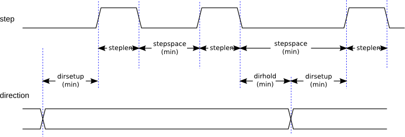
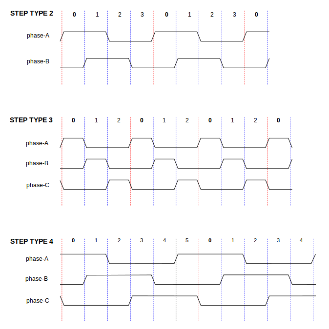
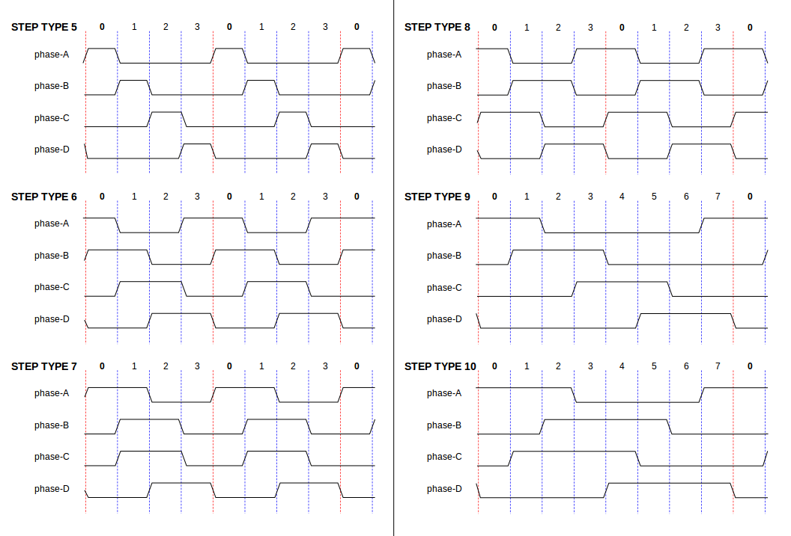
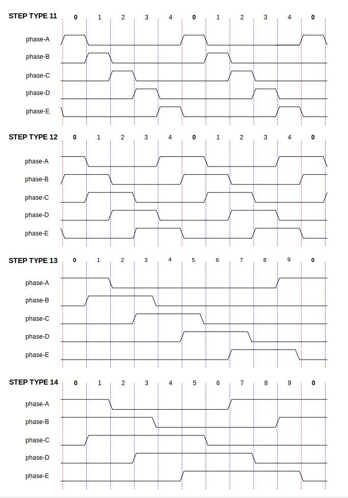

:lang: en
:toc:

[[cha:realtime-components]]
= HAL Component Descriptions

This chapter provides details on core functionalities of LinuxCNC that demand exact timing for

* the generation of signals that is interpreted by hardware (like motors) or
* for the interpretation of signals sent by the hardware (like encoders).

[[sec:stepgen]]
== StepGen(((stepgen)))

This component provides software based generation of step pulses in response to position or velocity commands.
In position mode, it has a built in pre-tuned position loop, so PID tuning is not required.
In velocity mode, it drives a motor at the commanded speed, while obeying velocity and acceleration limits.
It is a realtime component only, and depending on CPU speed, etc., is capable of maximum step rates of 10&#8239;kHz to perhaps 50&#8239;kHz.
The step pulse generator block diagram shows three block diagrams, each is a single step pulse generator.
The first diagram is for step type '0', (step and direction).
The second is for step type '1' (up/down, or pseudo-PWM), and the third is for step types 2 through 14 (various stepping patterns).
The first two diagrams show position mode control, and the third one shows velocity mode.
Control mode and step type are set independently, and any combination can be selected.

[[fig:stepgen-block-diagram]]
.Step Pulse Generator Block Diagram position mode(((Stepgen Block Diagram)))
image::images/stepgen-block-diag.png[align="center"]

.Loading `stepgen` component
----
halcmd: loadrt stepgen step_type=<type-array> [ctrl_type=<ctrl_array>]
----

<type-array>:: is a series of comma separated decimal integers. Each number causes a single step pulse generator to be loaded, the value of the number determines the stepping type.
<ctrl_array>:: is a comma separated series of 'p' or 'v' characters, to specify position or velocity mode.
ctrl_type:: is optional, if omitted, all of the step generators will be position mode.

For example:

----
halcmd: loadrt stepgen step_type=0,0,2 ctrl_type=p,p,v
----

Will install three step generators.
The first two use step type '0' (step and direction) and run in position mode.
The last one uses step type '2' (quadrature) and runs in velocity mode.
The default value for '<config-array>' is '0,0,0' which will install three type '0' (step/dir) generators.
The maximum number of step generators is 8 (as defined by MAX_CHAN in stepgen.c).
Each generator is independent, but all are updated by the same function(s) at the same time.
In the following descriptions, _<chan>_ is the number of a specific generator. The first generator is number 0.

.Unloading `stepgen` component
----
halcmd: unloadrt stepgen
----

[[sub:stepgen-pins]]
=== Pins(((HAL stepgen pins)))

On the step type and control type selected.

* (float) `stepgen.`__<chan>__`.position-cmd` - Desired motor position, in position units (position mode only).
* (float) `stepgen.`__<chan>__`.velocity-cmd` - Desired motor velocity, in position units per second (velocity mode only).
* s32) `stepgen.`__<chan>__`.counts` - Feedback position in counts, updated by 'capture_position()'.
* (float) `stepgen.`__<chan>__`.position-fb` - Feedback position in position units, updated by 'capture_position()'.
* (bit) `stepgen.`__<chan>__`.enable` - Enables output steps - when false, no steps are generated.
* (bit) `stepgen.`__<chan>__`.step` - Step pulse output (step type 0 only).
* (bit) `stepgen.`__<chan>__`.dir` - Direction output (step type 0 only).
* (bit) `stepgen.`__<chan>__`.up` - UP pseudo-PWM output (step type 1 only).
* (bit) `stepgen.`__<chan>__`.down` - DOWN pseudo-PWM output (step type 1 only).
* (bit) `stepgen.`__<chan>__`.phase-A` - Phase A output (step types 2-14 only).
* (bit) `stepgen.`__<chan>__`.phase-B` - Phase B output (step types 2-14 only).
* (bit) `stepgen.`__<chan>__`.phase-C` - Phase C output (step types 3-14 only).
* (bit) `stepgen.`__<chan>__`.phase-D` - Phase D output (step types 5-14 only).
* (bit) `stepgen.`__<chan>__`.phase-E` - Phase E output (step types 11-14 only).

[[sec:stepgen-parameters]]
=== Parameters(((HAL stepgen parameters)))

* (float) `stepgen.`__<chan>__`.position-scale` - Steps per position unit. This parameter is used for both output and feedback.
* (float) `stepgen.`__<chan>__`.maxvel` - Maximum velocity, in position units per second. If 0.0, has no effect.
* (float) `stepgen.`__<chan>__`.maxaccel` - Maximum accel/decel rate, in positions units per second squared.
  If 0.0, has no effect.
* (float) `stepgen.`__<chan>__`.frequency` - The current step rate, in steps per second.
* (float) `stepgen.`__<chan>__`.steplen` - Length of a step pulse (step type 0 and 1) or minimum time in a given state (step types 2-14), in nano-seconds.
* (float) `stepgen.`__<chan>__`.stepspace` - Minimum spacing between two step pulses (step types 0 and 1 only), in nano-seconds.
  Set to 0 to enable the stepgen 'doublefreq' function. To use 'doublefreq' the <<sub:parport-functions,parport reset function>> must be enabled.
* (float) `stepgen.`__<chan>__`.dirsetup` - Minimum time from a direction change to the beginning of the next step pulse (step type 0 only), in nanoseconds.
* (float) `stepgen.`__<chan>__`.dirhold` - Minimum time from the end of a step pulse to a direction change (step type 0 only), in nanoseconds.
* (float) `stepgen.`__<chan>__`.dirdelay` - Minimum time any step to a step in the opposite direction (step types 1-14 only), in nano-seconds.
* (s32) `stepgen.`__<chan>__`.rawcounts` - The raw feedback count, updated by 'make_pulses()'.

In position mode, the values of maxvel and maxaccel are used by the internal position loop to avoid generating step pulse trains that the motor cannot follow.
When set to values that are appropriate for the motor, even a large instantaneous change in commanded position will result in a smooth trapezoidal move to the new location.
The algorithm works by measuring both position error and velocity error, and calculating an acceleration that attempts to reduce both to zero at the same time.
For more details, including the contents of the 'control equation' box, consult the code.

In velocity mode, maxvel is a simple limit that is applied to the commanded velocity, and maxaccel is used to ramp the actual frequency if the commanded velocity changes abruptly.
As in position mode, proper values for these parameters ensure that the motor can follow the generated pulse train.

[[sub:stepgen-step-types]]
=== Step Types(((HAL stepgen Step Types)))

Step generator supports 15 different _step sequences_:

.Step Type 0
Step type 0 is the standard step and direction type.
When configured for step type 0, there are four extra parameters that determine the exact timing of the step and direction signals.
In the following figure the meaning of these parameters is shown.
The parameters are in nanoseconds, but will be rounded up to an integer multiple of the thread period for the threaed that calls 'make_pulses()'.
For example, if 'make_pulses()' is called every 16&#8239;µs, and steplen is 20000, then the step pulses will be 2 x 16 = 32&#8239;µs long.
The default value for all four of the parameters is 1&#8239;ns, but the automatic rounding takes effect the first time the code runs.
Since one step requires _steplen_ ns high and _stepspace_ ns low, the maximum frequency is 1,000,000,000 divided by (_steplen_ + _stepspace_)'.
If _maxfreq_ is set higher than that limit, it will be lowered automatically.
If _maxfreq_ is zero, it will remain zero, but the output frequency will still be limited.

When using the parallel port driver the step frequency can be doubled using the <<sub:parport-functions,parport reset>> function together with StepGen's _doublefreq_ setting.

[[fig:stepdir-timing]]
.Step and Direction Timing

.Step Type 1
Step type 1 has two outputs, up and down.
Pulses appear on one or the other, depending on the direction of travel.
Each pulse is _steplen_ ns long, and the pulses are separated by at least _stepspace_ ns.
The maximum frequency is the same as for step type 0.
If _maxfreq_ is set higher than the limit it will be lowered.
If _maxfreq_ is zero, it will remain zero but the output frequency will still be limited.

[WARNING]
Do not use the parport reset function with step types 2 - 14.
Unexpected results can happen.

.Step Type 2 - 14
Step types 2 through 14 are state based, and have from two to five outputs.
On each step, a state counter is incremented or decremented.
The Two-and-Three-Phase, Four-Phase, and Five-Phase show the output patterns as a function of the state counter.
The maximum frequency is 1,000,000,000 divided by _steplen_, and as in the other modes, _maxfreq_ will be lowered if it is above the limit.

.Two-and-Three-Phase Step Types(((Two and Three Phase)))

.Four-Phase Step Types(((Four Phase)))

.Five-Phase Step Types(((Five Phase)))

[[sub:stepgen-functions]]
=== Functions(((Hal stepgen Functions)))

The component exports three functions.
Each function acts on all of the step pulse generators - running different generators in different threads is not supported.

* (funct) `stepgen.make-pulses` - High speed function to generate and count pulses (no floating point).
* (funct) `stepgen.update-freq` - Low speed function does position to velocity conversion, scaling and limiting.
* (funct) `stepgen.capture-position` - Low speed function for feedback, updates latches and scales position.

The high speed function 'stepgen.make-pulses' should be run in a very fast thread, from 10 to 50&#8239;µs depending on the capabilities of the computer.
That thread's period determines the maximum step frequency, since 'steplen', 'stepspace', 'dirsetup', 'dirhold', and 'dirdelay' are all rounded up to a integer multiple of the thread periond in nanoseconds.
The other two functions can be called at a much lower rate.

[[sec:pwmgen]]
== PWMgen(((PWMgen)))

This component provides software based generation of PWM (Pulse Width Modulation) and PDM (Pulse Density Modulation) waveforms.
It is a realtime component only, and depending on CPU speed, etc., is capable of PWM frequencies from a few hundred Hertz at pretty good resolution,
to perhaps 10 kHz with limited resolution.

.Loading PWMgen
----
loadrt pwmgen output_type=<config-array>
----

The '<config-array>' is a series of comma separated decimal integers.
Each number causes a single PWM generator to be loaded, the value of the number determines the output type.
The following example will install three PWM generators.
There is no default value, if '<config-array>' is not specified, no PWM generators will be installed.
The maximum number of frequency generators is 8 (as defined by MAX_CHAN in pwmgen.c).
Each generator is independent, but all are updated by the same function(s) at the same time.
In the following descriptions, '_<chan>_' is the number of a specific generator.
The first generator is number 0.

.Loading PWMgen Example
----
loadrt pwmgen output_type=0,1,2
----

Will install three PWM generators.
The first will use an output of type _0_ (PWM only), the next one will use a type 1 output (PWM and direction) and the third will use a type 2 output (UP and DOWN).
There is no default value, if _<config-array>_ is not not specified, no PWM generator will be installed.
The maximum number of frequency generators is 8 (as defined by MAX_CHAN in pwmgen.c).
Each generator is independent, but all are updated by the same function(s), at the same time.
In the descriptions that follow, _<chan>_ is the number of specific generators.
The numbering of PWM generators starts at 0.

.Unloading PWMgen
----
unloadrt pwmgen
----

=== Output Types

The PWM generator supports three different 'output types'.

* 'Output type 0' - PWM output pin only.
  Only positive commands are accepted, negative values are treated as zero (and will be affected by the parameter 'min-dc' if it is non-zero).
* 'Output type 1' - PWM/PDM and direction pins.
  Positive and negative inputs will be output as positive and negative PWM.
  The direction pin is false for positive commands, and true for negative commands.
  If your control needs positive PWM for both CW and CCW use the link:../man/man9/abs.9.html[abs] component to convert your PWM signal to positive value, when a negative input is input.
* 'Output type 2' - UP and DOWN pins.
  For positive commands, the PWM signal appears on the up output, and the down output remains false.
  For negative commands, the PWM signal appears on the down output, and the up output remains false.
  Output type 2 is suitable for driving most H-bridges.

=== Pins

Each PWM generator will have the following pins:

* (float) `pwmgen.`__<chan>__`.value` - Command value, in arbitrary units.
  Will be scaled by the 'scale' parameter (see below).
* (bit) `pwmgen.`__<chan>__`.enable` - Enables or disables the PWM generator outputs.

Each PWM generator will also have some of these pins, depending on the output type selected:

* (bit) `pwmgen.`__<chan>__`.pwm` - PWM (or PDM) output, (output types 0 and 1 only).
* (bit) `pwmgen.`__<chan>__`.dir` - Direction output (output type 1 only).
* (bit) `pwmgen.`__<chan>__`.up` - PWM/PDM output for positive input value (output type 2 only).
* (bit) `pwmgen.`__<chan>__`.down` - PWM/PDM output for negative input value (output type 2 only).

=== Parameters

* (float) `pwmgen.`__<chan>__`.scale` - Scaling factor to convert `value`  from arbitrary units to duty cycle.
  For example if scale is set to 4000 and the input value passed to the `pwmgen.`__<chan>__`.value` is 4000 then it will be 100% duty-cycle (always on).
  If the value is 2000 then it will be a 50% 25&#8239;Hz square wave.
* (float) `pwmgen.`__<chan>__`.pwm-freq` - Desired PWM frequency, in Hz.
  If 0.0, generates PDM instead of PWM. If set higher than internal limits, next call of 'update_freq()' will set it to the internal limit.
  If non-zero, and 'dither' is false, next call of 'update_freq()' will set it to the nearest integer multiple of the 'make_pulses()' function period.
* (bit) `pwmgen.`__<chan>__`.dither-pwm` - If true, enables dithering to achieve average PWM frequencies or duty cycles that are unobtainable with pure PWM.
  If false, both the PWM frequency and the duty cycle will be rounded to values that can be achieved exactly.
* (float) `pwmgen.`__<chan>__`.min-dc` - Minimum duty cycle, between 0.0 and 1.0 (duty cycle will go to zero when disabled, regardless of this setting).
* (float) `pwmgen.`__<chan>__`.max-dc` - Maximum duty cycle, between 0.0 and 1.0.
* (float) `pwmgen.`__<chan>__`.curr-dc` - Current duty cycle - after all limiting and rounding (read only).

=== Functions

The component exports two functions. Each function acts on all of the PWM generators - running different generators in different threads is not supported.

* (funct) `pwmgen.make-pulses` - High speed function to generate PWM waveforms (no floating point).
  The high speed function `pwmgen.make-pulses` should be run in the base (fastest) thread, from 10 to 50&#8239;µs depending on the capabilities of the computer.
  That thread's period determines the maximum PWM carrier frequency, as well as the resolution of the PWM or PDM signals.
  If the base thread is 50,000&#8239;ns then every 50&#8239;µs the module decides if it is time to change the state of the output.
  At 50% duty cycle and 25&#8239;Hz PWM frequency this means that the output changes state every (1/25)&#8239;s / 50&#8239;µs * 50% = 400 iterations.
  This also means that you have a 800 possible duty cycle values (without dithering).
* (funct) `pwmgen.update` - Low speed function to scale and limit value and handle other parameters.
  This is the function of the module that does the more complicated mathematics to work out how many base-periods the output should be high for, and how many it should be low for.

[[sec:encoder]]
== Encoder(((encoder)))

This component provides software based counting of signals from quadrature (or single-pulse) encoders.
It is a realtime component only, and depending on CPU speed, latency, etc., is capable of maximum count rates of 10&#8239;kHz to perhaps up to 50&#8239;kHz.

The base thread should be 1/2 count speed to allow for noise and timing variation.
For example if you have a 100 pulse per revolution encoder on the spindle and your maximum RPM is 3000 the maximum base thread should be 25&#8239;µs.
A 100 pulse per revolution encoder will have 400 counts.
The spindle speed of 3000&#8239;RPM = 50&#8239;RPS (revolutions per second). 400 * 50 = 20,000 counts per second or 50&#8239;µs between counts.

The Encoder Counter Block Diagram is a block diagram of one channel of an encoder counter.

[[fig:encoder-block-diagram]]
.Encoder Counter Block Diagram(((Encoder Block Diagram)))

.Loading Encoder
----
halcmd: loadrt encoder [num_chan=<counters>]
----

_<counters>_ is the number of encoder counters that you want to install.
If 'num_chan' is not specified, three counters will be installed.
The maximum number of counters is 8 (as defined by MAX_CHAN in encoder.c).
Each counter is independent, but all are updated by the same function(s) at the same time.
In the following descriptions, _<chan>_ is the number of a specific counter. The first counter is number 0.

.Unloading Encoder
----
halcmd: unloadrt encoder
----

=== Pins

* `encoder._<chan>_.counter-mode` (bit, I/O) (default: FALSE) - Enables counter mode.
  When true, the counter counts each rising edge of the phase-A input, ignoring the value on phase-B.
  This is useful for counting the output of a single channel (non-quadrature) sensor. When false, it counts in quadrature mode.
* `encoder._<chan>_.missing-teeth` (s32, In) (default: 0) - Enables the use of missing-tooth index.
  This allows a single IO pin to provide both position and index information.
  If the encoder wheel has 58 teeth with two missing, spaced as if there were 60(common for automotive crank sensors) then the position-scale should be set to 60 and missing-teeth to 2.
  To use this mode counter-mode should be set true. This mode will work for lathe threading but not for rigid tapping.
* `encoder._<chan>_.counts` (s32, Out) - Position in encoder counts.
* `encoder._<chan>_.counts-latched` (s32, Out) - Not used at this time.
* `encoder._<chan>_.index-enable` (bit, I/O) - When True, `counts` and
  `position` are reset to zero on next rising edge of Phase Z. +
  At the same time, `index-enable` is reset to zero to indicate that the rising edge has occurred.
  The `index-enable` pin is bi-directional.
  If `index-enable` is False, the Phase Z channel of the encoder will be ignored, and the counter will count normally.
  The encoder driver will never set `index-enable` True. However, some other component may do so.
* `encoder._<chan>_.latch-falling` (bit, In) (default: TRUE) - Not used at this time.
* `encoder._<chan>_.latch-input` (bit, In) (default: TRUE) - Not used at this time.
* `encoder._<chan>_.latch-rising` (bit, In) - Not used at this time.
* `encoder._<chan>_.min-speed-estimate` (float, in) - Determine the minimum true velocity magnitude, at which velocity will be estimated as nonzero and position-interpolated will be interpolated.
  The units of `min-speed-estimate` are the same as the units of `velocity`. Scale factor, in counts per length unit.
  Setting this parameter too low will cause it to take a long time for velocity to go to 0 after encoder pulses have stopped arriving.
* `encoder._<chan>_.phase-A` (bit, In) - Phase A of the quadrature encoder signal.
* `encoder._<chan>_.phase-B` (bit, In) - Phase B of the quadrature encoder signal.
* `encoder._<chan>_.phase-Z` (bit, In) - Phase Z (index pulse) of the quadrature encoder signal.
* `encoder._<chan>_.position` (float, Out) - Position in scaled units (see `position-scale`).
* `encoder._<chan>_.position-interpolated` (float, Out) - Position in scaled units, interpolated between encoder counts. +
  The `position-interpolated` attempts to interpolate between encoder counts, based on the most recently measured velocity.
  Only valid when velocity is approximately constant and above `min-speed-estimate`.
  Do not use for position control, since its value is incorrect at low speeds, during direction reversals, and during speed changes. +
  However, it allows a low ppr encoder (including a one pulse per revolution 'encoder') to be used for lathe threading, and may have other uses as well.
* `encoder._<chan>_.position-latched` (float, Out) - Not used at this time.
* `encoder._<chan>_.position-scale` (float, I/O) - Scale factor, in counts per length unit. For example, if
  position-scale is 500, then 1000 counts of the encoder will be reported as a position of 2.0 units.
* `encoder._<chan>_.rawcounts` (s32, In) - The raw count, as determined by update-counters.
  This value is updated more frequently than counts and position.
  It is also unaffected by reset or the index pulse.
* `encoder._<chan>_.reset` (bit, In) - When True, force 'counts' and 'position' to zero immediately.
* `encoder._<chan>_.velocity` (float, Out) - Velocity in scaled units per second.
  `encoder` uses an algorithm that greatly reduces quantization noise as compared to simply differentiating the 'position' output.
  When the magnitude of the true velocity is below min-speed-estimate, the velocity output is 0.
* `encoder._<chan>_.x4-mode` (bit, I/O) (default: TRUE) - Enables times-4 mode.
  When true, the counter counts each edge of the quadrature waveform (four counts per full cycle).
  When false, it only counts once per full cycle.
  In counter-mode, this parameter is ignored. The 1x mode is useful for some jogwheels.

=== Parameters

* `encoder._<chan>_.capture-position.time` (s32, RO)
* `encoder._<chan>_.capture-position.tmax` (s32, RW)
* `encoder._<chan>_.update-counters.time` (s32, RO)
* `encoder._<chan>_.update-counter.tmax` (s32, RW)

=== Functions

The component exports two functions.
Each function acts on all of the encoder counters - running different counters in different threads is not supported.

* (funct) `encoder.update-counters` - High speed function to count pulses (no floating point).
* (funct) `encoder.capture-position` - Low speed function to update latches and scale position.

[[sec:pid]]
== PID(((PID)))

This component provides Proportional/Integral/Derivative control loops.
It is a realtime component only. For simplicity, this discussion assumes that we are talking about position loops,
however this component can be used to implement other feedback loops such as speed, torch height, temperature, etc.
The PID Loop Block Diagram is a block diagram of a single PID loop.

[[fig:pid-block-diag]]
.PID Loop Block Diagram(((PID Block Diagram)))

.Loading PID
----
halcmd: loadrt pid [num_chan=<loops>] [debug=1]
----

_<loops>_ is the number of PID loops that you want to install.
If _num_chan_ is not specified, one loop will be installed.
The maximum number of loops is 16 (as defined by MAX_CHAN in pid.c).
Each loop is completely independent. In the following descriptions, _<loopnum>_ is the loop number of a specific loop.
The first loop is number 0.

If `debug=1` is specified, the component will export a few extra pins that may be useful during debugging and tuning.
By default, the extra pins are not exported, to save shared memory space and avoid cluttering the pin list.

.Unloading PID
----
halcmd: unloadrt pid
----

=== Pins

The three most important pins are

* (float) `pid.`__<loopnum>__`.command` - The desired position, as commanded by another system component.
* (float) `pid.`__<loopnum>__`.feedback` - The present position, as measured by a feedback device such as an encoder.
* (float) `pid.`__<loopnum>__`.output` - A velocity command that attempts to move from the present position to the desired position.

For a position loop, `.command` and `.feedback` are in position units.
For a linear axis, this could be inches, mm, meters, or whatever is relevant.
Likewise, for an angular axis, it could be degrees, radians, etc.
The units of the `.output` pin represent the change needed to make the feedback match the command.
As such, for a position loop `.output` is a velocity, in inches/s, mm/s, degrees/s, etc.
Time units are always seconds, and the velocity units match the position units.
If command and feedback are in meters, then output is in meters per second.

Each loop has two pins which are used to monitor or control the general operation of the component.

* '(float) pid._<loopnum>_.error' - Equals '.command' minus '.feedback'.
* '(bit) pid._<loopnum>_.enable' - A bit that enables the loop.
  If '.enable' is false, all integrators are reset, and the output is forced to zero.
  If '.enable' is true, the loop operates normally.

Pins used to report saturation. Saturation occurs when the output of the PID block is at its maximum or minimum limit.

* '(bit) pid._<loopnum>_.saturated' - True when output is saturated.
* '(float) pid._<loopnum>_.saturated_s' - The time the output has been saturated.
* '(s32) pid._<loopnum>_.saturated_count' - The time the output has been saturated.

The PID gains, limits, and other 'tunable' features of the loop are available as pins so that they can be adjusted dynamically for more advanced tuning possibilities.

* '(float) pid._<loopnum>_.Pgain' - Proportional gain
* '(float) pid._<loopnum>_.Igain' - Integral gain
* '(float) pid._<loopnum>_.Dgain' - Derivative gain
* '(float) pid._<loopnum>_.bias' - Constant offset on output
* '(float) pid._<loopnum>_.FF0' - Zeroth order feedforward - output proportional to command (position).
* '(float) pid._<loopnum>_.FF1' - First order feedforward - output proportional to derivative of command (velocity).
* '(float) pid._<loopnum>_.FF2' - Second order feedforward - output proportional to 2^nd^ derivative of command (acceleration).
* '(float) pid._<loopnum>_.deadband' - Amount of error that will be ignored
* '(float) pid._<loopnum>_.maxerror' - Limit on error
* '(float) pid._<loopnum>_.maxerrorI' - Limit on error integrator
* '(float) pid._<loopnum>_.maxerrorD' - Limit on error derivative
* '(float) pid._<loopnum>_.maxcmdD' - Limit on command derivative
* '(float) pid._<loopnum>_.maxcmdDD' - Limit on command 2^nd^ derivative
* '(float) pid._<loopnum>_.maxoutput' - Limit on output value

All _max*_ limits are implemented so that if the value of this parameter is zero, there is no limit.

If 'debug=1' was specified when the component was installed, four additional pins will be exported:

* '(float) pid._<loopnum>_.errorI' - Integral of error.
* '(float) pid._<loopnum>_.errorD' - Derivative of error.
* '(float) pid._<loopnum>_.commandD' - Derivative of the command.
* '(float) pid._<loopnum>_.commandDD' - 2^nd^ derivative of the command.

=== Functions

The component exports one function for each PID loop.
This function performs all the calculations needed for the loop.
Since each loop has its own function, individual loops can be included in different threads and execute at different rates.

* '(funct) pid._<loopnum>_.do_pid_calcs' - Performs all calculations
  for a single PID loop.

If you want to understand the exact algorithm used to compute the output of the PID loop, refer to

- figure <<fig:pid-block-diag,PID Loop Block Diagram>>,
- the comments at the beginning of 'emc2/src/hal/components/pid.c', and of course to
- the code itself.

The loop calculations are in the C function 'calc_pid()'.

[[sec:simulated-encoder]]
== Simulated Encoder(((Simulated Encoder)))

The simulated encoder is exactly that.
It produces quadrature pulses with an index pulse, at a speed controlled by a HAL pin.
Mostly useful for testing.

.Loading sim-encoder
----
halcmd: loadrt sim-encoder num_chan=<number>
----

_<number>_ is the number of encoders that you want to simulate
If not specified, one encoder will be installed.
The maximum number is 8 (as defined by MAX_CHAN in sim_encoder.c).

.Unloading sim-encoder
----
halcmd: unloadrt sim-encoder
----

=== Pins

* (float) `sim-encoder.`__<chan-num>__`.speed` - The speed command for the simulated shaft.
* (bit) `sim-encoder.`__<chan-num>__`.phase-A` - Quadrature output.
* (bit) `sim-encoder.`__<chan-num>__`.phase-B` - Quadrature output.
* (bit) `sim-encoder.`__<chan-num>__`.phase-Z` - Index pulse output.

When `.speed` is positive, `.phase-A` leads `.phase-B`.

=== Parameters

* (u32) `sim-encoder.`__<chan-num>__`.ppr` - Pulses Per Revolution.
* (float) `sim-encoder.`__<chan-num>__`.scale` - Scale Factor for `.speed`.
  The default is 1.0, which means that `.speed` is in revolutions per second.
  Change to 60 for RPM, to 360 for degrees per second, 6.283185 (= 2*&pi;) for radians per second, etc.

Note that pulses per revolution is not the same as counts per revolution.
A pulse is a complete quadrature cycle.
Most encoder counters will count four times during one complete cycle.

=== Functions

The component exports two functions. Each function affects all simulated encoders.

* (funct) `sim-encoder.make-pulses` - High speed function to generate quadrature pulses (no floating point).
* (funct) `sim-encoder.update-speed` - Low speed function to read `.speed`, do scaling, and set up `.make-pulses`.

[[sec:debounce]]
== Debounce(((debounce)))

Debounce is a realtime component that can filter the glitches created by mechanical switch contacts.
It may also be useful in other applications where short pulses are to be rejected.

.Loading debounce
----
halcmd: loadrt debounce cfg=<config-string>
----

_<config-string>_:: Is a series of comma separated decimal integers.
  Each number install  a group of identical debounce filters, the number determines how many filters are in the group.

.Loading debounce Example
----
halcmd: loadrt debounce cfg=1,4,2
----

will install three groups of filters. Group 0 contains one filter, group 1 contains four, and group 2 contains two filters.
The default value for _<config-string>_ is "1" which will install a single group containing a single filter.
The maximum number of groups 8 (as defined by MAX_GROUPS in debounce.c).
The maximum number of filters in a group is limited only by shared memory space.
Each group is completely independent.
All filters in a single group are identical, and they are all updated by the same function at the same time.
In the following descriptions, _<G>_ is the group number and _<F>_ is the filter number within the group.
The first filter is group 0, filter 0.

.Unloading debounce
----
halcmd: unloadrt debounce
----

=== Pins

Each individual filter has two pins.

* (bit) `debounce.`__<G>__.__<F>__`.in` - Input of filter _<F>_ in group _<G>_.
* (bit) `debounce.`__<G>__.__<F>__`.out` - Output of filter _<F>_ in group _<G>_.

=== Parameters

Each group of filters has one parameterfootnote:[Each individual filter also has an internal state variable.
There is a compile time switch that can export that variable as a parameter.
This is intended for testing, and simply wastes shared memory under normal circumstances.].

* (s32) `debounce.`__<G>__`.delay` - Filter delay for all filters in group _<G>_.

The filter delay is in units of thread periods. The minimum delay is zero.
The output of a zero delay filter exactly follows its input - it doesn't filter anything.
As `.delay` increases, longer and longer glitches are rejected.
If `.delay` is 4, all glitches less than or equal to four thread periods will be rejected.

=== Functions

Each group of filters has one function, which updates all the filters in that group 'simultaneously'.
Different groups of filters can be updated from different threads at different periods.

* (funct) `debounce.`__<G>__ - Updates all filters in group _<G>_.

[[sec:siggen]]
== SigGen(((SigGen)))

SigGen is a realtime component that generates square, triangle, and sine waves. It is primarily used for testing.

.Loading siggen
----
halcmd: loadrt siggen [num_chan=<chans>]
----

<chans>:: is the number of signal generators that you want to install.
  If 'numchan' is not specified, one signal generator will be installed.
  The maximum number of generators is 16 (as defined by MAX_CHAN in siggen.c).
  Each generator is completely independent.
  In the following descriptions is
_<chan>_:: the number of a specific signal generator (the numbers start at 0).

.Unloading siggen
----
halcmd: unloadrt siggen
----

=== Pins

Each generator has five output pins.

* (float) `siggen.`__<chan>__`.sine` - Sine wave output.
* (float) `siggen.`__<chan>__`.cosine` - Cosine output.
* (float) `siggen.`__<chan>__`.sawtooth` - Sawtooth output.
* (float) `siggen.`__<chan>__`.triangle` - Triangle wave output.
* (float) `siggen.`__<chan>__`.square` - Square wave output.

All five outputs have the same frequency, amplitude, and offset.

In addition to the output pins, there are three control pins:

* (float) `siggen.`__<chan>__`.frequency` - Sets the frequency in Hertz, default value is 1 Hz.
* (float) `siggen.`__<chan>__`.amplitude` - Sets the peak amplitude of the output waveforms, default is 1.
* (float) `siggen.`__<chan>__`.offset` - Sets DC offset of the output waveforms, default is 0.

For example, if `siggen.0.amplitude` is 1.0 and `siggen.0.offset` is 0.0,
the outputs will swing from -1.0 to +1.0. If `siggen.0.amplitude` is 2.5 and `siggen.0.offset` is 10.0, then the outputs will swing from 7.5 to 12.5.

=== Parameters

None. footnote:[Prior to version 2.1, frequency, amplitude, and offset were parameters.
They were changed to pins to allow control by other components.]

=== Functions

* (funct) `siggen.`__<chan>__`.update` - Calculates new values for all five outputs.

[[sec:lut5]]
== `lut5`(((lut5)))

The `lut5` component is a 5 input logic component based on a look up table.

* `lut5` does not require a floating point thread.

.Loading `lut5`
----
loadrt lut5 [count=N|names=name1[,name2...]]
addf lut5.N servo-thread | base-thread
setp lut5.N.function 0xN
----

.`lut5` Computing Function
To compute the hexadecimal number for the function starting from the top put a 1 or 0 to indicate if that row would be true or false.
Next write down every number in the output column starting from the top and writing them from right to left.
This will be the binary number.
Using a calculator with a program view like the one in Ubuntu enter the binary number and then convert it to hexadecimal and that will be the value for function.

.`lut5` Look Up Table
[width="50%",cols="6*^",options="header"]
|===
|Bit 4 |Bit 3 |Bit 2 |Bit 1 |Bit 0 |Output
|0 |0 |0 |0 |0 |
|0 |0 |0 |0 |1 |
|0 |0 |0 |1 |0 |
|0 |0 |0 |1 |1 |
|0 |0 |1 |0 |0 |
|0 |0 |1 |0 |1 |
|0 |0 |1 |1 |0 |
|0 |0 |1 |1 |1 |
|0 |1 |0 |0 |0 |
|0 |1 |0 |0 |1 |
|0 |1 |0 |1 |0 |
|0 |1 |0 |1 |1 |
|0 |1 |1 |0 |0 |
|0 |1 |1 |0 |1 |
|0 |1 |1 |1 |0 |
|0 |1 |1 |1 |1 |
|1 |0 |0 |0 |0 |
|1 |0 |0 |0 |1 |
|1 |0 |0 |1 |0 |
|1 |0 |0 |1 |1 |
|1 |0 |1 |0 |0 |
|1 |0 |1 |0 |1 |
|1 |0 |1 |1 |0 |
|1 |0 |1 |1 |1 |
|1 |1 |0 |0 |0 |
|1 |1 |0 |0 |1 |
|1 |1 |0 |1 |0 |
|1 |1 |0 |1 |1 |
|1 |1 |1 |0 |0 |
|1 |1 |1 |0 |1 |
|1 |1 |1 |1 |0 |
|1 |1 |1 |1 |1 |
|===

.`lut5` Two Inputs Example
In the following table we have selected the output state for each line that we wish to be true.

.`lut5` Two Inputs Example Look Up Table
[width="50%",cols="6*^",options="header"]
|===
|Bit 4 |Bit 3 |Bit 2 |Bit 1 |Bit 0 |Output
|0 |0 |0 |0 |0 |0
|0 |0 |0 |0 |1 |1
|0 |0 |0 |1 |0 |0
|0 |0 |0 |1 |1 |1
|===

Looking at the output column of our example we want the output to be on when Bit 0 or Bit 0 and Bit1 is on and nothing else.
The binary number is 'b1010' (rotate the output 90 degrees CW).
Enter this number into the calculator then change the display to hexadecimal and the number needed for function is '0xa'.
The hexadecimal prefix is '0x'.

// vim: set syntax=asciidoc:
