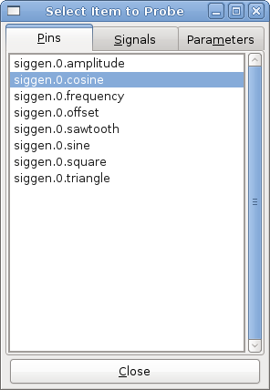
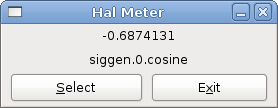

:lang: en
:toc:

[[cha:hal-tutorial]]
= HAL Tutorial

(((HAL Tutorial)))

== Introduction

Configuration moves from theory to device -- HAL device that is.
For those who have had just a bit of computer programming,
this section is the 'Hello World' of the HAL.

`halrun` can be used to create a working system.
It is a command line or text file tool for configuration and tuning.
The following examples illustrate its setup and operation.

[[haltut-halcmd]]
== Halcmd

(((Halcmd Tutorial)))
`halcmd` is a command line tool for manipulating HAL. A more complete man
page exists for halcmd and installed together with LinuxCNC, from source
or from a package. If LinuxCNC has been compiled as _run-in-place_, the
man page is not installed but is accessible in the LinuxCNC main directory
with the following command:

----
$ man -M docs/man halcmd
----

=== Notation

For this tutorial, commands for the operating system are typically shown without the prompt provided by the UNIX shell, i.e typically a dollar sign ($) or a hash/double cross (#).
When communicating directly with the HAL through `halcmd` or `halrun`, the prompts are shown in the examples.
The terminal window is in 'Applications/Accessories' from the main Ubuntu menu bar.

.Terminal Command Example - prompts
----
me@computer:~linuxcnc$ halrun
(will be shown like the following line)
halrun

(the halcmd: prompt will be shown when running HAL)
halcmd: loadrt counter
halcmd: show pin
----

=== Tab-completion

Your version of `halcmd` may include tab-completion.
Instead of completing file names as a shell does, it completes commands with HAL identifiers.
You will have to type enough letters for a unique match.
Try pressing tab after starting a HAL command:

.Tab-completion
----
halcmd: loa<TAB>
halcmd: load
halcmd: loadrt
halcmd: loadrt cou<TAB>
halcmd: loadrt counter
----

=== The RTAPI environment

RTAPI stands for Real Time Application Programming Interface. Many HAL
components work in realtime, and all HAL components store data in
shared memory so realtime components can access it. Regular Linux does
not support realtime programming or the type of shared memory that HAL
needs. Fortunately, there are realtime operating systems (RTOS's) that
provide the necessary extensions to Linux. Unfortunately, each RTOS
does things a little differently.

To address these differences, the LinuxCNC team came up with RTAPI, which
provides a consistent way for programs to talk to the RTOS. If you are
a programmer who wants to work on the internals of LinuxCNC, you may want to
study 'linuxcnc/src/rtapi/rtapi.h' to understand the API.
But if you are a normal person, all you need to
know about RTAPI is that it (and the RTOS) needs to be loaded into the
memory of your computer before you do anything with HAL.

== A Simple Example

=== Loading a component

For this tutorial, we are going to assume that you have successfully
installed the Live CD and, if using a RIP footnote:[Run In Place, when the
source files have been downloaded to a user directory and are compiled and executed directly from there.], invoke the
'rip-environment' script to prepare your shell.
In that case, all you need to do is
load the required RTOS and RTAPI modules into memory.
Just run the following command from a terminal window:

// FIXME: add link to rip-environment explanation

.Loading HAL
----
cd linuxcnc
halrun
halcmd:
----

With the realtime OS and RTAPI loaded, we can move into the first
example. Notice that the prompt is now shown as 'halcmd:'.
This is because subsequent commands will be interpreted as HAL commands,
not shell commands.

For the first example, we will use a HAL component called 'siggen',
which is a simple signal generator. A complete description of the
'siggen' component can be found in the <<sec:siggen,SigGen>> section of
this Manual.
It is a realtime component.
To load the "`siggen`" component, use the HAL command `loadrt`.

.Loading siggen
----
halcmd: loadrt siggen
----

[[sec:tutorial-halcmd]]
=== Examining the HAL

Now that the module is loaded, it is time to introduce `halcmd`, the
command line tool used to configure the HAL.
This tutorial will introduce only a selection of halcmd features.
For a more complete description try `man halcmd`,
or see the reference in <<sec:hal-commands,HAL Commands>> section of this document.
The first halcmd feature is the 'show' command.
This command displays information about the current state of the HAL.
To show all installed components:

.Show Components with `halrun`/`halcmd`
----
halcmd: show comp

    Loaded HAL Components:
    ID     Type  Name                                PID   State
    3      RT    siggen                                    ready
    2      User  halcmd2177                          2177  ready
----

Since _halcmd_ itself is also a HAL component, it will always show up in the list.
The number after "`halcmd`" in the component list is the UNIX process ID.
It is possible to run more than one copy of halcmd at the same time (in different terminal windows for example),
so the PID is added to the end of the name to make it unique.
The list also shows the 'siggen' component that we installed in the previous step.
The 'RT' under 'Type' indicates that 'siggen' is a realtime component.
The 'User' under 'Type' indicates it is a non-realtime component.

Next, let's see what pins `siggen` makes available:

.Show Pins
----
halcmd: show pin

Component Pins:
Owner   Type   Dir        Value  Name
     3  float  IN             1  siggen.0.amplitude
     3  bit    OUT        FALSE  siggen.0.clock
     3  float  OUT            0  siggen.0.cosine
     3  float  IN             1  siggen.0.frequency
     3  float  IN             0  siggen.0.offset
     3  float  OUT            0  siggen.0.sawtooth
     3  float  OUT            0  siggen.0.sine
     3  float  OUT            0  siggen.0.square
     3  float  OUT            0  siggen.0.triangle
----

This command displays all of the pins in the current HAL.
A complex system could have dozens or hundreds of pins.
But right now there are only nine pins.
Of these pins eight are floating point and one is bit (boolean).
Six carry data out of the 'siggen' component and three are used to transfer settings into the component.
Since we have not yet executed the code contained within the component, some the pins have a value of zero.

The next step is to look at parameters:

.Show Parameters
----
halcmd: show param

Parameters:
Owner   Type  Dir        Value   Name
     3  s32   RO             0   siggen.0.update.time
     3  s32   RW             0   siggen.0.update.tmax
----

The 'show param' command shows all the parameters in the HAL.
Right now, each parameter has the default value it was given when the component was loaded.
Note the column labeled 'Dir'.
The parameters labeled '-W' are writable ones that are never changed by the component itself,
instead they are meant to be changed by the user to control the component.
We will see how to do this later.
Parameters labeled 'R-' are read only parameters.
They can be changed only by the component.
Finally, parameter labeled 'RW' are read-write parameters.
That means that they are changed by the component, but can also be changed by the user.
Note: The parameters `siggen.0.update.time` and `siggen.0.update.tmax` are for debugging
purposes and won't be covered in this section.

Most realtime components export one or more functions to actually run the realtime code they contain.
Let's see what function(s) 'siggen' exported:

.Show Functions with `halcmd``
----
halcmd: show funct

Exported Functions:
Owner   CodeAddr  Arg       FP   Users  Name
00003   f801b000  fae820b8  YES      0  siggen.0.update
----

The siggen component exported a single function.
It is not currently linked to any threads, so 'users' is
zero footnote:[CodeAddr and Arg fields were used during development and
should probably disappear.].

=== Making realtime code run

To actually run the code contained in the function `siggen.0.update`, we need a realtime thread.
The component called 'threads' that is used to create a new thread.
Lets create a thread called "test-thread" with a period of 1 ms (1,000 µs or 1,000,000 ns):

----
halcmd: loadrt threads name1=test-thread period1=1000000
----

Let's see if that worked:

.Show Threads
----
halcmd: show thread

Realtime Threads:
     Period  FP     Name               (     Time, Max-Time )
     999855  YES    test-thread        (        0,        0 )
----

It did. The period is not exactly 1,000,000 ns because of hardware
limitations, but we have a thread that runs at approximately the
correct rate.
The next step is to connect the function to the thread:

.Add Function
----
halcmd: addf siggen.0.update test-thread
----

Up till now, we've been using `halcmd` only to look at the HAL.
However, this time we used the `addf` (add function) command to actually change something in the HAL.
We told 'halcmd' to add the function `siggen.0.update` to the thread 'test-thread',
and if we look at the thread list again, we see that it succeeded:

----
halcmd: show thread

Realtime Threads:
     Period  FP     Name                (     Time, Max-Time )
     999855  YES    test-thread         (        0,        0 )
                  1 siggen.0.update
----

There is one more step needed before the 'siggen' component starts generating signals.
When the HAL is first started, the thread(s) are not actually running.
This is to allow you to completely configure the system before the realtime code starts.
Once you are happy with the configuration, you can start the realtime code like this:

----
halcmd: start
----

Now the signal generator is running. Let's look at its output pins:

----
halcmd: show pin

Component Pins:
Owner   Type  Dir         Value  Name
     3  float IN              1  siggen.0.amplitude
     3  bit   OUT         FALSE  siggen.0.clock
     3  float OUT    -0.1640929  siggen.0.cosine
     3  float IN              1  siggen.0.frequency
     3  float IN              0  siggen.0.offset
     3  float OUT    -0.4475303  siggen.0.sawtooth
     3  float OUT     0.9864449  siggen.0.sine
     3  float OUT            -1  siggen.0.square
     3  float OUT    -0.1049393  siggen.0.triangle
----

And let's look again:

----
halcmd: show pin

Component Pins:
Owner   Type  Dir         Value  Name
     3  float IN              1  siggen.0.amplitude
     3  bit   OUT         FALSE  siggen.0.clock
     3  float OUT     0.0507619  siggen.0.cosine
     3  float IN              1  siggen.0.frequency
     3  float IN              0  siggen.0.offset
     3  float OUT     -0.516165  siggen.0.sawtooth
     3  float OUT     0.9987108  siggen.0.sine
     3  float OUT            -1  siggen.0.square
     3  float OUT    0.03232994  siggen.0.triangle
----

We did two `show pin` commands in quick succession, and you can see that the outputs are no longer zero.
The sine, cosine, sawtooth, and triangle outputs are changing constantly.
The square output is also working, however it simply switches from +1.0 to -1.0 every cycle.

=== Changing Parameters

The real power of HAL is that you can change things.
For example, we can use the `setp` command to set the value of a parameter.
Let's change the amplitude of the signal generator from 1.0 to 5.0:

.Set Pin
----
halcmd: setp siggen.0.amplitude 5
----

.Check the parameters and pins again
----
halcmd: show param

Parameters:
Owner   Type  Dir         Value  Name
     3  s32   RO           1754  siggen.0.update.time
     3  s32   RW          16997  siggen.0.update.tmax

halcmd: show pin

Component Pins:
Owner   Type  Dir         Value  Name
     3  float IN              5  siggen.0.amplitude
     3  bit   OUT         FALSE  siggen.0.clock
     3  float OUT     0.8515425  siggen.0.cosine
     3  float IN              1  siggen.0.frequency
     3  float IN              0  siggen.0.offset
     3  float OUT      2.772382  siggen.0.sawtooth
     3  float OUT     -4.926954  siggen.0.sine
     3  float OUT             5  siggen.0.square
     3  float OUT      0.544764  siggen.0.triangle
----

Note that the value of parameter `siggen.0.amplitude` has changed to 5,
and that the pins now have larger values.

=== Saving the HAL configuration

Most of what we have done with `halcmd` so far has simply been viewing things with the 'show' command.
However two of the commands actually changed things.
As we design more complex systems with HAL, we will use many commands to configure things just the way we want them.
HAL has the memory of an elephant, and will retain that configuration until we shut it down.
But what about next time?
We don't want to manually enter a bunch of commands every time we want to use the system.

.Saving the configuration of the entire HAL with a single command.
----
halcmd: save

# components
loadrt threads name1=test-thread period1=1000000
loadrt siggen
# pin aliases
# signals
# nets
# parameter values
setp siggen.0.update.tmax 14687
# realtime thread/function links
addf siggen.0.update test-thread
----

The output of the `save` command is a sequence of HAL commands.
If you start with an _empty_ HAL and run all these commands,
you will get the configuration that existed when the 'save' command was issued.
To save these commands for later use, we simply redirect the output to a file:

.Save configuration to a file with `halcmd`
----
halcmd: save all saved.hal
----

=== Exiting halrun

When you're finished with your HAL session type `exit` at the "`halcmd:`" prompt.
This will return you to the system prompt and close down the HAL session.
Do not simply close the terminal window without shutting down the HAL session.

.Exit HAL
----
halcmd: exit
----

=== Restoring the HAL configuration

To restore the HAL configuration stored in the file "saved.hal", we need to execute all of those HAL commands.
To do that, we use "`-f _<file name>_`" which reads commands from a file, and "`-I`" (upper case i) which shows
the halcmd prompt after executing the commands:

.Run a Saved File
----
halrun -I -f saved.hal
----

Notice that there is not a "start" command in saved.hal.
It's necessary to issue it again (or edit the file saved.hal to add it there).

=== Removing HAL from memory

If an unexpected shutdown of a HAL session occurs you might have to
unload HAL before another session can begin.
To do this type the following command in a terminal window.

.Removing HAL
----
halrun -U
----

== Stepgen Example

(((stepgen Example)))
Up till now we have only loaded one HAL component. But the whole idea
behind the HAL is to allow you to load and connect a number of simple
components to make up a complex system. The next example will use two
components.

Before we can begin building this new example, we want to start with a
clean slate. If you just finished one of the previous examples, we need
to remove the all components and reload the RTAPI and HAL libraries.

----
halcmd: exit
----

=== Installing the components

Now we are going to load the step pulse generator component. For a
detailed description of this component refer to the stepgen section of the
Integrator Manual. In this example we will use the 'velocity' control
type of StepGen.  For now, we can skip the details, and just run the
following commands.

In this example we will use the _velocity_ control type from the `stepgen`
component.

----
halrun
halcmd: loadrt stepgen step_type=0,0 ctrl_type=v,v
halcmd: loadrt siggen
halcmd: loadrt threads name1=fast period1=50000 name2=slow period2=1000000
----

The first command loads two step generators, both configured to generate stepping type 0.
The second command loads our old friend siggen, and the third one creates two threads,
a fast one with a period of 50 microseconds (µs) and a slow one with a period of 1 millisecond (ms).

NOTE: The `fp1=` parameter is deprecated and ignored.
All threads now unconditionally support floating point.

As before, we can use `halcmd show` to take a look at the HAL.
This time we have a lot more pins and parameters than before:

----
halcmd: show pin

Component Pins:
Owner   Type  Dir         Value  Name
     4  float IN              1  siggen.0.amplitude
     4  bit   OUT         FALSE  siggen.0.clock
     4  float OUT             0  siggen.0.cosine
     4  float IN              1  siggen.0.frequency
     4  float IN              0  siggen.0.offset
     4  float OUT             0  siggen.0.sawtooth
     4  float OUT             0  siggen.0.sine
     4  float OUT             0  siggen.0.square
     4  float OUT             0  siggen.0.triangle
     3  s32   OUT             0  stepgen.0.counts
     3  bit   OUT         FALSE  stepgen.0.dir
     3  bit   IN          FALSE  stepgen.0.enable
     3  float OUT             0  stepgen.0.position-fb
     3  bit   OUT         FALSE  stepgen.0.step
     3  float IN              0  stepgen.0.velocity-cmd
     3  s32   OUT             0  stepgen.1.counts
     3  bit   OUT         FALSE  stepgen.1.dir
     3  bit   IN          FALSE  stepgen.1.enable
     3  float OUT             0  stepgen.1.position-fb
     3  bit   OUT         FALSE  stepgen.1.step
     3  float IN              0  stepgen.1.velocity-cmd

halcmd: show param

Parameters:
Owner   Type  Dir         Value  Name
     4  s32   RO              0  siggen.0.update.time
     4  s32   RW              0  siggen.0.update.tmax
     3  u32   RW     0x00000001  stepgen.0.dirhold
     3  u32   RW     0x00000001  stepgen.0.dirsetup
     3  float RO              0  stepgen.0.frequency
     3  float RW              0  stepgen.0.maxaccel
     3  float RW              0  stepgen.0.maxvel
     3  float RW              1  stepgen.0.position-scale
     3  s32   RO              0  stepgen.0.rawcounts
     3  u32   RW     0x00000001  stepgen.0.steplen
     3  u32   RW     0x00000001  stepgen.0.stepspace
     3  u32   RW     0x00000001  stepgen.1.dirhold
     3  u32   RW     0x00000001  stepgen.1.dirsetup
     3  float RO              0  stepgen.1.frequency
     3  float RW              0  stepgen.1.maxaccel
     3  float RW              0  stepgen.1.maxvel
     3  float RW              1  stepgen.1.position-scale
     3  s32   RO              0  stepgen.1.rawcounts
     3  u32   RW     0x00000001  stepgen.1.steplen
     3  u32   RW     0x00000001  stepgen.1.stepspace
     3  s32   RO              0  stepgen.capture-position.time
     3  s32   RW              0  stepgen.capture-position.tmax
     3  s32   RO              0  stepgen.make-pulses.time
     3  s32   RW              0  stepgen.make-pulses.tmax
     3  s32   RO              0  stepgen.update-freq.time
     3  s32   RW              0  stepgen.update-freq.tmax
----

=== Connecting pins with signals

What we have is two step pulse generators, and a signal generator. Now
it is time to create some HAL signals to connect the two components. We
are going to pretend that the two step pulse generators are driving the
X and Y axis of a machine. We want to move the table in circles. To do
this, we will send a cosine signal to the X axis, and a sine signal to
the Y axis. The siggen module creates the sine and cosine, but we need
'wires' to connect the modules together. In the HAL, 'wires' are called
signals. We need to create two of them. We can call them anything we
want, for this example they will be 'X-vel' and 'Y-vel'. The signal
'X-vel' is intended to run from the cosine output of the signal
generator to the velocity input of the first step pulse generator.
The first step is to connect the signal to the signal generator output.
To connect a signal to a pin we use the net command.

.net command
----
halcmd: net X-vel <= siggen.0.cosine
----

To see the effect of the `net` command, we show the signals again.

----
halcmd: show sig

Signals:
Type          Value  Name     (linked to)
float             0  X-vel <== siggen.0.cosine
----

When a signal is connected to one or more pins, the show command lists
the pins immediately following the signal name. The 'arrow' shows the
direction of data flow - in this case, data flows from pin
`siggen.0.cosine` to signal `X-vel`. Now let's connect the `X-vel` to
the velocity input of a step pulse generator.

----
halcmd: net X-vel => stepgen.0.velocity-cmd
----

We can also connect up the Y axis signal `Y-vel`.
It is intended to run from the sine output of the signal generator
to the input of the second step pulse generator.
The following command accomplishes in one line what two `net` commands accomplished for `X-vel`.

----
halcmd: net Y-vel siggen.0.sine => stepgen.1.velocity-cmd
----

Now let's take a final look at the signals and the pins connected to them.

----
halcmd: show sig

Signals:
Type          Value  Name     (linked to)
float             0  X-vel <== siggen.0.cosine
                           ==> stepgen.0.velocity-cmd
float             0  Y-vel <== siggen.0.sine
                           ==> stepgen.1.velocity-cmd
----

The 'show sig' command makes it clear exactly how data flows through the HAL.
For example, the 'X-vel' signal comes from pin `siggen.0.cosine`, and goes to pin `stepgen.0.velocity-cmd`.

=== Setting up realtime execution - threads and functions

Thinking about data flowing through "wires" makes pins and signals fairly easy to understand.
Threads and functions are a little more difficult.
Functions contain the computer instructions that actually get things done.
Thread are the method used to make those instructions run when they are needed.
First let's look at the functions available to us.

----
halcmd: show funct

Exported Functions:
Owner   CodeAddr  Arg       FP   Users  Name
 00004  f9992000  fc731278  YES      0   siggen.0.update
 00003  f998b20f  fc7310b8  YES      0   stepgen.capture-position
 00003  f998b000  fc7310b8  NO       0   stepgen.make-pulses
 00003  f998b307  fc7310b8  YES      0   stepgen.update-freq
----

In general, you will have to refer to the documentation for each
component to see what its functions do. In this case, the function
`siggen.0.update` is used to update the outputs of the signal
generator. Every time it is executed, it calculates the values of
the sine, cosine, triangle, and square outputs. To make smooth
signals, it needs to run at specific intervals.

The other three functions are related to the step pulse generators.

The first one, `stepgen.capture_position`, is used for position feedback.
It captures the value of an internal counter that counts the step pulses as they are generated.
Assuming no missed steps, this counter indicates the position of the motor.

The main function for the step pulse generator is `stepgen.make_pulses`.
Every time 'make_pulses' runs it decides if it
is time to take a step, and if so sets the outputs accordingly.
For smooth step pulses, it should run as frequently as possible.
Because it needs to run so fast, 'make_pulses'
is highly optimized and performs only a few calculations.

The last function, `stepgen.update-freq`, is responsible for doing
scaling and some other calculations that need to be performed
only when the frequency command changes.

What this means for our example is that we want to run `siggen.0.update`
at a moderate rate to calculate the sine and cosine values.
Immediately after we run `siggen.0.update`, we want to run
`stepgen.update_freq` to load the new values into the step pulse generator.
Finally we need to run `stepgen.make_pulses` as fast as possible for smooth pulses.
Because we don't use position feedback, we don't need to run `stepgen.capture_position` at all.

We run functions by adding them to threads.
Each thread runs at a specific rate.
Let's see what threads we have available.

----
halcmd: show thread

Realtime Threads:
     Period  FP     Name               (     Time, Max-Time )
     996980  YES                  slow (        0,        0 )
      49849  YES                  fast (        0,        0 )
----

The two threads were created when we loaded `threads`.
The first one, 'slow', runs every millisecond.
We will use it for `siggen.0.update` and `stepgen.update_freq`.
The second thread is 'fast', which runs every 50 microseconds (µs).
We will use it for `stepgen.make_pulses`.
To connect the functions to the proper thread, we use the `addf` command.
We specify the function first, followed by the thread.

----
halcmd: addf siggen.0.update slow
halcmd: addf stepgen.update-freq slow
halcmd: addf stepgen.make-pulses fast
----

After we give these commands, we can run the `show thread` command again to see what happened.

----
halcmd: show thread

Realtime Threads:
     Period  FP     Name               (     Time, Max-Time )
     996980  YES                  slow (        0,        0 )
                  1 siggen.0.update
                  2 stepgen.update-freq
      49849  NO                   fast (        0,        0 )
                  1 stepgen.make-pulses
----

Now each thread is followed by the names of the functions, in the
order in which the functions will run.

=== Setting parameters

We are almost ready to start our HAL system.
However we still need to adjust a few parameters.
By default, the siggen component generates signals that swing from +1 to -1.
For our example that is fine, we want the table speed to vary from +1 to -1 inches per second.
However the scaling of the step pulse generator isn't quite right.
By default, it generates an output frequency of 1 step per second with an input of 1.0.
It is unlikely that one step per second will give us one inch per second of table movement.
Let's assume instead that we have a 5 turn per inch leadscrew, connected to a 200 step per rev stepper with 10x microstepping.
So it takes 2000 steps for one revolution of the screw, and 5 revolutions to travel one inch.
That means the overall scaling is 10000 steps per inch.
We need to multiply the velocity input to the step pulse generator by 10000 to get the proper output.
That is exactly what the parameter `stepgen.n.velocity-scale` is for.
In this case, both the X and Y axis have the same scaling, so we set the scaling parameters for both to 10000.

----
halcmd: setp stepgen.0.position-scale 10000
halcmd: setp stepgen.1.position-scale 10000
halcmd: setp stepgen.0.enable 1
halcmd: setp stepgen.1.enable 1
----

This velocity scaling means that when the pin `stepgen.0.velocity-cmd` is 1.0,
the step generator will generate 10000 pulses per second (10 kHz).
With the motor and leadscrew described above, that will result in the axis moving at exactly 1.0 inches per second.
This illustrates a key HAL concept - things like scaling are done at the lowest possible level,
in this case in the step pulse generator.
The internal signal `X-vel` is the velocity of the table in inches per second,
and other components such as `siggen` don't know (or care) about the scaling at all.
If we changed the leadscrew, or motor, we would change only the scaling parameter of the step pulse generator.

=== Run it!

We now have everything configured and are ready to start it up.
Just like in the first example, we use the `start` command.

----
halcmd: start
----

Although nothing appears to happen, inside the computer the step pulse
generator is cranking out step pulses, varying from 10 kHz forward to
10 kHz reverse and back again every second. Later in this tutorial we'll
see how to bring those internal signals out to run motors in the real
world, but first we want to look at them and see what is happening.

[[sec:tutorial-halmeter]]
== Halmeter

(((Halmeter,Tutorial Halmeter)))
You can build very complex HAL systems without ever using a graphical
interface. However there is something satisfying about seeing the
result of your work. The first and simplest GUI tool for the HAL is
halmeter. It is a very simple program that is the HAL equivalent of the
handy multimeter (or analog meter for the old timers).

It allows to observe the pins, signals or parameters by displaying the current value of these entities.
It is very easy to use application for graphical environments.
In a console type:

----
halmeter
----

//FIXME Add halmeter screenshot(s)

Two windows will appear. The selection window is the largest and includes
three tabs:

* One lists all the pins currently defined in HAL,
* one lists all the signals,
* one lists all the parameters.

Click on a tab, then click on one of the items to select it. The small
window will show the name and value of the selected item.
The display is updated approximately 10 times per second. To free screen
space, the selection window can be closed with the _Close_ button.
On the little window, hidden under the selection window at program launch,
the _Select_ button, re-opens the selection window and the _Exit_ button
stops the program and closes both windows.

It is possible to run several halmeters simultaneously, which makes it
possible to visualize several items at the same time. To open a halmeter
and release the console by running it in the background, run the following command:

----
halmeter &
----

It is possible to launch halmeter and make it immediately display an item.
For this, add  _pin|sig|par[am] name_ arguments on the command line. It
will display the signal, pin, or parameter _name_ as soon as it
will start. If the indicated item does not exist, it will start normally.

//FIXME Add halmeter command example for direct item display

Finally, if an item is specified for display, it is possible
add _-s_ in front of pin|sig|param to tell halmeter to use
an even smaller window. The item name will be displayed in the
title bar instead of below the value and there will be no button.
This is useful for displaying a lot of halmeters in a small space.

//FIXME Add halmeter run with '-s' screenshot

We will use the siggen component again to check out halmeter. If you
just finished the previous example, then you can load siggen using the
saved file. If not, we can load it just like we did before:

----
halrun
halcmd: loadrt siggen
halcmd: loadrt threads name1=test-thread period1=1000000
halcmd: addf siggen.0.update test-thread
halcmd: start
halcmd: setp siggen.0.amplitude 5
----

At this point we have the siggen component loaded and running.
It's time to start halmeter.

.Starting Halmeter
----
halcmd: loadusr halmeter
----

The first window you will see is the "Select Item to Probe" window.

.Halmeter Select Window

This dialog has three tabs. The first tab displays all of the HAL pins in the system.
The second one displays all the signals, and the third displays all the parameters.
We would like to look at the pin `siggen.0.cosine` first, so click on it then click the "Close" button.
The probe selection dialog will close, and the meter looks something like the following figure.

.Halmeter Window

To change what the meter displays press the "Select" button which
brings back the "Select Item to Probe" window.

You should see the value changing as siggen generates its cosine wave.
Halmeter refreshes its display about 5 times per second.

To shut down halmeter, just click the exit button.

If you want to look at more than one pin, signal, or parameter at a
time, you can just start more halmeters. The halmeter window was
intentionally made very small so you could have a lot of them on the
screen at once.

include::halshow.adoc[]
include::halscope.adoc[]
// vim: set syntax=asciidoc:

